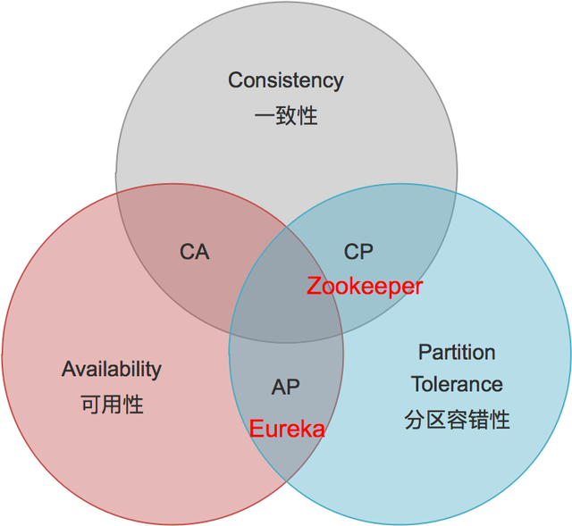

# 1.微服务简介
@include(@src/public/enhance/guidance/backend/springcloud/springcloud-eureka/chapter/springcloud-eureka-guidance-chapter1.md)
## <a href="https://martinfowler.com/articles/microservices.html" target="_blank">1.1.Martin Fowler微服务论文英文原版</a>
```
https://martinfowler.com/articles/microservices.html
```
## <a href="https://martinfowler.com/articles/microservices.html" target="_blank">1.2.Martin Fowler微服务论文国内译版</a>
	如需国内译版,请使用谷歌翻译插件翻译自行翻译

## 1.5.微服务架构图
::: center
<div class="imgbg-customer">
</div>

:::

## 1.6.CAP中占据情况
	Eureka在CAP中占据AP
::: center
<div class="imgbg-customer">
</div>

:::

## 1.7.微服务架构落地实现方案
	微服务架构落地实现有很多种方案,本次介绍的方案技术栈如下:
	注册中心: EUREKA 
## <a href="https://gitee.com/lingwh1995/springcloud-eureka.git"  target="_blank">1.6.项目源代码</a>
```
https://gitee.com/lingwh1995/springcloud-eureka.git
```

