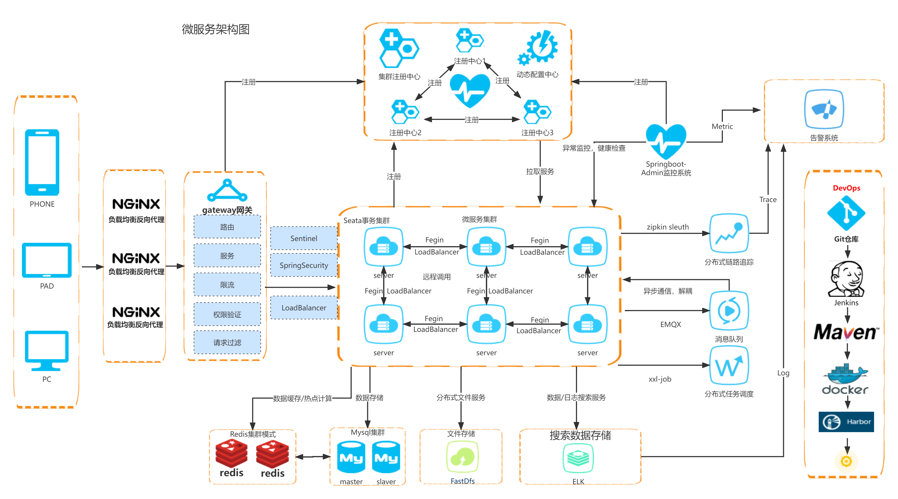

# 1.微服务简介
@include(@src/public/enhance/guidance/backend/springcloud/springcloud-eureka/chapter/springcloud-eureka-guidance-chapter1.md)
## 1.3.Martin Fowler微服务论文英文原版
```
https://martinfowler.com/articles/microservices.html
```
## 1.4.Martin Fowler微服务论文国内译版
	如需国内译版,请使用谷歌翻译插件翻译自行翻译

## 1.5.微服务架构图


## 1.6.微服务架构落地实现方案

