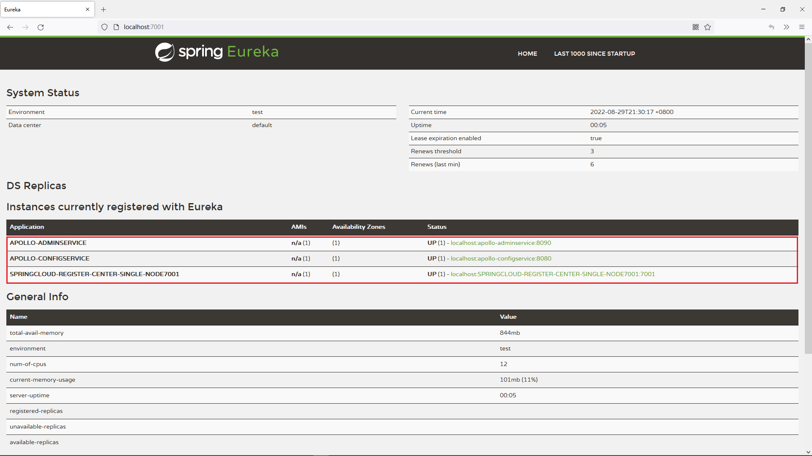
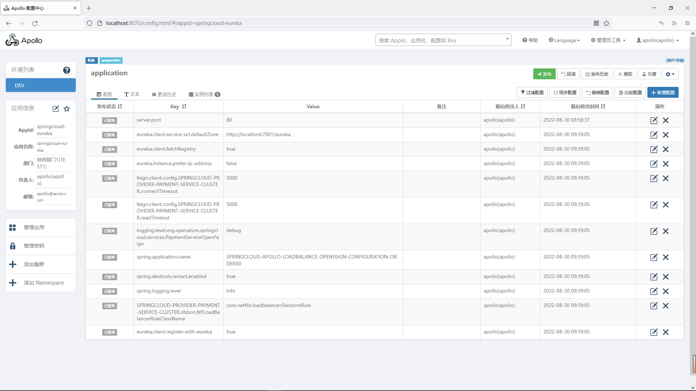

# 11.使用Apollo配置中心管理配置
@include(@src/public/enhance/guidance/backend/springcloud/springcloud-eureka/chapter/springcloud-eureka-guidance-chapter11.md)
## 11.3.Apollo配置中心简介
	Apollo(阿波罗)是一款可靠的分布式配置管理中心，诞生于携程框架研发部，能够集中化管理应用不同环境、不同集群的配置，配置修改后能够实时推送到应用端，并且具备规范的权限、流程治理等特性，适用于微服务配置管理场景。

<a href="https://www.apolloconfig.com" target="_blank">官方网址</a>
```
https://www.apolloconfig.com
```
<a href="https://github.com/apolloconfig" target="_blank">官网网址(GITHUB)</a>
```
https://github.com/apolloconfig
```

## 11.4.搭建Apollo配置中心
<a href="/pure/blogs/environment/windows/windows-server2016/shardings/windows-server2016-chapter-2.搭建SpringCloud技术栈所需组件.html#_2-4-3-1-单环境版" target="_blank">基于独立部署的Eureka搭建Apollo配置中心-单环境版(Windows版)</a>

## 11.5.搭建服务消费者(Apollo)
### 11.5.1.章节内容简介
    本章节会展示如何使用Apollo配置中心来管理配置
### 11.5.2.模块简介
    使用了Apollo配置中心的服务消费者,启动端口: 80
### 11.5.3.模块目录结构
```md
@include(../projects/springcloud-eureka/springcloud-config-apollo-loadbalance-openfeign-configuration-order80/tree.md)
```
### 11.5.4.创建模块
	在父工程(springcloud-eureka)中创建一个名为springcloud-config-apollo-loadbalance-openfeign-configuration-order80的maven模块,注意:当前模块创建成功后,在父工程pom.xml中<modules></modules>中会自动生成有关当前模块的信息
### 11.5.5.编写模块pom.xml
```xml
@include(../projects/springcloud-eureka/springcloud-config-apollo-loadbalance-openfeign-configuration-order80/pom.xml)
```
### 11.5.6.编写模块application.yml
```yml
@include(../projects/springcloud-eureka/springcloud-config-apollo-loadbalance-openfeign-configuration-order80/src/main/resources/application.yml)
```
### 11.5.7.编写模块Apollo配置文件
```sql
@include(../projects/springcloud-eureka/springcloud-config-apollo-loadbalance-openfeign-configuration-order80/src/main/resources/apollo-env.properties)
```
### 11.5.8.编写模块config
```java
@include(../projects/springcloud-eureka/springcloud-config-apollo-loadbalance-openfeign-configuration-order80/src/main/java/org/openatom/springcloud/config/OpenFeignConfig.java)
```
### 11.5.9.编写模块service
```java
@include(../projects/springcloud-eureka/springcloud-config-apollo-loadbalance-openfeign-configuration-order80/src/main/java/org/openatom/springcloud/service/PaymentServiceOpenFeign.java)
```
### 11.5.10.编写模块listener
```java
@include(../projects/springcloud-eureka/springcloud-config-apollo-loadbalance-openfeign-configuration-order80/src/main/java/org/openatom/springcloud/listener/ApolloPropertiesChangedListener.java)
```
### 11.5.11.编写模块controller
    ApolloConfigController.java
```java
@include(../projects/springcloud-eureka/springcloud-config-apollo-loadbalance-openfeign-configuration-order80/src/main/java/org/openatom/springcloud/controller/ApolloConfigController.java)
```
    OrderConsumerController.java
```java
@include(../projects/springcloud-eureka/springcloud-config-apollo-loadbalance-openfeign-configuration-order80/src/main/java/org/openatom/springcloud/controller/OrderConsumerController.java)
```
### 11.5.12.编写模块主启动类
```java
@include(../projects/springcloud-eureka/springcloud-config-apollo-loadbalance-openfeign-configuration-order80/src/main/java/org/openatom/springcloud/OrderServiceConsumerApolloLoadBalanceOpenFeignConfiguration80.java)
```
### 11.5.13.测试模块
#### 11.5.13.1.访问Apollo主界面
    启动相关服务


    Eureka注册中心
```
http://localhost:7001/
```
    看到如下界面代表apollo的adminservice服务和configservice服务启动成功
::: center
<div class="imgbg-customer">

</div>
:::

    Apollo配置中心
```
http://localhost:8070/
```
::: center
<div class="imgbg-customer">

</div>
:::
    登录用户名/密码: apollo/admin

#### 11.5.13.2.配置Apollo系统参数
    添加系统参数


	添加新部门(可选)
	key
```
organizations
```
	value
```
[{"orgId":"TEST1","orgName":"样例部门1"},{"orgId":"TEST2","orgName":"样例部门2"},{"orgId":"micro_service","orgName":"微服务部门"}]
```

#### 11.5.13.3.在Apollo中创建项目
    创建项目

    应用信息中AppId值和application.yml中保持一致
    app:
      id: springcloud-eureka

    新增配置


    编辑配置


    具体文本配置内容如下
```
server.port = 80
eureka.client.service-url.defaultZone = http://localhost:7001/eureka
eureka.client.fetchRegistry = true
eureka.instance.prefer-ip-address = false
feign.client.config.SPRINGCLOUD-PROVIDER-PAYMENT-SERVICE-CLUSTER.connectTimeout = 5000
feign.client.config.SPRINGCLOUD-PROVIDER-PAYMENT-SERVICE-CLUSTER.readTimeout = 5000
logging.level.org.openatom.springcloud.services.PaymentServiceOpenFeign = debug
spring.application.name = SPRINGCLOUD-APOLLO-LOADBALANCE-OPENFEIGN-CONFIGURATION-ORDER80
spring.devtools.restart.enabled = true
spring.logging.level = info
SPRINGCLOUD-PROVIDER-PAYMENT-SERVICE-CLUSTER.ribbon.NFLoadBalancerRuleClassName = com.netflix.loadbalancer.RandomRule
eureka.client.register-with-eureka = true
```
    此时界面上显示出了刚才添加的配置
::: center
<div class="imgbg-customer">

</div>
:::

#### 11.5.13.4.启动当前模块
    在idea中给当前模块配置jvm启动参数
```
    -Denv=DEV -Dapollo.cacheDir=D:\repository\cache\apollo -Dapollo.cluster=DEFAULT
```
    -Denv=DEV代表可以获取到Apollo中DEV环境的参数

    配置好jvm参数后,在idea中启动当前模块,如果项目可以正常启动,说明已经从Apollo中读取到了配置
#### 11.5.13.5.测试Apollo
    在浏览器中访问
```
http://localhost/consumer/apollo/test
```
    返回结果
SPRINGCLOUD-APOLLO-LOADBALANCE-OPENFEIGN-CONFIGURATION-ORDER80
    这个结果是从Apollo中获取到的服务名

    在Apollo中修改spring.application.name的值为
    SPRINGCLOUD-APOLLO-LOADBALANCE-OPENFEIGN-CONFIGURATION-ORDER80-XXX
    再次访问
```
http://localhost/consumer/apollo/test
```
    返回结果
    SPRINGCLOUD-APOLLO-LOADBALANCE-OPENFEIGN-CONFIGURATION-ORDER80-XXX
    此时获取到的服务名已经变成了刚才修改后的服务名

    到idea控制台中查看
    a.输出了如下内容,这说明监听器也监听到了Apollo中配置文件的变化
    ConfigChange{namespace='application', propertyName='spring.application.name', oldValue='SPRINGCLOUD-APOLLO-LOADBALANCE-OPENFEIGN-CONFIGURATION-ORDER80', newValue='SPRINGCLOUD-APOLLO-LOADBALANCE-OPENFEIGN-CONFIGURATION-ORDER80-XXX', changeType=MODIFIED}
    b.服务自动重启了
    这是因为在编写当前模块的监听器时,里面的逻辑是当监听到了Apollo中配置文件的变化,就自动重启服务

    拓展:如何实现SpringCloud项目的自动重启
    a.application.yml中添加配置
```
server:
  tomcat:
    mbeanregistry:
      enabled: true

management:
  endpoint:
    restart:
      enabled: true
```
    b.编写重启方法
```
    @Autowired
    private RestartEndpoint restartEndpoint;

    /**
     * 访问这个地址可以重启SpringBoot项目
     */
    public String restartApplication(){
        restartEndpoint.restart();
        return "请稍后,应用程序正在重启...";
    }
```
    这个方法可以直接调用触发(如当前模块中由在监听器中调用触发重启的方法),可以通过REST API触发,如
```java
@include(../projects/springcloud-eureka/springcloud-config-apollo-loadbalance-openfeign-configuration-order80/src/main/java/org/openatom/springcloud/controller/RestartApplicationController.java)
```


<ScrollIntoPageView/>
<HideSideBar/>
