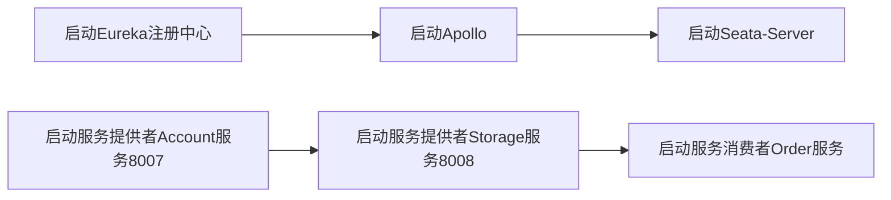

# 12.使用Seata进行分布式事务控制
@include(@src/public/enhance/guidance/backend/springcloud/springcloud-eureka/chapter/springcloud-eureka-guidance-chapter12.md)
## 12.3.Seata简介
    Seata 是一款开源的分布式事务解决方案，致力于提供高性能和简单易用的分布式事务服务。Seata 将为用户提供了 AT、TCC、SAGA 和 XA 事务模式，为用户打造一站式的分布式解决方案。
<a href="https://seata.io/zh-cn/" target="_blank">官方网址</a>
```
https://seata.io/zh-cn/
```

## 12.4.搭建Seata Server
    在localhost上搭建Seata Server
详细参考-> <a href="/blogs/environment/centos/centos7/shardings/centos7-chapter-12.搭建SpringCloud技术栈所需组件.html#_12-3-搭建zipkin" target="_blank">搭建Seate-Server(Windows版)</a>
## 12.5.准备数据库环境
    导入数据库脚本(application.yml中数据库配置和mysql部署机器信息保持一致)
```sql
@include(../projects/springcloud-eureka/script/payment.sql)
```
## 12.6.搭建服务提供者Account服务(Seata)
### 12.6.1.模块简介
    具有分布式事务控制功能的服务提供者Account服务,启动端口: 8007
### 12.6.2.模块目录结构
@import "./projects/springcloud-provider-seata-account8007/tree.md"
### 12.6.3.创建模块
	在父工程(springcloud-eureka)中创建一个名为springcloud-provider-seata-account8007的maven模块,注意:当前模块创建成功后,在父工程pom.xml中<modules></modules>中会自动生成有关当前模块的信息
### 12.6.4.编写模块pom.xml
```xml
@include(../projects/springcloud-eureka/springcloud-provider-seata-account8007/pom.xml)
```
### 12.6.5.编写模块application.yml
```yml
@include(../projects/springcloud-eureka/springcloud-provider-seata-account8007/src/main/resources/application.yml)
```
### 12.6.6.编写Apollo配置文件
```sql
@include(../projects/springcloud-eureka/springcloud-provider-seata-account8007/src/main/resources/apollo-env.properties)
```
### 12.6.7.编写模块Mybatis配置文件
```xml
@include(../projects/springcloud-eureka/springcloud-provider-seata-account8007/src/main/resources/mapper/AccountMapper.xml)
```
### 12.6.8.编写模块dao
```java
@include(../projects/springcloud-eureka/springcloud-provider-seata-account8007/src/main/java/org/openatom/springcloud/dao/AccountDao.java)
```
### 12.6.9.编写模块service
```java
@include(../projects/springcloud-eureka/springcloud-provider-seata-account8007/src/main/java/org/openatom/springcloud/service/AccountService.java)
```
### 12.6.10.编写模块service实现类
```java
@include(../projects/springcloud-eureka/springcloud-provider-seata-account8007/src/main/java/org/openatom/springcloud/service/impl/AccountServiceImpl.java)
```
### 12.6.11.编写模块listener
```java
@include(../projects/springcloud-eureka/springcloud-provider-seata-account8007/src/main/java/org/openatom/springcloud/listener/ApolloPropertiesChangedListener.java)
```
### 12.6.12.编写模块config
```java
@include(../projects/springcloud-eureka/springcloud-provider-seata-account8007/src/main/java/org/openatom/springcloud/conf/DataSourceProxyConfig.java)
```
### 12.6.13.编写模块controller
```java
@include(../projects/springcloud-eureka/springcloud-provider-seata-account8007/src/main/java/org/openatom/springcloud/controller/AccountController.java)
```
### 12.6.14.编写模块主启动类
```java
@include(../projects/springcloud-eureka/springcloud-provider-seata-account8007/src/main/java/org/openatom/springcloud/AccountServiceProviderSeatal8007.java)
```
## 12.6.搭建服务提供者Storage服务(Seata)
### 12.7.1.模块简介
    具有分布式事务控制功能的服务提供者Storage服务,启动端口: 8008
### 12.7.2.模块目录结构
@import "./projects/springcloud-provider-seata-storage8008/tree.md"
### 12.7.3.创建模块
	在父工程(springcloud-eureka)中创建一个名为springcloud-provider-seata-storage8008的maven模块,注意:当前模块创建成功后,在父工程pom.xml中<modules></modules>中会自动生成有关当前模块的信息
### 12.7.4.编写模块pom.xml
```xml
@include(../projects/springcloud-eureka/springcloud-provider-seata-storage8008/pom.xml)
```
### 12.7.5.编写模块application.yml
```yml
@include(../projects/springcloud-eureka/springcloud-provider-seata-storage8008/src/main/resources/application.yml)
```
### 12.7.6.编写Apollo配置文件
```sql
@include(../projects/springcloud-eureka/springcloud-provider-seata-storage8008/src/main/resources/apollo-env.properties)
```
### 12.7.7.编写模块Mybatis配置文件
```xml
@include(../projects/springcloud-eureka/springcloud-provider-seata-storage8008/src/main/resources/mapper/StorageMapper.xml)
```
### 12.7.8.编写模块dao
```java
@include(../projects/springcloud-eureka/springcloud-provider-seata-storage8008/src/main/java/org/openatom/springcloud/dao/StorageDao.java)
```
### 12.7.9.编写模块service
```java
@include(../projects/springcloud-eureka/springcloud-provider-seata-storage8008/src/main/java/org/openatom/springcloud/service/StorageService.java)
```
### 12.7.10.编写模块service实现类
```java
@include(../projects/springcloud-eureka/springcloud-provider-seata-storage8008/src/main/java/org/openatom/springcloud/service/impl/StorageServiceImpl.java)
```
### 12.7.11.编写模块listener
```java
@include(../projects/springcloud-eureka/springcloud-provider-seata-storage8008/src/main/java/org/openatom/springcloud/listener/ApolloPropertiesChangedListener.java)
```
### 12.7.12.编写模块config
```java
@include(../projects/springcloud-eureka/springcloud-provider-seata-storage8008/src/main/java/org/openatom/springcloud/conf/DataSourceProxyConfig.java)
```
### 12.7.13.编写模块controller
```java
@include(../projects/springcloud-eureka/springcloud-provider-seata-storage8008/src/main/java/org/openatom/springcloud/controller/StorageController.java)
```
### 12.7.14.编写模块主启动类
```java
@include(../projects/springcloud-eureka/springcloud-provider-seata-storage8008/src/main/java/org/openatom/springcloud/StorageServiceProviderSeatal8008.java)
```
## 12.8.搭建服务消费者
### 12.8.1.模块简介
    具有分布式事务控制功能的服务消费者Order服务,启动端口: 80
### 12.8.2.模块目录结构
@import "./projects/springcloud-consumer-seata-loadbalance-openfeign-configuration-order80/tree.md"
### 12.8.3.创建模块
	在父工程(springcloud-eureka)中创建一个名为springcloud-consumer-seata-loadbalance-openfeign-configuration-order80的maven模块,注意:当前模块创建成功后,在父工程pom.xml中<modules></modules>中会自动生成有关当前模块的信息
### 12.8.4.编写模块pom.xml
```xml
@include(../projects/springcloud-eureka/springcloud-consumer-seata-loadbalance-openfeign-configuration-order80/pom.xml)
```
### 12.8.5.编写模块application.yml
```yml
@include(../projects/springcloud-eureka/springcloud-consumer-seata-loadbalance-openfeign-configuration-order80/src/main/resources/application.yml)
```
### 12.8.6.编写Apollo配置文件
```sql
@include(../projects/springcloud-eureka/springcloud-consumer-seata-loadbalance-openfeign-configuration-order80/src/main/resources/apollo-env.properties)
```
### 12.8.7.编写模块Mybatis配置文件
```xml
@include(../projects/springcloud-eureka/springcloud-consumer-seata-loadbalance-openfeign-configuration-order80/src/main/resources/mapper/OrderMapper.xml)
```
### 12.8.8.编写模块dao
```java
@include(../projects/springcloud-eureka/springcloud-consumer-seata-loadbalance-openfeign-configuration-order80/src/main/java/org/openatom/springcloud/dao/OrderDao.java)
```
### 12.8.9.编写模块service
    AccountService.java
```java
@include(../projects/springcloud-eureka/springcloud-consumer-seata-loadbalance-openfeign-configuration-order80/src/main/java/org/openatom/springcloud/service/AccountService.java)
```
    OrderService.java
```java
@include(../projects/springcloud-eureka/springcloud-consumer-seata-loadbalance-openfeign-configuration-order80/src/main/java/org/openatom/springcloud/service/OrderService.java)
```
    StorageService.java
```java
@include(../projects/springcloud-eureka/springcloud-consumer-seata-loadbalance-openfeign-configuration-order80/src/main/java/org/openatom/springcloud/service/StorageService.java)
```
### 12.8.10.编写模块service实现类
```java
@include(../projects/springcloud-eureka/springcloud-consumer-seata-loadbalance-openfeign-configuration-order80/src/main/java/org/openatom/springcloud/service/impl/OrderServiceImpl.java)
```
### 12.8.11.编写模块listener
```java
@include(../projects/springcloud-eureka/springcloud-consumer-seata-loadbalance-openfeign-configuration-order80/src/main/java/org/openatom/springcloud/listener/ApolloPropertiesChangedListener.java)
```
### 12.8.12.编写模块config
    DataSourceProxyConfig.java
```java
@include(../projects/springcloud-eureka/springcloud-consumer-seata-loadbalance-openfeign-configuration-order80/src/main/java/org/openatom/springcloud/conf/DataSourceProxyConfig.java)
```
    FeignConfig.java
```java
@include(../projects/springcloud-eureka/springcloud-consumer-seata-loadbalance-openfeign-configuration-order80/src/main/java/org/openatom/springcloud/conf/FeignConfig.java)
```
### 12.8.13.编写模块controller
```java
@include(../projects/springcloud-eureka/springcloud-consumer-seata-loadbalance-openfeign-configuration-order80/src/main/java/org/openatom/springcloud/controller/OrderController.java)
```
### 12.8.14.编写模块主启动类
```java
@include(../projects/springcloud-eureka/springcloud-consumer-seata-loadbalance-openfeign-configuration-order80/src/main/java/org/openatom/springcloud/OrderServiceConsumerSeatalLoadBalanceOpenFeignConfiguration80.java)
```
## 12.8.测试使用Seata进行分布式事务控制
    启动相关服务

    在seate-server控制台查看,三个服务已经被成功注册
::: center
<div class="imgbg-customer">

</div>
:::

    测试使用Seata控制实现分布式事务回滚
    调用接口前查看数据库中数据
    a.t_account表
    mysql> SELECT * FROM seata_account.t_account;
    +----+---------+-------+------+---------+
    | id | user_id | total | used | residue |
    +----+---------+-------+------+---------+
    |  1 |       1 |  1000 |    0 |    1000 |
    +----+---------+-------+------+---------+
    1 row in set (0.00 sec)

    b.t_storage表
    mysql> SELECT * FROM seata_storage.t_storage;
    +----+------------+-------+------+---------+
    | id | product_id | total | used | residue |
    +----+------------+-------+------+---------+
    |  1 |          1 |   100 |    0 |     100 |
    +----+------------+-------+------+---------+
    1 row in set (0.00 sec)

    c.t_order表
    mysql> SELECT * FROM seata_order.t_order;
    Empty set (0.00 sec)

    在浏览器访问引发异常的接口
```
http://localhost/order/create?userId=1&productId=1&count=10&money=100
```
    由于在调用Account服务时会报异常,浏览器页面会直接报错,seata会自动进行回滚

    调用接口前查看数据库中数据
    a.t_account表
    mysql> SELECT * FROM seata_account.t_account;
    +----+---------+-------+------+---------+
    | id | user_id | total | used | residue |
    +----+---------+-------+------+---------+
    |  1 |       1 |  1000 |    0 |    1000 |
    +----+---------+-------+------+---------+
    1 row in set (0.00 sec)

    b.t_storage表
    mysql> SELECT * FROM seata_storage.t_storage;
    +----+------------+-------+------+---------+
    | id | product_id | total | used | residue |
    +----+------------+-------+------+---------+
    |  1 |          1 |   100 |    0 |     100 |
    +----+------------+-------+------+---------+
    1 row in set (0.00 sec)

    c.t_order表
    mysql> SELECT * FROM seata_order.t_order;
    Empty set (0.00 sec)

    如果想要更明显的查看Seata在项目中起的作用,可使用如下方式
    a.关闭seata-server,在浏览器中访问服务,再去数据库中查看,可以发现表中的数据发生了改变
    b.在调用的时候打端点,可以观察到表中的数据会先发生变化,放开断点后,又会因为发生异常触发回滚导致表中的数据恢复到初始状态
## 12.9.注意事项
    在这个案例中,三个服务和seata-server在Apollo注册中接入在同一个项目中,依靠namespace的值区分三个不同服务和seata-server,这样就可以让三个不同的服务和seata-server同时使用apollo,因为application.yml中app.id这个配置项只能配置一个值,如果不这样处理,三个服务只能使用seata进行分布式事务控制,并不能使用apollo管理配置


<ScrollIntoPageView/>
<HideSideBar/>
