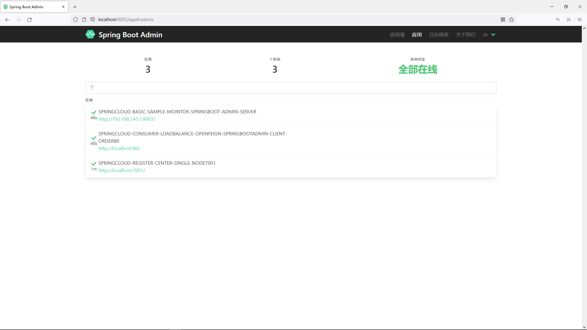

# 13.使用SpringBootAdmin监控服务
@include(@src/public/enhance/guidance/backend/springcloud/springcloud-eureka/chapter/springcloud-eureka-guidance-chapter13.md)
## 13.3.SpringBootAdmin简介
    SpringBootAdmin是开源社区孵化的项目,用于对SpringBoot应用的管理和监控。SpringBootAdmin分为服务端）(spring-boot-admin-server)和客户端(spring-boot-admin-client),服务端和客户端之间采用http通讯方式实现数据交互,单体项目中需要整合spring-boot-admin-client才能让应用被监控。在SpringCloud项目中,spring-boot-admin-server是直接从注册中心抓取应用信息,不需要每个微服务应用整合spring-boot-admin-client就可以实现应用的管理和监控。

<a href="https://github.com/codecentric/spring-boot-admin"  target="_blank">官方网站(GITHUB)</a>
```
https://github.com/codecentric/spring-boot-admin
```

## 13.4.搭建SpringBootAdmin的Server端
### 13.4.1.模块简介
    SpringBootAdmin的Server端,启动端口: 9003
### 13.4.2.模块目录结构
@import "./projects/springcloud-eureka/springcloud-mointor-springboot-admin-server9003/tree.md"
### 13.4.3.创建模块
	在父工程(springcloud-eureka)中创建一个名为springcloud-mointor-springboot-admin-server9003的maven模块,注意:当前模块创建成功后,在父工程pom.xml中<modules></modules>中会自动生成有关当前模块的信息
### 13.4.4.编写模块pom.xml
@import "./projects/springcloud-eureka/springcloud-mointor-springboot-admin-server9003/pom.xml"
### 13.4.5.编写模块application.yml
@import "./projects/springcloud-eureka/springcloud-mointor-springboot-admin-server9003/src/main/resources/application.yml"
### 13.4.6.编写模块主启动类
@import "./projects/springcloud-eureka/springcloud-mointor-springboot-admin-server9003/src/main/java/org/openatom/springcloud/MointorSpringBootAdmin9003.java"
## 13.5.搭建SpringBootAdmin的Client端
### 13.5.1.模块简介
    集成了SpringBootAdmin的Client端的服务消费端,启动端口: 80
### 13.5.2.模块目录结构
@import "./projects/springcloud-eureka/springcloud-consumer-loadbalance-openfeign-springbootadmin-client-order80/tree.md"
### 13.5.3.创建模块
	在父工程(springcloud-eureka)中创建一个名为springcloud-consumer-loadbalance-openfeign-springbootadmin-client-order80的maven模块,注意:当前模块创建成功后,在父工程pom.xml中<modules></modules>中会自动生成有关当前模块的信息
### 13.5.4.编写模块pom.xml
@import "./projects/springcloud-eureka/springcloud-consumer-loadbalance-openfeign-springbootadmin-client-order80/pom.xml"
### 13.5.5.编写模块application.yml
@import "./projects/springcloud-eureka/springcloud-consumer-loadbalance-openfeign-springbootadmin-client-order80/src/main/resources/application.yml"
### 13.5.6.编写模块config
@import "./projects/springcloud-eureka/springcloud-consumer-loadbalance-openfeign-springbootadmin-client-order80/src/main/java/org/openatom/springcloud/config/OpenFeignConfig.java"
### 13.5.7.编写模块service
@import "./projects/springcloud-eureka/springcloud-consumer-loadbalance-openfeign-springbootadmin-client-order80/src/main/java/org/openatom/springcloud/service/PaymentServiceOpenFeign.java"
### 13.5.8.编写模块主启动类
@import "./projects/springcloud-eureka/springcloud-consumer-loadbalance-openfeign-springbootadmin-client-order80/src/main/java/org/openatom/springcloud/OrderServiceConsumerLoadBalanceOpenFeignSpringBootAdminClient80.java"

## 13.6.测试使用SpringBootAdmin监控服务
    启动相关服务

    在浏览器访问
```
http://localhost:9003/
```

    可以看到SpringbootAdminServer中已经监控到了相关的服务,可以点击具体服务查看详细信息,这里不在继续做展示


<ScrollIntoPageView/>
<HideSideBar/>
