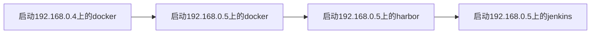
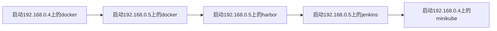

# 16.使用持续集成快捷部署服务
@include(@src/public/enhance/guidance/backend/springcloud/springcloud-eureka/chapter/springcloud-eureka-guidance-chapter16.md)
## 16.3.持续集成微服务到Docker中
### 16.3.1.持续集成微服务到Docker中流程说明
```mermaid
flowchart LR
    GITEE提交代码-->触发WebHooks
    触发WebHooks-->触发Jenkins构建项目
    触发Jenkins构建项目-->Jenkins执行对应的Jenkinsfile
    Jenkins执行对应的Jenkinsfile-->触发build镜像->tag镜像->push镜像到私服
    触发build镜像->tag镜像->push镜像到私服-->执行远程脚本
    执行远程脚本-->自动从私服中拉取镜像创建容器并启动容器
```
### 16.3.2.搭建Docker
    在192.168.0.4上搭建docker
详细参考-> <a href="/pure/blogs/environment/centos/centos7/shardings/centos7-chapter-4.搭建docker技术栈.html#_4-3-1-在线安装docker" target="_blank">搭建docker</a>
    开启192.168.0.4上的docker的2375端口(为使用docker的maven插件做准备)
```
vim /lib/systemd/system/docker.service
```
    其中ExecStart=后添加配置-H tcp://0.0.0.0:2375 -H unix:///var/run/docker.sock
    开放端口
```
firewall-cmd --zone=public --add-port=2375/tcp --permanent &&
firewall-cmd --reload
```
    刷新daemon.json并重启动docker
```
systemctl daemon-reload &&
systemctl restart docker
```
### 16.3.3.搭建Harbor
    在192.168.0.5上搭建harbor
详细参考-> <a href="/pure/blogs/environment/centos/centos7/shardings/centos7-chapter-4.搭建docker技术栈.html#_4-6-3-搭建harbor私服" target="_blank">搭建Harbor</a>
    配置192.168.0.4上的Docker信任192.168.0.5上的harbor私服
```
vim /etc/docker/daemon.json
```
	添加如下内容
```
{
    "insecure-registries":["192.168.0.5:5000"]
}
```
	刷新daemon并重启docker
```
systemctl daemon-reload &&
systemctl restart docker
```
### 16.3.4.搭建Jenkins
    在192.168.0.5上搭建Jenkins
详细参考-> <a href="/pure/blogs/environment/centos/centos7/shardings/centos7-chapter-9.搭建持续集成环境.html#_9-3-使用本地内网穿透搭建持续集成环境" target="_blank">搭建Jenkins</a>

    在Jenkins中安装配置Publish Over SSH插件(需要先安装该插件)
	配置Jenkins所在服务器到docker所在服务器的免密登录

    进入Publish over SSH配置面板
    DASHBOARD->Manage Jenkins/系统管理->Configure System(System Configuration下)/系统配置(系统配置)->Publish over SSH

    配置如下字段
    Publish over SSH
    a.Passphrase(可以配置也可以不配置,下面的配置中会覆盖这个配置)
    192.168.0.4机器的密码

    Publish over SSH->SSH Servers->新增
    a.Name(和Jenkinsfile中sshPublisherDesc.configName保持一致)
    cidocker
    b.Hostname
    192.168.0.4
    c.Username
    root
    d.Remote Directory
    /

    Publish over SSH->SSH Servers->勾选Use password authentication, or use a different key
    a.Passphrase / Password(注意:这个配置会覆盖Publish over SSH下a.中的配置)
    192.168.0.4机器的密码

    测试连通性(成功返回Success)
    Publish over SSH->SSH Servers->Test Configuration

    保存配置
    Publish over SSH->保存

### 16.3.5.搭建持续集成使用的微服务
#### 16.3.5.1.模块简介
    测试持续集成微服务到docker中使用到的微服务
#### 16.3.5.2.模块目录结构
```md
@include(../projects/springcloud-eureka/springcloud-ci-docker80/tree.md)
```
#### 16.3.5.3.创建模块
	在父工程(springcloud-eureka)中创建一个名为springcloud-ci-docker80的maven模块,注意:当前模块创建成功后,在父工程pom.xml中<modules></modules>中会自动生成有关当前模块的信息
#### 16.3.5.4.编写模块pom.xml
```xml
@include(../projects/springcloud-eureka/springcloud-ci-docker80/pom.xml)
```
#### 16.3.5.5.编写模块application.yml
```yml
@include(../projects/springcloud-eureka/springcloud-ci-docker80/src/main/resources/application.yml)
```
#### 16.3.5.6.编写模块controller
```java
@include(../projects/springcloud-eureka/springcloud-ci-docker80/src/main/java/org/openatom/springcloud/controller/CiDockerController.java)
```
#### 16.3.5.7.编写模块主启动类
```java
@include(../projects/springcloud-eureka/springcloud-ci-docker80/src/main/java/org/openatom/springcloud/CiDocker80.java)
```
#### 16.3.5.8.编写模块Dockerfile
    注意:需要先在 项目根目录/springcloud-ci-docker80下创建docker文件夹
@include(../projects/springcloud-eureka/springcloud-ci-docker80/docker/Dockerfile)
```
#### 16.3.5.9.本地测试模块
    在浏览器中访问
```
http://localhost/ci/docker
```
    返回数据
```json
{"code":200,"message":"持续集成","data":"测试持续集成到Docker"}
```
### 16.3.6.测试docker的maven插件
    启动相关服务


    在项目根目录下执行打包命令
```
mvn clean install
```

    在项目根目录下执行复制生成的jar包到指定位置
```
cp springcloud-ci-docker80/target/springcloud-ci-docker80.jar springcloud-ci-docker80/docker
```

    在idea中打开docker的maven插件操作面板
::: center
<div class="imgbg-customer">

</div>
:::

    制作Docker镜像并上传镜像到docker
    点击docker:build

    上传镜像到docker后在docker中为该镜像创建容器并启动docker中的容器
    点击docker:build->点击docker:run

    测试部署到docker中的服务
```
http://192.168.0.4/ci/docker
```
    返回结果
```
{"code":200,"message":"持续集成","data":"测试持续集成到Docker"}
```

    在harbor私服中创建springcloud-eureka项目
::: center
<div class="imgbg-customer">

</div>
:::

    推送到harbor私服
    点击docker:build->点击docker:push
    登录harbor私服查看刚才推送上去的的服务
```
http://192.168.0.5:5000/harbor/projects
```
    点击springcloud-eureka这个项目
::: center
<div class="imgbg-customer">

</div>
:::
    可以看到当前模块微服务已经被推送到了harbor私服中

### 16.3.7.持续集成Jekins相关配置
#### 16.3.7.1.编写Jenkinsfile
    在项目根目录下新建script文件夹,在script中新建JenkinsfileCiDocker,内容如下
```
//定义远程git仓库中项目的地址
def project_url='https://gitee.com/lingwh1995/springcloud-eureka.git'

def jenkins_ip='192.168.0.5'

node {
    echo '开始执行自动化...'
    /*指定在那台Jenkins节点上运行*/
    agent { label '${jenkins_ip}'}

    /*从远程仓库检出代码*/
    stage('从远程仓库检出代码') {
        echo '开始 从远程仓库检出代码...'
        checkout([
            $class: 'GitSCM',
            branches: [[name: '*/master']], extensions: [],
            userRemoteConfigs: [[url: "${project_url}"]]
        ])
        echo '完成 从远程仓库检出代码...'
    }

    /**
     * maven命令扩展:实现多模块情况下只针对某一个模块打包
     * -pl, --projects
     *      Build specified reactor projects instead of all projects
     *      指定项目其中的一个模块及其依赖
     *  -am, --also-make
     *      If project list is specified, also build projects required by the list
     *      自动构建该模块所依赖的其他模块
     *
     */
    stage('打包->安装->构建镜像->推送到私服->删除docker中本地镜像') {
        echo '开始 打包->安装->构建镜像->推送到私服->删除docker中本地镜像...'
        //如果install的是一个模块或者是多个模块
            //执行遍历依次次打包涉及的模块
        //如果是install的是整个项目
            //一次性打包整个项目
        sh "mvn clean install -T 1C -Dmaven.test.skip=true -Dmaven.compile.fork=true -pl springcloud-ci-docker80 -am"
        echo '完成 打包->安装->构建镜像->推送到私服->删除docker中本地镜像...'
    }

    /**
     *安装Publish Over SSH插件，使用插件的功能触发远程的shell脚本的执行
     */
    stage('自动部署上传到私服中的所有镜像到docker') {
        echo '开始 自动部署上传到私服中的所有镜像到docker...'
        sshPublisher(
            publishers:
                [
                    sshPublisherDesc(
                        configName: 'cidocker',
                        transfers: [
                            sshTransfer(
                                cleanRemote: false,
                                excludes: '',
                                execCommand: "cd / && ./springcloud-ci-docker.sh",
                                execTimeout: 600000,
                                flatten: false,
                                makeEmptyDirs: false,
                                noDefaultExcludes: false,
                                patternSeparator: '[, ]+',
                                remoteDirectory: '',
                                remoteDirectorySDF: false,
                                removePrefix: '',
                                sourceFiles: ''
                            )
                        ],
                        usePromotionTimestamp: false,
                        useWorkspaceInPromotion: false,
                        verbose: false
                    )
                ]
       )
       echo '结束 自动部署上传到私服中的所有镜像到docker...'
    }

    echo '完成执行自动化...'
}
```
    注意事项
    执行Jenkinsfile中执行了mvn install命令后,就会触发 将生成的jar拷贝到docker文件夹中->build镜像->tag镜像->push镜像 这些操作,这是由于在pom.xml中把这些操作都和install命令绑定在了一起,所以才会有这样的效果
#### 16.3.7.2.在Jekins中配置项目
    新建任务
    DashBoard->新建任务->输入任务名称(springcloud-eureka)->流水线->确定
    或
    DashBoard->点击springcloud-eureka->配置

    配置如下字段
    配置流水线
    a.定义
    Pipeline script from SCM(点击下拉框选择)
    b.定义->SCM
    Git(点击下拉框选择)
    c.定义->SCM->Repositories(根据自己的项目信息进行配置)
    Repository URL
    https://gitee.com/lingwh1995/springcloud-eureka.git
    d.定义->SCM->脚本路径(根据自己的项目信息进行配置)
    script/JenkinsfileCiDocker
#### 16.3.7.3.编写持续集成脚本
    在192.168.0.4上编写持续集成脚本
```
cd / &&
cat > springcloud-ci-docker.sh << EOF
docker login 192.168.0.5:5000 -uadmin -p123456
docker rmi -f 192.168.0.5:5000/springcloud-eureka/springcloud-ci-docker80
docker rm -f springcloud-ci-docker80
docker pull 192.168.0.5:5000/springcloud-eureka/springcloud-ci-docker80:latest
docker run -di --name=springcloud-ci-docker80 -p80:80 192.168.0.5:5000/springcloud-eureka/springcloud-ci-docker80
EOF
```
    赋予可执行权限
```
chmod +x springcloud-ci-docker.sh
```
### 16.3.8.测试持续集成微服务到docker中
    为了更明显的查看本次测试效果,首先删除192.168.0.4中docker中在前面环节产生的镜像和容器

    访问项目主页,点击构建按钮
```
http://192.168.0.5:8080/jenkins/
```
::: center
<div class="imgbg-customer">

</div>
:::


    访问服务
```
http://192.168.0.4/ci/docker
```

    返回结果
```
{"code":200,"message":"持续集成","data":"测试持续集成到Docker"}
```
### 16.3.9.使用Webhook触发持续集成
#### 16.3.9.1.webhook的作用
    在前面的环节中,访问项目主页,点击构建按钮后才能触发持续集成,使用webhook可以更方便的触发持续集成,配置好webhook时,当提交代码时就会触发持续集成
#### 16.3.9.2.使用webhook前准备工作
    jenkins安装Gitee插件
详细参考-> <a href="/pure/blogs/environment/centos/centos7/shardings/centos7-chapter-9.搭建持续集成环境.html#_9-3-7-安装配置jenkins用到的插件" target="_blank">jenkins安装Gitee插件</a>

    搭建内网穿透
详细参考-> <a href="/pure/blogs/environment/centos/centos7/shardings/centos7-chapter-9.搭建持续集成环境.html#_9-3-8-搭建内网穿透" target="_blank">搭建内网穿透</a>
    搭建好了内网穿透后,可以使用新的地址来访问jenkins
    不使用内网穿透访问jenkins的地址是
```
http://192.168.0.5:8080/jenkins/
```
    使用内网穿透访问jenkins的地址是
```
http://8sybmw.natappfree.cc/jenkins
```
#### 16.3.9.3.配置使用webhook
    使用内网穿透访问jenkins的地址是
```
http://8sybmw.natappfree.cc/jenkins
```
    在jenkins中配置job
    jenkins具体项目->配置->构建触发器->Gitee webhook 触发构建->Gitee WebHook 密码—>得到密码 0d71d48f211af16c477cf9c817ac612d

    配置gitee的webhook
    进入gitee的webhook配置界面(这里的url根据自己的项目进行修改)
```
https://gitee.com/lingwh1995/springcloud-eureka/hooks
```

    点击添加webHook->填写URL和WebHook 密码/签名密钥
    URL
    http://8sybmw.natappfree.cc/jenkins/gitee-project/springcloud-eureka
    WebHook 密码/签名密钥(上面在jenkins中生成的)
    0d71d48f211af16c477cf9c817ac612d

    测试webhook是否配置成功(可以测试,也可以不测试)
    点击测试->查看更多
#### 16.3.9.4.配置使用的Jenkinsfile
    DashBoard->点击springcloud-eureka->配置->流水线->脚本路径->输入 script/JenkinsfileCiDocker
#### 16.3.9.5.测试使用Webhook触发持续集成
    修改springcloud-eureka/springcloud-ci-docker80/src/main/java/org/openatom/springcloud/controller/CiK8sController.java中代码为
```java
package org.openatom.springcloud.controller;

import org.springframework.web.bind.annotation.GetMapping;
import org.springframework.web.bind.annotation.RestController;
import org.openatom.springcloud.entities.CommonResult;
import org.openatom.springcloud.entities.Payment;


@RestController
public class CiDockerController {

    @GetMapping("/ci/docker")
    public CommonResult<String> create(Payment payment) {
        return new CommonResult(200,"持续集成","测试持续集成到Docker+测试WebHook");
    }

}
```
    在git中提交代码

    查看webhook触发jenkins构建
```
http://8sybmw.natappfree.cc/jenkins/job/springcloud-eureka/
```

    在浏览器中访问
```
http://192.168.0.4/ci/docker
```
    返回数据
```json
{"code":200,"message":"持续集成","data":"测试持续集成到Docker+测试WebHook"}
```

## 16.4.持续集成微服务到k8s中
### 16.4.1.持续集成微服务到k8s中流程说明
```mermaid
flowchart LR
    GITEE提交代码-->触发WebHooks
    触发WebHooks-->触发Jenkins构建项目
    触发Jenkins构建项目-->Jenkins执行对应的Jenkinsfile
    Jenkins执行对应的Jenkinsfile-->触发build镜像->tag镜像->push镜像到私服
    触发build镜像->tag镜像->push镜像到私服-->执行远程脚本
    执行远程脚本-->自动从私服中拉取镜像创建容器并启动容器
```
### 16.4.2.搭建Docker
        在192.168.0.4上搭建docker
详细参考-> <a href="/pure/blogs/environment/centos/centos7/shardings/centos7-chapter-4.搭建docker技术栈.html#_4-3-1-在线安装docker" target="_blank">搭建docker</a>

    开启minikube部署机器(192.168.0.4)上的docker2375端口(为使用docker的maven插件做准备)
```
vim /lib/systemd/system/docker.service
```
    其中ExecStart=后添加配置-H tcp://0.0.0.0:2375 -H unix:///var/run/docker.sock
    开放端口
```
firewall-cmd --zone=public --add-port=2375/tcp --permanent &&
firewall-cmd --reload
```
    刷新daemon.json并重启动docker
```
systemctl daemon-reload &&
systemctl restart docker
```
### 16.4.3.搭建Harbor
    在192.168.0.5上搭建Harbor
详细参考-> <a href="/pure/blogs/environment/centos/centos7/shardings/centos7-chapter-4.搭建docker技术栈.html#_4-6-3-搭建harbor私服" target="_blank">搭建harbor</a>
    配置192.168.0.4上的docker信任192.168.0.5上的harbor私服
```
vim /etc/docker/daemon.json
```
	添加如下内容
```
{
    "insecure-registries":["192.168.0.5:5000"]
}
```
	刷新daemon并重启docker
```
systemctl daemon-reload &&
systemctl restart docker
```
### 16.4.4.搭建Jenkins
    在192.168.0.5上搭建Jenkins
详细参考-> <a href="/pure/blogs/environment/centos/centos7/shardings/centos7-chapter-9.搭建持续集成环境.html#_9-3-使用本地内网穿透搭建持续集成环境" target="_blank">搭建Jenkins</a>

    在Jenkins中安装配置Publish Over SSH插件(需要先安装该插件)
	配置Jenkins所在服务器到docker所在服务器的免密登录

    进入Publish over SSH配置面板
    DASHBOARD->Manage Jenkins/系统管理->Configure System(System Configuration下)/系统配置(系统配置)->Publish over SSH

    配置如下字段
    Publish over SSH
    a.Passphrase(可以配置也可以不配置,下面的配置中会覆盖这个配置)
    192.168.0.4机器的密码

    Publish over SSH->SSH Servers->新增
    a.Name(和Jenkinsfile中sshPublisherDesc.configName保持一致)
    cidocker
    b.Hostname
    192.168.0.4
    c.Username
    root
    d.Remote Directory
    /

    Publish over SSH->SSH Servers->勾选Use password authentication, or use a different key
    a.Passphrase / Password(注意:这个配置会覆盖Publish over SSH下a.中的配置)
    192.168.0.4机器的密码

    测试连通性(成功返回Success)
    Publish over SSH->SSH Servers->Test Configuration

    保存配置
    Publish over SSH->保存

### 16.4.5.搭建Minikube或K8s
    在192.168.0.4上搭建minikube
详细参考-> <a href="/pure/blogs/environment/centos/centos7/shardings/centos7-chapter-6.搭建Minikube.html#_6-搭建minikube" target="_blank">搭建minikube</a>

    这里使用minikube作为k8s的演示环境,如要搭建适用于生产环境的k8s环境,请参考
    kubeadm搭建kubernetes
详细参考-> <a href="/pure/blogs/environment/centos/centos7/shardings/centos7-chapter-7.kubeadm搭建Kubernetes.html" target="_blank">minikube</a>
    二进制包搭建kubernetes
详细参考-> <a href="/pure/blogs/environment/centos/centos7/shardings/centos7-chapter-8.二进制包搭建Kubernetes.html" target="_blank">minikube</a>

### 16.4.6.配置Minikube或Kubernetes
#### 16.4.6.1.配置minikube
##### 16.4.6.1.1.协议类型
    docker: tcp
    harbor: http
##### 16.4.6.1.2.配置配置minikube的所有工作节点上的使用的docker
    配置minikube或kubernetes的所有工作节点上的docker信任harbor私服
```
vim /etc/docker/daemon.json
```
	添加如下内容
```
{
    "insecure-registries":["192.168.0.5:5000"]
}
```
	刷新daemon并重启docker
```
systemctl daemon-reload &&
systemctl restart docker
```
##### 16.4.6.1.3.配置docker中minikube容器内部使用的docker
<!--
    参考博客
    https://blog.csdn.net/Xin_101/article/details/124445591
-->
    进入minikube终端
```
minikube ssh
```
    配置/usr/lib/systemd/system/docker.service
```
sudo vi /usr/lib/systemd/system/docker.service
```
    ExecStart=/usr/bin/dockerd后添加insecure-registry配置
```
--insecure-registry=192.168.0.5:5000
```
	刷新daemon并重启docker
```
sudo systemctl daemon-reload &&
sudo systemctl restart docker
```
::: center
<div class="imgbg-customer">

</div>
:::

##### 16.4.6.1.4.配置Minikube从harbor拉取镜像时使用的秘钥
    a.根据docker用户名密码创建秘钥
    创建秘钥
```
kubectl create secret docker-registry harbor-login \
--docker-server=192.168.0.5:5000 \
--docker-username=admin \
--docker-password=123456
```
    查看创建的秘钥
```
kubectl get secret
```
```
kubectl get secret regcred --output=yaml
```

    b.基于现有docker登录凭证使用yaml创建秘钥
    登录docker镜像仓库
```
docker login 192.168.0.4:5000 --username docker -password 123456
```
    查看生成的docker登录凭证
```
cat ~/.docker/config.json
```
    以base64编码格式查看docker登录凭证
```
cat ~/.docker/config.json | base64 -w 0
```
    创建用于创建秘钥的yaml
```
cat > harbor_secret.yaml << EOF
apiVersion: v1
kind: Secret
metadata:
  name: harbor-login
type: kubernetes.io/dockerconfigjson
data:
  .dockerconfigjson: ewoJImF1dGhzIjogewoJCSIxOTIuMTY4LjAuNTo1MDAwIjogewoJCQkiYXV0aCI6ICJZV1J0YVc0Nk1USXpORFUyIgoJCX0KCX0KfQ==
EOF
```
    创建秘钥
```
kubectl create -f harbor_secret.yaml
```
    查看创建的秘钥
```
kubectl get secret
```
```
kubectl get secret regcred --output=yaml
```

    c.基于现有docker登录凭证引用config.json创建秘钥
    登录docker镜像仓库
```
docker login 192.168.0.4:5000 --username docker -password 123456
```
    查看生成的docker登录信息
```
cat ~/.docker/config.json
```
    根据生成的docker登录信息创建秘钥
```
kubectl create secret generic harbor-login \
    --from-file=.dockerconfigjson=/root/.docker/config.json \
    --type=kubernetes.io/dockerconfigjson
```
    查看创建的秘钥
```
kubectl get secret
```
```
kubectl get secret regcred --output=yaml
```
#### 16.4.6.2.配置kubernetes
##### 16.4.6.2.1.协议类型
    docker: tcp
    harbor: http

#### 16.4.6.3.配置minikube
##### 16.4.6.3.1.协议类型
    docker: tcp
    harbor: https
#### 16.4.6.4.配置Kubernetes
##### 16.4.6.4.1.协议类型
    docker: tcp
    harbor: https

### 16.4.7.搭建持续集成使用的微服务
#### 16.4.7.1.模块简介
    测试持续集成微服务到k8s中使用到的微服务
#### 16.4.7.2.模块目录结构
```md
@include(../projects/springcloud-eureka/springcloud-ci-k8s80/tree.md)
```
#### 16.4.7.3.创建模块
	在父工程(springcloud-eureka)中创建一个名为springcloud-ci-k8s80的maven模块,注意:当前模块创建成功后,在父工程pom.xml中<modules></modules>中会自动生成有关当前模块的信息
#### 16.4.7.4.编写模块pom.xml
```xml
@include(../projects/springcloud-eureka/springcloud-ci-k8s80/pom.xml)
```
#### 16.4.7.5.编写模块application.yml
```yml
@include(../projects/springcloud-eureka/springcloud-ci-k8s80/src/main/resources/application.yml)
```
#### 16.4.7.6.编写模块controller
```java
@include(../projects/springcloud-eureka/springcloud-ci-k8s80/src/main/java/org/openatom/springcloud/controller/CiK8sController.java)
```
#### 16.4.7.7.编写模块主启动类
```java
@include(../projects/springcloud-eureka/springcloud-ci-k8s80/src/main/java/org/openatom/springcloud/CiK8s80.java)
```
#### 16.4.7.8.编写模块Dockerfile
    注意:需要先在 项目根目录/springcloud-ci-k8s80下创建docker文件夹
@include(../projects/springcloud-eureka/springcloud-ci-k8s80/docker/Dockerfile)
```
#### 16.4.7.9.本地测试模块
    在浏览器中访问
```
http://localhost/ci/k8s
```
    返回数据
```json
{"code":200,"message":"持续集成","data":"测试持续集成到K8s"}
```
### 16.4.8.测试docker的maven插件
    启动相关服务


    在项目根目录下执行打包命令
```
mvn clean install
```

    在项目根目录下执行复制生成的jar包到指定位置
```
cp springcloud-ci-k8s80/target/springcloud-ci-k8s80.jar springcloud-ci-k8s80/docker
```

    在idea中打开docker的maven插件操作面板
::: center
<div class="imgbg-customer">

</div>
:::

    制作Docker镜像并上传镜像到docker制作Docker镜像
    点击docker:build

    上传镜像到docker后在docker中为该镜像创建容器并启动docker中的容器
    点击docker:build->点击docker:run

    测试部署到docker中的服务
```
http://192.168.0.4/ci/k8s
```
    返回结果
```
{"code":200,"message":"持续集成","data":"测试持续集成到K8s"}
```

    在harbor私服中创建springcloud-eureka项目
::: center
<div class="imgbg-customer">

</div>
:::

    推送到harbor私服
    点击docker:build->点击docker:push
    登录harbor私服查看刚才推送上去的的服务
```
http://192.168.0.5:5000/harbor/projects
```
    点击springcloud-eureka这个项目
::: center
<div class="imgbg-customer">

</div>
:::
    可以看到当前模块微服务已经被推送到了harbor私服中

### 16.4.9.持续集成Jekins相关配置
#### 16.4.9.1.编写Jenkinsfile
    在项目根目录下新建script文件夹,在script中新建JenkinsfileCiK8s,内容如下
```
//定义远程git仓库中项目的地址
def project_url='https://gitee.com/lingwh1995/springcloud-eureka.git'

def jenkins_ip='192.168.0.5'

node {
    echo '开始执行自动化...'
    /*指定在那台Jenkins节点上运行*/
    agent { label '${jenkins_ip}'}

    /*从远程仓库检出代码*/
    stage('从远程仓库检出代码') {
        echo '开始 从远程仓库检出代码...'
        checkout([
            $class: 'GitSCM',
            branches: [[name: '*/master']], extensions: [],
            userRemoteConfigs: [[url: "${project_url}"]]
        ])
        echo '完成 从远程仓库检出代码...'
    }

    /**
     * maven命令扩展:实现多模块情况下只针对某一个模块打包
     * -pl, --projects
     *      Build specified reactor projects instead of all projects
     *      指定项目其中的一个模块及其依赖
     *  -am, --also-make
     *      If project list is specified, also build projects required by the list
     *      自动构建该模块所依赖的其他模块
     *
     */
    stage('打包->安装->构建镜像->推送到私服->删除docker中本地镜像') {
        echo '开始 打包->安装->构建镜像->推送到私服->删除docker中本地镜像...'
        //如果install的是一个模块或者是多个模块
            //执行遍历依次次打包涉及的模块
        //如果是install的是整个项目
            //一次性打包整个项目
        sh "mvn clean install -T 1C -Dmaven.test.skip=true -Dmaven.compile.fork=true -pl springcloud-ci-docker80 -am"
        echo '完成 打包->安装->构建镜像->推送到私服->删除docker中本地镜像...'
    }

    /**
     *安装Publish Over SSH插件，使用插件的功能触发远程的shell脚本的执行
     */
    stage('自动部署上传到私服中的所有镜像到docker') {
        echo '开始 自动部署上传到私服中的所有镜像到k8s...'
        sshPublisher(
            publishers:
                [
                    sshPublisherDesc(
                        configName: 'cik8s',
                        transfers: [
                            sshTransfer(
                                cleanRemote: false,
                                excludes: '',
                                execCommand: "cd / && ./springcloud-ci-k8s.sh",
                                execTimeout: 600000,
                                flatten: false,
                                makeEmptyDirs: false,
                                noDefaultExcludes: false,
                                patternSeparator: '[, ]+',
                                remoteDirectory: '',
                                remoteDirectorySDF: false,
                                removePrefix: '',
                                sourceFiles: ''
                            )
                        ],
                        usePromotionTimestamp: false,
                        useWorkspaceInPromotion: false,
                        verbose: false
                    )
                ]
       )
       echo '结束 自动部署上传到私服中的所有镜像到k8s...'
    }

    echo '完成执行自动化...'
}
```
    注意事项
    执行Jenkinsfile中执行了mvn install命令后,就会触发 将生成的jar拷贝到docker文件夹中->build镜像->tag镜像->push镜像 这些操作,这是由于在pom.xml中把这些操作都和install命令绑定在了一起,所以才会有这样的效果
#### 16.4.9.2.在Jekins中配置项目
    新建任务
    DashBoard->新建任务->输入任务名称(springcloud-eureka)->流水线->确定

    配置如下字段
    配置流水线
    a.定义
    Pipeline script from SCM(点击下拉框选择)
    b.定义->SCM
    Git(点击下拉框选择)
    c.定义->SCM->Repositories(根据自己的项目信息进行配置)
    Repository URL
    https://gitee.com/lingwh1995/springcloud-eureka.git
    d.定义->SCM->脚本路径(根据自己的项目信息进行配置)
    script/JenkinsfileCiK8s
#### 16.4.9.3.编写yaml和持续集成脚本

    在192.168.0.4编写springcloud-ci-k8s.yaml
```
cat > springcloud-ci-k8s.yaml << EOF
apiVersion: apps/v1
kind: Deployment
metadata:
  name: springcloud-ci-k8s80
spec:
  replicas: 1
  selector:
    matchLabels:
      app: springcloud-ci-k8s80
  strategy:
    type: RollingUpdate
    rollingUpdate:
      maxSurge: 1
      maxUnavailable: 0
  template:
    metadata:
      labels:
        app: springcloud-ci-k8s80
    spec:
      imagePullSecrets:
      - name: harbor-login
      containers:
      - name: springcloud-ci-k8s80
        image: 192.168.0.5:5000/springcloud-eureka/springcloud-ci-k8s80:latest
        imagePullPolicy: Always
        ports:
        - containerPort: 80    #containerPort是在pod控制器中定义的、pod中的容器需要暴露的端口

---
apiVersion: v1
kind: Service
metadata:
  labels:
    app: springcloud-ci-k8s80
  name: springcloud-ci-k8s80
  namespace: default
spec:
  ports:
  - name: springcloud-ci-k8s80
    protocol: TCP
    targetPort: 80
    nodePort: 30090
    port: 80
  selector:
    app: springcloud-ci-k8s80
  type: NodePort
EOF
```

    在192.168.0.4上编写持续集成脚本
```
cd / &&
cat > springcloud-ci-k8s.sh << EOF
kubectl apply -f springcloud-ci-k8s.yaml
EOF
```

    赋予可执行权限
```
chmod +x springcloud-ci-k8s.sh
```

### 16.4.10.测试持续集成微服务到minikube中或k8s中
#### 16.4.10.1.测试持续集成微服务到minikube中
   不用删除192.168.0.4中docker中在前面环节产生的镜像和容器,因为minikube使用的是minikube内部的docker拉取镜像

    访问项目主页,点击构建按钮
```
http://192.168.0.5:8080/jenkins/
```
::: center
<div class="imgbg-customer">

</div>
:::

    访问之前需要先在192.168.0.4上开放相关端口并开启端口转发
```
firewall-cmd --zone=public --add-port=9080/tcp --permanent &&
firewall-cmd --reload &&
kubectl port-forward --address 0.0.0.0 service/springcloud-ci-k8s80 9080:80
```
    在浏览器中访问
```
http://192.168.0.4:9080/ci/k8s
```

    返回结果
```
{"code":200,"message":"持续集成","data":"测试持续集成到K8s"}
```
### 16.4.10.使用Webhook触发持续集成
#### 16.4.10.1.webhook的作用
    在前面的环节中,访问项目主页,点击构建按钮后才能触发持续集成,使用webhook可以更方便的触发持续集成,配置好webhook时,当提交代码时就会触发持续集成
#### 16.4.10.2.使用webhook前准备工作
    jenkins安装Gitee插件
详细参考-> <a href="/pure/blogs/environment/centos/centos7/shardings/centos7-chapter-9.搭建持续集成环境.html#_9-3-7-安装配置jenkins用到的插件" target="_blank">jenkins安装Gitee插件</a>

    搭建内网穿透
详细参考-> <a href="/pure/blogs/environment/centos/centos7/shardings/centos7-chapter-9.搭建持续集成环境.html#_9-3-8-搭建内网穿透" target="_blank">搭建内网穿透</a>
    搭建好了内网穿透后,可以使用新的地址来访问jenkins
    不使用内网穿透访问jenkins的地址是
```
http://192.168.0.5:8080/jenkins/
```
    使用内网穿透访问jenkins的地址是
```
http://8sybmw.natappfree.cc/jenkins
```
#### 16.4.10.3.配置使用webhook
    使用内网穿透访问jenkins的地址是
```
http://8sybmw.natappfree.cc/jenkins
```
    在jenkins中配置job
    jenkins具体项目->配置->构建触发器->Gitee webhook 触发构建->Gitee WebHook 密码—>得到密码 0d71d48f211af16c477cf9c817ac612d

    配置gitee的webhook
    进入gitee的webhook配置界面(这里的url根据自己的项目进行修改)
```
https://gitee.com/lingwh1995/springcloud-eureka/hooks
```

    点击添加webHook->填写URL和WebHook 密码/签名密钥
    URL
    http://8sybmw.natappfree.cc/jenkins/gitee-project/springcloud-eureka
    WebHook 密码/签名密钥(上面在jenkins中生成的)
    0d71d48f211af16c477cf9c817ac612d

    测试webhook是否配置成功(可以测试,也可以不测试)
    点击测试->查看更多
#### 16.4.10.4.配置使用的Jenkinsfile
    DashBoard->点击springcloud-eureka->配置->流水线->脚本路径->输入 script/JenkinsfileCiK8s
#### 16.4.10.5.测试使用Webhook触发持续集成
    修改springcloud-eureka/springcloud-ci-k8s80/src/main/java/org/openatom/springcloud/controller/CiK8sController.java中代码为
```java
package org.openatom.springcloud.controller;

import org.springframework.web.bind.annotation.GetMapping;
import org.springframework.web.bind.annotation.RestController;
import org.openatom.springcloud.entities.CommonResult;
import org.openatom.springcloud.entities.Payment;

@RestController
public class CiK8sController {


    @GetMapping("/ci/k8s")
    public CommonResult<String> create(Payment payment) {
        return new CommonResult(200,"持续集成","测试持续集成到K8s+测试WebHook");
    }

}
```
    在git中提交代码

    查看webhook触发jenkins构建
```
http://8sybmw.natappfree.cc/jenkins/job/springcloud-eureka/
```

    访问之前需要先在192.168.0.4上开放相关端口并开启端口转发
```
firewall-cmd --zone=public --add-port=9080/tcp --permanent &&
firewall-cmd --reload &&
kubectl port-forward --address 0.0.0.0 service/springcloud-ci-k8s80 9080:80
```
    在浏览器中访问
```
http://192.168.0.4:9080/ci/k8s
```
    返回数据
```json
{"code":200,"message":"持续集成","data":"测试持续集成到K8s+测试WebHook"}
```


<ScrollIntoPageView/>
<HideSideBar/>
