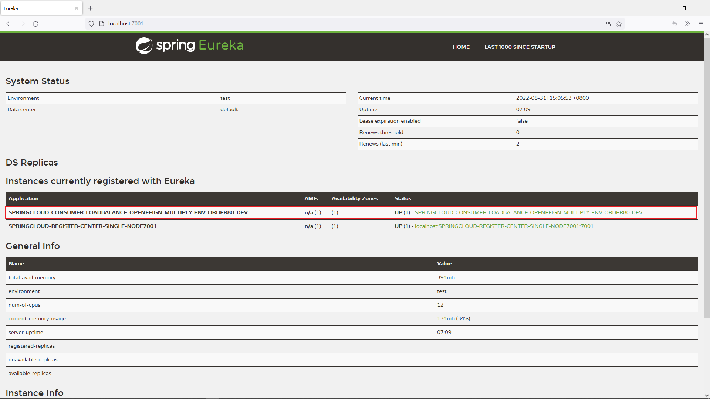

# 17.让微服务区分多种不同环境
@include(@src/public/enhance/guidance/backend/springcloud/springcloud-eureka/chapter/springcloud-eureka-guidance-chapter17.md)
## 17.3.模块简介
    集成了多种环境的的服务消费端,启动端口: 80
## 17.4.模块目录结构
```md
@include(../projects/springcloud-eureka/springcloud-consumer-loadbalance-openfeign-multiply-env-order80/tree.md)
```
## 17.5.创建模块
	在父工程(springcloud-eureka)中创建一个名为springcloud-consumer-loadbalance-openfeign-multiply-env-order80的maven模块,注意:当前模块创建成功后,在父工程pom.xml中<modules></modules>中会自动生成有关当前模块的信息
## 17.6.在父工程pom.xml添加多环境配置
```
<!--定义多种开发环境:开始-->
<profiles>
    <!--开发环境-->
    <profile>
        <!--不同环境的唯一id-->
        <id>dev</id>
        <properties>
            <!--profile.active对应application.yml中的@profile.active@-->
            <profile.active>dev</profile.active>
        </properties>
    </profile>

    <!--测试环境-->
    <profile>
        <id>test</id>
        <properties>
            <!--profile.active对应application.yml中的@profile.active@-->
            <profile.active>test</profile.active>
        </properties>
    </profile>
</profiles>
<!--定义多种开发环境:结束-->
```
## 17.7.编写模块pom.xml
```xml
@include(../projects/springcloud-eureka/springcloud-consumer-loadbalance-openfeign-multiply-env-order80/pom.xml)
```
## 17.8.编写模块配置文件
    dev环境配置文件
    application.yml
```yml
@include(../projects/springcloud-eureka/springcloud-consumer-loadbalance-openfeign-multiply-env-order80/src/main/resources/dev/application.yml)
```
    application-dev.yml
```yml
@include(../projects/springcloud-eureka/springcloud-consumer-loadbalance-openfeign-multiply-env-order80/src/main/resources/dev/application-dev.yml)
```
    logback-custom.xml
```xml
@include(../projects/springcloud-eureka/springcloud-consumer-loadbalance-openfeign-multiply-env-order80/src/main/resources/dev/logback-custom.xml)
```

    test环境配置文件
    application.yml
```yml
@include(../projects/springcloud-eureka/springcloud-consumer-loadbalance-openfeign-multiply-env-order80/src/main/resources/test/application.yml)
```
    application-test.yml
```yml
@include(../projects/springcloud-eureka/springcloud-consumer-loadbalance-openfeign-multiply-env-order80/src/main/resources/test/application-test.yml)
```
    logback-custom.xml
```xml
@include(../projects/springcloud-eureka/springcloud-consumer-loadbalance-openfeign-multiply-env-order80/src/main/resources/test/logback-custom.xml)
```
## 17.9.编写模块config
    OpenFeignConfig.java
```java
@include(../projects/springcloud-eureka/springcloud-consumer-loadbalance-openfeign-multiply-env-order80/src/main/java/org/openatom/springcloud/config/OpenFeignConfig.java)
```
    VirtualIpConfig.java
```java
@include(../projects/springcloud-eureka/springcloud-consumer-loadbalance-openfeign-multiply-env-order80/src/main/java/org/openatom/springcloud/config/VirtualIpConfig.java)
```
## 17.10.编写模块service
```java
@include(../projects/springcloud-eureka/springcloud-consumer-loadbalance-openfeign-multiply-env-order80/src/main/java/org/openatom/springcloud/service/PaymentServiceOpenFeign.java)
```
## 17.11.编写模块controller
```java
@include(../projects/springcloud-eureka/springcloud-consumer-loadbalance-openfeign-multiply-env-order80/src/main/java/org/openatom/springcloud/controller/OrderConsumerController.java)
```
## 17.12.编写模块主启动类
```java
@include(../projects/springcloud-eureka/springcloud-consumer-loadbalance-openfeign-multiply-env-order80/src/main/java/org/openatom/springcloud/OrderServiceConsumerLoadBalanceOpenFeignMultiplyEnv80.java)
```
## 17.13.搭建Zipkin和ELK
    为了更完善的展示添加多环境后支持后,日志系统会针对不同的环境生成对应的日志,完整的日志系统需要Zipkin和ELK的支持,所以先搭建好Zipkin和ELK
    在192.168.0.5上搭建Zipkin
详细参考-> <a href="/blogs/environment/centos/centos7/shardings/centos7-chapter-12.搭建SpringCloud技术栈所需组件.html#_12-3-搭建zipkin" target="_blank">搭建Zipkin</a>
    在192.168.0.5上搭建ELK
详细参考-> <a href="/blogs/environment/centos/centos7/centos7.html#_4-9-3-安装elk" target="_blank">Docker中安装ELK</a>
## 17.14.测试让微服务区分多种不同环境
### 17.14.1.测试多环境运行
    dev环境

    在浏览器访问
```
http://localhost:7001/
```
::: center
<div class="imgbg-customer">

</div>
:::
    可以看到服务名为SPRINGCLOUD-CONSUMER-LOADBALANCE-OPENFEIGN-MULTIPLY-ENV-ORDER80-DEV

    test环境

    在浏览器访问
```
http://localhost:7001/
```
::: center
<div class="imgbg-customer">

</div>
:::
    可以看到服务名为SPRINGCLOUD-CONSUMER-LOADBALANCE-OPENFEIGN-MULTIPLY-ENV-ORDER80-TEST

### 17.14.2.测试多环境打包
    dev环境

    执行如下命令
```
jar xf springcloud-consumer-loadbalance-openfeign-multiply-env-order80.jar &&
ls BOOT-INF/classes/
```
    查看jar包中使用的配置文件
```
application.yml  application-dev.yml  logback-custom.xml  org
```
    只包含了application-dev.yml这个多环境配置文件,其他的多环境配置配置都没有被包含进来

    test环境

    执行如下命令
```
jar xf springcloud-consumer-loadbalance-openfeign-multiply-env-order80.jar &&
ls BOOT-INF/classes/
```
    查看jar包中使用的配置文件
```
application.yml  application-test.yml  logback-custom.xml  org
```
    只包含了application-test.yml这个多环境配置文件,其他的多环境配置配置都没有被包含进来

### 17.14.2.测试多环境输出对应环境的日志
    运行系统,产生对应环境的日志

    dev环境

    在当前项目根目录执行命令
```
ls -R log
```
    log:
    localhost

    log/localhost:
    192.168.0.1

    log/localhost/192.168.0.1:
    HISTORY                                                                        SPRINGCLOUD-CONSUMER-LOADBALANCE-OPENFEIGN-MULTIPLY-ENV-ORDER80-DEV-error.log
    SPRINGCLOUD-CONSUMER-LOADBALANCE-OPENFEIGN-MULTIPLY-ENV-ORDER80-DEV-debug.log  SPRINGCLOUD-CONSUMER-LOADBALANCE-OPENFEIGN-MULTIPLY-ENV-ORDER80-DEV-info.log

    log/localhost/192.168.0.1/HISTORY:
    SPRINGCLOUD-CONSUMER-LOADBALANCE-OPENFEIGN-MULTIPLY-ENV-ORDER80-DEV-debug-2022-08-31-index0.log
    SPRINGCLOUD-CONSUMER-LOADBALANCE-OPENFEIGN-MULTIPLY-ENV-ORDER80-DEV-error-2022-08-31-index0.log
    SPRINGCLOUD-CONSUMER-LOADBALANCE-OPENFEIGN-MULTIPLY-ENV-ORDER80-DEV-info-2022-08-31-index0.log

    可以看到了生成了dev环境的日志


    test环境

    在当前项目根目录执行命令
```
ls -R log
```
    log:
    localhost

    log/localhost:
    192.168.0.1

    log/localhost/192.168.0.1:
    HISTORY                                                                        SPRINGCLOUD-CONSUMER-LOADBALANCE-OPENFEIGN-MULTIPLY-ENV-ORDER80-TEST-error.log
    SPRINGCLOUD-CONSUMER-LOADBALANCE-OPENFEIGN-MULTIPLY-ENV-ORDER80-TEST-debug.log  SPRINGCLOUD-CONSUMER-LOADBALANCE-OPENFEIGN-MULTIPLY-ENV-ORDER80-TEST-info.log

    log/localhost/192.168.0.1/HISTORY:
    SPRINGCLOUD-CONSUMER-LOADBALANCE-OPENFEIGN-MULTIPLY-ENV-ORDER80-TEST-debug-2022-08-31-index0.log
    SPRINGCLOUD-CONSUMER-LOADBALANCE-OPENFEIGN-MULTIPLY-ENV-ORDER80-TEST-error-2022-08-31-index0.log
    SPRINGCLOUD-CONSUMER-LOADBALANCE-OPENFEIGN-MULTIPLY-ENV-ORDER80-TEST-info-2022-08-31-index0.log

    可以看到了生成了test环境的日志


<ScrollIntoPageView/>
<HideSideBar/>
