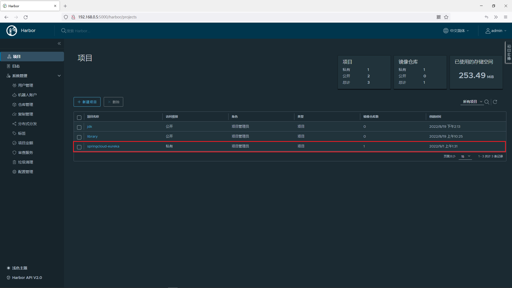
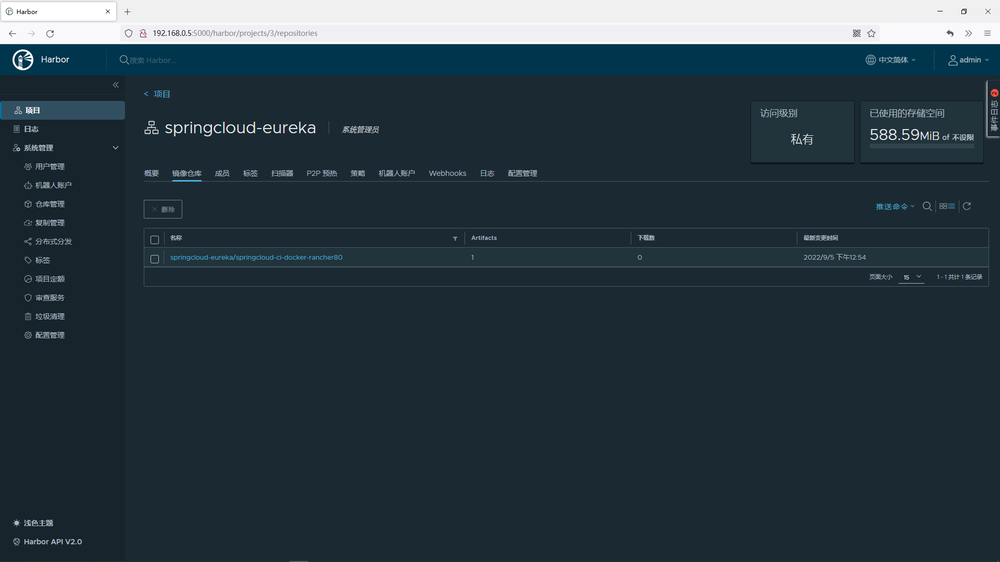
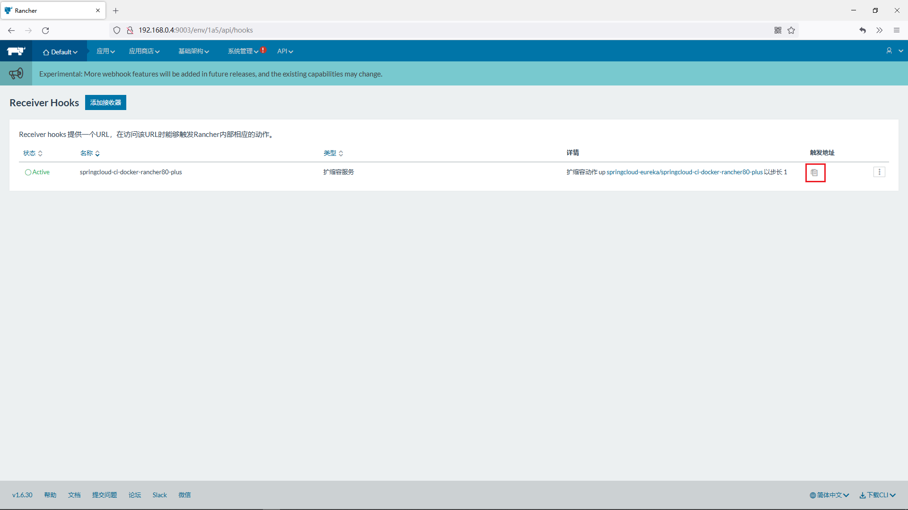
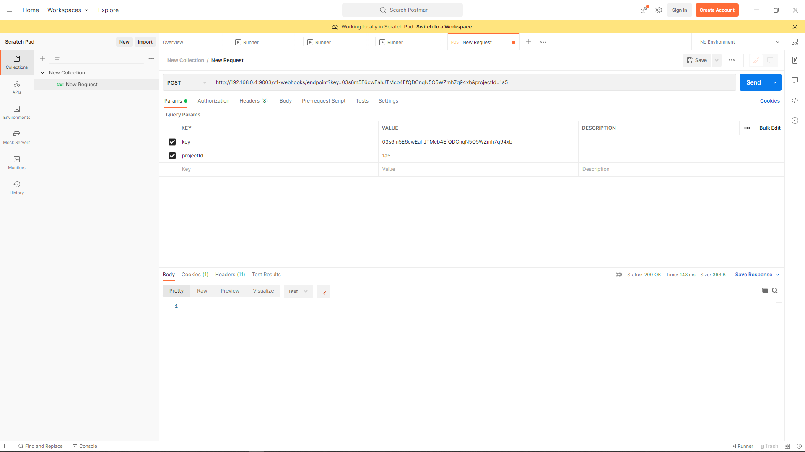
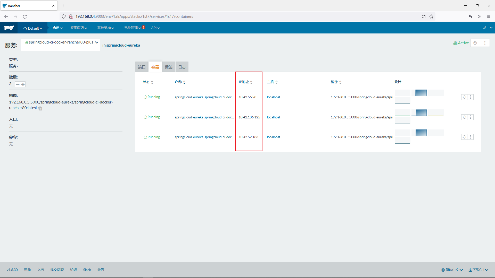

# 19.使用rancher管理docker和Kubernetes
@include(@src/public/enhance/guidance/backend/springcloud/springcloud-eureka/chapter/springcloud-eureka-guidance-chapter19.md)
## 19.3.使用rancher管理docker
### 19.3.1.搭建rancher
    在192.168.0.4上搭建rancher
详细参考-> <a href="/blogs/environment/centos/centos7/shardings/centos7-chapter-5.搭建Rancher技术栈.html#_5-3-搭建rancher" target="_blank">搭建rancher</a>
### 19.3.2.搭建用于测试使用rancher管理docker的微服务
#### 19.3.2.1.模块简介
    测试持续集成微服务到docker中使用到的微服务
#### 19.3.2.2.模块目录结构
```md
@include(../projects/springcloud-eureka/springcloud-ci-docker-rancher80/tree.md)
```
#### 19.3.2.3.创建模块
	在父工程(springcloud-eureka)中创建一个名为springcloud-ci-docker-rancher80的maven模块,注意:当前模块创建成功后,在父工程pom.xml中<modules></modules>中会自动生成有关当前模块的信息
#### 19.3.2.4.编写模块pom.xml
```xml
@include(../projects/springcloud-eureka/springcloud-ci-docker-rancher80/pom.xml)
```
#### 19.3.2.5.编写模块配置文件
    application.yml
```yml
@include(../projects/springcloud-eureka/springcloud-ci-docker-rancher80/src/main/resources/application.yml)
```
    logback-custom.xml
```xml
@include(../projects/springcloud-eureka/springcloud-ci-docker-rancher80/src/main/resources/logback-custom.xml)
```
#### 19.3.2.6.编写模块controller
```java
@include(../projects/springcloud-eureka/springcloud-ci-docker-rancher80/src/main/java/org/openatom/springcloud/controller/CiDockerRancherController.java)
```
#### 19.3.2.7.编写模块config
```java
@include(../projects/springcloud-eureka/springcloud-ci-docker-rancher80/src/main/java/org/openatom/springcloud/config/VirtualIpConfig.java)
```
#### 19.3.2.8.编写模块主启动类
```java
@include(../projects/springcloud-eureka/springcloud-ci-docker-rancher80/src/main/java/org/openatom/springcloud/CiDockerRancher80.java)
```
#### 19.3.2.9.编写模块Dockerfile
    注意:需要先在 项目根目录/springcloud-ci-docker-rancher80下创建docker文件夹
@include(../projects/springcloud-eureka/springcloud-ci-docker-rancher80/docker/Dockerfile)
```
### 19.3.3.配置rancher连接docker
    访问rancher->点击右下角切换语言处切换为中文环境
```
http://192.168.0.4:9003/
```
::: center
<div class="imgbg-customer">

</div>
:::

    添加主机

    在docker主机上注册rancher
    上面步骤执行完成之后,复制弹出界面中第五步(将下列脚本拷贝到每一台主机上运行以注册 Rancher:)的代码到docker安装的主机上执行,执行完成后点击关闭按钮
```
sudo docker run --rm --privileged -v /var/run/docker.sock:/var/run/docker.sock \
-v /var/lib/rancher:/var/lib/rancher rancher/agent:v1.2.11 \
http://192.168.0.4:9003/v1/scripts/9F1C7A21277B3BBB9357:1640908800000:wdp8qKpCKNvXMXY3IYsICf0ovk
```
### 19.3.4.配置rancher连接harbor使用的认证

    镜像库信息
    a.地址*
    192.168.0.5:5000
    b.用户名
    admin
    c.密码
    123456
::: center
<div class="imgbg-customer">

</div>
:::

### 19.3.5.使用docker的maven插件推送镜像到harbor
    启动相关服务


    在项目根目录下执行打包命令
```
mvn clean install
```

    在项目根目录下执行复制生成的jar包到指定位置
```
cp springcloud-ci-docker80/target/springcloud-ci-docker-rancher80.jar springcloud-ci-docker-rancher80/docker
```

    在idea中打开docker的maven插件操作面板
::: center
<div class="imgbg-customer">

</div>
:::

    制作Docker镜像并上传镜像到docker制作Docker镜像
    点击docker:build

    在harbor私服中创建springcloud-eureka项目
::: center
<div class="imgbg-customer">

</div>
:::

    推送到harbor私服
    点击docker:build->点击docker:push
    登录harbor私服查看刚才推送上去的的服务
```
http://192.168.0.5:5000/harbor/projects
```
    点击springcloud-eureka这个项目
::: center
<div class="imgbg-customer">

</div>
:::
    可以看到当前模块微服务已经被推送到了harbor私服中

### 19.3.6.使用rancher管理docker容器
#### 19.3.6.1.添加docker容器
    访问rancher
```
http://192.168.0.4:9003/
```
    添加容器


    填写容器信息
    a.名称
    springcloud-ci-docker-rancher80
    b.选择镜像*
    192.168.0.5:5000/springcloud-eureka/springcloud-ci-docker-rancher80:latest
    c.端口映射
    公开主机端口 80
    私有容器端口 80
    协议 TCP
::: center
<div class="imgbg-customer">

</div>
:::

    最后点击页面底部创建
#### 19.3.6.2.测试使用rancher管理docker容器
    浏览器访问
```
http://192.168.0.4/ci/docker/rancher
```
    返回结果
```
{"code":200,"message":"持续集成","data":"测试持续集成到Docker+测试Racnehr"}
```

### 19.3.7.使用rancher对应用进行扩容
#### 19.3.7.1.添加应用
    访问rancher
```
http://192.168.0.4:9003/
```

    添加应用


    填写应用信息
    a.名称
    springcloud-eureka

    进入界面后选择添加服务->填写容器信息
    a.名称
    springcloud-ci-docker-rancher80-plus
    b.选择镜像*
    192.168.0.5:5000/springcloud-eureka/springcloud-ci-docker-rancher80:latest
    c.端口映射
    特别注意: 这里不要配置端口映射
#### 19.3.7.2.配置WebHooks
    访问rancher
```
http://192.168.0.4:9003/
```

    添加接收器

::: center
<div class="imgbg-customer">

</div>
:::

    点击创建后来到如下界面,点击复制按钮即可获取扩容触发api
::: center
<div class="imgbg-customer">

</div>
:::

#### 19.3.7.3.使用postman触发扩容
    使用postman触发扩容(点击两次,注意:请求方式一定是post方式)
::: center
<div class="imgbg-customer">

</div>
:::

    查看扩容效果

    即可查看到应用已经扩容为三份,缩容不再演示,详细请参考扩容自动配置
#### 19.3.7.4.为扩容后的应用添加负载均衡器
    在刚才创建应用的时候,没有配置端口映射,外部是无法访问这个服务的,如果外部要访问这个服务,则要配置负载均衡器

::: center
<div class="imgbg-customer">

</div>
:::

    在浏览器访问
```
http://192.168.0.4/ci/docker/rancher
```

    返回结果
```
{"code":200,"message":"持续集成","data":"测试持续集成到Docker+测试Racnehr"}
```
#### 19.3.7.5.查看扩容后每个节点的日志
##### 19.3.7.5.1.在kibana为日志创建索引
    访问kibana
```
http://192.168.0.5:5601/
```
::: center
<div class="imgbg-customer">

</div>
:::

    为推送到ELK中的日志文件创建索引

    注意:如果点击Discover没有显示日志,请确定ELK部署机器中的时区和时间是否正确,如果不正确,将时区和时间修改正确后再次启动项目,重新执行创建索引的操作,可以看到kibana中展示出来了推送到elk中日志
##### 19.3.7.5.2.获取扩容后节点的ip
    查看服务所有节点详细信息


    可以看到扩容后所有节点的ip信息
::: center
<div class="imgbg-customer">

</div>
:::

##### 19.3.7.5.3.查看日志
    根据ip信息可以在kibana中过滤出不同节点的日志
::: center
<div class="imgbg-customer">

</div>
:::

#### 19.3.7.6.为rancher设计扩容缩容算法
    使用java程序触发rancher的扩容或缩容,如根据时间节点扩容缩容,8:00-12:00这个时间范围内扩容,12:00-20:00这个时间内缩容,这只是一种思路,其他的更复杂的扩容缩容算法请自行根据业务设计

## 19.4.使用rancher管理Kubernetes


<ScrollIntoPageView/>
<HideSideBar/>
