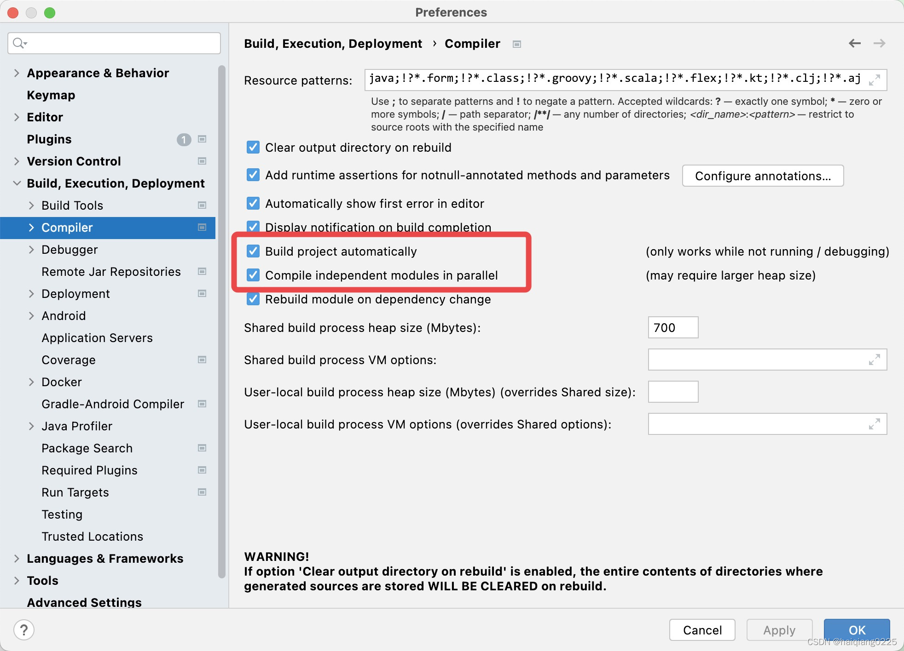
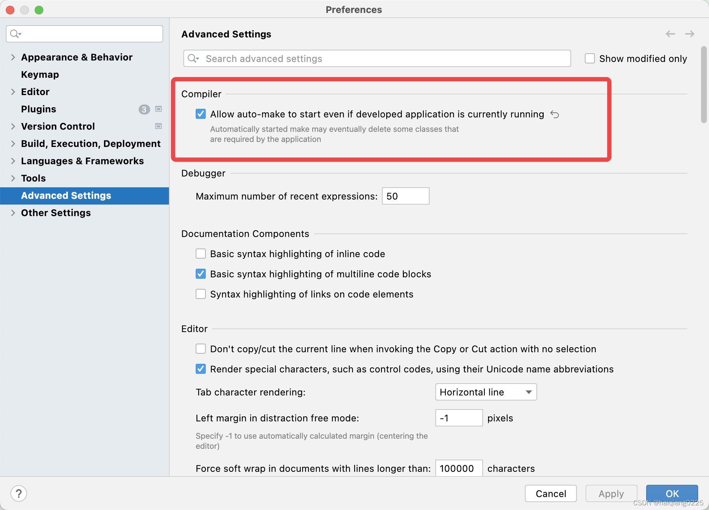

# 2.搭建项目基础设施
@include(@src/public/enhance/guidance/backend/springcloud/springcloud-eureka/chapter/springcloud-eureka-guidance-chapter2.md)
## 2.3.创建项目父工程
### 2.3.1.创建父工程
	在idea中创建一个名为springcloud-eureka的maven工程,创建完成后打开该工程,删除src文件夹
### 2.3.2.编写父工程pom.xml
    pom.xml中配置主要包括两部分内容,第一是对子模块依赖的jar包和使用到的插件的版本的统一规定,第二是规定了四种不同的环境,分别是: 1.开发环境(dev) 2.测试环境(test) 3.生产环境(prod) 4.rancher测试专用环境(rancher),关于这四种环境的详细内容会在本博客的最后一部分进行详细解析说明
    
    pom.xml
```xml
<?xml version="1.0" encoding="UTF-8"?>

<project xmlns="http://maven.apache.org/POM/4.0.0" xmlns:xsi="http://www.w3.org/2001/XMLSchema-instance"
         xsi:schemaLocation="http://maven.apache.org/POM/4.0.0 http://maven.apache.org/xsd/maven-4.0.0.xsd">
    <modelVersion>4.0.0</modelVersion>

    <groupId>org.openatom</groupId>
    <artifactId>springcloud-eureka</artifactId>
    <version>1.0-SNAPSHOT</version>
    <packaging>pom</packaging>

    <!--引入所有模块：开始-->
    <modules>
    </modules>
    <!--引入所有模块：结束-->

    <!--统一定义依赖具体版本：开始 -->
    <properties>
        <!--依赖版本-->
        <project.build.sourceEncoding>UTF-8</project.build.sourceEncoding>
        <maven.compiler.source>1.8</maven.compiler.source>
        <maven.compiler.target>1.8</maven.compiler.target>
        <junit.version>4.12</junit.version>
        <log4j.version>1.2.17</log4j.version>
        <lombok.version>1.16.18</lombok.version>
        <mysql.connector.version>8.0.28</mysql.connector.version>
        <spring.boot.version>2.2.2.RELEASE</spring.boot.version>
        <druid.spring.boot.version>1.1.10</druid.spring.boot.version>
        <spring.cloud.version>Hoxton.SR1</spring.cloud.version>
        <mybatis.spring.boot.version>1.3.0</mybatis.spring.boot.version>
        <org.openatom.api.commons.version>1.0-SNAPSHOT</org.openatom.api.commons.version>
        <com.ctrip.framework.apollo.apollo-client.version>2.0.1</com.ctrip.framework.apollo.apollo-client.version>
        <io.seata.version>1.4.2</io.seata.version>
        <spring.cloud.alibaba.version>2.2.0.RELEASE</spring.cloud.alibaba.version>
        <net.logstash.logback.logstash-logback-encoder.version>5.2</net.logstash.logback.logstash-logback-encoder.version>
        <spring.boot.admin.version>2.2.1</spring.boot.admin.version>

        <!--插件版本-->
        <org.springframework.boot.spring-boot-maven-plugin.version>2.2.2.RELEASE</org.springframework.boot.spring-boot-maven-plugin.version>
        <org.apache.maven.plugins.maven-resources-plugin.version>3.2.0</org.apache.maven.plugins.maven-resources-plugin.version>
        <io.fabric8.docker-maven-plugin.version>0.39.1</io.fabric8.docker-maven-plugin.version>
        <org.apache.maven.plugins.maven-antrun-plugin.version>1.8</org.apache.maven.plugins.maven-antrun-plugin.version>
    </properties>
    <!--统一定义依赖具体版本：结束 -->

    <!--统一定义依赖版本：开始-->
    <dependencyManagement>
        <dependencies>
            <!--spring boot 2.2.2-->
            <dependency>
                <groupId>org.springframework.boot</groupId>
                <artifactId>spring-boot-dependencies</artifactId>
                <version>${spring.boot.version}</version>
                <type>pom</type>
                <scope>import</scope>
            </dependency>
            <!--spring cloud Hoxton.SR1-->
            <dependency>
                <groupId>org.springframework.cloud</groupId>
                <artifactId>spring-cloud-dependencies</artifactId>
                <version>${spring.cloud.version}</version>
                <type>pom</type>
                <scope>import</scope>
            </dependency>
            <!--spring cloud alibaba 2.1.0.RELEASE-->
            <dependency>
                <groupId>com.alibaba.cloud</groupId>
                <artifactId>spring-cloud-alibaba-dependencies</artifactId>
                <version>${spring.cloud.alibaba.version}</version>
                <type>pom</type>
                <scope>import</scope>
            </dependency>
            <dependency>
                <groupId>mysql</groupId>
                <artifactId>mysql-connector-java</artifactId>
                <version>${mysql.connector.version}</version>
            </dependency>
            <dependency>
                <groupId>org.mybatis.spring.boot</groupId>
                <artifactId>mybatis-spring-boot-starter</artifactId>
                <version>${mybatis.spring.boot.version}</version>
            </dependency>
            <dependency>
                <groupId>com.alibaba</groupId>
                <artifactId>druid-spring-boot-starter</artifactId>
                <version>${druid.spring.boot.version}</version>
            </dependency>
            <dependency>
                <groupId>junit</groupId>
                <artifactId>junit</artifactId>
                <version>${junit.version}</version>
            </dependency>
            <dependency>
                <groupId>log4j</groupId>
                <artifactId>log4j</artifactId>
                <version>${log4j.version}</version>
            </dependency>
            <dependency>
                <groupId>org.projectlombok</groupId>
                <artifactId>lombok</artifactId>
                <version>${lombok.version}</version>
            </dependency>
            <!--定义公共的工程版本-->
            <dependency>
                <groupId>org.openatom</groupId>
                <artifactId>springcloud-api-commons</artifactId>
                <version>${org.openatom.api.commons.version}</version>
            </dependency>
            <!--Apollo客户端-->
            <dependency>
                <groupId>com.ctrip.framework.apollo</groupId>
                <artifactId>apollo-client</artifactId>
                <version>${com.ctrip.framework.apollo.apollo-client.version}</version>
            </dependency>
            <!--Seata客户端-->
            <dependency>
                <groupId>io.seata</groupId>
                <artifactId>seata-spring-boot-starter</artifactId>
                <version>${io.seata.version}</version>
            </dependency>
            <!--springboot admin server端-->
            <dependency>
                <groupId>de.codecentric</groupId>
                <artifactId>spring-boot-admin-starter-server</artifactId>
                <version>${spring.boot.admin.version}</version>
            </dependency>
            <!--springboot admin client端-->
            <dependency>
                <groupId>de.codecentric</groupId>
                <artifactId>spring-boot-admin-starter-client</artifactId>
                <version>${spring.boot.admin.version}</version>
            </dependency>
            <!--logstah-->
            <dependency>
                <groupId>net.logstash.logback</groupId>
                <artifactId>logstash-logback-encoder</artifactId>
                <version>${net.logstash.logback.logstash-logback-encoder.version}</version>
            </dependency>
        </dependencies>
    </dependencyManagement>
    <!--统一定义依赖版本：结束-->

    <!--定义多种开发环境:开始-->
    <profiles>
		<!--开发环境-->
        <profile>
            <!--不同环境的唯一id-->
            <id>dev</id>
            <properties>
                <!--profile.active对应application.yml中的@profile.active@-->
                <profile.active>dev</profile.active>
                <!--dev环境docker私服连接信息(使用docker官方提供的私服):开始-->
                <docker.registry.uri>192.168.0.4:5000</docker.registry.uri>
                <docker.registry.username>docker</docker.registry.username>
                <docker.registry.password>123456</docker.registry.password>
                <!--dev环境docker私服连接信息(使用docker官方提供的私服):结束-->
                <!--dev环境docker部署地址:端口-->
                <docker.host>tcp://192.168.0.4:2375</docker.host>
            </properties>
        </profile>

        <!--测试环境-->
        <profile>
            <id>test</id>
            <properties>
                <profile.active>test</profile.active>
                <!--test环境docker私服连接信息(vmware提供的私服的harbor私服):开始-->
                <docker.registry.uri>192.168.0.4:5001</docker.registry.uri>
                <docker.registry.username>admin</docker.registry.username>
                <docker.registry.password>123456</docker.registry.password>
                <!--dev环境docker私服连接信息(vmware提供的私服的harbor私服):结束-->
                <!--dev环境docker部署地址:端口-->
                <docker.host>tcp://192.168.0.4:2375</docker.host>
            </properties>
        </profile>

        <!--生产环境-->
        <profile>
            <id>prod</id>
            <properties>
                <profile.active>prod</profile.active>
                <!--prod环境docker私服连接信息(使用docker官方提供的私服):开始-->
                <docker.registry.uri>192.168.0.4:5000</docker.registry.uri>
                <docker.registry.username>docker</docker.registry.username>
                <docker.registry.password>123456</docker.registry.password>
                <!--prod环境docker私服连接信息(使用docker官方提供的私服):结束-->
                <!--prod环境docker部署地址:端口-->
                <docker.host>tcp://192.168.0.4:2375</docker.host>
            </properties>
            <activation>
                <!--默认激活环境-->
                <activeByDefault>true</activeByDefault>
            </activation>
        </profile>

        <!--rancher测试专用环境-->
        <profile>
            <id>rancher</id>
            <properties>
                <profile.active>rancher</profile.active>
                <!--rancher环境docker私服连接信息(vmware提供的私服的harbor私服):开始-->
                <docker.registry.uri>192.168.0.4:5001</docker.registry.uri>
                <docker.registry.username>admin</docker.registry.username>
                <docker.registry.password>123456</docker.registry.password>
                <!--rancher环境docker私服连接信息(vmware提供的私服的harbor私服):结束-->
                <!--rancher环境docker部署地址:端口-->
                <docker.host>tcp://192.168.0.4:2375</docker.host>
            </properties>
        </profile>
    </profiles>
    <!--定义多种开发环境:结束-->

    <!--统一定义插件版本：开始-->
    <build>
        <!--spring-boot-maven-plugin插件-->
        <plugins>
            <plugin>
                <groupId>org.springframework.boot</groupId>
                <artifactId>spring-boot-maven-plugin</artifactId>
                <version>${org.springframework.boot.spring-boot-maven-plugin.version}</version>
            </plugin>
            <!--支持yaml读取pom的参数-->
            <plugin>
                <groupId>org.apache.maven.plugins</groupId>
                <artifactId>maven-resources-plugin</artifactId>
                <version>${org.apache.maven.plugins.maven-resources-plugin.version}</version>
            </plugin>
            <!--执行maven命令时执行删除jar包和复制jar包操作-->
            <plugin>
                <groupId>org.apache.maven.plugins</groupId>
                <artifactId>maven-antrun-plugin</artifactId>
                <version>${org.apache.maven.plugins.maven-antrun-plugin.version}</version>
            </plugin>
            <!--docker maven插件-->
            <plugin>
                <groupId>io.fabric8</groupId>
                <artifactId>docker-maven-plugin</artifactId>
                <version>${io.fabric8.docker-maven-plugin.version}</version>
            </plugin>
        </plugins>
    </build>
    <!--统一定义插件版本：结束-->
</project>
```

## 2.4.创建项目依赖的公共模块
### 2.4.1.模块目录结构
```md
@include(../projects/springcloud-eureka/springcloud-api-commons/tree.md)
```
### 2.4.2.创建模块
	在父工程(springcloud-eureka)中创建一个名为springcloud-api-commons的maven模块,这个模块中包含了一些公共的Java实体和一些公共的插件,后面的每个模块都要引入这个公共模块,注意:当前模块创建成功后,在父工程pom.xml中<modules></modules>中会自动生成有关当前模块的信息
### 2.4.3.编写模块pom.xml
```xml
@include(../projects/springcloud-eureka/springcloud-api-commons/pom.xml)
```
### 2.4.4.编写模块中实体类
    Payment.java
```java
@include(../projects/springcloud-eureka/springcloud-api-commons//src/main/java/org/openatom/springcloud/entities/Payment.java)
```

## 2.5.准备项目需要的数据库
### 2.5.1.安装mysql数据库
<a href="/blogs/environment/centos/centos7/shardings/centos7-chapter-3.搭建基础开发环境.html#_3-5-安装mysql" target="_blank">安装mysql8</a>

### 2.5.2.创建项目需要的数据库
    导入数据库脚本(application.yml中数据库配置和mysql部署机器信息保持一致)
```sql
@include(../projects/springcloud-eureka/script/payment.sql)
```

## 2.6.配置使用热部署
    在公共模块的pom.xml中添加热部署依赖和相关配置(上一步已经添加进去了,这里只是展示热部署部分的代码),将热部署相关插件和配置放在公共模块的好处是,其他的模块引用公共模块的时候就已经引入了热部署相关插件和配置,无需额外引入
```xml
    <dependencies>
        <!--热部署插件-->
        <dependency>
            <groupId>org.springframework.boot</groupId>
            <artifactId>spring-boot-devtools</artifactId>
            <scope>runtime</scope>
            <!--是否依赖传递:true,依赖不传递,false:依赖传递,这是maven的特性-->
            <optional>false</optional>
        </dependency>
    </dependencies>

    <!--热部署需要加这个-->
    <build>
        <plugins>
            <plugin>
                <groupId>org.springframework.boot</groupId>
                <artifactId>spring-boot-maven-plugin</artifactId>
                <configuration>
                    <fork>true</fork>
                    <addResources>true</addResources>
                </configuration>
            </plugin>
        </plugins>
    </build>
```
    更改idea设置
::: center
<div class="imgbg-customer">

</div>
:::
::: center
<div class="imgbg-customer">

</div>
:::

    热部署注意事项
    开发阶段开启热部署,发布阶段一定要关闭热部署
    开启热部署功能:spring.devtools.restart.enabled: true
    关闭热部署功能:spring.devtools.restart.enabled: false


<ScrollIntoPageView/>
