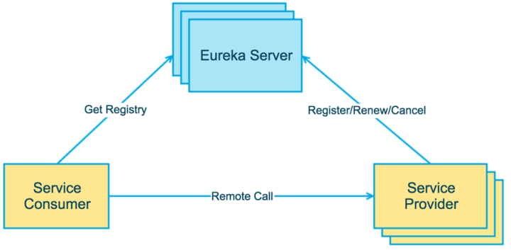

# 3.使用Eureka作为注册中心
@include(@src/public/enhance/guidance/backend/springcloud/springcloud-eureka/chapter/springcloud-eureka-guidance-chapter3.md)
## 3.3.Eureka注册中心简介
	Eureka是Netflix公司开发的服务发现框架,Spring Cloud对它提供了支持,将它集成在了自己spring-cloud-netflix子项目中,用来实现Spring Cloud的服务发现功能,核心功能是为实现服务发现提供了基础支持。本次我们将搭建一个单节点版的Eureka注册中心和一个集群(高可用)版的Eureka注册中心,用来实现服务发现功能。

	官方网站(GITHUB)
```
https://github.com/Netflix/eureka
```

	官方网站(SPRING.IO)
```
https://spring.io/projects/spring-cloud-netflix
```

	EUREKA架构图
::: center

:::

	Eureka的基础组件
	服务提供者(Service Provide): 服务提供方将自身服务注册到Eureka,从而使服务消费方能够找到
	服务消费者(Service Consumer): 服务消费方从Eureka获取注册服务列表,从而能够消费服务
	服务中介(Eureka Server): 是服务提供者和服务消费者之间的桥梁，服务提供者可以把自己注册到服务中介那里，而服务消费者如需要消费一些服务(使用一些功能)就可以在服务中介中寻找注册在服务中介的服务提供者。

	Eureka的提供了哪些功能?
	服务注册(Service Register)
	当Eureka客户端向Eureka Server注册时,它提供自身的元数据,比如IP地址、端口,运行状况指示符URL等
	服务续约(Service Renew)
	Eureka客户会每隔30秒(默认情况下)发送一次心跳来续约。通过续约来告知 Eureka Server该Eureka客户仍然存在,没有出现问题。正常情况下,如果 Eureka Server在90秒没有收到Eureka客户的续约,它会将实例从其注册表中删除
	获取注册列表信息(Service Fetch Registries)
	Eureka 客户端从服务器获取注册表信息,并将其缓存在本地。客户端会使用该信息查找其他服务,从而进行远程调用。该注册列表信息定期(每30 秒钟)更新一次。每次返回注册列表信息可能与Eureka客户端的缓存信息不同,Eureka客户端自动处理。如果由于某种原因导致注册列表信息不能及时匹配,Eureka 客户端则会重新获取整个注册表信息。Eureka 服务器缓存注册列表信息,整个注册表以及每个应用程序的信息进行了压缩,压缩内容和没有压缩的内容完全相同。Eureka客户端和Eureka服务器可以使用JSON/XML格式进行通讯。在默认的情况下 Eureka客户端使用压缩JSON 格式来获取注册列表的信息。
	服务下线(Service Cancel)
	Eureka 客户端在程序关闭时向 Eureka 服务器发送取消请求。发送请求后,该客户端实例信息将从服务器的实例注册表中删除。该下线请求不会自动完成,它需要调用以下内容:DiscoveryManager.getInstance().shutdownComponent();
	服务剔除(Service Eviction)
	在默认的情况下,当Eureka客户端连续90秒(3个续约周期)没有向Eureka服务器发送服务续约,即心跳,Eureka 服务器会将该服务实例从服务注册列表删除,即服务剔除。

## 3.4.单节点版EUREKA注册中心搭建
### 3.4.1.模块简介
    本模块会搭建一个单节点版的Eureka注册中心
### 3.4.2.模块目录结构
    在下面的内容中,涉及到具体的文件(包括.java文件、.xml文件、.yml文件等)不会告知具体的路径,具体的路径请根据模块目录结构自行创建,
```
@include(../project_springcloud-eureka/springcloud-register-center-single-node7001/tree.md)
```
### 3.4.3.创建模块
	在父工程(springcloud-eureka)中创建一个名为springcloud-register-center-single-node7001的maven模块
### 3.4.4.编写模块pom.xml
```xml
@include(../project_springcloud-eureka/springcloud-register-center-single-node7001/pom.xml)
```
### 3.4.5.编写模块application.yml
```yml
@include(../project_springcloud-eureka/springcloud-register-center-single-node7001/src/main/resources/application.yml)
```
### 3.4.6.编写主启动类
```java
@include(../project_springcloud-eureka/springcloud-register-center-single-node7001/src/main/java/org.openatom.springcloud/RegisterCcenterSingleNode7001.java)
```
### 3.4.7.测试模块
    编写完成后,等maven依赖导入成功,运行主启动类,在浏览器中访问
```
http://localhost:7001
```
    看到如下界面代表搭建成功
::: center

:::
## 3.5.集群(高可用)版EUREKA注册中心搭建
