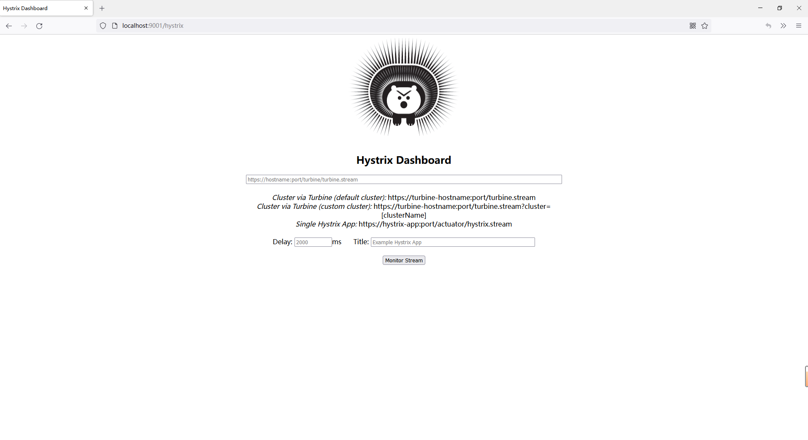
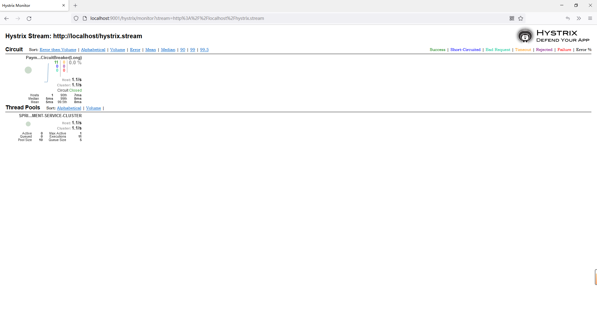

# 8.使用DashBoard和Turbine对服务进行监控
@include(@src/public/enhance/guidance/backend/springcloud/springcloud-eureka/chapter/springcloud-eureka-guidance-chapter8.md)
## 8.3.使用Hystrix DashBoard对服务单个节点进行监控 {#8_3_}
### 8.3.1.Hystrix DashBoard简介 {#8_3_1_}
    DashBoard全称Hystrix Dashboard,是Spring Cloud的仪表盘组件,可以查看Hystrix实例的执行情况,支持查看单个实例和查看集群实例,但是需要结合spring-boot-actuator一起使用。Hystrix Dashboard主要用来实时监控Hystrix的各项指标信息。Hystrix Dashboard可以有效地反映出每个Hystrix实例的运行情况，帮助我们快速发现系统中的问题，从而采取对应措施。
### 8.3.2.模块简介 {#8_3_2_}
    Hystrix DashBoard,启动端口: 9001
### 8.3.3.模块目录结构 {#8_3_3_}
```md
@include(../projects/springcloud-eureka/springcloud-mointor-hystrix-dashboard9001/tree.md)
```
### 8.3.4.创建模块 {#8_3_4_}
	在父工程(springcloud-eureka)中创建一个名为springcloud-mointor-hystrix-dashboard9001的maven模块,注意:当前模块创建成功后,在父工程pom.xml中<modules></modules>中会自动生成有关当前模块的信息
### 8.3.5.编写模块pom.xml {#8_3_5_}
```xml
@include(../projects/springcloud-eureka/springcloud-mointor-hystrix-dashboard9001/pom.xml)
```
### 8.3.6.编写模块application.yml {#8_3_6_}
```yml
@include(../projects/springcloud-eureka/springcloud-mointor-hystrix-dashboard9001/src/main/resources/application.yml)
```
### 8.3.7.编写模块主启动类 {#8_3_7_}
```java
@include(../projects/springcloud-eureka/springcloud-mointor-hystrix-dashboard9001/src/main/java/org/openatom/springcloud/MointorHystrixDashboard9001.java)
```
### 8.3.8.修改服务提供者8003主启动类 {#8_3_8_}
    使用Hystrix Dashboard监控服务,被监控的服务提供者和服务消费者必须满足以下条件
    pom.xml中引入如下依赖
```
<dependency>
    <groupId>org.springframework.boot</groupId>
    <artifactId>spring-boot-starter-actuator</artifactId>
</dependency>
<dependency>
    <groupId>org.springframework.cloud</groupId>
    <artifactId>spring-cloud-starter-netflix-hystrix</artifactId>
</dependency>
```
    在主启动类中注册ServletRegistrationBean这个Bean
```
@Bean
public ServletRegistrationBean getServlet() {
    HystrixMetricsStreamServlet streamServlet = new HystrixMetricsStreamServlet();
    ServletRegistrationBean registrationBean = new ServletRegistrationBean(streamServlet);
    registrationBean.setLoadOnStartup(1);
    registrationBean.addUrlMappings("/hystrix.stream");
    registrationBean.setName("HystrixMetricsStreamServlet");
    return registrationBean;
}
```

    修改后的主启动类如下
```java
@include(../projects/springcloud-eureka/springcloud-provider-hystrix-cluster-node-payment8003/src/main/java/org/openatom/springcloud/PaymentServiceProviderHystrixClusterNode8003.java)
```

### 8.3.9.修改服务提供者8004主启动类 {#8_3_9_}
    使用Hystrix Dashboard监控服务,被监控的服务提供者和服务消费者必须满足以下条件
    pom.xml中引入如下依赖
```
<dependency>
    <groupId>org.springframework.boot</groupId>
    <artifactId>spring-boot-starter-actuator</artifactId>
</dependency>
<dependency>
    <groupId>org.springframework.cloud</groupId>
    <artifactId>spring-cloud-starter-netflix-hystrix</artifactId>
</dependency>
```
    在主启动类中注册ServletRegistrationBean这个Bean
```
@Bean
public ServletRegistrationBean getServlet() {
    HystrixMetricsStreamServlet streamServlet = new HystrixMetricsStreamServlet();
    ServletRegistrationBean registrationBean = new ServletRegistrationBean(streamServlet);
    registrationBean.setLoadOnStartup(1);
    registrationBean.addUrlMappings("/hystrix.stream");
    registrationBean.setName("HystrixMetricsStreamServlet");
    return registrationBean;
}
```

    修改后的主启动类如下
```java
@include(../projects/springcloud-eureka/springcloud-provider-hystrix-cluster-node-payment8004/src/main/java/org/openatom/springcloud/PaymentServiceProviderHystrixClusterNode8004.java)
```

### 8.3.10.修改服务消费者80主启动类 {#8_3_10_}
    使用Hystrix Dashboard监控服务,被监控的服务提供者和服务消费者必须满足以下条件
    pom.xml中引入如下依赖
```
<dependency>
    <groupId>org.springframework.boot</groupId>
    <artifactId>spring-boot-starter-actuator</artifactId>
</dependency>
<dependency>
    <groupId>org.springframework.cloud</groupId>
    <artifactId>spring-cloud-starter-netflix-hystrix</artifactId>
</dependency>
```
    在主启动类中注册ServletRegistrationBean这个Bean
```
@Bean
public ServletRegistrationBean getServlet() {
    HystrixMetricsStreamServlet streamServlet = new HystrixMetricsStreamServlet();
    ServletRegistrationBean registrationBean = new ServletRegistrationBean(streamServlet);
    registrationBean.setLoadOnStartup(1);
    registrationBean.addUrlMappings("/hystrix.stream");
    registrationBean.setName("HystrixMetricsStreamServlet");
    return registrationBean;
}
```

    修改后的主启动类如下
```java
@include(../projects/springcloud-eureka/springcloud-consumer-hystrix-loadbalance-openfeign-configuration-order80/src/main/java/org/openatom/springcloud/OrderServiceConsumerHystrixLoadBalanceOpenFeignConfiguration80.java)
```

### 8.3.11.测试模块 {#8_3_11_}
    启动相关服务

    注意事项
    Hystrix DashBoard只能监控设置了服务降级或服务熔断的方法,未设置降级或者熔断的方法是无法监控到的,也是说未设置降级和熔断的方法调用后是不会和Hystrix DashBoard产生任何关系的

    测试使用Hystrix DashBoard对单个服务进行监控
访问Hystrix DashBoard
```
http://localhost:9001/hystrix
```
::: center
<div class="imgbg-customer">

</div>
:::

    监控服务消费端

    Hystrix DashBoard参数
```
http://localhost/hystrix.stream
```
    示例服务URL
```
http://localhost/consumer/payment/circuitbreaker/get/1
```
    可以看到界面自动统计出了消费端某个服务的访问情况
::: center
<div class="imgbg-customer">

</div>
:::

    监控服务提供端8003

    Hystrix DashBoard参数
```
http://localhost:8003/hystrix.stream
```
    示例服务URL(访问这个服务消费端的服务,会自动调用服务提供端8003的服务,不是每次都调用,每次在8003和8004随机选择一个节点进行调用)
```
http://localhost/consumer/payment/circuitbreaker/get/1
```
    可以看到界面自动统计出了提供端8003某个服务的访问情况
::: center
<div class="imgbg-customer">

</div>
:::

    监控服务提供端8004

    Hystrix DashBoard参数
```
http://localhost:8004/hystrix.stream
```
    示例服务URL(访问这个服务消费端的服务,会自动调用服务提供端8003的服务,不是每次都调用,每次在8003和8004随机选择一个节点进行调用)
```
http://localhost/consumer/payment/circuitbreaker/get/1
```
    可以看到界面自动统计出了提供端8004某个服务的访问情况
::: center
<div class="imgbg-customer">

</div>
:::

## 8.4.使用Turbine汇聚服务提供端多个节点访问统计数据 {#8_4_}
### 8.4.1.Turbine简介 {#8_4_1_}
    Turbine是聚合服务器发送事件流数据的一个工具,Hystrix DashBoard的监控中,只能监控单个节点,实际生产中都为集群,每个服务都会部署在多个节点上,因此可以通过Turbine来监控集群服务,将Hystrix DashBoard收集到的服务访问统计数据汇集在一起并以图形化界面展示出来。
### 8.4.2.模块简介 {#8_4_2_}
    使用Turbine汇聚Hystrix DashBoard监控到的所有节点访问统计数据,启动端口: 9002
### 8.4.3.模块目录结构 {#8_4_3_}
```md
@include(../projects/springcloud-eureka/springcloud-mointor-hystrix-dashboard-turbine9002/tree.md)
```
### 8.4.4.创建模块 {#8_4_4_}
	在父工程(springcloud-eureka)中创建一个名为springcloud-mointor-hystrix-dashboard-turbine9002的maven模块,注意:当前模块创建成功后,在父工程pom.xml中<modules></modules>中会自动生成有关当前模块的信息
### 8.4.5.编写模块pom.xml {#8_4_5_}
```xml
@include(../projects/springcloud-eureka/springcloud-mointor-hystrix-dashboard-turbine9002/pom.xml)
```
### 8.4.6.编写模块application.yml {#8_4_6_}
```yml
@include(../projects/springcloud-eureka/springcloud-mointor-hystrix-dashboard-turbine9002/src/main/resources/application.yml)
```
### 8.4.7.编写模块主启动类 {#8_4_7_}
```java
@include(../projects/springcloud-eureka/springcloud-mointor-hystrix-dashboard-turbine9002/src/main/java/org/openatom/springcloud/MointorHystrixDashboardTurbine9002.java)
```
### 8.4.8.修改服务提供者8003主启动类 {#8_4_8_}
    使用Turbine聚合Hystrix Dashboard监控数据,被监控的服务提供者和服务消费者必须满足以下条件
    pom.xml中引入如下依赖
```
<dependency>
    <groupId>org.springframework.boot</groupId>
    <artifactId>spring-boot-starter-actuator</artifactId>
</dependency>
<dependency>
    <groupId>org.springframework.cloud</groupId>
    <artifactId>spring-cloud-starter-netflix-hystrix</artifactId>
</dependency>
```
    在主启动类中注册ServletRegistrationBean这个Bean
```
@Bean
public ServletRegistrationBean getServlet() {
    HystrixMetricsStreamServlet streamServlet = new HystrixMetricsStreamServlet();
    ServletRegistrationBean registrationBean = new ServletRegistrationBean(streamServlet);
    registrationBean.setLoadOnStartup(1);
    registrationBean.addUrlMappings("/hystrix.stream");
    registrationBean.setName("HystrixMetricsStreamServlet");
    return registrationBean;
}
```

    修改后的主启动类如下
```java
@include(../projects/springcloud-eureka/springcloud-provider-hystrix-cluster-node-payment8003/src/main/java/org/openatom/springcloud/PaymentServiceProviderHystrixClusterNode8003.java)
```

### 8.4.9.修改服务提供者8004主启动类 {#8_4_9_}
    使用Turbine聚合Hystrix Dashboard监控数据,被监控的服务提供者和服务消费者必须满足以下条件
    pom.xml中引入如下依赖
```
<dependency>
    <groupId>org.springframework.boot</groupId>
    <artifactId>spring-boot-starter-actuator</artifactId>
</dependency>
<dependency>
    <groupId>org.springframework.cloud</groupId>
    <artifactId>spring-cloud-starter-netflix-hystrix</artifactId>
</dependency>
```
    在主启动类中注册ServletRegistrationBean这个Bean
```
@Bean
public ServletRegistrationBean getServlet() {
    HystrixMetricsStreamServlet streamServlet = new HystrixMetricsStreamServlet();
    ServletRegistrationBean registrationBean = new ServletRegistrationBean(streamServlet);
    registrationBean.setLoadOnStartup(1);
    registrationBean.addUrlMappings("/hystrix.stream");
    registrationBean.setName("HystrixMetricsStreamServlet");
    return registrationBean;
}
```

    修改后的主启动类如下
```java
@include(../projects/springcloud-eureka/springcloud-provider-hystrix-cluster-node-payment8004/src/main/java/org/openatom/springcloud/PaymentServiceProviderHystrixClusterNode8004.java)
```

### 8.4.10.修改服务消费端80主启动类 {#8_4_10_}
    使用Turbine聚合Hystrix Dashboard监控数据,被监控的服务提供者和服务消费者必须满足以下条件
    pom.xml中引入如下依赖
```
<dependency>
    <groupId>org.springframework.boot</groupId>
    <artifactId>spring-boot-starter-actuator</artifactId>
</dependency>
<dependency>
    <groupId>org.springframework.cloud</groupId>
    <artifactId>spring-cloud-starter-netflix-hystrix</artifactId>
</dependency>
```
    在主启动类中注册ServletRegistrationBean这个Bean
```
@Bean
public ServletRegistrationBean getServlet() {
    HystrixMetricsStreamServlet streamServlet = new HystrixMetricsStreamServlet();
    ServletRegistrationBean registrationBean = new ServletRegistrationBean(streamServlet);
    registrationBean.setLoadOnStartup(1);
    registrationBean.addUrlMappings("/hystrix.stream");
    registrationBean.setName("HystrixMetricsStreamServlet");
    return registrationBean;
}
```

    修改后的主启动类如下
```java
@include(../projects/springcloud-eureka/springcloud-consumer-hystrix-loadbalance-openfeign-configuration-order80/src/main/java/org/openatom/springcloud/OrderServiceConsumerHystrixLoadBalanceOpenFeignConfiguration80.java)
```

### 8.4.11.测试模块 {#8_4_11_}
    启动相关服务

    注意事项
    Hystrix DashBoard只能监控设置了服务降级或服务熔断的方法,未设置降级或者熔断的方法是无法监控到的,也是说未设置降级和熔断的方法调用后是不会和Hystrix DashBoard产生任何关系的,因为Tunbine是汇聚来自Hystrix DashBoard的数据,所以Tunbine也只能汇聚Hystrix DashBoard可以监控到的数据
    集成了Turbine的项目修改后需要手动重启,目前发现热加载会报错
    
    测试使用Turbine汇聚服务提供端多个节点访问统计数据
    访问Turbine(Turbine主页面和Hystrix DashBoard主界面是相同的,只是填写的参数不同)
```
http://localhost:9002/hystrix
```
::: center
<div class="imgbg-customer">

</div>
:::

    使用Turbine汇聚服务提供端多个节点访问统计数据(汇聚Hystrix DashBoard监控到的服务提供端8003节点的数据和服务提供端8004节点的数据)

    Turbine参数
```
http://localhost:9002/turbine.stream
```
    示例服务URL(访问这个服务消费端的服务,会自动随机调用服务提供端服务,每次在服务提供端8003节点和服务提供端8004节点随机选择一个节点进行调用)
```
http://localhost/consumer/payment/circuitbreaker/get/1
```
    可以看到界面一次性自动统计出了服务提供端8003节点和服务提供端8004节点访问统计数据
::: center
<div class="imgbg-customer">

</div>
:::

    使用Turbine前
    连续访问http://localhost/consumer/payment/circuitbreaker/get/1这个测试URL 10次,监控服务提供端8003节点的Hystrix DashBoard中可以统计到的访问次数为3,监控服务提供端8004节点的Hystrix DashBoard中统计到的访问次数值为7,因为服务消费端会随机选择一个节点进行调用,把服务提供端8003节点和服务提供端8004节点中统计到的访问次数的值加起来一定是10

    使用Turbine后
    连续访问http://localhost/consumer/payment/circuitbreaker/get/1这个测试URL 10次,Turbine中统计到的访问次数的值直接就是10


<ScrollIntoPageView/>
