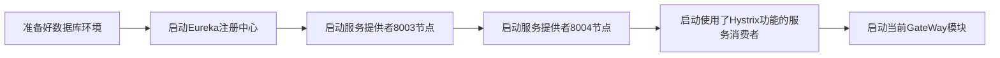

# 9.使用GateWay实现网关功能
@include(@src/public/enhance/guidance/backend/springcloud/springcloud-eureka/chapter/springcloud-eureka-guidance-chapter9.md)
## 9.3.GateWay简介
    Gateway全称SpringCloud Gateway,它旨在为微服务架构提供一种简单有效的统一的API路由管理方式。作为Spring Cloud生态系统中的网关,目标是替代Zuul,为了提升网关的性能,SpringCloud Gateway是基于WebFlux框架实现的,而WebFlux框架底层则使用了高性能的Reactor模式通信框架Netty。主要功能包含认证、鉴权、路由转发、安全策略、防刷、流量控制、监控日志等。
    为什么要使用SpringCloud Gateway?
    以鉴权为例,一个大的应用由很多服务组成,不可能为每一个服务都加上鉴权的代码,这样仅是鉴权部分的代码维护工作就是非常庞大的工作量,同时如果为所有的微服务都加上鉴权代码,这样会破坏REST服务的无状态特征,有一个思路是把鉴权的代码写在一个公共的模块,所有的模块都引入这个模块,但是这样仅仅是实现了鉴权操作,所以最好的处理方案是把认证、鉴权、路由转发、安全策略、防刷、流量控制、监控日志等功能都放在网关中实现,网关在进行请求转发的同时还实现一个负载均衡的效果,服务消费端在调用服务提供端的时候可以调用同一个服务提供端的不同节点,进而实现负载均衡,而网关可以在进行请求转发的时候将请求转发到多个服务消费端,实现服务消费端的负载均衡调用。

<a href="https://github.com/spring-cloud/spring-cloud-gateway" target="_blank">官方网站(SPRING.IO)</a>
```
https://github.com/spring-cloud/spring-cloud-gateway
```

<a href="https://spring.io/projects/spring-cloud-gateway/" target="_blank">官方网站(SPRING.IO)</a>
```
https://spring.io/projects/spring-cloud-gateway/
```

## 9.4.硬编码配置方式使用GateWay(非负载均衡模式)
### 9.4.1.模块简介
    使用SpringCloud Gateway实现网关功能,配置方式为硬编码配置,实现了简单的请求转发功能,即请求经过网关之后会转发到单个服务消费者的单个节点,没有实现在请求转发的同时做负载均衡处理,启动端口: 9527
### 9.4.2.模块目录结构
```md
@include(../projects/springcloud-eureka/springcloud-router-connect-direct-hardcode-gateway9527/tree.md)
```
### 9.4.3.创建模块
	在父工程(springcloud-eureka)中创建一个名为springcloud-router-connect-direct-hardcode-gateway9527的maven模块,注意:当前模块创建成功后,在父工程pom.xml中<modules></modules>中会自动生成有关当前模块的信息
### 9.4.4.编写模块pom.xml
```xml
@include(../projects/springcloud-eureka/springcloud-router-connect-direct-hardcode-gateway9527/pom.xml)
```
### 9.4.5.编写模块application.yml
```yml
@include(../projects/springcloud-eureka/springcloud-router-connect-direct-hardcode-gateway9527/src/main/resources/application.yml)
```
### 9.4.6.编写模块config
```java
@include(../projects/springcloud-eureka/springcloud-router-connect-direct-hardcode-gateway9527/src/main/java/org/openatom/springcloud/config/GateWayConfig.java)
```
### 9.4.7.编写鉴权LoginFilter
```java
@include(../projects/springcloud-eureka/springcloud-router-connect-direct-hardcode-gateway9527/src/main/java/org/openatom/springcloud/filter/LoginFilter.java)
```
### 9.4.8.编写模块主启动类
```java
@include(../projects/springcloud-eureka/springcloud-router-connect-direct-hardcode-gateway9527/src/main/java/org/openatom/springcloud/RouterConnectDirectHardcodeGateWay9527.java)
```

### 9.4.7.测试模块
    启动相关服务


    在浏览器中访问
```
http://localhost:9527/consumer/payment/ok/get/1?uname=zhangsan
```
    第一次访问返回结果
```json
{"code":200,"message":"查询成功,serverPort:  8001","data":{"id":1,"serial":"15646546546"}}
```
    第二次访问返回结果
```json
{"code":200,"message":"查询成功,serverPort:  8002","data":{"id":1,"serial":"15646546546"}}
```
    第三次访问返回结果
```json
{"code":200,"message":"查询成功,serverPort:  8001","data":{"id":1,"serial":"15646546546"}}
```
    第四次访问返回结果
```json
{"code":200,"message":"查询成功,serverPort:  8002","data":{"id":1,"serial":"15646546546"}}
```
    可以看到四次访问返回的结果中,第一次和第三次是相同的,第二次和第四次是相同的,之所以会出现这样的结果,是因为上面编写RestTemplate时使用了默认的配置,默认的配置使用负载均衡策略是轮询策略,所以接连访问该服务四次会出现上面的情况。但是要注意,这里并没有直接访问服务消费者,而是访问了网关,这些返回的数据是服务消费端返回给网关,网关返回给浏览器的。

## 9.5.声明式配置方式使用GateWay(非负载均衡模式)
### 9.5.1.模块简介
    使用SpringCloud Gateway实现网关功能,配置方式为声明式配置,实现了简单的请求转发功能,即请求经过网关之后会转发到单个服务消费者的单个节点,没有实现在请求转发的同时做负载均衡处理,启动端口: 9527
### 9.5.2.模块目录结构
```md
@include(../projects/springcloud-eureka/springcloud-router-connect-direct-configuration-gateway9527/tree.md)
```
### 9.5.3.创建模块
	在父工程(springcloud-eureka)中创建一个名为springcloud-router-connect-direct-configuration-gateway9527的maven模块,注意:当前模块创建成功后,在父工程pom.xml中<modules></modules>中会自动生成有关当前模块的信息
### 9.5.4.编写模块pom.xml
```xml
@include(../projects/springcloud-eureka/springcloud-router-connect-direct-configuration-gateway9527/pom.xml)
```
### 9.5.5.编写模块application.yml
```yml
@include(../projects/springcloud-eureka/springcloud-router-connect-direct-configuration-gateway9527/src/main/resources/application.yml)
```
### 9.5.6.编写鉴权LoginFilter
```java
@include(../projects/springcloud-eureka/springcloud-router-connect-direct-configuration-gateway9527/src/main/java/org/openatom/springcloud/filter/LoginFilter.java)
```
### 9.5.7.编写模块主启动类
```java
@include(../projects/springcloud-eureka/springcloud-router-connect-direct-configuration-gateway9527/src/main/java/org/openatom/springcloud/RouterConnectDirectConfigurationGateWay9527.java)
```
### 9.5.8.测试模块
    启动相关服务


    在浏览器中访问
```
http://localhost:9527/consumer/payment/ok/get/1?uname=zhangsan
```
    第一次访问返回结果
```json
{"code":200,"message":"查询成功,serverPort:  8001","data":{"id":1,"serial":"15646546546"}}
```
    第二次访问返回结果
```json
{"code":200,"message":"查询成功,serverPort:  8002","data":{"id":1,"serial":"15646546546"}}
```
    第三次访问返回结果
```json
{"code":200,"message":"查询成功,serverPort:  8001","data":{"id":1,"serial":"15646546546"}}
```
    第四次访问返回结果
```json
{"code":200,"message":"查询成功,serverPort:  8002","data":{"id":1,"serial":"15646546546"}}
```
    可以看到四次访问返回的结果中,第一次和第三次是相同的,第二次和第四次是相同的,之所以会出现这样的结果,是因为上面编写RestTemplate时使用了默认的配置,默认的配置使用负载均衡策略是轮询策略,所以接连访问该服务四次会出现上面的情况。但是要注意,这里并没有直接访问服务消费者,而是访问了网关,这些返回的数据是服务消费端返回给网关网关返回给浏览器的。
    
## 9.6.硬编码配置方式使用GateWay(负载均衡模式)
### 9.6.1.模块简介
    使用SpringCloud Gateway实现网关功能,配置方式为硬编码配置,实现了简单的请求转发功能,即请求经过网关之后会转发到单个服务消费者的单个节点,实现了在请求转发的同时做负载均衡处理,启动端口: 9527
### 9.6.2.模块目录结构
```md
@include(../projects/springcloud-eureka/springcloud-router-connect-loadbalance-hardcode-gateway9527/tree.md)
```
### 9.6.3.创建模块
	在父工程(springcloud-eureka)中创建一个名为springcloud-router-connect-loadbalance-hardcode-gateway9527的maven模块,注意:当前模块创建成功后,在父工程pom.xml中<modules></modules>中会自动生成有关当前模块的信息
### 9.6.4.编写模块pom.xml
```xml
@include(../projects/springcloud-eureka/springcloud-router-connect-loadbalance-hardcode-gateway9527/pom.xml)
```
### 9.6.5.编写模块application.yml
```yml
@include(../projects/springcloud-eureka/springcloud-router-connect-loadbalance-hardcode-gateway9527/src/main/resources/application.yml)
```
### 9.6.6.编写config
```java
@include(../projects/springcloud-eureka/springcloud-router-connect-loadbalance-hardcode-gateway9527/src/main/java/org/openatom/springcloud/config/GateWayConfig.java)
```
### 9.6.7.编写鉴权LoginFilter
```java
@include(../projects/springcloud-eureka/springcloud-router-connect-loadbalance-hardcode-gateway9527/src/main/java/org/openatom/springcloud/filter/LoginFilter.java)
```
### 9.6.8.编写模块主启动类
```java
@include(../projects/springcloud-eureka/springcloud-router-connect-loadbalance-hardcode-gateway9527/src/main/java/org/openatom/springcloud/RouterConnectLoadbalanceHardcodeGateWay9527.java)
```
### 9.6.9.测试模块
    启动相关服务


    在浏览器中访问
```
http://localhost:9527/consumer/payment/ok/get/1?uname=zhangsan
```
    第一次访问返回结果
```json
{"code":200,"message":"查询成功,serverPort:  8001","data":{"id":1,"serial":"15646546546"}}
```
    第二次访问返回结果
```json
{"code":200,"message":"查询成功,serverPort:  8002","data":{"id":1,"serial":"15646546546"}}
```
    第三次访问返回结果
```json
{"code":200,"message":"查询成功,serverPort:  8001","data":{"id":1,"serial":"15646546546"}}
```
    第四次访问返回结果
```json
{"code":200,"message":"查询成功,serverPort:  8002","data":{"id":1,"serial":"15646546546"}}
```
    可以看到四次访问返回的结果中,第一次和第三次是相同的,第二次和第四次是相同的,之所以会出现这样的结果,是因为上面编写RestTemplate时使用了默认的配置,默认的配置使用负载均衡策略是轮询策略,所以接连访问该服务四次会出现上面的情况。但是要注意,这里并没有直接访问服务消费者,而是访问了网关,这些返回的数据是服务消费端返回给网关网关返回给浏览器的。

## 9.7.声明式配置方式使用GateWay(负载均衡模式)
### 9.7.1.模块简介
    使用SpringCloud Gateway实现网关功能,配置方式为声明式配置,实现了简单的请求转发功能,即请求经过网关之后会转发到单个服务消费者的单个节点,实现了在请求转发的同时做负载均衡处理,启动端口: 9527
### 9.7.2.模块目录结构
```md
@include(../projects/springcloud-eureka/springcloud-router-connect-loadbalance-configuration-gateway9527/tree.md)
```
### 9.7.3.创建模块
	在父工程(springcloud-eureka)中创建一个名为springcloud-router-connect-loadbalance-configuration-gateway9527的maven模块,注意:当前模块创建成功后,在父工程pom.xml中<modules></modules>中会自动生成有关当前模块的信息
### 9.7.4.编写模块pom.xml
```xml
@include(../projects/springcloud-eureka/springcloud-router-connect-loadbalance-configuration-gateway9527/pom.xml)
```
### 9.7.5.编写模块application.yml
```yml
@include(../projects/springcloud-eureka/springcloud-router-connect-loadbalance-configuration-gateway9527/src/main/resources/application.yml)
```
### 9.7.6.编写config
```java
@include(../projects/springcloud-eureka/springcloud-router-connect-loadbalance-configuration-gateway9527/src/main/java/org/openatom/springcloud/config/GateWayConfig.java)
```
### 9.7.7.编写鉴权LoginFilter
```java
@include(../projects/springcloud-eureka/springcloud-router-connect-loadbalance-configuration-gateway9527/src/main/java/org/openatom/springcloud/filter/LoginFilter.java)
```
### 9.7.8.编写模块主启动类
```java
@include(../projects/springcloud-eureka/springcloud-router-connect-loadbalance-configuration-gateway9527/src/main/java/org/openatom/springcloud/RouterConnectLoadbalanceConfigurationGateWay9527.java)
```
### 9.7.9.测试模块
    启动相关服务


    在浏览器中访问
```
http://localhost:9527/consumer/payment/ok/get/1?uname=zhangsan
```
    第一次访问返回结果
```json
{"code":200,"message":"查询成功,serverPort:  8001","data":{"id":1,"serial":"15646546546"}}
```
    第二次访问返回结果
```json
{"code":200,"message":"查询成功,serverPort:  8002","data":{"id":1,"serial":"15646546546"}}
```
    第三次访问返回结果
```json
{"code":200,"message":"查询成功,serverPort:  8001","data":{"id":1,"serial":"15646546546"}}
```
    第四次访问返回结果
```json
{"code":200,"message":"查询成功,serverPort:  8002","data":{"id":1,"serial":"15646546546"}}
```
    可以看到四次访问返回的结果中,第一次和第三次是相同的,第二次和第四次是相同的,之所以会出现这样的结果,是因为上面编写RestTemplate时使用了默认的配置,默认的配置使用负载均衡策略是轮询策略,所以接连访问该服务四次会出现上面的情况。但是要注意,这里并没有直接访问服务消费者,而是访问了网关,这些返回的数据是服务消费端返回给网关网关返回给浏览器的。

