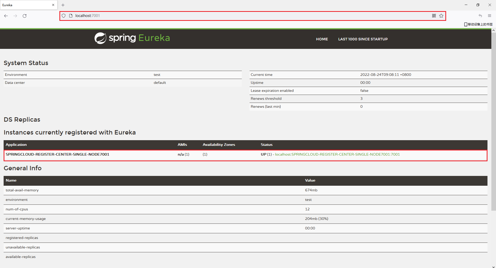

@include(@src/public/enhance/guidance/backend/springcloud/springcloud-eureka/springcloud-eureka-guidance.md)

# 1.微服务简介 {#1.}
@include(@src/public/enhance/guidance/backend/springcloud/springcloud-eureka/chapter/springcloud-eureka-guidance-chapter1.md)
## <a href="https://martinfowler.com/articles/microservices.html" target="_blank">1.1.Martin Fowler微服务论文英文原版</a>
```
https://martinfowler.com/articles/microservices.html
```
## <a href="https://martinfowler.com/articles/microservices.html" target="_blank">1.2.Martin Fowler微服务论文国内译版</a>
	如需国内译版,请使用谷歌翻译插件翻译自行翻译

## 1.5.微服务架构图
::: center
<div class="imgbg-customer">
</div>

:::

## 1.6.CAP中占据情况
	Eureka在CAP中占据AP
::: center
<div class="imgbg-customer">
</div>

:::

## 1.7.微服务架构落地实现方案
	微服务架构落地实现有很多种方案,本次介绍的方案技术栈如下:
	注册中心: EUREKA 
## <a href="https://gitee.com/lingwh1995/springcloud-eureka.git">1.6.项目源代码</a>
```
https://gitee.com/lingwh1995/springcloud-eureka.git
```

# 2.搭建项目基础设施 {#2.}
@include(@src/public/enhance/guidance/backend/springcloud/springcloud-eureka/chapter/springcloud-eureka-guidance-chapter2.md)
## 2.3.创建项目父工程
### 2.3.1.创建父工程
	在idea中创建一个名为springcloud-eureka的maven工程,创建完成后打开该工程,删除src文件夹
### 2.3.2.编写父工程pom.xml
    pom.xml中配置主要包括两部分内容,第一是对子模块依赖的jar包和使用到的插件的版本的统一规定,第二是规定了四种不同的环境,分别是: 1.开发环境(dev) 2.测试环境(test) 3.生产环境(prod) 4.rancher测试专用环境(rancher),关于这四种环境的详细内容会在本博客的最后一部分进行详细解析说明
    
    pom.xml
```xml
<?xml version="1.0" encoding="UTF-8"?>

<project xmlns="http://maven.apache.org/POM/4.0.0" xmlns:xsi="http://www.w3.org/2001/XMLSchema-instance"
         xsi:schemaLocation="http://maven.apache.org/POM/4.0.0 http://maven.apache.org/xsd/maven-4.0.0.xsd">
    <modelVersion>4.0.0</modelVersion>

    <groupId>org.openatom</groupId>
    <artifactId>springcloud-eureka</artifactId>
    <version>1.0-SNAPSHOT</version>
    <packaging>pom</packaging>

    <!--引入所有模块：开始-->
    <modules>
    </modules>
    <!--引入所有模块：结束-->

    <!--统一定义依赖具体版本：开始 -->
    <properties>
        <!--依赖版本-->
        <project.build.sourceEncoding>UTF-8</project.build.sourceEncoding>
        <maven.compiler.source>1.8</maven.compiler.source>
        <maven.compiler.target>1.8</maven.compiler.target>
        <junit.version>4.12</junit.version>
        <log4j.version>1.2.17</log4j.version>
        <lombok.version>1.16.18</lombok.version>
        <mysql.connector.version>8.0.28</mysql.connector.version>
        <spring.boot.version>2.2.2.RELEASE</spring.boot.version>
        <druid.spring.boot.version>1.1.10</druid.spring.boot.version>
        <spring.cloud.version>Hoxton.SR1</spring.cloud.version>
        <mybatis.spring.boot.version>1.3.0</mybatis.spring.boot.version>
        <org.openatom.api.commons.version>1.0-SNAPSHOT</org.openatom.api.commons.version>
        <com.ctrip.framework.apollo.apollo-client.version>2.0.1</com.ctrip.framework.apollo.apollo-client.version>
        <io.seata.version>1.4.2</io.seata.version>
        <spring.cloud.alibaba.version>2.2.0.RELEASE</spring.cloud.alibaba.version>
        <net.logstash.logback.logstash-logback-encoder.version>5.2</net.logstash.logback.logstash-logback-encoder.version>
        <spring.boot.admin.version>2.2.1</spring.boot.admin.version>

        <!--插件版本-->
        <org.springframework.boot.spring-boot-maven-plugin.version>2.2.2.RELEASE</org.springframework.boot.spring-boot-maven-plugin.version>
        <org.apache.maven.plugins.maven-resources-plugin.version>3.2.0</org.apache.maven.plugins.maven-resources-plugin.version>
        <io.fabric8.docker-maven-plugin.version>0.39.1</io.fabric8.docker-maven-plugin.version>
        <org.apache.maven.plugins.maven-antrun-plugin.version>1.8</org.apache.maven.plugins.maven-antrun-plugin.version>
    </properties>
    <!--统一定义依赖具体版本：结束 -->

    <!--统一定义依赖版本：开始-->
    <dependencyManagement>
        <dependencies>
            <!--spring boot 2.2.2-->
            <dependency>
                <groupId>org.springframework.boot</groupId>
                <artifactId>spring-boot-dependencies</artifactId>
                <version>${spring.boot.version}</version>
                <type>pom</type>
                <scope>import</scope>
            </dependency>
            <!--spring cloud Hoxton.SR1-->
            <dependency>
                <groupId>org.springframework.cloud</groupId>
                <artifactId>spring-cloud-dependencies</artifactId>
                <version>${spring.cloud.version}</version>
                <type>pom</type>
                <scope>import</scope>
            </dependency>
            <!--spring cloud alibaba 2.1.0.RELEASE-->
            <dependency>
                <groupId>com.alibaba.cloud</groupId>
                <artifactId>spring-cloud-alibaba-dependencies</artifactId>
                <version>${spring.cloud.alibaba.version}</version>
                <type>pom</type>
                <scope>import</scope>
            </dependency>
            <dependency>
                <groupId>mysql</groupId>
                <artifactId>mysql-connector-java</artifactId>
                <version>${mysql.connector.version}</version>
            </dependency>
            <dependency>
                <groupId>org.mybatis.spring.boot</groupId>
                <artifactId>mybatis-spring-boot-starter</artifactId>
                <version>${mybatis.spring.boot.version}</version>
            </dependency>
            <dependency>
                <groupId>com.alibaba</groupId>
                <artifactId>druid-spring-boot-starter</artifactId>
                <version>${druid.spring.boot.version}</version>
            </dependency>
            <dependency>
                <groupId>junit</groupId>
                <artifactId>junit</artifactId>
                <version>${junit.version}</version>
            </dependency>
            <dependency>
                <groupId>log4j</groupId>
                <artifactId>log4j</artifactId>
                <version>${log4j.version}</version>
            </dependency>
            <dependency>
                <groupId>org.projectlombok</groupId>
                <artifactId>lombok</artifactId>
                <version>${lombok.version}</version>
            </dependency>
            <!--定义公共的工程版本-->
            <dependency>
                <groupId>org.openatom</groupId>
                <artifactId>springcloud-api-commons</artifactId>
                <version>${org.openatom.api.commons.version}</version>
            </dependency>
            <!--Apollo客户端-->
            <dependency>
                <groupId>com.ctrip.framework.apollo</groupId>
                <artifactId>apollo-client</artifactId>
                <version>${com.ctrip.framework.apollo.apollo-client.version}</version>
            </dependency>
            <!--Seata客户端-->
            <dependency>
                <groupId>io.seata</groupId>
                <artifactId>seata-spring-boot-starter</artifactId>
                <version>${io.seata.version}</version>
            </dependency>
            <!--springboot admin server端-->
            <dependency>
                <groupId>de.codecentric</groupId>
                <artifactId>spring-boot-admin-starter-server</artifactId>
                <version>${spring.boot.admin.version}</version>
            </dependency>
            <!--springboot admin client端-->
            <dependency>
                <groupId>de.codecentric</groupId>
                <artifactId>spring-boot-admin-starter-client</artifactId>
                <version>${spring.boot.admin.version}</version>
            </dependency>
            <!--logstah-->
            <dependency>
                <groupId>net.logstash.logback</groupId>
                <artifactId>logstash-logback-encoder</artifactId>
                <version>${net.logstash.logback.logstash-logback-encoder.version}</version>
            </dependency>
        </dependencies>
    </dependencyManagement>
    <!--统一定义依赖版本：结束-->

    <!--定义多种开发环境:开始-->
    <profiles>
		<!--开发环境-->
        <profile>
            <!--不同环境的唯一id-->
            <id>dev</id>
            <properties>
                <!--profile.active对应application.yml中的@profile.active@-->
                <profile.active>dev</profile.active>
                <!--dev环境docker私服连接信息(使用docker官方提供的私服):开始-->
                <docker.registry.uri>192.168.0.4:5000</docker.registry.uri>
                <docker.registry.username>docker</docker.registry.username>
                <docker.registry.password>123456</docker.registry.password>
                <!--dev环境docker私服连接信息(使用docker官方提供的私服):结束-->
                <!--dev环境docker部署地址:端口-->
                <docker.host>tcp://192.168.0.4:2375</docker.host>
            </properties>
        </profile>

        <!--测试环境-->
        <profile>
            <id>test</id>
            <properties>
                <profile.active>test</profile.active>
                <!--test环境docker私服连接信息(vmware提供的私服的harbor私服):开始-->
                <docker.registry.uri>192.168.0.4:5001</docker.registry.uri>
                <docker.registry.username>admin</docker.registry.username>
                <docker.registry.password>123456</docker.registry.password>
                <!--dev环境docker私服连接信息(vmware提供的私服的harbor私服):结束-->
                <!--dev环境docker部署地址:端口-->
                <docker.host>tcp://192.168.0.4:2375</docker.host>
            </properties>
        </profile>

        <!--生产环境-->
        <profile>
            <id>prod</id>
            <properties>
                <profile.active>prod</profile.active>
                <!--prod环境docker私服连接信息(使用docker官方提供的私服):开始-->
                <docker.registry.uri>192.168.0.4:5000</docker.registry.uri>
                <docker.registry.username>docker</docker.registry.username>
                <docker.registry.password>123456</docker.registry.password>
                <!--prod环境docker私服连接信息(使用docker官方提供的私服):结束-->
                <!--prod环境docker部署地址:端口-->
                <docker.host>tcp://192.168.0.4:2375</docker.host>
            </properties>
            <activation>
                <!--默认激活环境-->
                <activeByDefault>true</activeByDefault>
            </activation>
        </profile>

        <!--rancher测试专用环境-->
        <profile>
            <id>rancher</id>
            <properties>
                <profile.active>rancher</profile.active>
                <!--rancher环境docker私服连接信息(vmware提供的私服的harbor私服):开始-->
                <docker.registry.uri>192.168.0.4:5001</docker.registry.uri>
                <docker.registry.username>admin</docker.registry.username>
                <docker.registry.password>123456</docker.registry.password>
                <!--rancher环境docker私服连接信息(vmware提供的私服的harbor私服):结束-->
                <!--rancher环境docker部署地址:端口-->
                <docker.host>tcp://192.168.0.4:2375</docker.host>
            </properties>
        </profile>
    </profiles>
    <!--定义多种开发环境:结束-->

    <!--统一定义插件版本：开始-->
    <build>
        <!--spring-boot-maven-plugin插件-->
        <plugins>
            <plugin>
                <groupId>org.springframework.boot</groupId>
                <artifactId>spring-boot-maven-plugin</artifactId>
                <version>${org.springframework.boot.spring-boot-maven-plugin.version}</version>
            </plugin>
            <!--支持yaml读取pom的参数-->
            <plugin>
                <groupId>org.apache.maven.plugins</groupId>
                <artifactId>maven-resources-plugin</artifactId>
                <version>${org.apache.maven.plugins.maven-resources-plugin.version}</version>
            </plugin>
            <!--执行maven命令时执行删除jar包和复制jar包操作-->
            <plugin>
                <groupId>org.apache.maven.plugins</groupId>
                <artifactId>maven-antrun-plugin</artifactId>
                <version>${org.apache.maven.plugins.maven-antrun-plugin.version}</version>
            </plugin>
            <!--docker maven插件-->
            <plugin>
                <groupId>io.fabric8</groupId>
                <artifactId>docker-maven-plugin</artifactId>
                <version>${io.fabric8.docker-maven-plugin.version}</version>
            </plugin>
        </plugins>
    </build>
    <!--统一定义插件版本：结束-->
</project>
```

## 2.4.创建项目依赖的公共模块
### 2.4.1.模块目录结构
```
@include(./project_springcloud-eureka/springcloud-api-commons/tree.md)
```
### 2.4.2.创建模块
	在父工程(springcloud-eureka)中创建一个名为springcloud-api-commons的maven模块,这个模块中包含了一些公共的Java实体和一些公共的插件,后面的每个模块都要引入这个公共模块,注意:当前模块创建成功后,在父工程pom.xml中<modules></modules>中会自动生成有关当前模块的信息
### 2.4.3.编写模块pom.xml
```xml
@include(./project_springcloud-eureka/springcloud-api-commons/pom.xml)
```
### 2.4.4.编写模块中实体类
    Payment.java
```java
@include(./project_springcloud-eureka/springcloud-api-commons//src/main/java/org/openatom/springcloud/entities/Payment.java)
```

## 2.5.准备项目需要的数据库
### 2.5.1.安装mysql数据库
    详细参考
<a href="/blogs/environment/centos/centos7/shardings/centos7-chapter-3.%E6%90%AD%E5%BB%BA%E5%9F%BA%E7%A1%80%E5%BC%80%E5%8F%91%E7%8E%AF%E5%A2%83.html#_3-5-%E5%AE%89%E8%A3%85mysql" target="_blank">安装mysql</a>

### 2.5.2.创建项目需要的数据库
    导入数据库脚本(application.yml中数据库配置和mysql部署机器信息保持一致)
```sql
@include(./project_springcloud-eureka/script/payment.sql)
```

## 2.6.配置使用热部署
    在公共模块的pom.xml中添加热部署依赖和相关配置(上一步已经添加进去了,这里只是展示热部署部分的代码),将热部署相关插件和配置放在公共模块的好处是,其他的模块引用公共模块的时候就已经引入了热部署相关插件和配置,无需额外引入
```xml
    <dependencies>
        <!--热部署插件-->
        <dependency>
            <groupId>org.springframework.boot</groupId>
            <artifactId>spring-boot-devtools</artifactId>
            <scope>runtime</scope>
            <!--是否依赖传递:true,依赖不传递,false:依赖传递,这是maven的特性-->
            <optional>false</optional>
        </dependency>
    </dependencies>

    <!--热部署需要加这个-->
    <build>
        <plugins>
            <plugin>
                <groupId>org.springframework.boot</groupId>
                <artifactId>spring-boot-maven-plugin</artifactId>
                <configuration>
                    <fork>true</fork>
                    <addResources>true</addResources>
                </configuration>
            </plugin>
        </plugins>
    </build>
```
    更改idea设置
::: center
<div class="imgbg-customer">
</div>

:::
::: center
<div class="imgbg-customer">
</div>

:::

    热部署注意事项
    开发阶段开启热部署,发布阶段一定要关闭热部署
    开启热部署功能:spring.devtools.restart.enabled: true
    关闭热部署功能:spring.devtools.restart.enabled: false

# 3.使用Eureka作为注册中心 {#3.}
@include(@src/public/enhance/guidance/backend/springcloud/springcloud-eureka/chapter/springcloud-eureka-guidance-chapter3.md)
## 3.3.Eureka注册中心简介
	Eureka是Netflix公司开发的服务发现框架,Spring Cloud对它提供了支持,将它集成在了自己spring-cloud-netflix子项目中,用来实现Spring Cloud的服务发现功能,核心功能是为实现服务发现提供了基础支持。本次将搭建一个单节点版的Eureka注册中心和一个集群(高可用)版的Eureka注册中心,用来实现服务发现功能。

<a href="https://github.com/Netflix/eureka" target="_blank">官方网站(GITHUB)</a>
```
https://github.com/Netflix/eureka
```

<a href="https://spring.io/projects/spring-cloud-netflix" target="_blank">官方网站(SPRING.IO)</a>
```
https://spring.io/projects/spring-cloud-netflix
```

	EUREKA架构图
::: center
<div class="imgbg-customer">
</div>

:::

	Eureka的基础组件
	服务提供者(Service Provide): 服务提供方将自身服务注册到Eureka,从而使服务消费方能够找到
	服务消费者(Service Consumer): 服务消费方从Eureka获取注册服务列表,从而能够消费服务
	服务中介(Eureka Server): 是服务提供者和服务消费者之间的桥梁，服务提供者可以把自己注册到服务中介那里，而服务消费者如需要消费一些服务(使用一些功能)就可以在服务中介中寻找注册在服务中介的服务提供者。

	Eureka的提供了哪些功能?
	服务注册(Service Register)
	当Eureka客户端向Eureka Server注册时,它提供自身的元数据,比如IP地址、端口,运行状况指示符URL等
	服务续约(Service Renew)
	Eureka客户会每隔30秒(默认情况下)发送一次心跳来续约。通过续约来告知 Eureka Server该Eureka客户仍然存在,没有出现问题。正常情况下,如果 Eureka Server在90秒没有收到Eureka客户的续约,它会将实例从其注册表中删除
	获取注册列表信息(Service Fetch Registries)
	Eureka 客户端从服务器获取注册表信息,并将其缓存在本地。客户端会使用该信息查找其他服务,从而进行远程调用。该注册列表信息定期(每30 秒钟)更新一次。每次返回注册列表信息可能与Eureka客户端的缓存信息不同,Eureka客户端自动处理。如果由于某种原因导致注册列表信息不能及时匹配,Eureka 客户端则会重新获取整个注册表信息。Eureka 服务器缓存注册列表信息,整个注册表以及每个应用程序的信息进行了压缩,压缩内容和没有压缩的内容完全相同。Eureka客户端和Eureka服务器可以使用JSON/XML格式进行通讯。在默认的情况下 Eureka客户端使用压缩JSON 格式来获取注册列表的信息。
	服务下线(Service Cancel)
	Eureka 客户端在程序关闭时向 Eureka 服务器发送取消请求。发送请求后,该客户端实例信息将从服务器的实例注册表中删除。该下线请求不会自动完成,它需要调用以下内容:DiscoveryManager.getInstance().shutdownComponent();
	服务剔除(Service Eviction)
	在默认的情况下,当Eureka客户端连续90秒(3个续约周期)没有向Eureka服务器发送服务续约,即心跳,Eureka 服务器会将该服务实例从服务注册列表删除,即服务剔除。

## 3.4.单节点版EUREKA注册中心搭建
### 3.4.1.章节内容简介
    本章节会展示如何搭建一个单节点版的Eureka注册中心
### 3.4.2.模块简介
    单节点版Eureka注册中心,启动端口: 7001
### 3.4.3.模块目录结构
```
@include(./project_springcloud-eureka/springcloud-register-center-single-node7001/tree.md)
```
### 3.4.4.创建模块
	在父工程(springcloud-eureka)中创建一个名为springcloud-register-center-single-node7001的maven模块,注意:当前模块创建成功后,在父工程pom.xml中<modules></modules>中会自动生成有关当前模块的信息
### 3.4.5.编写模块pom.xml
```xml
@include(./project_springcloud-eureka/springcloud-register-center-single-node7001/pom.xml)
```
### 3.4.6.编写模块application.yml
```yml
@include(./project_springcloud-eureka/springcloud-register-center-single-node7001/src/main/resources/application.yml)
```
### 3.4.7.编写模块主启动类
```java
@include(./project_springcloud-eureka/springcloud-register-center-single-node7001/src/main/java/org/openatom/springcloud/RegisterCcenterSingleNode7001.java)
```
### 3.4.8.测试模块
    编写完成后,等maven依赖导入成功,运行主启动类,在浏览器中访问
```
http://localhost:7001/
```
    看到如下界面代表搭建成功
::: center
<div class="imgbg-customer">
</div>

:::

## 3.5.集群(高可用)版EUREKA注册中心搭建
### 3.5.1.章节内容简介
    本章节会展示如何搭建一个集群(高可用)版的Eureka注册中心,共有三个节点,Eureka注册中心集群的原理是多个Eureka Server之间相互注册,从而组成一个集群。
### 3.5.2.搭建Eureka集群中第一个节点
    模块简介
    集群(高可用)版Eureka注册中心中第一个节点,启动端口: 7002
    
    模块目录结构
```
@include(./project_springcloud-eureka/springcloud-register-center-cluster-node7002/tree.md)
```
    
    创建模块
	在父工程(springcloud-eureka)中创建一个名为springcloud-register-center-cluster-node7002的maven模块,注意:当前模块创建成功后,在父工程pom.xml中<modules></modules>中会自动生成有关当前模块的信息

    编写模块pom.xml
```xml
@include(./project_springcloud-eureka/springcloud-register-center-cluster-node7002/pom.xml)
```

    编写模块application.yml
```yml
@include(./project_springcloud-eureka/springcloud-register-center-cluster-node7002/src/main/resources/application.yml)
```

    编写模块主启动类
```java
@include(./project_springcloud-eureka/springcloud-register-center-cluster-node7002/src/main/java/org/openatom/springcloud/RegisterCcenterClusterNode7002.java)
```

### 3.5.3.搭建Eureka集群中第二个节点
    模块简介
    集群(高可用)版Eureka注册中心中第二个节点,启动端口: 7003

    模块目录结构
```
@include(./project_springcloud-eureka/springcloud-register-center-cluster-node7003/tree.md)
```

    创建模块
	在父工程(springcloud-eureka)中创建一个名为springcloud-register-center-cluster-node7003的maven模块,注意:当前模块创建成功后,在父工程pom.xml中<modules></modules>中会自动生成有关当前模块的信息

    编写模块pom.xml
```xml
@include(./project_springcloud-eureka/springcloud-register-center-cluster-node7003/pom.xml)
```
    
    编写模块application.yml
```yml
@include(./project_springcloud-eureka/springcloud-register-center-cluster-node7003/src/main/resources/application.yml)
```

    编写模块主启动类
```java
@include(./project_springcloud-eureka/springcloud-register-center-cluster-node7003/src/main/java/org/openatom/springcloud/RegisterCcenterClusterNode7003.java)
```

### 3.5.4.搭建Eureka集群中第三个节点
    模块简介
    集群(高可用)版Eureka注册中心中第三个节点,启动端口: 7004

    模块目录结构
```
@include(./project_springcloud-eureka/springcloud-register-center-cluster-node7004/tree.md)
```

    创建模块
	在父工程(springcloud-eureka)中创建一个名为springcloud-register-center-cluster-node7004的maven模块,注意:当前模块创建成功后,在父工程pom.xml中<modules></modules>中会自动生成有关当前模块的信息

    编写模块pom.xml
```xml
@include(./project_springcloud-eureka/springcloud-register-center-cluster-node7004/pom.xml)
```

    编写模块application.yml
```yml
@include(./project_springcloud-eureka/springcloud-register-center-cluster-node7004/src/main/resources/application.yml)
```

    编写模块主启动类
```java
@include(./project_springcloud-eureka/springcloud-register-center-cluster-node7004/src/main/java/org/openatom/springcloud/RegisterCcenterClusterNode7004.java)
```

### 3.5.5.配置host
    修改host文件,C:\Windows\System32\drivers\etc\host
    添加如下内容:
    127.0.0.1		eureka7002
    127.0.0.1		eureka7003
    127.0.0.1		eureka7004
    
### 3.5.6.测试集群模块
    测试集群中的第一个节点(7002),浏览器访问
```
http://eureka7002:7002/
```

::: center
<div class="imgbg-customer">
</div>

:::

    测试集群中的第二个节点(7003),浏览器访问
```
http://eureka7003:7003/
```
::: center
<div class="imgbg-customer">
</div>

:::

    测试集群中的第三个节点(7004),浏览器访问
```
http://eureka7004:7004/
```
::: center
<div class="imgbg-customer">
</div>

:::

    可以看到,在每个节点和都和其他两个节点相互注册,这代表集群搭建成功

# 4.搭建第一个微服务应用 {#4.}
@include(@src/public/enhance/guidance/backend/springcloud/springcloud-eureka/chapter/springcloud-eureka-guidance-chapter4.md)
## 4.3.第一个微服务应用简介
    第一个微服务应用由四部分组成,分别是注册中心(单节点)、服务消费者(单节点)、服务提供者(两个节点)、运行所需要的数据库环境,这里的注册中心使用单节点版注册中心,如果需要使用集群版注册中心,只需要在application.yml将defaultZone的配置切换为集群版配置即可,服务提供者第一个节点和第二个节点是除了端口和模块名称之外其他所有代码均是相同的,之所以要创建两个相同的模块是为了模拟生产环境中一个服务部署在多个节点的情况,这里为了查看日志方便,直接创建了两个相同的服务提供者模块。
## 4.4.搭建服务提供者第一个节点
### 4.4.1.模块简介
    服务提供者第一个节点,启动端口: 8001
### 4.4.2.模块目录结构
```
@include(./project_springcloud-eureka/springcloud-provider-cluster-node-payment8001/tree.md)
```
### 4.4.3.创建模块
	在父工程(springcloud-eureka)中创建一个名为springcloud-provider-cluster-node-payment8001的maven模块,注意:当前模块创建成功后,在父工程pom.xml中<modules></modules>中会自动生成有关当前模块的信息
### 4.4.4.编写模块pom.xml
```xml
@include(./project_springcloud-eureka/springcloud-provider-cluster-node-payment8001/pom.xml)
```
### 4.4.5.编写模块application.yml
```yml
@include(./project_springcloud-eureka/springcloud-provider-cluster-node-payment8001/src/main/resources/application.yml)
```
### 4.4.6.编写模块Mybatis配置文件
```xml
@include(./project_springcloud-eureka/springcloud-provider-cluster-node-payment8001/src/main/resources/mapper/PaymentMapper.xml)
```
### 4.4.7.编写模块dao
```java
@include(./project_springcloud-eureka/springcloud-provider-cluster-node-payment8001/src/main/java//org/openatom/springcloud/dao/PaymentDao.java)
```
### 4.4.8.编写模块service
```java
@include(./project_springcloud-eureka/springcloud-provider-cluster-node-payment8001/src/main/java//org/openatom/springcloud/service/PaymentService.java)
```
### 4.4.9.编写模块service实现类
```java
@include(./project_springcloud-eureka/springcloud-provider-cluster-node-payment8001/src/main/java//org/openatom/springcloud/service/impl/PaymentServiceImpl.java)
```
### 4.4.10.编写模块controller
```java
@include(./project_springcloud-eureka/springcloud-provider-cluster-node-payment8001/src/main/java//org/openatom/springcloud/controller/PaymentController.java)
```
### 4.4.11.编写模块主启动类
```java
@include(./project_springcloud-eureka/springcloud-provider-cluster-node-payment8001/src/main/java//org/openatom/springcloud/PaymentServiceProviderClusterNode8001.java)
```

## 4.5.搭建服务提供者第二个节点
### 4.5.1.模块简介
    服务提供者第二个节点,启动端口: 8002
### 4.5.2.模块目录结构
```
@include(./project_springcloud-eureka/springcloud-provider-cluster-node-payment8002/tree.md)
```
### 4.5.3.创建模块
	在父工程(springcloud-eureka)中创建一个名为springcloud-provider-cluster-node-payment8002的maven模块,注意:当前模块创建成功后,在父工程pom.xml中<modules></modules>中会自动生成有关当前模块的信息
### 4.5.4.编写模块pom.xml
```xml
@include(./project_springcloud-eureka/springcloud-provider-cluster-node-payment8002/pom.xml)
```
### 4.5.5.编写模块application.yml
```yml
@include(./project_springcloud-eureka/springcloud-provider-cluster-node-payment8002/src/main/resources/application.yml)
```
### 4.5.6.编写模块Mybatis配置文件
```xml
@include(./project_springcloud-eureka/springcloud-provider-cluster-node-payment8002/src/main/resources/mapper/PaymentMapper.xml)
```
### 4.5.7.编写模块dao
```java
@include(./project_springcloud-eureka/springcloud-provider-cluster-node-payment8002/src/main/java//org/openatom/springcloud/dao/PaymentDao.java)
```
### 4.5.8.编写模块service
```java
@include(./project_springcloud-eureka/springcloud-provider-cluster-node-payment8002/src/main/java//org/openatom/springcloud/service/PaymentService.java)
```
### 4.5.9.编写模块service实现类
```java
@include(./project_springcloud-eureka/springcloud-provider-cluster-node-payment8002/src/main/java//org/openatom/springcloud/service/impl/PaymentServiceImpl.java)
```
### 4.5.10.编写模块controller
```java
@include(./project_springcloud-eureka/springcloud-provider-cluster-node-payment8002/src/main/java//org/openatom/springcloud/controller/PaymentController.java)
```
### 4.5.11.编写模块主启动类
```java
@include(./project_springcloud-eureka/springcloud-provider-cluster-node-payment8002/src/main/java//org/openatom/springcloud/PaymentServiceProviderClusterNode8002.java)
```

## 4.6.搭建服务消费者
### 4.6.1.模块简介
    基于SpringCloud官方默认组件实现的服务消费者,启动端口: 80
### 4.6.2.模块目录结构
    @include(./project_springcloud-eureka/springcloud-consumer-loadbalance-default-order80/tree.md)
### 4.6.3.创建模块
	在父工程(springcloud-eureka)中创建一个名为springcloud-consumer-loadbalance-default-order80的maven模块,注意:当前模块创建成功后,在父工程pom.xml中<modules></modules>中会自动生成有关当前模块的信息
### 4.6.4.编写模块pom.xml
```xml
@include(./project_springcloud-eureka/springcloud-consumer-loadbalance-default-order80/pom.xml)
```
### 4.6.5.编写模块application.yml
```yml
@include(./project_springcloud-eureka/springcloud-consumer-loadbalance-default-order80/src/main/resources/application.yml)
```
### 4.6.6.编写模块config
```java
@include(./project_springcloud-eureka/springcloud-consumer-loadbalance-default-order80/src/main/java/org/openatom/springcloud/config/ApplicationContextConfig.java)
```
### 4.6.7.编写模块controller
```java
@include(./project_springcloud-eureka/springcloud-consumer-loadbalance-default-order80/src/main/java/org/openatom/springcloud/controller/OrderConsumerController.java)
```
### 4.6.8.编写模块主启动类
```java
@include(./project_springcloud-eureka/springcloud-consumer-loadbalance-default-order80/src/main/java/org/openatom/springcloud/OrderServiceConsumerLoadBalanceDefault80.java)
```

## 4.7.启动并测试第一个微服务应用
### 4.7.1.启动第一个微服务应用

### 4.7.2.测试第一个微服务应用
    在浏览器中访问
```
http://localhost/consumer/payment/get/1
```
    第一次访问返回结果
```json
{"code":200,"message":"查询成功,serverPort:  8001","data":{"id":1,"serial":"15646546546"}}
```
    第二次访问返回结果
```json
{"code":200,"message":"查询成功,serverPort:  8002","data":{"id":1,"serial":"15646546546"}}
```
    第三次访问返回结果
```json
{"code":200,"message":"查询成功,serverPort:  8001","data":{"id":1,"serial":"15646546546"}}
```
    第四次访问返回结果
```json
{"code":200,"message":"查询成功,serverPort:  8002","data":{"id":1,"serial":"15646546546"}}
```
    可以看到四次访问返回的结果中,第一次和第三次是相同的,第二次和第四次是相同的,之所以会出现这样的结果,是因为上面编写RestTemplate时使用了默认的配置,默认的配置使用负载均衡策略是轮询策略,所以接连访问该服务四次会出现上面的情况。

# 5.使用Ribbon实现客户端负载均衡 {#5.}
@include(@src/public/enhance/guidance/backend/springcloud/springcloud-eureka/chapter/springcloud-eureka-guidance-chapter5.md)

## 5.3.Ribbon简介
    Ribbon是Netflix发布的开源项目，主要功能是提供客户端的软件负载均衡算法，将Netflix的中间层服务连接在一起。Ribbon客户端组件提供一系列完善的配置项如连接超时，重试等。简单的说，就是在配置文件中列出Load Balancer（简称LB）后面所有的机器，Ribbon会自动的帮助你基于某种规则（如简单轮询，随即连接等）去连接这些机器,也可以使用Ribbon实现自定义的负载均衡算法。

<a href="https://github.com/Netflix/ribbon">官方网址</a>
```
https://github.com/Netflix/ribbon
```

## 5.4.硬编码配置方式使用Ribbon实现负载均衡(使用Ribbon自带的负载均衡策略)
### 5.4.1.模块简介
    基于Ribbon以硬编码配置方式实现的服务消费者,使用Ribbon自带的负载均衡策略,启动端口: 80
### 5.4.2.模块目录结构
```
@include(./project_springcloud-eureka/springcloud-consumer-loadbalance-ribbon-hardcode-order80/tree.md)
```
### 5.4.3.创建模块
	在父工程(springcloud-eureka)中创建一个名为springcloud-consumer-loadbalance-ribbon-hardcode-order80的maven模块,注意:当前模块创建成功后,在父工程pom.xml中<modules></modules>中会自动生成有关当前模块的信息
### 5.4.4.编写模块pom.xml
```xml
@include(./project_springcloud-eureka/springcloud-consumer-loadbalance-ribbon-hardcode-order80/pom.xml)
```
### 5.4.5.编写模块application.yml
```yml
@include(./project_springcloud-eureka/springcloud-consumer-loadbalance-ribbon-hardcode-order80/src/main/resources/application.yml)
```
### 5.4.6.编写模块config
```java
@include(./project_springcloud-eureka/springcloud-consumer-loadbalance-ribbon-hardcode-order80/src/main/java/org/openatom/springcloud/config/ApplicationContextConfig.java)
```
### 5.4.7.编写模块controller
```java
@include(./project_springcloud-eureka/springcloud-consumer-loadbalance-ribbon-hardcode-order80/src/main/java/org/openatom/springcloud/controller/OrderConsumerController.java)
```
### 5.4.8.编写负载均衡规则配置类
```java
@include(./project_springcloud-eureka/springcloud-consumer-loadbalance-ribbon-hardcode-order80/src/main/java/org/openatom/myrule/MySelfRule.java)
```
    这里使用return new RandomRule();,这代表使用的负载均衡算法是RandomRule,Ribbon默认提供了七种负载均衡的算法策略,具体使用哪一种,请根据实际需求灵活选择,这里提供关于七种负载均衡算法的介绍

    RoundRobinRule(轮询策略,轮询是Ribbon默认使用的负载均衡算法)
    第一次到A,第二次就到B,第三次又到A,第四次又到B......
    具体实现是一个负载均衡算法: 第N次请求 % 服务器集群的总数 = 实际调用服务器位置的下标

    RandomRule(随机策略)
    从服务提供者的列表中随机选择一个服务实例进行调用

    RetryRule(轮询重试策略)
    按照轮询策略来获取服务,如果获取的服务实例为null或已经失效,则在指定的时间之内不断地进行重试来获取服务,如果超过指定时间依然没获取到服务实例则返回null。

    WeightedResponseTimeRule(响应速度决定权重策略)
    根据每个服务提供者的响应时间分配一个权重,响应时间越长,权重越小,被选中的可能性也就越低。它的实现原理是,刚开始使用轮询策略并开启一个计时器,每一段时间收集一次所有服务提供者的平均响应时间,然后再给每个服务提供者附上一个权重,权重越高被选中的概率也越大。

    BestAvailableRule(最优可用策略)
    判断最优其实用的是并发连接数。选择并发连接数较小的server发送请求。

    AvailabilityFilteringRule(可用性敏感策略)
    先过滤掉非健康的服务实例，然后再选择连接数较小的服务实例。

    ZoneAvoidanceRule(区域内可用性能最优策略)
    基于AvailabilityFilteringRule基础上做的,首先判断一个zone的运行性能是否可用.剔除不可用的区域zone的所有server,然后再利用AvailabilityPredicate过滤并发连接过多的server。

### 5.4.9.编写模块主启动类
```java
@include(./project_springcloud-eureka/springcloud-consumer-loadbalance-ribbon-hardcode-order80/src/main/java/org/openatom/springcloud/OrderServiceConsumerLoadBalanceRibbonHardcode80.java)
```
### 5.4.10.测试模块
    启动相关服务

    测试硬编码配置方式使用Ribbon实现负载均衡(使用Ribbon自带的负载均衡策略)
    在浏览器中访问
```
http://localhost/consumer/payment/get/1
```
    第一次访问返回结果
```json
{"code":200,"message":"查询成功,serverPort:  8001","data":{"id":1,"serial":"15646546546"}}
```
    第二次访问返回结果
```json
{"code":200,"message":"查询成功,serverPort:  8002","data":{"id":1,"serial":"15646546546"}}
```
    第二次访问返回结果
```json
{"code":200,"message":"查询成功,serverPort:  8002","data":{"id":1,"serial":"15646546546"}}
```
    第四次访问返回结果
```json
{"code":200,"message":"查询成功,serverPort:  8001","data":{"id":1,"serial":"15646546546"}}
```
    可以看到四次访问返回的结果中,四次返回结果是没有规律的,因为采用的RandomRule(随机策略),实际返回结果可能不是上面的情况,但是一定是随机进行服务调用的

## 5.5.声明式配置方式使用Ribbon实现负载均衡(使用Ribbon自带的负载均衡策略)
### 5.5.1.模块简介
    基于Ribbon以声明式配置方式实现的服务消费者,使用Ribbon自带的负载均衡策略,启动端口: 80
### 5.5.2.模块目录结构
```
@include(./project_springcloud-eureka/springcloud-consumer-loadbalance-ribbon-configuration-order80/tree.md)
```
### 5.5.3.创建模块
	在父工程(springcloud-eureka)中创建一个名为springcloud-consumer-loadbalance-ribbon-configuration-order80的maven模块,注意:当前模块创建成功后,在父工程pom.xml中<modules></modules>中会自动生成有关当前模块的信息
### 5.5.4.编写模块pom.xml
```xml
@include(./project_springcloud-eureka/springcloud-consumer-loadbalance-ribbon-configuration-order80/pom.xml)
```
### 5.5.5.编写模块application.yml
```yml
@include(./project_springcloud-eureka/springcloud-consumer-loadbalance-ribbon-configuration-order80/src/main/resources/application.yml)
```

    yml中关于Ribbon负载均衡策略的配置
    SPRINGCLOUD-PROVIDER-PAYMENT-SERVICE-CLUSTER:
    ribbon:
        NFLoadBalancerRuleClassName: com.netflix.loadbalancer.RandomRule 
    这里使用com.netflix.loadbalancer.RandomRule ,这代表使用的负载均衡算法是RandomRule,Ribbon默认提供了七种负载均衡的算法策略,具体使用哪一种,请根据实际需求灵活选择,这里提供关于七种负载均衡算法的介绍

    RoundRobinRule(轮询策略,轮询是Ribbon默认使用的负载均衡算法)
    第一次到A,第二次就到B,第三次又到A,第四次又到B......
    具体实现是一个负载均衡算法: 第N次请求 % 服务器集群的总数 = 实际调用服务器位置的下标

    RandomRule(随机策略)
    从服务提供者的列表中随机选择一个服务实例进行调用

    RetryRule(轮询重试策略)
    按照轮询策略来获取服务,如果获取的服务实例为null或已经失效,则在指定的时间之内不断地进行重试来获取服务,如果超过指定时间依然没获取到服务实例则返回null。

    WeightedResponseTimeRule(响应速度决定权重策略)
    根据每个服务提供者的响应时间分配一个权重,响应时间越长,权重越小,被选中的可能性也就越低。它的实现原理是,刚开始使用轮询策略并开启一个计时器,每一段时间收集一次所有服务提供者的平均响应时间,然后再给每个服务提供者附上一个权重,权重越高被选中的概率也越大。

    BestAvailableRule(最优可用策略)
    判断最优其实用的是并发连接数。选择并发连接数较小的server发送请求。

    AvailabilityFilteringRule(可用性敏感策略)
    先过滤掉非健康的服务实例，然后再选择连接数较小的服务实例。
    
    ZoneAvoidanceRule(区域内可用性能最优策略)
    基于AvailabilityFilteringRule基础上做的,首先判断一个zone的运行性能是否可用.剔除不可用的区域zone的所有server,然后再利用AvailabilityPredicate过滤并发连接过多的server。

### 5.5.6.编写模块config
```java
@include(./project_springcloud-eureka/springcloud-consumer-loadbalance-ribbon-configuration-order80/src/main/java/org/openatom/springcloud/config/ApplicationContextConfig.java)
```
### 5.5.7.编写模块controller
```java
@include(./project_springcloud-eureka/springcloud-consumer-loadbalance-ribbon-configuration-order80/src/main/java/org/openatom/springcloud/controller/OrderConsumerController.java)
```
### 5.5.8.编写模块主启动类
```java
@include(./project_springcloud-eureka/springcloud-consumer-loadbalance-ribbon-configuration-order80/src/main/java/org/openatom/springcloud/OrderServiceConsumerLoadBalanceRibbonConfiguration80.java)
```
### 5.5.9.测试模块
    启动相关服务

    测试硬编码配置方式使用Ribbon实现负载均衡(使用Ribbon自带的负载均衡策略)
    在浏览器中访问
```
http://localhost/consumer/payment/get/1
```
    第一次访问返回结果
```json
{"code":200,"message":"查询成功,serverPort:  8001","data":{"id":1,"serial":"15646546546"}}
```
    第二次访问返回结果
```json
{"code":200,"message":"查询成功,serverPort:  8002","data":{"id":1,"serial":"15646546546"}}
```
    第三次访问返回结果
```json
{"code":200,"message":"查询成功,serverPort:  8002","data":{"id":1,"serial":"15646546546"}}
```
    第四次访问返回结果
```json
{"code":200,"message":"查询成功,serverPort:  8001","data":{"id":1,"serial":"15646546546"}}
```
    可以看到四次访问返回的结果中,四次返回结果是没有规律的,因为采用的RandomRule(随机策略),实际返回结果可能不是上面的情况,但是一定是随机进行服务调用的

## 5.6.硬编码配置方式使用Ribbon实现负载均衡(使用自定义的Ribbon负载均衡策略)
### 5.6.1.模块简介
    基于Ribbon以硬编码式配置方式实现的服务消费者,使用自定义的Ribbon负载均衡策略,启动端口: 80
### 5.6.2.模块目录结构
```
@include(./project_springcloud-eureka/springcloud-consumer-loadbalance-ribbon-custom-strategy-hardcode-order80/tree.md)
```
### 5.6.3.创建模块
	在父工程(springcloud-eureka)中创建一个名为springcloud-consumer-loadbalance-ribbon-custom-strategy-hardcode-order80的maven模块,注意:当前模块创建成功后,在父工程pom.xml中<modules></modules>中会自动生成有关当前模块的信息
### 5.6.4.编写模块pom.xml
```xml
@include(./project_springcloud-eureka/springcloud-consumer-loadbalance-ribbon-custom-strategy-hardcode-order80/pom.xml)
```
### 5.6.5.编写模块application.yml
```yml
@include(./project_springcloud-eureka/springcloud-consumer-loadbalance-ribbon-custom-strategy-hardcode-order80/src/main/resources/application.yml)
```
### 5.6.6.编写模块config
```java
@include(./project_springcloud-eureka/springcloud-consumer-loadbalance-ribbon-custom-strategy-hardcode-order80/src/main/java/org/openatom/springcloud/config/ApplicationContextConfig.java)
```
### 5.6.7.编写模块controller
```java
@include(./project_springcloud-eureka/springcloud-consumer-loadbalance-ribbon-custom-strategy-hardcode-order80/src/main/java/org/openatom/springcloud/controller/OrderConsumerController.java)
```
### 5.6.8.编写自定义的负载均衡算法策略
```java
@include(./project_springcloud-eureka/springcloud-consumer-loadbalance-ribbon-custom-strategy-hardcode-order80/src/main/java/org/openatom/springcloud/loadbalance/MyRoundRobinRule.java)
```
### 5.6.9.编写模块主启动类
```java
@include(./project_springcloud-eureka/springcloud-consumer-loadbalance-ribbon-custom-strategy-hardcode-order80/src/main/java/org/openatom/springcloud/OrderServiceConsumerLoadBalanceRibbonCustomerStrategyHardcode80.java)
```
### 5.6.10.测试模块
    启动相关服务

    测试硬编码配置方式使用Ribbon实现负载均衡(使用Ribbon自带的负载均衡策略)
    在浏览器中访问
```
http://localhost/consumer/payment/get/1
```
    第一次访问返回结果
```json
{"code":200,"message":"查询成功,serverPort:  8001","data":{"id":1,"serial":"15646546546"}}
```
    第二次访问返回结果
```json
{"code":200,"message":"查询成功,serverPort:  8002","data":{"id":1,"serial":"15646546546"}}
```
    第三次访问返回结果
```json
{"code":200,"message":"查询成功,serverPort:  8002","data":{"id":1,"serial":"15646546546"}}
```
    第四次访问返回结果
```json
{"code":200,"message":"查询成功,serverPort:  8001","data":{"id":1,"serial":"15646546546"}}
```
    可以看到四次访问返回的结果中,四次返回结果是没有规律的,因为采用的MyRoundRobinRule(自定义策略,这个策略的效果也是随机调用),实际返回结果可能不是上面的情况,但是一定是随机进行服务调用的

## 5.7.声明式配置方式使用Ribbon实现负载均衡(使用自定义的Ribbon负载均衡策略)
### 5.7.1.模块简介
    基于Ribbon以声明式配置方式实现的服务消费者,使用自定义的Ribbon负载均衡策略,启动端口: 80
### 5.7.2.模块目录结构
```
@include(./project_springcloud-eureka/springcloud-consumer-loadbalance-ribbon-custom-strategy-configuration-order80/tree.md)
```
### 5.7.3.创建模块
	在父工程(springcloud-eureka)中创建一个名为springcloud-consumer-loadbalance-ribbon-custom-strategy-configuration-order80的maven模块,注意:当前模块创建成功后,在父工程pom.xml中<modules></modules>中会自动生成有关当前模块的信息
### 5.7.4.编写模块pom.xml
```xml
@include(./project_springcloud-eureka/springcloud-consumer-loadbalance-ribbon-custom-strategy-configuration-order80/pom.xml)
```
### 5.7.5.编写模块application.yml
```yml
@include(./project_springcloud-eureka/springcloud-consumer-loadbalance-ribbon-custom-strategy-configuration-order80/src/main/resources/application.yml)
```
### 5.7.6.编写模块config
```java
@include(./project_springcloud-eureka/springcloud-consumer-loadbalance-ribbon-custom-strategy-configuration-order80/src/main/java/org/openatom/springcloud/config/ApplicationContextConfig.java)
```
### 5.7.7.编写模块controller
```java
@include(./project_springcloud-eureka/springcloud-consumer-loadbalance-ribbon-custom-strategy-configuration-order80/src/main/java/org/openatom/springcloud/controller/OrderConsumerController.java)
```
### 5.7.8.编写自定义的负载均衡算法策略
```java
@include(./project_springcloud-eureka/springcloud-consumer-loadbalance-ribbon-custom-strategy-configuration-order80/src/main/java/org/openatom/springcloud/loadbalance/MyRoundRobinRule.java)
```
### 5.7.9.编写模块主启动类
```java
@include(./project_springcloud-eureka/springcloud-consumer-loadbalance-ribbon-custom-strategy-configuration-order80/src/main/java/org/openatom/springcloud/OrderServiceConsumerLoadBalanceRibbonCustomerStrategyConfiguration80.java)
```
### 5.7.10.测试模块
    启动相关服务

    测试硬编码配置方式使用Ribbon实现负载均衡(使用Ribbon自带的负载均衡策略)
    在浏览器中访问
```
http://localhost/consumer/payment/get/1
```
    第一次访问返回结果
```json
{"code":200,"message":"查询成功,serverPort:  8001","data":{"id":1,"serial":"15646546546"}}
```
    第二次访问返回结果
```json
{"code":200,"message":"查询成功,serverPort:  8002","data":{"id":1,"serial":"15646546546"}}
```
    第三次访问返回结果
```json
{"code":200,"message":"查询成功,serverPort:  8002","data":{"id":1,"serial":"15646546546"}}
```
    第四次访问返回结果
```json
{"code":200,"message":"查询成功,serverPort:  8001","data":{"id":1,"serial":"15646546546"}}
```
    可以看到四次访问返回的结果中,四次返回结果是没有规律的,因为采用的MyRoundRobinRule(自定义策略,这个策略的效果也是随机调用),实际返回结果可能不是上面的情况,但是一定是随机进行服务调用的

# 6.使用OpenFeign实现客户端负载均衡 {#6.}
@include(@src/public/enhance/guidance/backend/springcloud/springcloud-eureka/chapter/springcloud-eureka-guidance-chapter6.md)
## 6.3.OpenFeign简介
    Feign是SpringCloud组件中一个轻量级RESTful的HTTP服务客户端,Feign内置了Ribbon,用来做客户端负载均衡,去调用服务注册中心的服务。Feign的使用方式是: 使用Feign的注解定义接口,调用这个接口,就可以调用服务注册中心的服务。OpenFeign是SpringCloud在Feign的基础上支持了SpringMVC的注解,如@RequestMapping等。OpenFeign的@FeignClient可以解析SpringMVC的@RequestMapping注解下的接口,并通过动态代理的方式产生实现类,实现类中做负载均衡并调用其他服务。核心作用是为HTTP形式的Rest API提供了非常简洁高效的RPC调用方式,可以让编写远程调用代码就像编写本地Service一样简单。

<a href="https://docs.spring.io/spring-cloud-openfeign/docs/2.2.10.BUILD-SNAPSHOT/reference/html/">官方网址(Spring.IO)</a>
```
https://docs.spring.io/spring-cloud-openfeign/docs/2.2.10.BUILD-SNAPSHOT/reference/html/
```

## 6.4.通过配置Ribbon实现对OpenFeign的配置来实现负载均衡
### 6.4.1.模块简介
    通过配置Ribbon实现对OpenFeign的配置来实现的服务消费者,在YML中编写相关配置,之所以可以这样,是因为OpenFeign的底层实现就是Ribbon,启动端口: 80
### 6.4.2.模块目录结构
```
@include(./project_springcloud-eureka/springcloud-consumer-loadbalance-openfeign-configuration-ribbon-order80/tree.md)
```
### 6.4.3.创建模块
	在父工程(springcloud-eureka)中创建一个名为springcloud-consumer-loadbalance-openfeign-configuration-ribbon-order80的maven模块,注意:当前模块创建成功后,在父工程pom.xml中<modules></modules>中会自动生成有关当前模块的信息
### 6.4.4.编写模块pom.xml
```xml
@include(./project_springcloud-eureka/springcloud-consumer-loadbalance-openfeign-configuration-ribbon-order80/pom.xml)
```
### 6.4.5.编写模块application.yml
```yml
@include(./project_springcloud-eureka/springcloud-consumer-loadbalance-openfeign-configuration-ribbon-order80/src/main/resources/application.yml)
```
### 6.4.6.编写模块config
```java
@include(./project_springcloud-eureka/springcloud-consumer-loadbalance-openfeign-configuration-ribbon-order80/src/main/java/org/openatom/springcloud/config/OpenFeignConfig.java)
```
### 6.4.7.编写模块service
```java
@include(./project_springcloud-eureka/springcloud-consumer-loadbalance-openfeign-configuration-ribbon-order80/src/main/java/org/openatom/springcloud/service/PaymentServiceOpenFeign.java)
```
### 6.4.8.编写模块controller
```java
@include(./project_springcloud-eureka/springcloud-consumer-loadbalance-openfeign-configuration-ribbon-order80/src/main/java/org/openatom/springcloud/controller/OrderConsumerController.java)
```
### 6.4.9.编写模块主启动类
```java
@include(./project_springcloud-eureka/springcloud-consumer-loadbalance-openfeign-configuration-ribbon-order80/src/main/java/org/openatom/springcloud/OrderServiceConsumerLoadBalanceOpenFeignConfigurationRibbon80.java)
```
### 6.4.10.测试模块
    启动相关服务

    测试通过配置Ribbon实现对OpenFeign的配置来实现负载均衡
    在浏览器中访问
```
http://localhost/consumer/payment/get/1
```
    第一次访问返回结果
```json
{"code":200,"message":"查询成功,serverPort:  8001","data":{"id":1,"serial":"15646546546"}}
```
    第二次访问返回结果
```json
{"code":200,"message":"查询成功,serverPort:  8002","data":{"id":1,"serial":"15646546546"}}
```
    第三次访问返回结果
```json
{"code":200,"message":"查询成功,serverPort:  8002","data":{"id":1,"serial":"15646546546"}}
```
    第四次访问返回结果
```json
{"code":200,"message":"查询成功,serverPort:  8001","data":{"id":1,"serial":"15646546546"}}
```
    可以看到四次访问返回的结果中,四次返回结果是没有规律的,因为采用的MyRoundRobinRule(自定义策略,这个策略的效果也是随机调用),实际返回结果可能不是上面的情况,但是一定是随机进行服务调用的

### 6.4.11.注意事项
    OpenFeign和RestTemplate
    使用OpenFeign实现远程调用时,容器中注入不用注入RestTemplate,OpenFeign已经在底层对RestTemplate做了封装

    在application.yml中配置开启OpenFeign增强日志
```yml
logging: #OpenFeign增强日志配置
    level:
    org.openatom.springcloud.services.PaymentServiceOpenFeign: debug  #OpenFeign日志以什么级别监控哪个接口
```

## 6.5.通过直接配置OpenFeign实现对OpenFeign的配置来实现负载均衡
### 6.5.1.模块简介
    通过直接配置OpenFeign实现对OpenFeign的配置来实现的服务消费者,在YML中编写相关配置,之前在YML配置的Ribbon的相关配置现在直接配置在了YML中OpenFeign部分,启动端口: 80
### 6.5.2.模块目录结构
```
@include(./project_springcloud-eureka/springcloud-consumer-loadbalance-openfeign-configuration-openfeign-order80/tree.md)
```
### 6.5.3.创建模块
	在父工程(springcloud-eureka)中创建一个名为springcloud-consumer-loadbalance-openfeign-configuration-openfeign-order80的maven模块,注意:当前模块创建成功后,在父工程pom.xml中<modules></modules>中会自动生成有关当前模块的信息
### 6.5.4.编写模块pom.xml
```xml
@include(./project_springcloud-eureka/springcloud-consumer-loadbalance-openfeign-configuration-openfeign-order80/pom.xml)
```
### 6.5.5.编写模块application.yml
```yml
@include(./project_springcloud-eureka/springcloud-consumer-loadbalance-openfeign-configuration-openfeign-order80/src/main/resources/application.yml)
```
### 6.5.6.编写模块config
```java
@include(./project_springcloud-eureka/springcloud-consumer-loadbalance-openfeign-configuration-openfeign-order80/src/main/java/org/openatom/springcloud/config/OpenFeignConfig.java)
```
### 6.5.7.编写模块service
```java
@include(./project_springcloud-eureka/springcloud-consumer-loadbalance-openfeign-configuration-openfeign-order80/src/main/java/org/openatom/springcloud/service/PaymentServiceOpenFeign.java)
```
### 6.5.8.编写模块controller
```java
@include(./project_springcloud-eureka/springcloud-consumer-loadbalance-openfeign-configuration-openfeign-order80/src/main/java/org/openatom/springcloud/controller/OrderConsumerController.java)
```
### 6.5.9.编写模块主启动类
```java
@include(./project_springcloud-eureka/springcloud-consumer-loadbalance-openfeign-configuration-openfeign-order80/src/main/java/org/openatom/springcloud/OrderServiceConsumerLoadBalanceOpenFeignConfigurationOpenfeign80.java)
```
### 6.5.10.测试模块
    启动相关服务

    测试通过直接配置OpenFeign实现对OpenFeign的配置来实现负载均衡
    在浏览器中访问
```
http://localhost/consumer/payment/get/1
```
    第一次访问返回结果
```json
{"code":200,"message":"查询成功,serverPort:  8001","data":{"id":1,"serial":"15646546546"}}
```
    第二次访问返回结果
```json
{"code":200,"message":"查询成功,serverPort:  8002","data":{"id":1,"serial":"15646546546"}}
```
    第三次访问返回结果
```json
{"code":200,"message":"查询成功,serverPort:  8002","data":{"id":1,"serial":"15646546546"}}
```
    第四次访问返回结果
```json
{"code":200,"message":"查询成功,serverPort:  8001","data":{"id":1,"serial":"15646546546"}}
```
    可以看到四次访问返回的结果中,四次返回结果是没有规律的,因为采用的MyRoundRobinRule(自定义策略,这个策略的效果也是随机调用),实际返回结果可能不是上面的情况,但是一定是随机进行服务调用的
### 6.5.11.注意事项
    OpenFeign和RestTemplate
    容器中注入不用注入RestTemplate,OpenFeign已经在底层对RestTemplate做了封装

    在application.yml中配置开启OpenFeign增强日志
```yml
logging: #OpenFeign增强日志配置
    level:
    org.openatom.springcloud.services.PaymentServiceOpenFeign: debug  #OpenFeign日志以什么级别监控哪个接口
```

# 7.使用Hystrix实现服务降级和熔断 {#7.}
@include(@src/public/enhance/guidance/backend/springcloud/springcloud-eureka/chapter/springcloud-eureka-guidance-chapter7.md)
## 7.3.Hystrix简介
    Hystrix是由Netflix开源的一个服务隔离组件,通过服务隔离来避免由于依赖延迟、异常,引起资源耗尽导致系统不可用的解决方案。这说的有点儿太官方了,它的功能主要有以下三个:
    服务降级
    当服务调用发生异常时，快速返回一个事先设置好的值,针对系统全局稳定性考虑,消费端和服务端都可以做

    服务熔断
    当调用服务发生多次异常时服务会会熔断,如数据库连接故障,当故障修复时服务又会恢复到正常状态,针对服务提供方稳定性考虑
    
    服务限流
    对访问的流量进行限制
    
<a href="https://github.com/Netflix/Hystrix">官方网站</a>
```
https://github.com/Netflix/Hystrix
```

## 7.4.搭建服务提供者第一个节点
### 7.4.1.模块简介
    具有服务熔断和服务降级功能的服务提供者的第一个节点,启动端口: 8003
### 7.4.2.模块目录结构
```
@include(./project_springcloud-eureka/springcloud-provider-hystrix-cluster-node-payment8003/tree.md)
```
### 7.4.3.创建模块
	在父工程(springcloud-eureka)中创建一个名为springcloud-provider-hystrix-cluster-node-payment8003的maven模块,注意:当前模块创建成功后,在父工程pom.xml中<modules></modules>中会自动生成有关当前模块的信息
### 7.4.4.编写模块pom.xml
```xml
@include(./project_springcloud-eureka/springcloud-provider-hystrix-cluster-node-payment8003/pom.xml)
```
### 7.4.5.编写模块application.yml
```yml
@include(./project_springcloud-eureka/springcloud-provider-hystrix-cluster-node-payment8003/src/main/resources/application.yml)
```
### 7.4.6.编写模块Mybatis配置文件
```xml
@include(./project_springcloud-eureka/springcloud-provider-hystrix-cluster-node-payment8003/src/main/resources/mapper/PaymentMapper.xml)
```
### 7.4.7.编写模块dao
```java
@include(./project_springcloud-eureka/springcloud-provider-hystrix-cluster-node-payment8003/src/main/java/org/openatom/springcloud/dao/PaymentHystrixDao.java)
```
### 7.4.8.编写模块service
```java
@include(./project_springcloud-eureka/springcloud-provider-hystrix-cluster-node-payment8003/src/main/java/org/openatom/springcloud/service/PaymentHystrixService.java)
```
### 7.4.9.编写模块service实现类
```java
@include(./project_springcloud-eureka/springcloud-provider-hystrix-cluster-node-payment8003/src/main/java/org/openatom/springcloud/service/impl/PaymentHystrixServiceImpl.java)
```
### 7.4.10.编写模块controller
```java
@include(./project_springcloud-eureka/springcloud-provider-hystrix-cluster-node-payment8003/src/main/java/org/openatom/springcloud/controller/PaymentHystrixController.java)
```
### 7.4.11.编写模块主启动类
```java
package org.openatom.springcloud;

import org.springframework.boot.SpringApplication;
import org.springframework.boot.autoconfigure.SpringBootApplication;
import org.springframework.cloud.client.circuitbreaker.EnableCircuitBreaker;
import org.springframework.cloud.netflix.eureka.EnableEurekaClient;

/**
 * 支付接口提供者
 *  使用Eureka作为注册中心
 */
@EnableEurekaClient
@SpringBootApplication
@EnableCircuitBreaker//服务提供方端启用Hystrix
public class PaymentServiceProviderHystrixClusterNode8003 {

    public static void main(String[] args) {
        SpringApplication.run(PaymentServiceProviderHystrixClusterNode8003.class, args);
    }

}
```

## 7.5.搭建服务提供者第二个节点
### 7.5.1.模块简介
    具有服务熔断和服务降级功能的服务提供者的第二个节点,启动端口: 8004
### 7.5.2.模块目录结构
```
@include(./project_springcloud-eureka/springcloud-provider-hystrix-cluster-node-payment8004/tree.md)
```
### 7.5.3.创建模块
	在父工程(springcloud-eureka)中创建一个名为springcloud-provider-hystrix-cluster-node-payment8004的maven模块,注意:当前模块创建成功后,在父工程pom.xml中<modules></modules>中会自动生成有关当前模块的信息
### 7.5.4.编写模块pom.xml
```xml
@include(./project_springcloud-eureka/springcloud-provider-hystrix-cluster-node-payment8004/pom.xml)
```
### 7.5.5.编写模块application.yml
```yml
@include(./project_springcloud-eureka/springcloud-provider-hystrix-cluster-node-payment8004/src/main/resources/application.yml)
```
### 7.5.6.编写模块Mybatis配置文件
```xml
@include(./project_springcloud-eureka/springcloud-provider-hystrix-cluster-node-payment8004/src/main/resources/mapper/PaymentMapper.xml)
```
### 7.5.7.编写模块dao
```java
@include(./project_springcloud-eureka/springcloud-provider-hystrix-cluster-node-payment8004/src/main/java/org/openatom/springcloud/dao/PaymentHystrixDao.java)
```
### 7.5.8.编写模块service
```java
@include(./project_springcloud-eureka/springcloud-provider-hystrix-cluster-node-payment8004/src/main/java/org/openatom/springcloud/service/PaymentHystrixService.java)
```
### 7.5.9.编写模块service实现类
```java
@include(./project_springcloud-eureka/springcloud-provider-hystrix-cluster-node-payment8004/src/main/java/org/openatom/springcloud/service/impl/PaymentHystrixServiceImpl.java)
```
### 7.5.10.编写模块controller
```java
@include(./project_springcloud-eureka/springcloud-provider-hystrix-cluster-node-payment8004/src/main/java/org/openatom/springcloud/controller/PaymentHystrixController.java)
```
### 7.5.11.编写模块主启动类
```java
package org.openatom.springcloud;

import org.springframework.boot.SpringApplication;
import org.springframework.boot.autoconfigure.SpringBootApplication;
import org.springframework.cloud.client.circuitbreaker.EnableCircuitBreaker;
import org.springframework.cloud.netflix.eureka.EnableEurekaClient;

/**
 * 支付接口提供者
 *  使用Eureka作为注册中心
 */
@EnableEurekaClient
@SpringBootApplication
@EnableCircuitBreaker//服务提供方端启用Hystrix
public class PaymentServiceProviderHystrixClusterNode8004 {

    public static void main(String[] args) {
        SpringApplication.run(PaymentServiceProviderHystrixClusterNode8004.class, args);
    }

}
```

## 7.6.搭建服务消费者
### 7.6.1.模块简介
    具有服务熔断和服务降级功能的服务消费者,启动端口: 80
### 7.6.2.模块目录结构
```
@include(./project_springcloud-eureka/springcloud-consumer-hystrix-loadbalance-openfeign-configuration-order80/tree.md)
```
### 7.6.3.创建模块
	在父工程(springcloud-eureka)中创建一个名为springcloud-consumer-hystrix-loadbalance-openfeign-configuration-order80的maven模块,注意:当前模块创建成功后,在父工程pom.xml中<modules></modules>中会自动生成有关当前模块的信息
### 7.6.4.编写模块pom.xml
```xml
@include(./project_springcloud-eureka/springcloud-consumer-hystrix-loadbalance-openfeign-configuration-order80/pom.xml)
```
### 7.6.5.编写模块application.yml
```yml
@include(./project_springcloud-eureka/springcloud-consumer-hystrix-loadbalance-openfeign-configuration-order80/src/main/resources/application.yml)
```
### 7.6.6.编写模块config
```java
@include(./project_springcloud-eureka/springcloud-consumer-hystrix-loadbalance-openfeign-configuration-order80/src/main/java/org/openatom/springcloud/config/FeignConfig.java)
```
### 7.6.7.编写模块service
```java
@include(./project_springcloud-eureka/springcloud-consumer-hystrix-loadbalance-openfeign-configuration-order80/src/main/java/org/openatom/springcloud/service/PaymentServiceHystrixOpenFeign.java)
```
### 7.6.8.编写模块service实现类
```java
@include(./project_springcloud-eureka/springcloud-consumer-hystrix-loadbalance-openfeign-configuration-order80/src/main/java/org/openatom/springcloud/service/impl/PaymentServiceHystrixOpenFeignImpl.java)
```
### 7.6.9.编写模块controller
```java
@include(./project_springcloud-eureka/springcloud-consumer-hystrix-loadbalance-openfeign-configuration-order80/src/main/java/org/openatom/springcloud/controller/OrderConsumerHystrixController.java)
```
### 7.6.10.编写模块主启动类
```java
package org.openatom.springcloud;

import org.springframework.boot.SpringApplication;
import org.springframework.boot.autoconfigure.SpringBootApplication;
import org.springframework.cloud.netflix.eureka.EnableEurekaClient;
import org.springframework.cloud.netflix.hystrix.EnableHystrix;
import org.springframework.cloud.openfeign.EnableFeignClients;


@EnableEurekaClient
@SpringBootApplication
@EnableFeignClients
@EnableHystrix //消费者端启用Hystrix
public class OrderServiceConsumerHystrixLoadBalanceOpenFeignConfiguration80 {
    public static void main(String[] args) {
        SpringApplication.run(OrderServiceConsumerHystrixLoadBalanceOpenFeignConfiguration80.class, args);
    }
    
}
```
## 7.7.测试服务降级和服务熔断
    启动相关服务


    测试未做降级和熔断的服务
```
http://localhost/consumer/payment/ok/get/1
```
    第一次访问返回结果
```json
{"code":200,"message":"查询成功,serverPort:  8001","data":{"id":1,"serial":"15646546546"}}
```
    第二次访问返回结果
```json
{"code":200,"message":"查询成功,serverPort:  8002","data":{"id":1,"serial":"15646546546"}}
```
    第三次访问返回结果
```json
{"code":200,"message":"查询成功,serverPort:  8002","data":{"id":1,"serial":"15646546546"}}
```
    第四次访问返回结果
```json
{"code":200,"message":"查询成功,serverPort:  8001","data":{"id":1,"serial":"15646546546"}}
```
    可以看到四次访问返回的结果中,四次返回结果是没有规律的,因为采用的MyRoundRobinRule(自定义策略,这个策略的效果也是随机调用),实际返回结果可能不是上面的情况,但是一定是随机进行服务调用的

    测试在服务提供方对服务进行降级
    在浏览器中访问
```
http://localhost/consumer/payment/degradation_in_provider/get/1
```
    返回结果
```json
{"code":200,"message":"查询成功,serverPort:  8003","data":{"id":1,"serial":"服务提供方:服务降级成功"}}
```
    具体降级过程,请根据访问地址追踪代码,查看具体降级是如何处理的,代码中有详细的注释

    测试在服务消费方对服务进行降级
    在浏览器中访问
```
http://localhost/consumer/payment/degradation_in_consumer/get/1
```
    返回结果
```json
{"code":10000,"message":"我是服务消费方","data":{"id":1,"serial":"服务消费方:降级成功"}}
```
    具体降级过程,请根据访问地址追踪代码,查看具体降级是如何处理的,代码中有详细的注释

    测试全局范围内默认的降级回调方法(这种处理方式可以应用于服务提供方和服务消费方,这里演示的是在服务消费端进行处理)
    在浏览器中访问
```
http://localhost:/consumer/payment/degradation_in_consumer_default/get/1
```
    返回结果
```json
{"code":10000,"message":"我是服务消费方","data":{"id":null,"serial":"服务消费方:全局范围内默认的降级回调方法...."}}
```
    具体降级过程,请根据访问地址追踪代码,查看具体降级是如何处理的,代码中有详细的注释
    
    测试在服务提供方Service层实现服务降级
    本次测试较为特殊,首先关闭服务提供者8003和服务提供者8004,模拟服务提供者8003和服务提供者8004发生了宕机
    在浏览器中访问
```
http://localhost:/consumer/payment/degradation_in_consumer_service/get/1
```
    返回结果
```json
{"code":10000,"message":"发生了错误","data":{"id":null,"serial":"服务消费端:服务提供者宕机了,在服务消费方中Service层对这个服务进行服务降级处理...."}}
```
    具体降级过程,请根据访问地址追踪代码,查看具体降级是如何处理的,代码中有详细的注释

    测试在服务提供方实现服务熔断
    模拟发生异常熔断服务,路径1:
```
http://localhost/consumer/payment/circuitbreaker/get/-1
```
    模拟不发生异常让服务自动恢复,路径2:
```
http://localhost/consumer/payment/circuitbreaker/get/1
```
    测试方式:先多次访问路径1，将服务熔断,再多次访问路径2,刚开始访问依然返回的是异常信息,多次访问后可以看到服务恢复正常

    服务熔断(下游服务发生了异常)->断路器半开(放开一定的访问流量,探测一下服务是否恢复正常)->断路器全开(放开全部访问流量)->服务恢复正常

# 8.使用Hystrix_DashBoard和Turbine对服务进行监控 {#8.}
@include(@src/public/enhance/guidance/backend/springcloud/springcloud-eureka/chapter/springcloud-eureka-guidance-chapter8.md)
## 8.3.使用Hystrix DashBoard对服务单个节点进行监控
### 8.3.1.Hystrix DashBoard简介
    Hystrix Dashboard是Spring Cloud的仪表盘组件,可以查看Hystrix实例的执行情况,支持查看单个实例和查看集群实例,但是需要结合spring-boot-actuator一起使用。Hystrix Dashboard主要用来实时监控Hystrix的各项指标信息。Hystrix Dashboard可以有效地反映出每个Hystrix实例的运行情况，帮助我们快速发现系统中的问题，从而采取对应措施。
### 8.3.2.模块简介
    Hystrix DashBoard,启动端口: 9001
### 8.3.3.模块目录结构
```
@include(./project_springcloud-eureka/springcloud-mointor-hystrix-dashboard9001/tree.md)
```
### 8.3.4.创建模块
	在父工程(springcloud-eureka)中创建一个名为springcloud-mointor-hystrix-dashboard9001的maven模块,注意:当前模块创建成功后,在父工程pom.xml中<modules></modules>中会自动生成有关当前模块的信息
### 8.3.5.编写模块pom.xml
```xml
@include(./project_springcloud-eureka/springcloud-mointor-hystrix-dashboard9001/pom.xml)
```
### 8.3.6.编写模块application.yml
```yml
@include(./project_springcloud-eureka/springcloud-mointor-hystrix-dashboard9001/src/main/resources/application.yml)
```
### 8.3.7.编写模块主启动类
```java
@include(./project_springcloud-eureka/springcloud-mointor-hystrix-dashboard9001/src/main/java/org/openatom/springcloud/MointorHystrixDashboard9001.java)
```
### 8.3.8.修改服务提供者8003主启动类
    使用Hystrix Dashboard监控服务,被监控的服务提供者和服务消费者必须满足以下条件
    pom.xml中引入如下依赖
```
<dependency>
    <groupId>org.springframework.boot</groupId>
    <artifactId>spring-boot-starter-actuator</artifactId>
</dependency>
<dependency>
    <groupId>org.springframework.cloud</groupId>
    <artifactId>spring-cloud-starter-netflix-hystrix</artifactId>
</dependency>
```
    在主启动类中注册ServletRegistrationBean这个Bean
```
@Bean
public ServletRegistrationBean getServlet() {
    HystrixMetricsStreamServlet streamServlet = new HystrixMetricsStreamServlet();
    ServletRegistrationBean registrationBean = new ServletRegistrationBean(streamServlet);
    registrationBean.setLoadOnStartup(1);
    registrationBean.addUrlMappings("/hystrix.stream");
    registrationBean.setName("HystrixMetricsStreamServlet");
    return registrationBean;
}
```

    修改后的主启动类如下
```java
@include(./project_springcloud-eureka/springcloud-provider-hystrix-cluster-node-payment8003/src/main/java/org/openatom/springcloud/PaymentServiceProviderHystrixClusterNode8003.java)
```

### 8.3.9.修改服务提供者8004主启动类
    使用Hystrix Dashboard监控服务,被监控的服务提供者和服务消费者必须满足以下条件
    pom.xml中引入如下依赖
```
<dependency>
    <groupId>org.springframework.boot</groupId>
    <artifactId>spring-boot-starter-actuator</artifactId>
</dependency>
<dependency>
    <groupId>org.springframework.cloud</groupId>
    <artifactId>spring-cloud-starter-netflix-hystrix</artifactId>
</dependency>
```
    在主启动类中注册ServletRegistrationBean这个Bean
```
@Bean
public ServletRegistrationBean getServlet() {
    HystrixMetricsStreamServlet streamServlet = new HystrixMetricsStreamServlet();
    ServletRegistrationBean registrationBean = new ServletRegistrationBean(streamServlet);
    registrationBean.setLoadOnStartup(1);
    registrationBean.addUrlMappings("/hystrix.stream");
    registrationBean.setName("HystrixMetricsStreamServlet");
    return registrationBean;
}
```

    修改后的主启动类如下
```java
@include(./project_springcloud-eureka/springcloud-provider-hystrix-cluster-node-payment8004/src/main/java/org/openatom/springcloud/PaymentServiceProviderHystrixClusterNode8004.java)
```

### 8.3.10.修改服务消费者80主启动类
    使用Hystrix Dashboard监控服务,被监控的服务提供者和服务消费者必须满足以下条件
    pom.xml中引入如下依赖
```
<dependency>
    <groupId>org.springframework.boot</groupId>
    <artifactId>spring-boot-starter-actuator</artifactId>
</dependency>
<dependency>
    <groupId>org.springframework.cloud</groupId>
    <artifactId>spring-cloud-starter-netflix-hystrix</artifactId>
</dependency>
```
    在主启动类中注册ServletRegistrationBean这个Bean
```
@Bean
public ServletRegistrationBean getServlet() {
    HystrixMetricsStreamServlet streamServlet = new HystrixMetricsStreamServlet();
    ServletRegistrationBean registrationBean = new ServletRegistrationBean(streamServlet);
    registrationBean.setLoadOnStartup(1);
    registrationBean.addUrlMappings("/hystrix.stream");
    registrationBean.setName("HystrixMetricsStreamServlet");
    return registrationBean;
}
```

    修改后的主启动类如下
```java
@include(./project_springcloud-eureka/springcloud-consumer-hystrix-loadbalance-openfeign-configuration-order80/src/main/java/org/openatom/springcloud/OrderServiceConsumerHystrixLoadBalanceOpenFeignConfiguration80.java)
```

### 8.3.11.测试模块
    启动相关服务

    注意事项
    Hystrix DashBoard只能监控设置了服务降级或服务熔断的方法,未设置降级或者熔断的方法是无法监控到的,也是说未设置降级和熔断的方法调用后是不会和Hystrix DashBoard产生任何关系的

    测试使用Hystrix DashBoard对单个服务进行监控
访问Hystrix DashBoard
```
http://localhost:9001/hystrix
```
::: center
<div class="imgbg-customer">
</div>

:::

    监控服务消费端

    Hystrix DashBoard参数
```
http://localhost/hystrix.stream
```
    示例服务URL
```
http://localhost/consumer/payment/circuitbreaker/get/1
```
    可以看到界面自动统计出了消费端某个服务的访问情况
::: center
<div class="imgbg-customer">
</div>

:::

    监控服务提供端8003

    Hystrix DashBoard参数
```
http://localhost:8003/hystrix.stream
```
    示例服务URL(访问这个服务消费端的服务,会自动调用服务提供端8003的服务,不是每次都调用,每次在8003和8004随机选择一个节点进行调用)
```
http://localhost/consumer/payment/circuitbreaker/get/1
```
    可以看到界面自动统计出了提供端8003某个服务的访问情况
::: center
<div class="imgbg-customer">
</div>

:::

    监控服务提供端8004

    Hystrix DashBoard参数
```
http://localhost:8004/hystrix.stream
```
    示例服务URL(访问这个服务消费端的服务,会自动调用服务提供端8003的服务,不是每次都调用,每次在8003和8004随机选择一个节点进行调用)
```
http://localhost/consumer/payment/circuitbreaker/get/1
```
    可以看到界面自动统计出了提供端8004某个服务的访问情况
::: center
<div class="imgbg-customer">
</div>

:::

## 8.4.使用Turbine汇聚服务提供端多个节点访问统计数据
### 8.4.1.Turbine简介
    Turbine是聚合服务器发送事件流数据的一个工具,Hystrix DashBoard的监控中,只能监控单个节点,实际生产中都为集群,每个服务都会部署在多个节点上,因此可以通过Turbine来监控集群服务,将Hystrix DashBoard收集到的服务访问统计数据汇集在一起并以图形化界面展示出来。
### 8.4.2.模块简介
    使用Turbine汇聚Hystrix DashBoard监控到的所有节点访问统计数据,启动端口: 9002
### 8.4.3.模块目录结构
```
@include(./project_springcloud-eureka/springcloud-mointor-hystrix-dashboard-turbine9002/tree.md)
```
### 8.4.4.创建模块
	在父工程(springcloud-eureka)中创建一个名为springcloud-mointor-hystrix-dashboard-turbine9002的maven模块,注意:当前模块创建成功后,在父工程pom.xml中<modules></modules>中会自动生成有关当前模块的信息
### 8.4.5.编写模块pom.xml
```xml
@include(./project_springcloud-eureka/springcloud-mointor-hystrix-dashboard-turbine9002/pom.xml)
```
### 8.4.6.编写模块application.yml
```yml
@include(./project_springcloud-eureka/springcloud-mointor-hystrix-dashboard-turbine9002/src/main/resources/application.yml)
```
### 8.4.7.编写模块主启动类
```java
@include(./project_springcloud-eureka/springcloud-mointor-hystrix-dashboard-turbine9002/src/main/java/org/openatom/springcloud/MointorHystrixDashboardTurbine9002.java)
```
### 8.4.8.修改服务提供者8003主启动类
    使用Turbine聚合Hystrix Dashboard监控数据,被监控的服务提供者和服务消费者必须满足以下条件
    pom.xml中引入如下依赖
```
<dependency>
    <groupId>org.springframework.boot</groupId>
    <artifactId>spring-boot-starter-actuator</artifactId>
</dependency>
<dependency>
    <groupId>org.springframework.cloud</groupId>
    <artifactId>spring-cloud-starter-netflix-hystrix</artifactId>
</dependency>
```
    在主启动类中注册ServletRegistrationBean这个Bean
```
@Bean
public ServletRegistrationBean getServlet() {
    HystrixMetricsStreamServlet streamServlet = new HystrixMetricsStreamServlet();
    ServletRegistrationBean registrationBean = new ServletRegistrationBean(streamServlet);
    registrationBean.setLoadOnStartup(1);
    registrationBean.addUrlMappings("/hystrix.stream");
    registrationBean.setName("HystrixMetricsStreamServlet");
    return registrationBean;
}
```

    修改后的主启动类如下
```java
@include(./project_springcloud-eureka/springcloud-provider-hystrix-cluster-node-payment8003/src/main/java/org/openatom/springcloud/PaymentServiceProviderHystrixClusterNode8003.java)
```

### 8.4.9.修改服务提供者8004主启动类
    使用Turbine聚合Hystrix Dashboard监控数据,被监控的服务提供者和服务消费者必须满足以下条件
    pom.xml中引入如下依赖
```
<dependency>
    <groupId>org.springframework.boot</groupId>
    <artifactId>spring-boot-starter-actuator</artifactId>
</dependency>
<dependency>
    <groupId>org.springframework.cloud</groupId>
    <artifactId>spring-cloud-starter-netflix-hystrix</artifactId>
</dependency>
```
    在主启动类中注册ServletRegistrationBean这个Bean
```
@Bean
public ServletRegistrationBean getServlet() {
    HystrixMetricsStreamServlet streamServlet = new HystrixMetricsStreamServlet();
    ServletRegistrationBean registrationBean = new ServletRegistrationBean(streamServlet);
    registrationBean.setLoadOnStartup(1);
    registrationBean.addUrlMappings("/hystrix.stream");
    registrationBean.setName("HystrixMetricsStreamServlet");
    return registrationBean;
}
```

    修改后的主启动类如下
```java
@include(./project_springcloud-eureka/springcloud-provider-hystrix-cluster-node-payment8004/src/main/java/org/openatom/springcloud/PaymentServiceProviderHystrixClusterNode8004.java)
```

### 8.4.10.修改服务消费端80主启动类
    使用Turbine聚合Hystrix Dashboard监控数据,被监控的服务提供者和服务消费者必须满足以下条件
    pom.xml中引入如下依赖
```
<dependency>
    <groupId>org.springframework.boot</groupId>
    <artifactId>spring-boot-starter-actuator</artifactId>
</dependency>
<dependency>
    <groupId>org.springframework.cloud</groupId>
    <artifactId>spring-cloud-starter-netflix-hystrix</artifactId>
</dependency>
```
    在主启动类中注册ServletRegistrationBean这个Bean
```
@Bean
public ServletRegistrationBean getServlet() {
    HystrixMetricsStreamServlet streamServlet = new HystrixMetricsStreamServlet();
    ServletRegistrationBean registrationBean = new ServletRegistrationBean(streamServlet);
    registrationBean.setLoadOnStartup(1);
    registrationBean.addUrlMappings("/hystrix.stream");
    registrationBean.setName("HystrixMetricsStreamServlet");
    return registrationBean;
}
```

    修改后的主启动类如下
@import "./springcloud-eureka/
springcloud-consumer-hystrix-loadbalance-openfeign-configuration-order80/src/main/java/org/openatom/springcloud/OrderServiceConsumerHystrixLoadBalanceOpenFeignConfiguration80.java"
### 8.4.11.测试模块
    启动相关服务

    注意事项
    Hystrix DashBoard只能监控设置了服务降级或服务熔断的方法,未设置降级或者熔断的方法是无法监控到的,也是说未设置降级和熔断的方法调用后是不会和Hystrix DashBoard产生任何关系的,因为Tunbine是汇聚来自Hystrix DashBoard的数据,所以Tunbine也只能汇聚Hystrix DashBoard可以监控到的数据
    集成了Turbine的项目修改后需要手动重启,目前发现热加载会报错
    
    测试使用Turbine汇聚服务提供端多个节点访问统计数据
    访问Turbine(Turbine主页面和Hystrix DashBoard主界面是相同的,只是填写的参数不同)
```
http://localhost:9002/hystrix
```
::: center
<div class="imgbg-customer">
</div>

:::

    使用Turbine汇聚服务提供端多个节点访问统计数据(汇聚Hystrix DashBoard监控到的服务提供端8003节点的数据和服务提供端8004节点的数据)

    Turbine参数
```
http://localhost:9002/turbine.stream
```
    示例服务URL(访问这个服务消费端的服务,会自动随机调用服务提供端服务,每次在服务提供端8003节点和服务提供端8004节点随机选择一个节点进行调用)
```
http://localhost/consumer/payment/circuitbreaker/get/1
```
    可以看到界面一次性自动统计出了服务提供端8003节点和服务提供端8004节点访问统计数据
::: center
<div class="imgbg-customer">
</div>

:::

    使用Turbine前
    连续访问http://localhost/consumer/payment/circuitbreaker/get/1这个测试URL 10次,监控服务提供端8003节点的Hystrix DashBoard中可以统计到的访问次数为3,监控服务提供端8004节点的Hystrix DashBoard中统计到的访问次数值为7,因为服务消费端会随机选择一个节点进行调用,把服务提供端8003节点和服务提供端8004节点中统计到的访问次数的值加起来一定是10

    使用Turbine后
    连续访问http://localhost/consumer/payment/circuitbreaker/get/1这个测试URL 10次,Turbine中统计到的访问次数的值直接就是10

    