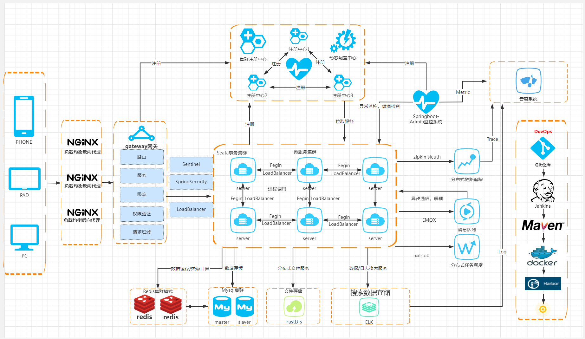

@include(@src/public/enhance/guidance/backend/springcloud/springcloud-eureka/springcloud-eureka-guidance.md)

# 1.微服务简介 {#1.}
@include(@src/public/enhance/guidance/backend/springcloud/springcloud-eureka/chapter/springcloud-eureka-guidance-chapter1.md)
## <a href="https://martinfowler.com/articles/microservices.html" target="_blank">1.1.Martin Fowler微服务论文英文原版</a>
```
https://martinfowler.com/articles/microservices.html
```
## <a href="https://martinfowler.com/articles/microservices.html" target="_blank">1.2.Martin Fowler微服务论文国内译版</a>
	如需国内译版,请使用谷歌翻译插件翻译自行翻译

## 1.3.微服务架构图
::: center
<div class="imgbg-customer">

</div>
:::

## 1.4.CAP中占据情况
	Eureka在CAP中占据AP
::: center
<div class="imgbg-customer">

</div>
:::

## 1.3.微服务架构落地实现方案
	微服务架构落地实现有很多种方案,本次介绍的方案技术栈如下
	注册中心: Eureka
    远程调用: Ribbon/OpenFeign
    客户端负载均衡: Ribbon/OpenFeign
    服务熔断/服务降级: Hystrix
    服务访问数据统计分析(单节点): Hystrix DashBoard
    服务访问数据统计分析(多节点): Turbine
    服务网关: Gateway
    调用链路追踪: Zipkin + Sleuth
    配置中心: Apollo
    分布式事务控制: Seata
    分布式日志系统: LogStash + ELK
    服务监控: SpringBootAdmin
    持续集成到Docker中: Docker的Maven插件 + Jenkins + Docker + Harbor
    持续集成到K8s中: Docker的Maven插件 + Jenkins + Docker + Harbor + K8s
## <a href="https://gitee.com/lingwh1995/springcloud-eureka.git"  target="_blank">1.6.项目源代码</a>
```
https://gitee.com/lingwh1995/springcloud-eureka.git
```

# 2.搭建项目基础设施 {#2.}
@include(@src/public/enhance/guidance/backend/springcloud/springcloud-eureka/chapter/springcloud-eureka-guidance-chapter2.md)
## 2.3.创建项目父工程
### 2.3.1.创建父工程
	在idea中创建一个名为springcloud-eureka的maven工程,创建完成后打开该工程,删除src文件夹
### 2.3.2.编写父工程pom.xml
    pom.xml中配置主要包括两部分内容,第一是对子模块依赖的jar包和使用到的插件的版本的统一规定,第二是规定了四种不同的环境,分别是: 1.开发环境(dev) 2.测试环境(test) 3.生产环境(prod) 4.rancher测试专用环境(rancher),关于这四种环境的详细内容会在本博客的最后一部分进行详细解析说明

    pom.xml
```xml
<?xml version="1.0" encoding="UTF-8"?>

<project xmlns="http://maven.apache.org/POM/4.0.0" xmlns:xsi="http://www.w3.org/2001/XMLSchema-instance"
         xsi:schemaLocation="http://maven.apache.org/POM/4.0.0 http://maven.apache.org/xsd/maven-4.0.0.xsd">
    <modelVersion>4.0.0</modelVersion>

    <groupId>org.openatom</groupId>
    <artifactId>springcloud-eureka</artifactId>
    <version>1.0-SNAPSHOT</version>
    <packaging>pom</packaging>

    <!--引入所有模块：开始-->
    <modules>
    </modules>
    <!--引入所有模块：结束-->

    <!--统一定义依赖具体版本：开始 -->
    <properties>
        <!--依赖版本-->
        <project.build.sourceEncoding>UTF-8</project.build.sourceEncoding>
        <maven.compiler.source>1.8</maven.compiler.source>
        <maven.compiler.target>1.8</maven.compiler.target>
        <junit.version>4.12</junit.version>
        <log4j.version>1.2.17</log4j.version>
        <lombok.version>1.16.18</lombok.version>
        <mysql.connector.version>8.0.28</mysql.connector.version>
        <spring.boot.version>2.2.2.RELEASE</spring.boot.version>
        <druid.spring.boot.version>1.1.10</druid.spring.boot.version>
        <spring.cloud.version>Hoxton.SR1</spring.cloud.version>
        <mybatis.spring.boot.version>1.3.0</mybatis.spring.boot.version>
        <org.openatom.api.commons.version>1.0-SNAPSHOT</org.openatom.api.commons.version>
        <com.ctrip.framework.apollo.apollo-client.version>2.0.1</com.ctrip.framework.apollo.apollo-client.version>
        <io.seata.version>1.4.2</io.seata.version>
        <spring.cloud.alibaba.version>2.2.0.RELEASE</spring.cloud.alibaba.version>
        <net.logstash.logback.logstash-logback-encoder.version>5.2</net.logstash.logback.logstash-logback-encoder.version>
        <spring.boot.admin.version>2.2.1</spring.boot.admin.version>

        <!--插件版本-->
        <org.springframework.boot.spring-boot-maven-plugin.version>2.2.2.RELEASE</org.springframework.boot.spring-boot-maven-plugin.version>
        <org.apache.maven.plugins.maven-resources-plugin.version>3.2.0</org.apache.maven.plugins.maven-resources-plugin.version>
        <io.fabric8.docker-maven-plugin.version>0.39.1</io.fabric8.docker-maven-plugin.version>
        <org.apache.maven.plugins.maven-antrun-plugin.version>1.8</org.apache.maven.plugins.maven-antrun-plugin.version>
    </properties>
    <!--统一定义依赖具体版本：结束 -->

    <!--统一定义依赖版本：开始-->
    <dependencyManagement>
        <dependencies>
            <!--spring boot 2.2.2-->
            <dependency>
                <groupId>org.springframework.boot</groupId>
                <artifactId>spring-boot-dependencies</artifactId>
                <version>${spring.boot.version}</version>
                <type>pom</type>
                <scope>import</scope>
            </dependency>
            <!--spring cloud Hoxton.SR1-->
            <dependency>
                <groupId>org.springframework.cloud</groupId>
                <artifactId>spring-cloud-dependencies</artifactId>
                <version>${spring.cloud.version}</version>
                <type>pom</type>
                <scope>import</scope>
            </dependency>
            <!--spring cloud alibaba 2.1.0.RELEASE-->
            <dependency>
                <groupId>com.alibaba.cloud</groupId>
                <artifactId>spring-cloud-alibaba-dependencies</artifactId>
                <version>${spring.cloud.alibaba.version}</version>
                <type>pom</type>
                <scope>import</scope>
            </dependency>
            <dependency>
                <groupId>mysql</groupId>
                <artifactId>mysql-connector-java</artifactId>
                <version>${mysql.connector.version}</version>
            </dependency>
            <dependency>
                <groupId>org.mybatis.spring.boot</groupId>
                <artifactId>mybatis-spring-boot-starter</artifactId>
                <version>${mybatis.spring.boot.version}</version>
            </dependency>
            <dependency>
                <groupId>com.alibaba</groupId>
                <artifactId>druid-spring-boot-starter</artifactId>
                <version>${druid.spring.boot.version}</version>
            </dependency>
            <dependency>
                <groupId>junit</groupId>
                <artifactId>junit</artifactId>
                <version>${junit.version}</version>
            </dependency>
            <dependency>
                <groupId>log4j</groupId>
                <artifactId>log4j</artifactId>
                <version>${log4j.version}</version>
            </dependency>
            <dependency>
                <groupId>org.projectlombok</groupId>
                <artifactId>lombok</artifactId>
                <version>${lombok.version}</version>
            </dependency>
            <!--定义公共的工程版本-->
            <dependency>
                <groupId>org.openatom</groupId>
                <artifactId>springcloud-api-commons</artifactId>
                <version>${org.openatom.api.commons.version}</version>
            </dependency>
            <!--Apollo客户端-->
            <dependency>
                <groupId>com.ctrip.framework.apollo</groupId>
                <artifactId>apollo-client</artifactId>
                <version>${com.ctrip.framework.apollo.apollo-client.version}</version>
            </dependency>
            <!--Seata客户端-->
            <dependency>
                <groupId>io.seata</groupId>
                <artifactId>seata-spring-boot-starter</artifactId>
                <version>${io.seata.version}</version>
            </dependency>
            <!--springboot admin server端-->
            <dependency>
                <groupId>de.codecentric</groupId>
                <artifactId>spring-boot-admin-starter-server</artifactId>
                <version>${spring.boot.admin.version}</version>
            </dependency>
            <!--springboot admin client端-->
            <dependency>
                <groupId>de.codecentric</groupId>
                <artifactId>spring-boot-admin-starter-client</artifactId>
                <version>${spring.boot.admin.version}</version>
            </dependency>
            <!--logstah-->
            <dependency>
                <groupId>net.logstash.logback</groupId>
                <artifactId>logstash-logback-encoder</artifactId>
                <version>${net.logstash.logback.logstash-logback-encoder.version}</version>
            </dependency>
        </dependencies>
    </dependencyManagement>
    <!--统一定义依赖版本：结束-->

    <!--统一定义插件版本：开始-->
    <build>
        <!--spring-boot-maven-plugin插件-->
        <plugins>
            <plugin>
                <groupId>org.springframework.boot</groupId>
                <artifactId>spring-boot-maven-plugin</artifactId>
                <version>${org.springframework.boot.spring-boot-maven-plugin.version}</version>
            </plugin>
            <!--支持yaml读取pom的参数-->
            <plugin>
                <groupId>org.apache.maven.plugins</groupId>
                <artifactId>maven-resources-plugin</artifactId>
                <version>${org.apache.maven.plugins.maven-resources-plugin.version}</version>
            </plugin>
            <!--执行maven命令时执行删除jar包和复制jar包操作-->
            <plugin>
                <groupId>org.apache.maven.plugins</groupId>
                <artifactId>maven-antrun-plugin</artifactId>
                <version>${org.apache.maven.plugins.maven-antrun-plugin.version}</version>
            </plugin>
            <!--docker maven插件-->
            <plugin>
                <groupId>io.fabric8</groupId>
                <artifactId>docker-maven-plugin</artifactId>
                <version>${io.fabric8.docker-maven-plugin.version}</version>
            </plugin>
        </plugins>
    </build>
    <!--统一定义插件版本：结束-->
</project>
```

## 2.4.创建项目依赖的公共模块
### 2.4.1.模块目录结构
```md
@include(./projects/springcloud-eureka/springcloud-api-commons/tree.md)
```
### 2.4.2.创建模块
	在父工程(springcloud-eureka)中创建一个名为springcloud-api-commons的maven模块,这个模块中包含了一些公共的Java实体和一些公共的插件,后面的每个模块都要引入这个公共模块,注意:当前模块创建成功后,在父工程pom.xml中<modules></modules>中会自动生成有关当前模块的信息
### 2.4.3.编写模块pom.xml
```xml
@include(./projects/springcloud-eureka/springcloud-api-commons/pom.xml)
```
### 2.4.4.编写模块中实体类
    Payment.java
```java
@include(./projects/springcloud-eureka/springcloud-api-commons//src/main/java/org/openatom/springcloud/entities/Payment.java)
```

## 2.5.准备项目需要的数据库
### 2.5.1.安装mysql数据库
    在192.168.0.5上安装mysql数据库
详细参考-> <a href="/blogs/environment/centos/centos7/shardings/centos7-chapter-3.搭建基础开发环境.html#_3-5-安装mysql" target="_blank">安装mysql(8.x版本)</a>

### 2.5.2.创建项目需要的数据库
    导入数据库脚本(application.yml中数据库配置和mysql部署机器信息保持一致)
```sql
@include(./projects/springcloud-eureka/script/payment.sql)
```

## 2.6.配置使用热部署
    在公共模块的pom.xml中添加热部署依赖和相关配置(上一步已经添加进去了,这里只是展示热部署部分的代码),将热部署相关插件和配置放在公共模块的好处是,其他的模块引用公共模块的时候就已经引入了热部署相关插件和配置,无需额外引入
```xml
    <dependencies>
        <!--热部署插件-->
        <dependency>
            <groupId>org.springframework.boot</groupId>
            <artifactId>spring-boot-devtools</artifactId>
            <scope>runtime</scope>
            <!--是否依赖传递:true,依赖不传递,false:依赖传递,这是maven的特性-->
            <optional>false</optional>
        </dependency>
    </dependencies>

    <!--热部署需要加这个-->
    <build>
        <plugins>
            <plugin>
                <groupId>org.springframework.boot</groupId>
                <artifactId>spring-boot-maven-plugin</artifactId>
                <configuration>
                    <fork>true</fork>
                    <addResources>true</addResources>
                </configuration>
            </plugin>
        </plugins>
    </build>
```
    更改idea设置
::: center
<div class="imgbg-customer">

</div>
:::
::: center
<div class="imgbg-customer">

</div>
:::

    热部署注意事项
    开发阶段开启热部署,发布阶段一定要关闭热部署
    开启热部署功能:spring.devtools.restart.enabled: true
    关闭热部署功能:spring.devtools.restart.enabled: false

# 3.使用Eureka作为注册中心 {#3.}
@include(@src/public/enhance/guidance/backend/springcloud/springcloud-eureka/chapter/springcloud-eureka-guidance-chapter3.md)
## 3.3.Eureka注册中心简介
	Eureka是Netflix公司开发的服务发现框架,Spring Cloud对它提供了支持,将它集成在了自己spring-cloud-netflix子项目中,用来实现Spring Cloud的服务发现功能,核心功能是为实现服务发现提供了基础支持。本次将搭建一个单节点版的Eureka注册中心和一个集群(高可用)版的Eureka注册中心,用来实现服务发现功能。

<a href="https://github.com/Netflix/eureka" target="_blank">官方网站(GITHUB)</a>
```
https://github.com/Netflix/eureka
```

<a href="https://spring.io/projects/spring-cloud-netflix" target="_blank">官方网站(SPRING.IO)</a>
```
https://spring.io/projects/spring-cloud-netflix
```

	EUREKA架构图
::: center
<div class="imgbg-customer">

</div>
:::

	Eureka的基础组件
	服务提供者(Service Provide): 服务提供端将自身服务注册到Eureka,从而使服务消费端能够找到
	服务消费者(Service Consumer): 服务消费端从Eureka获取注册服务列表,从而能够消费服务
	服务中介(Eureka Server): 是服务提供者和服务消费者之间的桥梁，服务提供者可以把自己注册到服务中介那里，而服务消费者如需要消费一些服务(使用一些功能)就可以在服务中介中寻找注册在服务中介的服务提供者。

	Eureka的提供了哪些功能?
	服务注册(Service Register)
	当Eureka客户端向Eureka Server注册时,它提供自身的元数据,比如IP地址、端口,运行状况指示符URL等
	服务续约(Service Renew)
	Eureka客户会每隔30秒(默认情况下)发送一次心跳来续约。通过续约来告知 Eureka Server该Eureka客户仍然存在,没有出现问题。正常情况下,如果 Eureka Server在90秒没有收到Eureka客户的续约,它会将实例从其注册表中删除
	获取注册列表信息(Service Fetch Registries)
	Eureka 客户端从服务器获取注册表信息,并将其缓存在本地。客户端会使用该信息查找其他服务,从而进行远程调用。该注册列表信息定期(每30 秒钟)更新一次。每次返回注册列表信息可能与Eureka客户端的缓存信息不同,Eureka客户端自动处理。如果由于某种原因导致注册列表信息不能及时匹配,Eureka 客户端则会重新获取整个注册表信息。Eureka 服务器缓存注册列表信息,整个注册表以及每个应用程序的信息进行了压缩,压缩内容和没有压缩的内容完全相同。Eureka客户端和Eureka服务器可以使用JSON/XML格式进行通讯。在默认的情况下 Eureka客户端使用压缩JSON 格式来获取注册列表的信息。
	服务下线(Service Cancel)
	Eureka 客户端在程序关闭时向 Eureka 服务器发送取消请求。发送请求后,该客户端实例信息将从服务器的实例注册表中删除。该下线请求不会自动完成,它需要调用以下内容:DiscoveryManager.getInstance().shutdownComponent();
	服务剔除(Service Eviction)
	在默认的情况下,当Eureka客户端连续90秒(3个续约周期)没有向Eureka服务器发送服务续约,即心跳,Eureka 服务器会将该服务实例从服务注册列表删除,即服务剔除。

## 3.4.搭建单节点版EUREKA注册中心
### 3.4.1.章节内容简介
    搭建一个单节点版的Eureka注册中心
### 3.4.2.模块简介
    单节点版Eureka注册中心,启动端口: 7001
### 3.4.3.模块目录结构
```md
@include(./projects/springcloud-eureka/springcloud-register-center-single-node7001/tree.md)
```
### 3.4.4.创建模块
	在父工程(springcloud-eureka)中创建一个名为springcloud-register-center-single-node7001的maven模块,注意:当前模块创建成功后,在父工程pom.xml中<modules></modules>中会自动生成有关当前模块的信息
### 3.4.5.编写模块pom.xml
```xml
@include(./projects/springcloud-eureka/springcloud-register-center-single-node7001/pom.xml)
```
### 3.4.6.编写模块application.yml
```yml
@include(./projects/springcloud-eureka/springcloud-register-center-single-node7001/src/main/resources/application.yml)
```
### 3.4.7.编写模块主启动类
```java
@include(./projects/springcloud-eureka/springcloud-register-center-single-node7001/src/main/java/org/openatom/springcloud/RegisterCcenterSingleNode7001.java)
```
### 3.4.8.测试模块
    在浏览器中访问
```
http://localhost:7001/
```
    看到如下界面代表搭建成功
::: center
<div class="imgbg-customer">

</div>
:::

## 3.5.搭建集群(高可用)版EUREKA注册中心
### 3.5.1.章节内容简介
    本章节会展示如何搭建一个集群(高可用)版的Eureka注册中心,共有三个节点,Eureka注册中心集群的原理是多个Eureka Server之间相互注册,从而组成一个集群。
### 3.5.2.搭建Eureka集群中第一个节点
    模块简介
    集群(高可用)版Eureka注册中心中第一个节点,启动端口: 7002

    模块目录结构
```md
@include(./projects/springcloud-eureka/springcloud-register-center-cluster-node7002/tree.md)
```

    创建模块
	在父工程(springcloud-eureka)中创建一个名为springcloud-register-center-cluster-node7002的maven模块,注意:当前模块创建成功后,在父工程pom.xml中<modules></modules>中会自动生成有关当前模块的信息

    编写模块pom.xml
```xml
@include(./projects/springcloud-eureka/springcloud-register-center-cluster-node7002/pom.xml)
```

    编写模块application.yml
```yml
@include(./projects/springcloud-eureka/springcloud-register-center-cluster-node7002/src/main/resources/application.yml)
```

    编写模块主启动类
```java
@include(./projects/springcloud-eureka/springcloud-register-center-cluster-node7002/src/main/java/org/openatom/springcloud/RegisterCcenterClusterNode7002.java)
```

### 3.5.3.搭建Eureka集群中第二个节点
    模块简介
    集群(高可用)版Eureka注册中心中第二个节点,启动端口: 7003

    模块目录结构
```md
@include(./projects/springcloud-eureka/springcloud-register-center-cluster-node7003/tree.md)
```

    创建模块
	在父工程(springcloud-eureka)中创建一个名为springcloud-register-center-cluster-node7003的maven模块,注意:当前模块创建成功后,在父工程pom.xml中<modules></modules>中会自动生成有关当前模块的信息

    编写模块pom.xml
```xml
@include(./projects/springcloud-eureka/springcloud-register-center-cluster-node7003/pom.xml)
```

    编写模块application.yml
```yml
@include(./projects/springcloud-eureka/springcloud-register-center-cluster-node7003/src/main/resources/application.yml)
```

    编写模块主启动类
```java
@include(./projects/springcloud-eureka/springcloud-register-center-cluster-node7003/src/main/java/org/openatom/springcloud/RegisterCcenterClusterNode7003.java)
```

### 3.5.4.搭建Eureka集群中第三个节点
    模块简介
    集群(高可用)版Eureka注册中心中第三个节点,启动端口: 7004

    模块目录结构
```md
@include(./projects/springcloud-eureka/springcloud-register-center-cluster-node7004/tree.md)
```

    创建模块
	在父工程(springcloud-eureka)中创建一个名为springcloud-register-center-cluster-node7004的maven模块,注意:当前模块创建成功后,在父工程pom.xml中<modules></modules>中会自动生成有关当前模块的信息

    编写模块pom.xml
```xml
@include(./projects/springcloud-eureka/springcloud-register-center-cluster-node7004/pom.xml)
```

    编写模块application.yml
```yml
@include(./projects/springcloud-eureka/springcloud-register-center-cluster-node7004/src/main/resources/application.yml)
```

    编写模块主启动类
```java
@include(./projects/springcloud-eureka/springcloud-register-center-cluster-node7004/src/main/java/org/openatom/springcloud/RegisterCcenterClusterNode7004.java)
```

### 3.5.5.配置host
    修改host文件,C:\Windows\System32\drivers\etc\host
    添加如下内容:
    127.0.0.1		eureka7002
    127.0.0.1		eureka7003
    127.0.0.1		eureka7004

### 3.5.6.测试集群模块
    测试集群中的第一个节点(7002),浏览器访问
```
http://eureka7002:7002/
```

::: center
<div class="imgbg-customer">

</div>
:::

    测试集群中的第二个节点(7003),浏览器访问
```
http://eureka7003:7003/
```
::: center
<div class="imgbg-customer">

</div>
:::

    测试集群中的第三个节点(7004),浏览器访问
```
http://eureka7004:7004/
```
::: center
<div class="imgbg-customer">

</div>
:::

    可以看到,在每个节点和都和其他两个节点相互注册,这代表集群搭建成功

# 4.搭建第一个微服务应用 {#4.}
@include(@src/public/enhance/guidance/backend/springcloud/springcloud-eureka/chapter/springcloud-eureka-guidance-chapter4.md)
## 4.3.第一个微服务应用简介
    第一个微服务应用由四部分组成,分别是注册中心(单节点)、服务消费者(单节点)、服务提供者(两个节点)、运行所需要的数据库环境,这里的注册中心使用单节点版注册中心,如果需要使用集群版注册中心,只需要在application.yml将defaultZone的配置切换为集群版配置即可,服务提供者第一个节点和第二个节点是除了端口和模块名称之外其他所有代码均是相同的,之所以要创建两个相同的模块是为了模拟生产环境中一个服务部署在多个节点的情况,这里为了查看日志方便,直接创建了两个相同的服务提供者模块。
## 4.4.搭建服务提供者第一个节点
### 4.4.1.模块简介
    服务提供者第一个节点,启动端口: 8001
### 4.4.2.模块目录结构
```md
@include(./projects/springcloud-eureka/springcloud-provider-cluster-node-payment8001/tree.md)
```
### 4.4.3.创建模块
	在父工程(springcloud-eureka)中创建一个名为springcloud-provider-cluster-node-payment8001的maven模块,注意:当前模块创建成功后,在父工程pom.xml中<modules></modules>中会自动生成有关当前模块的信息
### 4.4.4.编写模块pom.xml
```xml
@include(./projects/springcloud-eureka/springcloud-provider-cluster-node-payment8001/pom.xml)
```
### 4.4.5.编写模块application.yml
```yml
@include(./projects/springcloud-eureka/springcloud-provider-cluster-node-payment8001/src/main/resources/application.yml)
```
### 4.4.6.编写模块Mybatis配置文件
```xml
@include(./projects/springcloud-eureka/springcloud-provider-cluster-node-payment8001/src/main/resources/mapper/PaymentMapper.xml)
```
### 4.4.7.编写模块dao
```java
@include(./projects/springcloud-eureka/springcloud-provider-cluster-node-payment8001/src/main/java//org/openatom/springcloud/dao/PaymentDao.java)
```
### 4.4.8.编写模块service
```java
@include(./projects/springcloud-eureka/springcloud-provider-cluster-node-payment8001/src/main/java//org/openatom/springcloud/service/PaymentService.java)
```
### 4.4.9.编写模块service实现类
```java
@include(./projects/springcloud-eureka/springcloud-provider-cluster-node-payment8001/src/main/java//org/openatom/springcloud/service/impl/PaymentServiceImpl.java)
```
### 4.4.10.编写模块controller
```java
@include(./projects/springcloud-eureka/springcloud-provider-cluster-node-payment8001/src/main/java//org/openatom/springcloud/controller/PaymentController.java)
```
### 4.4.11.编写模块主启动类
```java
@include(./projects/springcloud-eureka/springcloud-provider-cluster-node-payment8001/src/main/java//org/openatom/springcloud/PaymentServiceProviderClusterNode8001.java)
```

## 4.5.搭建服务提供者第二个节点
### 4.5.1.模块简介
    服务提供者第二个节点,启动端口: 8002
### 4.5.2.模块目录结构
```md
@include(./projects/springcloud-eureka/springcloud-provider-cluster-node-payment8002/tree.md)
```
### 4.5.3.创建模块
	在父工程(springcloud-eureka)中创建一个名为springcloud-provider-cluster-node-payment8002的maven模块,注意:当前模块创建成功后,在父工程pom.xml中<modules></modules>中会自动生成有关当前模块的信息
### 4.5.4.编写模块pom.xml
```xml
@include(./projects/springcloud-eureka/springcloud-provider-cluster-node-payment8002/pom.xml)
```
### 4.5.5.编写模块application.yml
```yml
@include(./projects/springcloud-eureka/springcloud-provider-cluster-node-payment8002/src/main/resources/application.yml)
```
### 4.5.6.编写模块Mybatis配置文件
```xml
@include(./projects/springcloud-eureka/springcloud-provider-cluster-node-payment8002/src/main/resources/mapper/PaymentMapper.xml)
```
### 4.5.7.编写模块dao
```java
@include(./projects/springcloud-eureka/springcloud-provider-cluster-node-payment8002/src/main/java//org/openatom/springcloud/dao/PaymentDao.java)
```
### 4.5.8.编写模块service
```java
@include(./projects/springcloud-eureka/springcloud-provider-cluster-node-payment8002/src/main/java//org/openatom/springcloud/service/PaymentService.java)
```
### 4.5.9.编写模块service实现类
```java
@include(./projects/springcloud-eureka/springcloud-provider-cluster-node-payment8002/src/main/java//org/openatom/springcloud/service/impl/PaymentServiceImpl.java)
```
### 4.5.10.编写模块controller
```java
@include(./projects/springcloud-eureka/springcloud-provider-cluster-node-payment8002/src/main/java//org/openatom/springcloud/controller/PaymentController.java)
```
### 4.5.11.编写模块主启动类
```java
@include(./projects/springcloud-eureka/springcloud-provider-cluster-node-payment8002/src/main/java//org/openatom/springcloud/PaymentServiceProviderClusterNode8002.java)
```

## 4.6.搭建服务消费者
### 4.6.1.模块简介
    基于SpringCloud官方默认组件实现的服务消费者,启动端口: 80
### 4.6.2.模块目录结构
    @include(./projects/springcloud-eureka/springcloud-consumer-loadbalance-default-order80/tree.md)
### 4.6.3.创建模块
	在父工程(springcloud-eureka)中创建一个名为springcloud-consumer-loadbalance-default-order80的maven模块,注意:当前模块创建成功后,在父工程pom.xml中<modules></modules>中会自动生成有关当前模块的信息
### 4.6.4.编写模块pom.xml
```xml
@include(./projects/springcloud-eureka/springcloud-consumer-loadbalance-default-order80/pom.xml)
```
### 4.6.5.编写模块application.yml
```yml
@include(./projects/springcloud-eureka/springcloud-consumer-loadbalance-default-order80/src/main/resources/application.yml)
```
### 4.6.6.编写模块config
```java
@include(./projects/springcloud-eureka/springcloud-consumer-loadbalance-default-order80/src/main/java/org/openatom/springcloud/config/ApplicationContextConfig.java)
```
### 4.6.7.编写模块controller
```java
@include(./projects/springcloud-eureka/springcloud-consumer-loadbalance-default-order80/src/main/java/org/openatom/springcloud/controller/OrderConsumerController.java)
```
### 4.6.8.编写模块主启动类
```java
@include(./projects/springcloud-eureka/springcloud-consumer-loadbalance-default-order80/src/main/java/org/openatom/springcloud/OrderServiceConsumerLoadBalanceDefault80.java)
```

## 4.7.启动并测试第一个微服务应用
### 4.7.1.启动第一个微服务应用

### 4.7.2.测试第一个微服务应用
    在浏览器中访问
```
http://localhost/consumer/payment/get/1
```
    第一次访问返回结果
```json
{"code":200,"message":"查询成功,serverPort:  8001","data":{"id":1,"serial":"15646546546"}}
```
    第二次访问返回结果
```json
{"code":200,"message":"查询成功,serverPort:  8002","data":{"id":1,"serial":"15646546546"}}
```
    第三次访问返回结果
```json
{"code":200,"message":"查询成功,serverPort:  8001","data":{"id":1,"serial":"15646546546"}}
```
    第四次访问返回结果
```json
{"code":200,"message":"查询成功,serverPort:  8002","data":{"id":1,"serial":"15646546546"}}
```
    可以看到四次访问返回的结果中,第一次和第三次是相同的,第二次和第四次是相同的,之所以会出现这样的结果,是因为上面编写RestTemplate时使用了默认的配置,默认的配置使用负载均衡策略是轮询策略,所以接连访问该服务四次会出现上面的情况。

# 5.使用Ribbon实现客户端负载均衡 {#5.}
@include(@src/public/enhance/guidance/backend/springcloud/springcloud-eureka/chapter/springcloud-eureka-guidance-chapter5.md)

## 5.3.Ribbon简介
    Ribbon是Netflix发布的开源项目，主要功能是提供客户端的软件负载均衡算法，将Netflix的中间层服务连接在一起。Ribbon客户端组件提供一系列完善的配置项如连接超时，重试等。简单的说，就是在配置文件中列出Load Balancer（简称LB）后面所有的机器，Ribbon会自动的帮助你基于某种规则（如简单轮询，随即连接等）去连接这些机器,也可以使用Ribbon实现自定义的负载均衡算法。

<a href="https://github.com/Netflix/ribbon" target="_blank">官方网址</a>
```
https://github.com/Netflix/ribbon
```

## 5.4.硬编码配置方式使用Ribbon实现负载均衡(使用Ribbon自带的负载均衡策略)
### 5.4.1.模块简介
    基于Ribbon以硬编码配置方式实现的服务消费者,使用Ribbon自带的负载均衡策略,启动端口: 80
### 5.4.2.模块目录结构
```md
@include(./projects/springcloud-eureka/springcloud-consumer-loadbalance-ribbon-hardcode-order80/tree.md)
```
### 5.4.3.创建模块
	在父工程(springcloud-eureka)中创建一个名为springcloud-consumer-loadbalance-ribbon-hardcode-order80的maven模块,注意:当前模块创建成功后,在父工程pom.xml中<modules></modules>中会自动生成有关当前模块的信息
### 5.4.4.编写模块pom.xml
```xml
@include(./projects/springcloud-eureka/springcloud-consumer-loadbalance-ribbon-hardcode-order80/pom.xml)
```
### 5.4.5.编写模块application.yml
```yml
@include(./projects/springcloud-eureka/springcloud-consumer-loadbalance-ribbon-hardcode-order80/src/main/resources/application.yml)
```
### 5.4.6.编写模块config
```java
@include(./projects/springcloud-eureka/springcloud-consumer-loadbalance-ribbon-hardcode-order80/src/main/java/org/openatom/springcloud/config/ApplicationContextConfig.java)
```
### 5.4.7.编写模块controller
```java
@include(./projects/springcloud-eureka/springcloud-consumer-loadbalance-ribbon-hardcode-order80/src/main/java/org/openatom/springcloud/controller/OrderConsumerController.java)
```
### 5.4.8.编写负载均衡规则配置类
```java
@include(./projects/springcloud-eureka/springcloud-consumer-loadbalance-ribbon-hardcode-order80/src/main/java/org/openatom/myrule/MySelfRule.java)
```
    这里使用return new RandomRule();,这代表使用的负载均衡算法是RandomRule,Ribbon默认提供了七种负载均衡的算法策略,具体使用哪一种,请根据实际需求灵活选择,这里提供关于七种负载均衡算法的介绍

    RoundRobinRule(轮询策略,轮询是Ribbon默认使用的负载均衡算法)
    第一次到A,第二次就到B,第三次又到A,第四次又到B......
    具体实现是一个负载均衡算法: 第N次请求 % 服务器集群的总数 = 实际调用服务器位置的下标

    RandomRule(随机策略)
    从服务提供者的列表中随机选择一个服务实例进行调用

    RetryRule(轮询重试策略)
    按照轮询策略来获取服务,如果获取的服务实例为null或已经失效,则在指定的时间之内不断地进行重试来获取服务,如果超过指定时间依然没获取到服务实例则返回null。

    WeightedResponseTimeRule(响应速度决定权重策略)
    根据每个服务提供者的响应时间分配一个权重,响应时间越长,权重越小,被选中的可能性也就越低。它的实现原理是,刚开始使用轮询策略并开启一个计时器,每一段时间收集一次所有服务提供者的平均响应时间,然后再给每个服务提供者附上一个权重,权重越高被选中的概率也越大。

    BestAvailableRule(最优可用策略)
    判断最优其实用的是并发连接数。选择并发连接数较小的server发送请求。

    AvailabilityFilteringRule(可用性敏感策略)
    先过滤掉非健康的服务实例，然后再选择连接数较小的服务实例。

    ZoneAvoidanceRule(区域内可用性能最优策略)
    基于AvailabilityFilteringRule基础上做的,首先判断一个zone的运行性能是否可用.剔除不可用的区域zone的所有server,然后再利用AvailabilityPredicate过滤并发连接过多的server。

### 5.4.9.编写模块主启动类
```java
@include(./projects/springcloud-eureka/springcloud-consumer-loadbalance-ribbon-hardcode-order80/src/main/java/org/openatom/springcloud/OrderServiceConsumerLoadBalanceRibbonHardcode80.java)
```
### 5.4.10.测试模块
    启动相关服务

    测试硬编码配置方式使用Ribbon实现负载均衡(使用Ribbon自带的负载均衡策略)
    在浏览器中访问
```
http://localhost/consumer/payment/get/1
```
    第一次访问返回结果
```json
{"code":200,"message":"查询成功,serverPort:  8001","data":{"id":1,"serial":"15646546546"}}
```
    第二次访问返回结果
```json
{"code":200,"message":"查询成功,serverPort:  8002","data":{"id":1,"serial":"15646546546"}}
```
    第二次访问返回结果
```json
{"code":200,"message":"查询成功,serverPort:  8002","data":{"id":1,"serial":"15646546546"}}
```
    第四次访问返回结果
```json
{"code":200,"message":"查询成功,serverPort:  8001","data":{"id":1,"serial":"15646546546"}}
```
    可以看到四次访问返回的结果中,四次返回结果是没有规律的,因为采用的RandomRule(随机策略),实际返回结果可能不是上面的情况,但是一定是随机进行服务调用的

## 5.5.声明式配置方式使用Ribbon实现负载均衡(使用Ribbon自带的负载均衡策略)
### 5.5.1.模块简介
    基于Ribbon以声明式配置方式实现的服务消费者,使用Ribbon自带的负载均衡策略,启动端口: 80
### 5.5.2.模块目录结构
```md
@include(./projects/springcloud-eureka/springcloud-consumer-loadbalance-ribbon-configuration-order80/tree.md)
```
### 5.5.3.创建模块
	在父工程(springcloud-eureka)中创建一个名为springcloud-consumer-loadbalance-ribbon-configuration-order80的maven模块,注意:当前模块创建成功后,在父工程pom.xml中<modules></modules>中会自动生成有关当前模块的信息
### 5.5.4.编写模块pom.xml
```xml
@include(./projects/springcloud-eureka/springcloud-consumer-loadbalance-ribbon-configuration-order80/pom.xml)
```
### 5.5.5.编写模块application.yml
```yml
@include(./projects/springcloud-eureka/springcloud-consumer-loadbalance-ribbon-configuration-order80/src/main/resources/application.yml)
```

    yml中关于Ribbon负载均衡策略的配置
    SPRINGCLOUD-PROVIDER-PAYMENT-SERVICE-CLUSTER:
    ribbon:
        NFLoadBalancerRuleClassName: com.netflix.loadbalancer.RandomRule 
    这里使用com.netflix.loadbalancer.RandomRule ,这代表使用的负载均衡算法是RandomRule,Ribbon默认提供了七种负载均衡的算法策略,具体使用哪一种,请根据实际需求灵活选择,这里提供关于七种负载均衡算法的介绍

    RoundRobinRule(轮询策略,轮询是Ribbon默认使用的负载均衡算法)
    第一次到A,第二次就到B,第三次又到A,第四次又到B......
    具体实现是一个负载均衡算法: 第N次请求 % 服务器集群的总数 = 实际调用服务器位置的下标

    RandomRule(随机策略)
    从服务提供者的列表中随机选择一个服务实例进行调用

    RetryRule(轮询重试策略)
    按照轮询策略来获取服务,如果获取的服务实例为null或已经失效,则在指定的时间之内不断地进行重试来获取服务,如果超过指定时间依然没获取到服务实例则返回null。

    WeightedResponseTimeRule(响应速度决定权重策略)
    根据每个服务提供者的响应时间分配一个权重,响应时间越长,权重越小,被选中的可能性也就越低。它的实现原理是,刚开始使用轮询策略并开启一个计时器,每一段时间收集一次所有服务提供者的平均响应时间,然后再给每个服务提供者附上一个权重,权重越高被选中的概率也越大。

    BestAvailableRule(最优可用策略)
    判断最优其实用的是并发连接数。选择并发连接数较小的server发送请求。

    AvailabilityFilteringRule(可用性敏感策略)
    先过滤掉非健康的服务实例，然后再选择连接数较小的服务实例。

    ZoneAvoidanceRule(区域内可用性能最优策略)
    基于AvailabilityFilteringRule基础上做的,首先判断一个zone的运行性能是否可用.剔除不可用的区域zone的所有server,然后再利用AvailabilityPredicate过滤并发连接过多的server。

### 5.5.6.编写模块config
```java
@include(./projects/springcloud-eureka/springcloud-consumer-loadbalance-ribbon-configuration-order80/src/main/java/org/openatom/springcloud/config/ApplicationContextConfig.java)
```
### 5.5.7.编写模块controller
```java
@include(./projects/springcloud-eureka/springcloud-consumer-loadbalance-ribbon-configuration-order80/src/main/java/org/openatom/springcloud/controller/OrderConsumerController.java)
```
### 5.5.8.编写模块主启动类
```java
@include(./projects/springcloud-eureka/springcloud-consumer-loadbalance-ribbon-configuration-order80/src/main/java/org/openatom/springcloud/OrderServiceConsumerLoadBalanceRibbonConfiguration80.java)
```
### 5.5.9.测试模块
    启动相关服务

    测试硬编码配置方式使用Ribbon实现负载均衡(使用Ribbon自带的负载均衡策略)
    在浏览器中访问
```
http://localhost/consumer/payment/get/1
```
    第一次访问返回结果
```json
{"code":200,"message":"查询成功,serverPort:  8001","data":{"id":1,"serial":"15646546546"}}
```
    第二次访问返回结果
```json
{"code":200,"message":"查询成功,serverPort:  8002","data":{"id":1,"serial":"15646546546"}}
```
    第三次访问返回结果
```json
{"code":200,"message":"查询成功,serverPort:  8002","data":{"id":1,"serial":"15646546546"}}
```
    第四次访问返回结果
```json
{"code":200,"message":"查询成功,serverPort:  8001","data":{"id":1,"serial":"15646546546"}}
```
    可以看到四次访问返回的结果中,四次返回结果是没有规律的,因为采用的RandomRule(随机策略),实际返回结果可能不是上面的情况,但是一定是随机进行服务调用的

## 5.6.硬编码配置方式使用Ribbon实现负载均衡(使用自定义的Ribbon负载均衡策略)
### 5.6.1.模块简介
    基于Ribbon以硬编码式配置方式实现的服务消费者,使用自定义的Ribbon负载均衡策略,启动端口: 80
### 5.6.2.模块目录结构
```md
@include(./projects/springcloud-eureka/springcloud-consumer-loadbalance-ribbon-custom-strategy-hardcode-order80/tree.md)
```
### 5.6.3.创建模块
	在父工程(springcloud-eureka)中创建一个名为springcloud-consumer-loadbalance-ribbon-custom-strategy-hardcode-order80的maven模块,注意:当前模块创建成功后,在父工程pom.xml中<modules></modules>中会自动生成有关当前模块的信息
### 5.6.4.编写模块pom.xml
```xml
@include(./projects/springcloud-eureka/springcloud-consumer-loadbalance-ribbon-custom-strategy-hardcode-order80/pom.xml)
```
### 5.6.5.编写模块application.yml
```yml
@include(./projects/springcloud-eureka/springcloud-consumer-loadbalance-ribbon-custom-strategy-hardcode-order80/src/main/resources/application.yml)
```
### 5.6.6.编写模块config
```java
@include(./projects/springcloud-eureka/springcloud-consumer-loadbalance-ribbon-custom-strategy-hardcode-order80/src/main/java/org/openatom/springcloud/config/ApplicationContextConfig.java)
```
### 5.6.7.编写模块controller
```java
@include(./projects/springcloud-eureka/springcloud-consumer-loadbalance-ribbon-custom-strategy-hardcode-order80/src/main/java/org/openatom/springcloud/controller/OrderConsumerController.java)
```
### 5.6.8.编写自定义的负载均衡算法策略
```java
@include(./projects/springcloud-eureka/springcloud-consumer-loadbalance-ribbon-custom-strategy-hardcode-order80/src/main/java/org/openatom/springcloud/loadbalance/MyRoundRobinRule.java)
```
### 5.6.9.编写模块主启动类
```java
@include(./projects/springcloud-eureka/springcloud-consumer-loadbalance-ribbon-custom-strategy-hardcode-order80/src/main/java/org/openatom/springcloud/OrderServiceConsumerLoadBalanceRibbonCustomerStrategyHardcode80.java)
```
### 5.6.10.测试模块
    启动相关服务

    测试硬编码配置方式使用Ribbon实现负载均衡(使用Ribbon自带的负载均衡策略)
    在浏览器中访问
```
http://localhost/consumer/payment/get/1
```
    第一次访问返回结果
```json
{"code":200,"message":"查询成功,serverPort:  8001","data":{"id":1,"serial":"15646546546"}}
```
    第二次访问返回结果
```json
{"code":200,"message":"查询成功,serverPort:  8002","data":{"id":1,"serial":"15646546546"}}
```
    第三次访问返回结果
```json
{"code":200,"message":"查询成功,serverPort:  8002","data":{"id":1,"serial":"15646546546"}}
```
    第四次访问返回结果
```json
{"code":200,"message":"查询成功,serverPort:  8001","data":{"id":1,"serial":"15646546546"}}
```
    可以看到四次访问返回的结果中,四次返回结果是没有规律的,因为采用的MyRoundRobinRule(自定义策略,这个策略的效果也是随机调用),实际返回结果可能不是上面的情况,但是一定是随机进行服务调用的

## 5.7.声明式配置方式使用Ribbon实现负载均衡(使用自定义的Ribbon负载均衡策略)
### 5.7.1.模块简介
    基于Ribbon以声明式配置方式实现的服务消费者,使用自定义的Ribbon负载均衡策略,启动端口: 80
### 5.7.2.模块目录结构
```md
@include(./projects/springcloud-eureka/springcloud-consumer-loadbalance-ribbon-custom-strategy-configuration-order80/tree.md)
```
### 5.7.3.创建模块
	在父工程(springcloud-eureka)中创建一个名为springcloud-consumer-loadbalance-ribbon-custom-strategy-configuration-order80的maven模块,注意:当前模块创建成功后,在父工程pom.xml中<modules></modules>中会自动生成有关当前模块的信息
### 5.7.4.编写模块pom.xml
```xml
@include(./projects/springcloud-eureka/springcloud-consumer-loadbalance-ribbon-custom-strategy-configuration-order80/pom.xml)
```
### 5.7.5.编写模块application.yml
```yml
@include(./projects/springcloud-eureka/springcloud-consumer-loadbalance-ribbon-custom-strategy-configuration-order80/src/main/resources/application.yml)
```
### 5.7.6.编写模块config
```java
@include(./projects/springcloud-eureka/springcloud-consumer-loadbalance-ribbon-custom-strategy-configuration-order80/src/main/java/org/openatom/springcloud/config/ApplicationContextConfig.java)
```
### 5.7.7.编写模块controller
```java
@include(./projects/springcloud-eureka/springcloud-consumer-loadbalance-ribbon-custom-strategy-configuration-order80/src/main/java/org/openatom/springcloud/controller/OrderConsumerController.java)
```
### 5.7.8.编写自定义的负载均衡算法策略
```java
@include(./projects/springcloud-eureka/springcloud-consumer-loadbalance-ribbon-custom-strategy-configuration-order80/src/main/java/org/openatom/springcloud/loadbalance/MyRoundRobinRule.java)
```
### 5.7.9.编写模块主启动类
```java
@include(./projects/springcloud-eureka/springcloud-consumer-loadbalance-ribbon-custom-strategy-configuration-order80/src/main/java/org/openatom/springcloud/OrderServiceConsumerLoadBalanceRibbonCustomerStrategyConfiguration80.java)
```
### 5.7.10.测试模块
    启动相关服务

    测试硬编码配置方式使用Ribbon实现负载均衡(使用Ribbon自带的负载均衡策略)
    在浏览器中访问
```
http://localhost/consumer/payment/get/1
```
    第一次访问返回结果
```json
{"code":200,"message":"查询成功,serverPort:  8001","data":{"id":1,"serial":"15646546546"}}
```
    第二次访问返回结果
```json
{"code":200,"message":"查询成功,serverPort:  8002","data":{"id":1,"serial":"15646546546"}}
```
    第三次访问返回结果
```json
{"code":200,"message":"查询成功,serverPort:  8002","data":{"id":1,"serial":"15646546546"}}
```
    第四次访问返回结果
```json
{"code":200,"message":"查询成功,serverPort:  8001","data":{"id":1,"serial":"15646546546"}}
```
    可以看到四次访问返回的结果中,四次返回结果是没有规律的,因为采用的MyRoundRobinRule(自定义策略,这个策略的效果也是随机调用),实际返回结果可能不是上面的情况,但是一定是随机进行服务调用的

# 6.使用OpenFeign实现客户端负载均衡 {#6.}
@include(@src/public/enhance/guidance/backend/springcloud/springcloud-eureka/chapter/springcloud-eureka-guidance-chapter6.md)
## 6.3.OpenFeign简介
    Feign是SpringCloud组件中一个轻量级RESTful的HTTP服务客户端,Feign内置了Ribbon,用来做客户端负载均衡,去调用服务注册中心的服务。Feign的使用方式是: 使用Feign的注解定义接口,调用这个接口,就可以调用服务注册中心的服务。OpenFeign是SpringCloud在Feign的基础上支持了SpringMVC的注解,如@RequestMapping等。OpenFeign的@FeignClient可以解析SpringMVC的@RequestMapping注解下的接口,并通过动态代理的方式产生实现类,实现类中做负载均衡并调用其他服务。核心作用是为HTTP形式的Rest API提供了非常简洁高效的RPC调用方式,可以让编写远程调用代码就像编写本地Service一样简单。

<a href="https://docs.spring.io/spring-cloud-openfeign/docs/2.2.10.BUILD-SNAPSHOT/reference/html/"  target="_blank">官方网址(SPRING.IO)</a>
```
https://docs.spring.io/spring-cloud-openfeign/docs/2.2.10.BUILD-SNAPSHOT/reference/html/
```

## 6.4.通过配置Ribbon实现对OpenFeign的配置来实现负载均衡
### 6.4.1.模块简介
    通过配置Ribbon实现对OpenFeign的配置来实现的服务消费者,在YML中编写相关配置,之所以可以这样,是因为OpenFeign的底层实现就是Ribbon,启动端口: 80
### 6.4.2.模块目录结构
```md
@include(./projects/springcloud-eureka/springcloud-consumer-loadbalance-openfeign-configuration-ribbon-order80/tree.md)
```
### 6.4.3.创建模块
	在父工程(springcloud-eureka)中创建一个名为springcloud-consumer-loadbalance-openfeign-configuration-ribbon-order80的maven模块,注意:当前模块创建成功后,在父工程pom.xml中<modules></modules>中会自动生成有关当前模块的信息
### 6.4.4.编写模块pom.xml
```xml
@include(./projects/springcloud-eureka/springcloud-consumer-loadbalance-openfeign-configuration-ribbon-order80/pom.xml)
```
### 6.4.5.编写模块application.yml
```yml
@include(./projects/springcloud-eureka/springcloud-consumer-loadbalance-openfeign-configuration-ribbon-order80/src/main/resources/application.yml)
```
### 6.4.6.编写模块config
```java
@include(./projects/springcloud-eureka/springcloud-consumer-loadbalance-openfeign-configuration-ribbon-order80/src/main/java/org/openatom/springcloud/config/OpenFeignConfig.java)
```
### 6.4.7.编写模块service
```java
@include(./projects/springcloud-eureka/springcloud-consumer-loadbalance-openfeign-configuration-ribbon-order80/src/main/java/org/openatom/springcloud/service/PaymentServiceOpenFeign.java)
```
### 6.4.8.编写模块controller
```java
@include(./projects/springcloud-eureka/springcloud-consumer-loadbalance-openfeign-configuration-ribbon-order80/src/main/java/org/openatom/springcloud/controller/OrderConsumerController.java)
```
### 6.4.9.编写模块主启动类
```java
@include(./projects/springcloud-eureka/springcloud-consumer-loadbalance-openfeign-configuration-ribbon-order80/src/main/java/org/openatom/springcloud/OrderServiceConsumerLoadBalanceOpenFeignConfigurationRibbon80.java)
```
### 6.4.10.测试模块
    启动相关服务

    测试通过配置Ribbon实现对OpenFeign的配置来实现负载均衡
    在浏览器中访问
```
http://localhost/consumer/payment/get/1
```
    第一次访问返回结果
```json
{"code":200,"message":"查询成功,serverPort:  8001","data":{"id":1,"serial":"15646546546"}}
```
    第二次访问返回结果
```json
{"code":200,"message":"查询成功,serverPort:  8002","data":{"id":1,"serial":"15646546546"}}
```
    第三次访问返回结果
```json
{"code":200,"message":"查询成功,serverPort:  8002","data":{"id":1,"serial":"15646546546"}}
```
    第四次访问返回结果
```json
{"code":200,"message":"查询成功,serverPort:  8001","data":{"id":1,"serial":"15646546546"}}
```
    可以看到四次访问返回的结果中,四次返回结果是没有规律的,因为采用的MyRoundRobinRule(自定义策略,这个策略的效果也是随机调用),实际返回结果可能不是上面的情况,但是一定是随机进行服务调用的

### 6.4.11.注意事项
    OpenFeign和RestTemplate
    使用OpenFeign实现远程调用时,容器中注入不用注入RestTemplate,OpenFeign已经在底层对RestTemplate做了封装

    在application.yml中配置开启OpenFeign增强日志
```yml
logging: #OpenFeign增强日志配置
    level:
    org.openatom.springcloud.services.PaymentServiceOpenFeign: debug  #OpenFeign日志以什么级别监控哪个接口
```

## 6.5.通过直接配置OpenFeign实现对OpenFeign的配置来实现负载均衡
### 6.5.1.模块简介
    通过直接配置OpenFeign实现对OpenFeign的配置来实现的服务消费者,在YML中编写相关配置,之前在YML配置的Ribbon的相关配置现在直接配置在了YML中OpenFeign部分,启动端口: 80
### 6.5.2.模块目录结构
```md
@include(./projects/springcloud-eureka/springcloud-consumer-loadbalance-openfeign-configuration-openfeign-order80/tree.md)
```
### 6.5.3.创建模块
	在父工程(springcloud-eureka)中创建一个名为springcloud-consumer-loadbalance-openfeign-configuration-openfeign-order80的maven模块,注意:当前模块创建成功后,在父工程pom.xml中<modules></modules>中会自动生成有关当前模块的信息
### 6.5.4.编写模块pom.xml
```xml
@include(./projects/springcloud-eureka/springcloud-consumer-loadbalance-openfeign-configuration-openfeign-order80/pom.xml)
```
### 6.5.5.编写模块application.yml
```yml
@include(./projects/springcloud-eureka/springcloud-consumer-loadbalance-openfeign-configuration-openfeign-order80/src/main/resources/application.yml)
```
### 6.5.6.编写模块config
```java
@include(./projects/springcloud-eureka/springcloud-consumer-loadbalance-openfeign-configuration-openfeign-order80/src/main/java/org/openatom/springcloud/config/OpenFeignConfig.java)
```
### 6.5.7.编写模块service
```java
@include(./projects/springcloud-eureka/springcloud-consumer-loadbalance-openfeign-configuration-openfeign-order80/src/main/java/org/openatom/springcloud/service/PaymentServiceOpenFeign.java)
```
### 6.5.8.编写模块controller
```java
@include(./projects/springcloud-eureka/springcloud-consumer-loadbalance-openfeign-configuration-openfeign-order80/src/main/java/org/openatom/springcloud/controller/OrderConsumerController.java)
```
### 6.5.9.编写模块主启动类
```java
@include(./projects/springcloud-eureka/springcloud-consumer-loadbalance-openfeign-configuration-openfeign-order80/src/main/java/org/openatom/springcloud/OrderServiceConsumerLoadBalanceOpenFeignConfigurationOpenfeign80.java)
```
### 6.5.10.测试模块
    启动相关服务

    测试通过直接配置OpenFeign实现对OpenFeign的配置来实现负载均衡
    在浏览器中访问
```
http://localhost/consumer/payment/get/1
```
    第一次访问返回结果
```json
{"code":200,"message":"查询成功,serverPort:  8001","data":{"id":1,"serial":"15646546546"}}
```
    第二次访问返回结果
```json
{"code":200,"message":"查询成功,serverPort:  8002","data":{"id":1,"serial":"15646546546"}}
```
    第三次访问返回结果
```json
{"code":200,"message":"查询成功,serverPort:  8002","data":{"id":1,"serial":"15646546546"}}
```
    第四次访问返回结果
```json
{"code":200,"message":"查询成功,serverPort:  8001","data":{"id":1,"serial":"15646546546"}}
```
    可以看到四次访问返回的结果中,四次返回结果是没有规律的,因为采用的MyRoundRobinRule(自定义策略,这个策略的效果也是随机调用),实际返回结果可能不是上面的情况,但是一定是随机进行服务调用的
### 6.5.11.注意事项
    OpenFeign和RestTemplate
    容器中注入不用注入RestTemplate,OpenFeign已经在底层对RestTemplate做了封装

    在application.yml中配置开启OpenFeign增强日志
```yml
logging: #OpenFeign增强日志配置
    level:
    org.openatom.springcloud.services.PaymentServiceOpenFeign: debug  #OpenFeign日志以什么级别监控哪个接口
```

# 7.使用Hystrix实现服务降级和熔断 {#7.}
@include(@src/public/enhance/guidance/backend/springcloud/springcloud-eureka/chapter/springcloud-eureka-guidance-chapter7.md)
## 7.3.Hystrix简介
    Hystrix是由Netflix开源的一个服务隔离组件,通过服务隔离来避免由于依赖延迟、异常,引起资源耗尽导致系统不可用的解决方案。这说的有点儿太官方了,它的功能主要有以下三个:
    服务降级
    当服务调用发生异常时，快速返回一个事先设置好的值,针对系统全局稳定性考虑,消费端和服务端都可以做

    服务熔断
    当调用服务发生多次异常时服务会会熔断,如数据库连接故障,当故障修复时服务又会恢复到正常状态,针对服务提供端稳定性考虑

    服务限流
    对访问的流量进行限制

<a href="https://github.com/Netflix/Hystrix"  target="_blank">官方网站</a>
```
https://github.com/Netflix/Hystrix
```

## 7.4.搭建服务提供者第一个节点(Hystrix)
### 7.4.1.模块简介
    具有服务熔断和服务降级功能的服务提供者的第一个节点,启动端口: 8003
### 7.4.2.模块目录结构
```md
@include(./projects/springcloud-eureka/springcloud-provider-hystrix-cluster-node-payment8003/tree.md)
```
### 7.4.3.创建模块
	在父工程(springcloud-eureka)中创建一个名为springcloud-provider-hystrix-cluster-node-payment8003的maven模块,注意:当前模块创建成功后,在父工程pom.xml中<modules></modules>中会自动生成有关当前模块的信息
### 7.4.4.编写模块pom.xml
```xml
@include(./projects/springcloud-eureka/springcloud-provider-hystrix-cluster-node-payment8003/pom.xml)
```
### 7.4.5.编写模块application.yml
```yml
@include(./projects/springcloud-eureka/springcloud-provider-hystrix-cluster-node-payment8003/src/main/resources/application.yml)
```
### 7.4.6.编写模块Mybatis配置文件
```xml
@include(./projects/springcloud-eureka/springcloud-provider-hystrix-cluster-node-payment8003/src/main/resources/mapper/PaymentMapper.xml)
```
### 7.4.7.编写模块dao
```java
@include(./projects/springcloud-eureka/springcloud-provider-hystrix-cluster-node-payment8003/src/main/java/org/openatom/springcloud/dao/PaymentHystrixDao.java)
```
### 7.4.8.编写模块service
```java
@include(./projects/springcloud-eureka/springcloud-provider-hystrix-cluster-node-payment8003/src/main/java/org/openatom/springcloud/service/PaymentHystrixService.java)
```
### 7.4.9.编写模块service实现类
```java
@include(./projects/springcloud-eureka/springcloud-provider-hystrix-cluster-node-payment8003/src/main/java/org/openatom/springcloud/service/impl/PaymentHystrixServiceImpl.java)
```
### 7.4.10.编写模块controller
```java
@include(./projects/springcloud-eureka/springcloud-provider-hystrix-cluster-node-payment8003/src/main/java/org/openatom/springcloud/controller/PaymentHystrixController.java)
```
### 7.4.11.编写模块主启动类
```java
package org.openatom.springcloud;

import org.springframework.boot.SpringApplication;
import org.springframework.boot.autoconfigure.SpringBootApplication;
import org.springframework.cloud.client.circuitbreaker.EnableCircuitBreaker;
import org.springframework.cloud.netflix.eureka.EnableEurekaClient;

/**
 * 支付接口提供者
 *  使用Eureka作为注册中心
 */
@EnableEurekaClient
@SpringBootApplication
@EnableCircuitBreaker//服务提供端启用Hystrix
public class PaymentServiceProviderHystrixClusterNode8003 {

    public static void main(String[] args) {
        SpringApplication.run(PaymentServiceProviderHystrixClusterNode8003.class, args);
    }

}
```

## 7.5.搭建服务提供者第二个节点(Hystrix)
### 7.5.1.模块简介
    具有服务熔断和服务降级功能的服务提供者的第二个节点,启动端口: 8004
### 7.5.2.模块目录结构
```md
@include(./projects/springcloud-eureka/springcloud-provider-hystrix-cluster-node-payment8004/tree.md)
```
### 7.5.3.创建模块
	在父工程(springcloud-eureka)中创建一个名为springcloud-provider-hystrix-cluster-node-payment8004的maven模块,注意:当前模块创建成功后,在父工程pom.xml中<modules></modules>中会自动生成有关当前模块的信息
### 7.5.4.编写模块pom.xml
```xml
@include(./projects/springcloud-eureka/springcloud-provider-hystrix-cluster-node-payment8004/pom.xml)
```
### 7.5.5.编写模块application.yml
```yml
@include(./projects/springcloud-eureka/springcloud-provider-hystrix-cluster-node-payment8004/src/main/resources/application.yml)
```
### 7.5.6.编写模块Mybatis配置文件
```xml
@include(./projects/springcloud-eureka/springcloud-provider-hystrix-cluster-node-payment8004/src/main/resources/mapper/PaymentMapper.xml)
```
### 7.5.7.编写模块dao
```java
@include(./projects/springcloud-eureka/springcloud-provider-hystrix-cluster-node-payment8004/src/main/java/org/openatom/springcloud/dao/PaymentHystrixDao.java)
```
### 7.5.8.编写模块service
```java
@include(./projects/springcloud-eureka/springcloud-provider-hystrix-cluster-node-payment8004/src/main/java/org/openatom/springcloud/service/PaymentHystrixService.java)
```
### 7.5.9.编写模块service实现类
```java
@include(./projects/springcloud-eureka/springcloud-provider-hystrix-cluster-node-payment8004/src/main/java/org/openatom/springcloud/service/impl/PaymentHystrixServiceImpl.java)
```
### 7.5.10.编写模块controller
```java
@include(./projects/springcloud-eureka/springcloud-provider-hystrix-cluster-node-payment8004/src/main/java/org/openatom/springcloud/controller/PaymentHystrixController.java)
```
### 7.5.11.编写模块主启动类
```java
package org.openatom.springcloud;

import org.springframework.boot.SpringApplication;
import org.springframework.boot.autoconfigure.SpringBootApplication;
import org.springframework.cloud.client.circuitbreaker.EnableCircuitBreaker;
import org.springframework.cloud.netflix.eureka.EnableEurekaClient;

/**
 * 支付接口提供者
 *  使用Eureka作为注册中心
 */
@EnableEurekaClient
@SpringBootApplication
@EnableCircuitBreaker//服务提供端启用Hystrix
public class PaymentServiceProviderHystrixClusterNode8004 {

    public static void main(String[] args) {
        SpringApplication.run(PaymentServiceProviderHystrixClusterNode8004.class, args);
    }

}
```

## 7.6.搭建服务消费者(Hystrix)
### 7.6.1.模块简介
    具有服务熔断和服务降级功能的服务消费者,启动端口: 80
### 7.6.2.模块目录结构
```md
@include(./projects/springcloud-eureka/springcloud-consumer-hystrix-loadbalance-openfeign-configuration-order80/tree.md)
```
### 7.6.3.创建模块
	在父工程(springcloud-eureka)中创建一个名为springcloud-consumer-hystrix-loadbalance-openfeign-configuration-order80的maven模块,注意:当前模块创建成功后,在父工程pom.xml中<modules></modules>中会自动生成有关当前模块的信息
### 7.6.4.编写模块pom.xml
```xml
@include(./projects/springcloud-eureka/springcloud-consumer-hystrix-loadbalance-openfeign-configuration-order80/pom.xml)
```
### 7.6.5.编写模块application.yml
```yml
@include(./projects/springcloud-eureka/springcloud-consumer-hystrix-loadbalance-openfeign-configuration-order80/src/main/resources/application.yml)
```
### 7.6.6.编写模块config
```java
@include(./projects/springcloud-eureka/springcloud-consumer-hystrix-loadbalance-openfeign-configuration-order80/src/main/java/org/openatom/springcloud/config/FeignConfig.java)
```
### 7.6.7.编写模块service
```java
@include(./projects/springcloud-eureka/springcloud-consumer-hystrix-loadbalance-openfeign-configuration-order80/src/main/java/org/openatom/springcloud/service/PaymentServiceHystrixOpenFeign.java)
```
### 7.6.8.编写模块service实现类
```java
@include(./projects/springcloud-eureka/springcloud-consumer-hystrix-loadbalance-openfeign-configuration-order80/src/main/java/org/openatom/springcloud/service/impl/PaymentServiceHystrixOpenFeignImpl.java)
```
### 7.6.9.编写模块controller
```java
@include(./projects/springcloud-eureka/springcloud-consumer-hystrix-loadbalance-openfeign-configuration-order80/src/main/java/org/openatom/springcloud/controller/OrderConsumerHystrixController.java)
```
### 7.6.10.编写模块主启动类
```java
package org.openatom.springcloud;

import org.springframework.boot.SpringApplication;
import org.springframework.boot.autoconfigure.SpringBootApplication;
import org.springframework.cloud.netflix.eureka.EnableEurekaClient;
import org.springframework.cloud.netflix.hystrix.EnableHystrix;
import org.springframework.cloud.openfeign.EnableFeignClients;


@EnableEurekaClient
@SpringBootApplication
@EnableFeignClients
@EnableHystrix //消费者端启用Hystrix
public class OrderServiceConsumerHystrixLoadBalanceOpenFeignConfiguration80 {
    public static void main(String[] args) {
        SpringApplication.run(OrderServiceConsumerHystrixLoadBalanceOpenFeignConfiguration80.class, args);
    }

}
```
## 7.7.测试服务降级和服务熔断(Hystrix)
    启动相关服务


    测试未做降级和熔断的服务
```
http://localhost/consumer/payment/ok/get/1
```
    第一次访问返回结果
```json
{"code":200,"message":"查询成功,serverPort:  8001","data":{"id":1,"serial":"15646546546"}}
```
    第二次访问返回结果
```json
{"code":200,"message":"查询成功,serverPort:  8002","data":{"id":1,"serial":"15646546546"}}
```
    第三次访问返回结果
```json
{"code":200,"message":"查询成功,serverPort:  8002","data":{"id":1,"serial":"15646546546"}}
```
    第四次访问返回结果
```json
{"code":200,"message":"查询成功,serverPort:  8001","data":{"id":1,"serial":"15646546546"}}
```
    可以看到四次访问返回的结果中,四次返回结果是没有规律的,因为采用的MyRoundRobinRule(自定义策略,这个策略的效果也是随机调用),实际返回结果可能不是上面的情况,但是一定是随机进行服务调用的

    测试在服务提供端对服务进行降级
    在浏览器中访问
```
http://localhost/consumer/payment/degradation_in_provider/get/1
```
    返回结果
```json
{"code":200,"message":"查询成功,serverPort:  8003","data":{"id":1,"serial":"服务提供端:服务降级成功"}}
```
    具体降级过程,请根据访问地址追踪代码,查看具体降级是如何处理的,代码中有详细的注释

    测试在服务消费端对服务进行降级
    在浏览器中访问
```
http://localhost/consumer/payment/degradation_in_consumer/get/1
```
    返回结果
```json
{"code":10000,"message":"我是服务消费端","data":{"id":1,"serial":"服务消费端:降级成功"}}
```
    具体降级过程,请根据访问地址追踪代码,查看具体降级是如何处理的,代码中有详细的注释

    测试全局范围内默认的降级回调方法(这种处理方式可以应用于服务提供端和服务消费端,这里演示的是在服务消费端进行处理)
    在浏览器中访问
```
http://localhost:/consumer/payment/degradation_in_consumer_default/get/1
```
    返回结果
```json
{"code":10000,"message":"我是服务消费端 ","data":{"id":null,"serial":"服务消费端:全局范围内默认的降级回调方法...."}}
```
    具体降级过程,请根据访问地址追踪代码,查看具体降级是如何处理的,代码中有详细的注释

    测试在服务提供端Service层实现服务降级
    本次测试较为特殊,首先关闭服务提供者8003和服务提供者8004,模拟服务提供者8003和服务提供者8004发生了宕机
    在浏览器中访问
```
http://localhost:/consumer/payment/degradation_in_consumer_service/get/1
```
    返回结果
```json
{"code":10000,"message":"发生了错误","data":{"id":null,"serial":"服务消费端:服务提供者宕机了,在服务消费端中Service层对这个服务进行服务降级处理...."}}
```
    具体降级过程,请根据访问地址追踪代码,查看具体降级是如何处理的,代码中有详细的注释

    测试在服务提供端实现服务熔断
    模拟发生异常熔断服务,路径1
```
http://localhost/consumer/payment/circuitbreaker/get/-1
```
    模拟不发生异常让服务自动恢复,路径2
```
http://localhost/consumer/payment/circuitbreaker/get/1
```
    测试方式:先多次访问路径1，将服务熔断,再多次访问路径2,刚开始访问依然返回的是异常信息,多次访问后可以看到服务恢复正常

    服务熔断(下游服务发生了异常)->断路器半开(放开一定的访问流量,探测一下服务是否恢复正常)->断路器全开(放开全部访问流量)->服务恢复正常

# 8.使用DashBoard和Turbine监控服务访问情况 {#8.}
@include(@src/public/enhance/guidance/backend/springcloud/springcloud-eureka/chapter/springcloud-eureka-guidance-chapter8.md)
## 8.3.使用Hystrix DashBoard监控服务单个节点访问情况
### 8.3.1.Hystrix DashBoard简介
    DashBoard全称Hystrix Dashboard,是Spring Cloud的仪表盘组件,可以查看Hystrix实例的执行情况,支持查看单个实例和查看集群实例,但是需要结合spring-boot-actuator一起使用。Hystrix Dashboard主要用来实时监控Hystrix的各项指标信息。Hystrix Dashboard可以有效地反映出每个Hystrix实例的运行情况,可以在以图形化的方式展示出具体的服务的访问数据,如某个服务被访问了多少次,这其中失败了几次,成功了几次等,帮助我们快速发现系统中的问题，从而采取对应措施。
### 8.3.2.模块简介
    Hystrix DashBoard,启动端口: 9001
### 8.3.3.模块目录结构
```md
@include(./projects/springcloud-eureka/springcloud-mointor-hystrix-dashboard9001/tree.md)
```
### 8.3.4.创建模块
	在父工程(springcloud-eureka)中创建一个名为springcloud-mointor-hystrix-dashboard9001的maven模块,注意:当前模块创建成功后,在父工程pom.xml中<modules></modules>中会自动生成有关当前模块的信息
### 8.3.5.编写模块pom.xml
```xml
@include(./projects/springcloud-eureka/springcloud-mointor-hystrix-dashboard9001/pom.xml)
```
### 8.3.6.编写模块application.yml
```yml
@include(./projects/springcloud-eureka/springcloud-mointor-hystrix-dashboard9001/src/main/resources/application.yml)
```
### 8.3.7.编写模块主启动类
```java
@include(./projects/springcloud-eureka/springcloud-mointor-hystrix-dashboard9001/src/main/java/org/openatom/springcloud/MointorHystrixDashboard9001.java)
```
### 8.3.8.修改服务提供者8003主启动类
    使用Hystrix Dashboard监控服务,被监控的服务提供者和服务消费者必须满足以下条件
    pom.xml中引入如下依赖
```
<dependency>
    <groupId>org.springframework.boot</groupId>
    <artifactId>spring-boot-starter-actuator</artifactId>
</dependency>
<dependency>
    <groupId>org.springframework.cloud</groupId>
    <artifactId>spring-cloud-starter-netflix-hystrix</artifactId>
</dependency>
```
    在主启动类中注册ServletRegistrationBean这个Bean
```
@Bean
public ServletRegistrationBean getServlet() {
    HystrixMetricsStreamServlet streamServlet = new HystrixMetricsStreamServlet();
    ServletRegistrationBean registrationBean = new ServletRegistrationBean(streamServlet);
    registrationBean.setLoadOnStartup(1);
    registrationBean.addUrlMappings("/hystrix.stream");
    registrationBean.setName("HystrixMetricsStreamServlet");
    return registrationBean;
}
```

    修改后的主启动类如下
```java
@include(./projects/springcloud-eureka/springcloud-provider-hystrix-cluster-node-payment8003/src/main/java/org/openatom/springcloud/PaymentServiceProviderHystrixClusterNode8003.java)
```

### 8.3.9.修改服务提供者8004主启动类
    使用Hystrix Dashboard监控服务,被监控的服务提供者和服务消费者必须满足以下条件
    pom.xml中引入如下依赖
```
<dependency>
    <groupId>org.springframework.boot</groupId>
    <artifactId>spring-boot-starter-actuator</artifactId>
</dependency>
<dependency>
    <groupId>org.springframework.cloud</groupId>
    <artifactId>spring-cloud-starter-netflix-hystrix</artifactId>
</dependency>
```
    在主启动类中注册ServletRegistrationBean这个Bean
```
@Bean
public ServletRegistrationBean getServlet() {
    HystrixMetricsStreamServlet streamServlet = new HystrixMetricsStreamServlet();
    ServletRegistrationBean registrationBean = new ServletRegistrationBean(streamServlet);
    registrationBean.setLoadOnStartup(1);
    registrationBean.addUrlMappings("/hystrix.stream");
    registrationBean.setName("HystrixMetricsStreamServlet");
    return registrationBean;
}
```

    修改后的主启动类如下
```java
@include(./projects/springcloud-eureka/springcloud-provider-hystrix-cluster-node-payment8004/src/main/java/org/openatom/springcloud/PaymentServiceProviderHystrixClusterNode8004.java)
```

### 8.3.10.修改服务消费者80主启动类
    使用Hystrix Dashboard监控服务,被监控的服务提供者和服务消费者必须满足以下条件
    pom.xml中引入如下依赖
```
<dependency>
    <groupId>org.springframework.boot</groupId>
    <artifactId>spring-boot-starter-actuator</artifactId>
</dependency>
<dependency>
    <groupId>org.springframework.cloud</groupId>
    <artifactId>spring-cloud-starter-netflix-hystrix</artifactId>
</dependency>
```
    在主启动类中注册ServletRegistrationBean这个Bean
```
@Bean
public ServletRegistrationBean getServlet() {
    HystrixMetricsStreamServlet streamServlet = new HystrixMetricsStreamServlet();
    ServletRegistrationBean registrationBean = new ServletRegistrationBean(streamServlet);
    registrationBean.setLoadOnStartup(1);
    registrationBean.addUrlMappings("/hystrix.stream");
    registrationBean.setName("HystrixMetricsStreamServlet");
    return registrationBean;
}
```

    修改后的主启动类如下
```java
@include(./projects/springcloud-eureka/springcloud-consumer-hystrix-loadbalance-openfeign-configuration-order80/src/main/java/org/openatom/springcloud/OrderServiceConsumerHystrixLoadBalanceOpenFeignConfiguration80.java)
```

### 8.3.11.测试模块
    启动相关服务

    注意事项
    Hystrix DashBoard只能监控设置了服务降级或服务熔断的方法,未设置降级或者熔断的方法是无法监控到的,也是说未设置降级和熔断的方法调用后是不会和Hystrix DashBoard产生任何关系的

    测试使用Hystrix DashBoard对单个服务进行监控
访问Hystrix DashBoard
```
http://localhost:9001/hystrix
```
::: center
<div class="imgbg-customer">

</div>
:::

    监控服务消费端

    Hystrix DashBoard参数
```
http://localhost/hystrix.stream
```
    示例服务URL
```
http://localhost/consumer/payment/circuitbreaker/get/1
```
    可以看到界面自动统计出了消费端某个服务的访问情况
::: center
<div class="imgbg-customer">

</div>
:::

    监控服务提供端8003

    Hystrix DashBoard参数
```
http://localhost:8003/hystrix.stream
```
    示例服务URL(访问这个服务消费端的服务,会自动调用服务提供端8003的服务,不是每次都调用,每次在8003和8004随机选择一个节点进行调用)
```
http://localhost/consumer/payment/circuitbreaker/get/1
```
    可以看到界面自动统计出了提供端8003某个服务的访问情况
::: center
<div class="imgbg-customer">

</div>
:::

    监控服务提供端8004
```mermaid
flowchart LR
    A("访问Hystrix DashBoard-")->填写http://localhost:8004/hystrix.stream
    填写http://localhost:8004/hystrix.stream-->B("点击Monitor Stream")
    B("点击Monitor Stream")-->访问服务提供端8003任意一个服务
```
    Hystrix DashBoard参数
```
http://localhost:8004/hystrix.stream
```
    示例服务URL(访问这个服务消费端的服务,会自动调用服务提供端8003的服务,不是每次都调用,每次在8003和8004随机选择一个节点进行调用)
```
http://localhost/consumer/payment/circuitbreaker/get/1
```
    可以看到界面自动统计出了提供端8004某个服务的访问情况
::: center
<div class="imgbg-customer">

</div>
:::

## 8.4.使用Turbine监控服务多个节点访问情况
### 8.4.1.Turbine简介
    Turbine是聚合服务器发送事件流数据的一个工具,Hystrix DashBoard的监控中,只能统计分析单个节点访问流量,实际生产中都为集群,每个服务都会部署在多个节点上,因此可以通过Turbine来统计分析多个节点访问流量,将Hystrix DashBoard收集到的单个节点的服务访问数据统计数据汇集在一起并以图形化界面展示出来。
### 8.4.2.模块简介
    使用Turbine汇聚Hystrix DashBoard监控到的所有节点访问统计数据,启动端口: 9002
### 8.4.3.模块目录结构
```md
@include(./projects/springcloud-eureka/springcloud-mointor-hystrix-dashboard-turbine9002/tree.md)
```
### 8.4.4.创建模块
	在父工程(springcloud-eureka)中创建一个名为springcloud-mointor-hystrix-dashboard-turbine9002的maven模块,注意:当前模块创建成功后,在父工程pom.xml中<modules></modules>中会自动生成有关当前模块的信息
### 8.4.5.编写模块pom.xml
```xml
@include(./projects/springcloud-eureka/springcloud-mointor-hystrix-dashboard-turbine9002/pom.xml)
```
### 8.4.6.编写模块application.yml
```yml
@include(./projects/springcloud-eureka/springcloud-mointor-hystrix-dashboard-turbine9002/src/main/resources/application.yml)
```
### 8.4.7.编写模块主启动类
```java
@include(./projects/springcloud-eureka/springcloud-mointor-hystrix-dashboard-turbine9002/src/main/java/org/openatom/springcloud/MointorHystrixDashboardTurbine9002.java)
```
### 8.4.8.修改服务提供者8003主启动类
    使用Turbine聚合Hystrix Dashboard监控数据,被监控的服务提供者和服务消费者必须满足以下条件
    pom.xml中引入如下依赖
```
<dependency>
    <groupId>org.springframework.boot</groupId>
    <artifactId>spring-boot-starter-actuator</artifactId>
</dependency>
<dependency>
    <groupId>org.springframework.cloud</groupId>
    <artifactId>spring-cloud-starter-netflix-hystrix</artifactId>
</dependency>
```
    在主启动类中注册ServletRegistrationBean这个Bean
```
@Bean
public ServletRegistrationBean getServlet() {
    HystrixMetricsStreamServlet streamServlet = new HystrixMetricsStreamServlet();
    ServletRegistrationBean registrationBean = new ServletRegistrationBean(streamServlet);
    registrationBean.setLoadOnStartup(1);
    registrationBean.addUrlMappings("/hystrix.stream");
    registrationBean.setName("HystrixMetricsStreamServlet");
    return registrationBean;
}
```

    修改后的主启动类如下
```java
@include(./projects/springcloud-eureka/springcloud-provider-hystrix-cluster-node-payment8003/src/main/java/org/openatom/springcloud/PaymentServiceProviderHystrixClusterNode8003.java)
```

### 8.4.9.修改服务提供者8004主启动类
    使用Turbine聚合Hystrix Dashboard监控数据,被监控的服务提供者和服务消费者必须满足以下条件
    pom.xml中引入如下依赖
```
<dependency>
    <groupId>org.springframework.boot</groupId>
    <artifactId>spring-boot-starter-actuator</artifactId>
</dependency>
<dependency>
    <groupId>org.springframework.cloud</groupId>
    <artifactId>spring-cloud-starter-netflix-hystrix</artifactId>
</dependency>
```
    在主启动类中注册ServletRegistrationBean这个Bean
```
@Bean
public ServletRegistrationBean getServlet() {
    HystrixMetricsStreamServlet streamServlet = new HystrixMetricsStreamServlet();
    ServletRegistrationBean registrationBean = new ServletRegistrationBean(streamServlet);
    registrationBean.setLoadOnStartup(1);
    registrationBean.addUrlMappings("/hystrix.stream");
    registrationBean.setName("HystrixMetricsStreamServlet");
    return registrationBean;
}
```

    修改后的主启动类如下
```java
@include(./projects/springcloud-eureka/springcloud-provider-hystrix-cluster-node-payment8004/src/main/java/org/openatom/springcloud/PaymentServiceProviderHystrixClusterNode8004.java)
```

### 8.4.10.修改服务消费端80主启动类
    使用Turbine聚合Hystrix Dashboard监控数据,被监控的服务提供者和服务消费者必须满足以下条件
    pom.xml中引入如下依赖
```
<dependency>
    <groupId>org.springframework.boot</groupId>
    <artifactId>spring-boot-starter-actuator</artifactId>
</dependency>
<dependency>
    <groupId>org.springframework.cloud</groupId>
    <artifactId>spring-cloud-starter-netflix-hystrix</artifactId>
</dependency>
```
    在主启动类中注册ServletRegistrationBean这个Bean
```
@Bean
public ServletRegistrationBean getServlet() {
    HystrixMetricsStreamServlet streamServlet = new HystrixMetricsStreamServlet();
    ServletRegistrationBean registrationBean = new ServletRegistrationBean(streamServlet);
    registrationBean.setLoadOnStartup(1);
    registrationBean.addUrlMappings("/hystrix.stream");
    registrationBean.setName("HystrixMetricsStreamServlet");
    return registrationBean;
}
```

    修改后的主启动类如下
```java
@include(./projects/springcloud-eureka/springcloud-consumer-hystrix-loadbalance-openfeign-configuration-order80/src/main/java/org/openatom/springcloud/OrderServiceConsumerHystrixLoadBalanceOpenFeignConfiguration80.java)
```

### 8.4.11.测试模块
    启动相关服务

    注意事项
    Hystrix DashBoard只能监控设置了服务降级或服务熔断的方法,未设置降级或者熔断的方法是无法监控到的,也是说未设置降级和熔断的方法调用后是不会和Hystrix DashBoard产生任何关系的,因为Tunbine是汇聚来自Hystrix DashBoard的数据,所以Tunbine也只能汇聚Hystrix DashBoard可以监控到的数据
    集成了Turbine的项目修改后需要手动重启,目前发现热加载会报错

    测试使用Turbine汇聚服务提供端多个节点访问统计数据
    访问Turbine(Turbine主页面和Hystrix DashBoard主界面是相同的,只是填写的参数不同)
```
http://localhost:9002/hystrix
```
::: center
<div class="imgbg-customer">

</div>
:::

    使用Turbine汇聚服务提供端多个节点访问统计数据(汇聚Hystrix DashBoard监控到的服务提供端8003节点的数据和服务提供端8004节点的数据)

    Turbine参数
```
http://localhost:9002/turbine.stream
```
    示例服务URL(访问这个服务消费端的服务,会自动随机调用服务提供端服务,每次在服务提供端8003节点和服务提供端8004节点随机选择一个节点进行调用)
```
http://localhost/consumer/payment/circuitbreaker/get/1
```
    可以看到界面一次性自动统计出了服务提供端8003节点和服务提供端8004节点访问统计数据
::: center
<div class="imgbg-customer">

</div>
:::

    使用Turbine前
    连续访问http://localhost/consumer/payment/circuitbreaker/get/1这个测试URL 10次,监控服务提供端8003节点的Hystrix DashBoard中可以统计到的访问次数为3,监控服务提供端8004节点的Hystrix DashBoard中统计到的访问次数值为7,因为服务消费端会随机选择一个节点进行调用,把服务提供端8003节点和服务提供端8004节点中统计到的访问次数的值加起来一定是10

    使用Turbine后
    连续访问http://localhost/consumer/payment/circuitbreaker/get/1这个测试URL 10次,Turbine中统计到的访问次数的值直接就是10

# 9.使用GateWay实现网关功能 {#9.}
@include(@src/public/enhance/guidance/backend/springcloud/springcloud-eureka/chapter/springcloud-eureka-guidance-chapter9.md)
## 9.3.GateWay简介
    Gateway全称SpringCloud Gateway,它旨在为微服务架构提供一种简单有效的统一的API路由管理方式。作为Spring Cloud生态系统中的网关,目标是替代Zuul,为了提升网关的性能,SpringCloud Gateway是基于WebFlux框架实现的,而WebFlux框架底层则使用了高性能的Reactor模式通信框架Netty。主要功能包含认证、鉴权、路由转发、安全策略、防刷、流量控制、监控日志等。
    为什么要使用SpringCloud Gateway?
    以鉴权为例,一个大的应用由很多服务组成,不可能为每一个服务都加上鉴权的代码,这样仅是鉴权部分的代码维护工作就是非常庞大的工作量,同时如果为所有的微服务都加上鉴权代码,这样会破坏REST服务的无状态特征,有一个思路是把鉴权的代码写在一个公共的模块,所有的模块都引入这个模块,但是这样仅仅是实现了鉴权操作,所以最好的处理方案是把认证、鉴权、路由转发、安全策略、防刷、流量控制、监控日志等功能都放在网关中实现,网关在进行请求转发的同时还实现一个负载均衡的效果,服务消费端在调用服务提供端的时候可以调用同一个服务提供端的不同节点,进而实现负载均衡,而网关可以在进行请求转发的时候将请求转发到多个服务消费端,实现服务消费端的负载均衡调用。

<a href="https://github.com/spring-cloud/spring-cloud-gateway" target="_blank">官方网站(SPRING.IO)</a>
```
https://github.com/spring-cloud/spring-cloud-gateway
```

<a href="https://spring.io/projects/spring-cloud-gateway/" target="_blank">官方网站(SPRING.IO)</a>
```
https://spring.io/projects/spring-cloud-gateway/
```

## 9.4.硬编码配置方式使用GateWay(非负载均衡模式)
### 9.4.1.模块简介
    使用SpringCloud Gateway实现网关功能,配置方式为硬编码配置,实现了简单的请求转发功能,即请求经过网关之后会转发到单个服务消费者的单个节点,没有实现在请求转发的同时做负载均衡处理,启动端口: 9527
### 9.4.2.模块目录结构
```md
@include(./projects/springcloud-eureka/springcloud-router-connect-direct-hardcode-gateway9527/tree.md)
```
### 9.4.3.创建模块
	在父工程(springcloud-eureka)中创建一个名为springcloud-router-connect-direct-hardcode-gateway9527的maven模块,注意:当前模块创建成功后,在父工程pom.xml中<modules></modules>中会自动生成有关当前模块的信息
### 9.4.4.编写模块pom.xml
```xml
@include(./projects/springcloud-eureka/springcloud-router-connect-direct-hardcode-gateway9527/pom.xml)
```
### 9.4.5.编写模块application.yml
```yml
@include(./projects/springcloud-eureka/springcloud-router-connect-direct-hardcode-gateway9527/src/main/resources/application.yml)
```
### 9.4.6.编写模块config
```java
@include(./projects/springcloud-eureka/springcloud-router-connect-direct-hardcode-gateway9527/src/main/java/org/openatom/springcloud/config/GateWayConfig.java)
```
### 9.4.7.编写鉴权LoginFilter
```java
@include(./projects/springcloud-eureka/springcloud-router-connect-direct-hardcode-gateway9527/src/main/java/org/openatom/springcloud/filter/LoginFilter.java)
```
### 9.4.8.编写模块主启动类
```java
@include(./projects/springcloud-eureka/springcloud-router-connect-direct-hardcode-gateway9527/src/main/java/org/openatom/springcloud/RouterConnectDirectHardcodeGateWay9527.java)
```

### 9.4.7.测试模块
    启动相关服务


    在浏览器中访问
```
http://localhost:9527/consumer/payment/ok/get/1?uname=zhangsan
```
    第一次访问返回结果
```json
{"code":200,"message":"查询成功,serverPort:  8001","data":{"id":1,"serial":"15646546546"}}
```
    第二次访问返回结果
```json
{"code":200,"message":"查询成功,serverPort:  8002","data":{"id":1,"serial":"15646546546"}}
```
    第三次访问返回结果
```json
{"code":200,"message":"查询成功,serverPort:  8001","data":{"id":1,"serial":"15646546546"}}
```
    第四次访问返回结果
```json
{"code":200,"message":"查询成功,serverPort:  8002","data":{"id":1,"serial":"15646546546"}}
```
    可以看到四次访问返回的结果中,第一次和第三次是相同的,第二次和第四次是相同的,之所以会出现这样的结果,是因为上面编写RestTemplate时使用了默认的配置,默认的配置使用负载均衡策略是轮询策略,所以接连访问该服务四次会出现上面的情况。但是要注意,这里并没有直接访问服务消费者,而是访问了网关,这些返回的数据是服务消费端返回给网关,网关返回给浏览器的。

## 9.5.声明式配置方式使用GateWay(非负载均衡模式)
### 9.5.1.模块简介
    使用SpringCloud Gateway实现网关功能,配置方式为声明式配置,实现了简单的请求转发功能,即请求经过网关之后会转发到单个服务消费者的单个节点,没有实现在请求转发的同时做负载均衡处理,启动端口: 9527
### 9.5.2.模块目录结构
```md
@include(./projects/springcloud-eureka/springcloud-router-connect-direct-configuration-gateway9527/tree.md)
```
### 9.5.3.创建模块
	在父工程(springcloud-eureka)中创建一个名为springcloud-router-connect-direct-configuration-gateway9527的maven模块,注意:当前模块创建成功后,在父工程pom.xml中<modules></modules>中会自动生成有关当前模块的信息
### 9.5.4.编写模块pom.xml
```xml
@include(./projects/springcloud-eureka/springcloud-router-connect-direct-configuration-gateway9527/pom.xml)
```
### 9.5.5.编写模块application.yml
```yml
@include(./projects/springcloud-eureka/springcloud-router-connect-direct-configuration-gateway9527/src/main/resources/application.yml)
```
### 9.5.6.编写鉴权LoginFilter
```java
@include(./projects/springcloud-eureka/springcloud-router-connect-direct-configuration-gateway9527/src/main/java/org/openatom/springcloud/filter/LoginFilter.java)
```
### 9.5.7.编写模块主启动类
```java
@include(./projects/springcloud-eureka/springcloud-router-connect-direct-configuration-gateway9527/src/main/java/org/openatom/springcloud/RouterConnectDirectConfigurationGateWay9527.java)
```
### 9.5.8.测试模块
    启动相关服务


    在浏览器中访问
```
http://localhost:9527/consumer/payment/ok/get/1?uname=zhangsan
```
    第一次访问返回结果
```json
{"code":200,"message":"查询成功,serverPort:  8001","data":{"id":1,"serial":"15646546546"}}
```
    第二次访问返回结果
```json
{"code":200,"message":"查询成功,serverPort:  8002","data":{"id":1,"serial":"15646546546"}}
```
    第三次访问返回结果
```json
{"code":200,"message":"查询成功,serverPort:  8001","data":{"id":1,"serial":"15646546546"}}
```
    第四次访问返回结果
```json
{"code":200,"message":"查询成功,serverPort:  8002","data":{"id":1,"serial":"15646546546"}}
```
    可以看到四次访问返回的结果中,第一次和第三次是相同的,第二次和第四次是相同的,之所以会出现这样的结果,是因为上面编写RestTemplate时使用了默认的配置,默认的配置使用负载均衡策略是轮询策略,所以接连访问该服务四次会出现上面的情况。但是要注意,这里并没有直接访问服务消费者,而是访问了网关,这些返回的数据是服务消费端返回给网关网关返回给浏览器的。

## 9.6.硬编码配置方式使用GateWay(负载均衡模式)
### 9.6.1.模块简介
    使用SpringCloud Gateway实现网关功能,配置方式为硬编码配置,实现了简单的请求转发功能,即请求经过网关之后会转发到单个服务消费者的单个节点,实现了在请求转发的同时做负载均衡处理,启动端口: 9527
### 9.6.2.模块目录结构
```md
@include(./projects/springcloud-eureka/springcloud-router-connect-loadbalance-hardcode-gateway9527/tree.md)
```
### 9.6.3.创建模块
	在父工程(springcloud-eureka)中创建一个名为springcloud-router-connect-loadbalance-hardcode-gateway9527的maven模块,注意:当前模块创建成功后,在父工程pom.xml中<modules></modules>中会自动生成有关当前模块的信息
### 9.6.4.编写模块pom.xml
```xml
@include(./projects/springcloud-eureka/springcloud-router-connect-loadbalance-hardcode-gateway9527/pom.xml)
```
### 9.6.5.编写模块application.yml
```yml
@include(./projects/springcloud-eureka/springcloud-router-connect-loadbalance-hardcode-gateway9527/src/main/resources/application.yml)
```
### 9.6.6.编写config
```java
@include(./projects/springcloud-eureka/springcloud-router-connect-loadbalance-hardcode-gateway9527/src/main/java/org/openatom/springcloud/config/GateWayConfig.java)
```
### 9.6.7.编写鉴权LoginFilter
```java
@include(./projects/springcloud-eureka/springcloud-router-connect-loadbalance-hardcode-gateway9527/src/main/java/org/openatom/springcloud/filter/LoginFilter.java)
```
### 9.6.8.编写模块主启动类
```java
@include(./projects/springcloud-eureka/springcloud-router-connect-loadbalance-hardcode-gateway9527/src/main/java/org/openatom/springcloud/RouterConnectLoadbalanceHardcodeGateWay9527.java)
```
### 9.6.9.测试模块
    启动相关服务


    在浏览器中访问
```
http://localhost:9527/consumer/payment/ok/get/1?uname=zhangsan
```
    第一次访问返回结果
```json
{"code":200,"message":"查询成功,serverPort:  8001","data":{"id":1,"serial":"15646546546"}}
```
    第二次访问返回结果
```json
{"code":200,"message":"查询成功,serverPort:  8002","data":{"id":1,"serial":"15646546546"}}
```
    第三次访问返回结果
```json
{"code":200,"message":"查询成功,serverPort:  8001","data":{"id":1,"serial":"15646546546"}}
```
    第四次访问返回结果
```json
{"code":200,"message":"查询成功,serverPort:  8002","data":{"id":1,"serial":"15646546546"}}
```
    可以看到四次访问返回的结果中,第一次和第三次是相同的,第二次和第四次是相同的,之所以会出现这样的结果,是因为上面编写RestTemplate时使用了默认的配置,默认的配置使用负载均衡策略是轮询策略,所以接连访问该服务四次会出现上面的情况。但是要注意,这里并没有直接访问服务消费者,而是访问了网关,这些返回的数据是服务消费端返回给网关网关返回给浏览器的。

## 9.7.声明式配置方式使用GateWay(负载均衡模式)
### 9.7.1.模块简介
    使用SpringCloud Gateway实现网关功能,配置方式为声明式配置,实现了简单的请求转发功能,即请求经过网关之后会转发到单个服务消费者的单个节点,实现了在请求转发的同时做负载均衡处理,启动端口: 9527
### 9.7.2.模块目录结构
```md
@include(./projects/springcloud-eureka/springcloud-router-connect-loadbalance-configuration-gateway9527/tree.md)
```
### 9.7.3.创建模块
	在父工程(springcloud-eureka)中创建一个名为springcloud-router-connect-loadbalance-configuration-gateway9527的maven模块,注意:当前模块创建成功后,在父工程pom.xml中<modules></modules>中会自动生成有关当前模块的信息
### 9.7.4.编写模块pom.xml
```xml
@include(./projects/springcloud-eureka/springcloud-router-connect-loadbalance-configuration-gateway9527/pom.xml)
```
### 9.7.5.编写模块application.yml
```yml
@include(./projects/springcloud-eureka/springcloud-router-connect-loadbalance-configuration-gateway9527/src/main/resources/application.yml)
```
### 9.7.6.编写config
```java
@include(./projects/springcloud-eureka/springcloud-router-connect-loadbalance-configuration-gateway9527/src/main/java/org/openatom/springcloud/config/GateWayConfig.java)
```
### 9.7.7.编写鉴权LoginFilter
```java
@include(./projects/springcloud-eureka/springcloud-router-connect-loadbalance-configuration-gateway9527/src/main/java/org/openatom/springcloud/filter/LoginFilter.java)
```
### 9.7.8.编写模块主启动类
```java
@include(./projects/springcloud-eureka/springcloud-router-connect-loadbalance-configuration-gateway9527/src/main/java/org/openatom/springcloud/RouterConnectLoadbalanceConfigurationGateWay9527.java)
```
### 9.7.9.测试模块
    启动相关服务


    在浏览器中访问
```
http://localhost:9527/consumer/payment/ok/get/1?uname=zhangsan
```
    第一次访问返回结果
```json
{"code":200,"message":"查询成功,serverPort:  8001","data":{"id":1,"serial":"15646546546"}}
```
    第二次访问返回结果
```json
{"code":200,"message":"查询成功,serverPort:  8002","data":{"id":1,"serial":"15646546546"}}
```
    第三次访问返回结果
```json
{"code":200,"message":"查询成功,serverPort:  8001","data":{"id":1,"serial":"15646546546"}}
```
    第四次访问返回结果
```json
{"code":200,"message":"查询成功,serverPort:  8002","data":{"id":1,"serial":"15646546546"}}
```
    可以看到四次访问返回的结果中,第一次和第三次是相同的,第二次和第四次是相同的,之所以会出现这样的结果,是因为上面编写RestTemplate时使用了默认的配置,默认的配置使用负载均衡策略是轮询策略,所以接连访问该服务四次会出现上面的情况。但是要注意,这里并没有直接访问服务消费者,而是访问了网关,这些返回的数据是服务消费端返回给网关网关返回给浏览器的。

# 10.使用Zipkin+Sleuth实现调用链路追踪 {#10.}
@include(@src/public/enhance/guidance/backend/springcloud/springcloud-eureka/chapter/springcloud-eureka-guidance-chapter10.md)
## 10.3.Zipkin、Sleuth简介
    Sleuth简介
    Sleuth可以解决分布式系统的追踪问题。
<a href="https://github.com/spring-cloud/spring-cloud-sleuth" target="_blank">官方网址(GITHUB)</a>
```
https://github.com/spring-cloud/spring-cloud-sleuth
```
<a href="https://spring.io/projects/spring-cloud-sleuth" target="_blank">官方网站(SPRING.IO)</a>
```
https://spring.io/projects/spring-cloud-sleuth
```
    Zipkin简介
    Zipkin是Twitter的一个开源项目,基于 Google Dapper实现。可以使用它来收集各个服务器上请求链路的跟踪数据,并通过它提供的REST API接口来辅助我们查询跟踪数据以实现对分布式系统的监控程序,从而及时地发现系统中出现的延迟升高问题并找出系统性能瓶颈的根源。除了面向开发的API接口之外,它也提供了方便的UI组件帮助我们直观的搜索跟踪信息和分析请求链路明细,比如: 可以查询某段时间内各用户请求的处理时间等。
<a href="https://zipkin.io/" target="_blank">官方网址</a>
```
https://zipkin.io/
```
<a href="https://github.com/openzipkin/zipkin" target="_blank">官方网址(GITHUB)</a>
```
https://github.com/openzipkin/zipkin
```

## 10.4.搭建服务提供者第一个节点(Sleuth)
### 10.4.1.模块简介
    具有调用链路追踪功能的服务提供者的第一个节点,启动端口: 8005
### 10.4.2.模块目录结构
```md
@include(./projects/springcloud-eureka/springcloud-provider-sleuth_zipkin-cluster-node-payment8005/tree.md)
```
### 10.4.3.创建模块
	在父工程(springcloud-eureka)中创建一个名为springcloud-provider-sleuth_zipkin-cluster-node-payment8005的maven模块,注意:当前模块创建成功后,在父工程pom.xml中<modules></modules>中会自动生成有关当前模块的信息
### 10.4.4.编写模块pom.xml
```xml
@include(./projects/springcloud-eureka/springcloud-provider-sleuth_zipkin-cluster-node-payment8005/pom.xml)
```
### 10.4.5.编写模块application.yml
```yml
@include(./projects/springcloud-eureka/springcloud-provider-sleuth_zipkin-cluster-node-payment8005/src/main/resources/application.yml)
```
### 10.4.6.编写模块Mybatis配置文件
```xml
@include(./projects/springcloud-eureka/springcloud-provider-sleuth_zipkin-cluster-node-payment8005/src/main/resources/mapper/PaymentMapper.xml)
```
### 10.4.7.编写模块dao
```java
@include(./projects/springcloud-eureka/springcloud-provider-sleuth_zipkin-cluster-node-payment8005/src/main/java/org/openatom/springcloud/dao/PaymentDao.java)
```
### 10.4.8.编写模块service
```java
@include(./projects/springcloud-eureka/springcloud-provider-sleuth_zipkin-cluster-node-payment8005/src/main/java/org/openatom/springcloud/service/PaymentService.java)
```
### 10.4.9.编写模块service实现类
```java
@include(./projects/springcloud-eureka/springcloud-provider-sleuth_zipkin-cluster-node-payment8005/src/main/java/org/openatom/springcloud/service/impl/PaymentServiceImpl.java)
```
### 10.4.10.编写模块controller
```java
@include(./projects/springcloud-eureka/springcloud-provider-sleuth_zipkin-cluster-node-payment8005/src/main/java/org/openatom/springcloud/controller/PaymentController.java)
```
### 10.4.11.编写模块主启动类
```java
@include(./projects/springcloud-eureka/springcloud-provider-sleuth_zipkin-cluster-node-payment8005/src/main/java/org/openatom/springcloud/PaymentServiceProviderSleuthAndZipkinClusterNode8005.java)
```

## 10.5.搭建服务提供者第二个节点(Sleuth)
### 10.5.1.模块简介
    具有调用链路追踪功能的服务提供者的第二个节点,启动端口: 8006
### 10.5.2.模块目录结构
```md
@include(./projects/springcloud-eureka/springcloud-provider-sleuth_zipkin-cluster-node-payment8006/tree.md)
```
### 10.5.3.创建模块
	在父工程(springcloud-eureka)中创建一个名为springcloud-provider-sleuth_zipkin-cluster-node-payment8006的maven模块,注意:当前模块创建成功后,在父工程pom.xml中<modules></modules>中会自动生成有关当前模块的信息
### 10.5.4.编写模块pom.xml
```xml
@include(./projects/springcloud-eureka/springcloud-provider-sleuth_zipkin-cluster-node-payment8006/pom.xml)
```
### 10.5.5.编写模块application.yml
```yml
@include(./projects/springcloud-eureka/springcloud-provider-sleuth_zipkin-cluster-node-payment8006/src/main/resources/application.yml)
```
### 10.5.6.编写模块Mybatis配置文件
```xml
@include(./projects/springcloud-eureka/springcloud-provider-sleuth_zipkin-cluster-node-payment8006/src/main/resources/mapper/PaymentMapper.xml)
```
### 10.5.7.编写模块dao
```java
@include(./projects/springcloud-eureka/springcloud-provider-sleuth_zipkin-cluster-node-payment8006/src/main/java/org/openatom/springcloud/dao/PaymentDao.java)
```
### 10.5.8.编写模块service
```java
@include(./projects/springcloud-eureka/springcloud-provider-sleuth_zipkin-cluster-node-payment8006/src/main/java/org/openatom/springcloud/service/PaymentService.java)
```
### 10.5.9.编写模块service实现类
```java
@include(./projects/springcloud-eureka/springcloud-provider-sleuth_zipkin-cluster-node-payment8006/src/main/java/org/openatom/springcloud/service/impl/PaymentServiceImpl.java)
```
### 10.5.10.编写模块controller
```java
@include(./projects/springcloud-eureka/springcloud-provider-sleuth_zipkin-cluster-node-payment8006/src/main/java/org/openatom/springcloud/controller/PaymentController.java)
```
### 10.5.11.编写模块主启动类
```java
@include(./projects/springcloud-eureka/springcloud-provider-sleuth_zipkin-cluster-node-payment8006/src/main/java/org/openatom/springcloud/PaymentServiceProviderSleuthAndZipkinClusterNode8006.java)
```

## 10.6.搭建服务消费者
### 10.6.1.模块简介
    具有调用链路追踪功能的服务消费者,启动端口: 80
### 10.6.2.模块目录结构
```md
@include(./projects/springcloud-eureka/springcloud-consumer-sleuth_zipkin-loadbalance-default-order80/tree.md)
```
### 10.6.3.创建模块
	在父工程(springcloud-eureka)中创建一个名为springcloud-consumer-sleuth_zipkin-loadbalance-default-order80的maven模块,注意:当前模块创建成功后,在父工程pom.xml中<modules></modules>中会自动生成有关当前模块的信息
### 10.6.4.编写模块pom.xml
```xml
@include(./projects/springcloud-eureka/springcloud-consumer-sleuth_zipkin-loadbalance-default-order80/pom.xml)
```
### 10.6.5.编写模块application.yml
```yml
@include(./projects/springcloud-eureka/springcloud-consumer-sleuth_zipkin-loadbalance-default-order80/src/main/resources/application.yml)
```
### 10.6.6.编写模块config
```java
@include(./projects/springcloud-eureka/springcloud-consumer-sleuth_zipkin-loadbalance-default-order80/src/main/java/org/openatom/springcloud/config/ApplicationContextConfig.java)
```
### 10.6.7.编写模块controller
```java
@include(./projects/springcloud-eureka/springcloud-consumer-sleuth_zipkin-loadbalance-default-order80/src/main/java/org/openatom/springcloud/controller/OrderConsumerController.java)
```
### 10.6.8.编写模块主启动类
```java
@include(./projects/springcloud-eureka/springcloud-consumer-sleuth_zipkin-loadbalance-default-order80/src/main/java/org/openatom/springcloud/OrderServiceConsumerSleuthAndZipkinLoadBalanceDefault80.java)
```

## 10.7.搭建Zipkin
    在192.168.0.5上搭建Zipkin
详细参考-> <a href="/blogs/environment/centos/centos7/shardings/centos7-chapter-12.搭建SpringCloud技术栈所需组件.html#_12-3-搭建zipkin" target="_blank">搭建Zipkin</a>

## 10.8.测试Zipkin+Sleuth实现调用链路追踪
    启动相关服务


    在浏览器中访问下面两个URL
```
http://localhost/consumer/payment/get/1
```
```
http://localhost/consumer/payment/timeout/get/1
```
    查看调用链路
```
http://192.168.0.5:9411/zipkin/
```

::: center
<div class="imgbg-customer">

</div>
:::

    通过上图的链路追踪可以清晰的查看到两个服务调用花费的时间情况

# 11.使用Apollo配置中心管理配置 {#11.}
@include(@src/public/enhance/guidance/backend/springcloud/springcloud-eureka/chapter/springcloud-eureka-guidance-chapter11.md)
## 11.3.Apollo配置中心简介
	Apollo(阿波罗)是一款可靠的分布式配置管理中心，诞生于携程框架研发部，能够集中化管理应用不同环境、不同集群的配置，配置修改后能够实时推送到应用端，并且具备规范的权限、流程治理等特性，适用于微服务配置管理场景。

<a href="https://www.apolloconfig.com" target="_blank">官方网址</a>
```
https://www.apolloconfig.com
```
<a href="https://github.com/apolloconfig" target="_blank">官网网址(GITHUB)</a>
```
https://github.com/apolloconfig
```

## 11.4.搭建Apollo配置中心
<a href="/blogs/environment/windows/windows-server2016/shardings/windows-server2016-chapter-2.搭建SpringCloud技术栈所需组件.html#_2-4-3-1-单环境版" target="_blank">基于独立部署的Eureka搭建Apollo配置中心-单环境版(Windows版)</a>

## 11.5.搭建服务消费者(Apollo)
### 11.5.1.章节内容简介
    本章节会展示如何使用Apollo配置中心来管理配置
### 11.5.2.模块简介
    使用了Apollo配置中心的服务消费者,启动端口: 80
### 11.5.3.模块目录结构
```md
@include(./projects/springcloud-eureka/springcloud-config-apollo-loadbalance-openfeign-configuration-order80/tree.md)
```
### 11.5.4.创建模块
	在父工程(springcloud-eureka)中创建一个名为springcloud-config-apollo-loadbalance-openfeign-configuration-order80的maven模块,注意:当前模块创建成功后,在父工程pom.xml中<modules></modules>中会自动生成有关当前模块的信息
### 11.5.5.编写模块pom.xml
```xml
@include(./projects/springcloud-eureka/springcloud-config-apollo-loadbalance-openfeign-configuration-order80/pom.xml)
```
### 11.5.6.编写模块application.yml
```yml
@include(./projects/springcloud-eureka/springcloud-config-apollo-loadbalance-openfeign-configuration-order80/src/main/resources/application.yml)
```
### 11.5.7.编写模块Apollo配置文件
```sql
@include(./projects/springcloud-eureka/springcloud-config-apollo-loadbalance-openfeign-configuration-order80/src/main/resources/apollo-env.properties)
```
### 11.5.8.编写模块config
```java
@include(./projects/springcloud-eureka/springcloud-config-apollo-loadbalance-openfeign-configuration-order80/src/main/java/org/openatom/springcloud/config/OpenFeignConfig.java)
```
### 11.5.9.编写模块service
```java
@include(./projects/springcloud-eureka/springcloud-config-apollo-loadbalance-openfeign-configuration-order80/src/main/java/org/openatom/springcloud/service/PaymentServiceOpenFeign.java)
```
### 11.5.10.编写模块listener
```java
@include(./projects/springcloud-eureka/springcloud-config-apollo-loadbalance-openfeign-configuration-order80/src/main/java/org/openatom/springcloud/listener/ApolloPropertiesChangedListener.java)
```
### 11.5.11.编写模块controller
    ApolloConfigController.java
```java
@include(./projects/springcloud-eureka/springcloud-config-apollo-loadbalance-openfeign-configuration-order80/src/main/java/org/openatom/springcloud/controller/ApolloConfigController.java)
```
    OrderConsumerController.java
```java
@include(./projects/springcloud-eureka/springcloud-config-apollo-loadbalance-openfeign-configuration-order80/src/main/java/org/openatom/springcloud/controller/OrderConsumerController.java)
```
### 11.5.12.编写模块主启动类
```java
@include(./projects/springcloud-eureka/springcloud-config-apollo-loadbalance-openfeign-configuration-order80/src/main/java/org/openatom/springcloud/OrderServiceConsumerApolloLoadBalanceOpenFeignConfiguration80.java)
```
### 11.5.13.测试模块
#### 11.5.13.1.访问Apollo主界面
    启动相关服务
```mermaid
flowchart LR
    启动Eureka注册中心7001节点-->启动Apollo
```

    Eureka注册中心
```
http://localhost:7001/
```
    看到如下界面代表apollo的adminservice服务和configservice服务启动成功
::: center
<div class="imgbg-customer">

</div>
:::

    Apollo配置中心
```
http://localhost:8070/
```
::: center
<div class="imgbg-customer">

</div>
:::
    登录用户名/密码: apollo/admin

#### 11.5.13.2.配置Apollo系统参数
    添加系统参数
```mermaid
flowchart LR
    启动Apollo-->访问http://localhost:8070/
	访问http://localhost:8070/-->登录Apollo
    登录Apollo-->管理员工具
    管理员工具-->系统参数
    系统参数-->输入key值/Value值
```

	添加新部门(可选)
	key
```
organizations
```
	value
```
[{"orgId":"TEST1","orgName":"样例部门1"},{"orgId":"TEST2","orgName":"样例部门2"},{"orgId":"micro_service","orgName":"微服务部门"}]
```

#### 11.5.13.3.在Apollo中创建项目
    创建项目
```mermaid
flowchart LR
    登录Apollo-->创建应用
    创建应用-->填写应用信息
    填写应用信息-->提交
```
    应用信息中AppId值和application.yml中保持一致
    app:
      id: springcloud-eureka

    新增配置
```mermaid
flowchart LR
    新增配置-->随意填写key和value
    随意填写key和value-->提交
```

    编辑配置
```mermaid
flowchart LR
    切换表格为文本-->修改配置
    修改配置-->粘贴配置文本
    粘贴配置文本-->提交修改
    提交修改-->发布
```

    具体文本配置内容如下
```
server.port = 80
eureka.client.service-url.defaultZone = http://localhost:7001/eureka
eureka.client.fetchRegistry = true
eureka.instance.prefer-ip-address = false
feign.client.config.SPRINGCLOUD-PROVIDER-PAYMENT-SERVICE-CLUSTER.connectTimeout = 5000
feign.client.config.SPRINGCLOUD-PROVIDER-PAYMENT-SERVICE-CLUSTER.readTimeout = 5000
logging.level.org.openatom.springcloud.services.PaymentServiceOpenFeign = debug
spring.application.name = SPRINGCLOUD-APOLLO-LOADBALANCE-OPENFEIGN-CONFIGURATION-ORDER80
spring.devtools.restart.enabled = true
spring.logging.level = info
SPRINGCLOUD-PROVIDER-PAYMENT-SERVICE-CLUSTER.ribbon.NFLoadBalancerRuleClassName = com.netflix.loadbalancer.RandomRule
eureka.client.register-with-eureka = true
```
    此时界面上显示出了刚才添加的配置
::: center
<div class="imgbg-customer">

</div>
:::

#### 11.5.13.4.启动当前模块
    在idea中给当前模块配置jvm启动参数
```
    -Denv=DEV -Dapollo.cacheDir=D:\repository\cache\apollo -Dapollo.cluster=DEFAULT
```
    -Denv=DEV代表可以获取到Apollo中DEV环境的参数

    配置好jvm参数后,在idea中启动当前模块,如果项目可以正常启动,说明已经从Apollo中读取到了配置
#### 11.5.13.5.测试Apollo
    在浏览器中访问
```
http://localhost/consumer/apollo/test
```
    返回结果
SPRINGCLOUD-APOLLO-LOADBALANCE-OPENFEIGN-CONFIGURATION-ORDER80
    这个结果是从Apollo中获取到的服务名

    在Apollo中修改spring.application.name的值为
    SPRINGCLOUD-APOLLO-LOADBALANCE-OPENFEIGN-CONFIGURATION-ORDER80-XXX
    再次访问
```
http://localhost/consumer/apollo/test
```
    返回结果
    SPRINGCLOUD-APOLLO-LOADBALANCE-OPENFEIGN-CONFIGURATION-ORDER80-XXX
    此时获取到的服务名已经变成了刚才修改后的服务名

    到idea控制台中查看
    a.输出了如下内容,这说明监听器也监听到了Apollo中配置文件的变化
    ConfigChange{namespace='application', propertyName='spring.application.name', oldValue='SPRINGCLOUD-APOLLO-LOADBALANCE-OPENFEIGN-CONFIGURATION-ORDER80', newValue='SPRINGCLOUD-APOLLO-LOADBALANCE-OPENFEIGN-CONFIGURATION-ORDER80-XXX', changeType=MODIFIED}
    b.服务自动重启了
    这是因为在编写当前模块的监听器时,里面的逻辑是当监听到了Apollo中配置文件的变化,就自动重启服务

    拓展:如何实现SpringCloud项目的自动重启
    a.application.yml中添加配置
```
server:
  tomcat:
    mbeanregistry:
      enabled: true

management:
  endpoint:
    restart:
      enabled: true
```
    b.编写重启方法
```
    @Autowired
    private RestartEndpoint restartEndpoint;

    /**
     * 访问这个地址可以重启SpringBoot项目
     */
    public String restartApplication(){
        restartEndpoint.restart();
        return "请稍后,应用程序正在重启...";
    }
```
    这个方法可以直接调用触发(如当前模块中由在监听器中调用触发重启的方法),可以通过REST API触发,如
```java
@include(./projects/springcloud-eureka/springcloud-config-apollo-loadbalance-openfeign-configuration-order80/src/main/java/org/openatom/springcloud/controller/RestartApplicationController.java)
```

# 12.使用Seata进行分布式事务控制 {#12.}
@include(@src/public/enhance/guidance/backend/springcloud/springcloud-eureka/chapter/springcloud-eureka-guidance-chapter12.md)
## 12.3.Seata简介
    Seata 是一款开源的分布式事务解决方案，致力于提供高性能和简单易用的分布式事务服务。Seata 将为用户提供了 AT、TCC、SAGA 和 XA 事务模式，为用户打造一站式的分布式解决方案。
<a href="https://seata.io/zh-cn/" target="_blank">官方网址</a>
```
https://seata.io/zh-cn/
```

## 12.4.搭建Seata Server
    在localhost上搭建Seata Server
详细参考-> <a href="/blogs/environment/centos/centos7/shardings/centos7-chapter-12.搭建SpringCloud技术栈所需组件.html#_12-3-搭建zipkin" target="_blank">搭建Seate-Server(Windows版)</a>
## 12.5.准备数据库环境
    导入数据库脚本(application.yml中数据库配置和mysql部署机器信息保持一致)
```sql
@include(./projects/springcloud-eureka/script/payment.sql)
```
## 12.6.搭建服务提供者Account服务(Seata)
### 12.6.1.模块简介
    具有分布式事务控制功能的服务提供者Account服务,启动端口: 8007
### 12.6.2.模块目录结构
@import "./projects/springcloud-provider-seata-account8007/tree.md"
### 12.6.3.创建模块
	在父工程(springcloud-eureka)中创建一个名为springcloud-provider-seata-account8007的maven模块,注意:当前模块创建成功后,在父工程pom.xml中<modules></modules>中会自动生成有关当前模块的信息
### 12.6.4.编写模块pom.xml
```xml
@include(./projects/springcloud-eureka/springcloud-provider-seata-account8007/pom.xml)
```
### 12.6.5.编写模块application.yml
```yml
@include(./projects/springcloud-eureka/springcloud-provider-seata-account8007/src/main/resources/application.yml)
```
### 12.6.6.编写Apollo配置文件
```sql
@include(./projects/springcloud-eureka/springcloud-provider-seata-account8007/src/main/resources/apollo-env.properties)
```
### 12.6.7.编写模块Mybatis配置文件
```xml
@include(./projects/springcloud-eureka/springcloud-provider-seata-account8007/src/main/resources/mapper/AccountMapper.xml)
```
### 12.6.8.编写模块dao
```java
@include(./projects/springcloud-eureka/springcloud-provider-seata-account8007/src/main/java/org/openatom/springcloud/dao/AccountDao.java)
```
### 12.6.9.编写模块service
```java
@include(./projects/springcloud-eureka/springcloud-provider-seata-account8007/src/main/java/org/openatom/springcloud/service/AccountService.java)
```
### 12.6.10.编写模块service实现类
```java
@include(./projects/springcloud-eureka/springcloud-provider-seata-account8007/src/main/java/org/openatom/springcloud/service/impl/AccountServiceImpl.java)
```
### 12.6.11.编写模块listener
```java
@include(./projects/springcloud-eureka/springcloud-provider-seata-account8007/src/main/java/org/openatom/springcloud/listener/ApolloPropertiesChangedListener.java)
```
### 12.6.12.编写模块config
```java
@include(./projects/springcloud-eureka/springcloud-provider-seata-account8007/src/main/java/org/openatom/springcloud/config/DataSourceProxyConfig.java)
```
### 12.6.13.编写模块controller
```java
@include(./projects/springcloud-eureka/springcloud-provider-seata-account8007/src/main/java/org/openatom/springcloud/controller/AccountController.java)
```
### 12.6.14.编写模块主启动类
```java
@include(./projects/springcloud-eureka/springcloud-provider-seata-account8007/src/main/java/org/openatom/springcloud/AccountServiceProviderSeatal8007.java)
```
## 12.6.搭建服务提供者Storage服务(Seata)
### 12.7.1.模块简介
    具有分布式事务控制功能的服务提供者Storage服务,启动端口: 8008
### 12.7.2.模块目录结构
@import "./projects/springcloud-provider-seata-storage8008/tree.md"
### 12.7.3.创建模块
	在父工程(springcloud-eureka)中创建一个名为springcloud-provider-seata-storage8008的maven模块,注意:当前模块创建成功后,在父工程pom.xml中<modules></modules>中会自动生成有关当前模块的信息
### 12.7.4.编写模块pom.xml
```xml
@include(./projects/springcloud-eureka/springcloud-provider-seata-storage8008/pom.xml)
```
### 12.7.5.编写模块application.yml
```yml
@include(./projects/springcloud-eureka/springcloud-provider-seata-storage8008/src/main/resources/application.yml)
```
### 12.7.6.编写Apollo配置文件
```sql
@include(./projects/springcloud-eureka/springcloud-provider-seata-storage8008/src/main/resources/apollo-env.properties)
```
### 12.7.7.编写模块Mybatis配置文件
```xml
@include(./projects/springcloud-eureka/springcloud-provider-seata-storage8008/src/main/resources/mapper/StorageMapper.xml)
```
### 12.7.8.编写模块dao
```java
@include(./projects/springcloud-eureka/springcloud-provider-seata-storage8008/src/main/java/org/openatom/springcloud/dao/StorageDao.java)
```
### 12.7.9.编写模块service
```java
@include(./projects/springcloud-eureka/springcloud-provider-seata-storage8008/src/main/java/org/openatom/springcloud/service/StorageService.java)
```
### 12.7.10.编写模块service实现类
```java
@include(./projects/springcloud-eureka/springcloud-provider-seata-storage8008/src/main/java/org/openatom/springcloud/service/impl/StorageServiceImpl.java)
```
### 12.7.11.编写模块listener
```java
@include(./projects/springcloud-eureka/springcloud-provider-seata-storage8008/src/main/java/org/openatom/springcloud/listener/ApolloPropertiesChangedListener.java)
```
### 12.7.12.编写模块config
```java
@include(./projects/springcloud-eureka/springcloud-provider-seata-storage8008/src/main/java/org/openatom/springcloud/config/DataSourceProxyConfig.java)
```
### 12.7.13.编写模块controller
```java
@include(./projects/springcloud-eureka/springcloud-provider-seata-storage8008/src/main/java/org/openatom/springcloud/controller/StorageController.java)
```
### 12.7.14.编写模块主启动类
```java
@include(./projects/springcloud-eureka/springcloud-provider-seata-storage8008/src/main/java/org/openatom/springcloud/StorageServiceProviderSeatal8008.java)
```
## 12.8.搭建服务消费者
### 12.8.1.模块简介
    具有分布式事务控制功能的服务消费者Order服务,启动端口: 80
### 12.8.2.模块目录结构
@import "./projects/springcloud-consumer-seata-loadbalance-openfeign-configuration-order80/tree.md"
### 12.8.3.创建模块
	在父工程(springcloud-eureka)中创建一个名为springcloud-consumer-seata-loadbalance-openfeign-configuration-order80的maven模块,注意:当前模块创建成功后,在父工程pom.xml中<modules></modules>中会自动生成有关当前模块的信息
### 12.8.4.编写模块pom.xml
```xml
@include(./projects/springcloud-eureka/springcloud-consumer-seata-loadbalance-openfeign-configuration-order80/pom.xml)
```
### 12.8.5.编写模块application.yml
```yml
@include(./projects/springcloud-eureka/springcloud-consumer-seata-loadbalance-openfeign-configuration-order80/src/main/resources/application.yml)
```
### 12.8.6.编写Apollo配置文件
```sql
@include(./projects/springcloud-eureka/springcloud-consumer-seata-loadbalance-openfeign-configuration-order80/src/main/resources/apollo-env.properties)
```
### 12.8.7.编写模块Mybatis配置文件
```xml
@include(./projects/springcloud-eureka/springcloud-consumer-seata-loadbalance-openfeign-configuration-order80/src/main/resources/mapper/OrderMapper.xml)
```
### 12.8.8.编写模块dao
```java
@include(./projects/springcloud-eureka/springcloud-consumer-seata-loadbalance-openfeign-configuration-order80/src/main/java/org/openatom/springcloud/dao/OrderDao.java)
```
### 12.8.9.编写模块service
    AccountService.java
```java
@include(./projects/springcloud-eureka/springcloud-consumer-seata-loadbalance-openfeign-configuration-order80/src/main/java/org/openatom/springcloud/service/AccountService.java)
```
    OrderService.java
```java
@include(./projects/springcloud-eureka/springcloud-consumer-seata-loadbalance-openfeign-configuration-order80/src/main/java/org/openatom/springcloud/service/OrderService.java)
```
    StorageService.java
```java
@include(./projects/springcloud-eureka/springcloud-consumer-seata-loadbalance-openfeign-configuration-order80/src/main/java/org/openatom/springcloud/service/StorageService.java)
```
### 12.8.10.编写模块service实现类
```java
@include(./projects/springcloud-eureka/springcloud-consumer-seata-loadbalance-openfeign-configuration-order80/src/main/java/org/openatom/springcloud/service/impl/OrderServiceImpl.java)
```
### 12.8.11.编写模块listener
```java
@include(./projects/springcloud-eureka/springcloud-consumer-seata-loadbalance-openfeign-configuration-order80/src/main/java/org/openatom/springcloud/listener/ApolloPropertiesChangedListener.java)
```
### 12.8.12.编写模块config
    DataSourceProxyConfig.java
```java
@include(./projects/springcloud-eureka/springcloud-consumer-seata-loadbalance-openfeign-configuration-order80/src/main/java/org/openatom/springcloud/config/DataSourceProxyConfig.java)
```
    FeignConfig.java
```java
@include(./projects/springcloud-eureka/springcloud-consumer-seata-loadbalance-openfeign-configuration-order80/src/main/java/org/openatom/springcloud/config/FeignConfig.java)
```
### 12.8.13.编写模块controller
```java
@include(./projects/springcloud-eureka/springcloud-consumer-seata-loadbalance-openfeign-configuration-order80/src/main/java/org/openatom/springcloud/controller/OrderController.java)
```
### 12.8.14.编写模块主启动类
```java
@include(./projects/springcloud-eureka/springcloud-consumer-seata-loadbalance-openfeign-configuration-order80/src/main/java/org/openatom/springcloud/OrderServiceConsumerSeatalLoadBalanceOpenFeignConfiguration80.java)
```
## 12.8.测试使用Seata进行分布式事务控制
    启动相关服务
```mermaid
flowchart LR
    启动Eureka注册中心7001节点-->启动Apollo
	启动Apollo-->启动Seata-Server
    启动Seata-Server-->启动服务提供者Account服务8007
    启动服务提供者Account服务8007-->启动服务提供者Storage服务8008
    启动服务提供者Storage服务8008-->启动服务消费者Order服务
```
    在seate-server控制台查看,三个服务已经被成功注册
::: center
<div class="imgbg-customer">

</div>
:::

    测试使用Seata控制实现分布式事务回滚
    调用接口前查看数据库中数据
    a.t_account表
    mysql> SELECT * FROM seata_account.t_account;
    +----+---------+-------+------+---------+
    | id | user_id | total | used | residue |
    +----+---------+-------+------+---------+
    |  1 |       1 |  1000 |    0 |    1000 |
    +----+---------+-------+------+---------+
    1 row in set (0.00 sec)

    b.t_storage表
    mysql> SELECT * FROM seata_storage.t_storage;
    +----+------------+-------+------+---------+
    | id | product_id | total | used | residue |
    +----+------------+-------+------+---------+
    |  1 |          1 |   100 |    0 |     100 |
    +----+------------+-------+------+---------+
    1 row in set (0.00 sec)

    c.t_order表
    mysql> SELECT * FROM seata_order.t_order;
    Empty set (0.00 sec)

    在浏览器访问引发异常的接口
```
http://localhost/order/create?userId=1&productId=1&count=10&money=100
```
    由于在调用Account服务时会报异常,浏览器页面会直接报错,seata会自动进行回滚

    调用接口前查看数据库中数据
    a.t_account表
    mysql> SELECT * FROM seata_account.t_account;
    +----+---------+-------+------+---------+
    | id | user_id | total | used | residue |
    +----+---------+-------+------+---------+
    |  1 |       1 |  1000 |    0 |    1000 |
    +----+---------+-------+------+---------+
    1 row in set (0.00 sec)

    b.t_storage表
    mysql> SELECT * FROM seata_storage.t_storage;
    +----+------------+-------+------+---------+
    | id | product_id | total | used | residue |
    +----+------------+-------+------+---------+
    |  1 |          1 |   100 |    0 |     100 |
    +----+------------+-------+------+---------+
    1 row in set (0.00 sec)

    c.t_order表
    mysql> SELECT * FROM seata_order.t_order;
    Empty set (0.00 sec)

    如果想要更明显的查看Seata在项目中起的作用,可使用如下方式
    a.关闭seata-server,在浏览器中访问服务,再去数据库中查看,可以发现表中的数据发生了改变
    b.在调用的时候打端点,可以观察到表中的数据会先发生变化,放开断点后,又会因为发生异常触发回滚导致表中的数据恢复到初始状态
## 12.9.注意事项
    在这个案例中,三个服务和seata-server在Apollo注册中接入在同一个项目中,依靠namespace的值区分三个不同服务和seata-server,这样就可以让三个不同的服务和seata-server同时使用apollo,因为application.yml中app.id这个配置项只能配置一个值,如果不这样处理,三个服务只能使用seata进行分布式事务控制,并不能使用apollo管理配置

# 13.使用SpringBootAdmin监控服务 {#13.}
@include(@src/public/enhance/guidance/backend/springcloud/springcloud-eureka/chapter/springcloud-eureka-guidance-chapter13.md)
## 13.3.SpringBootAdmin简介
    SpringBootAdmin是开源社区孵化的项目,用于对SpringBoot应用的管理和监控。SpringBootAdmin分为服务端）(spring-boot-admin-server)和客户端(spring-boot-admin-client),服务端和客户端之间采用http通讯方式实现数据交互,单体项目中需要整合spring-boot-admin-client才能让应用被监控。在SpringCloud项目中,spring-boot-admin-server是直接从注册中心抓取应用信息,不需要每个微服务应用整合spring-boot-admin-client就可以实现应用的管理和监控。

<a href="https://github.com/codecentric/spring-boot-admin"  target="_blank">官方网站(GITHUB)</a>
```
https://github.com/codecentric/spring-boot-admin
```

## 13.4.搭建SpringBootAdmin的Server端
### 13.4.1.模块简介
    SpringBootAdmin的Server端,启动端口: 9003
### 13.4.2.模块目录结构
```md
@include(./projects/springcloud-eureka/springcloud-mointor-springboot-admin-server9003/tree.md)
```
### 13.4.3.创建模块
	在父工程(springcloud-eureka)中创建一个名为springcloud-mointor-springboot-admin-server9003的maven模块,注意:当前模块创建成功后,在父工程pom.xml中<modules></modules>中会自动生成有关当前模块的信息
### 13.4.4.编写模块pom.xml
```xml
@include(./projects/springcloud-eureka/springcloud-mointor-springboot-admin-server9003/pom.xml)
```
### 13.4.5.编写模块application.yml
```yml
@include(./projects/springcloud-eureka/springcloud-mointor-springboot-admin-server9003/src/main/resources/application.yml)
```
### 13.4.6.编写模块主启动类
```java
@include(./projects/springcloud-eureka/springcloud-mointor-springboot-admin-server9003/src/main/java/org/openatom/springcloud/MointorSpringBootAdmin9003.java)
```
## 13.5.搭建SpringBootAdmin的Client端
### 13.5.1.模块简介
    集成了SpringBootAdmin的Client端的服务消费端,启动端口: 80
### 13.5.2.模块目录结构
```md
@include(./projects/springcloud-eureka/springcloud-consumer-loadbalance-openfeign-springbootadmin-client-order80/tree.md)
```
### 13.5.3.创建模块
	在父工程(springcloud-eureka)中创建一个名为springcloud-consumer-loadbalance-openfeign-springbootadmin-client-order80的maven模块,注意:当前模块创建成功后,在父工程pom.xml中<modules></modules>中会自动生成有关当前模块的信息
### 13.5.4.编写模块pom.xml
```xml
@include(./projects/springcloud-eureka/springcloud-consumer-loadbalance-openfeign-springbootadmin-client-order80/pom.xml)
```
### 13.5.5.编写模块application.yml
```yml
@include(./projects/springcloud-eureka/springcloud-consumer-loadbalance-openfeign-springbootadmin-client-order80/src/main/resources/application.yml)
```
### 13.5.6.编写模块config
```java
@include(./projects/springcloud-eureka/springcloud-consumer-loadbalance-openfeign-springbootadmin-client-order80/src/main/java/org/openatom/springcloud/config/OpenFeignConfig.java)
```
### 13.5.7.编写模块service
```java
@include(./projects/springcloud-eureka/springcloud-consumer-loadbalance-openfeign-springbootadmin-client-order80/src/main/java/org/openatom/springcloud/service/PaymentServiceOpenFeign.java)
```
### 13.5.8.编写模块主启动类
```java
@include(./projects/springcloud-eureka/springcloud-consumer-loadbalance-openfeign-springbootadmin-client-order80/src/main/java/org/openatom/springcloud/OrderServiceConsumerLoadBalanceOpenFeignSpringBootAdminClient80.java)
```

## 13.6.测试使用SpringBootAdmin监控服务
    启动相关服务
```mermaid
flowchart LR
    启动Eureka注册中心7001节点-->启动SpringBootAdminServer
	启动SpringBootAdminServer-->启动启动SpringBootAdminClient
```
    在浏览器访问
```
http://localhost:9003/
```
::: center
<div class="imgbg-customer">

</div>
:::
    可以看到SpringbootAdminServer中已经监控到了相关的服务,可以点击具体服务查看详细信息,这里不在继续做展示

# 14.设计适用于生产环境的日志系统 {#14.}
@include(@src/public/enhance/guidance/backend/springcloud/springcloud-eureka/chapter/springcloud-eureka-guidance-chapter14.md)
## 14.3.适用于生产环境的日志系统简介
    在开发中,可以在idea控制台中实时查看系统输出的日志,这可以满足开发时的需求,但是仍然存在以下问题
      a.日志输出到控制台时没有指定格式,使用的默认的日志格式
      b.日志只输出到了控制台,没有输出到文件
      c.日志输出时没有包含调用链路信息
      d.日志只输出到了控制台,没有实时推送到ELK中
    为了解决以上问题,需要在搭建服务时将这些功能增加进去
## 14.4.ELK简介
    ELK是三个开源软件的缩写,分别表示: Elasticsearch,Logstash,Kibana,它们都是开源软件。

    Elasticsearch是个开源分布式搜索引擎，提供搜集、分析、存储数据三大功能。它的特点有: 分布式、零配置、自动发现、索引自动分片、索引副本机制、restful风格接口、多数据源、自动搜索负载等。
<a href="https://www.elastic.co/cn/elasticsearch/" target="_blank">官方网址</a>
```
https://www.elastic.co/cn/elasticsearch/
```
<a href="https://github.com/elastic/elasticsearch" target="_blank">官方网址(GITHUB)</a>
```
https://github.com/elastic/elasticsearch
```

    Logstash主要是用来日志的搜集、分析、过滤日志的工具,支持大量的数据获取方式。一般工作方式为c/s架构,client端安装在需要收集日志的主机上,server端负责将收到的各节点日志进行过滤、修改等操作在一并发往elasticsearch上去。
<a href="https://www.elastic.co/cn/logstash/" target="_blank">官方网址</a>
```
https://www.elastic.co/cn/logstash/
```
<a href="https://github.com/elastic/logstash" target="_blank">官方网址(GITHUB)</a>
```
https://github.com/elastic/logstash
```

    Kibana也是一个开源和免费的工具,Kibana可以为Logstash和ElasticSearch提供的日志分析友好的Web界面，可以帮助汇总、分析和搜索重要数据日志。
<a href="https://www.elastic.co/cn/kibana/" target="_blank">官方网址</a>
```
https://www.elastic.co/cn/kibana/
```
<a href="https://github.com/elastic/kibana" target="_blank">官方网址(GITHUB)</a>
```
https://github.com/elastic/kibana
```

## 14.5.搭建具有适用于生产环境的日志系统的服务消费端
### 14.5.1.模块简介
    适用于生产环境的日志系统的服务消费端,启动端口: 80
### 14.5.2.模块目录结构
```md
@include(./projects/springcloud-eureka/springcloud-consumer-loadbalance-openfeign-perfect-log-system-order80/tree.md)
```
### 14.5.3.创建模块
	在父工程(springcloud-eureka)中创建一个名为springcloud-consumer-loadbalance-openfeign-perfect-log-system-order80的maven模块,注意:当前模块创建成功后,在父工程pom.xml中<modules></modules>中会自动生成有关当前模块的信息
### 14.5.4.编写模块pom.xml
```xml
@include(./projects/springcloud-eureka/springcloud-consumer-loadbalance-openfeign-perfect-log-system-order80/pom.xml)
```
### 14.5.5.编写模块application.yml
```yml
@include(./projects/springcloud-eureka/springcloud-consumer-loadbalance-openfeign-perfect-log-system-order80/src/main/resources/application.yml)
```
### 14.5.6.编写模块logback-custom.xml
```xml
@include(./projects/springcloud-eureka/springcloud-consumer-loadbalance-openfeign-perfect-log-system-order80/src/main/resources/logback-custom.xml)
```
### 14.5.7.编写模块config
```java
@include(./projects/springcloud-eureka/springcloud-consumer-loadbalance-openfeign-perfect-log-system-order80/src/main/java/org/openatom/springcloud/config/OpenFeignConfig.java)
```
### 14.5.8.编写模块service
```java
@include(./projects/springcloud-eureka/springcloud-consumer-loadbalance-openfeign-perfect-log-system-order80/src/main/java/org/openatom/springcloud/service/PaymentServiceOpenFeign.java)
```
### 14.5.9.编写模块主启动类
```java
@include(./projects/springcloud-eureka/springcloud-consumer-loadbalance-openfeign-perfect-log-system-order80/src/main/java/org/openatom/springcloud/OrderServiceConsumerLoadBalanceOpenFeignPerfectLogSystem80.java)
```
## 14.6.搭建ELK
    在192.168.0.5上搭建ELK
详细参考-> <a href="/blogs/environment/centos/centos7/centos7.html#_4-9-3-安装elk" target="_blank">Docker中安装ELK</a>
## 14.7.测试适用于生产环境的日志系统简介
### 14.7.1.启动相关服务
```mermaid
flowchart LR
    启动Zipkin-->启动ELK
    启动ELK-->启动Eureka注册中心7001节点
    启动Eureka注册中心7001节点-->启动服务消费者
```
### 14.7.2.测试日志输出到控制台时自定义日志格式
    在idea控制台中查看输入的日志格式,这个格式使用的是自定义的日志格式,不是默认的日志格式,请自行在idea控制台查看日志格式,这里不再赘述
### 14.7.3.测试日志输出文件
    在当前项目根目录执行命令
```
ls -R log
```
    log:
    localhost

    log/localhost:
    192.168.1.4

    log/localhost/192.168.1.4:
    HISTORY                                                                          SPRINGCLOUD-CONSUMER-LOADBALANCE-OPENFEIGN-PERFECT-LOG-SYSTEM-ORDER80-error.log
    SPRINGCLOUD-CONSUMER-LOADBALANCE-OPENFEIGN-PERFECT-LOG-SYSTEM-ORDER80-debug.log  SPRINGCLOUD-CONSUMER-LOADBALANCE-OPENFEIGN-PERFECT-LOG-SYSTEM-ORDER80-info.log

    log/localhost/192.168.1.4/HISTORY:
    SPRINGCLOUD-CONSUMER-LOADBALANCE-OPENFEIGN-PERFECT-LOG-SYSTEM-ORDER80-debug-2022-08-31-index0.log
    SPRINGCLOUD-CONSUMER-LOADBALANCE-OPENFEIGN-PERFECT-LOG-SYSTEM-ORDER80-error-2022-08-31-index0.log
    SPRINGCLOUD-CONSUMER-LOADBALANCE-OPENFEIGN-PERFECT-LOG-SYSTEM-ORDER80-info-2022-08-31-index0.log

    查询出来的结果就是服务消费者模块输出到文件的日志
### 14.7.4.测试在日志输出中包含服务调用链路信息
    日志输出到控制台、输出到文件或推送到ELK中时日志内容中都包含调用链路信息,以输出到控台为例,在控制台查看任意一行日志,都包含了[TraceId: SpanId: Span-Export:]这个内容,这三个字段就是服务调用链路信息,需要注意的是当未调用服务时,没有生成调用链路信息,这三个字段的值都是空的,当调用了服务后,生成了调用链路信息,这三个字段的值就不为空了
### 14.7.3.测试将日志实时推送到ELK中
    访问kibana
```
http://192.168.0.5:5601/
```
::: center
<div class="imgbg-customer">

</div>
:::

    为推送到ELK中的日志文件创建索引
```mermaid
flowchart LR
    访问kibana-->点击左侧Discover
    点击左侧Discover-->A("在Create Index pattern输入springcloud-eureka-*")
    A("在Create Index pattern输入springcloud-eureka-*")-->B("点击Next Step")
    B("点击Next Step")-->C("下拉框选择@timestap")
    C("下拉框选择@timestap")-->D("点击Create Index Pattern")
    D("点击Create Index Pattern")-->再次点击Discover
```
    注意:如果点击Discover没有显示日志,请确定ELK部署机器中的时区和时间是否正确,如果不正确,将时区和时间修改正确后再次启动项目,重新执行创建索引的操作,可以看到kibana中展示出来了推送到elk中日志
::: center
<div class="imgbg-customer">

</div>
:::

# 15.OpenFeign高级用法 {#15.}
@include(@src/public/enhance/guidance/backend/springcloud/springcloud-eureka/chapter/springcloud-eureka-guidance-chapter15.md)
## 15.3.搭建服务消费者
### 15.3.1.模块简介
    集成了OpenFeign高级用法服务消费者,包括OpenFeign拦截器和OpenFeign动态服务名调用,启动端口: 80
### 15.3.2.模块目录结构
```md
@include(./projects/springcloud-eureka/springcloud-consumer-loadbalance-openfeign-configuration-openfeign-senior-order80/tree.md)
```
### 15.3.3.创建模块
	在父工程(springcloud-eureka)中创建一个名为springcloud-consumer-loadbalance-openfeign-configuration-openfeign-senior-order80的maven模块,注意:当前模块创建成功后,在父工程pom.xml中<modules></modules>中会自动生成有关当前模块的信息
### 15.3.4.编写模块pom.xml
```xml
@include(./projects/springcloud-eureka/springcloud-consumer-loadbalance-openfeign-configuration-openfeign-senior-order80/pom.xml)
```
### 15.3.5.编写模块application.yml
```yml
@include(./projects/springcloud-eureka/springcloud-consumer-loadbalance-openfeign-configuration-openfeign-senior-order80/src/main/resources/application.yml)
```
### 15.3.6.编写模块service实现类
    PaymentServiceOpenFeign.java
```java
@include(./projects/springcloud-eureka/springcloud-consumer-loadbalance-openfeign-configuration-openfeign-senior-order80/src/main/java/org/openatom/springcloud/service/PaymentServiceOpenFeign.java)
```
    PaymentServiceOpenFeignDynamicFeignClientFactory.java
```java
@include(./projects/springcloud-eureka/springcloud-consumer-loadbalance-openfeign-configuration-openfeign-senior-order80/src/main/java/org/openatom/springcloud/service/PaymentServiceOpenFeignDynamicFeignClientFactory.java)
```
### 15.3.7.编写模块config
    OpenFeignConfig.java
```java
@include(./projects/springcloud-eureka/springcloud-consumer-loadbalance-openfeign-configuration-openfeign-senior-order80/src/main/java/org/openatom/springcloud/config/OpenFeignConfig.java)
```
    DynamicFeignClientFactoryConfig.java
```java
@include(./projects/springcloud-eureka/springcloud-consumer-loadbalance-openfeign-configuration-openfeign-senior-order80/src/main/java/org/openatom/springcloud/config/DynamicFeignClientFactoryConfig.java)
```
### 15.3.8.编写模块interceptor
```java
@include(./projects/springcloud-eureka/springcloud-consumer-loadbalance-openfeign-configuration-openfeign-senior-order80/src/main/java/org/openatom/springcloud/interceptor/FeignClientRequestInterceptor.java)
```
### 15.3.9.编写模块controller
    OrderConsumerController.java
```java
@include(./projects/springcloud-eureka/springcloud-consumer-loadbalance-openfeign-configuration-openfeign-senior-order80/src/main/java/org/openatom/springcloud/controller/OrderConsumerController.java)
```
    OrderConsumerControllerDynamicFeignClientFactory.java
```java
@include(./projects/springcloud-eureka/springcloud-consumer-loadbalance-openfeign-configuration-openfeign-senior-order80/src/main/java/org/openatom/springcloud/controller/OrderConsumerControllerDynamicFeignClientFactory.java)
```
### 15.3.10.编写模块主启动类
```java
@include(./projects/springcloud-eureka/springcloud-consumer-loadbalance-openfeign-configuration-openfeign-senior-order80/src/main/java/org/openatom/springcloud/OrderServiceConsumerLoadBalanceOpenFeignDynamicServiceName80.java)
```
## 15.4.测试OpenFeign高级用法
### 15.4.1.测试动态服务名
    在浏览器中访问
    非动态服务名调用(服务名配置在Service中使用@FeignClient配置)
```
http://localhost/consumer/payment/get/1
```
    第一次访问返回结果
```json
{"code":200,"message":"查询成功,serverPort:  8001","data":{"id":1,"serial":"15646546546"}}
```
    第二次访问返回结果
```json
{"code":200,"message":"查询成功,serverPort:  8002","data":{"id":1,"serial":"15646546546"}}
```
    第三次访问返回结果
```json
{"code":200,"message":"查询成功,serverPort:  8002","data":{"id":1,"serial":"15646546546"}}
```
    第四次访问返回结果
```json
{"code":200,"message":"查询成功,serverPort:  8001","data":{"id":1,"serial":"15646546546"}}
```
    可以看到四次访问返回的结果中,四次返回结果是没有规律的,因为采用的RandomRule(随机策略),实际返回结果可能不是上面的情况,但是一定是随机进行服务调用的

    动态服务名调用(服务名配置在application.yml中配置)
```
http://localhost/consumer/dynamic/payment/get/1
```
    第一次访问返回结果
```json
{"code":200,"message":"查询成功,serverPort:  8001","data":{"id":1,"serial":"15646546546"}}
```
    第二次访问返回结果
```json
{"code":200,"message":"查询成功,serverPort:  8002","data":{"id":1,"serial":"15646546546"}}
```
    第三次访问返回结果
```json
{"code":200,"message":"查询成功,serverPort:  8002","data":{"id":1,"serial":"15646546546"}}
```
    第四次访问返回结果
```json
{"code":200,"message":"查询成功,serverPort:  8001","data":{"id":1,"serial":"15646546546"}}
```
    可以看到四次访问返回的结果中,四次返回结果是没有规律的,因为采用的RandomRule(随机策略),实际返回结果可能不是上面的情况,但是一定是随机进行服务调用的

    从配置文件中动态获取服务名有什么好处?
    有时候服务名可能会出现在代码中的两个地方,分别是@FeignClient中application.yml中,这意味着如果修改了服务名就要同时修改@FeignClient中application.yml中的配置,如果OpenFeign发起调用时,直接从application.yml中读取服务名称,那么当服务名发生了变化时,只需要修改application.yml中这一个地方的配置即可
### 15.4.2.测试openfeign拦截器
    在浏览器中访问
    非动态服务名调用(服务名配置在Service中使用@FeignClient配置)
```
http://localhost/consumer/payment/replace_router/get/1
```
    第一次访问返回结果
```json
{"code":200,"message":"查询成功,serverPort:  8001","data":{"id":1,"serial":"15646546546"}}
```
    第二次访问返回结果
```json
{"code":200,"message":"查询成功,serverPort:  8002","data":{"id":1,"serial":"15646546546"}}
```
    第三次访问返回结果
```json
{"code":200,"message":"查询成功,serverPort:  8002","data":{"id":1,"serial":"15646546546"}}
```
    第四次访问返回结果
```json
{"code":200,"message":"查询成功,serverPort:  8001","data":{"id":1,"serial":"15646546546"}}
```
    可以看到四次访问返回的结果中,四次返回结果是没有规律的,因为采用的RandomRule(随机策略),实际返回结果可能不是上面的情况,但是一定是随机进行服务调用的

    动态服务名调用(服务名配置在application.yml中配置)
```
http://localhost/consumer/dynamic/payment/replace_router/get/1
```
    第一次访问返回结果
```json
{"code":200,"message":"查询成功,serverPort:  8001","data":{"id":1,"serial":"15646546546"}}
```
    第二次访问返回结果
```json
{"code":200,"message":"查询成功,serverPort:  8002","data":{"id":1,"serial":"15646546546"}}
```
    第三次访问返回结果
```json
{"code":200,"message":"查询成功,serverPort:  8002","data":{"id":1,"serial":"15646546546"}}
```
    第四次访问返回结果
```json
{"code":200,"message":"查询成功,serverPort:  8001","data":{"id":1,"serial":"15646546546"}}
```
    可以看到四次访问返回的结果中,四次返回结果是没有规律的,因为采用的RandomRule(随机策略),实际返回结果可能不是上面的情况,但是一定是随机进行服务调用的

# 16.使用持续集成快捷部署服务 {#16.}
@include(@src/public/enhance/guidance/backend/springcloud/springcloud-eureka/chapter/springcloud-eureka-guidance-chapter16.md)
## 16.3.持续集成微服务到Docker中
### 16.3.1.持续集成微服务到Docker中流程说明
```mermaid
flowchart LR
    GITEE提交代码-->触发WebHooks
    触发WebHooks-->触发Jenkins构建项目
    触发Jenkins构建项目-->Jenkins执行对应的Jenkinsfile
    Jenkins执行对应的Jenkinsfile-->触发build镜像->tag镜像->push镜像到私服
    触发build镜像->tag镜像->push镜像到私服-->执行远程脚本
    执行远程脚本-->自动从私服中拉取镜像创建容器并启动容器
```
### 16.3.2.搭建Docker
    在192.168.0.4上搭建docker
详细参考-> <a href="/blogs/environment/centos/centos7/shardings/centos7-chapter-4.搭建docker技术栈.html#_4-3-1-在线安装docker" target="_blank">搭建docker</a>
    开启192.168.0.4上的docker的2375端口(为使用docker的maven插件做准备)
```
vim /lib/systemd/system/docker.service
```
    其中ExecStart=后添加配置-H tcp://0.0.0.0:2375 -H unix:///var/run/docker.sock
    开放端口
```
firewall-cmd --zone=public --add-port=2375/tcp --permanent &&
firewall-cmd --reload
```
    刷新daemon.json并重启动docker
```
systemctl daemon-reload &&
systemctl restart docker
```
### 16.3.3.搭建Harbor
    在192.168.0.5上搭建harbor
详细参考-> <a href="/blogs/environment/centos/centos7/shardings/centos7-chapter-4.搭建docker技术栈.html#_4-6-3-搭建harbor私服" target="_blank">搭建Harbor</a>
    配置192.168.0.4上的Docker信任192.168.0.5上的harbor私服
```
vim /etc/docker/daemon.json
```
	添加如下内容
```
{
    "insecure-registries":["192.168.0.5:5000"]
}
```
	刷新daemon并重启docker
```
systemctl daemon-reload &&
systemctl restart docker
```
### 16.3.4.搭建Jenkins
    在192.168.0.5上搭建Jenkins
详细参考-> <a href="/blogs/environment/centos/centos7/shardings/centos7-chapter-9.搭建持续集成环境.html#_9-3-使用本地内网穿透搭建持续集成环境" target="_blank">搭建Jenkins</a>

    在Jenkins中安装配置Publish Over SSH插件(需要先安装该插件)
	配置Jenkins所在服务器到docker所在服务器的免密登录

    进入Publish over SSH配置面板
    DASHBOARD->Manage Jenkins/系统管理->Configure System(System Configuration下)/系统配置(系统配置)->Publish over SSH

    配置如下字段
    Publish over SSH
    a.Passphrase(可以配置也可以不配置,下面的配置中会覆盖这个配置)
    192.168.0.4机器的密码

    Publish over SSH->SSH Servers->新增
    a.Name(和Jenkinsfile中sshPublisherDesc.configName保持一致)
    cidocker
    b.Hostname
    192.168.0.4
    c.Username
    root
    d.Remote Directory
    /

    Publish over SSH->SSH Servers->勾选Use password authentication, or use a different key
    a.Passphrase / Password(注意:这个配置会覆盖Publish over SSH下a.中的配置)
    192.168.0.4机器的密码

    测试连通性(成功返回Success)
    Publish over SSH->SSH Servers->Test Configuration

    保存配置
    Publish over SSH->保存

### 16.3.5.搭建持续集成使用的微服务
#### 16.3.5.1.模块简介
    测试持续集成微服务到docker中使用到的微服务
#### 16.3.5.2.模块目录结构
```md
@include(./projects/springcloud-eureka/springcloud-ci-docker80/tree.md)
```
#### 16.3.5.3.创建模块
	在父工程(springcloud-eureka)中创建一个名为springcloud-ci-docker80的maven模块,注意:当前模块创建成功后,在父工程pom.xml中<modules></modules>中会自动生成有关当前模块的信息
#### 16.3.5.4.编写模块pom.xml
```xml
@include(./projects/springcloud-eureka/springcloud-ci-docker80/pom.xml)
```
#### 16.3.5.5.编写模块application.yml
```yml
@include(./projects/springcloud-eureka/springcloud-ci-docker80/src/main/resources/application.yml)
```
#### 16.3.5.6.编写模块controller
```java
@include(./projects/springcloud-eureka/springcloud-ci-docker80/src/main/java/org/openatom/springcloud/controller/CiDockerController.java)
```
#### 16.3.5.7.编写模块主启动类
```java
@include(./projects/springcloud-eureka/springcloud-ci-docker80/src/main/java/org/openatom/springcloud/CiDocker80.java)
```
#### 16.3.5.8.编写模块Dockerfile
    注意:需要先在 项目根目录/springcloud-ci-docker80下创建docker文件夹
@include(./projects/springcloud-eureka/springcloud-ci-docker80/docker/Dockerfile)
```
#### 16.3.5.9.本地测试模块
    在浏览器中访问
```
http://localhost/ci/docker
```
    返回数据
```json
{"code":200,"message":"持续集成","data":"测试持续集成到Docker"}
```
### 16.3.6.测试docker的maven插件
    启动相关服务
```mermaid
flowchart LR
    启动192.168.0.4上的docker-->启动192.168.0.5上的docker
    启动192.168.0.5上的docker-->启动192.168.0.5上的harbor
    启动192.168.0.5上的harbor-->启动192.168.0.5上的jenkins
```

    在项目根目录下执行打包命令
```
mvn clean install
```

    在项目根目录下执行复制生成的jar包到指定位置
```
cp springcloud-ci-docker80/target/springcloud-ci-docker80.jar springcloud-ci-docker80/docker
```

    在idea中打开docker的maven插件操作面板
::: center
<div class="imgbg-customer">

</div>
:::

    制作Docker镜像并上传镜像到docker
    点击docker:build

    上传镜像到docker后在docker中为该镜像创建容器并启动docker中的容器
    点击docker:build->点击docker:run

    测试部署到docker中的服务
```
http://192.168.0.4/ci/docker
```
    返回结果
```
{"code":200,"message":"持续集成","data":"测试持续集成到Docker"}
```

    在harbor私服中创建springcloud-eureka项目
::: center
<div class="imgbg-customer">

</div>
:::

    推送到harbor私服
    点击docker:build->点击docker:push
    登录harbor私服查看刚才推送上去的的服务
```
http://192.168.0.5:5000/harbor/projects
```
    点击springcloud-eureka这个项目
::: center
<div class="imgbg-customer">

</div>
:::
    可以看到当前模块微服务已经被推送到了harbor私服中

### 16.3.7.持续集成Jekins相关配置
#### 16.3.7.1.编写Jenkinsfile
    在项目根目录下新建script文件夹,在script中新建JenkinsfileCiDocker,内容如下
```
//定义远程git仓库中项目的地址
def project_url='https://gitee.com/lingwh1995/springcloud-eureka.git'

def jenkins_ip='192.168.0.5'

node {
    echo '开始执行自动化...'
    /*指定在那台Jenkins节点上运行*/
    agent { label '${jenkins_ip}'}

    /*从远程仓库检出代码*/
    stage('从远程仓库检出代码') {
        echo '开始 从远程仓库检出代码...'
        checkout([
            $class: 'GitSCM',
            branches: [[name: '*/master']], extensions: [],
            userRemoteConfigs: [[url: "${project_url}"]]
        ])
        echo '完成 从远程仓库检出代码...'
    }

    /**
     * maven命令扩展:实现多模块情况下只针对某一个模块打包
     * -pl, --projects
     *      Build specified reactor projects instead of all projects
     *      指定项目其中的一个模块及其依赖
     *  -am, --also-make
     *      If project list is specified, also build projects required by the list
     *      自动构建该模块所依赖的其他模块
     *
     */
    stage('打包->安装->构建镜像->推送到私服->删除docker中本地镜像') {
        echo '开始 打包->安装->构建镜像->推送到私服->删除docker中本地镜像...'
        //如果install的是一个模块或者是多个模块
            //执行遍历依次次打包涉及的模块
        //如果是install的是整个项目
            //一次性打包整个项目
        sh "mvn clean install -T 1C -Dmaven.test.skip=true -Dmaven.compile.fork=true -pl springcloud-ci-docker80 -am"
        echo '完成 打包->安装->构建镜像->推送到私服->删除docker中本地镜像...'
    }

    /**
     *安装Publish Over SSH插件，使用插件的功能触发远程的shell脚本的执行
     */
    stage('自动部署上传到私服中的所有镜像到docker') {
        echo '开始 自动部署上传到私服中的所有镜像到docker...'
        sshPublisher(
            publishers:
                [
                    sshPublisherDesc(
                        configName: 'cidocker',
                        transfers: [
                            sshTransfer(
                                cleanRemote: false,
                                excludes: '',
                                execCommand: "cd / && ./springcloud-ci-docker.sh",
                                execTimeout: 600000,
                                flatten: false,
                                makeEmptyDirs: false,
                                noDefaultExcludes: false,
                                patternSeparator: '[, ]+',
                                remoteDirectory: '',
                                remoteDirectorySDF: false,
                                removePrefix: '',
                                sourceFiles: ''
                            )
                        ],
                        usePromotionTimestamp: false,
                        useWorkspaceInPromotion: false,
                        verbose: false
                    )
                ]
       )
       echo '结束 自动部署上传到私服中的所有镜像到docker...'
    }

    echo '完成执行自动化...'
}
```
    注意事项
    执行Jenkinsfile中执行了mvn install命令后,就会触发 将生成的jar拷贝到docker文件夹中->build镜像->tag镜像->push镜像 这些操作,这是由于在pom.xml中把这些操作都和install命令绑定在了一起,所以才会有这样的效果
#### 16.3.7.2.在Jekins中配置项目
    新建任务
    DashBoard->新建任务->输入任务名称(springcloud-eureka)->流水线->确定
    或
    DashBoard->点击springcloud-eureka->配置

    配置如下字段
    配置流水线
    a.定义
    Pipeline script from SCM(点击下拉框选择)
    b.定义->SCM
    Git(点击下拉框选择)
    c.定义->SCM->Repositories(根据自己的项目信息进行配置)
    Repository URL
    https://gitee.com/lingwh1995/springcloud-eureka.git
    d.定义->SCM->脚本路径(根据自己的项目信息进行配置)
    script/JenkinsfileCiDocker
#### 16.3.7.3.编写持续集成脚本
    在192.168.0.4上编写持续集成脚本
```
cd / &&
cat > springcloud-ci-docker.sh << EOF
docker login 192.168.0.5:5000 -uadmin -p123456
docker rmi -f 192.168.0.5:5000/springcloud-eureka/springcloud-ci-docker80
docker rm -f springcloud-ci-docker80
docker pull 192.168.0.5:5000/springcloud-eureka/springcloud-ci-docker80:latest
docker run -di --name=springcloud-ci-docker80 -p80:80 192.168.0.5:5000/springcloud-eureka/springcloud-ci-docker80
EOF
```
    赋予可执行权限
```
chmod +x springcloud-ci-docker.sh
```
### 16.3.8.测试持续集成微服务到docker中
    为了更明显的查看本次测试效果,首先删除192.168.0.4中docker中在前面环节产生的镜像和容器

    访问项目主页,点击构建按钮
```
http://192.168.0.5:8080/jenkins/
```
::: center
<div class="imgbg-customer">

</div>
:::


    访问服务
```
http://192.168.0.4/ci/docker
```

    返回结果
```
{"code":200,"message":"持续集成","data":"测试持续集成到Docker"}
```
### 16.3.9.使用Webhook触发持续集成
#### 16.3.9.1.webhook的作用
    在前面的环节中,访问项目主页,点击构建按钮后才能触发持续集成,使用webhook可以更方便的触发持续集成,配置好webhook时,当提交代码时就会触发持续集成
#### 16.3.9.2.使用webhook前准备工作
    jenkins安装Gitee插件
详细参考-> <a href="/blogs/environment/centos/centos7/shardings/centos7-chapter-9.搭建持续集成环境.html#_9-3-7-安装配置jenkins用到的插件" target="_blank">jenkins安装Gitee插件</a>

    搭建内网穿透
详细参考-> <a href="/blogs/environment/centos/centos7/shardings/centos7-chapter-9.搭建持续集成环境.html#_9-3-8-搭建内网穿透" target="_blank">搭建内网穿透</a>
    搭建好了内网穿透后,可以使用新的地址来访问jenkins
    不使用内网穿透访问jenkins的地址是
```
http://192.168.0.5:8080/jenkins/
```
    使用内网穿透访问jenkins的地址是
```
http://8sybmw.natappfree.cc/jenkins
```
#### 16.3.9.3.配置使用webhook
    使用内网穿透访问jenkins的地址是
```
http://8sybmw.natappfree.cc/jenkins
```
    在jenkins中配置job
    jenkins具体项目->配置->构建触发器->Gitee webhook 触发构建->Gitee WebHook 密码—>得到密码 0d71d48f211af16c477cf9c817ac612d

    配置gitee的webhook
    进入gitee的webhook配置界面(这里的url根据自己的项目进行修改)
```
https://gitee.com/lingwh1995/springcloud-eureka/hooks
```

    点击添加webHook->填写URL和WebHook 密码/签名密钥
    URL
    http://8sybmw.natappfree.cc/jenkins/gitee-project/springcloud-eureka
    WebHook 密码/签名密钥(上面在jenkins中生成的)
    0d71d48f211af16c477cf9c817ac612d

    测试webhook是否配置成功(可以测试,也可以不测试)
    点击测试->查看更多
#### 16.3.9.4.配置使用的Jenkinsfile
    DashBoard->点击springcloud-eureka->配置->流水线->脚本路径->输入 script/JenkinsfileCiDocker
#### 16.3.9.5.测试使用Webhook触发持续集成
    修改springcloud-eureka/springcloud-ci-docker80/src/main/java/org/openatom/springcloud/controller/CiK8sController.java中代码为
```java
package org.openatom.springcloud.controller;

import org.springframework.web.bind.annotation.GetMapping;
import org.springframework.web.bind.annotation.RestController;
import org.openatom.springcloud.entities.CommonResult;
import org.openatom.springcloud.entities.Payment;


@RestController
public class CiDockerController {

    @GetMapping("/ci/docker")
    public CommonResult<String> create(Payment payment) {
        return new CommonResult(200,"持续集成","测试持续集成到Docker+测试WebHook");
    }

}
```
    在git中提交代码

    查看webhook触发jenkins构建
```
http://8sybmw.natappfree.cc/jenkins/job/springcloud-eureka/
```

    在浏览器中访问
```
http://192.168.0.4/ci/docker
```
    返回数据
```json
{"code":200,"message":"持续集成","data":"测试持续集成到Docker+测试WebHook"}
```

## 16.4.持续集成微服务到k8s中
### 16.4.1.持续集成微服务到k8s中流程说明
```mermaid
flowchart LR
    GITEE提交代码-->触发WebHooks
    触发WebHooks-->触发Jenkins构建项目
    触发Jenkins构建项目-->Jenkins执行对应的Jenkinsfile
    Jenkins执行对应的Jenkinsfile-->触发build镜像->tag镜像->push镜像到私服
    触发build镜像->tag镜像->push镜像到私服-->执行远程脚本
    执行远程脚本-->自动从私服中拉取镜像创建容器并启动容器
```
### 16.4.2.搭建Docker
        在192.168.0.4上搭建docker
详细参考-> <a href="/blogs/environment/centos/centos7/shardings/centos7-chapter-4.搭建docker技术栈.html#_4-3-1-在线安装docker" target="_blank">搭建docker</a>

    开启minikube部署机器(192.168.0.4)上的docker2375端口(为使用docker的maven插件做准备)
```
vim /lib/systemd/system/docker.service
```
    其中ExecStart=后添加配置-H tcp://0.0.0.0:2375 -H unix:///var/run/docker.sock
    开放端口
```
firewall-cmd --zone=public --add-port=2375/tcp --permanent &&
firewall-cmd --reload
```
    刷新daemon.json并重启动docker
```
systemctl daemon-reload &&
systemctl restart docker
```
### 16.4.3.搭建Harbor
    在192.168.0.5上搭建Harbor
详细参考-> <a href="/blogs/environment/centos/centos7/shardings/centos7-chapter-4.搭建docker技术栈.html#_4-6-3-搭建harbor私服" target="_blank">搭建harbor</a>
    配置192.168.0.4上的docker信任192.168.0.5上的harbor私服
```
vim /etc/docker/daemon.json
```
	添加如下内容
```
{
    "insecure-registries":["192.168.0.5:5000"]
}
```
	刷新daemon并重启docker
```
systemctl daemon-reload &&
systemctl restart docker
```
### 16.4.4.搭建Jenkins
    在192.168.0.5上搭建Jenkins
详细参考-> <a href="/blogs/environment/centos/centos7/shardings/centos7-chapter-9.搭建持续集成环境.html#_9-3-使用本地内网穿透搭建持续集成环境" target="_blank">搭建Jenkins</a>

    在Jenkins中安装配置Publish Over SSH插件(需要先安装该插件)
	配置Jenkins所在服务器到docker所在服务器的免密登录

    进入Publish over SSH配置面板
    DASHBOARD->Manage Jenkins/系统管理->Configure System(System Configuration下)/系统配置(系统配置)->Publish over SSH

    配置如下字段
    Publish over SSH
    a.Passphrase(可以配置也可以不配置,下面的配置中会覆盖这个配置)
    192.168.0.4机器的密码

    Publish over SSH->SSH Servers->新增
    a.Name(和Jenkinsfile中sshPublisherDesc.configName保持一致)
    cidocker
    b.Hostname
    192.168.0.4
    c.Username
    root
    d.Remote Directory
    /

    Publish over SSH->SSH Servers->勾选Use password authentication, or use a different key
    a.Passphrase / Password(注意:这个配置会覆盖Publish over SSH下a.中的配置)
    192.168.0.4机器的密码

    测试连通性(成功返回Success)
    Publish over SSH->SSH Servers->Test Configuration

    保存配置
    Publish over SSH->保存

### 16.4.5.搭建Minikube或K8s
    在192.168.0.4上搭建minikube
详细参考-> <a href="/blogs/environment/centos/centos7/shardings/centos7-chapter-6.搭建Minikube.html#_6-搭建minikube" target="_blank">搭建minikube</a>

    这里使用minikube作为k8s的演示环境,如要搭建适用于生产环境的k8s环境,请参考
    kubeadm搭建kubernetes
详细参考-> <a href="/blogs/environment/centos/centos7/shardings/centos7-chapter-7.kubeadm搭建Kubernetes.html" target="_blank">minikube</a>
    二进制包搭建kubernetes
详细参考-> <a href="/blogs/environment/centos/centos7/shardings/centos7-chapter-8.二进制包搭建Kubernetes.html" target="_blank">minikube</a>

### 16.4.6.配置Minikube或Kubernetes
#### 16.4.6.1.配置minikube
##### 16.4.6.1.1.协议类型
    docker: tcp
    harbor: http
##### 16.4.6.1.2.配置配置minikube的所有工作节点上的使用的docker
    配置minikube或kubernetes的所有工作节点上的docker信任harbor私服
```
vim /etc/docker/daemon.json
```
	添加如下内容
```
{
    "insecure-registries":["192.168.0.5:5000"]
}
```
	刷新daemon并重启docker
```
systemctl daemon-reload &&
systemctl restart docker
```
##### 16.4.6.1.3.配置docker中minikube容器内部使用的docker
<!--
    参考博客
    https://blog.csdn.net/Xin_101/article/details/124445591
-->
    进入minikube终端
```
minikube ssh
```
    配置/usr/lib/systemd/system/docker.service
```
sudo vi /usr/lib/systemd/system/docker.service
```
    ExecStart=/usr/bin/dockerd后添加insecure-registry配置
```
--insecure-registry=192.168.0.5:5000
```
	刷新daemon并重启docker
```
sudo systemctl daemon-reload &&
sudo systemctl restart docker
```
::: center
<div class="imgbg-customer">

</div>
:::

##### 16.4.6.1.4.配置Minikube从harbor拉取镜像时使用的秘钥
    a.根据docker用户名密码创建秘钥
    创建秘钥
```
kubectl create secret docker-registry harbor-login \
--docker-server=192.168.0.5:5000 \
--docker-username=admin \
--docker-password=123456
```
    查看创建的秘钥
```
kubectl get secret
```
```
kubectl get secret regcred --output=yaml
```

    b.基于现有docker登录凭证使用yaml创建秘钥
    登录docker镜像仓库
```
docker login 192.168.0.4:5000 --username docker -password 123456
```
    查看生成的docker登录凭证
```
cat ~/.docker/config.json
```
    以base64编码格式查看docker登录凭证
```
cat ~/.docker/config.json | base64 -w 0
```
    创建用于创建秘钥的yaml
```
cat > harbor_secret.yaml << EOF
apiVersion: v1
kind: Secret
metadata:
  name: harbor-login
type: kubernetes.io/dockerconfigjson
data:
  .dockerconfigjson: ewoJImF1dGhzIjogewoJCSIxOTIuMTY4LjAuNTo1MDAwIjogewoJCQkiYXV0aCI6ICJZV1J0YVc0Nk1USXpORFUyIgoJCX0KCX0KfQ==
EOF
```
    创建秘钥
```
kubectl create -f harbor_secret.yaml
```
    查看创建的秘钥
```
kubectl get secret
```
```
kubectl get secret regcred --output=yaml
```

    c.基于现有docker登录凭证引用config.json创建秘钥
    登录docker镜像仓库
```
docker login 192.168.0.4:5000 --username docker -password 123456
```
    查看生成的docker登录信息
```
cat ~/.docker/config.json
```
    根据生成的docker登录信息创建秘钥
```
kubectl create secret generic harbor-login \
    --from-file=.dockerconfigjson=/root/.docker/config.json \
    --type=kubernetes.io/dockerconfigjson
```
    查看创建的秘钥
```
kubectl get secret
```
```
kubectl get secret regcred --output=yaml
```
#### 16.4.6.2.配置kubernetes
##### 16.4.6.2.1.协议类型
    docker: tcp
    harbor: http

#### 16.4.6.3.配置minikube
##### 16.4.6.3.1.协议类型
    docker: tcp
    harbor: https
#### 16.4.6.4.配置Kubernetes
##### 16.4.6.4.1.协议类型
    docker: tcp
    harbor: https

### 16.4.7.搭建持续集成使用的微服务
#### 16.4.7.1.模块简介
    测试持续集成微服务到k8s中使用到的微服务
#### 16.4.7.2.模块目录结构
```md
@include(./projects/springcloud-eureka/springcloud-ci-k8s80/tree.md)
```
#### 16.4.7.3.创建模块
	在父工程(springcloud-eureka)中创建一个名为springcloud-ci-k8s80的maven模块,注意:当前模块创建成功后,在父工程pom.xml中<modules></modules>中会自动生成有关当前模块的信息
#### 16.4.7.4.编写模块pom.xml
```xml
@include(./projects/springcloud-eureka/springcloud-ci-k8s80/pom.xml)
```
#### 16.4.7.5.编写模块application.yml
```yml
@include(./projects/springcloud-eureka/springcloud-ci-k8s80/src/main/resources/application.yml)
```
#### 16.4.7.6.编写模块controller
```java
@include(./projects/springcloud-eureka/springcloud-ci-k8s80/src/main/java/org/openatom/springcloud/controller/CiK8sController.java)
```
#### 16.4.7.7.编写模块主启动类
```java
@include(./projects/springcloud-eureka/springcloud-ci-k8s80/src/main/java/org/openatom/springcloud/CiK8s80.java)
```
#### 16.4.7.8.编写模块Dockerfile
    注意:需要先在 项目根目录/springcloud-ci-k8s80下创建docker文件夹
@include(./projects/springcloud-eureka/springcloud-ci-k8s80/docker/Dockerfile)
```
#### 16.4.7.9.本地测试模块
    在浏览器中访问
```
http://localhost/ci/k8s
```
    返回数据
```json
{"code":200,"message":"持续集成","data":"测试持续集成到K8s"}
```
### 16.4.8.测试docker的maven插件
    启动相关服务
```mermaid
flowchart LR
    启动192.168.0.4上的docker-->启动192.168.0.5上的docker
    启动192.168.0.5上的docker-->启动192.168.0.5上的harbor
    启动192.168.0.5上的harbor-->启动192.168.0.5上的jenkins
    启动192.168.0.5上的jenkins-->启动192.168.0.4上的minikube
```

    在项目根目录下执行打包命令
```
mvn clean install
```

    在项目根目录下执行复制生成的jar包到指定位置
```
cp springcloud-ci-k8s80/target/springcloud-ci-k8s80.jar springcloud-ci-k8s80/docker
```

    在idea中打开docker的maven插件操作面板
::: center
<div class="imgbg-customer">

</div>
:::

    制作Docker镜像并上传镜像到docker制作Docker镜像
    点击docker:build

    上传镜像到docker后在docker中为该镜像创建容器并启动docker中的容器
    点击docker:build->点击docker:run

    测试部署到docker中的服务
```
http://192.168.0.4/ci/k8s
```
    返回结果
```
{"code":200,"message":"持续集成","data":"测试持续集成到K8s"}
```

    在harbor私服中创建springcloud-eureka项目
::: center
<div class="imgbg-customer">

</div>
:::

    推送到harbor私服
    点击docker:build->点击docker:push
    登录harbor私服查看刚才推送上去的的服务
```
http://192.168.0.5:5000/harbor/projects
```
    点击springcloud-eureka这个项目
::: center
<div class="imgbg-customer">

</div>
:::
    可以看到当前模块微服务已经被推送到了harbor私服中

### 16.4.9.持续集成Jekins相关配置
#### 16.4.9.1.编写Jenkinsfile
    在项目根目录下新建script文件夹,在script中新建JenkinsfileCiK8s,内容如下
```
//定义远程git仓库中项目的地址
def project_url='https://gitee.com/lingwh1995/springcloud-eureka.git'

def jenkins_ip='192.168.0.5'

node {
    echo '开始执行自动化...'
    /*指定在那台Jenkins节点上运行*/
    agent { label '${jenkins_ip}'}

    /*从远程仓库检出代码*/
    stage('从远程仓库检出代码') {
        echo '开始 从远程仓库检出代码...'
        checkout([
            $class: 'GitSCM',
            branches: [[name: '*/master']], extensions: [],
            userRemoteConfigs: [[url: "${project_url}"]]
        ])
        echo '完成 从远程仓库检出代码...'
    }

    /**
     * maven命令扩展:实现多模块情况下只针对某一个模块打包
     * -pl, --projects
     *      Build specified reactor projects instead of all projects
     *      指定项目其中的一个模块及其依赖
     *  -am, --also-make
     *      If project list is specified, also build projects required by the list
     *      自动构建该模块所依赖的其他模块
     *
     */
    stage('打包->安装->构建镜像->推送到私服->删除docker中本地镜像') {
        echo '开始 打包->安装->构建镜像->推送到私服->删除docker中本地镜像...'
        //如果install的是一个模块或者是多个模块
            //执行遍历依次次打包涉及的模块
        //如果是install的是整个项目
            //一次性打包整个项目
        sh "mvn clean install -T 1C -Dmaven.test.skip=true -Dmaven.compile.fork=true -pl springcloud-ci-docker80 -am"
        echo '完成 打包->安装->构建镜像->推送到私服->删除docker中本地镜像...'
    }

    /**
     *安装Publish Over SSH插件，使用插件的功能触发远程的shell脚本的执行
     */
    stage('自动部署上传到私服中的所有镜像到docker') {
        echo '开始 自动部署上传到私服中的所有镜像到k8s...'
        sshPublisher(
            publishers:
                [
                    sshPublisherDesc(
                        configName: 'cik8s',
                        transfers: [
                            sshTransfer(
                                cleanRemote: false,
                                excludes: '',
                                execCommand: "cd / && ./springcloud-ci-k8s.sh",
                                execTimeout: 600000,
                                flatten: false,
                                makeEmptyDirs: false,
                                noDefaultExcludes: false,
                                patternSeparator: '[, ]+',
                                remoteDirectory: '',
                                remoteDirectorySDF: false,
                                removePrefix: '',
                                sourceFiles: ''
                            )
                        ],
                        usePromotionTimestamp: false,
                        useWorkspaceInPromotion: false,
                        verbose: false
                    )
                ]
       )
       echo '结束 自动部署上传到私服中的所有镜像到k8s...'
    }

    echo '完成执行自动化...'
}
```
    注意事项
    执行Jenkinsfile中执行了mvn install命令后,就会触发 将生成的jar拷贝到docker文件夹中->build镜像->tag镜像->push镜像 这些操作,这是由于在pom.xml中把这些操作都和install命令绑定在了一起,所以才会有这样的效果
#### 16.4.9.2.在Jekins中配置项目
    新建任务
    DashBoard->新建任务->输入任务名称(springcloud-eureka)->流水线->确定

    配置如下字段
    配置流水线
    a.定义
    Pipeline script from SCM(点击下拉框选择)
    b.定义->SCM
    Git(点击下拉框选择)
    c.定义->SCM->Repositories(根据自己的项目信息进行配置)
    Repository URL
    https://gitee.com/lingwh1995/springcloud-eureka.git
    d.定义->SCM->脚本路径(根据自己的项目信息进行配置)
    script/JenkinsfileCiK8s
#### 16.4.9.3.编写yaml和持续集成脚本

    在192.168.0.4编写springcloud-ci-k8s.yaml
```
cat > springcloud-ci-k8s.yaml << EOF
apiVersion: apps/v1
kind: Deployment
metadata:
  name: springcloud-ci-k8s80
spec:
  replicas: 1
  selector:
    matchLabels:
      app: springcloud-ci-k8s80
  strategy:
    type: RollingUpdate
    rollingUpdate:
      maxSurge: 1
      maxUnavailable: 0
  template:
    metadata:
      labels:
        app: springcloud-ci-k8s80
    spec:
      imagePullSecrets:
      - name: harbor-login
      containers:
      - name: springcloud-ci-k8s80
        image: 192.168.0.5:5000/springcloud-eureka/springcloud-ci-k8s80:latest
        imagePullPolicy: Always
        ports:
        - containerPort: 80    #containerPort是在pod控制器中定义的、pod中的容器需要暴露的端口

---
apiVersion: v1
kind: Service
metadata:
  labels:
    app: springcloud-ci-k8s80
  name: springcloud-ci-k8s80
  namespace: default
spec:
  ports:
  - name: springcloud-ci-k8s80
    protocol: TCP
    targetPort: 80
    nodePort: 30090
    port: 80
  selector:
    app: springcloud-ci-k8s80
  type: NodePort
EOF
```

    在192.168.0.4上编写持续集成脚本
```
cd / &&
cat > springcloud-ci-k8s.sh << EOF
kubectl apply -f springcloud-ci-k8s.yaml
EOF
```

    赋予可执行权限
```
chmod +x springcloud-ci-k8s.sh
```

### 16.4.10.测试持续集成微服务到minikube中或k8s中
#### 16.4.10.1.测试持续集成微服务到minikube中
   不用删除192.168.0.4中docker中在前面环节产生的镜像和容器,因为minikube使用的是minikube内部的docker拉取镜像

    访问项目主页,点击构建按钮
```
http://192.168.0.5:8080/jenkins/
```
::: center
<div class="imgbg-customer">

</div>
:::

    访问之前需要先在192.168.0.4上开放相关端口并开启端口转发
```
firewall-cmd --zone=public --add-port=9080/tcp --permanent &&
firewall-cmd --reload &&
kubectl port-forward --address 0.0.0.0 service/springcloud-ci-k8s80 9080:80
```
    在浏览器中访问
```
http://192.168.0.4:9080/ci/k8s
```

    返回结果
```
{"code":200,"message":"持续集成","data":"测试持续集成到K8s"}
```
### 16.4.10.使用Webhook触发持续集成
#### 16.4.10.1.webhook的作用
    在前面的环节中,访问项目主页,点击构建按钮后才能触发持续集成,使用webhook可以更方便的触发持续集成,配置好webhook时,当提交代码时就会触发持续集成
#### 16.4.10.2.使用webhook前准备工作
    jenkins安装Gitee插件
详细参考-> <a href="/blogs/environment/centos/centos7/shardings/centos7-chapter-9.搭建持续集成环境.html#_9-3-7-安装配置jenkins用到的插件" target="_blank">jenkins安装Gitee插件</a>

    搭建内网穿透
详细参考-> <a href="/blogs/environment/centos/centos7/shardings/centos7-chapter-9.搭建持续集成环境.html#_9-3-8-搭建内网穿透" target="_blank">搭建内网穿透</a>
    搭建好了内网穿透后,可以使用新的地址来访问jenkins
    不使用内网穿透访问jenkins的地址是
```
http://192.168.0.5:8080/jenkins/
```
    使用内网穿透访问jenkins的地址是
```
http://8sybmw.natappfree.cc/jenkins
```
#### 16.4.10.3.配置使用webhook
    使用内网穿透访问jenkins的地址是
```
http://8sybmw.natappfree.cc/jenkins
```
    在jenkins中配置job
    jenkins具体项目->配置->构建触发器->Gitee webhook 触发构建->Gitee WebHook 密码—>得到密码 0d71d48f211af16c477cf9c817ac612d

    配置gitee的webhook
    进入gitee的webhook配置界面(这里的url根据自己的项目进行修改)
```
https://gitee.com/lingwh1995/springcloud-eureka/hooks
```

    点击添加webHook->填写URL和WebHook 密码/签名密钥
    URL
    http://8sybmw.natappfree.cc/jenkins/gitee-project/springcloud-eureka
    WebHook 密码/签名密钥(上面在jenkins中生成的)
    0d71d48f211af16c477cf9c817ac612d

    测试webhook是否配置成功(可以测试,也可以不测试)
    点击测试->查看更多
#### 16.4.10.4.配置使用的Jenkinsfile
    DashBoard->点击springcloud-eureka->配置->流水线->脚本路径->输入 script/JenkinsfileCiK8s
#### 16.4.10.5.测试使用Webhook触发持续集成
    修改springcloud-eureka/springcloud-ci-k8s80/src/main/java/org/openatom/springcloud/controller/CiK8sController.java中代码为
```java
package org.openatom.springcloud.controller;

import org.springframework.web.bind.annotation.GetMapping;
import org.springframework.web.bind.annotation.RestController;
import org.openatom.springcloud.entities.CommonResult;
import org.openatom.springcloud.entities.Payment;

@RestController
public class CiK8sController {


    @GetMapping("/ci/k8s")
    public CommonResult<String> create(Payment payment) {
        return new CommonResult(200,"持续集成","测试持续集成到K8s+测试WebHook");
    }

}
```
    在git中提交代码

    查看webhook触发jenkins构建
```
http://8sybmw.natappfree.cc/jenkins/job/springcloud-eureka/
```

    访问之前需要先在192.168.0.4上开放相关端口并开启端口转发
```
firewall-cmd --zone=public --add-port=9080/tcp --permanent &&
firewall-cmd --reload &&
kubectl port-forward --address 0.0.0.0 service/springcloud-ci-k8s80 9080:80
```
    在浏览器中访问
```
http://192.168.0.4:9080/ci/k8s
```
    返回数据
```json
{"code":200,"message":"持续集成","data":"测试持续集成到K8s+测试WebHook"}
```

# 17.让微服务区分多种不同环境 {#17.}
@include(@src/public/enhance/guidance/backend/springcloud/springcloud-eureka/chapter/springcloud-eureka-guidance-chapter17.md)
## 17.3.模块简介
    集成了多种环境的的服务消费端,启动端口: 80
## 17.4.模块目录结构
```md
@include(./projects/springcloud-eureka/springcloud-consumer-loadbalance-openfeign-multiply-env-order80/tree.md)
```
## 17.5.创建模块
	在父工程(springcloud-eureka)中创建一个名为springcloud-consumer-loadbalance-openfeign-multiply-env-order80的maven模块,注意:当前模块创建成功后,在父工程pom.xml中<modules></modules>中会自动生成有关当前模块的信息
## 17.6.在父工程pom.xml添加多环境配置
```
<!--定义多种开发环境:开始-->
<profiles>
    <!--开发环境-->
    <profile>
        <!--不同环境的唯一id-->
        <id>dev</id>
        <properties>
            <!--profile.active对应application.yml中的@profile.active@-->
            <profile.active>dev</profile.active>
        </properties>
    </profile>

    <!--测试环境-->
    <profile>
        <id>test</id>
        <properties>
            <!--profile.active对应application.yml中的@profile.active@-->
            <profile.active>test</profile.active>
        </properties>
    </profile>
</profiles>
<!--定义多种开发环境:结束-->
```
## 17.7.编写模块pom.xml
```xml
@include(./projects/springcloud-eureka/springcloud-consumer-loadbalance-openfeign-multiply-env-order80/pom.xml)
```
## 17.8.编写模块配置文件
    dev环境配置文件
    application.yml
```yml
@include(./projects/springcloud-eureka/springcloud-consumer-loadbalance-openfeign-multiply-env-order80/src/main/resources/dev/application.yml)
```
    application-dev.yml
```yml
@include(./projects/springcloud-eureka/springcloud-consumer-loadbalance-openfeign-multiply-env-order80/src/main/resources/dev/application-dev.yml)
```
    logback-custom.xml
```xml
@include(./projects/springcloud-eureka/springcloud-consumer-loadbalance-openfeign-multiply-env-order80/src/main/resources/dev/logback-custom.xml)
```

    test环境配置文件
    application.yml
```yml
@include(./projects/springcloud-eureka/springcloud-consumer-loadbalance-openfeign-multiply-env-order80/src/main/resources/test/application.yml)
```
    application-test.yml
```yml
@include(./projects/springcloud-eureka/springcloud-consumer-loadbalance-openfeign-multiply-env-order80/src/main/resources/test/application-test.yml)
```
    logback-custom.xml
```xml
@include(./projects/springcloud-eureka/springcloud-consumer-loadbalance-openfeign-multiply-env-order80/src/main/resources/test/logback-custom.xml)
```
## 17.9.编写模块config
    OpenFeignConfig.java
```java
@include(./projects/springcloud-eureka/springcloud-consumer-loadbalance-openfeign-multiply-env-order80/src/main/java/org/openatom/springcloud/config/OpenFeignConfig.java)
```
    VirtualIpConfig.java
```java
@include(./projects/springcloud-eureka/springcloud-consumer-loadbalance-openfeign-multiply-env-order80/src/main/java/org/openatom/springcloud/config/VirtualIpConfig.java)
```
## 17.10.编写模块service
```java
@include(./projects/springcloud-eureka/springcloud-consumer-loadbalance-openfeign-multiply-env-order80/src/main/java/org/openatom/springcloud/service/PaymentServiceOpenFeign.java)
```
## 17.11.编写模块controller
```java
@include(./projects/springcloud-eureka/springcloud-consumer-loadbalance-openfeign-multiply-env-order80/src/main/java/org/openatom/springcloud/controller/OrderConsumerController.java)
```
## 17.12.编写模块主启动类
```java
@include(./projects/springcloud-eureka/springcloud-consumer-loadbalance-openfeign-multiply-env-order80/src/main/java/org/openatom/springcloud/OrderServiceConsumerLoadBalanceOpenFeignMultiplyEnv80.java)
```
## 17.13.搭建Zipkin和ELK
    为了更完善的展示添加多环境后支持后,日志系统会针对不同的环境生成对应的日志,完整的日志系统需要Zipkin和ELK的支持,所以先搭建好Zipkin和ELK
    在192.168.0.5上搭建Zipkin
详细参考-> <a href="/blogs/environment/centos/centos7/shardings/centos7-chapter-12.搭建SpringCloud技术栈所需组件.html#_12-3-搭建zipkin" target="_blank">搭建Zipkin</a>
    在192.168.0.5上搭建ELK
详细参考-> <a href="/blogs/environment/centos/centos7/centos7.html#_4-9-3-安装elk" target="_blank">Docker中安装ELK</a>
## 17.14.测试让微服务区分多种不同环境
### 17.14.1.测试多环境运行
    dev环境
```mermaid
flowchart LR
    将运行环境切换为dev环境-->导入项目依赖
    导入项目依赖-->启动Zipkin
    启动Zipkin-->启动ELK
    启动ELK-->启动Eureka注册中心7001
    启动Eureka注册中心7001-->启动当前模块服务消费者
```
    在浏览器访问
```
http://localhost:7001/
```
::: center
<div class="imgbg-customer">

</div>
:::
    可以看到服务名为SPRINGCLOUD-CONSUMER-LOADBALANCE-OPENFEIGN-MULTIPLY-ENV-ORDER80-DEV

    test环境
```mermaid
flowchart LR
    将运行环境切换为test环境-->重新导入项目依赖
    重新导入项目依赖-->启动Zipkin
    启动Zipkin-->启动ELK
    启动ELK-->启动Eureka注册中心7001
    启动Eureka注册中心7001-->启动当前模块服务消费者
```
    在浏览器访问
```
http://localhost:7001/
```
::: center
<div class="imgbg-customer">

</div>
:::
    可以看到服务名为SPRINGCLOUD-CONSUMER-LOADBALANCE-OPENFEIGN-MULTIPLY-ENV-ORDER80-TEST

### 17.14.2.测试多环境打包
    dev环境
```mermaid
flowchart LR
    将运行环境切换为dev环境-->重新导入项目依赖
    重新导入项目依赖-->使用maven打包
    使用maven打包-->进入target目录中
```
    执行如下命令
```
jar xf springcloud-consumer-loadbalance-openfeign-multiply-env-order80.jar &&
ls BOOT-INF/classes/
```
    查看jar包中使用的配置文件
```
application.yml  application-dev.yml  logback-custom.xml  org
```
    只包含了application-dev.yml这个多环境配置文件,其他的多环境配置配置都没有被包含进来

    test环境
```mermaid
flowchart LR
    将运行环境切换为test环境-->重新导入项目依赖
    重新导入项目依赖-->使用maven打包
    使用maven打包-->进入target目录中
```
    执行如下命令
```
jar xf springcloud-consumer-loadbalance-openfeign-multiply-env-order80.jar &&
ls BOOT-INF/classes/
```
    查看jar包中使用的配置文件
```
application.yml  application-test.yml  logback-custom.xml  org
```
    只包含了application-test.yml这个多环境配置文件,其他的多环境配置配置都没有被包含进来

### 17.14.2.测试多环境输出对应环境的日志
    运行系统,产生对应环境的日志

    dev环境
```mermaid
flowchart LR
    将运行环境切换为dev环境-->导入项目依赖
    导入项目依赖-->启动Zipkin
    启动Zipkin-->启动ELK
    启动ELK-->启动Eureka注册中心7001
    启动Eureka注册中心7001-->启动当前模块服务消费者
```
    在当前项目根目录执行命令
```
ls -R log
```
    log:
    localhost

    log/localhost:
    192.168.0.1

    log/localhost/192.168.0.1:
    HISTORY                                                                        SPRINGCLOUD-CONSUMER-LOADBALANCE-OPENFEIGN-MULTIPLY-ENV-ORDER80-DEV-error.log
    SPRINGCLOUD-CONSUMER-LOADBALANCE-OPENFEIGN-MULTIPLY-ENV-ORDER80-DEV-debug.log  SPRINGCLOUD-CONSUMER-LOADBALANCE-OPENFEIGN-MULTIPLY-ENV-ORDER80-DEV-info.log

    log/localhost/192.168.0.1/HISTORY:
    SPRINGCLOUD-CONSUMER-LOADBALANCE-OPENFEIGN-MULTIPLY-ENV-ORDER80-DEV-debug-2022-08-31-index0.log
    SPRINGCLOUD-CONSUMER-LOADBALANCE-OPENFEIGN-MULTIPLY-ENV-ORDER80-DEV-error-2022-08-31-index0.log
    SPRINGCLOUD-CONSUMER-LOADBALANCE-OPENFEIGN-MULTIPLY-ENV-ORDER80-DEV-info-2022-08-31-index0.log

    可以看到了生成了dev环境的日志


    test环境
```mermaid
flowchart LR
    删除当前项目根目录下log文件夹-->将运行环境切换为test环境
    将运行环境切换为test环境-->重新导入项目依赖
    重新导入项目依赖-->启动Zipkin
    启动Zipkin-->启动ELK
    启动ELK-->启动Eureka注册中心7001
    启动Eureka注册中心7001-->启动当前模块服务消费者
```
    在当前项目根目录执行命令
```
ls -R log
```
    log:
    localhost

    log/localhost:
    192.168.0.1

    log/localhost/192.168.0.1:
    HISTORY                                                                        SPRINGCLOUD-CONSUMER-LOADBALANCE-OPENFEIGN-MULTIPLY-ENV-ORDER80-TEST-error.log
    SPRINGCLOUD-CONSUMER-LOADBALANCE-OPENFEIGN-MULTIPLY-ENV-ORDER80-TEST-debug.log  SPRINGCLOUD-CONSUMER-LOADBALANCE-OPENFEIGN-MULTIPLY-ENV-ORDER80-TEST-info.log

    log/localhost/192.168.0.1/HISTORY:
    SPRINGCLOUD-CONSUMER-LOADBALANCE-OPENFEIGN-MULTIPLY-ENV-ORDER80-TEST-debug-2022-08-31-index0.log
    SPRINGCLOUD-CONSUMER-LOADBALANCE-OPENFEIGN-MULTIPLY-ENV-ORDER80-TEST-error-2022-08-31-index0.log
    SPRINGCLOUD-CONSUMER-LOADBALANCE-OPENFEIGN-MULTIPLY-ENV-ORDER80-TEST-info-2022-08-31-index0.log

    可以看到了生成了test环境的日志

# 18.使用mycat提升数据库吞吐能力 {#18.}
@include(@src/public/enhance/guidance/backend/springcloud/springcloud-eureka/chapter/springcloud-eureka-guidance-chapter18.md)
## 18.3.搭建mycat+mysql
详细参考-> <a href="/blogs/environment/centos/centos7/shardings/centos7-chapter-10.搭建Mycat技术栈.html#_10-3-安装myact1-6" target="_blank">搭建mycat+mysql</a>
## 18.4.配置mycat
    autopartition-long.txt
```
0-5=0
5-100M=1
```
    rule.xml
```
<?xml version="1.0" encoding="UTF-8"?>
<!-- - - Licensed under the Apache License, Version 2.0 (the "License"); 
	- you may not use this file except in compliance with the License. - You 
	may obtain a copy of the License at - - http://www.apache.org/licenses/LICENSE-2.0 
	- - Unless required by applicable law or agreed to in writing, software - 
	distributed under the License is distributed on an "AS IS" BASIS, - WITHOUT 
	WARRANTIES OR CONDITIONS OF ANY KIND, either express or implied. - See the 
	License for the specific language governing permissions and - limitations 
	under the License. -->
<!DOCTYPE mycat:rule SYSTEM "rule.dtd">
<mycat:rule xmlns:mycat="http://io.mycat/">
	<tableRule name="rule1">
		<rule>
			<columns>id</columns>
			<algorithm>func1</algorithm>
		</rule>
	</tableRule>

	<tableRule name="rule2">
		<rule>
			<columns>user_id</columns>
			<algorithm>func1</algorithm>
		</rule>
	</tableRule>

	<tableRule name="sharding-by-intfile">
		<rule>
			<columns>sharding_id</columns>
			<algorithm>hash-int</algorithm>
		</rule>
	</tableRule>
	<tableRule name="auto-sharding-long">
		<rule>
			<columns>id</columns>
			<algorithm>rang-long</algorithm>
		</rule>
	</tableRule>
	<tableRule name="mod-long">
		<rule>
			<columns>u_id</columns>
			<algorithm>mod-long</algorithm>
		</rule>
	</tableRule>
	<tableRule name="sharding-by-murmur">
		<rule>
			<columns>id</columns>
			<algorithm>murmur</algorithm>
		</rule>
	</tableRule>
	<tableRule name="crc32slot">
		<rule>
			<columns>id</columns>
			<algorithm>crc32slot</algorithm>
		</rule>
	</tableRule>
	<tableRule name="sharding-by-month">
		<rule>
			<columns>create_time</columns>
			<algorithm>partbymonth</algorithm>
		</rule>
	</tableRule>
	<tableRule name="latest-month-calldate">
		<rule>
			<columns>calldate</columns>
			<algorithm>latestMonth</algorithm>
		</rule>
	</tableRule>

	<tableRule name="auto-sharding-rang-mod">
		<rule>
			<columns>id</columns>
			<algorithm>rang-mod</algorithm>
		</rule>
	</tableRule>

	<tableRule name="jch">
		<rule>
			<columns>id</columns>
			<algorithm>jump-consistent-hash</algorithm>
		</rule>
	</tableRule>

	<function name="murmur"
		class="io.mycat.route.function.PartitionByMurmurHash">
		<property name="seed">0</property><!-- 默认是0 -->
		<property name="count">2</property><!-- 要分片的数据库节点数量，必须指定，否则没法分片 -->
		<property name="virtualBucketTimes">160</property><!-- 一个实际的数据库节点被映射为这么多虚拟节点，默认是160倍，也就是虚拟节点数是物理节点数的160倍 -->
		<!-- <property name="weightMapFile">weightMapFile</property> 节点的权重，没有指定权重的节点默认是1。以properties文件的格式填写，以从0开始到count-1的整数值也就是节点索引为key，以节点权重值为值。所有权重值必须是正整数，否则以1代替 -->
		<!-- <property name="bucketMapPath">/etc/mycat/bucketMapPath</property>
			用于测试时观察各物理节点与虚拟节点的分布情况，如果指定了这个属性，会把虚拟节点的murmur hash值与物理节点的映射按行输出到这个文件，没有默认值，如果不指定，就不会输出任何东西 -->
	</function>

	<function name="crc32slot"
			  class="io.mycat.route.function.PartitionByCRC32PreSlot">
	</function>
	<function name="hash-int"
		class="io.mycat.route.function.PartitionByFileMap">
		<property name="mapFile">partition-hash-int.txt</property>
	</function>
	<function name="rang-long"
		class="io.mycat.route.function.AutoPartitionByLong">
		<property name="mapFile">autopartition-long.txt</property>
	</function>
	<function name="mod-long" class="io.mycat.route.function.PartitionByMod">
		<!-- how many data nodes -->
		<property name="count">2</property>
	</function>

	<function name="func1" class="io.mycat.route.function.PartitionByLong">
		<property name="partitionCount">8</property>
		<property name="partitionLength">128</property>
	</function>
	<function name="latestMonth"
		class="io.mycat.route.function.LatestMonthPartion">
		<property name="splitOneDay">24</property>
	</function>
	<function name="partbymonth"
		class="io.mycat.route.function.PartitionByMonth">
		<property name="dateFormat">yyyy-MM-dd</property>
		<property name="sBeginDate">2015-01-01</property>
	</function>

	<function name="rang-mod" class="io.mycat.route.function.PartitionByRangeMod">
        	<property name="mapFile">partition-range-mod.txt</property>
	</function>

	<function name="jump-consistent-hash" class="io.mycat.route.function.PartitionByJumpConsistentHash">
		<property name="totalBuckets">3</property>
	</function>
</mycat:rule>
```
    schema.xml
```
<?xml version="1.0"?>
<!DOCTYPE mycat:schema SYSTEM "schema.dtd">
<mycat:schema xmlns:mycat="http://io.mycat/">

	<schema name="mycat_logic_db" checkSQLschema="true" sqlMaxLimit="100">
		<table name="tb_order" dataNode="dn1,dn2" primaryKey="id" rule="auto-sharding-long" />
	</schema>

	<dataNode name="dn1" dataHost="mysql8host1" database="mysql_real_db" />
	<dataNode name="dn2" dataHost="mysql8host2" database="mysql_real_db" />

	<dataHost name="mysql8host1" maxCon="1000" minCon="10" balance="0"
			  writeType="0" dbType="mysql" dbDriver="jdbc" switchType="1"  slaveThreshold="100">
		<heartbeat>select user()</heartbeat>
		<!--特别注意：数据库连接信息中所有的&全部替换为转移字符&amp;，否则xml解析会报错-->
		<writeHost host="master" url="jdbc:mysql://192.168.0.7:3306?useSSL=false&amp;serverTimezone=UTC"
			user="mycat"  password="Mysql123456_" />
	</dataHost>


	<dataHost name="mysql8host2" maxCon="1000" minCon="10" balance="0"
			  writeType="0" dbType="mysql" dbDriver="jdbc" switchType="1"  slaveThreshold="100">
		<heartbeat>select user()</heartbeat>
		<!--特别注意：数据库连接信息中所有的&全部替换为转移字符&amp;，否则xml解析会报错-->
		<writeHost host="master" url="jdbc:mysql://192.168.0.8:3306?useSSL=false&amp;serverTimezone=UTC"
			user="mycat"  password="Mysql123456_" />
	</dataHost>
</mycat:schema>
```
    server.xml
```
<?xml version="1.0" encoding="UTF-8"?>
<!-- - - Licensed under the Apache License, Version 2.0 (the "License");
	- you may not use this file except in compliance with the License. - You
	may obtain a copy of the License at - - http://www.apache.org/licenses/LICENSE-2.0
	- - Unless required by applicable law or agreed to in writing, software -
	distributed under the License is distributed on an "AS IS" BASIS, - WITHOUT
	WARRANTIES OR CONDITIONS OF ANY KIND, either express or implied. - See the
	License for the specific language governing permissions and - limitations
	under the License. -->
<!DOCTYPE mycat:server SYSTEM "server.dtd">
<mycat:server xmlns:mycat="http://io.mycat/">
	<system>
		<property name="nonePasswordLogin">0</property> <!-- 0为需要密码登陆、1为不需要密码登陆 ,默认为0，设置为1则需要指定默认账户-->
		<!--开启支持高版本mysql-->
		<property name="useHandshakeV10">1</property>
		<!--设置使用druid解析sql-->
		<property name="defaultSqlParser">druidparser</property>
		<property name="useSqlStat">0</property>  <!-- 1为开启实时统计、0为关闭 -->
		<property name="useGlobleTableCheck">0</property>  <!-- 1为开启全加班一致性检测、0为关闭 -->
			<property name="sqlExecuteTimeout">300</property>  <!-- SQL 执行超时 单位:秒-->
			<property name="sequnceHandlerType">2</property>
			<!--<property name="sequnceHandlerPattern">(?:(\s*next\s+value\s+for\s*MYCATSEQ_(\w+))(,|\)|\s)*)+</property>-->
			<!--必须带有MYCATSEQ_或者 mycatseq_进入序列匹配流程 注意MYCATSEQ_有空格的情况-->
			<property name="sequnceHandlerPattern">(?:(\s*next\s+value\s+for\s*MYCATSEQ_(\w+))(,|\)|\s)*)+</property>
		<property name="subqueryRelationshipCheck">false</property> <!-- 子查询中存在关联查询的情况下,检查关联字段中是否有分片字段 .默认 false -->
		  <!--  <property name="useCompression">1</property>--> <!--1为开启mysql压缩协议-->
			<!--  <property name="fakeMySQLVersion">5.6.20</property>--> <!--设置模拟的MySQL版本号-->
		<!-- <property name="processorBufferChunk">40960</property> -->

		<!-- <property name="processors">1</property>--> 
		<!-- <property name="processorExecutor">32</property><--> 

        <!--默认为type 0: DirectByteBufferPool | type 1 ByteBufferArena | type 2 NettyBufferPool -->
		<property name="processorBufferPoolType">0</property>
		<!--默认是65535 64K 用于sql解析时最大文本长度 -->
		<!--<property name="maxStringLiteralLength">65535</property>-->
		<!--<property name="sequnceHandlerType">0</property>-->
		<!--<property name="backSocketNoDelay">1</property>-->
		<!--<property name="frontSocketNoDelay">1</property>-->
		<!--<property name="processorExecutor">16</property>-->
		<!--
			<property name="serverPort">8066</property> <property name="managerPort">9066</property> 
			<property name="idleTimeout">300000</property> <property name="bindIp">0.0.0.0</property>
			<property name="dataNodeIdleCheckPeriod">300000</property> 5 * 60 * 1000L; //连接空闲检查
			<property name="frontWriteQueueSize">4096</property> <property name="processors">32</property> -->
		<!--分布式事务开关，0为不过滤分布式事务，1为过滤分布式事务（如果分布式事务内只涉及全局表，则不过滤），2为不过滤分布式事务,但是记录分布式事务日志-->
		<property name="handleDistributedTransactions">0</property>

			<!--
			off heap for merge/order/group/limit      1开启   0关闭
		-->
		<property name="useOffHeapForMerge">0</property>

		<!--
			单位为m
		-->
        <property name="memoryPageSize">64k</property>

		<!--
			单位为k
		-->
		<property name="spillsFileBufferSize">1k</property>

		<property name="useStreamOutput">0</property>

		<!--
			单位为m
		-->
		<property name="systemReserveMemorySize">384m</property>


		<!--是否采用zookeeper协调切换  -->
		<property name="useZKSwitch">false</property>

		<!-- XA Recovery Log日志路径 -->
		<!--<property name="XARecoveryLogBaseDir">./</property>-->

		<!-- XA Recovery Log日志名称 -->
		<!--<property name="XARecoveryLogBaseName">tmlog</property>-->
		<!--如果为 true的话 严格遵守隔离级别,不会在仅仅只有select语句的时候在事务中切换连接-->
		<property name="strictTxIsolation">false</property>

		<property name="useZKSwitch">true</property>

	</system>

	<!-- 全局SQL防火墙设置 -->
	<!--白名单可以使用通配符%或着*-->
	<!--例如<host host="127.0.0.*" user="root"/>-->
	<!--例如<host host="127.0.*" user="root"/>-->
	<!--例如<host host="127.*" user="root"/>-->
	<!--例如<host host="1*7.*" user="root"/>-->
	<!--这些配置情况下对于127.0.0.1都能以root账户登录-->
	<!--
	<firewall>
	   <whitehost>
	      <host host="1*7.0.0.*" user="root"/>
	   </whitehost>
       <blacklist check="false">
       </blacklist>
	</firewall>
	-->

	<user name="root" defaultAccount="true">
		<property name="password">123456</property>
		<property name="schemas">mycat_logic_db</property>
		<property name="defaultSchema">mycat_logic_db</property>
		<!-- 表级 DML 权限设置 -->
		<!--
		<privileges check="false">
			<schema name="TESTDB" dml="0110" >
				<table name="tb01" dml="0000"></table>
				<table name="tb02" dml="1111"></table>
			</schema>
		</privileges>
		 -->
	</user>

	<user name="user">
		<property name="password">user</property>
		<property name="schemas">mycat_logic_db</property>
		<property name="readOnly">true</property>
	</user>

</mycat:server>
```
## 18.5.使用mycat
    将原来application.yml中数据库的配置信息修改为mycat的连接信息

# 19.使用rancher管理docker和Kubernetes {#19.}
@include(@src/public/enhance/guidance/backend/springcloud/springcloud-eureka/chapter/springcloud-eureka-guidance-chapter19.md)
## 19.3.使用rancher管理docker
### 19.3.1.搭建rancher
    在192.168.0.4上搭建rancher
详细参考-> <a href="/blogs/environment/centos/centos7/shardings/centos7-chapter-5.搭建Rancher技术栈.html#_5-3-搭建rancher" target="_blank">搭建rancher</a>
### 19.3.2.搭建用于测试使用rancher管理docker的微服务
#### 19.3.2.1.模块简介
    测试持续集成微服务到docker中使用到的微服务
#### 19.3.2.2.模块目录结构
```md
@include(./projects/springcloud-eureka/springcloud-ci-docker-rancher80/tree.md)
```
#### 19.3.2.3.创建模块
	在父工程(springcloud-eureka)中创建一个名为springcloud-ci-docker-rancher80的maven模块,注意:当前模块创建成功后,在父工程pom.xml中<modules></modules>中会自动生成有关当前模块的信息
#### 19.3.2.4.编写模块pom.xml
```xml
@include(./projects/springcloud-eureka/springcloud-ci-docker-rancher80/pom.xml)
```
#### 19.3.2.5.编写模块配置文件
    application.yml
```yml
@include(./projects/springcloud-eureka/springcloud-ci-docker-rancher80/src/main/resources/application.yml)
```
    logback-custom.xml
```xml
@include(./projects/springcloud-eureka/springcloud-ci-docker-rancher80/src/main/resources/logback-custom.xml)
```
#### 19.3.2.6.编写模块controller
```java
@include(./projects/springcloud-eureka/springcloud-ci-docker-rancher80/src/main/java/org/openatom/springcloud/controller/CiDockerRancherController.java)
```
#### 19.3.2.7.编写模块config
```java
@include(./projects/springcloud-eureka/springcloud-ci-docker-rancher80/src/main/java/org/openatom/springcloud/config/VirtualIpConfig.java)
```
#### 19.3.2.8.编写模块主启动类
```java
@include(./projects/springcloud-eureka/springcloud-ci-docker-rancher80/src/main/java/org/openatom/springcloud/CiDockerRancher80.java)
```
#### 19.3.2.9.编写模块Dockerfile
    注意:需要先在 项目根目录/springcloud-ci-docker-rancher80下创建docker文件夹
@include(./projects/springcloud-eureka/springcloud-ci-docker-rancher80/docker/Dockerfile)
```
### 19.3.3.配置rancher连接docker
    访问rancher->点击右下角切换语言处切换为中文环境
```
http://192.168.0.4:9003/
```
::: center
<div class="imgbg-customer">

</div>
:::

    添加主机
```mermaid
flowchart LR
    访问rancher-->点击基础架构
    点击基础架构-->点击主机
    点击主机-->点击添加主机
    点击添加主机-->根据情况输入主机注册地址
    根据情况输入主机注册地址-->点击保存
```
    在docker主机上注册rancher
    上面步骤执行完成之后,复制弹出界面中第五步(将下列脚本拷贝到每一台主机上运行以注册 Rancher:)的代码到docker安装的主机上执行,执行完成后点击关闭按钮
```
sudo docker run --rm --privileged -v /var/run/docker.sock:/var/run/docker.sock \
-v /var/lib/rancher:/var/lib/rancher rancher/agent:v1.2.11 \
http://192.168.0.4:9003/v1/scripts/9F1C7A21277B3BBB9357:1640908800000:wdp8qKpCKNvXMXY3IYsICf0ovk
```
### 19.3.4.配置rancher连接harbor使用的认证
```mermaid
flowchart LR
    访问rancher-->点击基础架构
    点击基础架构-->点击镜像库
    点击镜像库-->点击Custom
    点击Custom-->填写镜像库信息
    填写镜像库信息-->点击创建
```
    镜像库信息
    a.地址*
    192.168.0.5:5000
    b.用户名
    admin
    c.密码
    123456
::: center
<div class="imgbg-customer">

</div>
:::

### 19.3.5.使用docker的maven插件推送镜像到harbor
    启动相关服务
```mermaid
flowchart LR
    启动192.168.0.4上的docker-->启动192.168.0.5上的docker
    启动192.168.0.5上的docker-->启动192.168.0.5上的harbor
```

    在项目根目录下执行打包命令
```
mvn clean install
```

    在项目根目录下执行复制生成的jar包到指定位置
```
cp springcloud-ci-docker80/target/springcloud-ci-docker-rancher80.jar springcloud-ci-docker-rancher80/docker
```

    在idea中打开docker的maven插件操作面板
::: center
<div class="imgbg-customer">

</div>
:::

    制作Docker镜像并上传镜像到docker制作Docker镜像
    点击docker:build

    在harbor私服中创建springcloud-eureka项目
::: center
<div class="imgbg-customer">

</div>
:::

    推送到harbor私服
    点击docker:build->点击docker:push
    登录harbor私服查看刚才推送上去的的服务
```
http://192.168.0.5:5000/harbor/projects
```
    点击springcloud-eureka这个项目
::: center
<div class="imgbg-customer">

</div>
:::
    可以看到当前模块微服务已经被推送到了harbor私服中

### 19.3.6.使用rancher管理docker容器
#### 19.3.6.1.添加docker容器
    访问rancher
```
http://192.168.0.4:9003/
```
    添加容器
```mermaid
flowchart LR
    访问rancher-->点击基础架构
    点击基础架构-->点击容器
    点击容器-->点击添加容器
```

    填写容器信息
    a.名称
    springcloud-ci-docker-rancher80
    b.选择镜像*
    192.168.0.5:5000/springcloud-eureka/springcloud-ci-docker-rancher80:latest
    c.端口映射
    公开主机端口 80
    私有容器端口 80
    协议 TCP
::: center
<div class="imgbg-customer">

</div>
:::

    最后点击页面底部创建
#### 19.3.6.2.测试使用rancher管理docker容器
    浏览器访问
```
http://192.168.0.4/ci/docker/rancher
```
    返回结果
```
{"code":200,"message":"持续集成","data":"测试持续集成到Docker+测试Racnehr"}
```

### 19.3.7.使用rancher对应用进行扩容
#### 19.3.7.1.添加应用
    访问rancher
```
http://192.168.0.4:9003/
```

    添加应用
```mermaid
flowchart LR
    访问rancher-->点击应用
    点击应用-->点击添加应用
    点击添加应用-->输入应用信息
```

    填写应用信息
    a.名称
    springcloud-eureka

    进入界面后选择添加服务->填写容器信息
    a.名称
    springcloud-ci-docker-rancher80-plus
    b.选择镜像*
    192.168.0.5:5000/springcloud-eureka/springcloud-ci-docker-rancher80:latest
    c.端口映射
    特别注意: 这里不要配置端口映射
#### 19.3.7.2.配置WebHooks
    访问rancher
```
http://192.168.0.4:9003/
```

    添加接收器
```mermaid
flowchart LR
    访问rancher-->点击API
    点击API-->点击WebHooks
    点击WebHooks-->点击添加接收器
    点击添加接收器-->配置接收器信息
    配置接收器信息-->点击创建
```
::: center
<div class="imgbg-customer">

</div>
:::

    点击创建后来到如下界面,点击复制按钮即可获取扩容触发api
::: center
<div class="imgbg-customer">

</div>
:::

#### 19.3.7.3.使用postman触发扩容
    使用postman触发扩容(点击两次,注意:请求方式一定是post方式)
::: center
<div class="imgbg-customer">

</div>
:::

    查看扩容效果
```mermaid
flowchart LR
    访问rancher-->点击基础架构
    点击基础架构-->点击容器
```
    即可查看到应用已经扩容为三份,缩容不再演示,详细请参考扩容自动配置
#### 19.3.7.4.为扩容后的应用添加负载均衡器
    在刚才创建应用的时候,没有配置端口映射,外部是无法访问这个服务的,如果外部要访问这个服务,则要配置负载均衡器
```mermaid
flowchart LR
    访问rancher-->点击应用
    点击应用-->点击用户
    点击用户-->点击springcloud-eureka
    点击springcloud-eureka-->点击添加服务旁小三角
    点击添加服务旁小三角-->点击添加负载均衡
    点击添加负载均衡-->填写负载均衡配置
    填写负载均衡配置-->点击创建
```
::: center
<div class="imgbg-customer">

</div>
:::

    在浏览器访问
```
http://192.168.0.4/ci/docker/rancher
```

    返回结果
```
{"code":200,"message":"持续集成","data":"测试持续集成到Docker+测试Racnehr"}
```
#### 19.3.7.5.查看扩容后每个节点的日志
##### 19.3.7.5.1.在kibana为日志创建索引
    访问kibana
```
http://192.168.0.5:5601/
```
::: center
<div class="imgbg-customer">

</div>
:::

    为推送到ELK中的日志文件创建索引
```mermaid
flowchart LR
    访问kibana-->点击左侧Discover
    点击左侧Discover-->A("在Create Index pattern输入springcloud-eureka-*")
    A("在Create Index pattern输入springcloud-eureka-*")-->B("点击Next Step")
    B("点击Next Step")-->C("下拉框选择@timestap")
    C("下拉框选择@timestap")-->D("点击Create Index Pattern")
    D("点击Create Index Pattern")-->再次点击Discover
```
    注意:如果点击Discover没有显示日志,请确定ELK部署机器中的时区和时间是否正确,如果不正确,将时区和时间修改正确后再次启动项目,重新执行创建索引的操作,可以看到kibana中展示出来了推送到elk中日志
##### 19.3.7.5.2.获取扩容后节点的ip
    查看服务所有节点详细信息
```mermaid
flowchart LR
    访问rancher-->点击应用
    点击应用-->点击用户
    点击用户-->点击springcloud-eureka
    点击springcloud-eureka-->点击springcloud-ci-docker-rancher80-plus
```

    可以看到扩容后所有节点的ip信息
::: center
<div class="imgbg-customer">

</div>
:::

##### 19.3.7.5.3.查看日志
    根据ip信息可以在kibana中过滤出不同节点的日志
::: center
<div class="imgbg-customer">

</div>
:::

#### 19.3.7.6.为rancher设计扩容缩容算法
    使用java程序触发rancher的扩容或缩容,如根据时间节点扩容缩容,8:00-12:00这个时间范围内扩容,12:00-20:00这个时间内缩容,这只是一种思路,其他的更复杂的扩容缩容算法请自行根据业务设计

## 19.4.使用rancher管理Kubernetes

# 20.综合案例 {#20.}
@include(@src/public/enhance/guidance/backend/springcloud/springcloud-eureka/chapter/springcloud-eureka-guidance-chapter20.md)
## 20.3.综合案例简介
    综合案例会将前面所有章节提到的技术整合在一起,具体整合的技术有
    a.多环境相关配置
      多环境运行
      多环境打包
      多环境推送到Docker
    b.微服务监控技术
      SpringBootAdmin
    c.更完善的日志系统
      集成logback日志(输出到控制台+输出到文件)
      使用Logstash推送日志到ELK中
      在日志中输出调用链路信息(集成Zipkin+Sleuth,实现在日志中输出TraceId和SpanId和Span-Export)
    d.持续集成技术:
      持续集成到Docker
      持续集成到Kubernetes
    e.更好的使用OpenFeign
      实现OpenFeign动态服务名称和动态URL调用
## 20.4.在父工程pom.xml添加多环境配置
    如果父工程pom.xml已经添加了多环境相关的配置,则这一步骤可以省略,如没有添加,请在pom.xml中添加如下内容
```
<!--定义多种开发环境:开始-->
<profiles>
    <!--开发环境-->
    <profile>
        <!--不同环境的唯一id-->
        <id>dev</id>
        <properties>
            <!--profile.active对应application.yml中的@profile.active@-->
            <profile.active>dev</profile.active>
            <!--dev环境docker私服连接信息(使用docker官方提供的私服):开始-->
            <docker.registry.uri>192.168.0.4:5000</docker.registry.uri>
            <docker.registry.username>docker</docker.registry.username>
            <docker.registry.password>123456</docker.registry.password>
            <!--dev环境docker私服连接信息(使用docker官方提供的私服):结束-->
            <!--dev环境docker部署地址:端口-->
            <docker.host>tcp://192.168.0.4:2375</docker.host>
        </properties>
    </profile>

    <!--测试环境-->
    <profile>
        <id>test</id>
        <properties>
            <profile.active>test</profile.active>
            <!--test环境docker私服连接信息(vmware提供的私服的harbor私服):开始-->
            <docker.registry.uri>192.168.0.4:5001</docker.registry.uri>
            <docker.registry.username>admin</docker.registry.username>
            <docker.registry.password>123456</docker.registry.password>
            <!--dev环境docker私服连接信息(vmware提供的私服的harbor私服):结束-->
            <!--dev环境docker部署地址:端口-->
            <docker.host>tcp://192.168.0.4:2375</docker.host>
        </properties>
    </profile>

    <!--生产环境-->
    <profile>
        <id>prod</id>
        <properties>
            <profile.active>prod</profile.active>
            <!--prod环境docker私服连接信息(使用docker官方提供的私服):开始-->
            <docker.registry.uri>192.168.0.4:5000</docker.registry.uri>
            <docker.registry.username>docker</docker.registry.username>
            <docker.registry.password>123456</docker.registry.password>
            <!--prod环境docker私服连接信息(使用docker官方提供的私服):结束-->
            <!--prod环境docker部署地址:端口-->
            <docker.host>tcp://192.168.0.4:2375</docker.host>
        </properties>
        <activation>
            <!--默认激活环境-->
            <activeByDefault>true</activeByDefault>
        </activation>
    </profile>

    <!--rancher测试专用环境-->
    <profile>
        <id>rancher</id>
        <properties>
            <profile.active>rancher</profile.active>
            <!--rancher环境docker私服连接信息(vmware提供的私服的harbor私服):开始-->
            <docker.registry.uri>192.168.0.4:5001</docker.registry.uri>
            <docker.registry.username>admin</docker.registry.username>
            <docker.registry.password>123456</docker.registry.password>
            <!--rancher环境docker私服连接信息(vmware提供的私服的harbor私服):结束-->
            <!--rancher环境docker部署地址:端口-->
            <docker.host>tcp://192.168.0.4:2375</docker.host>
        </properties>
    </profile>
</profiles>
<!--定义多种开发环境:结束-->
```
## 20.5.搭建单节点版EUREKA注册中心
### 20.5.1.章节内容简介
    为综合案例搭建单节点版的Eureka注册中心
### 20.5.2.模块简介
    适用于生产环境的单节点版Eureka注册中心,启动端口: 7005
### 20.5.3.模块目录结构
```md
@include(./projects/springcloud-eureka/springcloud-basic-sample-register-center-single-node7005/tree.md)
```
### 20.5.4.创建模块
	在父工程(springcloud-eureka)中创建一个名为springcloud-basic-sample-register-center-single-node7005的maven模块,注意:当前模块创建成功后,在父工程pom.xml中<modules></modules>中会自动生成有关当前模块的信息
### 20.5.5.编写模块pom.xml
```xml
@include(./projects/springcloud-eureka/springcloud-basic-sample-register-center-single-node7005/pom.xml)
```
### 20.5.6.编写模块配置文件
    dev环境配置文件
    application.yml
```yml
@include(./projects/springcloud-eureka/springcloud-basic-sample-register-center-single-node7005/src/main/resources/dev/application.yml)
```
    application-dev.yml
```yml
@include(./projects/springcloud-eureka/springcloud-basic-sample-register-center-single-node7005/src/main/resources/dev/application-dev.yml)
```
    logback-custom.xml
```xml
@include(./projects/springcloud-eureka/springcloud-basic-sample-register-center-single-node7005/src/main/resources/dev/logback-custom.xml)
```

    prod环境配置文件
    application.yml
```yml
@include(./projects/springcloud-eureka/springcloud-basic-sample-register-center-single-node7005/src/main/resources/prod/application.yml)
```
    application-prod.yml
```yml
@include(./projects/springcloud-eureka/springcloud-basic-sample-register-center-single-node7005/src/main/resources/prod/application-prod.yml)
```
    logback-custom.xml
```xml
@include(./projects/springcloud-eureka/springcloud-basic-sample-register-center-single-node7005/src/main/resources/prod/logback-custom.xml)
```

    rancher环境配置文件
    application.yml
```yml
@include(./projects/springcloud-eureka/springcloud-basic-sample-register-center-single-node7005/src/main/resources/rancher/application.yml)
```
    application-rancher.yml
```yml
@include(./projects/springcloud-eureka/springcloud-basic-sample-register-center-single-node7005/src/main/resources/rancher/application-rancher.yml)
```
    logback-custom.xml
```xml
@include(./projects/springcloud-eureka/springcloud-basic-sample-register-center-single-node7005/src/main/resources/rancher/logback-custom.xml)
```

    test环境配置文件
    application.yml
```yml
@include(./projects/springcloud-eureka/springcloud-basic-sample-register-center-single-node7005/src/main/resources/test/application.yml)
```
    application-test.yml
```yml
@include(./projects/springcloud-eureka/springcloud-basic-sample-register-center-single-node7005/src/main/resources/test/application-test.yml)
```
    logback-custom.xml
```xml
@include(./projects/springcloud-eureka/springcloud-basic-sample-register-center-single-node7005/src/main/resources/test/logback-custom.xml)
```
### 20.5.7.编写模块config
```java
@include(./projects/springcloud-eureka/springcloud-basic-sample-register-center-single-node7005/src/main/java/org/openatom/springcloud/config/VirtualIpConfig.java)
```
### 20.5.8.编写模块主启动类
```java
@include(./projects/springcloud-eureka/springcloud-basic-sample-register-center-single-node7005/src/main/java/org/openatom/springcloud/BasicSampleRegisterCcenterSingleNode7005.java)
```
### 20.5.9.测试模块
    在浏览器中访问
```
http://localhost:7005/
```
    看到如下界面代表搭建成功
::: center
<div class="imgbg-customer">

</div>
:::

## 20.6.搭建服务提供者第一个节点
### 20.6.1.模块简介
    为综合案例搭建服务提供者的第一个节点,启动端口: 8009
### 20.6.2.模块目录结构
```md
@include(./projects/springcloud-eureka/springcloud-basic-sample-provider-cluster-node-payment8009/tree.md)
```
### 20.6.3.创建模块
	在父工程(springcloud-eureka)中创建一个名为springcloud-basic-sample-provider-cluster-node-payment8009的maven模块,注意:当前模块创建成功后,在父工程pom.xml中<modules></modules>中会自动生成有关当前模块的信息
### 20.6.4.编写模块pom.xml
```xml
@include(./projects/springcloud-eureka/springcloud-basic-sample-provider-cluster-node-payment8009/pom.xml)
```
/pom.xml"
### 20.6.5.编写模块配置文件
    dev环境配置文件
    application.yml
```yml
@include(./projects/springcloud-eureka/springcloud-basic-sample-provider-cluster-node-payment8009/src/main/resources/dev/application.yml)
```
    application-dev.yml
```yml
@include(./projects/springcloud-eureka/springcloud-basic-sample-provider-cluster-node-payment8009/src/main/resources/dev/application-dev.yml)
```
    logback-custom.xml
```xml
@include(./projects/springcloud-eureka/springcloud-basic-sample-provider-cluster-node-payment8009/src/main/resources/dev/logback-custom.xml)
```
    PaymentMapper.xml
```xml
@include(./projects/springcloud-eureka/springcloud-basic-sample-provider-cluster-node-payment8009/src/main/resources/dev/mapper/PaymentMapper.xml)
```

    prod环境配置文件
    application.yml
```yml
@include(./projects/springcloud-eureka/springcloud-basic-sample-provider-cluster-node-payment8009/src/main/resources/prod/application.yml)
```
    application-prod.yml
```yml
@include(./projects/springcloud-eureka/springcloud-basic-sample-provider-cluster-node-payment8009/src/main/resources/prod/application-prod.yml)
```
    logback-custom.xml
```xml
@include(./projects/springcloud-eureka/springcloud-basic-sample-provider-cluster-node-payment8009/src/main/resources/prod/logback-custom.xml)
```
    PaymentMapper.xml
```xml
@include(./projects/springcloud-eureka/springcloud-basic-sample-provider-cluster-node-payment8009/src/main/resources/prod/mapper/PaymentMapper.xml)
```

    rancher环境配置文件
    application.yml
```yml
@include(./projects/springcloud-eureka/springcloud-basic-sample-provider-cluster-node-payment8009/src/main/resources/rancher/application.yml)
```
    application-rancher.yml
```yml
@include(./projects/springcloud-eureka/springcloud-basic-sample-provider-cluster-node-payment8009/src/main/resources/rancher/application-rancher.yml)
```
    logback-custom.xml
```xml
@include(./projects/springcloud-eureka/springcloud-basic-sample-provider-cluster-node-payment8009/src/main/resources/rancher/logback-custom.xml)
```
    PaymentMapper.xml
```xml
@include(./projects/springcloud-eureka/springcloud-basic-sample-provider-cluster-node-payment8009/src/main/resources/rancher/mapper/PaymentMapper.xml)
```

    test环境配置文件
    application.yml
```yml
@include(./projects/springcloud-eureka/springcloud-basic-sample-provider-cluster-node-payment8009/src/main/resources/test/application.yml)
```
    application-test.yml
```yml
@include(./projects/springcloud-eureka/springcloud-basic-sample-provider-cluster-node-payment8009/src/main/resources/test/application-test.yml)
```
    logback-custom.xml
```xml
@include(./projects/springcloud-eureka/springcloud-basic-sample-provider-cluster-node-payment8009/src/main/resources/test/logback-custom.xml)
```
    PaymentMapper.xml
```xml
@include(./projects/springcloud-eureka/springcloud-basic-sample-provider-cluster-node-payment8009/src/main/resources/dev/mapper/PaymentMapper.xml)
```
### 20.6.6.编写模块dao
```java
@include(./projects/springcloud-eureka/springcloud-basic-sample-provider-cluster-node-payment8009/src/main/java/org/openatom/springcloud/dao/PaymentDao.java)
```
### 20.6.7.编写模块service
```java
@include(./projects/springcloud-eureka/springcloud-basic-sample-provider-cluster-node-payment8009/src/main/java/org/openatom/springcloud/service/PaymentService.java)
```
### 20.6.8.编写模块service实现类
```java
@include(./projects/springcloud-eureka/springcloud-basic-sample-provider-cluster-node-payment8009/src/main/java/org/openatom/springcloud/service/impl/PaymentServiceImpl.java)
```
### 20.6.9.编写模块config
```java
@include(./projects/springcloud-eureka/springcloud-basic-sample-provider-cluster-node-payment8009/src/main/java/org/openatom/springcloud/config/VirtualIpConfig.java)
```
### 20.6.10.编写模块controller
```java
@include(./projects/springcloud-eureka/springcloud-basic-sample-provider-cluster-node-payment8009/src/main/java/org/openatom/springcloud/controller/PaymentController.java)
```
### 20.6.11.编写模块主启动类
```java
@include(./projects/springcloud-eureka/springcloud-basic-sample-provider-cluster-node-payment8009/src/main/java/org/openatom/springcloud/BasicSamplePaymentServiceProviderClusterNode8009.java)
```
## 20.7.搭建服务提供者第二个节点
### 20.7.1.模块简介
    为综合案例搭建服务提供者的第二个节点,启动端口: 8010
### 20.7.2.模块目录结构
```md
@include(./projects/springcloud-eureka/springcloud-basic-sample-provider-cluster-node-payment8010/tree.md)
```
### 20.7.3.创建模块
	在父工程(springcloud-eureka)中创建一个名为springcloud-basic-sample-provider-cluster-node-payment8010的maven模块,注意:当前模块创建成功后,在父工程pom.xml中<modules></modules>中会自动生成有关当前模块的信息
### 20.7.4.编写模块pom.xml
```xml
@include(./projects/springcloud-eureka/springcloud-basic-sample-provider-cluster-node-payment8010/pom.xml)
```
### 20.7.5.编写模块配置文件
    dev环境配置文件
    application.yml
```yml
@include(./projects/springcloud-eureka/springcloud-basic-sample-provider-cluster-node-payment8010/src/main/resources/dev/application.yml)
```
    application-dev.yml
```yml
@include(./projects/springcloud-eureka/springcloud-basic-sample-provider-cluster-node-payment8010/src/main/resources/dev/application-dev.yml)
```
    logback-custom.xml
```xml
@include(./projects/springcloud-eureka/springcloud-basic-sample-provider-cluster-node-payment8010/src/main/resources/dev/logback-custom.xml)
```
    PaymentMapper.xml
```xml
@include(./projects/springcloud-eureka/springcloud-basic-sample-provider-cluster-node-payment8010/src/main/resources/dev/mapper/PaymentMapper.xml)
```

    prod环境配置文件
    application.yml
```yml
@include(./projects/springcloud-eureka/springcloud-basic-sample-provider-cluster-node-payment8010/src/main/resources/prod/application.yml)
```
    application-prod.yml
```yml
@include(./projects/springcloud-eureka/springcloud-basic-sample-provider-cluster-node-payment8010/src/main/resources/prod/application-prod.yml)
```
    logback-custom.xml
```xml
@include(./projects/springcloud-eureka/springcloud-basic-sample-provider-cluster-node-payment8010/src/main/resources/prod/logback-custom.xml)
```
    PaymentMapper.xml
```xml
@include(./projects/springcloud-eureka/springcloud-basic-sample-provider-cluster-node-payment8010/src/main/resources/prod/mapper/PaymentMapper.xml)
```

    rancher环境配置文件
    application.yml
```yml
@include(./projects/springcloud-eureka/springcloud-basic-sample-provider-cluster-node-payment8010/src/main/resources/rancher/application.yml)
```
    application-rancher.yml
```yml
@include(./projects/springcloud-eureka/springcloud-basic-sample-provider-cluster-node-payment8010/src/main/resources/rancher/application-rancher.yml)
```
    logback-custom.xml
```xml
@include(./projects/springcloud-eureka/springcloud-basic-sample-provider-cluster-node-payment8010/src/main/resources/rancher/logback-custom.xml)
```
    PaymentMapper.xml
```xml
@include(./projects/springcloud-eureka/springcloud-basic-sample-provider-cluster-node-payment8010/src/main/resources/rancher/mapper/PaymentMapper.xml)
```

    test环境配置文件
    application.yml
```yml
@include(./projects/springcloud-eureka/springcloud-basic-sample-provider-cluster-node-payment8010/src/main/resources/test/application.yml)
```
    application-test.yml
```yml
@include(./projects/springcloud-eureka/springcloud-basic-sample-provider-cluster-node-payment8010/src/main/resources/test/application-test.yml)
```
    logback-custom.xml
```xml
@include(./projects/springcloud-eureka/springcloud-basic-sample-provider-cluster-node-payment8010/src/main/resources/test/logback-custom.xml)
```
    PaymentMapper.xml
```xml
@include(./projects/springcloud-eureka/springcloud-basic-sample-provider-cluster-node-payment8010/src/main/resources/dev/mapper/PaymentMapper.xml)
```
### 20.7.6.编写模块dao
```java
@include(./projects/springcloud-eureka/springcloud-basic-sample-provider-cluster-node-payment8010/src/main/java/org/openatom/springcloud/dao/PaymentDao.java)
```
### 20.7.7.编写模块service
```java
@include(./projects/springcloud-eureka/springcloud-basic-sample-provider-cluster-node-payment8010/src/main/java/org/openatom/springcloud/service/PaymentService.java)
```
### 20.7.8.编写模块service实现类
```java
@include(./projects/springcloud-eureka/springcloud-basic-sample-provider-cluster-node-payment8010/src/main/java/org/openatom/springcloud/service/impl/PaymentServiceImpl.java)
```
### 20.7.9.编写模块config
```java
@include(./projects/springcloud-eureka/springcloud-basic-sample-provider-cluster-node-payment8010/src/main/java/org/openatom/springcloud/config/VirtualIpConfig.java)
```
### 20.7.10.编写模块controller
```java
@include(./projects/springcloud-eureka/springcloud-basic-sample-provider-cluster-node-payment8010/src/main/java/org/openatom/springcloud/controller/PaymentController.java)
```
### 20.7.11.编写模块主启动类
```java
@include(./projects/springcloud-eureka/springcloud-basic-sample-provider-cluster-node-payment8010/src/main/java/org/openatom/springcloud/BasicSamplePaymentServiceProviderClusterNode8010.java)
```
## 20.8.搭建服务消费者
### 20.8.1.模块简介
    为综合案例搭建服务消费者,启动端口: 80
### 20.8.2.模块目录结构
```md
@include(./projects/springcloud-eureka/springcloud-basic-sample-consumer-loadbalance-openfeign-configuration-order80/tree.md)
```
### 20.8.3.创建模块
	在父工程(springcloud-eureka)中创建一个名为springcloud-basic-sample-consumer-loadbalance-openfeign-configuration-order80的maven模块,注意:当前模块创建成功后,在父工程pom.xml中<modules></modules>中会自动生成有关当前模块的信息
### 20.8.4.编写模块pom.xml
```xml
@include(./projects/springcloud-eureka/springcloud-basic-sample-consumer-loadbalance-openfeign-configuration-order80/pom.xml)
```
### 20.8.5.编写模块配置文件
    dev环境配置文件
    application.yml
```yml
@include(./projects/springcloud-eureka/springcloud-basic-sample-consumer-loadbalance-openfeign-configuration-order80/src/main/resources/dev/application.yml)
```
    application-dev.yml
```yml
@include(./projects/springcloud-eureka/springcloud-basic-sample-consumer-loadbalance-openfeign-configuration-order80/src/main/resources/dev/application-dev.yml)
```
    logback-custom.xml
```xml
@include(./projects/springcloud-eureka/springcloud-basic-sample-consumer-loadbalance-openfeign-configuration-order80/src/main/resources/dev/logback-custom.xml)
```

    prod环境配置文件
    application.yml
```yml
@include(./projects/springcloud-eureka/springcloud-basic-sample-consumer-loadbalance-openfeign-configuration-order80/src/main/resources/prod/application.yml)
```
    application-prod.yml
```yml
@include(./projects/springcloud-eureka/springcloud-basic-sample-consumer-loadbalance-openfeign-configuration-order80/src/main/resources/prod/application-prod.yml)
```
    logback-custom.xml
```xml
@include(./projects/springcloud-eureka/springcloud-basic-sample-consumer-loadbalance-openfeign-configuration-order80/src/main/resources/prod/logback-custom.xml)
```

    rancher环境配置文件
    application.yml
```yml
@include(./projects/springcloud-eureka/springcloud-basic-sample-consumer-loadbalance-openfeign-configuration-order80/src/main/resources/rancher/application.yml)
```
    application-rancher.yml
```yml
@include(./projects/springcloud-eureka/springcloud-basic-sample-consumer-loadbalance-openfeign-configuration-order80/src/main/resources/rancher/application-rancher.yml)
```
    logback-custom.xml
```xml
@include(./projects/springcloud-eureka/springcloud-basic-sample-consumer-loadbalance-openfeign-configuration-order80/src/main/resources/rancher/logback-custom.xml)
```

    test环境配置文件
    application.yml
```yml
@include(./projects/springcloud-eureka/springcloud-basic-sample-consumer-loadbalance-openfeign-configuration-order80/src/main/resources/test/application.yml)
```
    application-test.yml
```yml
@include(./projects/springcloud-eureka/springcloud-basic-sample-consumer-loadbalance-openfeign-configuration-order80/src/main/resources/test/application-test.yml)
```
    logback-custom.xml
```xml
@include(./projects/springcloud-eureka/springcloud-basic-sample-consumer-loadbalance-openfeign-configuration-order80/src/main/resources/test/logback-custom.xml)
```
### 20.8.6.编写模块service实现类
    PaymentServiceOpenFeign.java
```java
@include(./projects/springcloud-eureka/springcloud-basic-sample-consumer-loadbalance-openfeign-configuration-order80/src/main/java/org/openatom/springcloud/service/PaymentServiceOpenFeign.java)
```
    PaymentServiceOpenFeignDynamicFeignClientFactory.java
```java
@include(./projects/springcloud-eureka/springcloud-basic-sample-consumer-loadbalance-openfeign-configuration-order80/src/main/java/org/openatom/springcloud/service/PaymentServiceOpenFeignDynamicFeignClientFactory.java)
```
### 20.8.7.编写模块controller
    OrderConsumerController.java
```java
@include(./projects/springcloud-eureka/springcloud-basic-sample-consumer-loadbalance-openfeign-configuration-order80/src/main/java/org/openatom/springcloud/controller/OrderConsumerController.java)
```
    OrderConsumerControllerDynamicFeignClientFactory.java
```java
@include(./projects/springcloud-eureka/springcloud-basic-sample-consumer-loadbalance-openfeign-configuration-order80/src/main/java/org/openatom/springcloud/controller/OrderConsumerControllerDynamicFeignClientFactory.java)
```
### 20.8.8.编写模块config
    VirtualIpConfig.java
```java
@include(./projects/springcloud-eureka/springcloud-basic-sample-consumer-loadbalance-openfeign-configuration-order80/src/main/java/org/openatom/springcloud/config/VirtualIpConfig.java)
```
    OpenFeignConfig.java
```java
@include(./projects/springcloud-eureka/springcloud-basic-sample-consumer-loadbalance-openfeign-configuration-order80/src/main/java/org/openatom/springcloud/config/OpenFeignConfig.java)
```
    DynamicFeignClientFactoryConfig.java
```java
@include(./projects/springcloud-eureka/springcloud-basic-sample-consumer-loadbalance-openfeign-configuration-order80/src/main/java/org/openatom/springcloud/config/DynamicFeignClientFactoryConfig.java)
```
### 20.8.9.编写模块interceptor
    FeignClientRequestInterceptor.java
```java
@include(./projects/springcloud-eureka/springcloud-basic-sample-consumer-loadbalance-openfeign-configuration-order80/src/main/java/org/openatom/springcloud/interceptor/FeignClientRequestInterceptor.java)
```
### 20.8.10.编写模块主启动类
```java
@include(./projects/springcloud-eureka/springcloud-basic-sample-consumer-loadbalance-openfeign-configuration-order80/src/main/java/org/openatom/springcloud/BasicSampleOrderServiceConsumerLoadBalanceOpenFeignConfiguration80.java)
```

## 20.9.搭建SpringBootAdminServer
### 20.9.1.模块简介
    SpringBootAdmin的Server端,启动端口: 9004
### 20.9.2.模块目录结构
```md
@include(./projects/springcloud-eureka/springcloud-basic-sample-mointor-springboot-admin-server9004/tree.md)
```
### 20.9.3.创建模块
	在父工程(springcloud-eureka)中创建一个名为springcloud-basic-sample-mointor-springboot-admin-server9004的maven模块,注意:当前模块创建成功后,在父工程pom.xml中<modules></modules>中会自动生成有关当前模块的信息
### 20.9.4.编写模块pom.xml
```xml
@include(./projects/springcloud-eureka/springcloud-basic-sample-mointor-springboot-admin-server9004/pom.xml)
```
### 20.9.5.编写模块配置文件
    dev环境配置文件
    application.yml
```yml
@include(./projects/springcloud-eureka/springcloud-basic-sample-mointor-springboot-admin-server9004/src/main/resources/dev/application.yml)
```
    application-dev.yml
```yml
@include(./projects/springcloud-eureka/springcloud-basic-sample-mointor-springboot-admin-server9004/src/main/resources/dev/application-dev.yml)
```

    prod环境配置文件
    application.yml
```yml
@include(./projects/springcloud-eureka/springcloud-basic-sample-mointor-springboot-admin-server9004/src/main/resources/prod/application.yml)
```
    application-prod.yml
```yml
@include(./projects/springcloud-eureka/springcloud-basic-sample-mointor-springboot-admin-server9004/src/main/resources/prod/application-prod.yml)
```

    rancher环境配置文件
    application.yml
```yml
@include(./projects/springcloud-eureka/springcloud-basic-sample-mointor-springboot-admin-server9004/src/main/resources/rancher/application.yml)
```
    application-rancher.yml
```yml
@include(./projects/springcloud-eureka/springcloud-basic-sample-mointor-springboot-admin-server9004/src/main/resources/rancher/application-rancher.yml)
```

    test环境配置文件
    application.yml
```yml
@include(./projects/springcloud-eureka/springcloud-basic-sample-mointor-springboot-admin-server9004/src/main/resources/test/application.yml)
```
    application-test.yml
```yml
@include(./projects/springcloud-eureka/springcloud-basic-sample-mointor-springboot-admin-server9004/src/main/resources/test/application-test.yml)
```

### 20.9.6.编写模块主启动类
```java
@include(./projects/springcloud-eureka/springcloud-basic-sample-mointor-springboot-admin-server9004/src/main/java/org/openatom/springcloud/BasicSampleMointorSpringBootAdmin9004.java)
```

## 20.10.测试适用于生产环境的微服务
### 20.10.1.测试多环境相关配置
#### 20.10.1.1.测试多环境运行
    dev环境
```mermaid
flowchart LR
    将运行环境切换为dev环境-->重新导入项目依赖
    重新导入项目依赖-->启动Eureka注册中心
```
    在浏览器访问
```
http://localhost:7005/
```
::: center
<div class="imgbg-customer">

</div>
:::
    可以看到服务名为SPRINGCLOUD-BASIC-SAMPLE-REGISTER-CENTER-SINGLE-NODE7005-DEV

    test环境
```mermaid
flowchart LR
    将运行环境切换为test环境-->重新导入项目依赖
    重新导入项目依赖-->启动Eureka注册中心
```
    在浏览器访问
```
http://localhost:7005/
```
::: center
<div class="imgbg-customer">

</div>
:::

#### 20.10.1.2.测试多环境打包
    dev环境
```mermaid
flowchart LR
    将运行环境切换为dev环境-->重新导入项目依赖
    重新导入项目依赖-->使用maven打包
    使用maven打包-->进入target目录中
```
    执行如下命令
```
jar xf springcloud-basic-sample-register-center-single-node7005.jar &&
ls BOOT-INF/classes/
```
    查看jar包中使用的配置文件
```
application.yml  application-dev.yml  logback-custom.xml  org
```
    只包含了application-dev.yml这个多环境配置文件,其他的多环境配置配置都没有被包含进来

    test环境
```mermaid
flowchart LR
    将运行环境切换为test环境-->重新导入项目依赖
    重新导入项目依赖-->使用maven打包
    使用maven打包-->进入target目录中
```
    执行如下命令
```
jar xf springcloud-basic-sample-register-center-single-node7005.jar &&
ls BOOT-INF/classes/
```
    查看jar包中使用的配置文件
```
application.yml  application-test.yml  logback-custom.xml  org
```
    只包含了application-test.yml这个多环境配置文件,其他的多环境配置配置都没有被包含进来
### 20.10.2.测试微服务监控技术
    启动相关服务
```mermaid
flowchart LR
    准备好数据库环境-->将运行环境切换为dev环境
    将运行环境切换为dev环境-->重新导入项目依赖
    重新导入项目依赖-->启动Eureka注册中心
    启动Eureka注册中心-->启动SpringBootAdminServer
    启动SpringBootAdminServer-->启动服务提供者8009节点
    启动服务提供者8009节点-->启动服务提供者8010节点
    启动服务提供者8010节点-->启动当前模块服务消费者
```

    在浏览器访问
```
http://localhost:7005/
```
::: center
<div class="imgbg-customer">

</div>
:::
    可以看到SpringbootAdminServer中已经监控到了相关的服务,可以点击具体服务查看详细信息,这里不在继续做展示

### 20.10.3.测试更完善的日志系统
#### 20.10.3.1.测试输出日志到控制台
    在idea中启动项目时可以在控制台看到输出的日志,这个输出的日志的格式自定义的,不是使用的默认的格式,详细的日志格式查看logback-custom.xml,不同的环境输出的日志格式不一定相同,具体要看logback-custom.xml中针对具体的环境设置的格式
#### 20.10.3.2.测试输出日志到文件
    在当前项目根目录执行命令
```
ls -R log
```
    log:
    localhost  tree.md

    log/localhost:
    192.168.0.1

    log/localhost/192.168.0.1:
    HISTORY
    SPRINGCLOUD-BASIC-SAMPLE-CONSUMER-LOADBALANCE-OPENFEIGN-DYNAMIC-SERVICENAME-ORDER80-DEV-debug.log
    SPRINGCLOUD-BASIC-SAMPLE-CONSUMER-LOADBALANCE-OPENFEIGN-DYNAMIC-SERVICENAME-ORDER80-DEV-error.log
    SPRINGCLOUD-BASIC-SAMPLE-CONSUMER-LOADBALANCE-OPENFEIGN-DYNAMIC-SERVICENAME-ORDER80-DEV-info.log
    SPRINGCLOUD-BASIC-SAMPLE-CONSUMER-LOADBALANCE-OPENFEIGN-DYNAMIC-SERVICENAME-ORDER80-TEST-debug.log
    SPRINGCLOUD-BASIC-SAMPLE-CONSUMER-LOADBALANCE-OPENFEIGN-DYNAMIC-SERVICENAME-ORDER80-TEST-error.log
    SPRINGCLOUD-BASIC-SAMPLE-CONSUMER-LOADBALANCE-OPENFEIGN-DYNAMIC-SERVICENAME-ORDER80-TEST-info.log
    SPRINGCLOUD-BASIC-SAMPLE-PROVIDER-PAYMENT-SERVICE-CLUSTER-DEV-debug.log
    SPRINGCLOUD-BASIC-SAMPLE-PROVIDER-PAYMENT-SERVICE-CLUSTER-DEV-error.log
    SPRINGCLOUD-BASIC-SAMPLE-PROVIDER-PAYMENT-SERVICE-CLUSTER-DEV-info.log
    SPRINGCLOUD-BASIC-SAMPLE-PROVIDER-PAYMENT-SERVICE-CLUSTER-TEST-debug.log
    SPRINGCLOUD-BASIC-SAMPLE-PROVIDER-PAYMENT-SERVICE-CLUSTER-TEST-error.log
    SPRINGCLOUD-BASIC-SAMPLE-PROVIDER-PAYMENT-SERVICE-CLUSTER-TEST-info.log
    SPRINGCLOUD-BASIC-SAMPLE-REGISTER-CENTER-SINGLE-NODE7005-DEV-debug.log
    SPRINGCLOUD-BASIC-SAMPLE-REGISTER-CENTER-SINGLE-NODE7005-DEV-error.log
    SPRINGCLOUD-BASIC-SAMPLE-REGISTER-CENTER-SINGLE-NODE7005-DEV-info.log
    SPRINGCLOUD-BASIC-SAMPLE-REGISTER-CENTER-SINGLE-NODE7005-TEST-debug.log
    SPRINGCLOUD-BASIC-SAMPLE-REGISTER-CENTER-SINGLE-NODE7005-TEST-error.log
    SPRINGCLOUD-BASIC-SAMPLE-REGISTER-CENTER-SINGLE-NODE7005-TEST-info.log

    log/localhost/192.168.0.1/HISTORY:
    SPRINGCLOUD-BASIC-SAMPLE-CONSUMER-LOADBALANCE-OPENFEIGN-DYNAMIC-SERVICENAME-ORDER80-DEV-debug-2022-08-30-index0.log
    SPRINGCLOUD-BASIC-SAMPLE-CONSUMER-LOADBALANCE-OPENFEIGN-DYNAMIC-SERVICENAME-ORDER80-DEV-error-2022-08-30-index0.log
    SPRINGCLOUD-BASIC-SAMPLE-CONSUMER-LOADBALANCE-OPENFEIGN-DYNAMIC-SERVICENAME-ORDER80-DEV-info-2022-08-30-index0.log
    SPRINGCLOUD-BASIC-SAMPLE-CONSUMER-LOADBALANCE-OPENFEIGN-DYNAMIC-SERVICENAME-ORDER80-TEST-debug-2022-07-17-index0.log
    SPRINGCLOUD-BASIC-SAMPLE-CONSUMER-LOADBALANCE-OPENFEIGN-DYNAMIC-SERVICENAME-ORDER80-TEST-error-2022-07-17-index0.log
    SPRINGCLOUD-BASIC-SAMPLE-CONSUMER-LOADBALANCE-OPENFEIGN-DYNAMIC-SERVICENAME-ORDER80-TEST-info-2022-07-17-index0.log
    SPRINGCLOUD-BASIC-SAMPLE-PROVIDER-PAYMENT-SERVICE-CLUSTER-DEV-debug-2022-08-30-index0.log
    SPRINGCLOUD-BASIC-SAMPLE-PROVIDER-PAYMENT-SERVICE-CLUSTER-DEV-error-2022-08-30-index0.log
    SPRINGCLOUD-BASIC-SAMPLE-PROVIDER-PAYMENT-SERVICE-CLUSTER-DEV-info-2022-08-30-index0.log
    SPRINGCLOUD-BASIC-SAMPLE-PROVIDER-PAYMENT-SERVICE-CLUSTER-TEST-debug-2022-07-17-index0.log
    SPRINGCLOUD-BASIC-SAMPLE-PROVIDER-PAYMENT-SERVICE-CLUSTER-TEST-error-2022-07-17-index0.log
    SPRINGCLOUD-BASIC-SAMPLE-PROVIDER-PAYMENT-SERVICE-CLUSTER-TEST-info-2022-07-17-index0.log
    SPRINGCLOUD-BASIC-SAMPLE-REGISTER-CENTER-SINGLE-NODE7005-DEV-debug-2022-08-30-index0.log
    SPRINGCLOUD-BASIC-SAMPLE-REGISTER-CENTER-SINGLE-NODE7005-DEV-error-2022-08-30-index0.log
    SPRINGCLOUD-BASIC-SAMPLE-REGISTER-CENTER-SINGLE-NODE7005-DEV-info-2022-08-30-index0.log
    SPRINGCLOUD-BASIC-SAMPLE-REGISTER-CENTER-SINGLE-NODE7005-TEST-debug-2022-07-17-index0.log
    SPRINGCLOUD-BASIC-SAMPLE-REGISTER-CENTER-SINGLE-NODE7005-TEST-debug-2022-08-30-index0.log
    SPRINGCLOUD-BASIC-SAMPLE-REGISTER-CENTER-SINGLE-NODE7005-TEST-error-2022-07-17-index0.log
    SPRINGCLOUD-BASIC-SAMPLE-REGISTER-CENTER-SINGLE-NODE7005-TEST-error-2022-08-30-index0.log
    SPRINGCLOUD-BASIC-SAMPLE-REGISTER-CENTER-SINGLE-NODE7005-TEST-info-2022-07-17-index0.log
    SPRINGCLOUD-BASIC-SAMPLE-REGISTER-CENTER-SINGLE-NODE7005-TEST-info-2022-08-30-index0.log

    查询出来的都是输出的文件的日志,输出日志到文件时和输出日志到控制台是一样的,不同的环境输出的日志格式不一定相同,具体要看logback-custom.xml中针对具体的环境设置的格式
#### 20.10.3.2.测试推送日志到ELK中
    在192.168.0.5上搭建ELK
详细参考-> <a href="/blogs/environment/centos/centos7/centos7.html#_4-9-3-安装elk" target="_blank">docker中安装ELK</a> 
<HideSideBar/>
