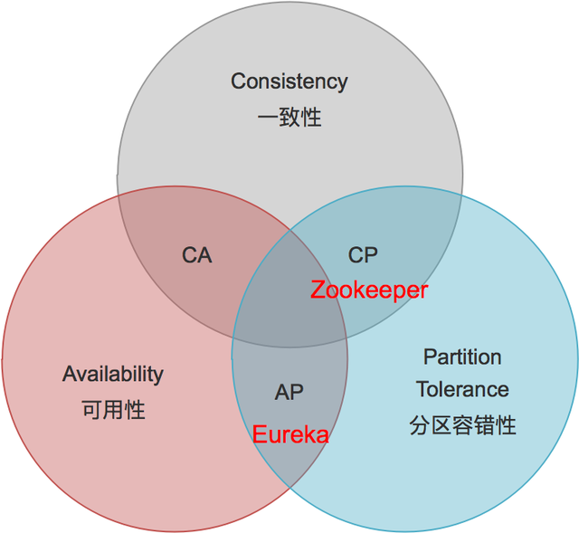

@include(@src/public/enhance/guidance/backend/springcloud/springcloud-eureka/springcloud-eureka-guidance.md)

# 1.微服务简介 {#1.}
@include(@src/public/enhance/guidance/backend/springcloud/springcloud-eureka/chapter/springcloud-eureka-guidance-chapter1.md)
## 1.3.Martin Fowler微服务论文英文原版
```
https://martinfowler.com/articles/microservices.html
```
## 1.4.Martin Fowler微服务论文国内译版
	如需国内译版,请使用谷歌翻译插件翻译自行翻译

## 1.5.微服务架构图
::: center
<div class="imgbg-customer">
</div>

:::

## 1.6.CAP中占据情况
	Eureka在CAP中占据AP
::: center
<div class="imgbg-customer">
</div>

:::

## 1.7.微服务架构落地实现方案
	微服务架构落地实现有很多种方案,本次介绍的方案技术栈如下:
	注册中心: EUREKA 

# 2.搭建项目基础设施 {#2.}
@include(@src/public/enhance/guidance/backend/springcloud/springcloud-eureka/chapter/springcloud-eureka-guidance-chapter2.md)
## 2.3.创建项目父工程
	在idea中创建一个名为springcloud-eureka的maven工程,创建完成后打开该工程,删除src文件夹,编辑pom.xml文件,添加如下内容,pom.xml中配置主要包括两部分内容,第一是对子模块依赖的jar包和使用到的插件的版本的统一规定,第二是规定了四种不同的环境,分别是: 1.开发环境(dev) 2.测试环境(test) 3.生产环境(prod) 4.rancher测试专用环境(rancher),关于这四种环境的详细内容会在本博客的最后一部分进行详细解析说明,pom.xml内容如下:

```xml
<?xml version="1.0" encoding="UTF-8"?>

<project xmlns="http://maven.apache.org/POM/4.0.0" xmlns:xsi="http://www.w3.org/2001/XMLSchema-instance"
         xsi:schemaLocation="http://maven.apache.org/POM/4.0.0 http://maven.apache.org/xsd/maven-4.0.0.xsd">
    <modelVersion>4.0.0</modelVersion>

    <groupId>org.openatom</groupId>
    <artifactId>springcloud-eureka</artifactId>
    <version>1.0-SNAPSHOT</version>
    <packaging>pom</packaging>

    <!--引入所有模块：开始-->
    <modules>
    </modules>
    <!--引入所有模块：结束-->

    <!--统一定义依赖具体版本：开始 -->
    <properties>
        <!--依赖版本-->
        <project.build.sourceEncoding>UTF-8</project.build.sourceEncoding>
        <maven.compiler.source>1.8</maven.compiler.source>
        <maven.compiler.target>1.8</maven.compiler.target>
        <junit.version>4.12</junit.version>
        <log4j.version>1.2.17</log4j.version>
        <lombok.version>1.16.18</lombok.version>
        <mysql.connector.version>8.0.28</mysql.connector.version>
        <spring.boot.version>2.2.2.RELEASE</spring.boot.version>
        <druid.spring.boot.version>1.1.10</druid.spring.boot.version>
        <spring.cloud.version>Hoxton.SR1</spring.cloud.version>
        <mybatis.spring.boot.version>1.3.0</mybatis.spring.boot.version>
        <org.openatom.api.commons.version>1.0-SNAPSHOT</org.openatom.api.commons.version>
        <com.ctrip.framework.apollo.apollo-client.version>2.0.1</com.ctrip.framework.apollo.apollo-client.version>
        <io.seata.version>1.4.2</io.seata.version>
        <spring.cloud.alibaba.version>2.2.0.RELEASE</spring.cloud.alibaba.version>
        <net.logstash.logback.logstash-logback-encoder.version>5.2</net.logstash.logback.logstash-logback-encoder.version>
        <spring.boot.admin.version>2.2.1</spring.boot.admin.version>

        <!--插件版本-->
        <org.springframework.boot.spring-boot-maven-plugin.version>2.2.2.RELEASE</org.springframework.boot.spring-boot-maven-plugin.version>
        <org.apache.maven.plugins.maven-resources-plugin.version>3.2.0</org.apache.maven.plugins.maven-resources-plugin.version>
        <io.fabric8.docker-maven-plugin.version>0.39.1</io.fabric8.docker-maven-plugin.version>
        <org.apache.maven.plugins.maven-antrun-plugin.version>1.8</org.apache.maven.plugins.maven-antrun-plugin.version>
    </properties>
    <!--统一定义依赖具体版本：结束 -->

    <!--统一定义依赖版本：开始-->
    <dependencyManagement>
        <dependencies>
            <!--spring boot 2.2.2-->
            <dependency>
                <groupId>org.springframework.boot</groupId>
                <artifactId>spring-boot-dependencies</artifactId>
                <version>${spring.boot.version}</version>
                <type>pom</type>
                <scope>import</scope>
            </dependency>
            <!--spring cloud Hoxton.SR1-->
            <dependency>
                <groupId>org.springframework.cloud</groupId>
                <artifactId>spring-cloud-dependencies</artifactId>
                <version>${spring.cloud.version}</version>
                <type>pom</type>
                <scope>import</scope>
            </dependency>
            <!--spring cloud alibaba 2.1.0.RELEASE-->
            <dependency>
                <groupId>com.alibaba.cloud</groupId>
                <artifactId>spring-cloud-alibaba-dependencies</artifactId>
                <version>${spring.cloud.alibaba.version}</version>
                <type>pom</type>
                <scope>import</scope>
            </dependency>
            <dependency>
                <groupId>mysql</groupId>
                <artifactId>mysql-connector-java</artifactId>
                <version>${mysql.connector.version}</version>
            </dependency>
            <dependency>
                <groupId>org.mybatis.spring.boot</groupId>
                <artifactId>mybatis-spring-boot-starter</artifactId>
                <version>${mybatis.spring.boot.version}</version>
            </dependency>
            <dependency>
                <groupId>com.alibaba</groupId>
                <artifactId>druid-spring-boot-starter</artifactId>
                <version>${druid.spring.boot.version}</version>
            </dependency>
            <dependency>
                <groupId>junit</groupId>
                <artifactId>junit</artifactId>
                <version>${junit.version}</version>
            </dependency>
            <dependency>
                <groupId>log4j</groupId>
                <artifactId>log4j</artifactId>
                <version>${log4j.version}</version>
            </dependency>
            <dependency>
                <groupId>org.projectlombok</groupId>
                <artifactId>lombok</artifactId>
                <version>${lombok.version}</version>
            </dependency>
            <!--定义公共的工程版本-->
            <dependency>
                <groupId>org.openatom</groupId>
                <artifactId>springcloud-api-commons</artifactId>
                <version>${org.openatom.api.commons.version}</version>
            </dependency>
            <!--Apollo客户端-->
            <dependency>
                <groupId>com.ctrip.framework.apollo</groupId>
                <artifactId>apollo-client</artifactId>
                <version>${com.ctrip.framework.apollo.apollo-client.version}</version>
            </dependency>
            <!--Seata客户端-->
            <dependency>
                <groupId>io.seata</groupId>
                <artifactId>seata-spring-boot-starter</artifactId>
                <version>${io.seata.version}</version>
            </dependency>
            <!--springboot admin server端-->
            <dependency>
                <groupId>de.codecentric</groupId>
                <artifactId>spring-boot-admin-starter-server</artifactId>
                <version>${spring.boot.admin.version}</version>
            </dependency>
            <!--springboot admin client端-->
            <dependency>
                <groupId>de.codecentric</groupId>
                <artifactId>spring-boot-admin-starter-client</artifactId>
                <version>${spring.boot.admin.version}</version>
            </dependency>
            <!--logstah-->
            <dependency>
                <groupId>net.logstash.logback</groupId>
                <artifactId>logstash-logback-encoder</artifactId>
                <version>${net.logstash.logback.logstash-logback-encoder.version}</version>
            </dependency>
        </dependencies>
    </dependencyManagement>
    <!--统一定义依赖版本：结束-->

    <!--定义多种开发环境:开始-->
    <profiles>
		<!--开发环境-->
        <profile>
            <!--不同环境的唯一id-->
            <id>dev</id>
            <properties>
                <!--profile.active对应application.yml中的@profile.active@-->
                <profile.active>dev</profile.active>
                <!--dev环境docker私服连接信息(使用docker官方提供的私服):开始-->
                <docker.registry.uri>192.168.0.4:5000</docker.registry.uri>
                <docker.registry.username>docker</docker.registry.username>
                <docker.registry.password>123456</docker.registry.password>
                <!--dev环境docker私服连接信息(使用docker官方提供的私服):结束-->
                <!--dev环境docker部署地址:端口-->
                <docker.host>tcp://192.168.0.4:2375</docker.host>
            </properties>
        </profile>

        <!--测试环境-->
        <profile>
            <id>test</id>
            <properties>
                <profile.active>test</profile.active>
                <!--test环境docker私服连接信息(vmware提供的私服的harbor私服):开始-->
                <docker.registry.uri>192.168.0.4:5001</docker.registry.uri>
                <docker.registry.username>admin</docker.registry.username>
                <docker.registry.password>123456</docker.registry.password>
                <!--dev环境docker私服连接信息(vmware提供的私服的harbor私服):结束-->
                <!--dev环境docker部署地址:端口-->
                <docker.host>tcp://192.168.0.4:2375</docker.host>
            </properties>
        </profile>

        <!--生产环境-->
        <profile>
            <id>prod</id>
            <properties>
                <profile.active>prod</profile.active>
                <!--prod环境docker私服连接信息(使用docker官方提供的私服):开始-->
                <docker.registry.uri>192.168.0.4:5000</docker.registry.uri>
                <docker.registry.username>docker</docker.registry.username>
                <docker.registry.password>123456</docker.registry.password>
                <!--prod环境docker私服连接信息(使用docker官方提供的私服):结束-->
                <!--prod环境docker部署地址:端口-->
                <docker.host>tcp://192.168.0.4:2375</docker.host>
            </properties>
            <activation>
                <!--默认激活环境-->
                <activeByDefault>true</activeByDefault>
            </activation>
        </profile>

        <!--rancher测试专用环境-->
        <profile>
            <id>rancher</id>
            <properties>
                <profile.active>rancher</profile.active>
                <!--rancher环境docker私服连接信息(vmware提供的私服的harbor私服):开始-->
                <docker.registry.uri>192.168.0.4:5001</docker.registry.uri>
                <docker.registry.username>admin</docker.registry.username>
                <docker.registry.password>123456</docker.registry.password>
                <!--rancher环境docker私服连接信息(vmware提供的私服的harbor私服):结束-->
                <!--rancher环境docker部署地址:端口-->
                <docker.host>tcp://192.168.0.4:2375</docker.host>
            </properties>
        </profile>
    </profiles>
    <!--定义多种开发环境:结束-->

    <!--统一定义插件版本：开始-->
    <build>
        <!--spring-boot-maven-plugin插件-->
        <plugins>
            <plugin>
                <groupId>org.springframework.boot</groupId>
                <artifactId>spring-boot-maven-plugin</artifactId>
                <version>${org.springframework.boot.spring-boot-maven-plugin.version}</version>
            </plugin>
            <!--支持yaml读取pom的参数-->
            <plugin>
                <groupId>org.apache.maven.plugins</groupId>
                <artifactId>maven-resources-plugin</artifactId>
                <version>${org.apache.maven.plugins.maven-resources-plugin.version}</version>
            </plugin>
            <!--执行maven命令时执行删除jar包和复制jar包操作-->
            <plugin>
                <groupId>org.apache.maven.plugins</groupId>
                <artifactId>maven-antrun-plugin</artifactId>
                <version>${org.apache.maven.plugins.maven-antrun-plugin.version}</version>
            </plugin>
            <!--docker maven插件-->
            <plugin>
                <groupId>io.fabric8</groupId>
                <artifactId>docker-maven-plugin</artifactId>
                <version>${io.fabric8.docker-maven-plugin.version}</version>
            </plugin>
        </plugins>
    </build>
    <!--统一定义插件版本：结束-->
</project>
```

## 2.4.创建项目依赖的公共模块
### 2.4.1.模块目录结构
```
@include(./project_springcloud-eureka/springcloud-api-commons/tree.md)
```
### 2.4.2.创建模块
	在父工程(springcloud-eureka)中创建一个名为springcloud-api-commons的maven模块,这个模块中包含了一些公共的Java实体和一些公共的插件,后面的每个模块都要引入这个公共模块,注意:当前模块创建成功后,在父工程pom.xml中<modules></modules>中会自动生成有关当前模块的信息
### 2.4.3.编写模块pom.xml
```xml
@include(./project_springcloud-eureka/springcloud-api-commons/pom.xml)
```
### 2.4.3.编写模块中实体类
    Payment.java
```java
@include(./project_springcloud-eureka/springcloud-api-commons//src/main/java/org/openatom/springcloud/entities/Payment.java)
```

## 2.5.准备项目需要的数据库
### 2.5.1.安装mysql数据库
    详细参考
<a href="https://lingwh1995.github.io/blogs/environment/centos/centos7/shardings/centos7-chapter-3.%E6%90%AD%E5%BB%BA%E5%9F%BA%E7%A1%80%E5%BC%80%E5%8F%91%E7%8E%AF%E5%A2%83.html#_3-5-%E5%AE%89%E8%A3%85mysql">安装mysql</a>
<a href="/blogs/environment/centos/centos7/shardings/centos7-chapter-3.%E6%90%AD%E5%BB%BA%E5%9F%BA%E7%A1%80%E5%BC%80%E5%8F%91%E7%8E%AF%E5%A2%83.html#_3-5-%E5%AE%89%E8%A3%85mysql">安装mysql1</a>

### 2.5.2.创建项目需要的数据库
    导入数据库脚本
```sql
@include(./project_springcloud-eureka/script/payment.sql)
```

# 3.使用Eureka作为注册中心 {#3.}
@include(@src/public/enhance/guidance/backend/springcloud/springcloud-eureka/chapter/springcloud-eureka-guidance-chapter3.md)
## 3.3.Eureka注册中心简介
	Eureka是Netflix公司开发的服务发现框架,Spring Cloud对它提供了支持,将它集成在了自己spring-cloud-netflix子项目中,用来实现Spring Cloud的服务发现功能,核心功能是为实现服务发现提供了基础支持。本次我们将搭建一个单节点版的Eureka注册中心和一个集群(高可用)版的Eureka注册中心,用来实现服务发现功能。

	官方网站(GITHUB)
```
https://github.com/Netflix/eureka
```

	官方网站(SPRING.IO)
```
https://spring.io/projects/spring-cloud-netflix
```

	EUREKA架构图
::: center
<div class="imgbg-customer">
</div>

:::

	Eureka的基础组件
	服务提供者(Service Provide): 服务提供方将自身服务注册到Eureka,从而使服务消费方能够找到
	服务消费者(Service Consumer): 服务消费方从Eureka获取注册服务列表,从而能够消费服务
	服务中介(Eureka Server): 是服务提供者和服务消费者之间的桥梁，服务提供者可以把自己注册到服务中介那里，而服务消费者如需要消费一些服务(使用一些功能)就可以在服务中介中寻找注册在服务中介的服务提供者。

	Eureka的提供了哪些功能?
	服务注册(Service Register)
	当Eureka客户端向Eureka Server注册时,它提供自身的元数据,比如IP地址、端口,运行状况指示符URL等
	服务续约(Service Renew)
	Eureka客户会每隔30秒(默认情况下)发送一次心跳来续约。通过续约来告知 Eureka Server该Eureka客户仍然存在,没有出现问题。正常情况下,如果 Eureka Server在90秒没有收到Eureka客户的续约,它会将实例从其注册表中删除
	获取注册列表信息(Service Fetch Registries)
	Eureka 客户端从服务器获取注册表信息,并将其缓存在本地。客户端会使用该信息查找其他服务,从而进行远程调用。该注册列表信息定期(每30 秒钟)更新一次。每次返回注册列表信息可能与Eureka客户端的缓存信息不同,Eureka客户端自动处理。如果由于某种原因导致注册列表信息不能及时匹配,Eureka 客户端则会重新获取整个注册表信息。Eureka 服务器缓存注册列表信息,整个注册表以及每个应用程序的信息进行了压缩,压缩内容和没有压缩的内容完全相同。Eureka客户端和Eureka服务器可以使用JSON/XML格式进行通讯。在默认的情况下 Eureka客户端使用压缩JSON 格式来获取注册列表的信息。
	服务下线(Service Cancel)
	Eureka 客户端在程序关闭时向 Eureka 服务器发送取消请求。发送请求后,该客户端实例信息将从服务器的实例注册表中删除。该下线请求不会自动完成,它需要调用以下内容:DiscoveryManager.getInstance().shutdownComponent();
	服务剔除(Service Eviction)
	在默认的情况下,当Eureka客户端连续90秒(3个续约周期)没有向Eureka服务器发送服务续约,即心跳,Eureka 服务器会将该服务实例从服务注册列表删除,即服务剔除。

## 3.4.单节点版EUREKA注册中心搭建
### 3.4.1.章节内容简介
    本章节会展示如何搭建一个单节点版的Eureka注册中心
### 3.4.2.模块简介
    单机版Eureka注册中心,启动端口: 7001
### 3.4.3.模块目录结构
```
@include(./project_springcloud-eureka/springcloud-register-center-single-node7001/tree.md)
```
### 3.4.4.创建模块
	在父工程(springcloud-eureka)中创建一个名为springcloud-register-center-single-node7001的maven模块,注意:当前模块创建成功后,在父工程pom.xml中<modules></modules>中会自动生成有关当前模块的信息
### 3.4.5.编写模块pom.xml
```xml
@include(./project_springcloud-eureka/springcloud-register-center-single-node7001/pom.xml)
```
### 3.4.6.编写模块application.yml
```yml
@include(./project_springcloud-eureka/springcloud-register-center-single-node7001/src/main/resources/application.yml)
```
### 3.4.7.编写模块主启动类
```java
@include(./project_springcloud-eureka/springcloud-register-center-single-node7001/src/main/java/org/openatom/springcloud/RegisterCcenterSingleNode7001.java)
```
### 3.4.8.测试模块
    编写完成后,等maven依赖导入成功,运行主启动类,在浏览器中访问
```
http://localhost:7001/
```
    看到如下界面代表搭建成功
::: center
<div class="imgbg-customer">
</div>

:::

## 3.5.集群(高可用)版EUREKA注册中心搭建
### 3.5.1.章节内容简介
    本章节会展示如何搭建一个集群(高可用)版的Eureka注册中心,共有三个节点,Eureka注册中心集群的原理是多个Eureka Server之间相互注册,从而组成一个集群。
### 3.5.2.搭建Eureka集群中第一个节点
    模块简介
    集群(高可用)版Eureka注册中心中第一个节点,启动端口: 7002
    
    模块目录结构
```
@include(./project_springcloud-eureka/springcloud-register-center-cluster-node7002/tree.md)
```
    
    创建模块
	在父工程(springcloud-eureka)中创建一个名为springcloud-register-center-cluster-node7002的maven模块,注意:当前模块创建成功后,在父工程pom.xml中<modules></modules>中会自动生成有关当前模块的信息

    编写模块pom.xml
```xml
@include(./project_springcloud-eureka/springcloud-register-center-cluster-node7002/pom.xml)
```

    编写模块application.yml
```yml
@include(./project_springcloud-eureka/springcloud-register-center-cluster-node7002/src/main/resources/application.yml)
```

    编写模块主启动类
```java
@include(./project_springcloud-eureka/springcloud-register-center-cluster-node7002/src/main/java/org/openatom/springcloud/RegisterCcenterClusterNode7002.java)
```

### 3.5.3.搭建Eureka集群中第二个节点
    模块简介
    集群(高可用)版Eureka注册中心中第二个节点,启动端口: 7003

    模块目录结构
```
@include(./project_springcloud-eureka/springcloud-register-center-cluster-node7003/tree.md)
```

    创建模块
	在父工程(springcloud-eureka)中创建一个名为springcloud-register-center-cluster-node7003的maven模块,注意:当前模块创建成功后,在父工程pom.xml中<modules></modules>中会自动生成有关当前模块的信息

    编写模块pom.xml
```xml
@include(./project_springcloud-eureka/springcloud-register-center-cluster-node7003/pom.xml)
```
    
    编写模块application.yml
```yml
@include(./project_springcloud-eureka/springcloud-register-center-cluster-node7003/src/main/resources/application.yml)
```

    编写模块主启动类
```java
@include(./project_springcloud-eureka/springcloud-register-center-cluster-node7003/src/main/java/org/openatom/springcloud/RegisterCcenterClusterNode7003.java)
```

### 3.5.4.搭建Eureka集群中第三个节点
    模块简介
    集群(高可用)版Eureka注册中心中第三个节点,启动端口: 7004

    模块目录结构
```
@include(./project_springcloud-eureka/springcloud-register-center-cluster-node7004/tree.md)
```

    创建模块
	在父工程(springcloud-eureka)中创建一个名为springcloud-register-center-cluster-node7004的maven模块,注意:当前模块创建成功后,在父工程pom.xml中<modules></modules>中会自动生成有关当前模块的信息

    编写模块pom.xml
```xml
@include(./project_springcloud-eureka/springcloud-register-center-cluster-node7004/pom.xml)
```

    编写模块application.yml
```yml
@include(./project_springcloud-eureka/springcloud-register-center-cluster-node7004/src/main/resources/application.yml)
```

    编写模块主启动类
```java
@include(./project_springcloud-eureka/springcloud-register-center-cluster-node7004/src/main/java/org/openatom/springcloud/RegisterCcenterClusterNode7004.java)
```

### 3.5.5.配置host
    修改host文件,C:\Windows\System32\drivers\etc\host
    添加如下内容:
    127.0.0.1		eureka7002
    127.0.0.1		eureka7003
    127.0.0.1		eureka7004
    
### 3.5.6.测试集群模块
    测试集群中的第一个节点(7002),浏览器访问
```
http://eureka7002:7002/
```

::: center
<div class="imgbg-customer">
</div>

:::

    测试集群中的第二个节点(7003),浏览器访问
```
http://eureka7003:7003/
```
::: center
<div class="imgbg-customer">
</div>

:::

    测试集群中的第三个节点(7004),浏览器访问
```
http://eureka7004:7004/
```
::: center
<div class="imgbg-customer">
</div>

:::

    可以看到,在每个节点和都和其他两个节点相互注册,这代表集群搭建成功

# 4.搭建第一个微服务应用 {#4.}
@include(@src/public/enhance/guidance/backend/springcloud/springcloud-eureka/chapter/springcloud-eureka-guidance-chapter4.md)
## 4.3.第一个微服务应用简介
    第一个微服务应用由四部分组成,分别是注册中心(单节点)、服务消费者(单节点)、服务提供者(两个节点)、运行所需要的数据库环境,这里的注册中心使用单节点版注册中心,如果需要使用集群版注册中心,只需要在application.yml将defaultZone的配置切换为集群版配置即可,服务提供者第一个节点和第二个节点是除了端口和模块名称之外其他所有代码均是相同的,之所以要创建两个相同的模块是为了模拟生产环境中一个服务部署在多个节点的情况,这里为了查看日志方便,直接创建了两个相同的服务提供者模块。
## 4.4.搭建服务提供者第一个节点
### 4.4.1.模块简介
    服务提供者第一个节点,启动端口: 8001
### 4.4.2.模块目录结构
```
@include(./project_springcloud-eureka/springcloud-provider-cluster-node-payment8001/tree.md)
```
### 4.4.3.创建模块
	在父工程(springcloud-eureka)中创建一个名为springcloud-provider-cluster-node-payment8001的maven模块,注意:当前模块创建成功后,在父工程pom.xml中<modules></modules>中会自动生成有关当前模块的信息
### 4.4.4.编写模块pom.xml
```xml
@include(./project_springcloud-eureka/springcloud-provider-cluster-node-payment8001/pom.xml)
```
### 4.4.5.编写模块application.yml
```yml
@include(./project_springcloud-eureka/springcloud-provider-cluster-node-payment8001/src/main/resources/application.yml)
```
### 4.4.6.编写模块Mybatis配置文件
```xml
@include(./project_springcloud-eureka/springcloud-provider-cluster-node-payment8001/src/main/resources/mapper/PaymentMapper.xml)
```
### 4.4.7.编写模块dao
```java
@include(./project_springcloud-eureka/springcloud-provider-cluster-node-payment8001/src/main/java//org/openatom/springcloud/dao/PaymentDao.java)
```
### 4.4.8.编写模块service
```java
@include(./project_springcloud-eureka/springcloud-provider-cluster-node-payment8001/src/main/java//org/openatom/springcloud/service/PaymentService.java)
```
### 4.4.9.编写模块service实现类
```java
@include(./project_springcloud-eureka/springcloud-provider-cluster-node-payment8001/src/main/java//org/openatom/springcloud/service/impl/PaymentServiceImpl.java)
```
### 4.4.10.编写模块controller
```java
@include(./project_springcloud-eureka/springcloud-provider-cluster-node-payment8001/src/main/java//org/openatom/springcloud/controller/PaymentController.java)
```
### 4.4.11.编写模块主启动类
```java
@include(./project_springcloud-eureka/springcloud-provider-cluster-node-payment8001/src/main/java//org/openatom/springcloud/PaymentServiceProviderClusterNode8001.java)
```

## 4.5.搭建服务提供者第二个节点
### 4.5.1.模块简介
    服务提供者第二个节点,启动端口: 8002
### 4.5.2.模块目录结构
```
@include(./project_springcloud-eureka/springcloud-provider-cluster-node-payment8002/tree.md)
```
### 4.5.3.创建模块
	在父工程(springcloud-eureka)中创建一个名为springcloud-provider-cluster-node-payment8002的maven模块,注意:当前模块创建成功后,在父工程pom.xml中<modules></modules>中会自动生成有关当前模块的信息
### 4.5.4.编写模块pom.xml
```xml
@include(./project_springcloud-eureka/springcloud-provider-cluster-node-payment8002/pom.xml)
```
### 4.5.5.编写模块application.yml
```yml
@include(./project_springcloud-eureka/springcloud-provider-cluster-node-payment8002/src/main/resources/application.yml)
```
### 4.5.6.编写模块Mybatis配置文件
```xml
@include(./project_springcloud-eureka/springcloud-provider-cluster-node-payment8002/src/main/resources/mapper/PaymentMapper.xml)
```
### 4.5.7.编写模块dao
```java
@include(./project_springcloud-eureka/springcloud-provider-cluster-node-payment8002/src/main/java//org/openatom/springcloud/dao/PaymentDao.java)
```
### 4.5.8.编写模块service
```java
@include(./project_springcloud-eureka/springcloud-provider-cluster-node-payment8002/src/main/java//org/openatom/springcloud/service/PaymentService.java)
```
### 4.5.9.编写模块service实现类
```java
@include(./project_springcloud-eureka/springcloud-provider-cluster-node-payment8002/src/main/java//org/openatom/springcloud/service/impl/PaymentServiceImpl.java)
```
### 4.5.10.编写模块controller
```java
@include(./project_springcloud-eureka/springcloud-provider-cluster-node-payment8002/src/main/java//org/openatom/springcloud/controller/PaymentController.java)
```
### 4.5.11.编写模块主启动类
```java
@include(./project_springcloud-eureka/springcloud-provider-cluster-node-payment8002/src/main/java//org/openatom/springcloud/PaymentServiceProviderClusterNode8002.java)
```

## 4.6.搭建服务消费者
### 4.6.1.模块简介
    服务消费者,启动端口: 80
### 4.6.2.模块目录结构
### 4.6.3.创建模块
	在父工程(springcloud-eureka)中创建一个名为springcloud-consumer-loadbalance-default-order80的maven模块,注意:当前模块创建成功后,在父工程pom.xml中<modules></modules>中会自动生成有关当前模块的信息
### 4.6.4.编写模块pom.xml
```xml
@include(./project_springcloud-eureka/springcloud-consumer-loadbalance-default-order80/pom.xml)
```
### 4.6.5.编写模块application.yml
```yml
@include(./project_springcloud-eureka/springcloud-consumer-loadbalance-default-order80/src/main/resources/application.yml)
```
### 4.6.6.编写模块config
```java
@include(./project_springcloud-eureka/springcloud-consumer-loadbalance-default-order80/src/main/java/org/openatom/springcloud/config/ApplicationContextConfig.java)
```
### 4.6.7.编写模块controller
```java
@include(./project_springcloud-eureka/springcloud-consumer-loadbalance-default-order80/src/main/java/org/openatom/springcloud/controller/OrderConsumerController.java)
```
### 4.6.8.编写模块主启动类
```java
@include(./project_springcloud-eureka/springcloud-consumer-loadbalance-default-order80/src/main/java/org/openatom/springcloud/OrderServiceConsumerLoadBalanceDefault80.java)
```
