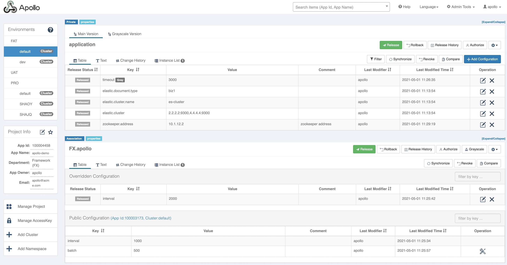

# Introduction

Apollo is a reliable configuration management system. It can centrally manage the configurations of different applications and different clusters. It is suitable for microservice configuration management scenarios.

The server side is developed based on Spring Boot and Spring Cloud, which can simply run without the need to install additional application containers such as Tomcat.

The Java SDK does not rely on any framework and can run in all Java runtime environments. It also has good support for Spring/Spring Boot environments.

The .Net SDK does not rely on any framework and can run in all .Net runtime environments.

For more details of the product introduction, please refer [Introduction to Apollo Configuration Center](en/design/apollo-introduction).

For local demo purpose, please refer [Quick Start](en/deployment/quick-start).

Demo Environment:
- [http://106.54.227.205](http://106.54.227.205/)
- User/Password: apollo/admin

# Screenshots

# Features
* **Unified management of the configurations of different environments and different clusters**
    * Apollo provides a unified interface to centrally manage the configurations of different environments, different clusters, and different namespaces
    * The same codebase could have different configurations when deployed in different clusters
    * With the namespace concept, it is easy to support multiple applications to share the same configurations, while also allowing them to customize the configurations
    * Multiple languages is provided in user interface(currently Chinese and English)

* **Configuration changes takes effect in real time (hot release)**
    * After the user modified the configuration and released it in Apollo, the sdk will receive the latest configurations in real time (1 second) and notify the application

* **Release version management**
    * Every configuration releases are versioned, which is friendly to support configuration rollback

* **Grayscale release**
    * Support grayscale configuration release, for example, after clicking release, it will only take effect for some application instances. After a period of observation, we could push the configurations to all application instances if there is no problem

* **Authorization management, release approval and operation audit**
    * Great authorization mechanism is designed for applications and configurations management, and the management of configurations is divided into two operations: editing and publishing, therefore greatly reducing human errors
    * All operations have audit logs for easy tracking of problems

* **Client side configuration information monitoring**
    * It's very easy to see which instances are using the configurations and what versions they are using

* **Rich SDKs available**
    * Provides native sdks of Java and .Net to facilitate application integration
    * Support Spring Placeholder, Annotation and Spring Boot ConfigurationProperties for easy application use (requires Spring 3.1.1+)
    * Http APIs are provided, so non-Java and .Net applications can integrate conveniently
    * Rich third party sdks are also available, e.g. Golang, Python, NodeJS, PHP, C, etc

* **Open platform API**
    * Apollo itself provides a unified configuration management interface, which supports features such as multi-environment, multi-data center configuration management, permissions, and process governance
    * However, for the sake of versatility, Apollo will not put too many restrictions on the modification of the configuration, as long as it conforms to the basic format, it can be saved.
    * In our research, we found that for some users, their configurations may have more complicated formats, such as xml, json, and the format needs to be verified
    * There are also some users such as DAL, which not only have a specific format, but also need to verify the entered value before saving, such as checking whether the database, username and password match
    * For this type of application, Apollo allows the application to modify and release configurations through open APIs, which has great authorization and permission control mechanism built in

* **Simple deployment**
    * As an infrastructure service, the configuration center has very high availability requirements, which forces Apollo to rely on external dependencies as little as possible
    * Currently, the only external dependency is MySQL, so the deployment is very simple. Apollo can run as long as Java and MySQL are installed
    * Apollo also provides a packaging script, which can generate all required installation packages with just one click, and supports customization of runtime parameters

# Usage
1. [Apollo User Guide](en/usage/apollo-user-guide)
2. [Java SDK User Guide](en/usage/java-sdk-user-guide)
3. [.Net SDK user Guide](en/usage/dotnet-sdk-user-guide)
4. [Third Party SDK User Guide](en/usage/third-party-sdks-user-guide)
5. [Other Language Client User Guide](en/usage/other-language-client-user-guide)
6. [Apollo Open APIs](en/usage/apollo-open-api-platform)
7. [Apollo Use Cases](https://github.com/ctripcorp/apollo-use-cases)
8. [Apollo User Practices](en/usage/apollo-user-practices)
9. [Apollo Security Best Practices](en/usage/apollo-user-guide?id=_71-security-related)

# Design
* [Apollo Design](en/design/apollo-design)
* [Apollo Core Concept - Namespace](en/design/apollo-core-concept-namespace)
* [Apollo Architecture Analysis](https://mp.weixin.qq.com/s/-hUaQPzfsl9Lm3IqQW3VDQ)
* [Apollo Source Code Explanation](http://www.iocoder.cn/categories/Apollo/)

# Development
* [Apollo Development Guide](en/development/apollo-development-guide)
* Code Styles
    * [Eclipse Code Style](https://github.com/apolloconfig/apollo/blob/master/apollo-buildtools/style/eclipse-java-google-style.xml)
    * [Intellij Code Style](https://github.com/apolloconfig/apollo/blob/master/apollo-buildtools/style/intellij-java-google-style.xml)

# Deployment
* [Quick Start](en/deployment/quick-start)
* [Distributed Deployment Guide](en/deployment/distributed-deployment-guide)

# Release Notes
* [Releases](https://github.com/apolloconfig/apollo/releases)

# FAQ
* [FAQ](en/faq/faq)
* [Common Issues in Deployment & Development Phase](en/faq/common-issues-in-deployment-and-development-phase)

# Presentation
* [Design and Implementation Details of Apollo](http://www.itdks.com/dakalive/detail/3420)
  * [Slides](https://github.com/apolloconfig/apollo-community/blob/master/slides/design-and-implementation-of-apollo.pdf)
* [Configuration Center Makes Microservices Smart](https://2018.qconshanghai.com/presentation/799)
  * [Slides](https://github.com/apolloconfig/apollo-community/blob/master/slides/configuration-center-makes-microservices-smart.pdf)

# Publication
* [Design and Implementation Details of Apollo](https://www.infoq.cn/article/open-source-configuration-center-apollo)
* [Configuration Center Makes Microservices Smart](https://mp.weixin.qq.com/s/iDmYJre_ULEIxuliu1EbIQ)

# Community
  * [Apollo Team](en/community/team)
  * [Community Governance](https://github.com/apolloconfig/apollo/blob/master/GOVERNANCE.md)
  * [Contributing Guide](https://github.com/apolloconfig/apollo/blob/master/CONTRIBUTING.md)

# License
The project is licensed under the [Apache 2 license](https://github.com/apolloconfig/apollo/blob/master/LICENSE).
