# &nbsp;


# I. Introduction

According to different scenarios, apolloconfig deployment architecture will have a variety of, here do not discuss the details, only from the macro perspective of the deployment architecture, to introduce the various deployment options

## 1.1 Flowchart

Use flowchart to express the deployment method, here first introduce some basic concepts

### 1.1.1 Dependencies

Dependencies are expressed with

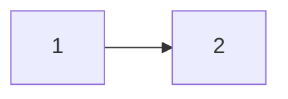

Indicates that 1 depends on 2, i.e. 2 must exist for 1 to work properly, e.g.

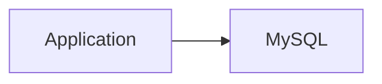

Means that the application needs to use MySQL to work properly

Dependencies can be complex, as well as having multiple layers of dependencies, for example

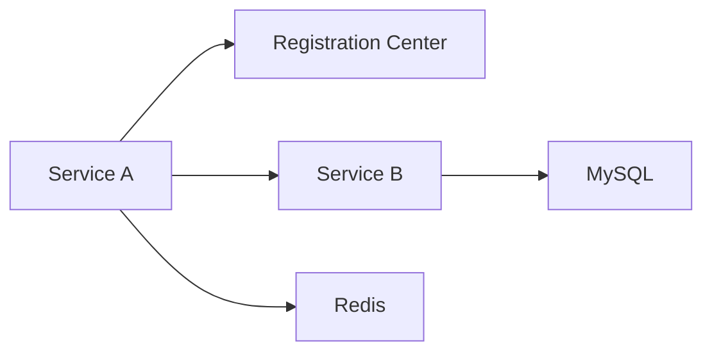

Service A needs registry, Service B, Redis

And Service B needs MySQL

### 1.1.2 Inclusion Relationships

The containment relationship is specified with

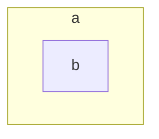

Indicates that a contains b, i.e. b is part of a. The containment relationship may be nested, e.g.

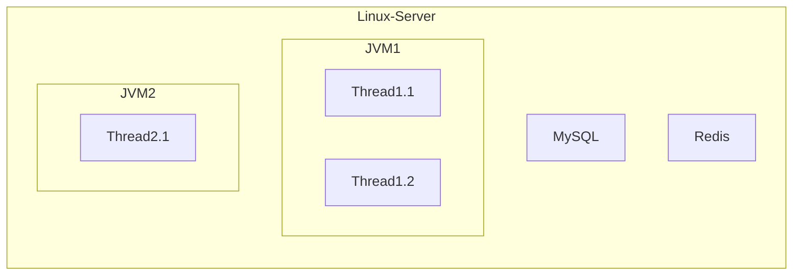

Means that on a Linux server, there are MySQL, Redis and 2 JVMs running, and there are Threads in each JVM

# II. Standalone

The scenario of standalone deployment is usually for novice learners, or for testing environments with low performance requirements within the company, not for production environments

## 2.1 Standalone, Single Environment All In One

This is the simplest and most convenient way to deploy standalone

Requires:

* 1 linux server: with JRE
* 2 databases: 1 `PortalDB` and `ConfigDB`

As shown below, all modules are deployed on the same Linux machine, with a total of 3 JVM processes

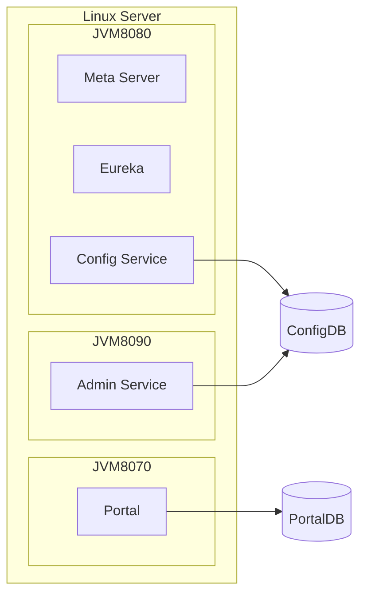

JVM8080: the network port exposed to the public is 8080, there are Meta Server, Eureka, Config Service inside, and Config Service uses ConfigDB

JVM8090: the network port exposed to the public is 8090, there is Admin Service inside, and Admin Service uses ConfigDB

JVM8070: the network port exposed to the public is 8070, there is Portal inside, and Portal uses PortalDB

If you add the dependency between modules, flowchart will become

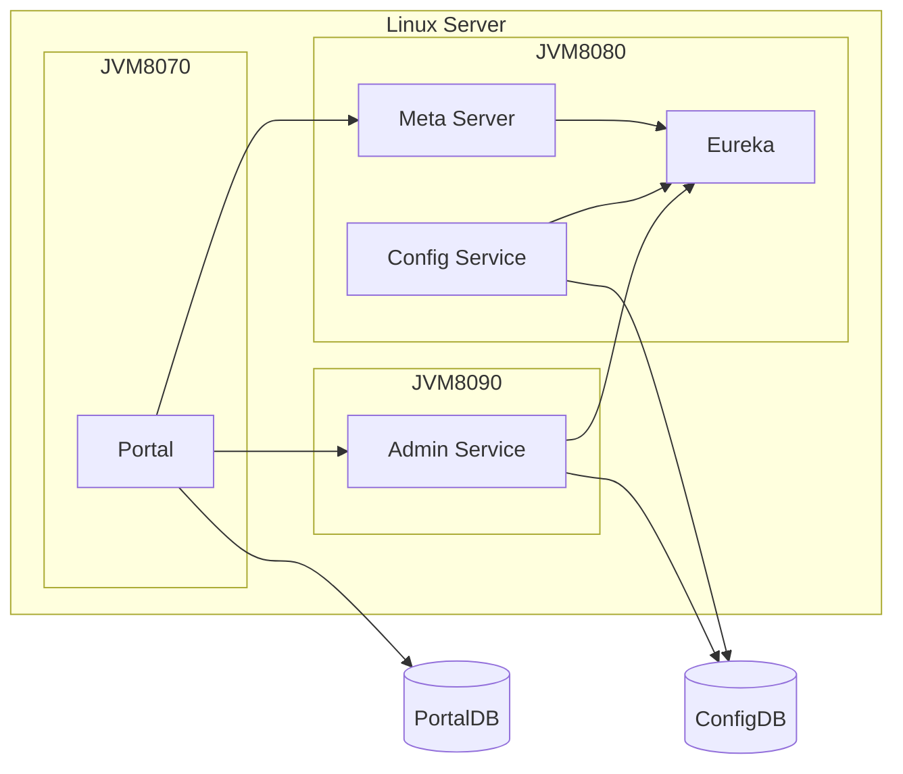

Config Service and Admin Service will register themselves to Eureka

Portal discovers Admin Service through Meta Server service

To make flowchart look more concise, you can just represent the dependencies between processes

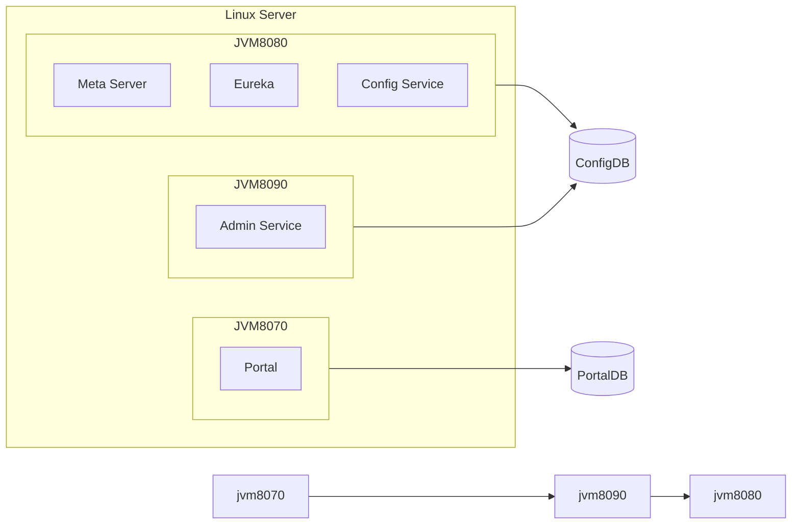

Process JVM8070 depends on process JVM8090 and PortalDB

Process JVM8090 depends on process JVM8080 and ConfigDB

Process JVM8080 depends on process JVM8080 and ConfigDB

## 2.2 Standalone, single environment Separate deployment

### 2.2.1 Stand-alone, single-environment deployment Separate deployment 3 Linux servers

The 3 JVM processes can also be spread across 3 Linux machines

Required.

* 3 linux servers: 3 processes to be deployed separately
* 2 databases

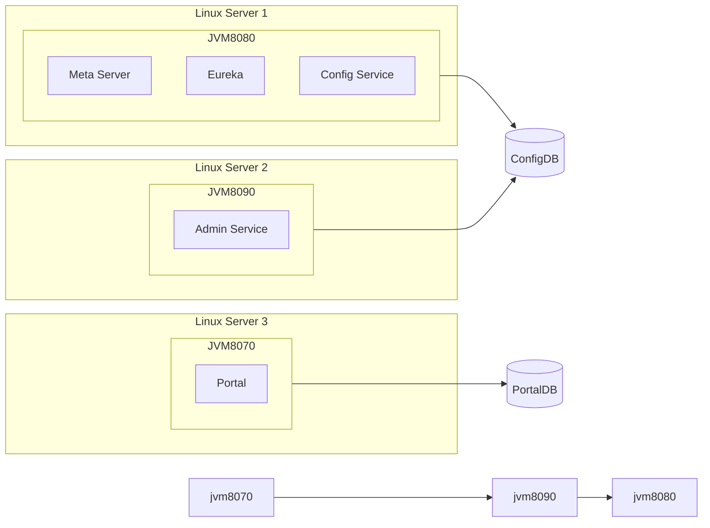

### 2.2.2 Single machine, single environment Separate deployment 2 Linux servers

But usually we deploy Config Service and Admin Service on a single Linux server

Required:

* 2 linux servers: 1 to deploy Portal, the other to deploy Config Service and Admin Service
* 2 databases

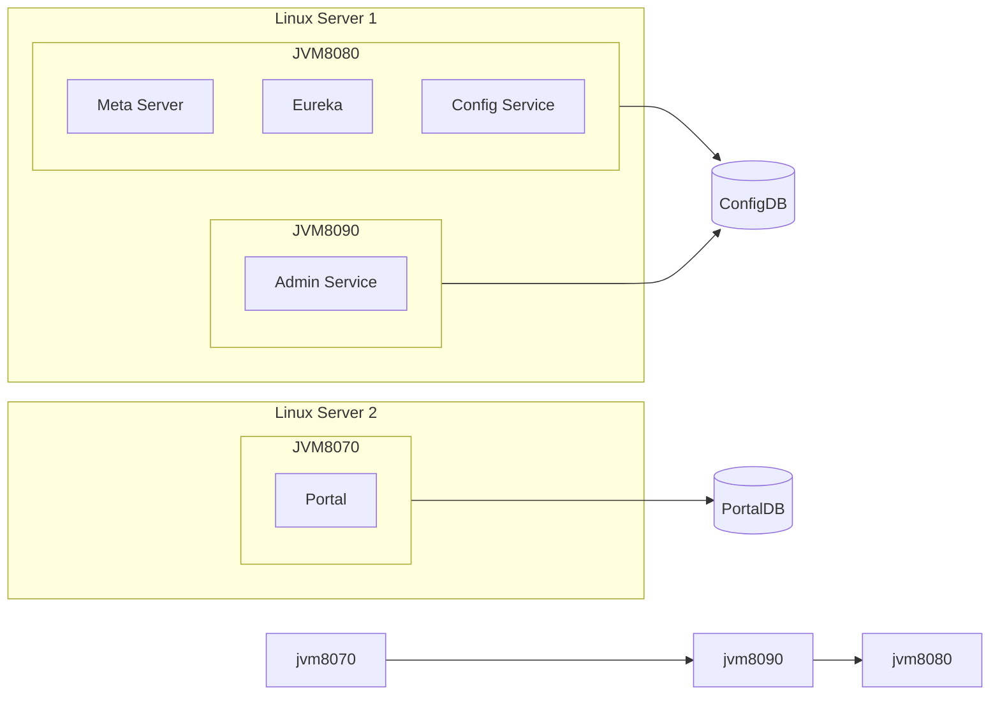

Later, in order to flowchart more concise, the content in JVM8080 will be simplified, only the Config Service will be displayed, and the Meta Server and Config Service inside will no longer be displayed

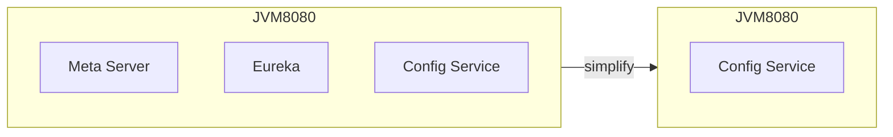

So the deployment architecture can be simplified and represented as

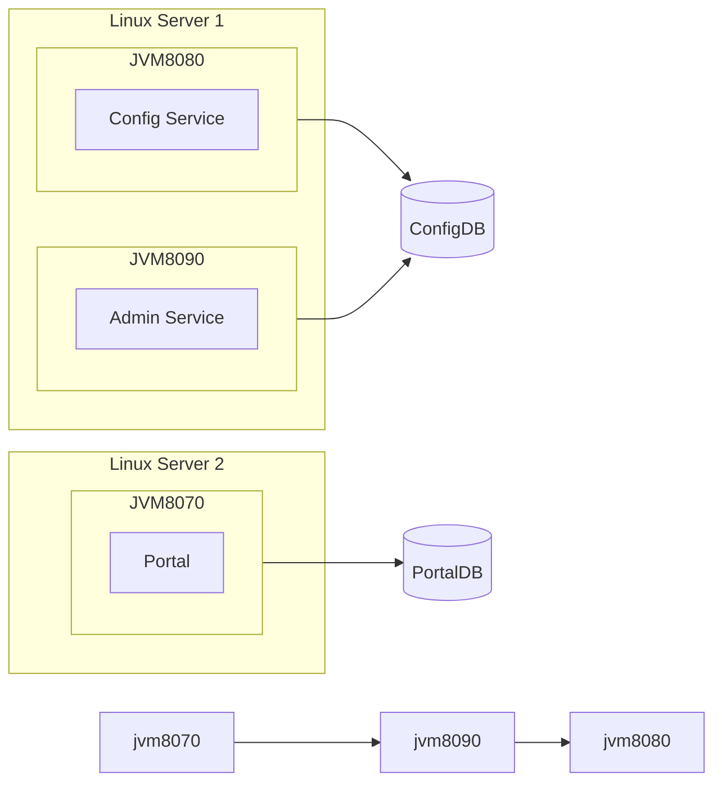


## 2.3 Single machine, dual environment

A single environment basically can not meet the actual application scenario, for example, the company has SIT test environment and UAT test environment, then you need to deploy two environments to provide configuration services

It is easy to think of the deployment architecture as follows, repeat the single machine, single environment deployment architecture 2 times

Required:

* 2 linux servers
* 4 databases

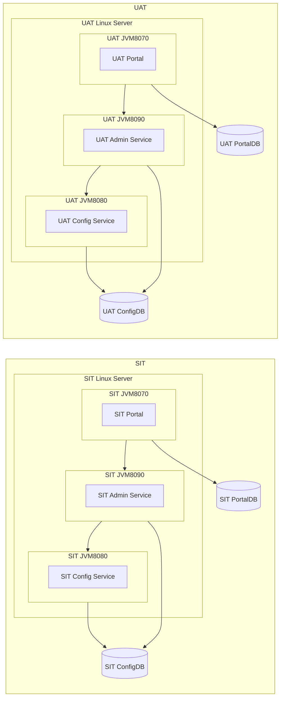

But this solution, there will be 2 Portal interface, can not be 1 interface to manage 2 environments, the use of experience is not very good, Portal can actually be deployed only 1 set, the recommended deployment architecture is as follows

* 3 linux servers:
    * Portal Linux Server to deploy Portal alone
    * SIT Linux Server to deploy SIT's Config Service and Admin Service
    * UAT Linux Server deploys the Config Service and Admin Service of UAT
* 3 databases: 1 PortalDB + 1 SIT's ConfigDB + 1 UAT's ConfigDB

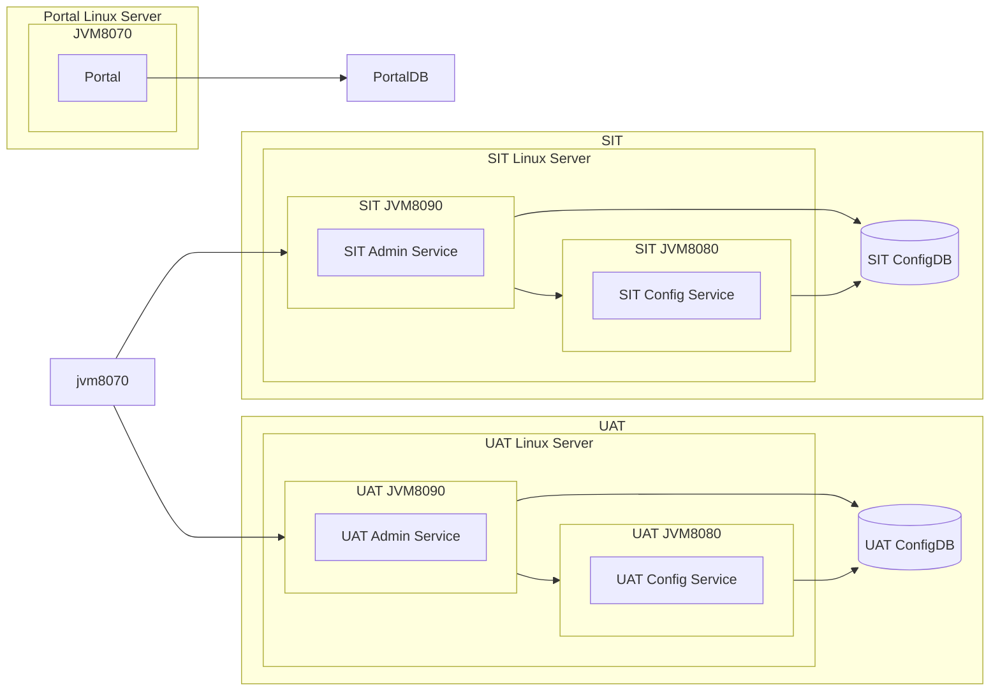

## 2.4 Standalone, three environments

Assuming that the usage scenario of 3 environments, SIT, UAT and PP, now needs to be satisfied.

On top of the previous dual environments, add 1 more PP environment Linux service and ConfigDB can be added, Portal to manage these 3 environments by modifying the configuration

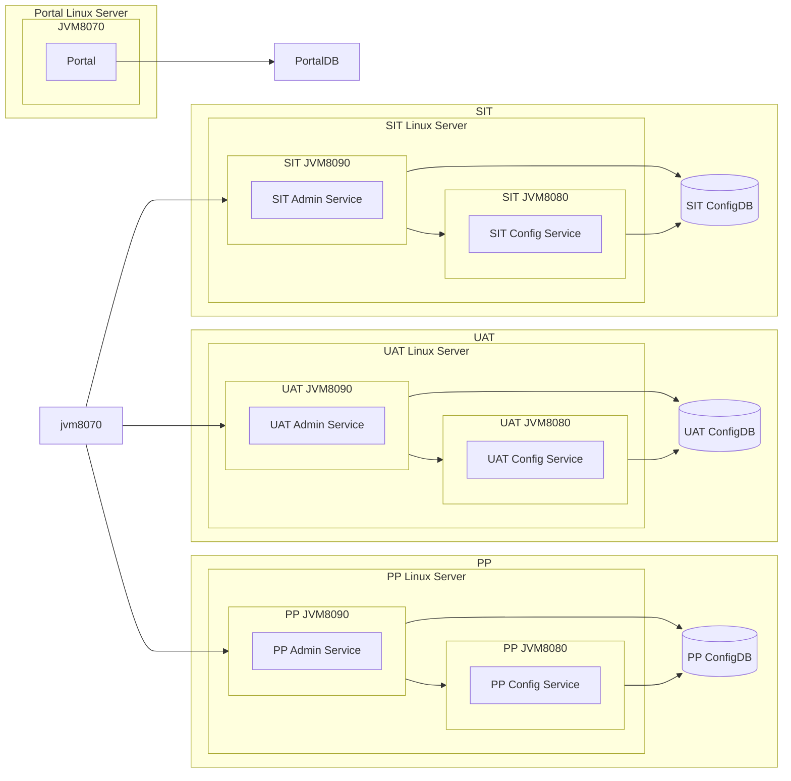

## 2.5 Single machine, multiple environments

The principle is the same as above, 1 Linux server per environment + 1 ConfigDB

Then Portal can add the information of the new environment

# III. High Availability

1 environment only 1 Config Service process, can not meet the high availability, in order to avoid a single point of downtime affect the availability of the system, the need for multi-instance deployment, that is, the deployment of multiple Java processes on different Linux servers

## 3.1 Minimal High Availability, Single Environment

Returning to the common non-high-availability deployment approach, the

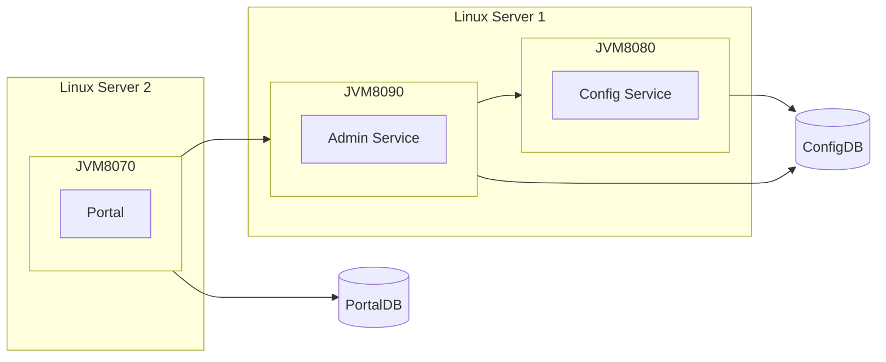

When Linux Server 1 is down, the client can only read the config-cache on the local disk. If you need to prevent a single Linux from going down and making the Config Service unavailable, you can try adding another Linux machine.

Required:

* 3 linux servers: 1 to deploy Portal, and 2 to deploy Config Service and Admin Service respectively
* 2 databases


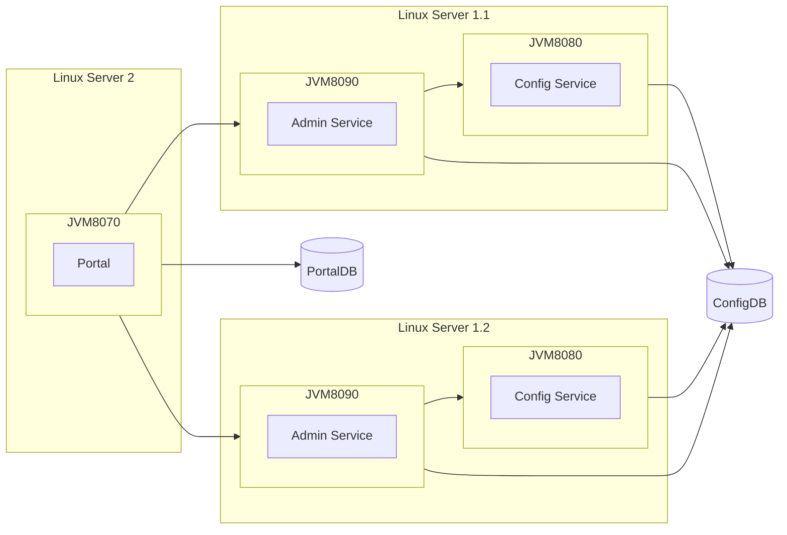


With this deployment, if Linux Server 1.1 or Linux Server 1.2 is down, the system is still available.

## 3.2 Highly available, single environment

On the basis of the above, if the number of clients is large (e.g. tens of thousands of Java processes), you can horizontally extend the Config Service by introducing Linux Server 1.3, Linux Server 1.4, ...

Admin Service can be much less than Config Service in terms of number due to only Portal access.

Please refer to [Apollo Performance Test Report](en/misc/apollo-benchmark.md) for details on how to evaluate the number of Config Service.

## 3.3 High Availability, Dual Environment

As in [2.3 Single machine, dual environment](#_23-single-machine-dual-environment), if you want to make both SIT and UAT highly available, you only need to add more machines to each environment, as shown below, each environment has 2 Linux Servers, if you have performance requirements, you can use more machines in each environment to deploy Config Service that can be

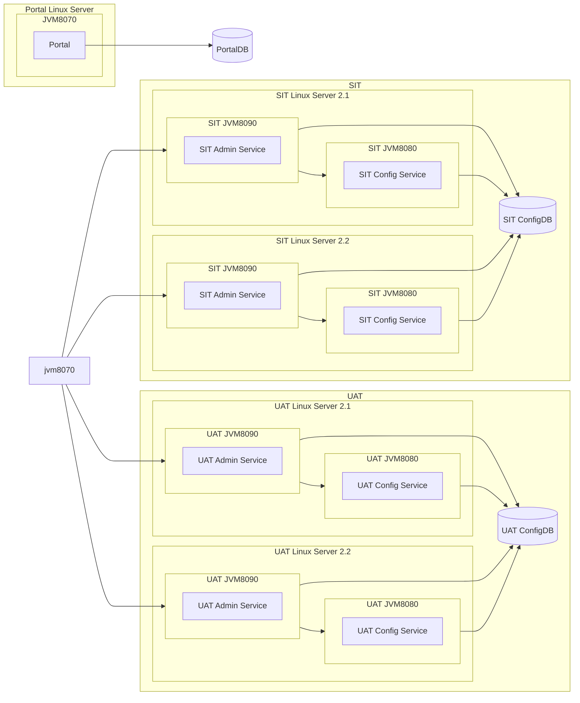

## 3.4 High Availability, Multiple Environments

On top of the above, to add an environment such as BETA environment, you need to add 2 and more Linux servers + 1 ConfigDB

Portal adds the information of the new environment, pointing to apollo.meta of BETA environment

## 3.5 High Availability, Single Environment, Single Server Room

In the actual production environment, many companies isolate their test environment, so the production environment is a single environment, with only one PRO environment

When there is only 1 server room, refer to [3.2 Highly available, single environment](#_32-highly-available-single-environment)

## 3.6 Highly available, single environment, dual server rooms

If there are 2 server rooms, usually there is network isolation between the server rooms. If it is a co-located server room, idc1 and idc2, you can use the following deployment method

```mermaid
flowchart LR
	idc1-p[idc1 Portal]
	idc2-p[idc2 Portal]
	portaldb[(PortalDB)]
	idc1-p --> portaldb
	idc2-p --> portaldb

	configdb[(ConfigDB)]

	idc1-c1-jvm-8080 --> configdb
	idc1-c1-jvm-8090 --> configdb
	idc1-c2-jvm-8080 --> configdb
	idc1-c2-jvm-8090 --> configdb

	idc2-c1-jvm-8080 --> configdb
	idc2-c1-jvm-8090 --> configdb
	idc2-c2-jvm-8080 --> configdb
	idc2-c2-jvm-8090 --> configdb

	subgraph idc1
		subgraph idc1 Portal Linux Server
			subgraph idc1-JVM8070
				idc1-p
			end
		end
	
		idc1-c1[idc1 Config Service]
		idc1-a1[idc1 Admin Service]
		idc1-c2[idc1 Config Service]
		idc1-a2[idc1 Admin Service]
		
		

		subgraph idc1 Linux Server 2.1
			subgraph idc1-c1-jvm-8080[idc1 JVM8080]
				idc1-c1
			end
			subgraph idc1-c1-jvm-8090[idc1 JVM8090]
				idc1-a1
			end
		end
		
		subgraph idc1 Linux Server 2.2
			subgraph idc1-c2-jvm-8080[idc1 JVM8080]
				idc1-c2
			end
			subgraph idc1-c2-jvm-8090[idc1 JVM8090]
				idc1-a2
			end
		end
		
		idc1-c1-jvm-8090 --> idc1-c1-jvm-8080
		idc1-c2-jvm-8090 --> idc1-c2-jvm-8080
	end

	subgraph idc2
		subgraph idc2 Portal Linux Server
			subgraph idc2-JVM8070
				idc2-p
			end
		end
		idc2-c1[idc2 Config Service]
		idc2-a1[idc2 Admin Service]
		idc2-c2[idc2 Config Service]
		idc2-a2[idc2 Admin Service]

		subgraph idc2 Linux Server 2.1
			subgraph idc2-c1-jvm-8080[idc2 JVM8080]
				idc2-c1
			end
			subgraph idc2-c1-jvm-8090[idc2 JVM8090]
				idc2-a1
			end
		end
		
		subgraph idc2 Linux Server 2.2
			subgraph idc2-c2-jvm-8080[idc2 JVM8080]
				idc2-c2
			end
			subgraph idc2-c2-jvm-8090[idc2 JVM8090]
				idc2-a2
			end
		end
		
		idc2-c1-jvm-8090 --> idc2-c1-jvm-8080
		idc2-c2-jvm-8090 --> idc2-c2-jvm-8080
	end


	idc1-JVM8070 --> idc1-c1-jvm-8090
	idc1-JVM8070 --> idc1-c2-jvm-8090
	
	idc2-JVM8070 --> idc2-c1-jvm-8090
	idc2-JVM8070 --> idc2-c2-jvm-8090
````

Each server room has its own set of Portal, Config Service, Admin Service

For ConfigDB, under the same city and dual server rooms, the ConfigDB connected is the same, there is no 2 different ConfigDB, for PortalDB is also the same, need to connect the same

ConfigDB and PortalDB are not put into idc1 or idc2 in the diagram, you need to choose the suitable MySQL architecture and deployment method by yourself.

# IV. Deployment diagram

## 4.1 In Ctrip

In ctrip, We deployment strategy is as follows.


* Portal is deployed in the server room of the production environment, through which the configuration of FAT, UAT, PRO and other environments are managed directly
* Meta Server, Config Service and Admin Service are deployed separately in each environment, using separate databases
* Meta Server, Config Service and Admin Service are deployed in two server rooms in the production environment to achieve duplexing
* Meta Server and Config Service are deployed in the same JVM process, and Admin Service is deployed in another JVM process on the same server

## 4.2 Sample deployment diagram

Sample deployment diagram contributed by [@lyliyongblue](https://github.com/lyliyongblue) (we recommend right-clicking a new window to open a larger version).


