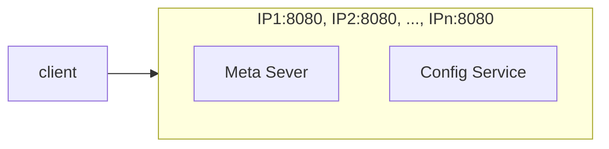
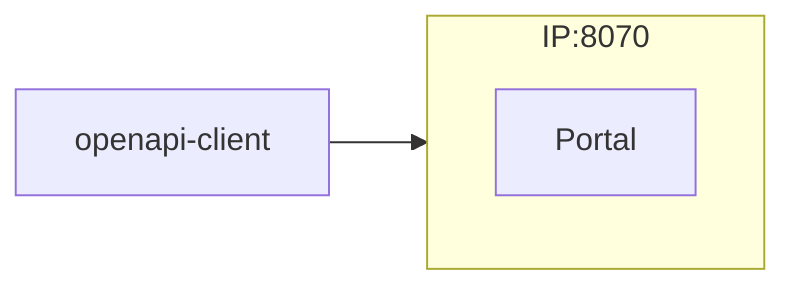
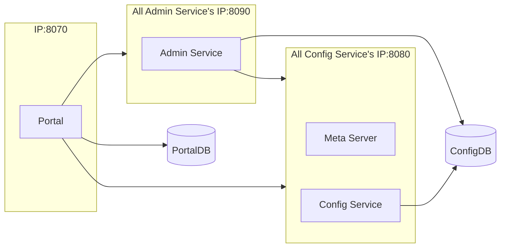

This document describes how to compile, package, and deploy Apollo Configuration Center in a distributed deployment manner, so that it can be deployed and run separately in development, test, and production environments.

> If you just need to try Apollo locally, you can refer to [Quick Start](en/deployment/quick-start)

# &nbsp;
# I. Preparation

## 1.1 Runtime environment

## 1.1.1 OS

The server side is based on Spring Boot and the startup script theoretically supports all Linux distributions, [CentOS 7](https://www.centos.org/) is recommended.

### 1.1.2 Java

* Apollo server: 1.8+
* Apollo client: 1.8+
    * For running in Java 1.7 runtime environment, please use apollo client of 1.x version, such as 1.9.1

Once configured, this can be checked with the following command.
```sh
java -version
```

Sample output.
```sh
java version "1.8.0_74"
Java(TM) SE Runtime Environment (build 1.8.0_74-b02)
Java HotSpot(TM) 64-Bit Server VM (build 25.74-b02, mixed mode)
```

## 1.2 MySQL

* Version requirement: 5.6.5+

Apollo's table structure uses multiple default declarations for `timestamp`, so version 5.6.5+ is required.

After connecting to MySQL, you can check with the following command.
```sql
SHOW VARIABLES WHERE Variable_name = 'version';
```

| Variable_name | Value  |
| ------------- | ------ |
| version       | 5.7.11 |

> Note 1: MySQL versions can be downgraded to 5.5, see [mysql dependency downgrade discussion](https://github.com/apolloconfig/apollo/issues/481) for details.

> Note 2: If you wish to use Oracle, you can refer to [vanpersl](https://github.com/vanpersl)'s [Oracle Adaptation Code](https://github.com/apolloconfig/apollo/compare/v0.8.0...vanpersl:db-oracle) developed on top of Apollo 0.8.0 with `Oracle` version `10.2.0.1.0`.

> Note 3: If you wish to use Postgres, you can refer to the [Pg adaptation code](https://github.com/oaksharks/apollo/compare/ac10768ee2e11c488523ca0e845984f6f71499ac...oaksharks:pg) developed by [oaksharks](https://github.com/oaksharks) on top of Apollo 0.9.1 with `Postgres` version 9.3.20, also see [xiao0yy](https://github.com/xiao0yy) developed on the basis of Apollo 0.10.2 [Pg adaptation code](https://github.com/apolloconfig/apollo/issues/1293) with `Postgres` version 9.5.

## 1.3 Environment

Distributed deployments require a pre-determined environment for the deployment and how it will be deployed.

Apollo currently supports the following environments.
* DEV
    * Development environment
* FAT
    * Test environments, equivalent to alpha environments (functional testing)
* UAT
    * Integration environment, equivalent to a beta environment (regression testing)
* PRO
    * Production environment

> If you want to add custom environment names, you can refer to [How to add new environments by Portal Console](en/faq/common-issues-in-deployment-and-development-phase?id=_4-how-to-add-environment-by-portal-console) for the specific steps.

You can refer to [deployment-architecture](en/deployment/deployment-architecture.md)


## 1.4 Network Policy
For distributed deployment, `apollo-configservice` and `apollo-adminservice` need to register their IPs and ports to Meta Server (apollo-configservice itself).

Apollo clients and Portal will get the address (IP+port) of the service from Meta Server, and then access it directly through the service address.

Note that `apollo-configservice` and `apollo-adminservice` are designed based on the intranet trusted network, so for security reasons, **please do not expose `apollo-configservice` and `apollo-adminservice` directly to the public network**.

So if the actual deployed machine has multiple NICs (e.g. docker), or there are some NICs with IPs that are not accessible by Apollo clients and Portal (e.g. network security restrictions), then we need to do relevant configurations in `apollo-configservice` and `apollo-adminservice` to solve connectivity issues.

### 1.4.1 Ignoring certain NICs

You can modify the startup.sh of `apollo-configservice` and `apollo-adminservice` respectively by passing the -D parameter through the JVM System Property, or by passing the OS Environment Variable, the following example will change the ` docker0` and NICs starting with `veth` are ignored when registering to Eureka.

JVM System Property example.

```properties
-Dspring.cloud.inetutils.ignoredInterfaces[0]=docker0
-Dspring.cloud.inetutils.ignoredInterfaces[1]=veth.*
```

OS Environment Variable example.

```properties
SPRING_CLOUD_INETUTILS_IGNORED_INTERFACES[0]=docker0
SPRING_CLOUD_INETUTILS_IGNORED_INTERFACES[1]=veth.*
```

### 1.4.2 Specifying the IP to be registered
You can modify the startup.sh of `apollo-configservice` and `apollo-adminservice` respectively, passing in the -D parameter via JVM System Property, or via OS Environment Variable, the following example will specify the IP to be registered as `1.2.3.4`.

JVM System Property example.

```properties
-Deureka.instance.ip-address=1.2.3.4
```

OS Environment Variable example.

```properties
EUREKA_INSTANCE_IP_ADDRESS=1.2.3.4
```

### 1.4.3 Specify the URL to register

You can modify the startup.sh of `apollo-configservice` and `apollo-adminservice` respectively, passing in the -D parameter via JVM System Property, or via OS Environment Variable, the following example will specify the URL to register URL as `http://1.2.3.4:8080`.

JVM System Property example.

```properties
-Deureka.instance.homePageUrl=http://1.2.3.4:8080
-Deureka.instance.preferIpAddress=false
```

OS Environment Variable Example.

```properties
EUREKA_INSTANCE_HOME_PAGE_URL=http://1.2.3.4:8080
EUREKA_INSTANCE_PREFER_IP_ADDRESS=false
```

### 1.4.4 Specifying apollo-configservice address directly

If Apollo is deployed on the public cloud and the local development environment cannot connect, but you need to do development testing, the client can upgrade to version 0.11.0 and above, and then configure [Skip Apollo Meta Server service discovery](en/usage/java-sdk-user-guide?id=_1222-skip-apollo-meta-server-service-discovery)

### 1.4.5 Network Configuration

In some companies (e.g. companies in the financial industry), there are many firewalls and network isolation, and it is necessary to open up the network (so that `ip1` can access a port of `ip2`)

#### 1.4.5.1 Configure the network from the client to the configuration center

For clients that use the configuration center, `Apollo-Client` needs to access all (or the same room within) Meta Server and Config Service (default are port 8080), please do not open the network from `Client` to `Admin Service`.




If an application needs to use openapi, it also needs to access Portal (default is port 8070).



#### 1.4.5.2 Configure the network within the configuration center

For the configuration center itself, it is also necessary to ensure network connectivity as each service needs to access each other.



# II. Deployment Steps

The overall deployment steps are relatively simple.

> [@lingjiaju](https://github.com/lingjiaju) recorded a series of Apollo quick start videos, if you feel slightly tedious to read the documentation, you may wish to first look at his [video tutorial](https://pan.baidu.com/s/1blv87EOZS77NWT8Amkijkw#list/path=%2F) .

> If you encounter problems during the deployment process, you can refer to [common issues encountered in deployment & development](en/faq/common-issues-in-deployment-and-development-phase), and you can usually find the answers.

## 2.1 Creating the database

Apollo server side needs a total of two databases: `ApolloPortalDB` and `ApolloConfigDB`, we prepared the database, table creation and sample data as sql files respectively, and just need to import the database.

Note that ApolloPortalDB only needs to deploy one in the production environment, while ApolloConfigDB needs to deploy one set in each environment, such as fat, uat and pro respectively, to deploy 3 sets of ApolloConfigDB.

> Note: If you have already created Apollo database locally, please pay attention to backup data. The sql file we prepare will empty the Apollo related tables.

### 2.1.1 Creating ApolloPortalDB

You can choose to create it by manually importing SQL or by automatically importing SQL via [Flyway](https://flywaydb.org/) depending on the actual situation.

#### 2.1.1.1 Manual SQL Import

You can import [apolloportaldb.sql](https://github.com/apolloconfig/apollo/blob/master/scripts/sql/apolloportaldb.sql) through various MySQL clients.

Using the native MySQL client as an example.

```sql
source /your_local_path/scripts/sql/apolloportaldb.sql
```

#### 2.1.1.2 Created via Flyway import SQL

> Requires version 1.3.0 and above

1. Modify the `flyway-portaldb.properties` in [flyway-portaldb.properties](https://github.com/apolloconfig/apollo/blob/master/scripts/flyway/flyway-portaldb.properties) in `flyway.user`, `flyway.password` and `flyway.url` configurations
2. Execute `mvn -N -Pportaldb flyway:migrate` in the apollo project root directory

#### 2.1.1.3 Verification

After a successful import, you can verify it by executing the following sql statement.

```sql
select `Id`, `Key`, `Value`, `Comment` from `ApolloPortalDB`. `ServerConfig` limit 1;
```

| Id   | Key                | Value | Comment                        |
| ---- | ------------------ | ----- | ------------------------------ |
| 1    | apollo.portal.envs | dev   | list of supported environments |

> Note: ApolloPortalDB only needs to be deployed in a production environment.

### 2.1.2 Creating ApolloConfigDB

You can choose to create it by manually importing SQL or automatically importing SQL via [Flyway](https://flywaydb.org/) according to the actual situation.

#### 2.1.2.1 Importing SQL Manually

You can import [apolloconfigdb.sql](https://github.com/apolloconfig/apollo/blob/master/scripts/sql/apolloconfigdb.sql) through various MySQL clients.

Using the native MySQL client as an example.

```sql
source /your_local_path/scripts/sql/apolloconfigdb.sql
```

#### 2.1.2.2 SQL import via Flyway

> Version 1.3.0 and above is required

1. Modify the `flyway.user`, `flyway.password`, and `flyway.password` in [flyway-configdb.properties](https://github.com/apolloconfig/apollo/blob/master/scripts/flyway/flyway-configdb.properties) .
2. Run `mvn -N -Pconfigdb flyway:migrate` in the apollo project root directory

#### 2.1.2.3 Verification


After a successful import, you can verify it by executing the following sql statement.

```sql
select `Id`, `Key`, `Value`, `Comment` from `ApolloConfigDB`. `ServerConfig` limit 1;
```

| Id   | Key                | Value                         | Comment            |
| ---- | ------------------ | ----------------------------- | ------------------ |
| 1    | eureka.service.url | http://127.0.0.1:8080/eureka/ | Eureka Service Url |

> Note: ApolloConfigDB needs to be deployed in one set per environment, e.g. 3 sets of ApolloConfigDB for fat, uat and pro respectively

#### 2.1.2.4 Importing ApolloConfigDB project data from another environment

If the Apollo configuration center is newly deployed, please ignore this step.

If the Apollo Configuration Center is not newly deployed, for example, it has been in use for some time and a number of projects and namespaces have been created in the Apollo Configuration Center at that time, then you need to import the necessary project data from other normally running environments in the ApolloConfigDB in the new environment.

The following four tables of ApolloConfigDB are mainly involved, and the following data query statements are also attached.

1. App
   * Import all the apps
   * e.g.: insert into `New environment of ApolloConfigDB`. `App` select * from `Other Environment's ApolloConfigDB`. `App` where `IsDeleted` = 0;
2. AppNamespace
   * Import all AppNamespace
   * e.g. insert into `New environment's ApolloConfigDB`. `AppNamespace` select * from `other environment's ApolloConfigDB`. `AppNamespace` where `IsDeleted` = 0;
3. Cluster
   * Import the default default cluster
   * e.g. insert into `New environment's ApolloConfigDB`. `Cluster` select * from `ApolloConfigDB of other environment`. `Cluster` where `Name` = 'default' and `IsDeleted` = 0;
4. Namespace
   * Import the namespace in the default default cluster
   * e.g. insert into `ApolloConfigDB` of the new environment. `Namespace` select * from `ApolloConfigDB of other environment`. `Namespace` where `ClusterName` = 'default' and `IsDeleted` = 0;

Also don't forget to notify users to set the correct configuration information for their projects in the new environment, especially for some public namespace configurations that have a large impact.

> If you are migrating data for a running environment, it is recommended to restart the config service after migration, because the config service has cached data for appnamespace

### 2.1.3 Adjusting server-side configuration

Apollo's own configuration is placed inside the database, so you need to make some adjustments for the actual situation, please refer to [III. Server-side configuration description](en/deployment/distributed-deployment-guide?id=iii-server-side-configuration-instructions) for specific parameters.

Most of the configurations can use the default values first, but [apollo.portal.envs](en/deployment/distributed-deployment-guide?id=_311-apolloportalenvs-list-of-supportable-environments) and [eureka.service.url](en/deployment/distributed-deployment-guide?id=_321-eurekaserviceurl-eureka-service-url) please make sure configured correctly before proceeding to the following deployment steps.

## 2.2 Virtual/physical machine deployment

### 2.2.1 Get the installation package

The installation package can be obtained in two ways.

1. directly downloading the installer
   * Download the pre-typed installer from the [GitHub Release](https://github.com/apolloconfig/apollo/releases) page
   * If you don't need to customize Apollo's code, it is recommended to use this way to skip the local packaging process
2. Build via source code
   * Download the Source code package from the [GitHub Release](https://github.com/apolloconfig/apollo/releases) page or directly clone [source code](https://github.com/ctripcorp/apollo) then build locally
   * If you need to do custom development for Apollo, you need to use this method

#### 2.2.1.1 Download the installation package directly

##### 2.2.1.1.1 Get the apollo-configservice, apollo-adminservice, and apollo-portal installers

Download the latest versions of `apollo-configservice-x.x.x-github.zip`, `apollo- adminservice-x.x.x-github.zip` and `apollo-portal-x.x.x-github.zip` can be downloaded.

##### 2.2.1.1.2 Configuring database connection information

The Apollo server needs to know how to connect to the database you created earlier. The database connection string information is located in `config/application-github.properties` in the zip file you downloaded in the previous step.

###### 2.2.1.1.2.1 Configuring database connection information for apollo-configservice

1. unzip `apollo-configservice-x.x.x-github.zip`. 2.
2. Open the `application-github.properties` file in the `config` directory with a programmer's editor (e.g. vim, notepad++, sublime, etc.)
3. fill in the correct ApolloConfigDB database connection string information, note that there are no spaces after the username and password!
4. The result of the modification is as follows.

```properties
# DataSource
spring.datasource.url = jdbc:mysql://localhost:3306/ApolloConfigDB?useSSL=false&characterEncoding=utf8
spring.datasource.username = someuser
spring.datasource.password = somepwd
```

> Note: Since ApolloConfigDB is deployed in each environment, you need to configure the database parameters of the corresponding environment for different environment config-services

###### 2.2.1.1.2.2 Configuring database connection information for apollo-adminservice

1. unzip `apollo-adminservice-x.x.x-github.zip`. 2.
2. Open the `application-github.properties` file in the `config` directory with a programmer's editor (e.g. vim, notepad++, sublime, etc.)
3. fill in the correct ApolloConfigDB database connection string information, note that there are no spaces after the username and password!
4. The result of the modification is as follows.

```properties
# DataSource
spring.datasource.url = jdbc:mysql://localhost:3306/ApolloConfigDB?useSSL=false&characterEncoding=utf8
spring.datasource.username = someuser
spring.datasource.password = somepwd
```

> Note: Since ApolloConfigDB is deployed in each environment, you need to configure the database parameters of the corresponding environment for different environment admin-services

###### 2.2.1.1.2.3 Configuring database connection information for apollo-portal

1. unzip `apollo-portal-x.x.x-github.zip`. 2.
2. Open the `application-github.properties` file in the `config` directory with a programmer-specific editor (e.g. vim, notepad++, sublime, etc.)
3. fill in the correct ApolloPortalDB database connection string information, note that there are no spaces after the username and password!
4. The effect after modification is as follows.

```properties
# DataSource
spring.datasource.url = jdbc:mysql://localhost:3306/ApolloPortalDB?useSSL=false&characterEncoding=utf8
spring.datasource.username = someuser
spring.datasource.password = somepwd
```

###### 2.2.1.1.2.4 Configuring apollo-portal's meta service information

Apollo Portal needs to access different meta service (apollo-configservice) addresses in different environments, so we need to provide this information in the configuration. By default, the meta service and config service are deployed in the same JVM process, so the address of the meta service is the address of the config service.

> For version 1.6.0 and above, you can configure the Meta Service address through the configuration item in ApolloPortalDB.ServerConfig, see [apollo.portal.meta.servers - List of Meta Service for each environment](en/deployment/distributed-deployment-guide?id=_312-apolloportalmetaservers-list-of-meta-service-for-each-environment)

Open the `apollo-env.properties` file in the `config` directory of `apollo-portal-x.x.x-github.zip` using a programmer-specific editor (e.g. vim, notepad++, sublime, etc.).

Suppose DEV's apollo-config service is not bound to a domain name at 1.1.1.1:8080, FAT's apollo-config service is bound to the domain name apollo.fat.xxx.com, and UAT's apollo-config service is bound to the domain name apollo.uat.xxx.com, and PRO's apollo-configservice is bound to the domain apollo.xxx.com, then you can modify each environment meta service address as follows, in the format of `${env}.meta=http://${config-service- url:port}`, and if an environment does not need it, you can also directly delete the corresponding configuration item (e.g. lpt.meta): 

```properties
dev.meta=http://1.1.1.1:8080
fat.meta=http://apollo.fat.xxx.com
uat.meta=http://apollo.uat.xxx.com
pro.meta=http://apollo.xxx.com
```

In addition to configuring the meta service by means of `apollo-env.properties`, apollo also supports specifying the meta service at runtime (with a higher priority than `apollo-env.properties`): 1.

1. via Java System Property `${env}_meta`
   * Can be specified via Java System Property `${env}_meta`
   * e.g. `java -Ddev_meta=http://config-service-url -jar xxx.jar`
   * Can also be specified programmatically, e.g. `System.setProperty("dev_meta", "http://config-service-url");`
2. through the operating system's System Environment `${ENV}_META`
   * e.g. `DEV_META=http://config-service-url`
   * Note that the key is all-caps and separated by `_`.

>Note 1: In order to achieve high availability of meta service, it is recommended to do dynamic load balancing by SLB (Software Load Balancer).

>Note 2: The meta service address can also be filled with IPs. Before version 0.11.0, only one IP was supported. From version 0.11.0 onwards, multiple addresses separated by commas ([PR #1214](https://github.com/apolloconfig/apollo/pull/1214) ), such as `http://1.1.1.1:8080,http://2.2.2.2:8080`, although production environments are still recommended to use domain names (go slb), as machine expansion, shrinkage, etc. may result in changes to the IP list.

#### 2.2.1.2 Building from source code

##### 2.2.1.2.1 Configuring database connection information

The Apollo server needs to know how to connect to the database you created earlier, so you need to edit [scripts/build.sh](https://github.com/apolloconfig/apollo/blob/master/scripts/build.sh) and modify ApolloPortalDB and ApolloConfigDB related database connection string information.

> Note: The filled-in user needs to have read/write access to ApolloPortalDB and ApolloConfigDB data.

```sh
#apollo config db info
apollo_config_db_url=jdbc:mysql://localhost:3306/ApolloConfigDB?useSSL=false&characterEncoding=utf8
apollo_config_db_username=username
apollo_config_db_password=password (if you don't have a password, just leave it blank)

# apollo portal db info
apollo_portal_db_url=jdbc:mysql://localhost:3306/ApolloPortalDB?useSSL=false&characterEncoding=utf8
apollo_portal_db_username=username
apollo_portal_db_password=password (if you don't have a password, just leave it blank)
```

> Note 1: As ApolloConfigDB is deployed in each environment, so for different environments config-service and admin-service need to use different database parameters to play different packages, portal only need to play once package can

> Note 2: If you don't want config-service and admin-service to have a package for each environment, you can also pass in the database connection string information at runtime, which can be found in [Issue 869](https://github.com/apolloconfig/apollo/issues/869)

> Note 3: Each environment needs to deploy a separate set of config-service, admin-service and ApolloConfigDB

##### 2.2.1.2.2 Configuring each environment meta service address

Apollo Portal needs to access different meta service (apollo-configservice) addresses in different environments, so this information needs to be provided at packaging time.

Suppose DEV's apollo-config service is not bound to a domain name with the address 1.1.1.1:8080, FAT's apollo-config service is bound to the domain name apollo.fat.xxx.com, and UAT's apollo-config service is bound to the domain name apollo.uat.xxx.com, and PRO's apollo-configservice is bound to the domain apollo.xxx.com, then edit [scripts/build.sh](https://github.com/apolloconfig/apollo/blob/master/scripts/build.sh) as follows to modify each environment meta service service address in the format ``${env}_meta=http://${config-service-url:port}``, if an environment does not need it, you can also directly delete the corresponding configuration item: 

```sh
dev_meta=http://1.1.1.1:8080
fat_meta=http://apollo.fat.xxx.com
uat_meta=http://apollo.uat.xxx.com
pro_meta=http://apollo.xxx.com

META_SERVERS_OPTS="-Ddev_meta=$dev_meta -Dfat_meta=$fat_meta -Duat_meta=$uat_meta -Dpro_meta=$pro_meta"
```

In addition to configuring the meta service at packaging time, apollo also supports specifying the meta service at runtime: 1.

1. via Java System Property `${env}_meta`
   * can be specified via the Java System Property `${env}_meta`
   * such as `java -Ddev_meta=http://config-service-url -jar xxx.jar`
   * Can also be specified programmatically, e.g. `System.setProperty("dev_meta", "http://config-service-url");`
2. through the operating system's System Environment `${ENV}_META`
   * e.g. `DEV_META=http://config-service-url`
   * Note that the key is all-caps and separated by `_`.

>Note 1: In order to achieve high availability of meta service, it is recommended to do dynamic load balancing by SLB (Software Load Balancer).

>Note 2: The meta service address can also be filled with IPs. Before version 0.11.0, only one IP was supported. From version 0.11.0 onwards, multiple addresses separated by commas ([PR #1214](https://github.com/apolloconfig/apollo/pull/1214) ), such as `http://1.1.1.1:8080,http://2.2.2.2:8080`, although production environments are still recommended to use domain names (go slb), as machine expansion, shrinkage, etc. may lead to changes in the IP list.

##### 2.2.1.2.3 Perform compilation and packaging

After doing the above configuration, you can execute the compilation and packaging.

> Note: The initial compilation will download a lot of dependencies from the central Maven repository, so if the network is not good, it is recommended to use a domestic Maven repository source, such as [AliCloud Maven mirror](http://www.cnblogs.com/geektown/p/5705405.html)

```sh
./build.sh
```

This script will package apollo-configservice, apollo-adminservice, apollo-portal in turn.

> Note: Since ApolloConfigDB is deployed in each environment, you need to use different packages for config-service and admin-service for different environments with different database connection information, and only one package for portal

##### 2.2.1.2.4 Get the apollo-config-service installation package

Located in the `apollo-configservice/target/` directory `apollo-configservice-x.x.x-github.zip`

Note that since ApolloConfigDB is deployed in every environment, the config-service for different environments needs to be deployed separately using different packages with different database parameters

##### 2.2.1.2.5 Get apollo-adminservice installation package

The `apollo-adminservice-x.x.x-github.zip` located in the `apollo-adminservice/target/` directory

Note that since ApolloConfigDB is deployed in each environment, the admin-service for different environments needs to be deployed separately using different packages with different database parameters

##### 2.2.1.2.6 Get apollo-portal installation package

`apollo-portal-x.x.x-github.zip` located in the `apollo-portal/target/` directory

##### 2.2.1.2.7 Enable external nacos service registry to replace built-in eureka

1. Modify build.sh/build.bat to change the maven build command for config-service and admin-service to

```shell
mvn clean package -Pgithub,nacos-discovery -DskipTests -pl apollo-configservice,apollo-adminservice -am -Dapollo_profile=github,nacos-discovery -Dspring_datasource_url=$apollo_config_db_url -Dspring_datasource_username=$apollo_config_db_username -Dspring_datasource_ password=$apollo_config_db_username password=$apollo_config_db_password
```

2. Modify the application-github.properties in the config directory of the apollo-config service and apollo-adminservice installation packages, respectively, to configure the nacos server address

```properties
nacos.discovery.server-addr=127.0.0.1:8848
# More nacos configurations
nacos.discovery.access-key=
nacos.discovery.username=
nacos.discovery.password=
nacos.discovery.secret-key=
nacos.discovery.namespace=
nacos.discovery.context-path=
```

##### 2.2.1.2.8 Enable external Consul service registry to replace built-in eureka

1. Modify build.sh/build.bat to change the maven build command for config-service and admin-service to

```shell
mvn clean package -Pgithub -DskipTests -pl apollo-configservice,apollo-adminservice -am -Dapollo_profile=github,consul-discovery -Dspring_datasource_url=$apollo_config_db_url -Dspring_datasource_username=$apollo_config_db_username -Dspring_datasource_password=$apollo_config_db_password
```

2. Modify the application-github.properties in the config directory of the apollo-configservice and apollo-adminservice installation packages, respectively, to configure the consul server address

```properties
spring.cloud.consul.host=127.0.0.1
spring.cloud.consul.port=8500
```

##### 2.2.1.2.9 Enable external Zookeeper service registry to replace built-in eureka

1. Modify build.sh/build.bat to change the maven build command for ``config-service`` and ``admin-service`` to

```shell
mvn clean package -Pgithub -DskipTests -pl apollo-configservice,apollo-adminservice -am -Dapollo_profile=github,zookeeper-discovery - Dspring_datasource_url=$apollo_config_db_url -Dspring_datasource_username=$apollo_config_db_username -Dspring_datasource_password=$apollo_config_db_password
```

2. Modify the application-github.properties in the config directory of the apollo-config service and apollo-adminservice installation packages, respectively, to configure the zookeeper server address

```properties
spring.cloud.zookeeper.connect-string=127.0.0.1:2181
```

3. Zookeeper version description

* Support Zookeeper 3.5.x or higher;
* If apollo-configservice application starts reporting port occupation, please check the following configuration of Zookeeper;

> Note: Zookeeper 3.5.0 added a built-in [AdminServer](https://zookeeper.apache.org/doc/r3.5.0-alpha/zookeeperAdmin.html#sc_adminserver_config)

```properties
admin.enableServer
admin.serverPort
```

##### 2.2.1.2.10 Enable custom-defined-discovery to replace built-in eureka

1. Modify build.sh/build.bat and change the maven compilation commands of `config-service` and `admin-service` to

```shell
mvn clean package -Pgithub -DskipTests -pl apollo-configservice,apollo-adminservice -am -Dapollo_profile=github,custom-defined-discovery -Dspring_datasource_url=$apollo_config_db_url -Dspring_datasource_username=$apollo_config_db_username -Dspring_datasource_password=$apollo_config_db_password
````

2. There are two ways to configure the access addresses of the custom config-service and admin-service: one is to write two pieces of data in the mysql database ApolloConfigDB and the table ServerConfig.

```sql
INSERT INTO `ApolloConfigDB`.`ServerConfig` (`Key`, `Value`, `Comment`) VALUES ('apollo.config-service.url', 'http://apollo-config-service', 'ConfigService access address ');
INSERT INTO `ApolloConfigDB`.`ServerConfig` (`Key`, `Value`, `Comment`) VALUES ('apollo.admin-service.url', 'http://apollo-admin-service', 'AdminService access address ');
````

Another way to modify application-github.properties in the config directory of the apollo-configservice installation package

````properties
apollo.config-service.url=http://apollo-config-service
apollo.admin-service.url=http://apollo-admin-service
````

### 2.2.2 Deploy Apollo server

#### 2.2.2.1 Deploy apollo-configservice

Upload the `apollo-configservice-x.x.x-github.zip` of the corresponding environment to the server, decompress it and execute scripts/startup.sh. To stop the service, execute scripts/shutdown.sh.

Remember to set a JVM memory according to the actual environment in scripts/startup.sh. The following are our default settings for reference:

```bash
export JAVA_OPTS="-server -Xms6144m -Xmx6144m -Xss256k -XX:MetaspaceSize=128m -XX:MaxMetaspaceSize=384m -XX:NewSize=4096m -XX:MaxNewSize=4096m -XX:SurvivorRatio=18"
````

> Note 1: If you need to modify the JVM parameters, you can modify the `JAVA_OPTS` section of scripts/startup.sh.

> Note 2: To adjust the log output path of the service, you can modify `LOG_DIR` in scripts/startup.sh and apollo-configservice.conf.

> Note 3: To adjust the listening port of the service, you can modify the `SERVER_PORT` in scripts/startup.sh. In addition, apollo-configservice also assumes the responsibility of meta server. If you want to modify the port, pay attention to the `eureka.service.url` configuration item in the ApolloConfigDB.ServerConfig table and the meta server information used in apollo-portal and apollo-client. For details, see: [2.2.1.1.2.4 Configuring the meta service information of apollo-portal](en/deployment/distributed-deployment-guide?id=_221124-configuring-apollo-portal39s-meta-service-information) and [1.2.2 Apollo Meta Server](en/usage/java-sdk-user-guide?id=_122-apollo-meta-server).

> Note 4: If the eureka.service.url of ApolloConfigDB.ServerConfig is only configured with the currently starting machine, the eureka registration failure information will be output in the log during the process of starting apollo-configservice, such as `com.sun.jersey .api.client.ClientHandlerException: java.net.ConnectException: Connection refused`. It should be noted that this is the expected situation, because apollo-configservice needs to register the service with the Meta Server (itself), but because it has not yet woken up during the startup process, it will report this error. The retry action will be performed later, so the registration will be normal after the service is up.

> Note 5: If you read this, I believe that you must be someone who reads the documentation carefully, and you are a little bit closer to success. Keep going, you should be able to complete the distributed deployment of Apollo soon! But do you feel that Apollo's distributed deployment steps are a bit cumbersome? Do you have any advice you would like to share with the author? If the answer is yes, please move to [#1424](https://github.com/apolloconfig/apollo/issues/1424) and look forward to your suggestions!

#### 2.2.2.2 Deploy apollo-adminservice

Upload the `apollo-adminservice-x.x.x-github.zip` of the corresponding environment to the server, decompress it and execute scripts/startup.sh. To stop the service, execute scripts/shutdown.sh.

Remember to set a JVM memory according to the actual environment in scripts/startup.sh. The following are our default settings for reference:

```bash
export JAVA_OPTS="-server -Xms2560m -Xmx2560m -Xss256k -XX:MetaspaceSize=128m -XX:MaxMetaspaceSize=384m -XX:NewSize=1024m -XX:MaxNewSize=1024m -XX:SurvivorRatio=22"
````

> Note 1: If you need to modify the JVM parameters, you can modify the `JAVA_OPTS` section of scripts/startup.sh.

> Note 2: To adjust the log output path of the service, you can modify `LOG_DIR` in scripts/startup.sh and apollo-adminservice.conf.

> Note 3: To adjust the listening port of the service, you can modify the `SERVER_PORT` in scripts/startup.sh.

#### 2.2.2.3 Deploy apollo-portal

Upload `apollo-portal-x.x.x-github.zip` to the server, unzip it and execute scripts/startup.sh. To stop the service, execute scripts/shutdown.sh.

Remember to set a JVM memory according to the actual environment in startup.sh. The following are our default settings for reference:

```bash
export JAVA_OPTS="-server -Xms4096m -Xmx4096m -Xss256k -XX:MetaspaceSize=128m -XX:MaxMetaspaceSize=384m -XX:NewSize=1536m -XX:MaxNewSize=1536m -XX:SurvivorRatio=22"
````

> Note 1: If you need to modify the JVM parameters, you can modify the `JAVA_OPTS` section of scripts/startup.sh.

> Note 2: To adjust the log output path of the service, you can modify `LOG_DIR` in scripts/startup.sh and apollo-portal.conf.

> Note 3: To adjust the listening port of the service, you can modify the `SERVER_PORT` in scripts/startup.sh.

## 2.3 Docker Deployment

### 2.3.1 Version 1.7.0 and above

Apollo version 1.7.0 starts uploading Docker images to [Docker Hub](https://hub.docker.com/u/apolloconfig) by default, which can be obtained by following these steps

#### 2.3.1.1 Apollo Config Service

##### 2.3.1.1.1 Get the image

```bash
docker pull apolloconfig/apollo-config service:${version}
```

##### 2.3.1.1.2 Run the image

Example:

```bash
docker run -p 8080:8080 \
    -e SPRING_DATASOURCE_URL="jdbc:mysql://fill-in-the-correct-server:3306/ApolloConfigDB?characterEncoding=utf8" \
    -e SPRING_DATASOURCE_USERNAME=FillInCorrectUser -e SPRING_DATASOURCE_PASSWORD=FillInCorrectPassword \
    -d -v /tmp/logs:/opt/logs --name apollo-configservice apolloconfig/apollo-configservice:${version}
```

Parameter description.

* `SPRING_DATASOURCE_URL`: Address of the corresponding environment ApolloConfigDB
* `SPRING_DATASOURCE_USERNAME`: The user name of the corresponding environment ApolloConfigDB
* `SPRING_DATASOURCE_PASSWORD`: password of the corresponding environment ApolloConfigDB

#### 2.3.1.2 Apollo Admin Service

##### 2.3.1.2.1 Getting the image

```bash
docker pull apolloconfig/apollo-adminservice:${version}
```

##### 2.3.1.2.2 Running the image

Example:

```bash
docker run -p 8090:8090 \
    -e SPRING_DATASOURCE_URL="jdbc:mysql://fill-in-the-correct-server:3306/ApolloConfigDB?characterEncoding=utf8" \
    -e SPRING_DATASOURCE_USERNAME=FillInCorrectUser -e SPRING_DATASOURCE_PASSWORD=FillInCorrectPassword \
    -d -v /tmp/logs:/opt/logs --name apollo-adminservice apolloconfig/apollo-adminservice:${version}
```

Parameter description.

* `SPRING_DATASOURCE_URL`: Address of the corresponding environment ApolloConfigDB
* `SPRING_DATASOURCE_USERNAME`: The user name of the corresponding environment ApolloConfigDB
* `SPRING_DATASOURCE_PASSWORD`: password of the corresponding environment ApolloConfigDB

#### 2.3.1.3 Apollo Portal

##### 2.3.1.3.1 Getting the image

```bash
docker pull apolloconfig/apollo-portal:${version}
```

##### 2.3.1.3.2 Running the image

Example:

```bash
docker run -p 8070:8070 \
    -e SPRING_DATASOURCE_URL="jdbc:mysql://fill-in-the-correct-server:3306/ApolloPortalDB?characterEncoding=utf8" \
    -e SPRING_DATASOURCE_USERNAME=FillInCorrectUser -e SPRING_DATASOURCE_PASSWORD=FillInCorrectPassword \
    -e APOLLO_PORTAL_ENVS=dev,pro \
    -e DEV_META=http://fill-in-dev-meta-server:8080 -e PRO_META=http://fill-in-pro-meta-server:8080 \
    -d -v /tmp/logs:/opt/logs --name apollo-portal apolloconfig/apollo-portal:${version}
```

Parameter description:

* `SPRING_DATASOURCE_URL`: Address of the corresponding environment ApolloPortalDB
* `SPRING_DATASOURCE_USERNAME`: The username of the corresponding environment ApolloPortalDB
* `SPRING_DATASOURCE_PASSWORD`: The password of the corresponding environment ApolloPortalDB
* `APOLLO_PORTAL_ENVS` (optional): corresponds to the [apollo.portal.envs](en/deployment/distributed-deployment-guide?id=_311-apolloportalenvs-list-of-supportable-environments) configuration item in ApolloPortalDB, which can be configured by this environment parameter if it is not configured in the database.
* `DEV_META/PRO_META`(optional): Configure the Meta Service address of the corresponding environment, named by `${ENV}_META`, it should be noted that if you configure  [apollo.portal.meta.servers](en/deployment/distributed-deployment-guide?id=_312-apolloportalmetaservers-list-of-meta-service-for-each-environment)  configuration, then the configuration in apollo.portal.meta.servers prevails.

#### 2.3.1.4 Building a Docker image from source

If you have modified the apollo server code and wish to build a Docker image from source, you can refer to the following steps.

1. Build the installation package from source: `./scripts/build.sh` 2.
2. build the Docker image: `mvn docker:build -pl apollo-configservice,apollo-adminservice,apollo-portal`

### 2.3.2 Versions before 1.7.0

Apollo project already comes with Docker file, you can refer to [2.2.1 Get installer](#_221-Get-the-installation-package) to configure the installer and then hit the Docker image with the following file.

1. [apollo-configservice](https://github.com/apolloconfig/apollo/blob/master/apollo-configservice/src/main/docker/Dockerfile)
2. [apollo-adminservice](https://github.com/apolloconfig/apollo/blob/master/apollo-adminservice/src/main/docker/Dockerfile)
3. [apollo-portal](https://github.com/apolloconfig/apollo/blob/master/apollo-portal/src/main/docker/Dockerfile)

See also the [docker-apollo](https://github.com/kulovecc/docker-apollo) project by Apollo user [@kulovecc](https://github.com/kulovecc) and [@idoop](https://github.com/idoop) for the [docker-apollo](https://github.com/idoop/docker-apollo) project.

## 2.4 Kubernetes Deployment

### 2.4.1 Kubernetes-based native service discovery

Apollo version 1.7.0 adds a deployment model based on Kubernetes native service discovery, which greatly simplifies the overall deployment as it no longer uses the built-in Eureka, and also provides Helm Charts for easy deployment.

> More design notes can be found in [#3054](https://github.com/apolloconfig/apollo/issues/3054).

#### 2.4.1.1 Environment requirements

- Kubernetes 1.10+
- Helm 3

#### 2.4.1.2 Adding Apollo Helm Chart repository

```bash
$ helm repo add apollo https://charts.apolloconfig.com
$ helm search repo apollo
```

#### 2.4.1.3 Deploying apollo-configservice and apollo-adminservice

##### 2.4.1.3.1 Installing apollo-configservice and apollo-adminservice

You need to install apollo-configservice and apollo-adminservice in each environment, so it is recommended to include the environment information in the release name, e.g. `apollo-service-dev`

```bash
$ helm install apollo-service-dev \
    --set configdb.host=1.2.3.4 \
    --set configdb.userName=apollo \
    --set configdb.password=apollo \
    --set configdb.service.enabled=true \
    --set configService.replicaCount=1 \
    --set adminService.replicaCount=1 \
    -n your-namespace \
    apollo/apollo-service
```

The general deployment recommendation is to configure via values.yaml

```bash
$ helm install apollo-service-dev -f values.yaml -n your-namespace apollo/apollo-service 
```

After installation, you will be prompted for the Meta Server address of the corresponding environment, which needs to be recorded. apollo-portal needs to be installed with.

```bash
Get meta service url for current release by running these commands:
  echo http://apollo-service-dev-apollo-configservice:8080
```

> See [2.4.1.3.3 Configuration Notes](#_24133-Configuration-Notes) for more configuration notes

##### 2.4.1.3.2 Uninstalling apollo-configservice and apollo-adminservice

For example to uninstall the `apollo-service-dev` deployment.

```bash
$ helm uninstall -n your-namespace apollo-service-dev
```

##### 2.4.1.3.3 Configuration Notes

The following table lists the configurable parameters of the apollo-service-chart and their default values.

| Parameter                                       | Description                                                  | Default                             |
| ----------------------------------------------- | ------------------------------------------------------------ | ----------------------------------- |
| `configdb.host`                                 | The host for apollo config db                                | `nil`                               |
| `configdb.port`                                 | The port for apollo config db                                | `3306`                              |
| `configdb.dbName`                               | The database name for apollo config db                       | `ApolloConfigDB`                    |
| `configdb.userName`                             | The user name for apollo config db                           | `nil`                               |
| `configdb.password`                             | The password for apollo config db                            | `nil`                               |
| `configdb.connectionStringProperties`           | The connection string properties for apollo config db        | `characterEncoding=utf8`            |
| `configdb.service.enabled`                      | Whether to create a Kubernetes Service for `configdb.host` or not. Set it to `true` if `configdb.host` is an endpoint outside of the kubernetes cluster | `false`                             |
| `configdb.service.fullNameOverride`             | Override the service name for apollo config db               | `nil`                               |
| `configdb.service.port`                         | The port for the service of apollo config db                 | `3306`                              |
| `configdb.service.type`                         | The service type of apollo config db: `ClusterIP` or `ExternalName`. If the host is a DNS name, please specify `ExternalName` as the service type, e.g. `xxx.mysql.rds.aliyuncs.com` | `ClusterIP`                         |
| `configService.fullNameOverride`                | Override the deployment name for apollo-configservice        | `nil`                               |
| `configService.replicaCount`                    | Replica count of apollo-configservice                        | `2`                                 |
| `configService.containerPort`                   | Container port of apollo-configservice                       | `8080`                              |
| `configService.image.repository`                | Image repository of apollo-configservice                     | `apolloconfig/apollo-configservice` |
| `configService.image.tag`                       | Image tag of apollo-configservice, e.g. `1.8.0`, leave it to `nil` to use the default version. _(chart version >= 0.2.0)_ | `nil`                               |
| `configService.image.pullPolicy`                | Image pull policy of apollo-configservice                    | `IfNotPresent`                      |
| `configService.imagePullSecrets`                | Image pull secrets of apollo-configservice                   | `[]`                                |
| `configService.service.fullNameOverride`        | Override the service name for apollo-configservice           | `nil`                               |
| `configService.service.port`                    | The port for the service of apollo-configservice             | `8080`                              |
| `configService.service.targetPort`              | The target port for the service of apollo-configservice      | `8080`                              |
| `configService.service.type`                    | The service type of apollo-configservice                     | `ClusterIP`                         |
| `configService.ingress.enabled`                 | Whether to enable the ingress for config-service or not. _(chart version >= 0.2.0)_ | `false`                             |
| `configService.ingress.annotations`             | The annotations of the ingress for config-service. _(chart version >= 0.2.0)_ | `{}`                                |
| `configService.ingress.hosts.host`              | The host of the ingress for config-service. _(chart version >= 0.2.0)_ | `nil`                               |
| `configService.ingress.hosts.paths`             | The paths of the ingress for config-service. _(chart version >= 0.2.0)_ | `[]`                                |
| `configService.ingress.tls`                     | The tls definition of the ingress for config-service. _(chart version >= 0.2.0)_ | `[]`                                |
| `configService.liveness.initialDelaySeconds`    | The initial delay seconds of liveness probe                  | `100`                               |
| `configService.liveness.periodSeconds`          | The period seconds of liveness probe                         | `10`                                |
| `configService.readiness.initialDelaySeconds`   | The initial delay seconds of readiness probe                 | `30`                                |
| `configService.readiness.periodSeconds`         | The period seconds of readiness probe                        | `5`                                 |
| `configService.config.profiles`                 | specify the spring profiles to activate                      | `github,kubernetes`                 |
| `configService.config.configServiceUrlOverride` | Override `apollo.config-service.url`: config service url to be accessed by apollo-client, e.g. `http://apollo-config-service-dev:8080` | `nil`                               |
| `configService.config.adminServiceUrlOverride`  | Override `apollo.admin-service.url`: admin service url to be accessed by apollo-portal, e.g. `http://apollo-admin-service-dev:8090` | `nil`                               |
| `configService.config.contextPath`              | specify the context path, e.g. `/apollo`, then users could access config service via `http://{config_service_address}/apollo`. _(chart version >= 0.2.0)_ | `nil`                               |
| `configService.env`                             | Environment variables passed to the container, e.g. <br />`JAVA_OPTS: -Xss256k` | `{}`                                |
| `configService.strategy`                        | The deployment strategy of apollo-configservice              | `{}`                                |
| `configService.resources`                       | The resources definition of apollo-configservice             | `{}`                                |
| `configService.nodeSelector`                    | The node selector definition of apollo-configservice         | `{}`                                |
| `configService.tolerations`                     | The tolerations definition of apollo-configservice           | `[]`                                |
| `configService.affinity`                        | The affinity definition of apollo-configservice              | `{}`                                |
| `adminService.fullNameOverride`                 | Override the deployment name for apollo-adminservice         | `nil`                               |
| `adminService.replicaCount`                     | Replica count of apollo-adminservice                         | `2`                                 |
| `adminService.containerPort`                    | Container port of apollo-adminservice                        | `8090`                              |
| `adminService.image.repository`                 | Image repository of apollo-adminservice                      | `apolloconfig/apollo-adminservice`  |
| `adminService.image.tag`                        | Image tag of apollo-adminservice, e.g. `1.8.0`, leave it to `nil` to use the default version. _(chart version >= 0.2.0)_ | `nil`                               |
| `adminService.image.pullPolicy`                 | Image pull policy of apollo-adminservice                     | `IfNotPresent`                      |
| `adminService.imagePullSecrets`                 | Image pull secrets of apollo-adminservice                    | `[]`                                |
| `adminService.service.fullNameOverride`         | Override the service name for apollo-adminservice            | `nil`                               |
| `adminService.service.port`                     | The port for the service of apollo-adminservice              | `8090`                              |
| `adminService.service.targetPort`               | The target port for the service of apollo-adminservice       | `8090`                              |
| `adminService.service.type`                     | The service type of apollo-adminservice                      | `ClusterIP`                         |
| `adminService.ingress.enabled`                  | Whether to enable the ingress for admin-service or not. _(chart version >= 0.2.0)_ | `false`                             |
| `adminService.ingress.annotations`              | The annotations of the ingress for admin-service. _(chart version >= 0.2.0)_ | `{}`                                |
| `adminService.ingress.hosts.host`               | The host of the ingress for admin-service. _(chart version >= 0.2.0)_ | `nil`                               |
| `adminService.ingress.hosts.paths`              | The paths of the ingress for admin-service. _(chart version >= 0.2.0)_ | `[]`                                |
| `adminService.ingress.tls`                      | The tls definition of the ingress for admin-service. _(chart version >= 0.2.0)_ | `[]`                                |
| `adminService.liveness.initialDelaySeconds`     | The initial delay seconds of liveness probe                  | `100`                               |
| `adminService.liveness.periodSeconds`           | The period seconds of liveness probe                         | `10`                                |
| `adminService.readiness.initialDelaySeconds`    | The initial delay seconds of readiness probe                 | `30`                                |
| `adminService.readiness.periodSeconds`          | The period seconds of readiness probe                        | `5`                                 |
| `adminService.config.profiles`                  | specify the spring profiles to activate                      | `github,kubernetes`                 |
| `adminService.config.contextPath`               | specify the context path, e.g. `/apollo`, then users could access admin service via `http://{admin_service_address}/apollo`. _(chart version >= 0.2.0)_ | `nil`                               |
| `adminService.env`                              | Environment variables passed to the container, e.g. <br />`JAVA_OPTS: -Xss256k` | `{}`                                |
| `adminService.strategy`                         | The deployment strategy of apollo-adminservice               | `{}`                                |
| `adminService.resources`                        | The resources definition of apollo-adminservice              | `{}`                                |
| `adminService.nodeSelector`                     | The node selector definition of apollo-adminservice          | `{}`                                |
| `adminService.tolerations`                      | The tolerations definition of apollo-adminservice            | `[]`                                |
| `adminService.affinity`                         | The affinity definition of apollo-adminservice               | `{}`                                |

##### 2.4.1.3.4 Configuration example

###### 2.4.1.3.4.1 The host of ConfigDB is the IP outside the k8s cluster

````yaml
configdb:
  host: 1.2.3.4
  dbName: ApolloConfigDBName
  userName: someUserName
  password: somePassword
  connectionStringProperties: characterEncoding=utf8&useSSL=false
  service:
    enabled: true
````

###### 2.4.1.3.4.2 The host of ConfigDB is the domain name outside the k8s cluster

````yaml
configdb:
  host: xxx.mysql.rds.aliyuncs.com
  dbName: ApolloConfigDBName
  userName: someUserName
  password: somePassword
  connectionStringProperties: characterEncoding=utf8&useSSL=false
  service:
    enabled: true
    type: ExternalName
````

###### 2.4.1.3.4.3 The host of ConfigDB is a service in the k8s cluster

````yaml
configdb:
  host: apollodb-mysql.mysql
  dbName: ApolloConfigDBName
  userName: someUserName
  password: somePassword
  connectionStringProperties: characterEncoding=utf8&useSSL=false
````

###### 2.4.1.3.4.4 Specify the apollo-configservice address returned by Meta Server

If apollo-client cannot directly access the service of apollo-configservice (for example, it is not in the same k8s cluster), you can refer to the following example to specify the address returned by Meta Server to apollo-client (for example, it can be accessed through nodeport)

````yaml
configService:
  config:
    configServiceUrlOverride: http://1.2.3.4:12345
````

###### 2.4.1.3.4.5 Specify the apollo-adminservice address returned by Meta Server

If apollo-portal cannot directly access the service of apollo-adminservice (for example, it is not in the same k8s cluster), you can refer to the following example to specify the address returned by Meta Server to apollo-portal (for example, it can be accessed through nodeport)

````yaml
configService:
  config:
    adminServiceUrlOverride: http://1.2.3.4:23456
````

###### 2.4.1.3.4.6 Expose apollo-configservice service in the form of Ingress configuration custom path `/config`

````yaml
# use /config as root, should specify configService.config.contextPath as /config
configService:
  config:
    contextPath: /config
  ingress:
    enabled: true
    hosts:
      - paths:
          - /config
````

###### 2.4.1.3.4.7 Expose apollo-adminservice service in the form of Ingress configuration custom path `/admin`

````yaml
# use /admin as root, should specify adminService.config.contextPath as /admin
adminService:
  config:
    contextPath: /admin
  ingress:
    enabled: true
    hosts:
      - paths:
          - /admin
````

#### 2.4.1.4 Deploy apollo-portal

##### 2.4.1.4.1 Install apollo-portal

Suppose there are dev and pro environments, and the meta server addresses are `http://apollo-service-dev-apollo-configservice:8080` and `http://apollo-service-pro-apollo-configservice:8080` respectively :

```bash
$ helm install apollo-portal \
    --set portaldb.host=1.2.3.4 \
    --set portaldb.userName=apollo \
    --set portaldb.password=apollo \
    --set portaldb.service.enabled=true \
    --set config.envs="dev\,pro" \
    --set config.metaServers.dev=http://apollo-service-dev-apollo-configservice:8080 \
    --set config.metaServers.pro=http://apollo-service-pro-apollo-configservice:8080 \
    --set replicaCount=1 \
    -n your-namespace \
    apollo/apollo-portal
````

General deployment recommendations are configured through values.yaml:

```bash
$ helm install apollo-portal -f values.yaml -n your-namespace apollo/apollo-portal
````

> For more configuration item descriptions, please refer to [2.4.1.4.3 Configuration item description](

##### 2.4.1.4.2 Uninstalling apollo-portal

For example, to uninstall an `apollo-portal` deployment.

```bash
$ helm uninstall -n your-namespace apollo-portal
```

##### 2.4.1.4.3 Description of configuration items

The following table lists the configurable parameters of the apollo-portal chart and their default values.

| Parameter                             | Description                                                  | Default                      |
| ------------------------------------- | ------------------------------------------------------------ | ---------------------------- |
| `fullNameOverride`                    | Override the deployment name for apollo-portal               | `nil`                        |
| `replicaCount`                        | Replica count of apollo-portal                               | `2`                          |
| `containerPort`                       | Container port of apollo-portal                              | `8070`                       |
| `image.repository`                    | Image repository of apollo-portal                            | `apolloconfig/apollo-portal` |
| `image.tag`                           | Image tag of apollo-portal, e.g. `1.8.0`, leave it to `nil` to use the default version. _(chart version >= 0.2.0)_ | `nil`                        |
| `image.pullPolicy`                    | Image pull policy of apollo-portal                           | `IfNotPresent`               |
| `imagePullSecrets`                    | Image pull secrets of apollo-portal                          | `[]`                         |
| `service.fullNameOverride`            | Override the service name for apollo-portal                  | `nil`                        |
| `service.port`                        | The port for the service of apollo-portal                    | `8070`                       |
| `service.targetPort`                  | The target port for the service of apollo-portal             | `8070`                       |
| `service.type`                        | The service type of apollo-portal                            | `ClusterIP`                  |
| `service.sessionAffinity`             | The session affinity for the service of apollo-portal        | `ClientIP`                   |
| `ingress.enabled`                     | Whether to enable the ingress or not                         | `false`                      |
| `ingress.annotations`                 | The annotations of the ingress                               | `{}`                         |
| `ingress.hosts.host`                  | The host of the ingress                                      | `nil`                        |
| `ingress.hosts.paths`                 | The paths of the ingress                                     | `[]`                         |
| `ingress.tls`                         | The tls definition of the ingress                            | `[]`                         |
| `liveness.initialDelaySeconds`        | The initial delay seconds of liveness probe                  | `100`                        |
| `liveness.periodSeconds`              | The period seconds of liveness probe                         | `10`                         |
| `readiness.initialDelaySeconds`       | The initial delay seconds of readiness probe                 | `30`                         |
| `readiness.periodSeconds`             | The period seconds of readiness probe                        | `5`                          |
| `env`                                 | Environment variables passed to the container, e.g. <br />`JAVA_OPTS: -Xss256k` | `{}`                         |
| `strategy`                            | The deployment strategy of apollo-portal                     | `{}`                         |
| `resources`                           | The resources definition of apollo-portal                    | `{}`                         |
| `nodeSelector`                        | The node selector definition of apollo-portal                | `{}`                         |
| `tolerations`                         | The tolerations definition of apollo-portal                  | `[]`                         |
| `affinity`                            | The affinity definition of apollo-portal                     | `{}`                         |
| `config.profiles`                     | specify the spring profiles to activate                      | `github,auth`                |
| `config.envs`                         | specify the env names, e.g. `dev,pro`                        | `nil`                        |
| `config.contextPath`                  | specify the context path, e.g. `/apollo`, then users could access portal via `http://{portal_address}/apollo` | `nil`                        |
| `config.metaServers`                  | specify the meta servers, e.g.<br />`dev: http://apollo-configservice-dev:8080`<br />`pro: http://apollo-configservice-pro:8080` | `{}`                         |
| `config.files`                        | specify the extra config files for apollo-portal, e.g. `application-ldap.yml` | `{}`                         |
| `portaldb.host`                       | The host for apollo portal db                                | `nil`                        |
| `portaldb.port`                       | The port for apollo portal db                                | `3306`                       |
| `portaldb.dbName`                     | The database name for apollo portal db                       | `ApolloPortalDB`             |
| `portaldb.userName`                   | The user name for apollo portal db                           | `nil`                        |
| `portaldb.password`                   | The password for apollo portal db                            | `nil`                        |
| `portaldb.connectionStringProperties` | The connection string properties for apollo portal db        | `characterEncoding=utf8`     |
| `portaldb.service.enabled`            | Whether to create a Kubernetes Service for `portaldb.host` or not. Set it to `true` if `portaldb.host` is an endpoint outside of the kubernetes cluster | `false`                      |
| `portaldb.service.fullNameOverride`   | Override the service name for apollo portal db               | `nil`                        |
| `portaldb.service.port`               | The port for the service of apollo portal db                 | `3306`                       |
| `portaldb.service.type`               | The service type of apollo portal db: `ClusterIP` or `ExternalName`. If the host is a DNS name, please specify `ExternalName` as the service type, e.g. `xxx.mysql.rds.aliyuncs.com` | `ClusterIP`                  |

##### 2.4.1.4.4 Configuration example

###### 2.4.1.4.4.1 The host of PortalDB is the IP outside the k8s cluster

````yaml
portaldb:
  host: 1.2.3.4
  dbName: ApolloPortalDBName
  userName: someUserName
  password: somePassword
  connectionStringProperties: characterEncoding=utf8&useSSL=false
  service:
    enabled: true
````

###### 2.4.1.4.4.2 The host of PortalDB is the domain name outside the k8s cluster

````yaml
portaldb:
  host: xxx.mysql.rds.aliyuncs.com
  dbName: ApolloPortalDBName
  userName: someUserName
  password: somePassword
  connectionStringProperties: characterEncoding=utf8&useSSL=false
  service:
    enabled: true
    type: ExternalName
````

###### 2.4.1.4.4.3 The host of PortalDB is a service in the k8s cluster

````yaml
portaldb:
  host: apollodb-mysql.mysql
  dbName: ApolloPortalDBName
  userName: someUserName
  password: somePassword
  connectionStringProperties: characterEncoding=utf8&useSSL=false
````

###### 2.4.1.4.4.4 Configure environment information

````yaml
config:
  envs: dev, pro
  metaServers:
    dev: http://apollo-service-dev-apollo-configservice:8080
    pro: http://apollo-service-pro-apollo-configservice:8080
````

###### 2.4.1.4.4.5 Expose services as Load Balancer

````yaml
service:
  type: LoadBalancer
````

###### 2.4.1.4.4.6 Expose services as Ingress

````yaml
ingress:
  enabled: true
  hosts:
    - paths:
        - /
````

###### 2.4.1.4.4.7 Expose services in the form of Ingress configuration custom path `/apollo`

````yaml
# use /apollo as root, should specify config.contextPath as /apollo
ingress:
  enabled: true
  hosts:
    - paths:
        - /apollo

config:
  ...
  contextPath: /apollo
  ...
````

###### 2.4.1.4.4.8 Expose services in the form of Ingress configuration session affinity

````yaml
ingress:
  enabled: true
  annotations:
    kubernetes.io/ingress.class: nginx
    nginx.ingress.kubernetes.io/affinity: "cookie"
    nginx.ingress.kubernetes.io/affinity-mode: "persistent"
    nginx.ingress.kubernetes.io/session-cookie-conditional-samesite-none: "true"
    nginx.ingress.kubernetes.io/session-cookie-expires: "172800"
    nginx.ingress.kubernetes.io/session-cookie-max-age: "172800"
  hosts:
    - host: xxx.somedomain.com # host is required to make session affinity work
      paths:
        - /
````

###### 2.4.1.4.4.9 Enable LDAP support

````yaml
config:
  ...
  profiles: github,ldap
  ...
  files:
    application-ldap.yml: |
      spring:
        ldap:
          base: "dc=example,dc=org"
          username: "cn=admin,dc=example,dc=org"
          password: "password"
          searchFilter: "(uid={0})"
          urls:
          - "ldap://xxx.somedomain.com:389"
      ldap:
        mapping:
          objectClass: "inetOrgPerson"
          loginId: "uid"
          userDisplayName: "cn"
          email: "mail"
````

#### 2.4.1.5 Building a Docker image from source

If you have modified the code of the apollo server and want to build a Docker image from source code, you can refer to the steps in [2.3.1.4 Building a Docker Image from Source Code](#_2314-Building-a-Docker-image-from-source).

### 2.4.2 Based on the built-in Eureka service discovery

Thanks to [AiotCEO](https://github.com/AiotCEO) for providing k8s deployment support, please refer to [apollo-on-kubernetes](https://github.com/apolloconfig/apollo/blob/master/scripts/apollo-on-kubernetes/README.md).

Thanks to [qct](https://github.com/qct) for Helm Chart deployment support, please refer to [qct/apollo-helm](https://github.com/qct/apollo-helm) for usage instructions.

# III. Server-side configuration instructions

> The following configurations are supported not only in the database, but also through -D parameters, application.properties, etc., and -D parameters, application.properties, etc. have higher priority than the configuration in the database

## 3.1 Adjusting ApolloPortalDB configuration

Configuration items are uniformly stored in ApolloPortalDB.ServerConfig table, and can also be configured through `Administrator Tools - System Parameters` page, without special instructions, the modification will take effect in real time after one minute.

### 3.1.1 apollo.portal.envs - list of supportable environments

The default value is dev, if portal needs to manage multiple environments, just separate them by commas (case insensitive), e.g.

```
DEV,FAT,UAT,PRO
```

After the modification needs to reboot to take effect.

>Note 1: A set of Portal can manage multiple environments, but each environment needs to deploy a separate set of Config Service, Admin Service and ApolloConfigDB, please refer to: [2.1.2 Creating ApolloConfigDB](en/deployment/distributed-deployment-guide?id=_212-creating-apolloconfigdb), [3.2 Adjusting ApolloConfigDB configuration](en/deployment/distributed-deployment-guide?id=_32-adjusting-apolloconfigdb-configuration), [2.2.1.1.2 Configuring database connection information](en/deployment/distributed-deployment-guide?id=_22112-configuring-database-connection-information), and if you are adding an environment to Apollo Configuration Center that has been running for a while, don't forget to refer to [2.1.2.4 Importing ApolloConfigDB project data from another environment](en/deployment/distributed-deployment-guide?id=_2124-importing-apolloconfigdb-project-data-from-another-environment) to do the initialization of the new environment.

>Note 2: Adding the environment to the database only does not work, you also need to add the meta server address corresponding to the new environment for apollo-portal, refer to: [2.2.1.1.2.4 Configuring the meta service information of apollo-portal](en/deployment/distributed-deployment-guide?id=_221124-configuring-apollo-portal39s-meta-service-information). portal's meta-service information). apollo-client also needs to be configured accordingly when used in a new environment, refer to: [1.2.2 Apollo Meta Server](en/usage/java-sdk-user-guide?id=_122-apollo-meta-server).

>Note 3: If you wish to add a custom environment name, you can refer to [Portal How to add environment](en/faq/common-issues-in-deployment-and-development-phase?id=_4-how-to-add-environment-by-portal-console) .

>Note 4: Version 1.1.0 added the system information page (`Administrator Tools` -> `System Information`), you can check whether the configuration is correct through this page

### 3.1.2 apollo.portal.meta.servers - List of Meta Service for each environment

> For version 1.6.0 and above

Apollo Portal needs to access different meta service (apollo-configservice) addresses in different environments, so we need to provide this information in the configuration. By default, the meta service and config service are deployed in the same JVM process, so the address of the meta service is the address of the config service.

Sample example is as follows.

```json
{
    "DEV": "http://1.1.1.1:8080",
    "FAT": "http://apollo.fat.xxx.com",
    "UAT": "http://apollo.uat.xxx.com",
    "PRO": "http://apollo.xxx.com"
}
```

A reboot is required to take effect after the modification.

> This configuration has a higher priority than the Meta Service address set in other ways. For more information, please refer to [2.2.1.1.2.4 Configuring meta service information for apollo-portal](en/deployment/distributed-deployment-guide?id=_221124-configuring-apollo-portal39s-meta-service-information).

### 3.1.3 Organizations - Department list

All new apps in the Portal need to select departments, so you need to configure optional department information here, sample example is as follows

```json
[{"orgId": "TEST1", "orgName": "Sample Department 1"},{"orgId": "TEST2", "orgName": "Sample Department 2"}]
```

### 3.1.4 superAdmin - Portal super administrator

The superAdmin has all privileges and needs to be set up carefully.

If you don't have access to your company's SSO system, you can use the default value apollo (default user) for now. When you have access to it, change it to the actual account used, with multiple accounts separated by English commas (,).

### 3.1.5 consumer.token.salt - consumer token salt

You can set a token salt if you will use the open platform API, but ignore it if you don't.

### 3.1.6 wiki.address

The address of the "help" link on the portal, the default is the Apollo github wiki home page, you can set it yourself.

### 3.1.7 admin.createPrivateNamespace.switch

Whether to allow project admins to create private namespace. set to `true` to allow creation, set to `false` to prevent project admins from seeing the option to create private namespace on the page. [Learn more about Namespace](en/design/apollo-core-concept-namespace)

### 3.1.8 emergencyPublish.supported.envs

Configure a list of environments that allow emergency publishing, with multiple envs separated by commas.

When the config service turns on the only one person can modify switch (`namespace.lock.switch`) for one publish, only one person can modify and another publish a configuration publish. In order to avoid not being able to publish the configuration in case of emergency (e.g. out-of-hours, holidays), you can configure this to allow some environments to operate emergency publishing, i.e. the same person can modify and publish the configuration.

### 3.1.9 configView.memberOnly.envs

A list of environments that display configuration information only to project members, with multiple envs separated by commas.

For environments that are set to display configuration information only to project members, only the administrator of the project or users with edit or publish privileges for that namespace can see the configuration information and publish history for that private namespace. Public namespaces are always visible to all users.

> Supported since version 1.1.0, see [PR 1531](https://github.com/apolloconfig/apollo/pull/1531)

### 3.1.10 role.create-application.enabled - whether to enable control over creating project permissions

> For versions 1.5.0 and above

Default is false, all users can create projects

If set to true, only super administrators and accounts with create-application privileges can create projects. Super administrators can assign project creation privileges to users via `Administrator Tools - System Rights Management`.

### 3.1.11 role.manage-app-master.enabled - Enables or disables the project administrator to assign privileges

> For versions 1.5.0 and above

Default is false, all project administrators can add/remove administrators for the project

If set to true, only super administrators and accounts with project administrator assignment privileges can add/remove administrators for a specific project, and super administrators can assign project-specific administrator assignment privileges to users via `Administrator Tools - System Rights Management

### 3.1.12 admin-services.access.tokens - set the access token required by apollo-portal to access the apollo-adminservice for each environment

### 3.1.13 searchByItem.switch - whether the console search box supports searching by configuration item

The default is true, which makes it easy to quickly search for configurations by configuration item

If set to false, this feature is disabled 

> for version 1.7.1 and above

If the corresponding environment apollo-adminservice has [access control enabled](en/deployment/distributed-deployment-guide?id=_326-admin-servicesaccesscontrolenabled-configure-whether-apollo-adminservice-has-access-control-enabled), then you need to configure apollo-portal access here access token required for this environment apollo-adminservice, otherwise access will fail .

The format is json, as follows.

```json
{
    "dev" : "098f6bcd4621d373cade4e832627b4f6",
    "pro" : "ad0234829205b9033196ba818f7a872b"
}
```

## 3.2 Adjusting ApolloConfigDB configuration

Configuration items are uniformly stored in the ApolloConfigDB.ServerConfig table. It should be noted that each environment's ApolloConfigDB.ServerConfig needs to be configured separately, and the modification takes effect in real time for one minute afterwards.

### 3.2.1 eureka.service.url - Eureka Service Url

> Not applicable to Kubernetes-based native service discovery scenarios

Both apollo-configservice and apollo-adminservice need to register with the eureka service, so the eureka service address needs to be configured.
According to the current implementation, apollo-configservice itself is an eureka service, so you only need to fill in the address of apollo-configservice, separated by commas if there is more than one (be careful not to forget the /eureka/ suffix).

It should be noted that each environment only fills in the eureka service address of its own environment, for example, apollo-config service for FAT is 1.1.1.1:8080 and 2.2.2.2:8080, apollo-config service for UAT is 3.3.3.3:8080 and 4.4.4.4: 8080, and the apollo-configigservice for PRO is 5.5.5.5:8080 and 6.6.6.6:8080, then.

1. set eureka.service.url in the ApolloConfigDB.ServerConfig table of the FAT environment to

```
http://1.1.1.1:8080/eureka/,http://2.2.2.2:8080/eureka/
```

2. set eureka.service.url in ApolloConfigDB.ServerConfig table of UAT environment to

```
http://3.3.3.3:8080/eureka/,http://4.4.4.4:8080/eureka/
```

3. Set eureka.service.url in the ApolloConfigDB.ServerConfig table of the PRO environment to

```
http://5.5.5.5:8080/eureka/,http://6.6.6.6:8080/eureka/
```

>Note 1: Here you need to fill in the address of all the eureka services in this environment, because eureka needs to copy each other's registration information

>Note 2: If you want to register Config Service and Admin Service to the company's unified Eureka, you can refer to [Deployment & Development FAQ - Registering Config Service and Admin Service to a separate Eureka Server](en/faq/common-issues-in-deployment-and-development-phase?id=_8-register-config-service-and-admin-service-to-a-separate-eureka-server) section

>Note 3: In multi-room deployments, you often want the config service and admin service to register only with the eureka in the same room. To achieve this, you need to use the cluster field in the `ServerConfig` table, and the config service and admin service will read the `/opt/settings/server.properties` (Mac/Linux) or `C:\opt\settings\server.properties` (Windows), and if the idc has a corresponding eureka.service.url configuration, then will only register with eureka for that server room. For example, if the config service and admin service are deployed to two IDCs, `SHAOY` and `SHAJQ`, then in order to register the services in these two server rooms only with that server room, you can add two new records in the `ServerConfig` table and fill in the `SHAOY` and `SHAJQ` server room eureka addresses respectively. If there are config service and admin service that are not deployed in `SHAOY` and `SHAJQ`, this default configuration will be used.

| Key                | Cluster | Value                       | Comment                      |
| ------------------ | ------- | --------------------------- | ---------------------------- |
| eureka.service.url | default | http://1.1.1.1:8080/eureka/ | Default Eureka Service Url   |
| eureka.service.url | SHAOY   | http://2.2.2.2:8080/eureka/ | Eureka Service Url for SHAOY |
| eureka.service.url | SHAJQ   | http://3.3.3.3:8080/eureka/ | Eureka Service Url for SHAJQ |

### 3.2.2 namespace.lock.switch - Only one person can modify the switch at a time for release review

This is a functional switch, if configured to true, then only one person can modify and another publish at a time for a configuration release.

> This option is recommended for production environments

### 3.2.3 `config-service.cache.enabled` - whether to enable configuration caching

This is a function switch, if configured to true, config service will cache the loaded configuration information to speed up the performance of subsequent configuration fetches.

The default is false. Please evaluate the total configuration size and adjust the config service memory configuration before turning it on.

> Ensure that the app.id of the configuration in the application is in the correct case when caching is enabled, otherwise it will not fetch the correct configuration

### 3.2.4 `item.key.length.limit`- Maximum length limit for configuration item key

The default configuration is 128.

### 3.2.5 `item.value.length.limit` - Maximum length limit for configuration item value

The default configuration is 20000.

#### 3.2.5.1 `namespace.value.length.limit.override` - Maximum length limit for namespace's configuration item value

This configuration is used to override the `item.value.length.limit` configuration to achieve fine-grained control of the namespace's value maximum length limit, the configured value is a json format, the key of the json is the id value of the namespace in the database, the format is as follows.

```
namespace.value.length.limit.override = {1:200,3:20}
```

The above configuration specifies a maximum length limit of 200 for the value of namespace with id=1 and 20 for the value of namespace with id=3 in the ApolloConfigDB.Namespace table

### 3.2.6 `admin-services.access.control.enabled` - Configure whether apollo-adminservice has access control enabled

> For versions 1.7.1 and above

Default is false, if configured to true, then apollo-portal needs to be [properly configured](en/deployment/distributed-deployment-guide?id=_3112-admin-servicesaccesstokens-set-the-access-token-required-by-apollo-portal-to-access-the-apollo-adminservice-for-each-environment) to access the access token of that environment, otherwise access will be denied

### 3.2.7 `admin-services.access.tokens` - Configure the list of access tokens allowed to access apollo-adminservice

> For versions 1.7.1 and above

If this configuration item is empty, then access control will not take effect. If multiple tokens are allowed, the tokens are separated by commas

Example.

```properties
admin-services.access.tokens=098f6bcd4621d373cade4e832627b4f6
admin-services.access.tokens=098f6bcd4621d373cade4e832627b4f6,ad0234829205b9033196ba818f7a872b
```

### 3.2.8 `apollo.access-key.auth-time-diff-tolerance` - Configure server-side AccessKey checksum tolerance for time deviation

> For version 2.0.0 and above

The default value is 60, in seconds. Since the key authentication needs to verify the time, there may be time deviation between the time of the client and the time of the server, if the deviation is too large, the authentication will fail, this configuration can configure the tolerated time deviation size, the default is 60 seconds.
