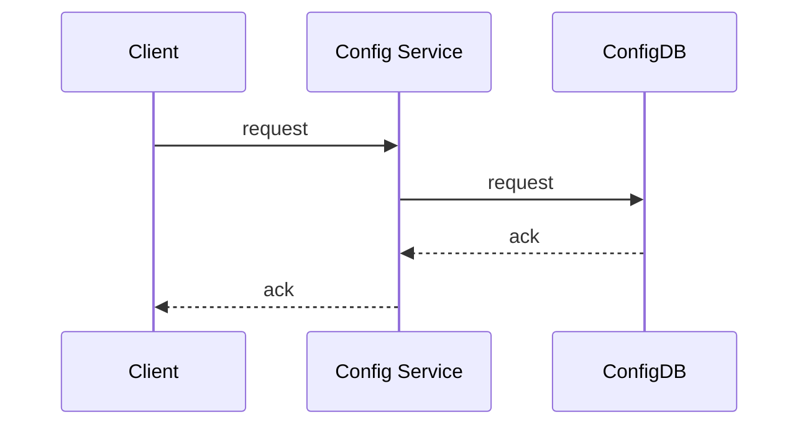

&nbsp;

# &nbsp;

# I、General design

## 1.1 Base model

The following is the base model of Apollo.

1. Users modify and publish the configuration in the configuration center
2. The configuration center notifies Apollo clients of configuration updates
3. Apollo client pulls the latest configuration from the configuration center, updates the local configuration and notifies the application


## 1.2 Architecture Module

The following figure provides an overview of Apollo's architecture modules. For a detailed description, you can refer to [Apollo Configuration Center Architecture Anatomy](https://mp.weixin.qq.com/s/-hUaQPzfsl9Lm3IqQW3VDQ).


The above diagram briefly describes the general design of Apollo, which we can see from bottom to top.

* Config Service provides configuration reading, pushing, etc., and serves Apollo clients



- Admin Service provides configuration modification, publishing and other functions, the service object is Apollo Portal (management interface).

  ```mermaid
  sequenceDiagram
  	Portal ->> Admin Service: r/w, publish appId/cluster/namespace
  	Admin Service ->> ConfigDB: r/w, publish appId/cluster/namespace
  	ConfigDB -->> Admin Service: ack
  	Admin Service -->> Portal: ack	
  ```

- Config Service and Admin Service are both multi-instance, stateless deployments, so they need to register themselves with Eureka and keep a heartbeat

- On top of Eureka we erected a layer of Meta Server to encapsulate Eureka's service discovery interface

  ```mermaid
  sequenceDiagram
      Client or Portal ->> Meta Server: discovery service's instances
  	Meta Server ->> Eureka: discovery service's instances
  	Eureka -->> Meta Server: service's instances
  	Meta Server -->> Client or Portal: service's instances
  ```

- Client accesses Meta Server through domain name to get Config Service service list (IP+Port), and then accesses the service directly through IP+Port, and at the same time will do load balance, error retry on Client side.

  ```mermaid
  sequenceDiagram
  	Client ->> Meta Server: discovery Config Service's instances
  	Meta Server -->> Client: Config Service's instances(Multiple IP+Port)
  	loop until success
  		Client ->> Client: load balance choose a Config Service instance
  		Client ->> Config Service: request
  		Config Service -->> Client: ack
  	end
  ```

- Portal accesses Meta Server through domain name to get Admin Service service list (IP+Port), and then directly accesses the service through IP+Port, and at the same time will do load balance, error retry on Portal side.

  ```mermaid
  sequenceDiagram
  	Portal ->> Meta Server: discovery Admin Service's instances
  	Meta Server -->> Portal: Admin Service's instances(Multiple IP+Port)
  	loop until success
  		Portal ->> Portal: load balance choose a Admin Service instance
  		Portal ->> Config Service: request
  		Config Service -->> Portal: ack
  	end	
  ```

- To simplify deployment, we will actually deploy the three logical roles Config Service, Eureka and Meta Server in the same JVM process.

  ```mermaid
  graph
  	subgraph JVM Process
  		1[Config Service]
  		2[Eureka]
  		3[Meta Server]
  	end
  ```

The actual deployment architecture can be found in [deployment-architecture](en/deployment/deployment-architecture.md)

### 1.2.1 Why Eureka

Why do we use Eureka as a service registry instead of the traditional zk and etcd? I have roughly summarized the reasons as follows.

* It provides a complete Service Registry and Service Discovery implementation
  * First of all, it provides a complete implementation and has also withstood the test of Netflix's own production environment, so it's relatively painless to use.
* Integration with Spring Cloud
  * Our project itself uses Spring Cloud and Spring Boot, and Spring Cloud has a very comprehensive set of open source code to integrate with Eureka, so it's very easy to use.
  * In addition, Eureka supports starting in our application's own container, which means that after our application is started, it acts as both an Eureka and a service provider. This greatly improves the availability of the service.
  * **This is the main reason why we chose Eureka over zk, etc. In order to improve the availability of the configuration center and reduce the complexity of deployment, we need to minimize external dependencies as much as possible.**
* Open Source
  * The last point is open source. Since the code is open source, it is very easy for us to understand how it is implemented and troubleshoot problems.

## 1.3 Overview of the modules

### 1.3.1 Config Service

* Provides configuration acquisition interface

  ```mermaid
  sequenceDiagram
  	Client ->> Config Service: get content of appId/cluster/namespace
  	opt if namespace is not cached
  		Config Service ->> ConfigDB: get content of appId/cluster/namespace
  		ConfigDB -->> Config Service: content of appId/cluster/namespace
  	end
  	Config Service -->> Client: content of appId/cluster/namespace
  ```

* provide configuration update push interface (based on Http long polling)
  * server-side use of [Spring DeferredResult](http://docs.spring.io/spring/docs/current/javadoc-api/org/springframework/web/context/request/async/DeferredResult.html) to achieve asynchronization, thus greatly increasing the number of long connections
  * currently using tomcat embed default configuration is up to 10,000 connections (can be adjusted), using a 4C8G virtual machine measured can support 10,000 connections, so meet the demand (an application instance will only launch a long connection).

* Interface service object is Apollo client

### 1.3.2 Admin Service

* Provide configuration management interface
* Provides interfaces for configuration modification, publishing, etc.
* Interface service object is Portal

### 1.3.3 Meta Server

* Portal accesses Meta Server via domain name to get Admin Service service list (IP+Port)
* Client accesses Meta Server via domain name to get the Config Service service list (IP+Port)
* Meta Server gets the service information of Config Service and Admin Service from Eureka, which is equivalent to an Eureka Client
* Adding a Meta Server role is mainly to encapsulate the details of service discovery, for Portal and Client, always get the service information of Admin Service and Config Service through an Http interface, without caring about the actual service registration and discovery components behind
* Meta Server is just a logical role, in deployment and Config Service is in a JVM process, so IP, port and Config Service consistent

### 1.3.4 Eureka

* Based on [Eureka](https://github.com/Netflix/eureka) and [Spring Cloud Netflix](https://cloud.spring.io/spring-cloud-netflix/) to provide service registration and discovery
* Config Service and Admin Service will register services with Eureka and keep a heartbeat
* For simplicity, Eureka is currently deployed with Config Service in a single JVM process (via Spring Cloud Netflix)

### 1.3.5 Portal

* Provides a web interface for users to manage configuration
* Get the list of Admin Service services (IP+Port) through Meta Server and access the services through IP+Port
* Do load balance, error retry on Portal side

### 1.3.6 Client

* Client program provided by Apollo to provide configuration acquisition, real-time update and other functions for the application
* Get the Config Service service list (IP+Port) through Meta Server, access the service through IP+Port
* Do load balance, error retry on Client side

## 1.4 E-R Diagram

### 1.4.1 Main E-R Diagram	


* **App**
  * App Information
* **AppNamespace**
  * Metainformation of Namespace under App
* **Cluster**
  * Cluster information
* **Namespace**
  * Namespace under Cluster
* **Item**
  * Namespace configuration, each Item is a key, value combination
* **Release**
  * Namespace release configuration, each release contains all the configuration of the Namespace at the time of release
* **Commit**
  * **Commit** * Namespace configuration change log
* **Audit**
  * Audit information that records which entity was manipulated by which user and when, using which method.

### 1.4.2 Permission Related E-R Diagram


* **User**
  * Apollo portal users
* **UserRole**
  * User and role relationships
* **Role**
  * Role
* **RolePermission**
  * The relationship between roles and permissions
* **Permission**
  * Permissions
  * Corresponds to specific entity resources and operations, such as modifying the configuration of NamespaceA, publishing the configuration of NamespaceB, etc.
* **Consumer**
  * Third-party applications
* **ConsumerToken**
  * token issued to the third-party application
* **ConsumerRole**
  * Third-party application and role relationship
* **ConsumerAudit**
  * Third-party application access audit

# II. Server-side design

## 2.1 Real-time push design after configuration release

An important feature in the configuration center is the real-time push to the client after the configuration is published. Here we briefly look at how this piece is designed to be implemented.

An important feature in the configuration center is the real-time push to the client after the configuration is published. Let's take a brief look at how this piece is designed to be implemented.


The above diagram briefly describes the general process of a configuration release.

1. the user operates the configuration release in the Portal
2. the Portal calls the interface of Admin Service to operate the release
3. Admin Service sends a ReleaseMessage to each Config Service after releasing the configuration
4. Config Service receives the ReleaseMessage and notifies the corresponding client

### 2.1.1 Implementation of Sending ReleaseMessage

After the configuration is released, Admin Service needs to notify all Config Service that there is a configuration release, so that Config Service can notify the corresponding client to pull the latest configuration.

Conceptually, this is a typical messaging scenario where Admin Service acts as a producer to send out messages and each Config Service acts as a consumer to consume the messages. The decoupling of Admin Service and Config Service can be well achieved by a Message Queue component.

In terms of implementation, considering the actual usage scenario of Apollo and in order to minimize external dependencies, we did not use external messaging middleware, but implemented a simple message queue through the database.

The implementation is as follows.

1. Admin Service inserts a message record into the ReleaseMessage table after the configuration release, and the message content is the AppId+Cluster+Namespace of the configuration release, see [DatabaseMessageSender](https://github.com/apolloconfig/apollo/blob/master/apollo-biz/src/main/java/com/ctrip/framework/apollo/biz/message/DatabaseMessageSender.java)
2. Config Service has a thread that scans the ReleaseMessage table once per second to see if there are new messages recorded, see [ReleaseMessageScanner](https://github.com/apolloconfig/apollo/blob/master/apollo-biz/src/main/java/com/ctrip/framework/apollo/biz/message/ReleaseMessageScanner.java)
3. Config Service notifies all message listeners if it finds a new message record [ReleaseMessageListener](https://github.com/apolloconfig/apollo/blob/master/apollo-biz/src/main/java/com/ctrip/framework/apollo/biz/message/ReleaseMessageListener.java) , as in [NotificationControllerV2](https://github.com/apolloconfig/apollo/blob/master/apollo-configservice/src/main/java/com/ctrip/framework/apollo/configservice/controller/NotificationControllerV2.java), for the registration process of the message listener see [ConfigServiceAutoConfiguration](https://github.com/apolloconfig/apollo/blob/master/apollo-configservice/src/main/java/com/ctrip/framework/apollo/configservice/ConfigServiceAutoConfiguration.java)
4. After NotificationControllerV2 gets the AppId+Cluster+Namespace of the configuration release, it will notify the corresponding client

The schematic diagram is as follows.


### 2.1.2 Config Service Notification Client Implementation

The previous section briefly described how NotificationControllerV2 learns that a configuration has been released, but how does NotificationControllerV2 notify the client when it learns that a configuration has been released?

The implementation is as follows.

1. the client initiates an Http request to the `notifications/v2` interface of the Config Service, which is [NotificationControllerV2](https://github.com/apolloconfig/apollo/blob/master/apollo-configservice/src/main/java/com/ctrip/framework/apollo/configservice/controller/NotificationControllerV2.java), see [ RemoteConfigLongPollService](https://github.com/apolloconfig/apollo/blob/master/apollo-client/src/main/java/com/ctrip/framework/apollo/internals/RemoteConfigLongPollService.java)
2. NotificationControllerV2 does not return the result immediately, but via [Spring DeferredResult](http://docs.spring.io/spring/docs/current/javadoc-api/org/springframework/web/context/request/async/DeferredResult.html) to put the request on hold
3. if no configuration of interest to the client is published within 60 seconds, then the Http status code 304 is returned to the client
4. If there is a configuration published that the client cares about, NotificationControllerV2 will call [setResult](http://docs.spring.io/spring/docs/current/javadoc-api/org/springframework/web/context/request/async/DeferredResult.html#setResult-T-) method of DeferredResult, passing in the namespace information with configuration changes, while the request is returned immediately. After the client gets the namespace with configuration changes from the returned result, it will immediately request the Config Service to get the latest configuration of the namespace.

# III. Client Design


The above diagram briefly describes the principle of Apollo client implementation.

1. the client and the server maintain a long connection, so that they can get the first push of configuration updates. (achieved through Http Long Polling) 2.
2. the client also regularly pulls the latest configuration of the application from the Apollo Configuration Center server.
   * This is a fallback mechanism to prevent the configuration from being updated due to the failure of the push mechanism.
   * The client will report the local version of the timed pull, so in general, for the timed pull operation, the server will return 304 - Not Modified
   * Timing frequency defaults to pulling every 5 minutes. Clients can also override this by specifying System Property: `apollo.refreshInterval` at runtime, in minutes.
3. After the client gets the latest configuration of the application from the Apollo Configuration Center server, it will be saved in memory
4. the client will cache a copy of the configuration fetched from the server on the local file system
   * 4. the client will cache a copy of the configuration obtained from the server in the local file system. In case of service unavailability or network failure, the configuration can still be restored locally
5. applications can get the latest configuration from the Apollo client, subscribe to configuration update notifications

## 3.1 Principle of integration with Spring

Apollo not only supports API to get the configuration, but also supports integration with Spring/Spring Boot, the integration principle is briefly described as follows.

Spring has added `ConfigurableEnvironment` and `PropertySource` since version 3.1.

* ConfigurableEnvironment
  * Spring's ApplicationContext will contain an Environment (implementing the ConfigurableEnvironment interface)
  * ConfigurableEnvironment itself contains a number of PropertySource
* PropertySource
  * PropertySource
  * can be interpreted as a number of Key - Value configuration of properties

The structure at runtime looks like this.


Note that there is an order of priority between PropertySource, if there is a Key present in more than one property source, then the property source in front of it takes precedence.

So for the above example.

* env.getProperty("key1") -> value1
* **env.getProperty("key2") -> value2**
* env.getProperty("key3") -> value4

With the above principles understood, the means of integrating Apollo with Spring/Spring Boot comes into play: during the application startup phase, Apollo fetches the configuration from the remote end, then assembles it into a PropertySource and inserts it into the first one, as shown in the following diagram.


The related code can be found in [PropertySourcesProcessor](https://github.com/apolloconfig/apollo/blob/master/apollo-client/src/main/java/com/ctrip/framework/apollo/spring/config/PropertySourcesProcessor.java)

# IV. Usability considerations

<table>
<thead>
<tr>
<th width="20%">Scene</th>
<th width="20%">Impact</th>
<th width="30%">Downgrade</th>
<th width="30%">reason</th>
</tr>
</thead>
<tbody>
<tr>
<td>A Config Service goes offline</td>
<td>No effect</td>
<td></td>
<td>Config Service is stateless, the client reconnects to other Config Service</td>
</tr>
<tr>
<td>All Config Services offline</td>
<td>Client cannot read the latest configuration, Portal has no effect</td>
<td>When the client restarts, the local cache configuration file can be read. If it is a newly expanded machine, you can obtain the cached configuration file from other machines. For details, please refer to <a href='/#/en/usage/java-sdk-user-guide?id=_123-local-cache-path'>Java Client Usage Guide - 1.2.3 Local Cache Path</a>
</td>
<td></td>
</tr>
<tr>
<td>A certain Admin Service goes offline</td>
<td>No effect</td>
<td></td>
<td>Admin Service is stateless, Portal reconnects to other Admin Service</td>
</tr>
<tr>
<td>All Admin Services are offline</td>
<td>The client is not affected, Portal cannot update the configuration</td>
<td></td>
<td></td>
</tr>
<tr>
<td>A Portal goes offline</td>
<td>No effect</td>
<td></td>
<td>Portal domain name binds multiple servers through SLB, and points to an available server after retrying</td>
</tr>
<tr>
<td>All Portals offline</td>
<td>The client is not affected, Portal cannot update the configuration</td>
<td></td>
<td></td>
</tr>
<tr>
<td>A data center goes offline</td>
<td>No effect</td>
<td></td>
<td>Multiple data centers are deployed, data is fully synchronized, and Meta Server/Portal domain names are automatically switched to other surviving data centers through SLB</td>
</tr>
<tr>
<td>Database down</td>
<td>The client is not affected, Portal cannot update the configuration</td>
<td>After the Config Service is enabled <a href="/#/en/deployment/distributed-deployment-guide?id=_323-config-servicecacheenabled-whether-to-enable-configuration-caching">configuration cache</a>, read the configuration Fetch is not affected by database downtime</td>
<td></td>
</tr>
</tbody>
</table>


# V. Monitoring related

## 5.1 Tracing

### 5.1.1 CAT

Apollo client and server currently support [CAT](https://github.com/dianping/cat) automatic management, so if your company has deployed CAT internally, Apollo will automatically enable CAT management as long as cat-client is introduced .

If you don't use CAT, don't worry, as long as cat-client is not introduced, Apollo will not enable CAT management.

Apollo also provides Tracer-related SPI, which can be easily connected to its own company's monitoring system.

For more information, please refer to [v0.4.0 Release Note](https://github.com/apolloconfig/apollo/releases/tag/v0.4.0)

### 5.1.2 SkyWalking

You can refer to the [apollo-skywalking-pro sample](https://github.com/hepyu/k8s-app-config/tree/master/product) contributed by [@hepyu](https://github.com/hepyu/standard/apollo-skywalking-pro).

## 5.2 Metrics

Since version 1.5.0, the Apollo server supports exposing metrics in prometheus format through `/prometheus`, such as `http://${someIp:somePort}/prometheus`
