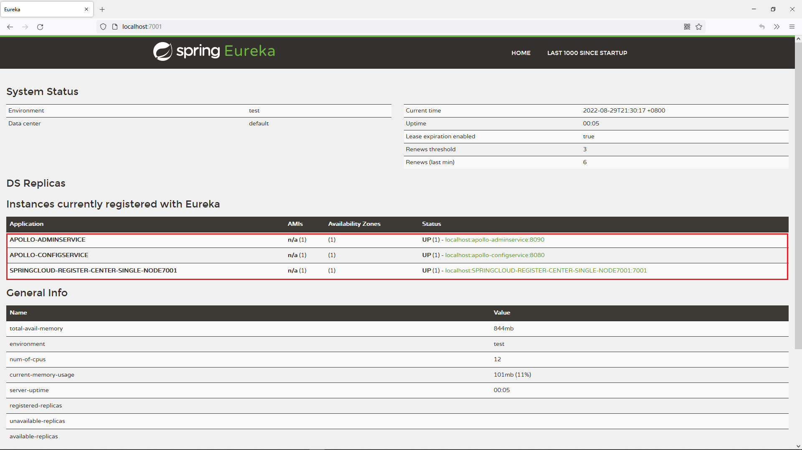
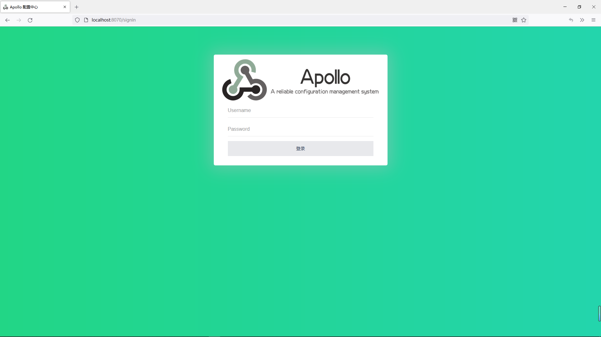

@include(@src/public/enhance/guidance/environment/windows/windows-server2016/windows-server2016-guidance.md)

# 1.搭建基础开发环境 {#1.}
@include(@src/public/enhance/guidance/environment/windows/windows-server2016/chapter/windows-server2016-guidance-chapter1.md)
## 1.3.安装jdk
### 1.3.1.安装jdk1.5
	下载jdk1.5(64位)
```
curl -fL -u software-1661635201061:b951fa2710ed220c45fe8104a47c32968160d016 \
"https://lingwh-generic.pkg.coding.net/coding-drive/software/jdk-1.5-windows-x64.zip?version=latest" \
-o jdk-1.5-windows-x64.zip
```
	配置环境变量
	JAVA_HOME
	D:\Install\develop\JDK\jdk1.5
	PATH
	%JAVA_HOME%\bin;%JAVA_HOME%\jre\bin
	CLASSPATH
	.;%JAVA_HOME%\lib;%JAVA_HOME%\lib\tools.jar
### 1.3.2.安装jdk1.6
	下载jdk1.6(64位)
```
curl -fL -u software-1661635269701:dc992411c4328c8b858f80dd75e26084c1430ce3 \
"https://lingwh-generic.pkg.coding.net/coding-drive/software/jdk-1.6-windows-x64.zip?version=latest" \
-o jdk-1.6-windows-x64.zip
```
	配置环境变量
	JAVA_HOME
	D:\Install\develop\JDK\jdk1.6
	PATH
	%JAVA_HOME%\bin;%JAVA_HOME%\jre\bin
	CLASSPATH
	.;%JAVA_HOME%\lib;%JAVA_HOME%\lib\tools.jar
### 1.3.3.安装jdk1.7
	下载jdk1.7(64位)
```
curl -fL -u software-1661635322447:bc66d997b7cf000b3932888504d1ac735fc4b530 \
"https://lingwh-generic.pkg.coding.net/coding-drive/software/jdk-1.7-windows-x64.zip?version=latest" \
-o jdk-1.7-windows-x64.zip
```
	配置环境变量
	JAVA_HOME
	D:\Install\develop\JDK\jdk1.7
	PATH
	%JAVA_HOME%\bin;%JAVA_HOME%\jre\bin
	CLASSPATH
	.;%JAVA_HOME%\lib;%JAVA_HOME%\lib\tools.jar
### 1.3.4.安装jdk1.8
	下载jdk1.8(64位)
```
curl -fL -u software-1661635322447:bc66d997b7cf000b3932888504d1ac735fc4b530 \
"https://lingwh-generic.pkg.coding.net/coding-drive/software/jdk-1.8-windows-x64.zip?version=latest" \
-o jdk-1.8-windows-x64.zip
```
	配置环境变量
	JAVA_HOME
	D:\Install\develop\JDK\jdk1.8
	PATH
	%JAVA_HOME%\bin;%JAVA_HOME%\jre\bin
	CLASSPATH
	.;%JAVA_HOME%\lib;%JAVA_HOME%\lib\tools.jar

# 2.搭建SpringCloud技术栈所需组件 {#2.}
@include(@src/public/enhance/guidance/environment/windows/windows-server2016/chapter/windows-server2016-guidance-chapter2.md)
## 2.3.搭建Zipkin
	安装jdk
详细参考-> <a href="/blogs/environment/windows/windows-server2016/shardings/windows-server2016-chapter-1.搭建基础开发环境.html#_1-3-安装jdk" target="href">安装jdk</a>

	创建存放安装包的目录->进入该目录->下载zipkin->重命名->赋予运行权限
```
mkdir -p /opt/software/springcloud/zipkin &&
cd /opt/software/springcloud/zipkin &&
curl -fL -u springcloud-1661567629477:e7770fbb167089a0ca2df33f8c03fa548c83b4c1 \
"https://lingwh-generic.pkg.coding.net/coding-drive/springcloud/zipkin-server-2.23.9-exec.jar?version=latest" \
-o zipkin-server-2.23.9-exec.jar &&
mv zipkin-server-2.23.9-exec.jar zipkin.jar &&
chmod +x zipkin.jar
```
	如有需要在防火墙开放端口

	启动zipkin
```
java -jar zipkin.jar
```

## 2.4.搭建Apollo配置中心
### 2.4.1.Apollo配置中心简介
	Apollo(阿波罗)是一款可靠的分布式配置管理中心，诞生于携程框架研发部，能够集中化管理应用不同环境、不同集群的配置，配置修改后能够实时推送到应用端，并且具备规范的权限、流程治理等特性，适用于微服务配置管理场景。

<a href="https://www.apolloconfig.com" target="_blank">官方网址</a>
```
https://www.apolloconfig.com
```
<a href="https://github.com/apolloconfig" target="_blank">官方网址(GITHUB)</a>
```
https://github.com/apolloconfig
```

### 2.4.2.基于Apollo内置的Eureka搭建Apollo配置中心
#### 2.4.2.1.单环境版(包含完整编译过程)
##### 2.4.2.1.1.下载工程,并在本地安装所有用到的依赖
```
https://gitee.com/lingwh1995/apollo2.0.1.git
```
##### 2.4.2.1.2.准备数据库环境
	在192.168.0.2上搭建Mysql数据库
详细参考-> <a href="/blogs/environment/centos/centos7/shardings/centos7-chapter-3.搭建基础开发环境.html#_3-5-安装mysql" target="_blank">安装mysql(8.x版本)</a>

##### 2.4.2.1.3.使用flyway脚本自动创建数据库环境
	a.修改apollo2.0.1/scripts/flyway/flyway-configdb.properties和apollo2.0.1/scripts/flyway/flyway-portaldb.properties中数据库连接信息为192.168.0.2相关配置
	b.修改apollo2.0.1/scripts/build.bat中的数据库连接信息为192.168.0.2相关配置
	c.在apollo2.0.1文件夹下执行如下两个命令；目的是使用flyway脚本自动创建数据库环境

```
mvn -N -Pconfigdb flyway:migrate
```

```
mvn -N -Pportaldb flyway:migrate
```
##### 2.4.2.1.4.获取jar包
	执行apollo2.0.1/scripts/build.bat,执行完成后可以得到下面三个jar包(最好是重命名一下)
	apollo2.0.1-built-in-eureka/apollo-adminservice/target/apollo-adminservice-2.0.1-SNAPSHOT.jar -> apollo-adminservice-2.0.1.jar
	apollo2.0.1/apollo-configservice/target/apollo-configservice-2.0.1-SNAPSHOT.jar	-> apollo-configservice-2.0.1.jar
	apollo2.0.1/apollo-portal/target/apollo-portal-2.0.1-SNAPSHOT.jar -> apollo-portal-2.0.1.jar
##### 2.4.2.1.5.创建启动文件夹
	a.创建名称为Apollo2.0.1_built_in_eureka_dev的文件夹(版本号以实际为准)
	b.把三个jar包放入文件夹中
	c.创建一个logs文件夹,里面存放日志文件,日志文件名称分别是apollo-configservice.log、apollo-adminservice.log、apollo-portal.log(注意:不用创建这三个文件,程序运行会自动创建这三个文件)
##### 2.4.2.1.6.编写一次启动三个jar的bat脚本
```
set url="192.168.0.2:3306"
set username="root"
set password="123456"

set dev_meta="http://localhost:8080/"
set portal_port="8070"

start "configService" java -Dapollo_profile=github  -Dspring.datasource.url=jdbc:mysql://%url%/ApolloConfigDB?characterEncoding=utf8 -Dspring.datasource.username=%username% -Dspring.datasource.password=%password% -Dlogging.file.name=.\logs\apollo-configservice.log -jar .\apollo-configservice-2.0.1.jar

start "adminService" java -Dapollo_profile=github   -Dspring.datasource.url=jdbc:mysql://%url%/ApolloConfigDB?characterEncoding=utf8 -Dspring.datasource.username=%username% -Dspring.datasource.password=%password% -Dlogging.file.name=.\logs\apollo-adminservice.log -jar .\apollo-adminservice-2.0.1.jar

start "portal" java -Dapollo_profile=github,auth -Ddev_meta=%dev_meta% -Dserver.port=%portal_port% -Dspring.datasource.url=jdbc:mysql://%url%/ApolloPortalDB?characterEncoding=utf8 -Dspring.datasource.username=%username% -Dspring.datasource.password=%password% -Dlogging.file.name=.\logs\apollo-portal.log -jar .\apollo-portal-2.0.1.jar
```
##### 2.4.2.1.7.测试Apollo
    Eureka注册中心
```
http://localhost:7001/
```
    看到如下界面代表apollo的adminservice服务和configservice服务启动成功


    Apollo配置中心
```
http://localhost:8070/
```

    登录用户名/密码: apollo/admin

##### 2.4.2.1.8.添加系统参数


	添加新部门
	key
```
organizations
```
	value
```
[{"orgId":"TEST1","orgName":"样例部门1"},{"orgId":"TEST2","orgName":"样例部门2"},{"orgId":"micro_service","orgName":"微服务部门"}]
```

#### 2.4.2.2.多环境版(包含完整编译过程)
##### 2.4.2.2.1.下载工程,并在本地安装所有用到的依赖
```
https://gitee.com/lingwh1995/apollo2.0.1.git
```
##### 2.4.2.2.2.准备数据库环境
	注意:dev和pro环境的configService、adminService用到的数据库需要分别部署,dev和pro环境的protal可以连接到同一套数据库

	在192.168.0.2上搭建Mysql数据库
详细参考-> <a href="/blogs/environment/centos/centos7/shardings/centos7-chapter-3.搭建基础开发环境.html#_3-5-安装mysql" target="_blank">安装mysql(8.x版本)</a>

	在192.168.0.3上搭建Mysql数据库
详细参考-> <a href="/blogs/environment/centos/centos7/shardings/centos7-chapter-3.搭建基础开发环境.html#_3-5-安装mysql" target="_blank">安装mysql(8.x版本)</a>
##### 2.4.2.2.3.使用flyway脚本自动创建数据库环境
	192.168.0.2
	a.修改apollo2.0.1/scripts/flyway/flyway-configdb.properties和apollo2.0.1/scripts/flyway/flyway-portaldb.properties中数据库连接信息为192.168.0.2相关配置
	b.修改apollo2.0.1/scripts/build.bat中的数据库连接信息为192.168.0.2相关配置
	c.在apollo2.0.1件夹下执行如下两个命令；目的是使用flyway脚本自动创建数据库环境

```
mvn -N -Pconfigdb flyway:migrate
```

```
mvn -N -Pportaldb flyway:migrate
```
	d.更新数据库数据(使用Apollo内置的Eureka一般不用执行这个操作,默认就是8080Eureka服务器)
```
UPDATE ApolloConfigDB.ServerConfig SET `Value` = "http://localhost:8080/eureka/" WHERE `key` = "eureka.service.url";
```

	192.168.0.3
	a.修改apollo2.0.1/scripts/flyway/flyway-configdb.properties中数据库连接信息为192.168.0.3相关配置
	b.在apollo2.0.1文件夹下执行如下命令
```
mvn -N -Pconfigdb flyway:migrate
```
	c.更新数据库数据
```
UPDATE ApolloConfigDB.ServerConfig SET `Value` = "http://localhost:8081/eureka/" WHERE `key` = "eureka.service.url";
```
##### 2.4.2.2.4.获取jar包
	执行apollo2.0.1-built-in-eureka/scripts/build.bat,执行完成后可以得到下面三个jar包(最好是重命名以下)
	apollo2.0.1/apollo-adminservice/target/apollo-adminservice-2.0.1-SNAPSHOT.jar->复制一份分别命名为
	  apollo-adminservice-2.0.1-dev.jar
	  apollo-adminservice-2.0.1-pro.jar
	apollo2.0.1/apollo-configservice/target/apollo-configservice-2.0.1-SNAPSHOT.jar->->复制一份分别命名为
	  apollo-configservice-2.0.1-dev.jar
	  apollo-configservice-2.0.1-pro.jar
	apollo2.0.1/apollo-portal/target/apollo-portal-2.0.1-SNAPSHOT.jar -> apollo-portal-2.0.1.jar
	注意:操作完成后共得到5个jar
##### 2.4.2.2.5.创建运行文件夹
	a.创建名称为Apollo2.0.1_eureka_built_in_pro的文件夹(版本号以实际为准)
	b.把五个jar包放入文件夹中
	c.创建一个logs文件夹,里面存放日志文件,日志文件名称分别是
	apollo-configservice-dev.log、apollo-configservice-pro.log、
    apollo-adminservice-dev.log、apollo-adminservice-pro.log、
	apollo-portal.log
##### 2.4.2.2.6.编写一次启动五个jar的bat脚本
```
rem dev环境数据库连接信息
set url_dev="192.168.0.2:3306"
set username_dev="root"
set password_dev="123456"
rem dev环境meta地址
set meta_dev="http://localhost:8080/"

rem pro环境数据库连接信息
set url_pro="192.168.0.3:3306"
set username_pro="root"
set password_pro="123456"
rem pro环境adminService访问端口
set adminService_port_pro="8091"
rem pro环境configService访问端口
set configService_port_pro="8081"
rem pro环境meta地址
set meta_pro="http://localhost:8081/"

rem portal端口
set portal_port="8070"

rem 启动dev环境configService
start "configService-dev" java -Dapollo_profile=github -Dspring.datasource.url=jdbc:mysql://%url_dev%/ApolloConfigDB?characterEncoding=utf8 -Dspring.datasource.username=%username_dev% -Dspring.datasource.password=%password_dev% -Dlogging.file.name=.\logs\apollo-configservice-dev.log -jar .\apollo-configservice-2.0.1-dev.jar
rem 启动dev环境adminService
start "adminService-dev" java -Dapollo_profile=github  -Dspring.datasource.url=jdbc:mysql://%url_dev%/ApolloConfigDB?characterEncoding=utf8 -Dspring.datasource.username=%username_dev% -Dspring.datasource.password=%password_dev% -Dlogging.file.name=.\logs\apollo-adminservice-dev.log -jar .\apollo-adminservice-2.0.1-dev.jar
rem 启动pro环境configService
start "configService-pro" java -Dapollo_profile=github -DServer.port=%configService_port_pro% -Dspring.datasource.url=jdbc:mysql://%url_pro%/ApolloConfigDB?characterEncoding=utf8 -Dspring.datasource.username=%username_pro% -Dspring.datasource.password=%password_pro% -Dlogging.file.name=.\logs\apollo-configservice-pro.log -jar .\apollo-configservice-2.0.1-pro.jar
rem 启动pro环境adminService
start "adminService-pro" java -Dapollo_profile=github  -DServer.port=%adminService_port_pro%  -Dspring.datasource.url=jdbc:mysql://%url_pro%/ApolloConfigDB?characterEncoding=utf8 -Dspring.datasource.username=%username_pro% -Dspring.datasource.password=%password_pro% -Dlogging.file.name=.\logs\apollo-adminservice-pro.log -jar .\apollo-adminservice-2.0.1-pro.jar
rem 启动portal
start "ApolloPortal" java -Dapollo_profile=github,auth -Ddev_meta=%meta_dev% -Dpro_meta=%meta_pro% -Dserver.port=%portal_port% -Dspring.datasource.url=jdbc:mysql://%url_dev%/ApolloPortalDB?characterEncoding=utf8 -Dspring.datasource.username=%username_dev% -Dspring.datasource.password=%password_dev% -Dlogging.file.name=.\logs\apollo-portal.log -jar .\apollo-portal-2.0.1.jar
```
##### 2.4.2.2.7.测试Apollo
	Eureka注册中心1
```
http://localhost:8080/
```
	Eureka注册中心2
```
http://localhost:8081/
```
	Apollo配置中心
```
http://localhost:8070/
```

    登录用户名/密码: apollo/admin

##### 2.4.2.2.8.添加系统参数


	添加新部门
	key
```
organizations
```
	value
```
[{"orgId":"TEST1","orgName":"样例部门1"},{"orgId":"TEST2","orgName":"样例部门2"},{"orgId":"micro_service","orgName":"微服务部门"}]
```

	创建多环境
	key
```
apollo.portal.envs
```
```
value:  dev,pro
```
##### 2.4.2.2.9.注意事项
	a.dev环境和pro环境需要不同的数据库地址,
	即需要两套Mysql环境,第一套中有apolloconfigdb、apolloportaldb两个库,第二套 环境中只有apolloconfigdb这个库
	b.启动dev环境和pro环境时,不要再运行参数中覆盖eureka的service-url,要修改数据库中的数据,因为这个配置是从数据库中获取的,当数据库中没有这个参数时,使用启动时参数修改才有效
	192.168.0.2(使用Apollo内置的Eureka一般不用执行这个操作,默认就是8080Eureka服务器)
```
UPDATE ApolloConfigDB.ServerConfig SET `Value` = "http://localhost:8080/eureka/" WHERE `key` = "eureka.service.url";
```
	192.168.0.3
```
UPDATE ApolloConfigDB.ServerConfig SET `Value` = "http://localhost:8081/eureka/" WHERE `key` = "eureka.service.url";
```
	c.如果启动后多环境现实不正常,直接重启下Portal,再刷新页面即可

#### 2.4.2.3.开箱即用的Apollo(已经修改好了需要修改的内容)
##### 2.4.2.3.1.下载工程,并在本地安装所有用到的依赖
```
https://gitee.com/lingwh1995/apollo2.0.1-built-in-eureka.git
```
##### 2.4.2.3.2.获取jar包
	a.执行apollo2.0.1-built-in-eureka/scripts/build.bat
	b.在下面三个位置找到编译好的jar包
	apollo2.0.1-built-in-eureka/apollo-adminservice/target
	apollo2.0.1-built-in-eureka/apollo-configservice/target
	apollo2.0.1-built-in-eureka/apollo-portal/target
##### 2.4.2.3.3.如何修改使用到的参数
	在启动脚本中对使用到的参数进行设置,如-Dserver.port=8888

### 2.4.3.基于独立部署的Eureka搭建Apollo配置中心
#### 2.4.3.1.单环境版(包含完整编译过程)
##### 2.4.3.1.1.下载工程,并在本地安装所有用到的依赖
```
https://gitee.com/lingwh1995/apollo2.0.1.git
```
##### 2.4.3.1.2.准备数据库环境
	在192.168.0.2上搭建Mysql数据库
详细参考-> <a href="/blogs/environment/centos/centos7/shardings/centos7-chapter-3.搭建基础开发环境.html#_3-5-安装mysql" target="_blank">安装mysql(8.x版本)</a>
##### 2.4.3.1.3.使用flyway脚本自动创建数据库环境
	a.修改apollo2.0.1/scripts/flyway/flyway-configdb.properties和apollo2.0.1/scripts/flyway/flyway-portaldb.properties中数据库连接信息为192.168.0.2相关配置
	b.修改apollo2.0.1/scripts/build.bat中的数据库连接信息为192.168.0.2相关配置
	c.在apollo2.0.1文件夹下执行如下两个命令；目的是使用flyway脚本自动创建数据库环境

```
mvn -N -Pconfigdb flyway:migrate
```

```
mvn -N -Pportaldb flyway:migrate
```
	d.数据库创建好之后在ApolloConfigDB库中执行:将Apollo自带的Eureka的地址换成外部Eureka的地址
```
UPDATE ApolloConfigDB.ServerConfig SET `Value` = "http://localhost:7001/eureka/" WHERE `key` = "eureka.service.url";
```
##### 2.4.3.1.4.改造apollo-configservice
	a.修改apollo2.0.1/apollo-configservice/src/main/resources/application.yml
	添加下面配置,控制程序 关闭使用@EnableEurekaServer注解,开启使用@EnableEurekaClient注解
	apollo:
	eureka:
	  server:
	  enabled: false
	  client:
	  enable: true
	b.创建启动EurekaClient的配置类
	路径
	apollo2.0.1/apollo-configservice/src/main/java/com/ctrip/framework/apollo/configservice/ConfigServerEurekaClientConfigure.java
	代码
```
@Configuration
@EnableEurekaClient
@ConditionalOnProperty(name = "apollo.eureka.client.enabled", havingValue = "true", matchIfMissing = true)
public class ConfigServerEurekaClientConfigure {
}
```
	c.给pom中添加eureka-client相关依赖,注意版本设置为和微服务应用使用的Eureka一致的版本
```
<dependency>
	<groupId>org.springframework.cloud</groupId>
	<artifactId>spring-cloud-starter-netflix-eureka-client</artifactId>
	<version>2.2.1.RELEASE</version>
	<exclusions>
		<exclusion>
			<groupId>com.sun.jersey</groupId>
			<artifactId>jersey-client</artifactId>
		</exclusion>
		<exclusion>
			<groupId>com.sun.jersey</groupId>
			<artifactId>jersey-core</artifactId>
		</exclusion>
		<exclusion>
			<groupId>com.sun.jersey.contribs</groupId>
			<artifactId>jersey-apache-client4</artifactId>
		</exclusion>
	</exclusions>
</dependency>
```
##### 2.4.3.1.5.改造apollo-adminservice
	a.修改apollo2.0.1/apollo-configservice/src/main/resources/application.yml
	添加下面配置,控制程序 关闭使用@EnableEurekaServer注解,开启使用@EnableEurekaClient注解
	apollo:
	eureka:
	  server:
	  enabled: false
	  client:
	  enable: true
	b.创建启动EurekaClient的配置类
	路径
	apollo2.0.1/apollo-adminservice/src/main/java/com/ctrip/framework/apollo/adminservice/ConfigServerEurekaClientConfigure.java
	代码
```
@Configuration
@EnableEurekaClient
@ConditionalOnProperty(name = "apollo.eureka.client.enabled", havingValue = "true", matchIfMissing = true)
public class ConfigServerEurekaClientConfigure {
}
```
	c.给pom中添加eureka-client相关依赖,注意版本设置为和外部使用的Eureka一致的版本
```
<dependency>
	<groupId>org.springframework.cloud</groupId>
	<artifactId>spring-cloud-starter-netflix-eureka-client</artifactId>
	<version>2.2.1.RELEASE</version>
	<exclusions>
		<exclusion>
			<groupId>com.sun.jersey</groupId>
			<artifactId>jersey-client</artifactId>
		</exclusion>
		<exclusion>
			<groupId>com.sun.jersey</groupId>
			<artifactId>jersey-core</artifactId>
		</exclusion>
		<exclusion>
			<groupId>com.sun.jersey.contribs</groupId>
			<artifactId>jersey-apache-client4</artifactId>
		</exclusion>
	</exclusions>
</dependency>
```
##### 2.4.3.1.6.获取jar包
	执行apollo2.0.1/scripts/build.bat,执行完成后可以得到下面三个jar包(最好是重命名以下)
	apollo2.0.1/apollo-adminservice/target/apollo-adminservice-2.0.1-SNAPSHOT.jar -> apollo-adminservice-2.0.1.jar
	apollo2.0.1/apollo-configservice/target/apollo-configservice-2.0.1-SNAPSHOT.jar -> apollo-configservice-2.0.1.jar
	apollo2.0.1/apollo-portal/target/apollo-portal-2.0.1-SNAPSHOT.jar -> apollo-portal-2.0.1.jar
##### 2.4.3.1.7.创建运行文件夹
	a.创建名称为Apollo2.0.1_eureka_dev的文件夹(版本号以实际为准)
	b.把三个jar包放入文件夹中
	c.创建一个logs文件夹,里面存放日志文件,日志文件名称分别是apollo-configservice.log、apollo-adminservice.log、apollo-portal.log(注意:不用创建这三个文件,程序运行会自动创建这三个文件)
##### 2.4.3.1.8.编写一次启动三个jar的bat脚本
```
set url="192.168.0.2:3306"
set username="root"
set password="123456"
set defaultZone="http://localhost:7001/eureka/"

start "configService" java -Dapollo_profile=github -Deureka.client.serviceUrl.defaultZone=%defaultZone%  -Dspring.datasource.url=jdbc:mysql://%url%/ApolloConfigDB?characterEncoding=utf8 -Dspring.datasource.username=%username% -Dspring.datasource.password=%password% -Dlogging.file.name=.\logs\apollo-configservice.log -jar .\apollo-configservice-2.0.1.jar
start "adminService" java -Dapollo_profile=github -Deureka.client.serviceUrl.defaultZone=%defaultZone%   -Dspring.datasource.url=jdbc:mysql://%url%/ApolloConfigDB?characterEncoding=utf8 -Dspring.datasource.username=%username% -Dspring.datasource.password=%password% -Dlogging.file.name=.\logs\apollo-adminservice.log -jar .\apollo-adminservice-2.0.1.jar
start "ApolloPortal" java -Dapollo_profile=github,auth -Ddev_meta=http://localhost:8080/ -Dserver.port=8070 -Dspring.datasource.url=jdbc:mysql://%url%/ApolloPortalDB?characterEncoding=utf8 -Dspring.datasource.username=%username% -Dspring.datasource.password=%password% -Dlogging.file.name=.\logs\apollo-portal.log -jar .\apollo-portal-2.0.1.jar
```
##### 2.4.3.1.9.测试Apollo
	访问地址
	Eureka注册中心
```
http://localhost:8080/
```
	Apollo配置中心
```
http://localhost:8070/
```

    登录用户名/密码: apollo/admin

##### 2.4.3.1.10.添加系统参数


	添加新部门
	key
```
organizations
```
	value
```
[{"orgId":"TEST1","orgName":"样例部门1"},{"orgId":"TEST2","orgName":"样例部门2"},{"orgId":"micro_service","orgName":"微服务部门"}]
```

#### 2.4.3.2.多环境版(包含完整编译过程)
##### 2.4.3.2.1.下载工程,并在本地安装所有用到的依赖
```
https://gitee.com/lingwh1995/apollo2.0.1.git
```
##### 2.4.3.2.2.准备数据库环境
	注意:dev和pro环境的configService、adminService用到的数据库需要分别部署,dev和pro环境的protal可以连接到同一套数据库

	在192.168.0.2上搭建Mysql数据库
详细参考-> <a href="/blogs/environment/centos/centos7/shardings/centos7-chapter-3.搭建基础开发环境.html#_3-5-安装mysql" target="_blank">安装mysql(8.x版本)</a>

	在192.168.0.3上搭建Mysql数据库
详细参考-> <a href="/blogs/environment/centos/centos7/shardings/centos7-chapter-3.搭建基础开发环境.html#_3-5-安装mysql" target="_blank">安装mysql(8.x版本)</a>
##### 2.4.3.2.3.使用flyway脚本自动创建数据库环境
	192.168.0.2
	a.修改apollo2.0.1/scripts/flyway/flyway-configdb.properties和apollo2.0.1-eureka/scripts/flyway/flyway-portaldb.properties中数据库连接信息为192.168.0.2相关配置
	b.修改apollo2.0.1/scripts/build.bat中的数据库联连接信息
	c.在apollo2.0.1文件夹下执行如下两个命令,目的是使用flyway脚本自动创建数据库环境
```
mvn -N -Pconfigdb flyway:migrate
```
```
mvn -N -Pportaldb flyway:migrate
```
	d.更新数据库数据
```
UPDATE ApolloConfigDB.ServerConfig SET `Value` = "http://localhost:7001/eureka/" WHERE `key` = "eureka.service.url";
```

	192.168.0.3
	a.修改apollo2.0.1-eureka/scripts/flyway/flyway-configdb.properties中数据库连接信息修改为192.168.0.3相关配置
	b.在apollo2.0.1-eureka文件夹下执行如下命令
```
mvn -N -Pconfigdb flyway:migrate
```
	c.更新数据库数据
```
UPDATE ApolloConfigDB.ServerConfig SET `Value` = "http://localhost:7002/eureka/" WHERE `key` = "eureka.service.url";
```
##### 2.4.3.2.4.改造apollo-configservice
	a.修改apollo2.0.1/apollo-configservice/src/main/resources/application.yml
	添加下面配置,控制程序 关闭使用@EnableEurekaServer注解,开启使用@EnableEurekaClient注解
	apollo:
	eureka:
	  server:
	  enabled: false
	  client:
	  enable: true
	b.创建启动EurekaClient的配置类:
	路径
	apollo2.0.1/apollo-configservice/src/main/java/com/ctrip/framework/apollo/configservice/ConfigServerEurekaClientConfigure.java
	代码
```
@Configuration
@EnableEurekaClient
@ConditionalOnProperty(name = "apollo.eureka.client.enabled", havingValue = "true", matchIfMissing = true)
public class ConfigServerEurekaClientConfigure {
}
```
	c.给pom中添加eureka-client相关依赖,注意版本设置为和外部使用的Eureka一致的版本
```
<dependency>
	<groupId>org.springframework.cloud</groupId>
	<artifactId>spring-cloud-starter-netflix-eureka-client</artifactId>
	<version>2.2.1.RELEASE</version>
	<exclusions>
		<exclusion>
			<groupId>com.sun.jersey</groupId>
			<artifactId>jersey-client</artifactId>
		</exclusion>
		<exclusion>
			<groupId>com.sun.jersey</groupId>
			<artifactId>jersey-core</artifactId>
		</exclusion>
		<exclusion>
			<groupId>com.sun.jersey.contribs</groupId>
			<artifactId>jersey-apache-client4</artifactId>
		</exclusion>
	</exclusions>
</dependency>
```
##### 2.4.3.2.5.改造apollo-adminservice
	a.修改apollo2.0.1/apollo-configservice/src/main/resources/application.yml
	添加下面配置,控制程序 关闭使用@EnableEurekaServer注解,开启使用@EnableEurekaClient注解
	apollo:
	eureka:
	  server:
	  enabled: false
	  client:
	  enable: true
	b.创建启动EurekaClient的配置类:
	路径
	apollo2.0.1/apollo-adminservice/src/main/java/com/ctrip/framework/apollo/adminservice/ConfigServerEurekaClientConfigure.java
	代码
```
@Configuration
@EnableEurekaClient
@ConditionalOnProperty(name = "apollo.eureka.client.enabled", havingValue = "true", matchIfMissing = true)
public class ConfigServerEurekaClientConfigure {
}
```
	c.给pom中添加eureka-client相关依赖,注意版本设置为和外部使用的Eureka一致的版本
```
<dependency>
	<groupId>org.springframework.cloud</groupId>
	<artifactId>spring-cloud-starter-netflix-eureka-client</artifactId>
	<version>2.2.1.RELEASE</version>
	<exclusions>
		<exclusion>
			<groupId>com.sun.jersey</groupId>
			<artifactId>jersey-client</artifactId>
		</exclusion>
		<exclusion>
			<groupId>com.sun.jersey</groupId>
			<artifactId>jersey-core</artifactId>
		</exclusion>
		<exclusion>
			<groupId>com.sun.jersey.contribs</groupId>
			<artifactId>jersey-apache-client4</artifactId>
		</exclusion>
	</exclusions>
</dependency>
```
##### 2.4.3.2.6.获取jar包
	执行apollo2.0.1/scripts/build.bat,执行完成后可以得到下面三个jar包(最好是重命名以下)
	apollo2.0.1/apollo-adminservice/target/apollo-adminservice-2.0.1-SNAPSHOT.jar->复制一份分别命名为
	  apollo-adminservice-2.0.1-dev.jar
	  apollo-adminservice-2.0.1-pro.jar
	apollo2.0.1/apollo-configservice/target/apollo-configservice-2.0.1-SNAPSHOT.jar->->复制一份分别命名为
	  apollo-configservice-2.0.1-dev.jar
	  apollo-configservice-2.0.1-pro.jar
	apollo2.0.1/apollo-portal/target/apollo-portal-2.0.1-SNAPSHOT.jar -> apollo-portal-2.0.1.jar
	注意:操作完成后共得到5个jar

##### 2.4.3.2.7.创建运行文件夹
	a.创建名称为Apollo2.0.1_eureka_pro的文件夹(版本号以实际为准)
	b.把五个jar包放入文件夹中
	c.创建一个logs文件夹,里面存放日志文件,日志文件名称分别是
	apollo-configservice-dev.log、apollo-configservice-pro.log、
	apollo-adminservice-dev.log、apollo-adminservice-pro.log、
	apollo-portal.log
##### 2.4.3.2.8.编写一次启动五个jar的bat脚本
```
rem dev环境数据库连接信息
set url_dev="192.168.0.2:3306"
set username_dev="root"
set password_dev="123456"
rem dev环境meta地址
set meta_dev="http://localhost:8080/"

rem pro环境数据库连接信息
set url_pro="192.168.0.3:3306"
set username_pro="root"
set password_pro="123456"
rem pro环境adminService访问端口
set adminService_port_pro="8091"
rem pro环境configService访问端口
set configService_port_pro="8081"
rem pro环境meta地址
set meta_pro="http://localhost:8081/"

rem portal端口
set portal_port="8070"

rem 启动dev环境configService
start "configService-dev" java -Dapollo_profile=github -Dspring.datasource.url=jdbc:mysql://%url_dev%/ApolloConfigDB?characterEncoding=utf8 -Dspring.datasource.username=%username_dev% -Dspring.datasource.password=%password_dev% -Dlogging.file.name=.\logs\apollo-configservice-dev.log -jar .\apollo-configservice-2.0.1-dev.jar
rem 启动dev环境adminService
start "adminService-dev" java -Dapollo_profile=github  -Dspring.datasource.url=jdbc:mysql://%url_dev%/ApolloConfigDB?characterEncoding=utf8 -Dspring.datasource.username=%username_dev% -Dspring.datasource.password=%password_dev% -Dlogging.file.name=.\logs\apollo-adminservice-dev.log -jar .\apollo-adminservice-2.0.1-dev.jar
rem 启动pro环境configService
start "configService-pro" java -Dapollo_profile=github -DServer.port=%configService_port_pro% -Dspring.datasource.url=jdbc:mysql://%url_pro%/ApolloConfigDB?characterEncoding=utf8 -Dspring.datasource.username=%username_pro% -Dspring.datasource.password=%password_pro% -Dlogging.file.name=.\logs\apollo-configservice-pro.log -jar .\apollo-configservice-2.0.1-pro.jar
rem 启动pro环境adminService
start "adminService-pro" java -Dapollo_profile=github  -DServer.port=%adminService_port_pro%  -Dspring.datasource.url=jdbc:mysql://%url_pro%/ApolloConfigDB?characterEncoding=utf8 -Dspring.datasource.username=%username_pro% -Dspring.datasource.password=%password_pro% -Dlogging.file.name=.\logs\apollo-adminservice-pro.log -jar .\apollo-adminservice-2.0.1-pro.jar
rem 启动portal
start "ApolloPortal" java -Dapollo_profile=github,auth -Ddev_meta=%meta_dev% -Dpro_meta=%meta_pro% -Dserver.port=%portal_port% -Dspring.datasource.url=jdbc:mysql://%url_dev%/ApolloPortalDB?characterEncoding=utf8 -Dspring.datasource.username=%username_dev% -Dspring.datasource.password=%password_dev% -Dlogging.file.name=.\logs\apollo-portal.log -jar .\apollo-portal-2.0.1.jar
```
##### 2.4.3.2.9.测试Apollo
	Eureka注册中心1
```
http://localhost:7001/
```
	Eureka注册中心2
```
http://localhost:7002/
```
	Apollo配置中心
```
http://localhost:8070/
```

    登录用户名/密码: apollo/admin

##### 2.4.3.2.10.添加系统参数


	添加新部门
	key
```
organizations
```
	value
```
[{"orgId":"TEST1","orgName":"样例部门1"},{"orgId":"TEST2","orgName":"样例部门2"},{"orgId":"micro_service","orgName":"微服务部门"}]
```

	创建多环境
	key
```
apollo.portal.envs
```
```
value:  dev,pro
```
##### 2.4.3.2.11.特別注意事项
	a.dev环境和pro环境需要不同的数据库地址即需要两套Mysql环境,第一套中有apolloconfigdb、apolloportaldb两个库,第二套环境中只有apolloconfigdb这个库
	b.dev环境和pro环境需要不同的Eureka地址,即需要两套Eureka环境
	c.启动dev环境和pro环境时,不要在jvm运行参数中覆盖eureka的service-url,要修改数据库中的数据,因为这个配置是从数据库中获取的
	192.168.0.2
```
UPDATE ApolloConfigDB.ServerConfig SET `Value` = "http://localhost:7001/eureka/" WHERE `key` = "eureka.service.url";
```
	192.168.0.3
```
UPDATE ApolloConfigDB.ServerConfig SET `Value` = "http://localhost:7002/eureka/" WHERE `key` = "eureka.service.url";
```
	当数据库中没有这个参数时,使用启动时参数修改才有效
	d.如果启动后多环境现实不正常,直接重启下Portal,再刷新页面即可

#### 2.4.3.3.开箱即用的Apollo(已经修改好了需要修改的内容)
##### 2.4.3.3.1.下载工程,并在本地安装所有用到的依赖
```
https://gitee.com/lingwh1995/apollo2.0.1-eureka.git
```
##### 2.4.3.3.2.获取jar包
	a.执行apollo2.0.1-eureka/scripts/build.bat
	b.在下面三个位置找到编译好的jar包
	apollo2.0.1-eureka/apollo-adminservice/target
	apollo2.0.1-eureka/apollo-configservice/target
	apollo2.0.1-eureka/apollo-portal/target
##### 2.4.3.3.3.如何修改使用到的参数
	在启动脚本中对使用到的参数进行设置,如-Dserver.port=8888

### 2.4.4.基于Zookeeper搭建Apollo配置中心
#### 2.4.4.1.单环境版(包含完整编译过程)
##### 2.4.4.1.1.下载工程,并在本地安装所有用到的依赖
```
https://gitee.com/lingwh1995/apollo2.0.1.git
```
##### 2.4.4.1.2.准备数据库环境
	在192.168.0.2上搭建Mysql数据库
详细参考-> <a href="/blogs/environment/centos/centos7/shardings/centos7-chapter-3.搭建基础开发环境.html#_3-5-安装mysql" target="_blank">安装mysql(8.x版本)</a>
##### 2.4.4.1.3.使用flyway脚本自动创建数据库环境
	a.修改apollo2.0.1/scripts/flyway/flyway-configdb.properties和apollo2.0.1/scripts/flyway/flyway-portaldb.properties中的数据库连接信息为192.168.0.2相关配置
	b.在apollo2.0.1文件夹下执行如下两个命令,目的是使用flyway脚本自动创建数据库环境
	  特别注意:如果已经创建好了数据库环境这一步骤可以省略
```
mvn -N -Pconfigdb flyway:migrate
```
```
mvn -N -Pportaldb flyway:migrate
```
##### 2.4.4.1.4.修改编译命令
	修改apollo2.0.1/scripts/build.sh/build.bat，将config-service和admin-service的maven编译命令更改为
```
mvn clean package -Pgithub -DskipTests -pl apollo-configservice,apollo-adminservice -am -Dapollo_profile=github,zookeeper-discovery -Dspring_datasource_url=$apollo_config_db_url -Dspring_datasource_username=$apollo_config_db_username -Dspring_datasource_password=$apollo_config_db_password
```
##### 2.4.4.1.5.准备Zookeeper环境
	在192.168.0.2上搭建Zookeeper环境
##### 2.4.4.1.6.修改配置文件
	分别修改apollo2.0.1/apollo-configservice/src/main/config和apollo2.0.1/apollo-adminservice/src/main/config安装包中config目录下的application-github.properties，配置zookeeper连接信息
	#注意:核心是将spring.cloud.zookeeper.connect-string这个配置进来,后面的连接信息可以在外面直接覆盖
```
spring.cloud.zookeeper.connect-string=127.0.0.1:2181
```
##### 2.4.4.1.7.获取jar包
	执行apollo2.0.1/scripts/build.bat,执行完成后可以得到下面三个jar包(最好是重命名以下)
	apollo2.0.1/apollo-adminservice/target/apollo-adminservice-2.0.1-SNAPSHOT.jar -> apollo-adminservice-2.0.1.jar
	apollo2.0.1/apollo-configservice/target/apollo-configservice-2.0.1-SNAPSHOT.jar	-> apollo-configservice-2.0.1.jar
	apollo2.0.1/apollo-portal/target/apollo-portal-2.0.1-SNAPSHOT.jar -> apollo-portal-2.0.1.jar
##### 2.4.4.1.8.创建运行文件夹
	a.创建名称为Apollo2.0.1_zookeeper_dev的文件夹(版本号以实际为准)
	b.把三个jar包放入文件夹中
	c.创建一个logs文件夹,里面存放日志文件,日志文件名称分别是apollo-configservice.log、apollo-adminservice.log、apollo-portal.log(注意:不用创建这三个文件,程序运行会自动创建这三个文件)
##### 2.4.4.1.9.编写一次启动三个jar的bat脚本
```
set url="192.168.0.2:3306"
set username="root"
set password="123456"
set dev_meta="http://localhost:8080/"
set portal_port="8070"
set zookeeper_connect-string="192.168.0.2:2181"

start "configService" java -Dapollo_profile=github  -Dspring.cloud.zookeeper.connect-string=%zookeeper_connect-string% -Dspring.datasource.url=jdbc:mysql://%url%/ApolloConfigDB?characterEncoding=utf8 -Dspring.datasource.username=%username% -Dspring.datasource.password=%password% -Dlogging.file.name=.\logs\apollo-configservice.log -jar .\apollo-configservice-2.0.1.jar
start "adminService" java -Dapollo_profile=github   -Dspring.cloud.zookeeper.connect-string=%zookeeper_connect-string% -Dspring.datasource.url=jdbc:mysql://%url%/ApolloConfigDB?characterEncoding=utf8 -Dspring.datasource.username=%username% -Dspring.datasource.password=%password% -Dlogging.file.name=.\logs\apollo-adminservice.log -jar .\apollo-adminservice-2.0.1.jar
start "portal" java -Dapollo_profile=github,auth -Ddev_meta=%dev_meta% -Dserver.port=%portal_port% -Dspring.datasource.url=jdbc:mysql://%url%/ApolloPortalDB?characterEncoding=utf8 -Dspring.datasource.username=%username% -Dspring.datasource.password=%password% -Dlogging.file.name=.\logs\apollo-portal.log -jar .\apollo-portal-2.0.1.jar
```
##### 2.4.4.1.10.测试Apollo
	Eureka注册中心
```
http://localhost:8080/
```
	Apollo配置中心
```
http://localhost:8070/
```

    登录用户名/密码: apollo/admin

##### 2.4.4.1.11.添加系统参数


	添加新部门
	key
```
organizations
```
	value
```
[{"orgId":"TEST1","orgName":"样例部门1"},{"orgId":"TEST2","orgName":"样例部门2"},{"orgId":"micro_service","orgName":"微服务部门"}]
```

#### 2.4.4.2.多环境版(包含完整编译过程)
##### 2.4.4.2.1.下载工程,并在本地安装所有用到的依赖
```
https://gitee.com/lingwh1995/apollo2.0.1.git
```
##### 2.4.4.2.2.准备数据库环境
	注意:dev和pro环境的configService、adminService用到的数据库需要分别部署,dev和pro环境的protal可以连接到同一套数据库

	在192.168.0.2上搭建Mysql数据库
详细参考-> <a href="/blogs/environment/centos/centos7/shardings/centos7-chapter-3.搭建基础开发环境.html#_3-5-安装mysql" target="_blank">安装mysql(8.x版本)</a>

	在192.168.0.3上搭建Mysql数据库
详细参考-> <a href="/blogs/environment/centos/centos7/shardings/centos7-chapter-3.搭建基础开发环境.html#_3-5-安装mysql" target="_blank">安装mysql(8.x版本)</a>
##### 2.4.4.2.3.使用flyway脚本自动创建数据库环境
	192.168.0.2
	a.修改apollo2.0.1/scripts/flyway/flyway-configdb.properties和apollo2.0.1-zookeeper/scripts/flyway/flyway-portaldb.properties中数据库连接信息修改为192.168.0.2相关配置
	b.修改apollo2.0.1/scripts/build.bat中的数据库联连接信息
	c.在apollo2.0.1文件夹下执行如下两个命令；目的是使用flyway脚本自动创建数据库环境
```
mvn -N -Pconfigdb flyway:migrate
```
```
mvn -N -Pportaldb flyway:migrate
```

	192.168.0.3
	a.修改apollo2.0.1/scripts/flyway/flyway-configdb.properties中数据库连接信息修改为192.168.0.3相关配置
	b.在apollo2.0.1文件夹下执行如下命令
```
mvn -N -Pconfigdb flyway:migrate
```
##### 2.4.4.2.4.准备Zookeeper环境
	在192.168.0.2、192.168.0.3两台机器上分别搭建好Zookeeper环境
##### 2.4.4.2.5.更改编译命令
	修改apollo2.0.1/scripts/build.sh/build.bat，将config-service和admin-service的maven编译命令更改为
```
mvn clean package -Pgithub -DskipTests -pl apollo-configservice,apollo-adminservice -am -Dapollo_profile=github,zookeeper-discovery -Dspring_datasource_url=$apollo_config_db_url -Dspring_datasource_username=$apollo_config_db_username -Dspring_datasource_password=$apollo_config_db_password
```
##### 2.4.4.2.6.修改配置文件
	分别修改apollo2.0.1/apollo-configservice/src/main/config和apollo2.0.1/apollo-adminservice/src/main/config安装包中config目录下的application-github.properties,配置zookeeper服务器地址
	#注意:核心是将spring.cloud.zookeeper.connect-string这个配置进来,后面的连接信息可以在外面直接覆盖
```
spring.cloud.zookeeper.connect-string=127.0.0.1:2181
```
##### 2.4.4.2.7.获取jar包
	执行apollo2.0.1/scripts/build.bat,执行完成后可以得到下面三个jar包(最好是重命名以下)
	apollo2.0.1/apollo-adminservice/target/apollo-adminservice-2.0.1-SNAPSHOT.jar->复制一份分别命名为
	  apollo-adminservice-2.0.1-dev.jar
	  apollo-adminservice-2.0.1-pro.jar
	apollo2.0.1/apollo-configservice/target/apollo-configservice-2.0.1-SNAPSHOT.jar->->复制一份分别命名为
	  apollo-configservice-2.0.1-dev.jar
	  apollo-configservice-2.0.1-pro.jar
	apollo2.0.1/apollo-portal/target/apollo-portal-2.0.1-SNAPSHOT.jar -> apollo-portal-2.0.1.jar
	注意:操作完成后共得到5个jar
##### 2.4.4.2.8.创建运行文件夹
	a.创建名称为Apollo2.0.1_zookeeper_pro的文件夹(版本号以实际为准)
	b.把五个jar包放入文件夹中
	c.创建一个logs文件夹,里面存放日志文件,日志文件名称分别是
	apollo-configservice-dev.log、apollo-configservice-pro.log、
	apollo-adminservice-dev.log、apollo-adminservice-pro.log、
	apollo-portal.log
##### 2.4.4.2.9.编写一次启动五个jar的bat脚本
```
#dev环境数据库连接信息
set url_dev="192.168.0.2:3306"
set username_dev="root"
set password_dev="123456"
#dev环境meta地址
set meta_dev="http://localhost:8080/"
#dev环境zookeeper地址
set zookeeper_dev="192.168.0.2:2181"

#pro环境数据库连接信息
set url_pro="192.168.0.3:3306"
set username_pro="root"
set password_pro="123456"
#pro环境adminService访问端口
set adminService_port_pro="8091"
#pro环境configService访问端口
set configService_port_pro="8081"
#pro环境meta地址
set meta_pro="http://localhost:8081/"
#pro环境zookeeper地址
set zookeeper_pro="192.168.0.3:2181"

#portal端口
set portal_port="8070"

#启动dev环境configService
start "configService-dev" java -Dapollo_profile=github -Dspring.cloud.zookeeper.connect-string=%zookeeper_dev% -Dspring.datasource.url=jdbc:mysql://%url_dev%/ApolloConfigDB?characterEncoding=utf8 -Dspring.datasource.username=%username_dev% -Dspring.datasource.password=%password_dev% -Dlogging.file.name=.\logs\apollo-configservice-dev.log -jar .\apollo-configservice-2.0.1-dev.jar
#启动dev环境adminService
start "adminService-dev" java -Dapollo_profile=github -Dspring.cloud.zookeeper.connect-string=%zookeeper_dev% -Dspring.datasource.url=jdbc:mysql://%url_dev%/ApolloConfigDB?characterEncoding=utf8 -Dspring.datasource.username=%username_dev% -Dspring.datasource.password=%password_dev% -Dlogging.file.name=.\logs\apollo-adminservice-dev.log -jar .\apollo-adminservice-2.0.1-dev.jar
#启动pro环境configService
start "configService-pro" java -Dapollo_profile=github -Dspring.cloud.zookeeper.connect-string=%zookeeper_pro% -DServer.port=%configService_port_pro% -Dspring.datasource.url=jdbc:mysql://%url_pro%/ApolloConfigDB?characterEncoding=utf8 -Dspring.datasource.username=%username_pro% -Dspring.datasource.password=%password_pro% -Dlogging.file.name=.\logs\apollo-configservice-pro.log -jar .\apollo-configservice-2.0.1-pro.jar
#启动pro环境adminService
start "adminService-pro" java -Dapollo_profile=github  -Dspring.cloud.zookeeper.connect-string=%zookeeper_pro% -DServer.port=%adminService_port_pro%  -Dspring.datasource.url=jdbc:mysql://%url_pro%/ApolloConfigDB?characterEncoding=utf8 -Dspring.datasource.username=%username_pro% -Dspring.datasource.password=%password_pro% -Dlogging.file.name=.\logs\apollo-adminservice-pro.log -jar .\apollo-adminservice-2.0.1-pro.jar
#启动portal
start "ApolloPortal" java -Dapollo_profile=github,auth -Ddev_meta=%meta_dev% -Dpro_meta=%meta_pro% -Dserver.port=%portal_port% -Dspring.datasource.url=jdbc:mysql://%url_dev%/ApolloPortalDB?characterEncoding=utf8 -Dspring.datasource.username=%username_dev% -Dspring.datasource.password=%password_dev% -Dlogging.file.name=.\logs\apollo-portal.log -jar .\apollo-portal-2.0.1.jar
```
##### 2.4.4.2.10.测试Apollo
	Eureka注册中心1
```
http://localhost:8080/
```
	Eureka注册中心2
```
http://localhost:8081/
```
	Apollo配置中心
```
http://localhost:8070/
```

    登录用户名/密码: apollo/admin

##### 2.4.4.2.11.添加系统参数


	添加新部门
	key
```
organizations
```
	value
```
[{"orgId":"TEST1","orgName":"样例部门1"},{"orgId":"TEST2","orgName":"样例部门2"},{"orgId":"micro_service","orgName":"微服务部门"}]
```
	创建多环境
	key
```
apollo.portal.envs
```
```
value:  dev,pro
```
##### 2.4.4.2.12.特別注意事项
	a.dev环境和pro环境需要不同的数据库地址即需要两套Mysql环境,第一套中有apolloconfigdb、apolloportaldb两个库,第二套环境中只有apolloconfigdb这个库
	b.dev环境和pro环境需要不同的Zookeeper地址,即需要两套Zookeeper环境
	c.如果启动后多环境现实不正常,直接重启下Portal,再刷新页面即可

#### 2.4.4.3.开箱即用的Apollo(已经修改好了需要修改的内容)
##### 2.4.4.3.1.下载工程,并在本地安装所有用到的依赖
```
https://gitee.com/lingwh1995/apollo2.0.1-zookeeper.git
```
##### 2.4.4.3.2.获取jar包
	a.执行apollo2.0.1-zookeeper/scripts/build.bat
	b.在下面三个位置找到编译好的jar包
	apollo2.0.1-zookeeper/apollo-adminservice/target
	apollo2.0.1-zookeeper/apollo-configservice/target
	apollo2.0.1-zookeeper/apollo-portal/target
##### 2.4.4.3.3.如何修改使用到的参数
	在启动脚本中对使用到的参数进行设置,如-Dserver.port=8888

### 2.4.5.基于Consul搭建Apollo配置中心
#### 2.4.5.1.单环境版(包含完整编译过程)
##### 2.4.5.1.1.下载工程,并在本地安装所有用到的依赖
```
https://gitee.com/lingwh1995/apollo2.0.1.git
```
##### 2.4.5.1.2.准备数据库环境
	在192.168.0.2上搭建Mysql数据库
详细参考-> <a href="/blogs/environment/centos/centos7/shardings/centos7-chapter-3.搭建基础开发环境.html#_3-5-安装mysql" target="_blank">安装mysql(8.x版本)</a>
##### 2.4.5.1.3.使用flyway脚本自动创建数据库环境
	a.修改apollo2.0.1/scripts/flyway/flyway-configdb.properties和apollo2.0.1/scripts/flyway/flyway-portaldb.properties中的数据库连接信息为192.168.0.2相关配置
	b.在apollo2.0.1文件夹下执行如下两个命令,目的是使用flyway脚本自动创建数据库环境
```
mvn -N -Pconfigdb flyway:migrate
```
```
mvn -N -Pportaldb flyway:migrate
```
##### 2.4.5.1.4.修改编译命令
	修改apollo2.0.1/scripts/build.sh/build.bat,将config-service和admin-service的maven编译命令更改为
```
mvn clean package -Pgithub -DskipTests -pl apollo-configservice,apollo-adminservice -am -Dapollo_profile=github,consul-discovery -Dspring_datasource_url=$apollo_config_db_url -Dspring_datasource_username=$apollo_config_db_username -Dspring_datasource_password=$apollo_config_db_password
```
##### 2.4.5.1.5.准备Consul环境
	在192.168.0.2上搭建Consul环境
##### 2.4.5.1.6.修改配置文件
	分别修改apollo2.0.1/apollo-configservice/src/main/config和apollo2.0.1/apollo-adminservice/src/main/config安装包中config目录下的application-github.properties，配置consul连接信息
	#注意:核心是将spring.cloud.consul.host和spring.cloud.consul.port这两个配置加进来,后面的连接信息可以在外面直接覆盖
```
spring.cloud.consul.host=127.0.0.1
spring.cloud.consul.port=8500
```
##### 2.4.5.1.7.获取jar包
	执行apollo2.0.1/scripts/build.bat,执行完成后可以得到下面三个jar包(最好是重命名以下)
	apollo2.0.1/apollo-adminservice/target/apollo-adminservice-2.0.1-SNAPSHOT.jar -> apollo-adminservice-2.0.1.jar
	apollo2.0.1/apollo-configservice/target/apollo-configservice-2.0.1-SNAPSHOT.jar -> apollo-configservice-2.0.1.jar
	apollo2.0.1/apollo-portal/target/apollo-portal-2.0.1-SNAPSHOT.jar -> apollo-portal-2.0.1.jar
##### 2.4.5.1.8.创建运行文件夹
	a.创建名称为Apollo2.0.1_consul_dev的文件夹(版本号以实际为准)
	b.把三个jar包放入文件夹中
	c.创建一个logs文件夹,里面存放日志文件,日志文件名称分别是apollo-configservice.log、apollo-adminservice.log、apollo-portal.log(注意:不用创建这三个文件,程序运行会自动创建这三个文件)
##### 2.4.5.1.9.编写一次启动三个jar的bat脚本
```
set url="192.168.0.2:3306"
set username="root"
set password="123456"
set dev_meta="http://localhost:8080/"
set portal_port="8070"
set consul_host="192.168.0.2"

start "configService" java -Dapollo_profile=github   -Dspring.cloud.consul.host=%consul_host% -Dspring.datasource.url=jdbc:mysql://%url%/ApolloConfigDB?characterEncoding=utf8 -Dspring.datasource.username=%username% -Dspring.datasource.password=%password% -Dlogging.file.name=.\logs\apollo-configservice.log -jar .\apollo-configservice-2.0.1.jar
start "adminService" java -Dapollo_profile=github    -Dspring.cloud.consul.host=%consul_host% -Dspring.datasource.url=jdbc:mysql://%url%/ApolloConfigDB?characterEncoding=utf8 -Dspring.datasource.username=%username% -Dspring.datasource.password=%password% -Dlogging.file.name=.\logs\apollo-adminservice.log -jar .\apollo-adminservice-2.0.1.jar
start "portal" java -Dapollo_profile=github,auth -Ddev_meta=%dev_meta% -Dserver.port=%portal_port% -Dspring.datasource.url=jdbc:mysql://%url%/ApolloPortalDB?characterEncoding=utf8 -Dspring.datasource.username=%username% -Dspring.datasource.password=%password% -Dlogging.file.name=.\logs\apollo-portal.log -jar .\apollo-portal-2.0.1.jar
```
##### 2.4.5.1.10.访问地址
	Eureka注册中心
```
http://localhost:8080/
```
	Apollo配置中心
```
http://localhost:8070/
```

    登录用户名/密码: apollo/admin

##### 2.4.5.1.11.添加系统参数


	添加新部门
	key
```
organizations
```
	value
```
[{"orgId":"TEST1","orgName":"样例部门1"},{"orgId":"TEST2","orgName":"样例部门2"},{"orgId":"micro_service","orgName":"微服务部门"}]
```

#### 2.4.5.2.多环境版(包含完整编译过程)
##### 2.4.5.2.1.下载工程,并在本地安装所有用到的依赖
```
https://gitee.com/lingwh1995/apollo2.0.1.git
```
##### 2.4.5.2.2.准备数据库环境
	注意:dev和pro环境的configService、adminService用到的数据库需要分别部署,dev和pro环境的protal可以连接到同一套数据库

	在192.168.0.2上搭建Mysql数据库
详细参考-> <a href="/blogs/environment/centos/centos7/shardings/centos7-chapter-3.搭建基础开发环境.html#_3-5-安装mysql" target="_blank">安装mysql(8.x版本)</a>

	在192.168.0.3上搭建Mysql数据库
详细参考-> <a href="/blogs/environment/centos/centos7/shardings/centos7-chapter-3.搭建基础开发环境.html#_3-5-安装mysql" target="_blank">安装mysql(8.x版本)</a>
##### 2.4.5.2.3.使用flyway脚本自动创建数据库环境
	192.168.0.2
	a.修改apollo2.0.1/scripts/flyway/flyway-configdb.properties和apollo2.0.1-zookeeper/scripts/flyway/flyway-portaldb.properties中数据库连接信息修改为192.168.0.2相关配置
	b.修改apollo2.0.1/scripts/build.bat中的数据库联连接信息
	c.在apollo2.0.1文件夹下执行如下两个命令；目的是使用flyway脚本自动创建数据库环境
```
mvn -N -Pconfigdb flyway:migrate
```
```
mvn -N -Pportaldb flyway:migrate
```

	192.168.0.3
	a.修改apollo2.0.1/scripts/flyway/flyway-configdb.properties中数据库连接信息修改为192.168.0.3相关配置
	b.在apollo2.0.1文件夹下执行如下命令
```
mvn -N -Pconfigdb flyway:migrate
```
##### 2.4.5.2.4.准备Consul环境
	在192.168.0.2、192.168.0.3两台机器上分别搭建好Consul环境
##### 2.4.5.2.5.修改编译命令
	修改apollo2.0.1-consul/scripts/build.sh/build.bat，将config-service和admin-service的maven编译命令更改为
```
mvn clean package -Pgithub -DskipTests -pl apollo-configservice,apollo-adminservice -am -Dapollo_profile=github,consul-discovery -Dspring_datasource_url=$apollo_config_db_url -Dspring_datasource_username=$apollo_config_db_username -Dspring_datasource_password=$apollo_config_db_password
```
##### 2.4.5.2.6.修改配置信息
	分别修改apollo2.0.1/apollo-configservice/src/main/config和apollo2.0.1/apollo-adminservice/src/main/config安装包中config目录下的application-github.properties，配置链接信息
	#注意:核心是将spring.cloud.consul.host和spring.cloud.consul.port这两个配置加进来,后面的连接信息可以在外面直接覆盖
```
spring.cloud.consul.host=127.0.0.1
```
```
spring.cloud.consul.port=8500
```
##### 2.4.5.2.7.获取jar包
	执行apollo2.0.1/scripts/build.bat,执行完成后可以得到下面三个jar包(最好是重命名以下)
	apollo2.0.1/apollo-adminservice/target/apollo-adminservice-2.0.1-SNAPSHOT.jar->复制一份分别命名为
	  apollo-adminservice-2.0.1-dev.jar
	  apollo-adminservice-2.0.1-pro.jar
	apollo2.0.1/apollo-configservice/target/apollo-configservice-2.0.1-SNAPSHOT.jar->->复制一份分别命名为
	  apollo-configservice-2.0.1-dev.jar
	  apollo-configservice-2.0.1-pro.jar
	apollo2.0.1/apollo-portal/target/apollo-portal-2.0.1-SNAPSHOT.jar -> apollo-portal-2.0.1.jar
	注意:操作完成后共得到5个jar
##### 2.4.5.2.8.创建运行文件夹
	a.创建名称为Apollo2.0.1_consul_pro的文件夹(版本号以实际为准)
	b.把五个jar包放入文件夹中
	c.创建一个logs文件夹,里面存放日志文件,日志文件名称分别是
	  apollo-configservice-dev.log、apollo-configservice-pro.log、
	  apollo-adminservice-dev.log、apollo-adminservice-pro.log、
	  apollo-portal.log
##### 2.4.5.2.9.编写一次启动五个jar的bat脚本
```
#dev环境数据库连接信息
set url_dev="192.168.0.2:3306"
set username_dev="root"
set password_dev="123456"
#dev环境meta地址
set meta_dev="http://localhost:8080/"
#dev环境Consul连接地址
set consul_host_dev="192.168.0.2"

#pro环境数据库连接信息
set url_pro="192.168.0.3:3306"
set username_pro="root"
set password_pro="123456"
#pro环境adminService访问端口
set adminService_port_pro="8091"
#pro环境configService访问端口
set configService_port_pro="8081"
#pro环境meta地址
set meta_pro="http://localhost:8081/"
#dev环境Consul连接地址
set consul_host_pro="192.168.0.3"

#portal端口
set portal_port="8070"

#启动dev环境configService
start "configService-dev" java -Dapollo_profile=github -Dspring.cloud.consul.host=%consul_host_dev% -Dspring.datasource.url=jdbc:mysql://%url_dev%/ApolloConfigDB?characterEncoding=utf8 -Dspring.datasource.username=%username_dev% -Dspring.datasource.password=%password_dev% -Dlogging.file.name=.\logs\apollo-configservice-dev.log -jar .\apollo-configservice-2.0.1-dev.jar
#启动dev环境adminService
start "adminService-dev" java -Dapollo_profile=github -Dspring.cloud.consul.host=%consul_host_dev% -Dspring.datasource.url=jdbc:mysql://%url_dev%/ApolloConfigDB?characterEncoding=utf8 -Dspring.datasource.username=%username_dev% -Dspring.datasource.password=%password_dev% -Dlogging.file.name=.\logs\apollo-adminservice-dev.log -jar .\apollo-adminservice-2.0.1-dev.jar
#启动pro环境configService
start "configService-pro" java -Dapollo_profile=github -Dspring.cloud.consul.host=%consul_host_pro% -DServer.port=%configService_port_pro% -Dspring.datasource.url=jdbc:mysql://%url_pro%/ApolloConfigDB?characterEncoding=utf8 -Dspring.datasource.username=%username_pro% -Dspring.datasource.password=%password_pro% -Dlogging.file.name=.\logs\apollo-configservice-pro.log -jar .\apollo-configservice-2.0.1-pro.jar
#启动pro环境adminService
start "adminService-pro" java -Dapollo_profile=github  -Dspring.cloud.consul.host=%consul_host_pro% -DServer.port=%adminService_port_pro%  -Dspring.datasource.url=jdbc:mysql://%url_pro%/ApolloConfigDB?characterEncoding=utf8 -Dspring.datasource.username=%username_pro% -Dspring.datasource.password=%password_pro% -Dlogging.file.name=.\logs\apollo-adminservice-pro.log -jar .\apollo-adminservice-2.0.1-pro.jar
#启动portal
start "ApolloPortal" java -Dapollo_profile=github,auth -Ddev_meta=%meta_dev% -Dpro_meta=%meta_pro% -Dserver.port=%portal_port% -Dspring.datasource.url=jdbc:mysql://%url_dev%/ApolloPortalDB?characterEncoding=utf8 -Dspring.datasource.username=%username_dev% -Dspring.datasource.password=%password_dev% -Dlogging.file.name=.\logs\apollo-portal.log -jar .\apollo-portal-2.0.1.jar
```
##### 2.4.5.2.10.测试Apollo
	Eureka注册中心1
```
http://localhost:8080/
```
	Eureka注册中心2
```
http://localhost:8081/
```
	Apollo配置中心
```
http://localhost:8070/
```

	登录用户名/密码: apollo/admin

##### 2.4.5.2.11.添加系统参数


	添加新部门
	key
```
organizations
```
	value
```
[{"orgId":"TEST1","orgName":"样例部门1"},{"orgId":"TEST2","orgName":"样例部门2"},{"orgId":"micro_service","orgName":"微服务部门"}]
```
	创建多环境
	key
```
apollo.portal.envs
```
```
value:  dev,pro
```
##### 2.4.5.2.12.特別注意事项
	a.dev环境和pro环境需要不同的数据库地址即需要两套Mysql环境,第一套中有apolloconfigdb、apolloportaldb两个库,第二套环境中只有apolloconfigdb这个库
	b.dev环境和pro环境需要不同的Consul地址,即需要两套Consul环境
	c.如果启动后多环境现实不正常,直接重启下Portal,再刷新页面即可

#### 2.4.5.3.开箱即用的Apollo(已经修改好了需要修改的内容)
##### 2.4.5.3.1.下载工程,并在本地安装所有用到的依赖
```
https://gitee.com/lingwh1995/apollo2.0.1-consul.git
```
##### 2.4.5.3.2.获取jar包
	a.执行apollo2.0.1-consul/scripts/build.bat
	b.在下面三个位置找到编译好的jar包
	apollo2.0.1-consul/apollo-adminservice/target
	apollo2.0.1-consul/apollo-configservice/target
	apollo2.0.1-consul/apollo-portal/target
##### 2.4.5.3.3.如何修改使用到的参数
	在启动脚本中对使用到的参数进行设置,如-Dserver.port=8888 
<HideSideBar/>
