@include(@src/public/enhance/guidance/general/designpattern/designpattern-java/designpattern-java-guidance.md)

# 1.设计模式引导 {#1.}
@include(@src/public/enhance/guidance/general/designpattern/designpattern-java/chapter/designpattern-java-guidance-chapter1.md)
## 1.3.设计模式起源
    模式的概念
    在介绍设计模式的起源之前,需要先介绍一个位于设计模式之上的概念,这个概念就是模式,设计模式是模式的一个分支,模式起源于建筑工程领域,最开始由是建筑工程领域提出。Christopher Alexander博士及其研究团队用了约20年的时间,对住宅和周边环境进行了大量的调查研究和资料收集工作,发现人们对舒适住宅和城市环境存在一些共同的认同规律,并在他的著作中把这些认同规律归纳为253个模式,对每一个模式(Pattern)都从Context(前提条件)、Theme或Problem(目标问题)、 Solution(解决方案)三个方面进行了描述,并给出了从用户需求分析到建筑环境结构设计直至经典实例的过程模型。在他的另一部经典著作《建筑的永恒之道》中,他给出了关于模式的定义:每个模式都描述了一个在我们的环境中不断出现的问题,然后描述了该问题的解决方案的核心,通过这种方式,我们可以无数次地重用那些已有的成功的解决方案，无须再重复相同的工作。这个定义可以简单地用一句话表示:模式是在特定环境下人们解决某类重复出现问题的一套成功或有效的解决方案。

    Gof四人组与23中设计模式的诞生
    1990年,软件工程界开始关注ChristopherAlexander等在这一住宅、公共建筑与城市规划领域的重大突破。最早将模式的思想引入软件工程方法学的是1991-1992年以"四人组(Gang of Four，简称GoF,分别是Erich Gamma, Richard Helm, Ralph Johnson和John Vlissides)"自称的四位著名软件工程学者,他们在1994年归纳发表了23种在软件开发中使用频率较高的设计模式,旨在用模式来统一沟通面向对象方法在分析、设计和实现间的鸿沟。

    模式、软件模式、设计模式
    GoF将模式的概念引入软件工程领域,这标志着软件模式的诞生。软件模式(Software Patterns)是将模式的一般概念应用于软件开发领域,即软件开发的总体指导思路或参照样板。软件模式并非仅限于设计模式,还包括架构模式、分析模式和过程模式等。
## 1.4.设计模式是什么
    设计模式(Design Pattern)是一套被反复使用、多数人知晓的、经过分类编目的、代码设计经验的总结,使用设计模式是为了可重用代码、让代码更容易被他人理解并且保证代码可靠性。其本质是是对类的封装性、继承性和多态性，以及类的关联关系和组合关系的充分理解,也可以说其本质是对面向对象开发的充分理解。
## 1.5.设计模式作用
    设计模式以一种标准的方式供广大开发人员使用,为开发者的沟通提供了一套机制,帮助开发者更好地明白和更清晰地描述一段被给出的代码。

    设计模式同样让开发人员之间有一套"共享词汇",一旦懂这些词汇,开发人员之间沟通这些观念就很容易,也会促使那些不懂的程序员想开始学习设计模式。

    设计模式可以使开发人员更加方便简单复用成功的设计模式和结构

    设计模式可以使人们深入理解面向对象的设计思想,提高软件的开发效率,节约设计成本。
## 1.6.设计模式目的
​    代码重用性
    相同功能的代码,不用多次编写
​
    可读性
    编程规范性,便于其他程序员的阅读和理解

​    可扩展性
    当需要增加新的功能时,非常的方便,称为可维护

​    可靠性
    当我们增加新的功能后,对原来的功能没有影响

    解耦性
    使程序呈现高内聚，低耦合的特性
## 1.7.设计模式分类
    Gof提出的设计模式共23种,可以分为三种类型
    创建型模式(共5种)
    单例模式、抽象工厂模式、建造者模式、工厂模式、原型模式。

    结构型模式(共7种)
    适配器模式、桥接模式、装饰模式、组合模式、外观模式、享元模式、代理模式。

    行为型模式(共11种)
    模版方法模式、命令模式、迭代器模式、观察者模式、中介者模式、备忘录模式、解释器模式、状态模式、策略模式、职责链模式、访问者模式。

    在Gof提出的23种设计模式之外,还有一些常用的模式
    简单工厂模式/静态工厂模式
# 2.类与类之间的六种关系 {#2.}
@include(@src/public/enhance/guidance/general/designpattern/designpattern-java/chapter/designpattern-java-guidance-chapter2.md)
## 2.3.依赖关系
### 2.3.1.依赖关系概述
    依赖关系(Dependence),只要是在类中用到了对方,那么它们之间就存在依赖关系。如果没有对方,无法通过编译。

    在代码中表现为
    a.类中用到了对方
    b.是类的成员属性
    c.是方法的返回类型
    d.是方法接收的参数类型
    e.方法中使用到
### 2.3.2.UML箭头及指向
    带箭头的虚线，指向被使用者
### 2.3.3.依赖关系类图
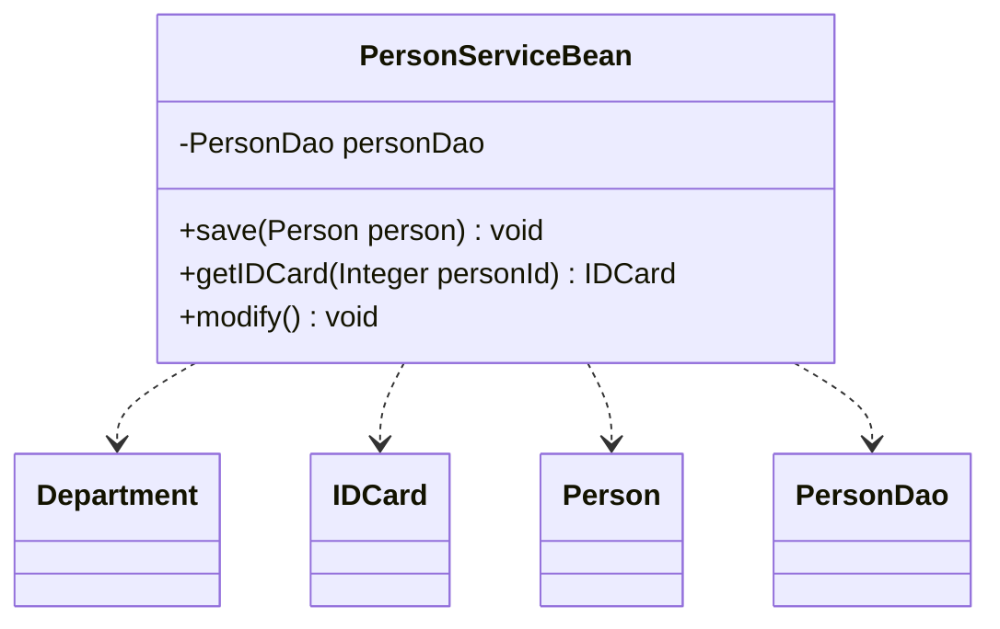
### 2.3.4.依赖关系代码
    Department.java
```java
@include(./projects/JavaSenior/designpattern/src/main/java/com/dragonsoft/designpattern/basic/classrelation/dependence/Department.java)
```
    IDCard.java
```java
@include(./projects/JavaSenior/designpattern/src/main/java/com/dragonsoft/designpattern/basic/classrelation/dependence/IDCard.java)
```
    Person.java
```java
@include(./projects/JavaSenior/designpattern/src/main/java/com/dragonsoft/designpattern/basic/classrelation/dependence/Person.java)
```
    PersonDao.java
```java
@include(./projects/JavaSenior/designpattern/src/main/java/com/dragonsoft/designpattern/basic/classrelation/dependence/PersonDao.java)
```
    PersonServiceBean.java
```java
@include(./projects/JavaSenior/designpattern/src/main/java/com/dragonsoft/designpattern/basic/classrelation/dependence/PersonServiceBean.java)
```
## 2.4.关联关系
### 2.4.1.关联关系概述
    关联关系(Association),实际上就是类与类之间的联系,它是依赖关系的特例。关联关系具有导航性:即双向关联关系或单向关联关系
### 2.4.2.UML箭头及指向
    带普通箭头的实线,拥有者指向被拥有者
### 2.4.3.关联关系类图
    单向关联关系
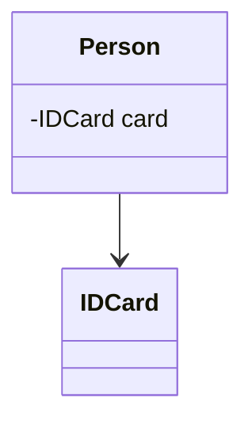
    双向关联关系
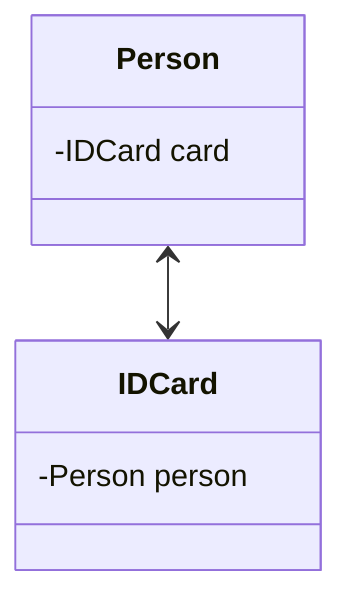
### 2.4.4.关联关系代码
    单向关联关系
    Person.java
```java
@include(./projects/JavaSenior/designpattern/src/main/java/com/dragonsoft/designpattern/basic/classrelation/association/singleone2one/Person.java)
```
    IDCard.java
```java
@include(./projects/JavaSenior/designpattern/src/main/java/com/dragonsoft/designpattern/basic/classrelation/association/singleone2one/IDCard.java)
```
    双向关联关系
    Person.java
```java
@include(./projects/JavaSenior/designpattern/src/main/java/com/dragonsoft/designpattern/basic/classrelation/association/doubleone2one/Person.java)
```
    IDCard.java
```java
@include(./projects/JavaSenior/designpattern/src/main/java/com/dragonsoft/designpattern/basic/classrelation/association/doubleone2one/IDCard.java)
```
## 2.5.聚合关系
### 2.5.1.聚合关系概述
    聚合关系(Aggregation)表示的是整体和部分的关系,整体与部分可以分开。聚合关系是关联关系的特例,所以它具有关联的导航性与多重性。
### 2.5.2.UML箭头及指向
    带空心菱形的实心线,菱形指向整体.
### 2.5.3.聚合关系类图
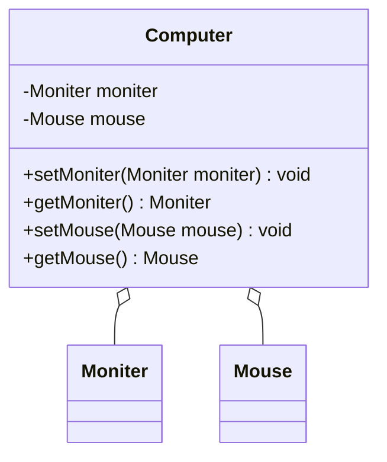
### 2.5.4.聚合关系代码
    Moniter.java
```java
@include(./projects/JavaSenior/designpattern/src/main/java/com/dragonsoft/designpattern/basic/classrelation/aggregation/Moniter.java)
```
    Mouse.java
```java
@include(./projects/JavaSenior/designpattern/src/main/java/com/dragonsoft/designpattern/basic/classrelation/aggregation/Mouse.java)
```
    Computer.java
```java
@include(./projects/JavaSenior/designpattern/src/main/java/com/dragonsoft/designpattern/basic/classrelation/aggregation/Computer.java)
```
## 2.6.组合关系
### 2.6.1.组合关系概述
    组合关系(Composite))表示的是整体和部分的关系,整体与部分不能分开。组合关系是关联关系的一种特例。比如说B类里面用到了一个A类,且这个A类是通过new创建的,也就是说当B类被初始化的时候A类也被初始化了。(耦合度比聚合高)
### 2.6.2.UML箭头及指向
    带实心菱形的实线,菱形指向整体
### 2.6.3.组合关系类图
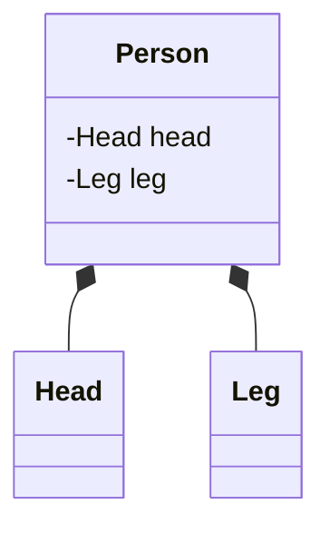
### 2.6.4.组合关系代码
    Head.java
```java
@include(./projects/JavaSenior/designpattern/src/main/java/com/dragonsoft/designpattern/basic/classrelation/composition/Head.java)
```
    Leg.java
```java
@include(./projects/JavaSenior/designpattern/src/main/java/com/dragonsoft/designpattern/basic/classrelation/composition/Leg.java)
```
    Person.java
```java
@include(./projects/JavaSenior/designpattern/src/main/java/com/dragonsoft/designpattern/basic/classrelation/composition/Person.java)
```
## 2.7.泛化关系
### 2.7.1.泛化关系概述
    泛化关系(Generalization),泛化关系实际上就是继承关系,它是依赖关系的特例。如果A类继承了B类,我们就说A和B存在泛化关系。
### 2.7.2.UML箭头及指向
    带三角箭头的实线,子类指向父类
### 2.7.3.泛化关系类图
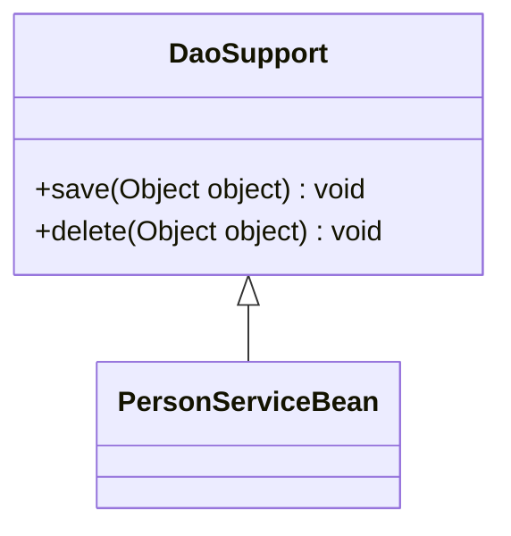
### 2.7.4.泛化关系代码
    DaoSupport.java
```java
@include(./projects/JavaSenior/designpattern/src/main/java/com/dragonsoft/designpattern/basic/classrelation/generalization/DaoSupport.java)
```
    PersonServiceBean.java
```java
@include(./projects/JavaSenior/designpattern/src/main/java/com/dragonsoft/designpattern/basic/classrelation/generalization/PersonServiceBean.java)
```
## 2.8.实现关系
### 2.8.1.实现关系概述
    实现关系(Realization),比如某个类实现了一个接口。它也是依赖关系的特例。
### 2.8.2.UML箭头及指向
    带三角箭头的虚线,箭头指向接口
### 2.8.3.实现关系类图
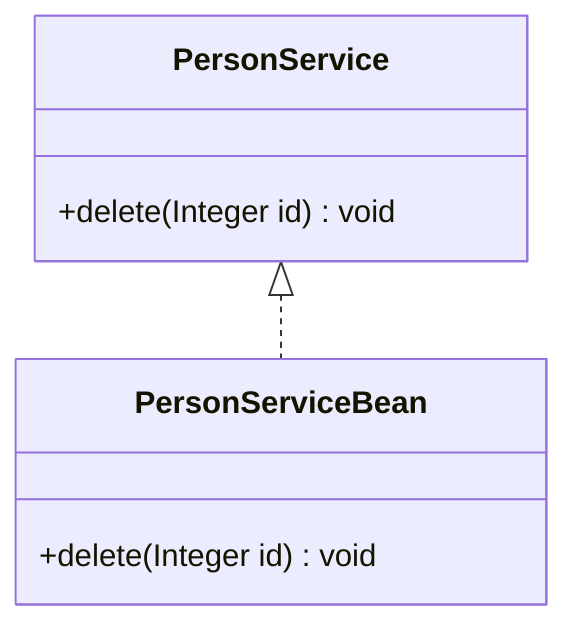
### 2.8.4.实现关系代码
    PersonService.java
```java
@include(./projects/JavaSenior/designpattern/src/main/java/com/dragonsoft/designpattern/basic/classrelation/realization/PersonService.java)
```
    PersonServiceBean.java
```java
@include(./projects/JavaSenior/designpattern/src/main/java/com/dragonsoft/designpattern/basic/classrelation/realization/PersonServiceBean.java)
```
## 2.9.六种关系耦合度强弱
    泛化 = 实现 > 组合 > 聚合 > 关联 > 依赖

# 3.设计模式七大原则 {#3.}
@include(@src/public/enhance/guidance/general/designpattern/designpattern-java/chapter/designpattern-java-guidance-chapter3.md)
## 3.3.单一职责原则SRP
### 3.3.1.单一职责原则介绍
    概述
    一个类应该只负责一项职责

    为什么要遵循单一职责原则
    如类A负责两个不同职责: 职责1,职责2。当职责1需求变更而改变A时,可能造成职责2执行错误,所以需要将类A的粒度分解为A1,A2。

    注意事项
    a.降低类的复杂度,一个类只负责一项职责
    b.提高类的可读性,可维护性
    c.降低变更引起的风险
    d.通常情况下,我们应当遵守单一职责原则,只有逻辑足够简单,才可以在代码级违反单一职责原则,只有类中方法数量足够少,可以在方法级别保持单一职责原则,但是通常不要违反,因为很难确定代码以后是否会发生更改
### 3.3.2.单一职责原则代码
#### 3.3.2.1.不使用单一职责原则代码
```java
@include(./projects/JavaSenior/designpattern/src/main/java/com/dragonsoft/designpattern/basic/principles/single_reponsibility/SingleReponsibility1.java)
```
#### 3.3.2.2.使用单一职责原则代码
##### 3.3.2.2.1.类级别单一职责原则代码
```java
@include(./projects/JavaSenior/designpattern/src/main/java/com/dragonsoft/designpattern/basic/principles/single_reponsibility/SingleResponsibility2.java)
```
##### 3.3.2.2.2.方法别单一职责原则代码
```java
@include(./projects/JavaSenior/designpattern/src/main/java/com/dragonsoft/designpattern/basic/principles/single_reponsibility/SingleResponsibility3.java)
```
## 3.4.接口隔离原则ISP
### 3.4.1.接口隔离原则介绍
    客户端不应该依赖它不需要的接口，即一个类对另一个类的依赖应该建立在最小的接口上
### 3.4.2.接口隔离原则代码
#### 3.4.2.1.不使用接口隔离原则代码
    Interface1.java
```java
@include(./projects/JavaSenior/designpattern/src/main/java/com/dragonsoft/designpattern/basic/principles/interface_segregation/Interface1.java)
```

    Interface1Client.java
```java
@include(./projects/JavaSenior/designpattern/src/main/java/com/dragonsoft/designpattern/basic/principles/interface_segregation/Interface1Client.java)
```
#### 3.4.2.2.使用接口隔离原则代码
    Interface2.java
```java
@include(./projects/JavaSenior/designpattern/src/main/java/com/dragonsoft/designpattern/basic/principles/interface_segregation/Interface2.java)
```

    Interface2Client.java
```java
@include(./projects/JavaSenior/designpattern/src/main/java/com/dragonsoft/designpattern/basic/principles/interface_segregation/Interface2Client.java)
```
## 3.5.依赖倒转原则DIP
### 3.5.1.依赖倒转原则介绍
    概述
    a.高层模块不应该依赖底层模块,二者都应该依赖其抽象
    b.抽象不应该依赖细节，细节应该依赖抽象
    c.依赖反转的中心思想是面向结构编程
    d.依赖反转的思想是基于这样的理念:相对于细节的多变性，抽象的东西要稳定的多,以抽象为基础的架构比以细节为基础的架构要稳定的多,在java中,抽象的多指接口和抽象类,细节就是具体的实现类
    e.使用类或者接口的目的是制定规范,而不涉及任何具体的子类操作,把展现细节的任务交给他们的实现类去做

    依赖关系传递的三种方式
    a.接口传递
    b.构造方法传递
    c.setter方法传递

    注意事项
    a.底层模块尽量都要有抽象类或接口,或者两者都有，程序稳定性更好
    b.变量的声明类型尽量都是抽象类或者接口,这样我们的变量引用和实际对象之间,就存在一个缓冲层,有利于程序的优化和扩展
    c.继承是遵循里氏替换原则
### 3.5.2.依赖倒转原则代码
#### 3.5.2.1.不使用依赖倒转原则代码
```java
@include(./projects/JavaSenior/designpattern/src/main/java/com/dragonsoft/designpattern/basic/principles/dependenceinversion/NoUseDependenceDeliverTest.java)
```
#### 3.5.2.2.使用依赖倒转原则代码
##### 3.5.2.2.1.依赖倒转原则简单案例
```java
@include(./projects/JavaSenior/designpattern/src/main/java/com/dragonsoft/designpattern/basic/principles/dependenceinversion/UseDependenceDeliverTest.java)
```
##### 3.5.2.2.2.通过接口传递依赖
```java
@include(./projects/JavaSenior/designpattern/src/main/java/com/dragonsoft/designpattern/basic/principles/dependenceinversion/DependenceDeliver1.java)
```
##### 3.5.2.2.3.通过构造方法传递依赖
```java
@include(./projects/JavaSenior/designpattern/src/main/java/com/dragonsoft/designpattern/basic/principles/dependenceinversion/DependenceDeliver2.java)
```
##### 3.5.2.2.4.通过setter()方法传递依赖
```java
@include(./projects/JavaSenior/designpattern/src/main/java/com/dragonsoft/designpattern/basic/principles/dependenceinversion/DependenceDeliver3.java)
```
## 3.6.里氏替换原则LSP
### 3.6.1.里氏替换原则介绍
    概述
    里氏替换原则告诉我们,继承实际上让两个类耦合性增强了,在适当的情况下,可以通过聚合、组合、依赖来解决问题

    里氏替换原则是为了解决了什么问题
    a.正确的使用继承
    b.将原来的继承关系转换为继承基类+聚合/组合/依赖关系

    里氏替换原则详细说明
    a.所有能使用父类的地方,都能透明的使用该父类的子类对象
    即继承时,子类尽量不要重写父类的方法,除非迫不得已,如果非要重写,就再写一个更基础的类,把这个要重写的方法提到基类里面去
    b.遵循里氏替换原则,把继承这种高耦合的关系转换为聚合、组合、依赖这几种低耦合的关系
### 3.6.2.里氏替换原则代码
#### 3.6.2.1.不使用里氏替换原则代码
```java
@include(./projects/JavaSenior/designpattern/src/main/java/com/dragonsoft/designpattern/basic/principles/liskov_substitution/Liskov1.java)
```
#### 3.6.2.2.使用里氏替换原则代码
```java
@include(./projects/JavaSenior/designpattern/src/main/java/com/dragonsoft/designpattern/basic/principles/liskov_substitution/Liskov2.java)
```
## 3.7.开闭原则OCP
### 3.7.1.开闭原则介绍
    概述
    对修改关闭,对扩展开放

    开闭原则详细说明
    a.开闭原则是编程中最基础，最为重要的原则
    b.一个软件实体,函数模块应该对扩展开放(对提供功能的一方而言),对修改关闭(对调用方/使用功能的一方而言,注意:不是对于客户端开放,客户端调用方法的使用方)。换而言之,当当增加一个新的类或者方法后,原先正在使用的代码不会收到丝毫影响,概括的说:对扩展开放,对修改关闭,即用抽象构建框架,用实现扩展细节
    c.当软件需要变化时,尽量通过扩展软件的实体行为来实现变化,而不是通过修改已有的代码去实现,简单的说,就是通过扩展而不是通过修改已有代码
    d.使用设计模式就是为了使代码更遵守开闭原则,是最重要的原则,其他的设计模式都是为了达到开闭原则的效果
    e.遵循OPC原则设计出来的系统意味着具有相当的稳定性,至少在增加新功能的时候不会影响旧的功能,因为新的功能是通过扩展原来功能,而不是修改原来的功能,在代码层面的体现是新增一个功能不会动原来的代码,而是把新的功能写在新的类中
### 3.7.2.开闭原则代码
#### 3.7.2.1.不使用开闭原则代码
```java
@include(./projects/JavaSenior/designpattern/src/main/java/com/dragonsoft/designpattern/basic/principles/open_close/OCPTest1.java)
```
#### 3.7.2.2.使用开闭原则代码
```java
@include(./projects/JavaSenior/designpattern/src/main/java/com/dragonsoft/designpattern/basic/principles/open_close/OCPTest2.java)
```
## 3.8.迪米特原则LoD
### 3.8.1.迪米特原则介绍
    概述
    只与直接的朋友通信，最少知道原则,避免与非直接朋友的耦合,对自己依赖的类知道的越少越好,对于被依赖的类不管多复杂,都尽量将逻辑封在内部。需要注意的是降低类之间的耦合,只是减少不必要的耦合,并不是要求完全解除耦合

    迪米特原则详细说明
    a.一个对象应该对其他对象保持最少的了解
    b.类与类关系越密切,耦合度越大
    c.迪米特原则又称最少知道原则,即一个类对自己依赖的类知道的越少越好,也就是说,对于被依赖的类不管多么复杂,都应该尽量将逻辑封装在类的内部,除了对外提供public方法之外,不对外泄露任何信息
    e.迪米特方法还有个更简单的定义: 只与直接朋友通信
        直接朋友:每个对象都会与其他对象有耦合关系,只要两个对象之间有耦合关系,我们就直接说这两个对象之间是朋友关系。耦合的方式有很多依赖、关联、组合、聚合，其中我们将出现在成员变量,方法参数,方法返回值这几个位置中类称为直接朋友,而出现在局部变量中的类不是直接朋友,也就是说,陌生的类最好不要以局部变量的方式出现在类的内部

    直接朋友和间接朋友
    直接朋友:出现在返回值、成员变量、方法参数中的类
    间接朋友:出现在方法中作为局部变量的类
    class A{
        public void fun(){}
    }
    class C{
        public void fun(){}
    }
    class B{
        //C就是B的直接朋友:出现在成员变量位置
        private C c = new C();
        //C就是B的直接朋友:出现在方法参数位置
        public void test1(C c){
            c.fun();
        }
        //C就是B的直接朋友:出现在返回值位置
        public C test3(){
            return null;
        }
        public void test4(){
            //A就是B的间接朋友:出现在方法中作为局部变量位置
            A a = new A();
            a.fun();
        }
    }
### 3.8.2.迪米特原则代码
#### 3.8.2.1.不使用迪米特原则代码
```java
@include(./projects/JavaSenior/designpattern/src/main/java/com/dragonsoft/designpattern/basic/principles/demeter/Demeter1.java)
```
#### 3.8.2.2.使用迪米特原则代码
```java
@include(./projects/JavaSenior/designpattern/src/main/java/com/dragonsoft/designpattern/basic/principles/demeter/Demeter2.java)
```
## 3.9.合成复用原则CARP
### 3.9.1.合成复用原则介绍
    概述
    尽量使用合成/聚合方法,避免使用继承

    使用合成复用原则有什么效果
    当A继承B后,A拥有B所有的方法,使用合成复用改进后,A可以调用B中的方法,不用的方法就不出现在B中了

    合成复用原则与继承原则关系
    在编程中,推荐尽量使用合成复用原则来代替继承,但是反过来,可以使用合成复用原则解决的问题也可以使用继承解决
### 3.9.2.合成复用原则代码
#### 3.9.2.1.不使用合成复用原则代码
```java
@include(./projects/JavaSenior/designpattern/src/main/java/com/dragonsoft/designpattern/basic/principles/compositereuse/CompositeReuse1.java)
```
#### 3.9.2.2.使用合成复用原则代码
```java
@include(./projects/JavaSenior/designpattern/src/main/java/com/dragonsoft/designpattern/basic/principles/compositereuse/CompositeReuse2.java)
```

# 4.创建型模式-单例模式 {#4.}
@include(@src/public/enhance/guidance/general/designpattern/designpattern-java/chapter/designpattern-java-guidance-chapter4.md)
## 4.3.简介
    单例模式(Singleton Pattern)是一种创建型设计模式,又名单件模式或单态模式,目的是为了保证一个类只有一个实例对象,并提供一个获取该实例对象的全局方法,通过这个全局方法创建的所有实例对象都是同一个实例对象,这个类称为单例类。单例模式的要点有三个:一是某个类只能有一个实例对象;二是这个类必须自行创建这个实例对象;三是这个类必须自行向整个系统提供这个实例。
## 4.4.应用场景
    单例模式应用的场景一般发现在以下条件下
    资源共享的情况下: 避免由于资源操作时导致的性能或损耗等
    控制资源的情况下: 方便资源之间的互相通信

    具体应用场景
    a.Windows的Task Manager(任务管理器),在一个Windows系统中只有一个Task Manager实例
    b.Windows的Recycle Bin(回收站),在一个Windows系统中只有一个Recycle Bin实例
    c.网站的计数器,一般也是采用单例模式实现,否则难以同步
    d.应用程序的日志应用,一般都何用单例模式实现,这一般是由于共享的日志文件一直处于打开状态,因为只能有一个实例去操作,否则无法实现内容追加
    e.数据库连接池的设计一般也是采用单例模式,因为数据库连接是一种数据库资源。数据库软件系统中使用数据库连接池,主要是节省打开或者关闭数据库连接所引起的效率损耗,这种效率上的损耗还是非常昂贵的,因为何用单例模式来维护,就可以大大降低这种损耗
    f.多线程的线程池的设计一般也是采用单例模式,这是由于线程池要方便对池中的线程进行控制
    g.操作系统的文件系统,也是大的单例模式实现的具体例子,一个操作系统只能有一个文件系统
## 4.5.优缺点
### 4.5.1.优点
    a.由于单例模式在内存中只有一个实例,减少内存开支,特别是一个对象需要频繁地创建销毁时,而且创建或销毁时性能又无法优化,单例模式就非常明显了
    b.由于单例模式只生成一个实例,所以,减少系统的性能开销,当一个对象产生需要比较多的资源时,如读取配置,产生其他依赖对象时,则可以通过在应用启动时直接产生一个单例对象,然后永久驻留内存的方式来解决
    c.单例模式可以避免对资源的多重占用,例如一个写文件操作,由于只有一个实例存在内存中,避免对同一个资源文件的同时写操作
    d.单例模式可以在系统设置全局的访问点,优化和共享资源访问,例如，可以设计一个单例类,负责所有数据表的映射处理
### 4.5.2.缺点
    a.单例模式没有抽象层,扩展很困难,若要扩展,除了修改代码基本上没有第二种途径可以实现,违反了OCP原则
    b.单例类的职责过重,在一定程度上违背了"单一职责原则"
    c.滥用单例将带来一些负面问题,如:为了节省资源将数据库连接池对象设计为的单例类,可能会导致共享连接池对象的程序过多而出现连接池溢出
## 4.6.角色及其职责
## 4.7.模型
### 4.7.1.模型类图

### 4.7.2.模型代码
```java
@include(./projects/JavaSenior/designpattern/src/main/java/com/dragonsoft/designpattern/create/singleton/model/SingletonObject.java)
```
## 4.8.示例
### 4.8.1.饿汉式单例
### 4.8.1.1.饿汉式单例类图

### 4.8.1.2.饿汉式单例代码
    SingletonA.java
```java
@include(./projects/JavaSenior/designpattern/src/main/java/com/dragonsoft/designpattern/create/singleton/SingletonA.java)
```
    Client.java
```java
package com.dragonsoft.designpattern.create.singleton;

import org.junit.Test;

public class Client {
	/**
	 * 测试测试饿汉式单例
	 */
	@Test
	public void fun() {
		SingletonA instance1 = SingletonA.getInstance();
		SingletonA instance2 = SingletonA.getInstance();
		System.out.println(instance1 == instance2);
		System.out.println("instance1.hashCode():"+instance1.hashCode());
		System.out.println("instance2.hashCode():"+instance2.hashCode());
	}
}
```
### 4.8.2.懒汉式单例
### 4.8.2.1.饿汉式单例类图
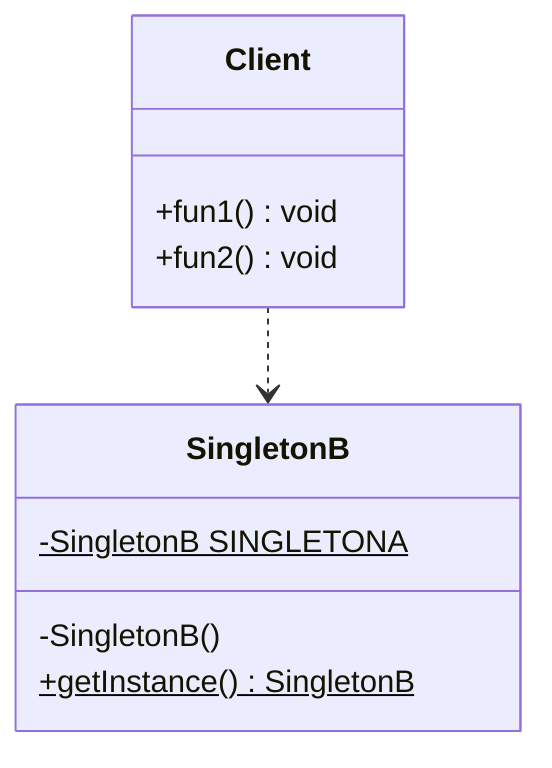
### 4.8.2.2.饿汉式单例代码
    SingletonB.java
```java
@include(./projects/JavaSenior/designpattern/src/main/java/com/dragonsoft/designpattern/create/singleton/SingletonB.java)
```
    Client.java
```java
package com.dragonsoft.designpattern.create.singleton;

import org.junit.Test;

public class Client {
	/**
	 * 测试单线程测试懒汉式
	 */
	@Test
	public void fun1() {
		SingletonB instance1 = SingletonB.getInstance();
		SingletonB instance2 = SingletonB.getInstance();
		System.out.println(instance1 == instance2);
		System.out.println("instance1.hashCode():"+instance1.hashCode());
		System.out.println("instance2.hashCode():"+instance2.hashCode());
	}

	/**
	 * 测试多线程测试线程不安全的懒汉式
	 */
	@Test
	public void fun2() {
		long begin = System.currentTimeMillis();
		//多线程测试单例模式线程是否安全
		Thread[] threads = new Thread[10000];
        for(int i = 0;i<threads.length;i++){
        	//创建线程
        	threads[i] =
				new Thread(new Runnable() {
	    			@Override
	    			public void run() {
	    				SingletonB instance = SingletonB.getInstance();
	    				System.out.println("instance.hashCode():"+instance.hashCode());
	    			}
	    		});
        }
        for(int i=0;i<threads.length;i++){
        	threads[i].start();//线程启动
        }
        long end = System.currentTimeMillis();
        System.out.println("程序执行时间：" + (end-begin));
	}
}
```
### 4.8.3.线程安全的懒汉式单例
### 4.8.3.1.线程安全的懒汉式类图
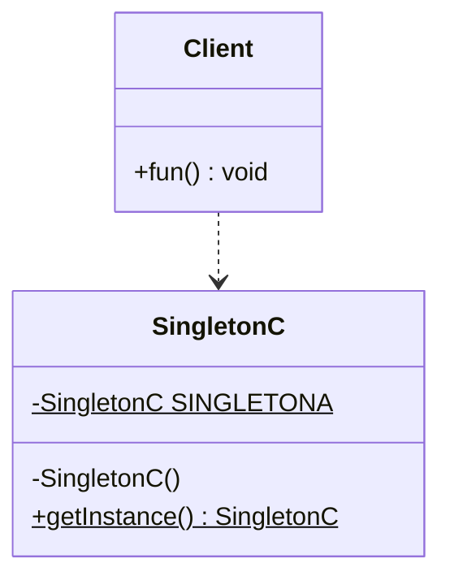
### 4.8.3.2.线程安全的懒汉式代码
    SingletonC.java
```java
@include(./projects/JavaSenior/designpattern/src/main/java/com/dragonsoft/designpattern/create/singleton/SingletonC.java)
```
    Client.java
```java
package com.dragonsoft.designpattern.create.singleton;

import org.junit.Test;

public class Client {
	/**
	 * 测试多线程测试线程安全的懒汉式
	 * 	方法级别的锁：实测执行效率并不是很低
	 */
	@Test
	public void fun() {
		long begin = System.currentTimeMillis();
		//多线程测试单例模式线程是否安全
		Thread[] threads = new Thread[10000];
		for(int i = 0;i<threads.length;i++){
			//创建线程
			threads[i] =
					new Thread(new Runnable() {
						@Override
						public void run() {
							SingletonC instance = SingletonC.getInstance();
							System.out.println("instance.hashCode():"+instance.hashCode());
						}
					});
		}
		for(int i=0;i<threads.length;i++){
			threads[i].start();//线程启动
		}
		long end = System.currentTimeMillis();
		System.out.println("程序执行时间：" + (end-begin));
	}
}
```
### 4.8.4.双重检索懒汉式懒汉式单例
### 4.8.4.1.双重检索懒汉式单例类图

### 4.8.4.2.双重检索懒汉式单例代码
    SingletonD.java
```java
@include(./projects/JavaSenior/designpattern/src/main/java/com/dragonsoft/designpattern/create/singleton/SingletonD.java)
```
    Client.java
```java
package com.dragonsoft.designpattern.create.singleton;

import org.junit.Test;

public class Client {
    	/**
	 * 测试多线程测试静态双重检索线程安全的懒汉式
	 * 	方法级别的锁：实测执行效率并不是很低
	 */
	@Test
	public void fun() {
		long begin = System.currentTimeMillis();
		//多线程测试单例模式线程是否安全
		Thread[] threads = new Thread[10000];
		for(int i = 0;i<threads.length;i++){
			//创建线程
			threads[i] =
					new Thread(new Runnable() {
						@Override
						public void run() {
							SingletonD instance = SingletonD.getInstance();
							System.out.println("instance.hashCode():"+instance.hashCode());
						}
					});
		}
		for(int i=0;i<threads.length;i++){
			threads[i].start();//线程启动
		}
		long end = System.currentTimeMillis();
		System.out.println("程序执行时间：" + (end-begin));
	}
}
```
### 4.8.5.静态内部类懒汉式单例
### 4.8.5.1.静态内部类懒汉式单例类图
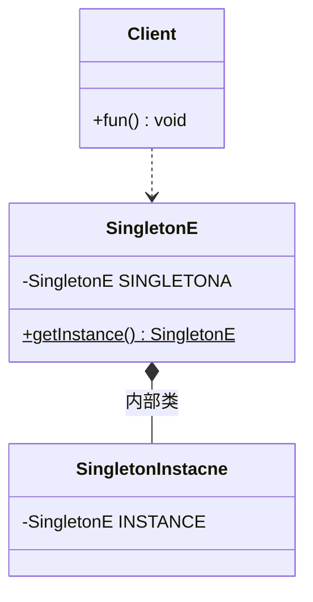
### 4.8.5.2.静态内部类懒汉式单例代码
    SingletonE.java
```java
@include(./projects/JavaSenior/designpattern/src/main/java/com/dragonsoft/designpattern/create/singleton/SingletonE.java)
```
    Client.java
```java
package com.dragonsoft.designpattern.create.singleton;

import org.junit.Test;

public class Client {
    /**
	 * 测试多线程测试静态内部类线程安全的懒汉式
	 *
	 */
	@Test
	public void fun() {
		long begin = System.currentTimeMillis();
		//多线程测试单例模式线程是否安全
		Thread[] threads = new Thread[10000];
		for(int i = 0;i<threads.length;i++){
			//创建线程
			threads[i] =
					new Thread(new Runnable() {
						@Override
						public void run() {
							SingletonE instance = SingletonE.getInstance();
							System.out.println("instance.hashCode():"+instance.hashCode());
						}
					});
		}
		for(int i=0;i<threads.length;i++){
			threads[i].start();//线程启动
		}
		long end = System.currentTimeMillis();
		System.out.println("程序执行时间：" + (end-begin));
	}
}
```
### 4.8.6.枚举单例
### 4.8.6.1.枚举单例类图
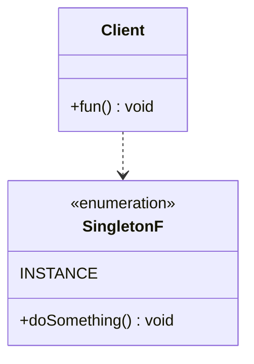
### 4.8.6.2.枚举单例代码
    SingletonF.java
```java
@include(./projects/JavaSenior/designpattern/src/main/java/com/dragonsoft/designpattern/create/singleton/SingletonF.java)
```
    Client.java
```java
package com.dragonsoft.designpattern.create.singleton;

import org.junit.Test;

public class Client {
    /**
	 * 测试枚举实现单例
	 */
	@Test
	public void fun() {
		SingletonF instance1 = SingletonF.INSTANCE;
		SingletonF instance2 = SingletonF.INSTANCE;
		System.out.println(instance1 == instance2);
		System.out.println("instance1.hashCode():"+instance1.hashCode());
		System.out.println("instance2.hashCode():"+instance2.hashCode());
		//通过单例调用doSomething()
		instance1.doSomething();
		instance2.doSomething();
	}
}
```
## 4.9.在开源框架中的应用
    JDK8#java.lang.Runtime(饿汉式)
```java
public class Runtime {
    private static Runtime currentRuntime = new Runtime();

    /**
     * Returns the runtime object associated with the current Java application.
     * Most of the methods of class <code>Runtime</code> are instance
     * methods and must be invoked with respect to the current runtime object.
     *
     * @return  the <code>Runtime</code> object associated with the current
     *          Java application.
     */
    public static Runtime getRuntime() {
        return currentRuntime;
    }

    /** Don't let anyone else instantiate this class */
    private Runtime() {}
}
```
# 5.创建型模式-简单工厂模式(Gof之外) {#5.}
@include(@src/public/enhance/guidance/general/designpattern/designpattern-java/chapter/designpattern-java-guidance-chapter5.md)
## 5.3.简介
    简单工厂模式(SimpleFactory Pattern)是一种创建型设计模式,是设计模式中最为常见的模式之一,但是不是Gof提出的23中设计模式中的一种,更像是一种编程习惯。简单工厂模式是隐藏对象的实例化过程,对外部提供一个获取对象的方法,可以根据参数获取不同类型的对象,是工厂模式家族中最简单实用的模式,可以理解为是不同工厂模式的一个特殊实现。
## 5.4.应用场景
    a.客户端如果只知道传入工厂类得参数,对于如何创建对象得逻辑不关心时
    b.客户端既不需要关心创建细节,甚至连类名都不需要记住,只需要知道类型所对应得参数
    c.工厂负责创建的类少,同时系统中需要的new对象较多而且复杂时可以使用,这样一方面不会造成工厂方法中得业务逻辑太过复杂,另一方面在使用时不用一直new,直接从工厂中获取即可
## 5.5.优缺点
### 5.5.1.优点
    a.屏蔽了具体的创建逻辑,客户端只需要要传入一个参数即可获取相应的结果,在一定程度上简化了对象的创建过程
    b.将实例创建过程和使用过程分离开来,实现了解耦
### 5.5.2.缺点
    a.工厂类集中了所有实例(产品)的创建逻辑,一旦这个工厂不能正常工作,整个系统都会受到影响
    b.违背OCP原则,一旦添加新产品就不得不修改工厂类得逻辑,这样就会造成工厂逻辑过于复杂
    c.简单工厂模式由于使用了静态工厂方法,静态方法不能被继承和重写,会造成工厂角色无法形成基于继承的等级结构
## 5.6.角色及其职责
    Factory(工厂)
    核心部分,负责实现创建所有产品的内部逻辑,工厂类可以被外界直接调用,创建所需对象
    Product(抽象类产品)
    工厂类所创建的所有对象的父类,封装了产品对象的公共方法,所有的具体产品为其子类对象
    ConcreteProduct(具体产品)
    简单工厂模式的创建目标,所有被创建的对象都是某个具体类的实例,它要实现抽象产品中声明的抽象方法(有关抽象类)
## 5.7.模型
### 5.7.1.模型类图
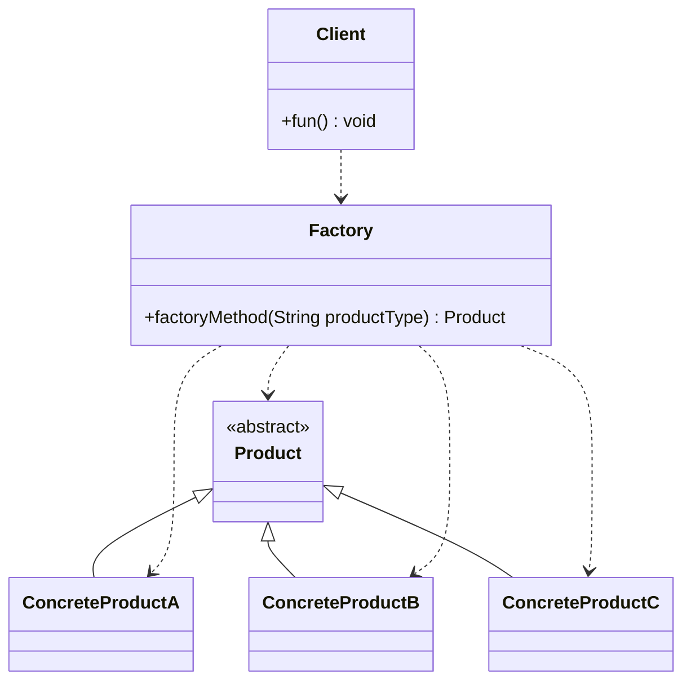
### 5.7.2.模型代码
    Product.java
```java
@include(./projects/JavaSenior/designpattern/src/main/java/com/dragonsoft/designpattern/create/factory/simplefactory/model/Product.java)
```
    ConcreteProductA.java
```java
@include(./projects/JavaSenior/designpattern/src/main/java/com/dragonsoft/designpattern/create/factory/simplefactory/model/ConcreteProductA.java)
```
    ConcreteProductB.java
```java
@include(./projects/JavaSenior/designpattern/src/main/java/com/dragonsoft/designpattern/create/factory/simplefactory/model/ConcreteProductB.java)
```
    ConcreteProductC.java
```java
@include(./projects/JavaSenior/designpattern/src/main/java/com/dragonsoft/designpattern/create/factory/simplefactory/model/ConcreteProductC.java)
```
    Factory.java
```java
@include(./projects/JavaSenior/designpattern/src/main/java/com/dragonsoft/designpattern/create/factory/simplefactory/model/Factory.java)
```
    Client.java
```java
@include(./projects/JavaSenior/designpattern/src/main/java/com/dragonsoft/designpattern/create/factory/simplefactory/model/Client.java)
```
## 5.8.示例
### 5.8.1.不使用简单工厂模式
#### 5.8.1.1.类图
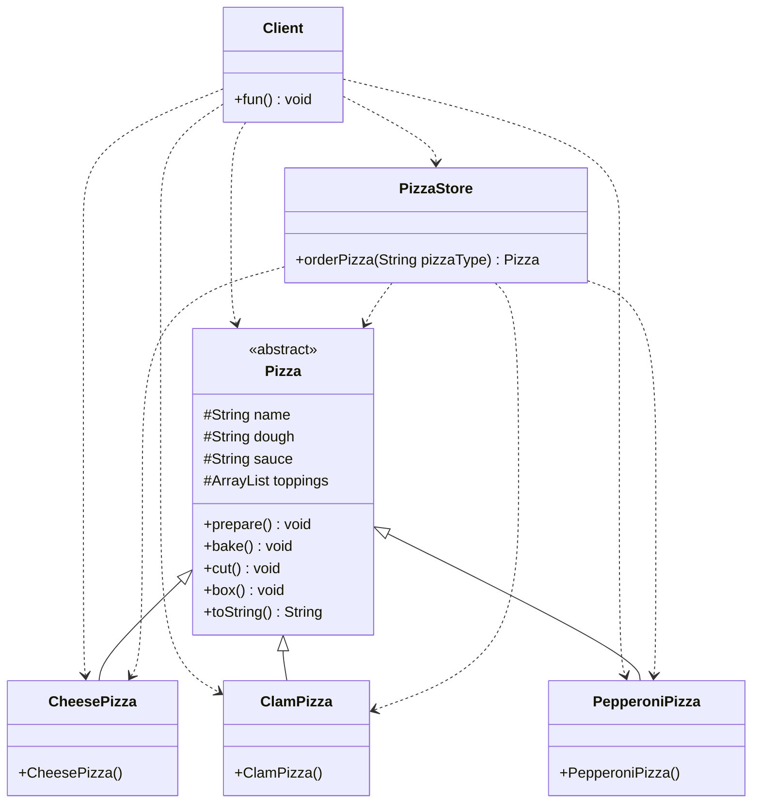
#### 5.8.1.2.代码
    Pizza.java
```java
@include(./projects/JavaSenior/designpattern/src/main/java/com/dragonsoft/designpattern/create/factory/simplefactory/nouse/Pizza.java)
```
    CheesePizza.java
```java
@include(./projects/JavaSenior/designpattern/src/main/java/com/dragonsoft/designpattern/create/factory/simplefactory/nouse/CheesePizza.java)
```
    ClamPizza.java
```java
@include(./projects/JavaSenior/designpattern/src/main/java/com/dragonsoft/designpattern/create/factory/simplefactory/nouse/ClamPizza.java)
```
    PepperoniPizza.java
```java
@include(./projects/JavaSenior/designpattern/src/main/java/com/dragonsoft/designpattern/create/factory/simplefactory/nouse/PepperoniPizza.java)
```
    PizzaStore.java
```java
@include(./projects/JavaSenior/designpattern/src/main/java/com/dragonsoft/designpattern/create/factory/simplefactory/nouse/PizzaStore.java)
```
    Client.java
```java
@include(./projects/JavaSenior/designpattern/src/main/java/com/dragonsoft/designpattern/create/factory/simplefactory/nouse/Client.java)
```
### 5.8.2.使用简单工厂模式
#### 5.8.2.1.类图
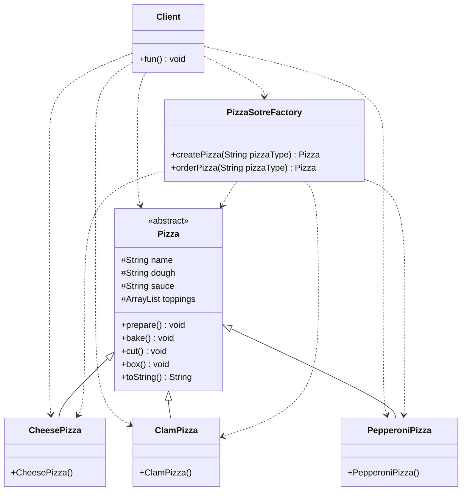
#### 5.8.2.2.代码
    Pizza.java
```java
@include(./projects/JavaSenior/designpattern/src/main/java/com/dragonsoft/designpattern/create/factory/simplefactory/use/Pizza.java)
```
    CheesePizza.java
```java
@include(./projects/JavaSenior/designpattern/src/main/java/com/dragonsoft/designpattern/create/factory/simplefactory/use/CheesePizza.java)
```
    ClamPizza.java
```java
@include(./projects/JavaSenior/designpattern/src/main/java/com/dragonsoft/designpattern/create/factory/simplefactory/use/ClamPizza.java)
```
    PepperoniPizza.java
```java
@include(./projects/JavaSenior/designpattern/src/main/java/com/dragonsoft/designpattern/create/factory/simplefactory/use/PepperoniPizza.java)
```
    PizzaStoreFactory.java
```java
@include(./projects/JavaSenior/designpattern/src/main/java/com/dragonsoft/designpattern/create/factory/simplefactory/use/PizzaStoreFactory.java)
```
    Client.java
```java
@include(./projects/JavaSenior/designpattern/src/main/java/com/dragonsoft/designpattern/create/factory/simplefactory/use/Client.java)
```

## 5.9.在开源框架中的应用
    简单工厂模式
    JDK8#java.util.Calendar#createCalendar()
```java
private static Calendar createCalendar(TimeZone zone,
                                        Locale aLocale)
{
    CalendarProvider provider =
        LocaleProviderAdapter.getAdapter(CalendarProvider.class, aLocale)
                                .getCalendarProvider();
    if (provider != null) {
        try {
            return provider.getInstance(zone, aLocale);
        } catch (IllegalArgumentException iae) {
            // fall back to the default instantiation
        }
    }

    Calendar cal = null;

    if (aLocale.hasExtensions()) {
        String caltype = aLocale.getUnicodeLocaleType("ca");
        if (caltype != null) {
            switch (caltype) {
            case "buddhist":
            cal = new BuddhistCalendar(zone, aLocale);
                break;
            case "japanese":
                cal = new JapaneseImperialCalendar(zone, aLocale);
                break;
            case "gregory":
                cal = new GregorianCalendar(zone, aLocale);
                break;
            }
        }
    }
    if (cal == null) {
        // If no known calendar type is explicitly specified,
        // perform the traditional way to create a Calendar:
        // create a BuddhistCalendar for th_TH locale,
        // a JapaneseImperialCalendar for ja_JP_JP locale, or
        // a GregorianCalendar for any other locales.
        // NOTE: The language, country and variant strings are interned.
        if (aLocale.getLanguage() == "th" && aLocale.getCountry() == "TH") {
            cal = new BuddhistCalendar(zone, aLocale);
        } else if (aLocale.getVariant() == "JP" && aLocale.getLanguage() == "ja"
                    && aLocale.getCountry() == "JP") {
            cal = new JapaneseImperialCalendar(zone, aLocale);
        } else {
            cal = new GregorianCalendar(zone, aLocale);
        }
    }
    return cal;
}
```
    使用简单工厂模式
    JDK8#java.util.Calendar#getInstance()
```java
public static Calendar getInstance(TimeZone zone,
                                    Locale aLocale)
{
    return createCalendar();
}
```
    可以看出,在getInstance()方法中调用了createCalendar()方法,只需要传入zone, aLocale,就可以获得一个Calendar对象
# 6.创建型模式-工厂模式 {#6.}
@include(@src/public/enhance/guidance/general/designpattern/designpattern-java/chapter/designpattern-java-guidance-chapter6.md)
## 6.3.简介
    工厂模式(FactoryMethod Pattern)又称工厂方法模式(FactoryMethod Pattern)是一种创建型设计模式,工厂方法模式是简单工厂模式的进一步抽象和推广,是GoF设计模式的一种。由于使用了面向对象的多态性,工厂方法模式保持了简单工厂模式的优点,而且克服了它的缺点,同时遵循OCP原则。在工厂方法模式中,提供一个用于创建对象的接口(工厂接口),让其实现类(工厂实现类)决定实例化哪一个类(产品类),并且由该实现类创建对应类的实例。这使得工厂方法模式可以允许系统在不修改工厂角色的情况下引进新产品。
## 6.4.应用场景
    a.客户端不关心它所要创建对象的类(产品类)的时候
    b.客户端知道它所要创建对象的类(产品类),但不关心如何创建的时候
## 6.5.优缺点
### 6.5.1.优点
    a.使用工厂方法用来创建客户所需要的产品,隐藏了具体产品类的实例化过程,用户只需要关心所需产品对应的工厂,无须关心创建细节,甚至无须知道具体产品类的类名
    b.加入新产品时,无须修改抽象工厂和抽象产品提供的接口,无须修改客户端,也无须修改其他的具体工厂和具体产品,而只要添加一个具体工厂和具体产品就可以了。增加了系统的可扩展性,符合OCP开闭原则
    c.每个产品都对应一个工厂,所以可以在这个产品对应的工厂中更为细致的控制产品的创建过程,而不会影响到其他的产品
### 6.5.2.缺点
    a.每增加一个新产品,都需要编写新的具体产品类,而且还要提供与之对应的具体工厂类,这样系统中类的个数将成对增加,在一定程度上增加了系统的复杂度,有更多的类需要编译和运行,会给系统带来一些额外的开销。
    b.由于考虑到系统的可扩展性,需要引入抽象层,在客户端代码中均使用抽象层进行定义,增加了系统的抽象性和理解难度,进而增加了系统的实现难度。
## 6.6.角色及其职责
    Product(抽象产品)
    工厂类所创建的所有对象的父类,封装了产品对象的公共方法,所有的具体产品为其子类对象
    ConcreteProduct(具体产品)
    工厂类所创建的实际对象
    Factory(抽象工厂)
    提供一个用于创建对象的接口(工厂接口),让其实现类(工厂实现类)决定实例化哪一个类(产品类)
    ConcreteFactory(具体工厂)
    提供实际创建对象的方法
## 6.7.模型
### 6.7.1.模型类图
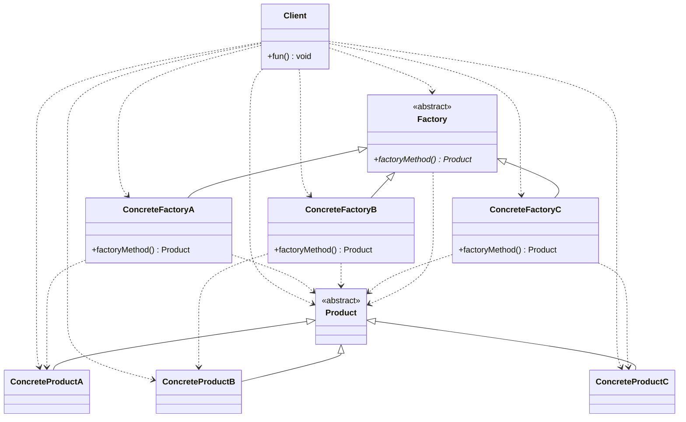
### 6.7.2.模型代码
    Product.java
```java
@include(./projects/JavaSenior/designpattern/src/main/java/com/dragonsoft/designpattern/create/factory/factorymethod/model/Product.java)
```
    ConcreteProductA.java
```java
@include(./projects/JavaSenior/designpattern/src/main/java/com/dragonsoft/designpattern/create/factory/factorymethod/model/ConcreteProductA.java)
```
    ConcreteProductB.java
```java
@include(./projects/JavaSenior/designpattern/src/main/java/com/dragonsoft/designpattern/create/factory/factorymethod/model/ConcreteProductB.java)
```
    ConcreteProductC.java
```java
@include(./projects/JavaSenior/designpattern/src/main/java/com/dragonsoft/designpattern/create/factory/factorymethod/model/ConcreteProductC.java)
```
    Factory.java
```java
@include(./projects/JavaSenior/designpattern/src/main/java/com/dragonsoft/designpattern/create/factory/factorymethod/model/Factory.java)
```
    ConcreteFactoryA.java
```java
@include(./projects/JavaSenior/designpattern/src/main/java/com/dragonsoft/designpattern/create/factory/factorymethod/model/ConcreteFactoryA.java)
```
    ConcreteFactoryB.java
```java
@include(./projects/JavaSenior/designpattern/src/main/java/com/dragonsoft/designpattern/create/factory/factorymethod/model/ConcreteFactoryB.java)
```
    ConcreteFactoryC.java
```java
@include(./projects/JavaSenior/designpattern/src/main/java/com/dragonsoft/designpattern/create/factory/factorymethod/model/ConcreteFactoryC.java)
```
    Client.java
```java
@include(./projects/JavaSenior/designpattern/src/main/java/com/dragonsoft/designpattern/create/factory/factorymethod/model/Client.java)
```
## 6.8.示例
### 6.8.1.不使用工厂模式(实际上使用了简单工厂模式)
#### 6.8.1.1.类图
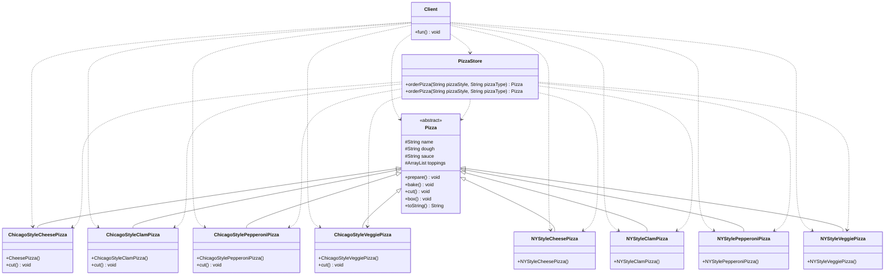
#### 6.8.1.1.代码
    Pizza.java
```java
@include(./projects/JavaSenior/designpattern/src/main/java/com/dragonsoft/designpattern/create/factory/factorymethod/nouse/Pizza.java)
```
    ChicagoStyleCheesePizza.java
```java
@include(./projects/JavaSenior/designpattern/src/main/java/com/dragonsoft/designpattern/create/factory/factorymethod/nouse/ChicagoStyleCheesePizza.java)
```
    ChicagoStyleClamPizza.java
```java
@include(./projects/JavaSenior/designpattern/src/main/java/com/dragonsoft/designpattern/create/factory/factorymethod/nouse/ChicagoStyleClamPizza.java)
```
    ChicagoStylePepperoniPizza.java
```java
@include(./projects/JavaSenior/designpattern/src/main/java/com/dragonsoft/designpattern/create/factory/factorymethod/nouse/ChicagoStylePepperoniPizza.java)
```
    ChicagoStyleVeggiePizza.java
```java
@include(./projects/JavaSenior/designpattern/src/main/java/com/dragonsoft/designpattern/create/factory/factorymethod/nouse/ChicagoStyleVeggiePizza.java)
```
    NYStyleCheesePizza.java
```java
@include(./projects/JavaSenior/designpattern/src/main/java/com/dragonsoft/designpattern/create/factory/factorymethod/nouse/NYStyleCheesePizza.java)
```
    NYStyleClamPizza.java
```java
@include(./projects/JavaSenior/designpattern/src/main/java/com/dragonsoft/designpattern/create/factory/factorymethod/nouse/NYStyleClamPizza.java)
```
    NYStylePepperoniPizza.java
```java
@include(./projects/JavaSenior/designpattern/src/main/java/com/dragonsoft/designpattern/create/factory/factorymethod/nouse/NYStylePepperoniPizza.java)
```
    NYStyleVeggiePizza.java
```java
@include(./projects/JavaSenior/designpattern/src/main/java/com/dragonsoft/designpattern/create/factory/factorymethod/nouse/NYStyleVeggiePizza.java)
```
    PizzaStore.java
```java
@include(./projects/JavaSenior/designpattern/src/main/java/com/dragonsoft/designpattern/create/factory/factorymethod/nouse/PizzaStore.java)
```
    Client.java
```java
@include(./projects/JavaSenior/designpattern/src/main/java/com/dragonsoft/designpattern/create/factory/factorymethod/nouse/Client.java)
```
### 6.8.2.使用工厂模式
#### 6.8.2.1.类图
111

#### 6.8.2.2.代码
    Pizza.java
```java
@include(./projects/JavaSenior/designpattern/src/main/java/com/dragonsoft/designpattern/create/factory/factorymethod/use/Pizza.java)
```
    ChicagoStyleCheesePizza.java
```java
@include(./projects/JavaSenior/designpattern/src/main/java/com/dragonsoft/designpattern/create/factory/factorymethod/use/ChicagoStyleCheesePizza.java)
```
    ChicagoStyleClamPizza.java
```java
@include(./projects/JavaSenior/designpattern/src/main/java/com/dragonsoft/designpattern/create/factory/factorymethod/use/ChicagoStyleClamPizza.java)
```
    ChicagoStylePepperoniPizza.java
```java
@include(./projects/JavaSenior/designpattern/src/main/java/com/dragonsoft/designpattern/create/factory/factorymethod/use/ChicagoStylePepperoniPizza.java)
```
    ChicagoStyleVeggiePizza.java
```java
@include(./projects/JavaSenior/designpattern/src/main/java/com/dragonsoft/designpattern/create/factory/factorymethod/use/ChicagoStyleVeggiePizza.java)
```
    NYStyleCheesePizza.java
```java
@include(./projects/JavaSenior/designpattern/src/main/java/com/dragonsoft/designpattern/create/factory/factorymethod/use/NYStyleCheesePizza.java)
```
    NYStyleClamPizza.java
```java
@include(./projects/JavaSenior/designpattern/src/main/java/com/dragonsoft/designpattern/create/factory/factorymethod/use/NYStyleClamPizza.java)
```
    NYStylePepperoniPizza.java
```java
@include(./projects/JavaSenior/designpattern/src/main/java/com/dragonsoft/designpattern/create/factory/factorymethod/use/NYStylePepperoniPizza.java)
```
    NYStyleVeggiePizza.java
```java
@include(./projects/JavaSenior/designpattern/src/main/java/com/dragonsoft/designpattern/create/factory/factorymethod/use/NYStyleVeggiePizza.java)
```
    PizzaFactory.java
```java
@include(./projects/JavaSenior/designpattern/src/main/java/com/dragonsoft/designpattern/create/factory/factorymethod/use/PizzaStoreFactory.java)
```
    NYPizzaFactory.java
```java
@include(./projects/JavaSenior/designpattern/src/main/java/com/dragonsoft/designpattern/create/factory/factorymethod/use/NYPizzaStoreFactory.java)
```
    ChicagoPizzaFactory.java
```java
@include(./projects/JavaSenior/designpattern/src/main/java/com/dragonsoft/designpattern/create/factory/factorymethod/use/ChicagoStorePizzaFactory.java)
```
    Client.java
```java
@include(./projects/JavaSenior/designpattern/src/main/java/com/dragonsoft/designpattern/create/factory/factorymethod/use/Client.java)
```
## 6.9.在开源框架中的应用
# 7.创建型模式-抽象工厂模式 {#7.}
@include(@src/public/enhance/guidance/general/designpattern/designpattern-java/chapter/designpattern-java-guidance-chapter7.md)
## 7.3.简介
## 7.4.应用场景
## 7.5.优缺点
### 7.5.1.优点
### 7.5.2.缺点
## 7.6.角色及其职责
## 7.7.模型
### 7.7.1.模型类图
### 7.7.2.模型代码
## 7.8.示例
## 7.9.在开源框架中的应用
# 8.创建型模式-原型模式 {#8.}
@include(@src/public/enhance/guidance/general/designpattern/designpattern-java/chapter/designpattern-java-guidance-chapter8.md)
## 8.3.简介
## 8.4.应用场景
## 8.5.优缺点
### 8.5.1.优点
### 8.5.2.缺点
## 8.6.角色及其职责
## 8.7.模型
### 8.7.1.模型类图
### 8.7.2.模型代码
## 8.8.示例
## 8.9.在开源框架中的应用
# 9.创建型模式-建造者模式 {#9.}
@include(@src/public/enhance/guidance/general/designpattern/designpattern-java/chapter/designpattern-java-guidance-chapter9.md)
## 9.3.简介
## 9.4.应用场景
## 9.5.优缺点
### 9.5.1.优点
### 9.5.2.缺点
## 9.6.角色及其职责
## 9.7.模型
### 9.7.1.模型类图
### 9.7.2.模型代码
## 9.8.示例
## 9.9.在开源框架中的应用
# 10.结构型模式-适配器模式 {#10.}
@include(@src/public/enhance/guidance/general/designpattern/designpattern-java/chapter/designpattern-java-guidance-chapter10.md)
## 10.3.简介
## 10.4.应用场景
## 10.5.优缺点
### 10.5.1.优点
### 10.5.2.缺点
## 10.6.角色及其职责
## 10.7.模型
### 10.7.1.模型类图
### 10.7.2.模型代码
## 10.8.示例
## 10.9.在开源框架中的应用
# 11.结构型模式-桥接模式 {#11.}
@include(@src/public/enhance/guidance/general/designpattern/designpattern-java/chapter/designpattern-java-guidance-chapter11.md)
## 11.3.简介
## 11.4.应用场景
## 11.5.优缺点
### 11.5.1.优点
### 11.5.2.缺点
## 11.6.角色及其职责
## 11.7.模型
### 11.7.1.模型类图
### 11.7.2.模型代码
## 11.8.示例
## 11.9.在开源框架中的应用
# 12.结构型模式-装饰者模式 {#12.}
@include(@src/public/enhance/guidance/general/designpattern/designpattern-java/chapter/designpattern-java-guidance-chapter12.md)
## 12.3.简介
## 12.4.应用场景
## 12.5.优缺点
### 12.5.1.优点
### 12.5.2.缺点
## 12.6.角色及其职责
## 12.7.模型
### 12.7.1.模型类图
### 12.7.2.模型代码
## 12.8.示例
## 12.9.在开源框架中的应用
# 13.结构型模式-组合模式 {#13.}
@include(@src/public/enhance/guidance/general/designpattern/designpattern-java/chapter/designpattern-java-guidance-chapter13.md)
## 13.3.简介
## 13.4.应用场景
## 13.5.优缺点
### 13.5.1.优点
### 13.5.2.缺点
## 13.6.角色及其职责
## 13.7.模型
### 13.7.1.模型类图
### 13.7.2.模型代码
## 13.8.示例
## 13.9.在开源框架中的应用
# 14.结构型模式-外观模式 {#14.}
@include(@src/public/enhance/guidance/general/designpattern/designpattern-java/chapter/designpattern-java-guidance-chapter14.md)
## 14.3.简介
## 14.4.应用场景
## 14.5.优缺点
### 14.5.1.优点
### 14.5.2.缺点
## 14.6.角色及其职责
## 14.7.模型
### 14.7.1.模型类图
### 14.7.2.模型代码
## 14.8.示例
## 14.9.在开源框架中的应用
# 15.结构型模式-享元模式 {#15.}
@include(@src/public/enhance/guidance/general/designpattern/designpattern-java/chapter/designpattern-java-guidance-chapter15.md)
## 15.3.简介
## 15.4.应用场景
## 15.5.优缺点
### 15.5.1.优点
### 15.5.2.缺点
## 15.6.角色及其职责
## 15.7.模型
### 15.7.1.模型类图
### 15.7.2.模型代码
## 15.8.示例
## 15.9.在开源框架中的应用
# 16.结构型模式-代理模式 {#16.}
@include(@src/public/enhance/guidance/general/designpattern/designpattern-java/chapter/designpattern-java-guidance-chapter16.md)
## 16.3.简介
## 16.4.应用场景
## 16.5.优缺点
### 16.5.1.优点
### 16.5.2.缺点
## 16.6.角色及其职责
## 16.7.模型
### 16.7.1.模型类图
### 16.7.2.模型代码
## 16.8.示例
## 16.9.在开源框架中的应用
# 17.行为型模式-模版方法模式 {#17.}
@include(@src/public/enhance/guidance/general/designpattern/designpattern-java/chapter/designpattern-java-guidance-chapter17.md)
## 17.3.简介
## 17.4.应用场景
## 17.5.优缺点
### 17.5.1.优点
### 17.5.2.缺点
## 17.6.角色及其职责
## 17.7.模型
### 17.7.1.模型类图
### 17.7.2.模型代码
## 17.8.示例
## 17.9.在开源框架中的应用
# 18.行为型模式-命令模式 {#18.}
@include(@src/public/enhance/guidance/general/designpattern/designpattern-java/chapter/designpattern-java-guidance-chapter18.md)
## 18.3.简介
## 18.4.应用场景
## 18.5.优缺点
### 18.5.1.优点
### 18.5.2.缺点
## 18.6.角色及其职责
## 18.7.模型
### 18.7.1.模型类图
### 18.7.2.模型代码
## 18.8.示例
## 18.9.在开源框架中的应用
# 19.行为型模式-迭代器模式 {#19.}
@include(@src/public/enhance/guidance/general/designpattern/designpattern-java/chapter/designpattern-java-guidance-chapter19.md)
## 19.3.简介
## 19.4.应用场景
## 19.5.优缺点
### 19.5.1.优点
### 19.5.2.缺点
## 19.6.角色及其职责
## 19.7.模型
### 19.7.1.模型类图
### 19.7.2.模型代码
## 19.8.示例
## 19.9.在开源框架中的应用
# 20.行为型模式-观察者模式 {#20.}
@include(@src/public/enhance/guidance/general/designpattern/designpattern-java/chapter/designpattern-java-guidance-chapter20.md)
## 20.3.简介
## 20.4.应用场景
## 20.5.优缺点
### 20.5.1.优点
### 20.5.2.缺点
## 20.6.角色及其职责
## 20.7.模型
### 20.7.1.模型类图
### 20.7.2.模型代码
## 20.8.示例
## 20.9.在开源框架中的应用
# 21.行为型模式-中介者模式 {#21.}
@include(@src/public/enhance/guidance/general/designpattern/designpattern-java/chapter/designpattern-java-guidance-chapter21.md)
## 21.3.简介
## 21.4.应用场景
## 21.5.优缺点
### 21.5.1.优点
### 21.5.2.缺点
## 21.6.角色及其职责
## 21.7.模型
### 21.7.1.模型类图
### 21.7.2.模型代码
## 21.8.示例
## 21.9.在开源框架中的应用
# 22.行为型模式-备忘录模式 {#22.}
@include(@src/public/enhance/guidance/general/designpattern/designpattern-java/chapter/designpattern-java-guidance-chapter22.md)
## 22.3.简介
## 22.4.应用场景
## 22.5.优缺点
### 22.5.1.优点
### 22.5.2.缺点
## 22.6.角色及其职责
## 22.7.模型
### 22.7.1.模型类图
### 22.7.2.模型代码
## 22.8.示例
## 22.9.在开源框架中的应用
# 23.行为型模式-解释器模式 {#23.}
@include(@src/public/enhance/guidance/general/designpattern/designpattern-java/chapter/designpattern-java-guidance-chapter23.md)
## 23.3.简介
## 23.4.应用场景
## 23.5.优缺点
### 23.5.1.优点
### 23.5.2.缺点
## 23.6.角色及其职责
## 23.7.模型
### 23.7.1.模型类图
### 23.7.2.模型代码
## 23.8.示例
## 23.9.在开源框架中的应用
# 24.行为型模式-状态模式 {#24.}
@include(@src/public/enhance/guidance/general/designpattern/designpattern-java/chapter/designpattern-java-guidance-chapter24.md)
## 24.3.简介
## 24.4.应用场景
## 24.5.优缺点
### 24.5.1.优点
### 24.5.2.缺点
## 24.6.角色及其职责
## 24.7.模型
### 24.7.1.模型类图
### 24.7.2.模型代码
## 24.8.示例
## 24.9.在开源框架中的应用
# 25.行为型模式-策略模式 {#25.}
@include(@src/public/enhance/guidance/general/designpattern/designpattern-java/chapter/designpattern-java-guidance-chapter25.md)
## 25.3.简介
## 25.4.应用场景
## 25.5.优缺点
### 25.5.1.优点
### 25.5.2.缺点
## 25.6.角色及其职责
## 25.7.模型
### 25.7.1.模型类图
### 25.7.2.模型代码
## 25.8.示例
## 25.9.在开源框架中的应用
# 26.行为型模式-职责链模式 {#26.}
@include(@src/public/enhance/guidance/general/designpattern/designpattern-java/chapter/designpattern-java-guidance-chapter26.md)
## 26.3.简介
## 26.4.应用场景
## 26.5.优缺点
### 26.5.1.优点
### 26.5.2.缺点
## 26.6.角色及其职责
## 26.7.模型
### 26.7.1.模型类图
### 26.7.2.模型代码
## 26.8.示例
## 26.9.在开源框架中的应用
# 27.行为型模式-访问者模式 {#27.}
@include(@src/public/enhance/guidance/general/designpattern/designpattern-java/chapter/designpattern-java-guidance-chapter27.md)
## 27.3.简介
## 27.4.应用场景
## 27.5.优缺点
### 27.5.1.优点
### 27.5.2.缺点
## 27.6.角色及其职责
## 27.7.模型
### 27.7.1.模型类图
### 27.7.2.模型代码
## 27.8.示例
## 27.9.在开源框架中的应用 
<HideSideBar/>
