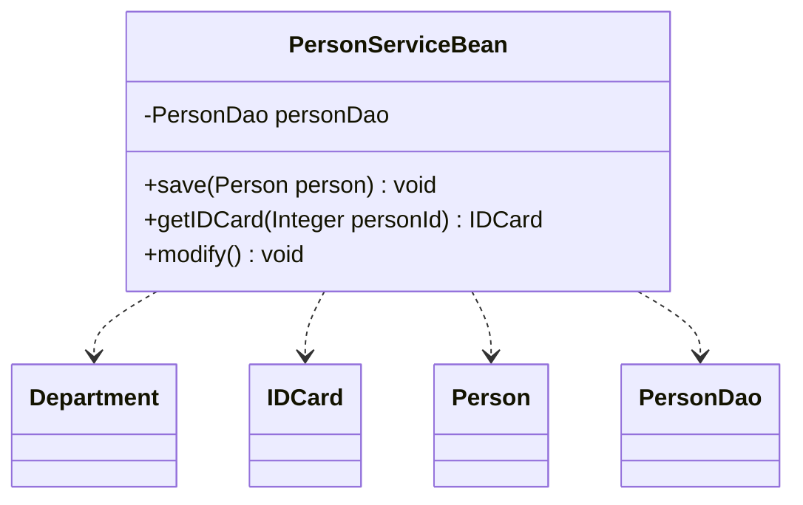
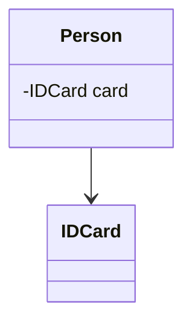
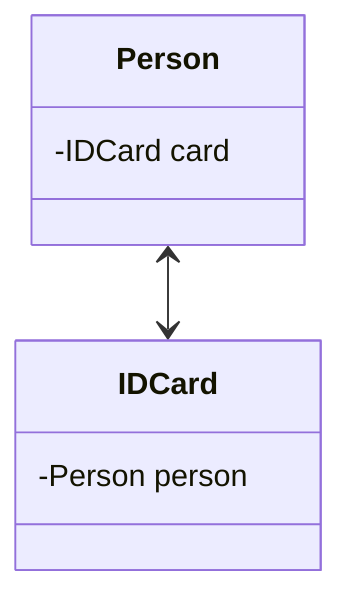
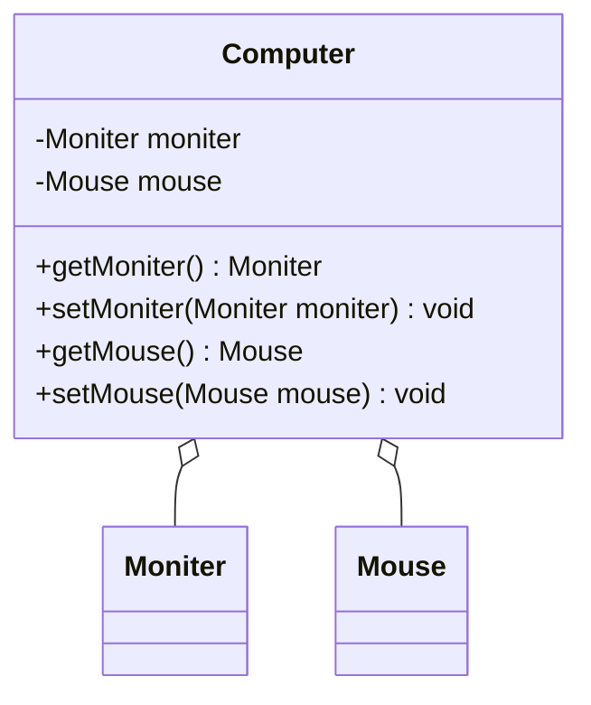
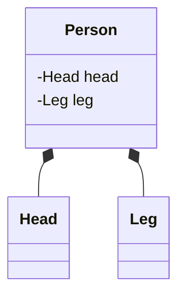
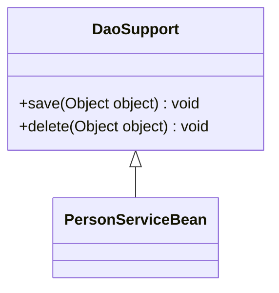
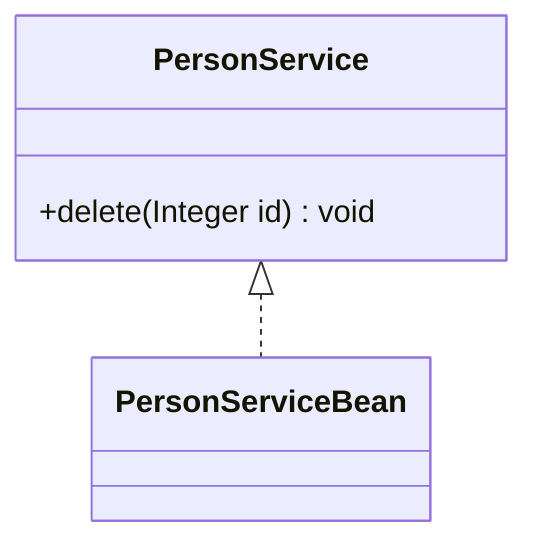

@include(@src/public/enhance/guidance/general/designpattern/designpattern-java/designpattern-java-guidance.md)

# 1.设计模式引导 {#1.}
@include(@src/public/enhance/guidance/general/designpattern/designpattern-java/chapter/designpattern-java-guidance-chapter1.md)
## 1.3.设计模式起源
    模式的概念
    在介绍设计模式的起源之前,需要先介绍一个位于设计模式之上的概念,这个概念就是模式,设计模式是模式的一个分支,模式起源于建筑工程领域,最开始由是建筑工程领域提出。Christopher Alexander博士及其研究团队用了约20年的时间,对住宅和周边环境进行了大量的调查研究和资料收集工作,发现人们对舒适住宅和城市环境存在一些共同的认同规律,并在他的著作中把这些认同规律归纳为253个模式,对每一个模式(Pattern)都从Context(前提条件)、Theme或Problem(目标问题)、 Solution(解决方案)三个方面进行了描述,并给出了从用户需求分析到建筑环境结构设计直至经典实例的过程模型。在他的另一部经典著作《建筑的永恒之道》中,他给出了关于模式的定义:每个模式都描述了一个在我们的环境中不断出现的问题,然后描述了该问题的解决方案的核心,通过这种方式,我们可以无数次地重用那些已有的成功的解决方案，无须再重复相同的工作。这个定义可以简单地用一句话表示:模式是在特定环境下人们解决某类重复出现问题的一套成功或有效的解决方案。

    Gof四人组与23中设计模式的诞生
    1990年,软件工程界开始关注ChristopherAlexander等在这一住宅、公共建筑与城市规划领域的重大突破。最早将模式的思想引入软件工程方法学的是1991-1992年以"四人组(Gang of Four，简称GoF,分别是Erich Gamma, Richard Helm, Ralph Johnson和John Vlissides)"自称的四位著名软件工程学者,他们在1994年归纳发表了23种在软件开发中使用频率较高的设计模式,旨在用模式来统一沟通面向对象方法在分析、设计和实现间的鸿沟。

    模式、软件模式、设计模式
    GoF将模式的概念引入软件工程领域,这标志着软件模式的诞生。软件模式(Software Patterns)是将模式的一般概念应用于软件开发领域,即软件开发的总体指导思路或参照样板。软件模式并非仅限于设计模式,还包括架构模式、分析模式和过程模式等。
## 1.4.设计模式是什么
    设计模式(Design Pattern)是一套被反复使用、多数人知晓的、经过分类编目的、代码设计经验的总结,使用设计模式是为了可重用代码、让代码更容易被他人理解并且保证代码可靠性。其本质是是对类的封装性、继承性和多态性，以及类的关联关系和组合关系的充分理解,也可以说其本质是对面向对象开发的充分理解。
## 1.5.设计模式作用
    设计模式以一种标准的方式供广大开发人员使用,为开发者的沟通提供了一套机制,帮助开发者更好地明白和更清晰地描述一段被给出的代码。

    设计模式同样让开发人员之间有一套"共享词汇",一旦懂这些词汇,开发人员之间沟通这些观念就很容易,也会促使那些不懂的程序员想开始学习设计模式。

    设计模式可以使开发人员更加方便简单复用成功的设计模式和结构

    设计模式可以使人们深入理解面向对象的设计思想,提高软件的开发效率,节约设计成本。
## 1.6.设计模式目的
​    代码重用性
    相同功能的代码,不用多次编写
​
    可读性
    编程规范性,便于其他程序员的阅读和理解

​    可扩展性
    当需要增加新的功能时,非常的方便,称为可维护

​    可靠性
    当我们增加新的功能后,对原来的功能没有影响

    解耦性
    使程序呈现高内聚，低耦合的特性
## 1.7.设计模式分类
    Gof提出的设计模式共23种,可以分为三种类型
    创建型模式
    单例模式、抽象工厂模式、建造者模式、工厂模式、原型模式。

    结构型模式
    适配器模式、桥接模式、装饰模式、组合模式、外观模式、享元模式、代理模式。

    行为型模式
    模版方法模式、命令模式、迭代器模式、观察者模式、中介者模式、备忘录模式、解释器模式、状态模式、策略模式、职责链模式、访问者模式。
# 2.类与类之间的六种关系 {#2.}
@include(@src/public/enhance/guidance/general/designpattern/designpattern-java/chapter/designpattern-java-guidance-chapter2.md)
## 2.3.依赖关系
### 2.3.1.依赖关系概述
    依赖关系(Dependence),只要是在类中用到了对方,那么它们之间就存在依赖关系。如果没有对方,无法通过编译。

    在代码中表现为
    a.类中用到了对方
    b.是类的成员属性
    c.是方法的返回类型
    d.是方法接收的参数类型
    e.方法中使用到
### 2.3.2.UML箭头及指向
    带箭头的虚线，指向被使用者
### 2.3.3.依赖关系类图

### 2.3.4.依赖关系代码
    Department.java
```java
@include(./projects/JavaSenior/designpattern/src/main/java/com/dragonsoft/designpattern/basic/classrelation/dependence/Department.java)
```
    IDCard.java
```java
@include(./projects/JavaSenior/designpattern/src/main/java/com/dragonsoft/designpattern/basic/classrelation/dependence/IDCard.java)
```
    Person.java
```java
@include(./projects/JavaSenior/designpattern/src/main/java/com/dragonsoft/designpattern/basic/classrelation/dependence/Person.java)
```
    PersonDao.java
```java
@include(./projects/JavaSenior/designpattern/src/main/java/com/dragonsoft/designpattern/basic/classrelation/dependence/PersonDao.java)
```
    PersonServiceBean.java
```java
@include(./projects/JavaSenior/designpattern/src/main/java/com/dragonsoft/designpattern/basic/classrelation/dependence/PersonServiceBean.java)
```
## 2.4.关联关系
### 2.4.1.关联关系概述
    关联关系(Association),实际上就是类与类之间的联系,它是依赖关系的特例。关联关系具有导航性:即双向关联关系或单向关联关系
### 2.4.2.UML箭头及指向
    带普通箭头的实线,拥有者指向被拥有者
### 2.4.3.关联关系类图
    单向关联关系

    双向关联关系

### 2.4.4.关联关系代码
    单向关联关系
    Person.java
```java
@include(./projects/JavaSenior/designpattern/src/main/java/com/dragonsoft/designpattern/basic/classrelation/association/singleone2one/Person.java)
```
    IDCard.java
```java
@include(./projects/JavaSenior/designpattern/src/main/java/com/dragonsoft/designpattern/basic/classrelation/association/singleone2one/IDCard.java)
```
    双向关联关系
    Person.java
```java
@include(./projects/JavaSenior/designpattern/src/main/java/com/dragonsoft/designpattern/basic/classrelation/association/doubleone2one/Person.java)
```
    IDCard.java
```java
@include(./projects/JavaSenior/designpattern/src/main/java/com/dragonsoft/designpattern/basic/classrelation/association/doubleone2one/IDCard.java)
```
## 2.5.聚合关系
### 2.5.1.聚合关系概述
    聚合关系(Aggregation)表示的是整体和部分的关系,整体与部分可以分开。聚合关系是关联关系的特例,所以它具有关联的导航性与多重性。
### 2.5.2.UML箭头及指向
    带空心菱形的实心线,菱形指向整体.
### 2.5.3.聚合关系类图

### 2.5.4.聚合关系代码
    Moniter.java
```java
@include(./projects/JavaSenior/designpattern/src/main/java/com/dragonsoft/designpattern/basic/classrelation/aggregation/Moniter.java)
```
    Mouse.java
```java
@include(./projects/JavaSenior/designpattern/src/main/java/com/dragonsoft/designpattern/basic/classrelation/aggregation/Mouse.java)
```
    Computer.java
```java
@include(./projects/JavaSenior/designpattern/src/main/java/com/dragonsoft/designpattern/basic/classrelation/aggregation/Computer.java)
```
## 2.6.组合关系
### 2.6.1.组合关系概述
    组合关系(Composite))表示的是整体和部分的关系,整体与部分不能分开。组合关系是关联关系的一种特例。比如说B类里面用到了一个A类,且这个A类是通过new创建的,也就是说当B类被初始化的时候A类也被初始化了。(耦合度比聚合高)
### 2.6.2.UML箭头及指向
    带实心菱形的实线,菱形指向整体
### 2.6.3.组合关系类图

### 2.6.4.组合关系代码
    Head.java
```java
@include(./projects/JavaSenior/designpattern/src/main/java/com/dragonsoft/designpattern/basic/classrelation/composition/Head.java)
```
    Leg.java
```java
@include(./projects/JavaSenior/designpattern/src/main/java/com/dragonsoft/designpattern/basic/classrelation/composition/Leg.java)
```
    Person.java
```java
@include(./projects/JavaSenior/designpattern/src/main/java/com/dragonsoft/designpattern/basic/classrelation/composition/Person.java)
```
## 2.7.泛化关系
### 2.7.1.泛化关系概述
    泛化关系(Generalization),泛化关系实际上就是继承关系,它是依赖关系的特例。如果A类继承了B类,我们就说A和B存在泛化关系。
### 2.7.2.UML箭头及指向
    带三角箭头的实线,子类指向父类
### 2.7.3.泛化关系类图

### 2.7.4.泛化关系代码
    DaoSupport.java
```java
@include(./projects/JavaSenior/designpattern/src/main/java/com/dragonsoft/designpattern/basic/classrelation/generalization/DaoSupport.java)
```
    PersonServiceBean.java
```java
@include(./projects/JavaSenior/designpattern/src/main/java/com/dragonsoft/designpattern/basic/classrelation/generalization/PersonServiceBean.java)
```
## 2.8.实现关系
### 2.8.1.实现关系概述
    实现关系(Realization),比如某个类实现了一个接口。它也是依赖关系的特例。
### 2.8.2.UML箭头及指向
    带三角箭头的虚线,箭头指向接口
### 2.8.3.实现关系类图

### 2.8.4.实现关系代码
    PersonService.java
```java
@include(./projects/JavaSenior/designpattern/src/main/java/com/dragonsoft/designpattern/basic/classrelation/realization/PersonService.java)
```
    PersonServiceBean.java
```java
@include(./projects/JavaSenior/designpattern/src/main/java/com/dragonsoft/designpattern/basic/classrelation/realization/PersonServiceBean.java)
```
## 2.9.六种关系耦合度强弱
    泛化 = 实现 > 组合 > 聚合 > 关联 > 依赖

# 3.设计模式七大原则 {#3.}
@include(@src/public/enhance/guidance/general/designpattern/designpattern-java/chapter/designpattern-java-guidance-chapter3.md)
## 3.3.单一职责原则
### 3.3.1.单一职责原则介绍
    概述
    一个类应该只负责一项职责

    为什么要遵循单一职责原则
    如类A负责两个不同职责: 职责1,职责2。当职责1需求变更而改变A时,可能造成职责2执行错误,所以需要将类A的粒度分解为A1,A2。

    注意事项
    a.降低类的复杂度,一个类只负责一项职责
    b.提高类的可读性,可维护性
    c.降低变更引起的风险
    d.通常情况下,我们应当遵守单一职责原则,只有逻辑足够简单,才可以在代码级违反单一职责原则,只有类中方法数量足够少,可以在方法级别保持单一职责原则,但是通常不要违反,因为很难确定代码以后是否会发生更改
### 3.3.2.单一职责原则代码
#### 3.3.2.1.不使用单一职责原则代码
```java
@include(./projects/JavaSenior/designpattern/src/main/java/com/dragonsoft/designpattern/basic/principles/single_reponsibility/SingleReponsibility1.java)
```
#### 3.3.2.2.类级别单一职责原则代码
```java
@include(./projects/JavaSenior/designpattern/src/main/java/com/dragonsoft/designpattern/basic/principles/single_reponsibility/SingleResponsibility2.java)
```
#### 3.3.2.3.方法别单一职责原则代码
```java
@include(./projects/JavaSenior/designpattern/src/main/java/com/dragonsoft/designpattern/basic/principles/single_reponsibility/SingleResponsibility3.java)
```
## 3.4.接口隔离原则
### 3.4.1.接口隔离原则介绍
    客户端不应该依赖它不需要的接口，即一个类对另一个类的依赖应该建立在最小的接口上
### 3.4.2.接口隔离原则代码
#### 3.4.2.1.不使用接口隔离原则代码
    Interface1.java
```java
@include(./projects/JavaSenior/designpattern/src/main/java/com/dragonsoft/designpattern/basic/principles/interface_segregation/Interface1.java)
```

    Interface1Client.java
```java
@include(./projects/JavaSenior/designpattern/src/main/java/com/dragonsoft/designpattern/basic/principles/interface_segregation/Interface1Client.java)
```
#### 3.4.2.2.使用接口隔离原则代码
    Interface2.java
```java
@include(./projects/JavaSenior/designpattern/src/main/java/com/dragonsoft/designpattern/basic/principles/interface_segregation/Interface2.java)
```

    Interface2Client.java
```java
@include(./projects/JavaSenior/designpattern/src/main/java/com/dragonsoft/designpattern/basic/principles/interface_segregation/Interface2Client.java)
```
## 3.5.依赖倒转原则
### 3.5.1.依赖倒转原则介绍
    概述
    a.高层模块不应该依赖底层模块,二者都应该依赖其抽象
    b.抽象不应该依赖细节，细节应该依赖抽象
    c.依赖反转的中心思想是面向结构编程
    d.依赖反转的思想是基于这样的理念:相对于细节的多变性，抽象的东西要稳定的多,以抽象为基础的架构比以细节为基础的架构要稳定的多,在java中,抽象的多指接口和抽象类,细节就是具体的实现类
    e.使用类或者接口的目的是制定规范,而不涉及任何具体的子类操作,把展现细节的任务交给他们的实现类去做

    依赖关系传递的三种方式
    a.接口传递
    b.构造方法传递
    c.setter方法传递

    注意事项
    a.底层模块尽量都要有抽象类或接口,或者两者都有，程序稳定性更好
    b.变量的声明类型尽量都是抽象类或者接口,这样我们的变量引用和实际对象之间,就存在一个缓冲层,有利于程序的优化和扩展
    c.继承是遵循里氏替换原则
### 3.5.2.依赖倒转原则代码
#### 3.5.2.1.不使用依赖倒转原则代码
```java
@include(./projects/JavaSenior/designpattern/src/main/java/com/dragonsoft/designpattern/basic/principles/dependenceinversion/NoUseDependenceDeliverTest.java)
```
##### 3.5.2.2.1.依赖倒转原则初体验
```java
@include(./projects/JavaSenior/designpattern/src/main/java/com/dragonsoft/designpattern/basic/principles/dependenceinversion/UseDependenceDeliverTest.java)
```
##### 3.5.2.2.2.通过接口传递依赖
```java
@include(./projects/JavaSenior/designpattern/src/main/java/com/dragonsoft/designpattern/basic/principles/dependenceinversion/DependenceDeliver1.java)
```
##### 3.5.2.2.3.通过构造方法传递依赖
```java
@include(./projects/JavaSenior/designpattern/src/main/java/com/dragonsoft/designpattern/basic/principles/dependenceinversion/DependenceDeliver2.java)
```
##### 3.5.2.2.4.通过setter()方法传递依赖
```java
@include(./projects/JavaSenior/designpattern/src/main/java/com/dragonsoft/designpattern/basic/principles/dependenceinversion/DependenceDeliver3.java)
```
## 3.6.里氏替换原则
### 3.6.1.里氏替换原则介绍
    概述
    里氏替换原则告诉我们,继承实际上让两个类耦合性增强了,在适当的情况下,可以通过聚合、组合、依赖来解决问题

    里氏替换原则是为了解决了什么问题
    a.正确的使用继承
    b.将原来的继承关系转换为继承基类+聚合/组合/依赖关系

    里氏替换原则详细说明
    a.所有能使用父类的地方,都能透明的使用该父类的子类对象
    即继承时,子类尽量不要重写父类的方法,除非迫不得已,如果非要重写,就再写一个更基础的类,把这个要重写的方法提到基类里面去
    b.遵循里氏替换原则,把继承这种高耦合的关系转换为聚合、组合、依赖这几种低耦合的关系
### 3.6.2.里氏替换原则代码
#### 3.6.2.1.不使用里氏替换原则代码
```java
@include(./projects/JavaSenior/designpattern/src/main/java/com/dragonsoft/designpattern/basic/principles/liskov_substitution/Liskov1.java)
```
#### 3.6.2.2.使用里氏替换原则代码
```java
@include(./projects/JavaSenior/designpattern/src/main/java/com/dragonsoft/designpattern/basic/principles/liskov_substitution/Liskov2.java)
```
## 3.7.开闭原则
### 3.7.1.开闭原则介绍
    概述
    对修改关闭,对扩展开放

    开闭原则详细说明
    a.开闭原则是编程中最基础，最为重要的原则
    b.一个软件实体,函数模块应该对扩展开放(对提供功能的一方而言),对修改关闭(对调用方/使用功能的一方而言,注意:不是对于客户端开放,客户端调用方法的使用方)。换而言之,当当增加一个新的类或者方法后,原先正在使用的代码不会收到丝毫影响,概括的说:对扩展开放,对修改关闭,即用抽象构建框架,用实现扩展细节
    c.当软件需要变化时,尽量通过扩展软件的实体行为来实现变化,而不是通过修改已有的代码去实现,简单的说,就是通过扩展而不是通过修改已有代码
    d.使用设计模式就是为了使代码更遵守开闭原则,是最重要的原则,其他的设计模式都是为了达到开闭原则的效果
### 3.7.2.开闭原则代码
#### 3.7.2.1.不使用开闭原则代码
```java
@include(./projects/JavaSenior/designpattern/src/main/java/com/dragonsoft/designpattern/basic/principles/open_close/OCPTest1.java)
```
#### 3.7.2.2.使用开闭原则代码
```java
@include(./projects/JavaSenior/designpattern/src/main/java/com/dragonsoft/designpattern/basic/principles/open_close/OCPTest2.java)
```
## 3.8.迪米特法则
### 3.8.1.迪米特法则介绍
    概述
    只与直接的朋友通信，最少知道原则,避免与非直接朋友的耦合,对自己依赖的类知道的越少越好,对于被依赖的类不管多复杂,都尽量将逻辑封在内部。需要注意的是降低类之间的耦合,只是减少不必要的耦合,并不是要求完全解除耦合

    迪米特法则详细说明
    a.一个对象应该对其他对象保持最少的了解
    b.类与类关系越密切,耦合度越大
    c.迪米特法则又称最少知道原则,即一个类对自己依赖的类知道的越少越好,也就是说,对于被依赖的类不管多么复杂,都应该尽量将逻辑封装在类的内部,除了对外提供public方法之外,不对外泄露任何信息
    e.迪米特方法还有个更简单的定义: 只与直接朋友通信
        直接朋友:每个对象都会与其他对象有耦合关系,只要两个对象之间有耦合关系,我们就直接说这两个对象之间是朋友关系。耦合的方式有很多依赖、关联、组合、聚合，其中我们将出现在成员变量,方法参数,方法返回值这几个位置中类称为直接朋友,而出现在局部变量中的类不是直接朋友,也就是说,陌生的类最好不要以局部变量的方式出现在类的内部

    直接朋友和间接朋友
    直接朋友:出现在返回值、成员变量、方法参数中的类
    间接朋友:出现在方法中作为局部变量的类
    class A{
        public void fun(){}
    }
    class C{
        public void fun(){}
    }
    class B{
        //C就是B的直接朋友:出现在成员变量位置
        private C c = new C();
        //C就是B的直接朋友:出现在方法参数位置
        public void test1(C c){
            c.fun();
        }
        //C就是B的直接朋友:出现在返回值位置
        public C test3(){
            return null;
        }
        public void test4(){
            //A就是B的间接朋友:出现在方法中作为局部变量位置
            A a = new A();
            a.fun();
        }
    }
### 3.8.2.迪米特法则代码
#### 3.8.2.1.不使用迪米特法则代码
```java
@include(./projects/JavaSenior/designpattern/src/main/java/com/dragonsoft/designpattern/basic/principles/demeter/Demeter1.java)
```
#### 3.8.2.2.使用迪米特法则代码
```java
@include(./projects/JavaSenior/designpattern/src/main/java/com/dragonsoft/designpattern/basic/principles/demeter/Demeter2.java)
```
## 3.9.合成复用原则
### 3.9.1.合成复用原则介绍
    概述
    尽量使用合成/聚合方法,避免使用继承

    使用合成复用原则有什么效果
    当A继承B后,A拥有B所有的方法,使用合成复用改进后,A可以调用B中的方法,不用的方法就不出现在B中了

    合成复用原则与继承原则关系
    在编程中,推荐尽量使用合成复用原则来代替继承,但是反过来,可以使用合成复用原则解决的问题也可以使用继承解决
### 3.9.2.合成复用原则代码
#### 3.9.2.1.不使用合成复用原则代码
```java
@include(./projects/JavaSenior/designpattern/src/main/java/com/dragonsoft/designpattern/basic/principles/compositereuse/CompositeReuse1.java)
```
#### 3.9.2.2.使用合成复用原则代码
```java
@include(./projects/JavaSenior/designpattern/src/main/java/com/dragonsoft/designpattern/basic/principles/compositereuse/CompositeReuse2.java) 
```
<HideSideBar/>
