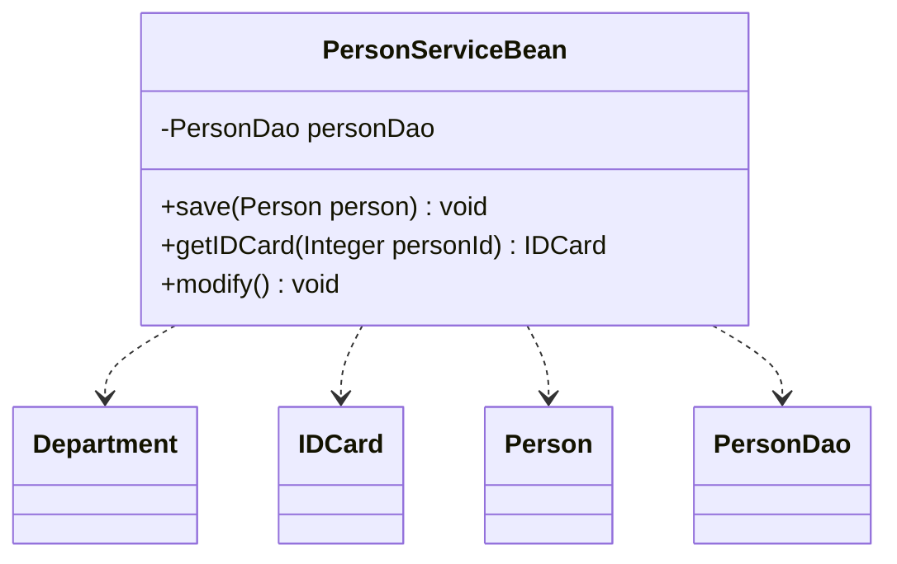
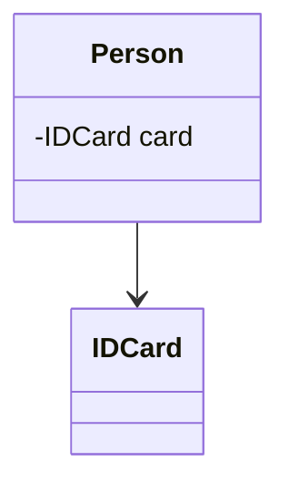
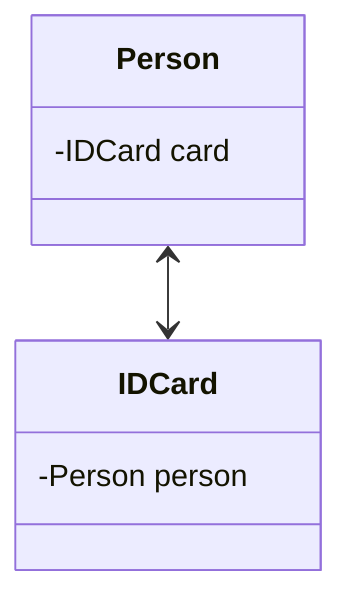
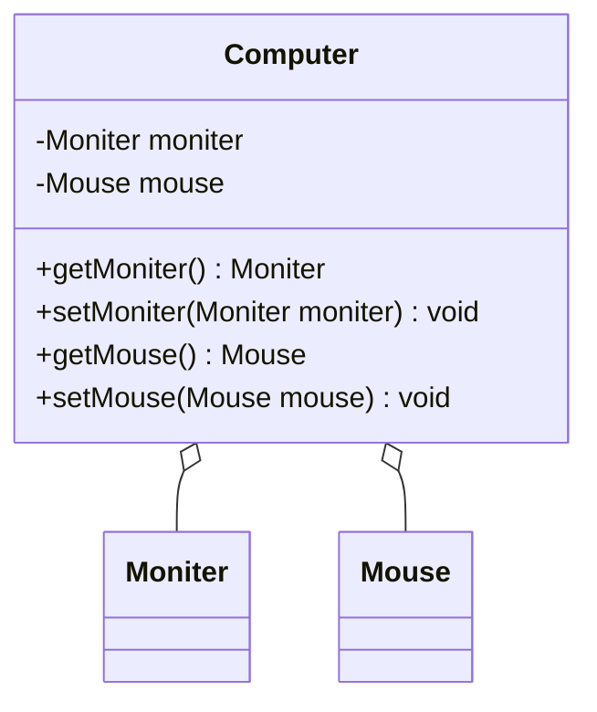
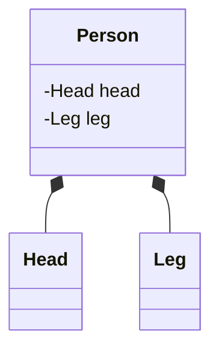
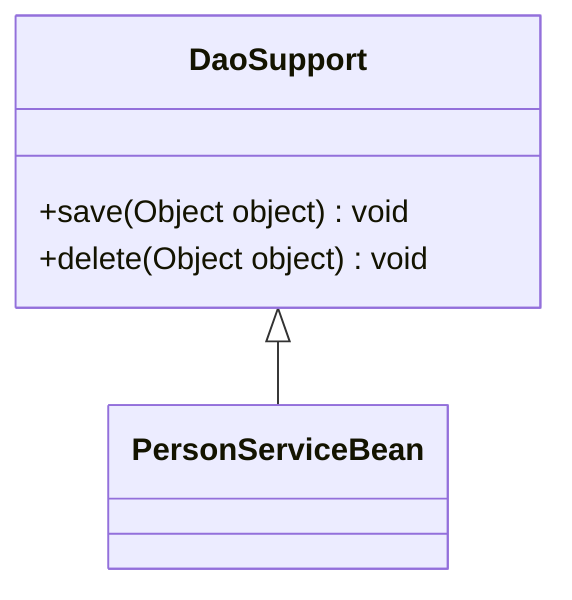
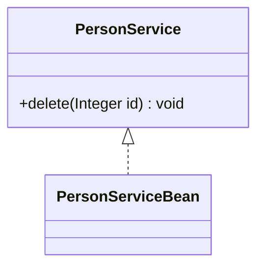
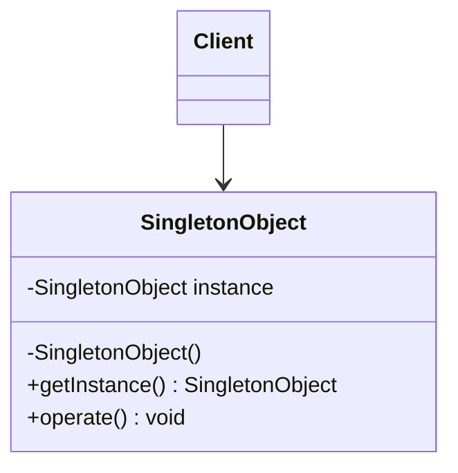

@include(@src/public/enhance/guidance/general/designpattern/designpattern-java/designpattern-java-guidance.md)

# 1.设计模式引导 {#1.}
@include(@src/public/enhance/guidance/general/designpattern/designpattern-java/chapter/designpattern-java-guidance-chapter1.md)
## 1.3.设计模式起源
    模式的概念
    在介绍设计模式的起源之前,需要先介绍一个位于设计模式之上的概念,这个概念就是模式,设计模式是模式的一个分支,模式起源于建筑工程领域,最开始由是建筑工程领域提出。Christopher Alexander博士及其研究团队用了约20年的时间,对住宅和周边环境进行了大量的调查研究和资料收集工作,发现人们对舒适住宅和城市环境存在一些共同的认同规律,并在他的著作中把这些认同规律归纳为253个模式,对每一个模式(Pattern)都从Context(前提条件)、Theme或Problem(目标问题)、 Solution(解决方案)三个方面进行了描述,并给出了从用户需求分析到建筑环境结构设计直至经典实例的过程模型。在他的另一部经典著作《建筑的永恒之道》中,他给出了关于模式的定义:每个模式都描述了一个在我们的环境中不断出现的问题,然后描述了该问题的解决方案的核心,通过这种方式,我们可以无数次地重用那些已有的成功的解决方案，无须再重复相同的工作。这个定义可以简单地用一句话表示:模式是在特定环境下人们解决某类重复出现问题的一套成功或有效的解决方案。

    Gof四人组与23中设计模式的诞生
    1990年,软件工程界开始关注ChristopherAlexander等在这一住宅、公共建筑与城市规划领域的重大突破。最早将模式的思想引入软件工程方法学的是1991-1992年以"四人组(Gang of Four，简称GoF,分别是Erich Gamma, Richard Helm, Ralph Johnson和John Vlissides)"自称的四位著名软件工程学者,他们在1994年归纳发表了23种在软件开发中使用频率较高的设计模式,旨在用模式来统一沟通面向对象方法在分析、设计和实现间的鸿沟。

    模式、软件模式、设计模式
    GoF将模式的概念引入软件工程领域,这标志着软件模式的诞生。软件模式(Software Patterns)是将模式的一般概念应用于软件开发领域,即软件开发的总体指导思路或参照样板。软件模式并非仅限于设计模式,还包括架构模式、分析模式和过程模式等。
## 1.4.设计模式是什么
    设计模式(Design Pattern)是一套被反复使用、多数人知晓的、经过分类编目的、代码设计经验的总结,使用设计模式是为了可重用代码、让代码更容易被他人理解并且保证代码可靠性。其本质是是对类的封装性、继承性和多态性，以及类的关联关系和组合关系的充分理解,也可以说其本质是对面向对象开发的充分理解。
## 1.5.设计模式作用
    设计模式以一种标准的方式供广大开发人员使用,为开发者的沟通提供了一套机制,帮助开发者更好地明白和更清晰地描述一段被给出的代码。

    设计模式同样让开发人员之间有一套"共享词汇",一旦懂这些词汇,开发人员之间沟通这些观念就很容易,也会促使那些不懂的程序员想开始学习设计模式。

    设计模式可以使开发人员更加方便简单复用成功的设计模式和结构

    设计模式可以使人们深入理解面向对象的设计思想,提高软件的开发效率,节约设计成本。
## 1.6.设计模式目的
​    代码重用性
    相同功能的代码,不用多次编写
​
    可读性
    编程规范性,便于其他程序员的阅读和理解

​    可扩展性
    当需要增加新的功能时,非常的方便,称为可维护

​    可靠性
    当我们增加新的功能后,对原来的功能没有影响

    解耦性
    使程序呈现高内聚，低耦合的特性
## 1.7.设计模式分类
    Gof提出的设计模式共23种,可以分为三种类型
    创建型模式(共5种)
    单例模式、抽象工厂模式、建造者模式、工厂模式、原型模式。

    结构型模式(共7种)
    适配器模式、桥接模式、装饰模式、组合模式、外观模式、享元模式、代理模式。

    行为型模式(共11种)
    模版方法模式、命令模式、迭代器模式、观察者模式、中介者模式、备忘录模式、解释器模式、状态模式、策略模式、职责链模式、访问者模式。
# 2.类与类之间的六种关系 {#2.}
@include(@src/public/enhance/guidance/general/designpattern/designpattern-java/chapter/designpattern-java-guidance-chapter2.md)
## 2.3.依赖关系
### 2.3.1.依赖关系概述
    依赖关系(Dependence),只要是在类中用到了对方,那么它们之间就存在依赖关系。如果没有对方,无法通过编译。

    在代码中表现为
    a.类中用到了对方
    b.是类的成员属性
    c.是方法的返回类型
    d.是方法接收的参数类型
    e.方法中使用到
### 2.3.2.UML箭头及指向
    带箭头的虚线，指向被使用者
### 2.3.3.依赖关系类图

### 2.3.4.依赖关系代码
    Department.java
```java
@include(./projects/JavaSenior/designpattern/src/main/java/com/dragonsoft/designpattern/basic/classrelation/dependence/Department.java)
```
    IDCard.java
```java
@include(./projects/JavaSenior/designpattern/src/main/java/com/dragonsoft/designpattern/basic/classrelation/dependence/IDCard.java)
```
    Person.java
```java
@include(./projects/JavaSenior/designpattern/src/main/java/com/dragonsoft/designpattern/basic/classrelation/dependence/Person.java)
```
    PersonDao.java
```java
@include(./projects/JavaSenior/designpattern/src/main/java/com/dragonsoft/designpattern/basic/classrelation/dependence/PersonDao.java)
```
    PersonServiceBean.java
```java
@include(./projects/JavaSenior/designpattern/src/main/java/com/dragonsoft/designpattern/basic/classrelation/dependence/PersonServiceBean.java)
```
## 2.4.关联关系
### 2.4.1.关联关系概述
    关联关系(Association),实际上就是类与类之间的联系,它是依赖关系的特例。关联关系具有导航性:即双向关联关系或单向关联关系
### 2.4.2.UML箭头及指向
    带普通箭头的实线,拥有者指向被拥有者
### 2.4.3.关联关系类图
    单向关联关系

    双向关联关系

### 2.4.4.关联关系代码
    单向关联关系
    Person.java
```java
@include(./projects/JavaSenior/designpattern/src/main/java/com/dragonsoft/designpattern/basic/classrelation/association/singleone2one/Person.java)
```
    IDCard.java
```java
@include(./projects/JavaSenior/designpattern/src/main/java/com/dragonsoft/designpattern/basic/classrelation/association/singleone2one/IDCard.java)
```
    双向关联关系
    Person.java
```java
@include(./projects/JavaSenior/designpattern/src/main/java/com/dragonsoft/designpattern/basic/classrelation/association/doubleone2one/Person.java)
```
    IDCard.java
```java
@include(./projects/JavaSenior/designpattern/src/main/java/com/dragonsoft/designpattern/basic/classrelation/association/doubleone2one/IDCard.java)
```
## 2.5.聚合关系
### 2.5.1.聚合关系概述
    聚合关系(Aggregation)表示的是整体和部分的关系,整体与部分可以分开。聚合关系是关联关系的特例,所以它具有关联的导航性与多重性。
### 2.5.2.UML箭头及指向
    带空心菱形的实心线,菱形指向整体.
### 2.5.3.聚合关系类图

### 2.5.4.聚合关系代码
    Moniter.java
```java
@include(./projects/JavaSenior/designpattern/src/main/java/com/dragonsoft/designpattern/basic/classrelation/aggregation/Moniter.java)
```
    Mouse.java
```java
@include(./projects/JavaSenior/designpattern/src/main/java/com/dragonsoft/designpattern/basic/classrelation/aggregation/Mouse.java)
```
    Computer.java
```java
@include(./projects/JavaSenior/designpattern/src/main/java/com/dragonsoft/designpattern/basic/classrelation/aggregation/Computer.java)
```
## 2.6.组合关系
### 2.6.1.组合关系概述
    组合关系(Composite))表示的是整体和部分的关系,整体与部分不能分开。组合关系是关联关系的一种特例。比如说B类里面用到了一个A类,且这个A类是通过new创建的,也就是说当B类被初始化的时候A类也被初始化了。(耦合度比聚合高)
### 2.6.2.UML箭头及指向
    带实心菱形的实线,菱形指向整体
### 2.6.3.组合关系类图

### 2.6.4.组合关系代码
    Head.java
```java
@include(./projects/JavaSenior/designpattern/src/main/java/com/dragonsoft/designpattern/basic/classrelation/composition/Head.java)
```
    Leg.java
```java
@include(./projects/JavaSenior/designpattern/src/main/java/com/dragonsoft/designpattern/basic/classrelation/composition/Leg.java)
```
    Person.java
```java
@include(./projects/JavaSenior/designpattern/src/main/java/com/dragonsoft/designpattern/basic/classrelation/composition/Person.java)
```
## 2.7.泛化关系
### 2.7.1.泛化关系概述
    泛化关系(Generalization),泛化关系实际上就是继承关系,它是依赖关系的特例。如果A类继承了B类,我们就说A和B存在泛化关系。
### 2.7.2.UML箭头及指向
    带三角箭头的实线,子类指向父类
### 2.7.3.泛化关系类图

### 2.7.4.泛化关系代码
    DaoSupport.java
```java
@include(./projects/JavaSenior/designpattern/src/main/java/com/dragonsoft/designpattern/basic/classrelation/generalization/DaoSupport.java)
```
    PersonServiceBean.java
```java
@include(./projects/JavaSenior/designpattern/src/main/java/com/dragonsoft/designpattern/basic/classrelation/generalization/PersonServiceBean.java)
```
## 2.6.实现关系
### 2.6.1.实现关系概述
    实现关系(Realization),比如某个类实现了一个接口。它也是依赖关系的特例。
### 2.6.2.UML箭头及指向
    带三角箭头的虚线,箭头指向接口
### 2.6.3.实现关系类图

### 2.6.4.实现关系代码
    PersonService.java
```java
@include(./projects/JavaSenior/designpattern/src/main/java/com/dragonsoft/designpattern/basic/classrelation/realization/PersonService.java)
```
    PersonServiceBean.java
```java
@include(./projects/JavaSenior/designpattern/src/main/java/com/dragonsoft/designpattern/basic/classrelation/realization/PersonServiceBean.java)
```
## 2.7.六种关系耦合度强弱
    泛化 = 实现 > 组合 > 聚合 > 关联 > 依赖

# 3.设计模式七大原则 {#3.}
@include(@src/public/enhance/guidance/general/designpattern/designpattern-java/chapter/designpattern-java-guidance-chapter3.md)
## 3.3.单一职责原则
### 3.3.1.单一职责原则介绍
    概述
    一个类应该只负责一项职责

    为什么要遵循单一职责原则
    如类A负责两个不同职责: 职责1,职责2。当职责1需求变更而改变A时,可能造成职责2执行错误,所以需要将类A的粒度分解为A1,A2。

    注意事项
    a.降低类的复杂度,一个类只负责一项职责
    b.提高类的可读性,可维护性
    c.降低变更引起的风险
    d.通常情况下,我们应当遵守单一职责原则,只有逻辑足够简单,才可以在代码级违反单一职责原则,只有类中方法数量足够少,可以在方法级别保持单一职责原则,但是通常不要违反,因为很难确定代码以后是否会发生更改
### 3.3.2.单一职责原则代码
#### 3.3.2.1.不使用单一职责原则代码
```java
@include(./projects/JavaSenior/designpattern/src/main/java/com/dragonsoft/designpattern/basic/principles/single_reponsibility/SingleReponsibility1.java)
```
#### 3.3.2.2.使用单一职责原则代码
##### 3.3.2.2.1.类级别单一职责原则代码
```java
@include(./projects/JavaSenior/designpattern/src/main/java/com/dragonsoft/designpattern/basic/principles/single_reponsibility/SingleResponsibility2.java)
```
##### 3.3.2.2.2.方法别单一职责原则代码
```java
@include(./projects/JavaSenior/designpattern/src/main/java/com/dragonsoft/designpattern/basic/principles/single_reponsibility/SingleResponsibility3.java)
```
## 3.4.接口隔离原则
### 3.4.1.接口隔离原则介绍
    客户端不应该依赖它不需要的接口，即一个类对另一个类的依赖应该建立在最小的接口上
### 3.4.2.接口隔离原则代码
#### 3.4.2.1.不使用接口隔离原则代码
    Interface1.java
```java
@include(./projects/JavaSenior/designpattern/src/main/java/com/dragonsoft/designpattern/basic/principles/interface_segregation/Interface1.java)
```

    Interface1Client.java
```java
@include(./projects/JavaSenior/designpattern/src/main/java/com/dragonsoft/designpattern/basic/principles/interface_segregation/Interface1Client.java)
```
#### 3.4.2.2.使用接口隔离原则代码
    Interface2.java
```java
@include(./projects/JavaSenior/designpattern/src/main/java/com/dragonsoft/designpattern/basic/principles/interface_segregation/Interface2.java)
```

    Interface2Client.java
```java
@include(./projects/JavaSenior/designpattern/src/main/java/com/dragonsoft/designpattern/basic/principles/interface_segregation/Interface2Client.java)
```
## 3.5.依赖倒转原则
### 3.5.1.依赖倒转原则介绍
    概述
    a.高层模块不应该依赖底层模块,二者都应该依赖其抽象
    b.抽象不应该依赖细节，细节应该依赖抽象
    c.依赖反转的中心思想是面向结构编程
    d.依赖反转的思想是基于这样的理念:相对于细节的多变性，抽象的东西要稳定的多,以抽象为基础的架构比以细节为基础的架构要稳定的多,在java中,抽象的多指接口和抽象类,细节就是具体的实现类
    e.使用类或者接口的目的是制定规范,而不涉及任何具体的子类操作,把展现细节的任务交给他们的实现类去做

    依赖关系传递的三种方式
    a.接口传递
    b.构造方法传递
    c.setter方法传递

    注意事项
    a.底层模块尽量都要有抽象类或接口,或者两者都有，程序稳定性更好
    b.变量的声明类型尽量都是抽象类或者接口,这样我们的变量引用和实际对象之间,就存在一个缓冲层,有利于程序的优化和扩展
    c.继承是遵循里氏替换原则
### 3.5.2.依赖倒转原则代码
#### 3.5.2.1.不使用依赖倒转原则代码
```java
@include(./projects/JavaSenior/designpattern/src/main/java/com/dragonsoft/designpattern/basic/principles/dependenceinversion/NoUseDependenceDeliverTest.java)
```
#### 3.5.2.2.使用依赖倒转原则代码
##### 3.5.2.2.1.依赖倒转原则简单案例
```java
@include(./projects/JavaSenior/designpattern/src/main/java/com/dragonsoft/designpattern/basic/principles/dependenceinversion/UseDependenceDeliverTest.java)
```
##### 3.5.2.2.2.通过接口传递依赖
```java
@include(./projects/JavaSenior/designpattern/src/main/java/com/dragonsoft/designpattern/basic/principles/dependenceinversion/DependenceDeliver1.java)
```
##### 3.5.2.2.3.通过构造方法传递依赖
```java
@include(./projects/JavaSenior/designpattern/src/main/java/com/dragonsoft/designpattern/basic/principles/dependenceinversion/DependenceDeliver2.java)
```
##### 3.5.2.2.4.通过setter()方法传递依赖
```java
@include(./projects/JavaSenior/designpattern/src/main/java/com/dragonsoft/designpattern/basic/principles/dependenceinversion/DependenceDeliver3.java)
```
## 3.6.里氏替换原则
### 3.6.1.里氏替换原则介绍
    概述
    里氏替换原则告诉我们,继承实际上让两个类耦合性增强了,在适当的情况下,可以通过聚合、组合、依赖来解决问题

    里氏替换原则是为了解决了什么问题
    a.正确的使用继承
    b.将原来的继承关系转换为继承基类+聚合/组合/依赖关系

    里氏替换原则详细说明
    a.所有能使用父类的地方,都能透明的使用该父类的子类对象
    即继承时,子类尽量不要重写父类的方法,除非迫不得已,如果非要重写,就再写一个更基础的类,把这个要重写的方法提到基类里面去
    b.遵循里氏替换原则,把继承这种高耦合的关系转换为聚合、组合、依赖这几种低耦合的关系
### 3.6.2.里氏替换原则代码
#### 3.6.2.1.不使用里氏替换原则代码
```java
@include(./projects/JavaSenior/designpattern/src/main/java/com/dragonsoft/designpattern/basic/principles/liskov_substitution/Liskov1.java)
```
#### 3.6.2.2.使用里氏替换原则代码
```java
@include(./projects/JavaSenior/designpattern/src/main/java/com/dragonsoft/designpattern/basic/principles/liskov_substitution/Liskov2.java)
```
## 3.7.开闭原则
### 3.7.1.开闭原则介绍
    概述
    对修改关闭,对扩展开放

    开闭原则详细说明
    a.开闭原则是编程中最基础，最为重要的原则
    b.一个软件实体,函数模块应该对扩展开放(对提供功能的一方而言),对修改关闭(对调用方/使用功能的一方而言,注意:不是对于客户端开放,客户端调用方法的使用方)。换而言之,当当增加一个新的类或者方法后,原先正在使用的代码不会收到丝毫影响,概括的说:对扩展开放,对修改关闭,即用抽象构建框架,用实现扩展细节
    c.当软件需要变化时,尽量通过扩展软件的实体行为来实现变化,而不是通过修改已有的代码去实现,简单的说,就是通过扩展而不是通过修改已有代码
    d.使用设计模式就是为了使代码更遵守开闭原则,是最重要的原则,其他的设计模式都是为了达到开闭原则的效果
### 3.7.2.开闭原则代码
#### 3.7.2.1.不使用开闭原则代码
```java
@include(./projects/JavaSenior/designpattern/src/main/java/com/dragonsoft/designpattern/basic/principles/open_close/OCPTest1.java)
```
#### 3.7.2.2.使用开闭原则代码
```java
@include(./projects/JavaSenior/designpattern/src/main/java/com/dragonsoft/designpattern/basic/principles/open_close/OCPTest2.java)
```
## 3.8.迪米特法则
### 3.8.1.迪米特法则介绍
    概述
    只与直接的朋友通信，最少知道原则,避免与非直接朋友的耦合,对自己依赖的类知道的越少越好,对于被依赖的类不管多复杂,都尽量将逻辑封在内部。需要注意的是降低类之间的耦合,只是减少不必要的耦合,并不是要求完全解除耦合

    迪米特法则详细说明
    a.一个对象应该对其他对象保持最少的了解
    b.类与类关系越密切,耦合度越大
    c.迪米特法则又称最少知道原则,即一个类对自己依赖的类知道的越少越好,也就是说,对于被依赖的类不管多么复杂,都应该尽量将逻辑封装在类的内部,除了对外提供public方法之外,不对外泄露任何信息
    e.迪米特方法还有个更简单的定义: 只与直接朋友通信
        直接朋友:每个对象都会与其他对象有耦合关系,只要两个对象之间有耦合关系,我们就直接说这两个对象之间是朋友关系。耦合的方式有很多依赖、关联、组合、聚合，其中我们将出现在成员变量,方法参数,方法返回值这几个位置中类称为直接朋友,而出现在局部变量中的类不是直接朋友,也就是说,陌生的类最好不要以局部变量的方式出现在类的内部

    直接朋友和间接朋友
    直接朋友:出现在返回值、成员变量、方法参数中的类
    间接朋友:出现在方法中作为局部变量的类
    class A{
        public void fun(){}
    }
    class C{
        public void fun(){}
    }
    class B{
        //C就是B的直接朋友:出现在成员变量位置
        private C c = new C();
        //C就是B的直接朋友:出现在方法参数位置
        public void test1(C c){
            c.fun();
        }
        //C就是B的直接朋友:出现在返回值位置
        public C test3(){
            return null;
        }
        public void test4(){
            //A就是B的间接朋友:出现在方法中作为局部变量位置
            A a = new A();
            a.fun();
        }
    }
### 3.8.2.迪米特法则代码
#### 3.8.2.1.不使用迪米特法则代码
```java
@include(./projects/JavaSenior/designpattern/src/main/java/com/dragonsoft/designpattern/basic/principles/demeter/Demeter1.java)
```
#### 3.8.2.2.使用迪米特法则代码
```java
@include(./projects/JavaSenior/designpattern/src/main/java/com/dragonsoft/designpattern/basic/principles/demeter/Demeter2.java)
```
## 3.9.合成复用原则
### 3.9.1.合成复用原则介绍
    概述
    尽量使用合成/聚合方法,避免使用继承

    使用合成复用原则有什么效果
    当A继承B后,A拥有B所有的方法,使用合成复用改进后,A可以调用B中的方法,不用的方法就不出现在B中了

    合成复用原则与继承原则关系
    在编程中,推荐尽量使用合成复用原则来代替继承,但是反过来,可以使用合成复用原则解决的问题也可以使用继承解决
### 3.9.2.合成复用原则代码
#### 3.9.2.1.不使用合成复用原则代码
```java
@include(./projects/JavaSenior/designpattern/src/main/java/com/dragonsoft/designpattern/basic/principles/compositereuse/CompositeReuse1.java)
```
#### 3.9.2.2.使用合成复用原则代码
```java
@include(./projects/JavaSenior/designpattern/src/main/java/com/dragonsoft/designpattern/basic/principles/compositereuse/CompositeReuse2.java)
```

# 4.创建型模式-单例模式 {#4.}
@include(@src/public/enhance/guidance/general/designpattern/designpattern-java/chapter/designpattern-java-guidance-chapter4.md)
## 4.3.简介
    单例模式(Singleton Pattern)是一种创建型设计模式,又名单件模式或单态模式,目的是为了保证一个类只有一个实例对象,并提供一个获取该实例对象的全局方法,通过这个全局方法创建的所有实例对象都是同一个实例对象,这个类称为单例类。单例模式的要点有三个:一是某个类只能有一个实例对象;二是这个类必须自行创建这个实例对象;三是这个类必须自行向整个系统提供这个实例。
## 4.4.模型
### 4.4.1.模型类图

### 4.4.2.模型代码
```java
@include(./projects/JavaSenior/designpattern/src/main/java/com/dragonsoft/designpattern/create/singleton/model/SingletonObject.java)
```
## 4.5.示例代码
    Singleton.java
```java
@include(./projects/JavaSenior/designpattern/src/main/java/com/dragonsoft/designpattern/create/singleton/Singleton.java)
```
    Client.java
```java
@include(./projects/JavaSenior/designpattern/src/main/java/com/dragonsoft/designpattern/create/singleton/Cli.java)
```
## 4.6.经典应用场景
    单例模式应用的场景一般发现在以下条件下
    资源共享的情况下: 避免由于资源操作时导致的性能或损耗等
    控制资源的情况下: 方便资源之间的互相通信

    具体应用场景
    a.Windows的Task Manager(任务管理器),在一个Windows系统中只有一个Task Manager实例
    b.Windows的Recycle Bin(回收站),在一个Windows系统中只有一个Recycle Bin实例
    c.网站的计数器,一般也是采用单例模式实现,否则难以同步
    d.应用程序的日志应用,一般都何用单例模式实现,这一般是由于共享的日志文件一直处于打开状态,因为只能有一个实例去操作,否则无法实现内容追加
    e.数据库连接池的设计一般也是采用单例模式,因为数据库连接是一种数据库资源。数据库软件系统中使用数据库连接池,主要是节省打开或者关闭数据库连接所引起的效率损耗,这种效率上的损耗还是非常昂贵的,因为何用单例模式来维护,就可以大大降低这种损耗
    f.多线程的线程池的设计一般也是采用单例模式,这是由于线程池要方便对池中的线程进行控制
    g.操作系统的文件系统,也是大的单例模式实现的具体例子,一个操作系统只能有一个文件系统
## 4.7.在开源框架中的应用场景
    JDK8#java.lang.Runtime(饿汉式)
```java
/*
 * Copyright (c) 1995, 2013, Oracle and/or its affiliates. All rights reserved.
 * ORACLE PROPRIETARY/CONFIDENTIAL. Use is subject to license terms.
 *
 *
 *
 *
 *
 *
 *
 *
 *
 *
 *
 *
 *
 *
 *
 *
 *
 *
 *
 *
 */

package java.lang;

import java.io.*;
import java.util.StringTokenizer;
import sun.reflect.CallerSensitive;
import sun.reflect.Reflection;

/**
 * Every Java application has a single instance of class
 * <code>Runtime</code> that allows the application to interface with
 * the environment in which the application is running. The current
 * runtime can be obtained from the <code>getRuntime</code> method.
 * <p>
 * An application cannot create its own instance of this class.
 *
 * @author  unascribed
 * @see     java.lang.Runtime#getRuntime()
 * @since   JDK1.0
 */

public class Runtime {
    private static Runtime currentRuntime = new Runtime();

    /**
     * Returns the runtime object associated with the current Java application.
     * Most of the methods of class <code>Runtime</code> are instance
     * methods and must be invoked with respect to the current runtime object.
     *
     * @return  the <code>Runtime</code> object associated with the current
     *          Java application.
     */
    public static Runtime getRuntime() {
        return currentRuntime;
    }

    /** Don't let anyone else instantiate this class */
    private Runtime() {}

    /**
     * Terminates the currently running Java virtual machine by initiating its
     * shutdown sequence.  This method never returns normally.  The argument
     * serves as a status code; by convention, a nonzero status code indicates
     * abnormal termination.
     *
     * <p> The virtual machine's shutdown sequence consists of two phases.  In
     * the first phase all registered {@link #addShutdownHook shutdown hooks},
     * if any, are started in some unspecified order and allowed to run
     * concurrently until they finish.  In the second phase all uninvoked
     * finalizers are run if {@link #runFinalizersOnExit finalization-on-exit}
     * has been enabled.  Once this is done the virtual machine {@link #halt
     * halts}.
     *
     * <p> If this method is invoked after the virtual machine has begun its
     * shutdown sequence then if shutdown hooks are being run this method will
     * block indefinitely.  If shutdown hooks have already been run and on-exit
     * finalization has been enabled then this method halts the virtual machine
     * with the given status code if the status is nonzero; otherwise, it
     * blocks indefinitely.
     *
     * <p> The <tt>{@link System#exit(int) System.exit}</tt> method is the
     * conventional and convenient means of invoking this method. <p>
     *
     * @param  status
     *         Termination status.  By convention, a nonzero status code
     *         indicates abnormal termination.
     *
     * @throws SecurityException
     *         If a security manager is present and its <tt>{@link
     *         SecurityManager#checkExit checkExit}</tt> method does not permit
     *         exiting with the specified status
     *
     * @see java.lang.SecurityException
     * @see java.lang.SecurityManager#checkExit(int)
     * @see #addShutdownHook
     * @see #removeShutdownHook
     * @see #runFinalizersOnExit
     * @see #halt(int)
     */
    public void exit(int status) {
        SecurityManager security = System.getSecurityManager();
        if (security != null) {
            security.checkExit(status);
        }
        Shutdown.exit(status);
    }

    /**
     * Registers a new virtual-machine shutdown hook.
     *
     * <p> The Java virtual machine <i>shuts down</i> in response to two kinds
     * of events:
     *
     *   <ul>
     *
     *   <li> The program <i>exits</i> normally, when the last non-daemon
     *   thread exits or when the <tt>{@link #exit exit}</tt> (equivalently,
     *   {@link System#exit(int) System.exit}) method is invoked, or
     *
     *   <li> The virtual machine is <i>terminated</i> in response to a
     *   user interrupt, such as typing <tt>^C</tt>, or a system-wide event,
     *   such as user logoff or system shutdown.
     *
     *   </ul>
     *
     * <p> A <i>shutdown hook</i> is simply an initialized but unstarted
     * thread.  When the virtual machine begins its shutdown sequence it will
     * start all registered shutdown hooks in some unspecified order and let
     * them run concurrently.  When all the hooks have finished it will then
     * run all uninvoked finalizers if finalization-on-exit has been enabled.
     * Finally, the virtual machine will halt.  Note that daemon threads will
     * continue to run during the shutdown sequence, as will non-daemon threads
     * if shutdown was initiated by invoking the <tt>{@link #exit exit}</tt>
     * method.
     *
     * <p> Once the shutdown sequence has begun it can be stopped only by
     * invoking the <tt>{@link #halt halt}</tt> method, which forcibly
     * terminates the virtual machine.
     *
     * <p> Once the shutdown sequence has begun it is impossible to register a
     * new shutdown hook or de-register a previously-registered hook.
     * Attempting either of these operations will cause an
     * <tt>{@link IllegalStateException}</tt> to be thrown.
     *
     * <p> Shutdown hooks run at a delicate time in the life cycle of a virtual
     * machine and should therefore be coded defensively.  They should, in
     * particular, be written to be thread-safe and to avoid deadlocks insofar
     * as possible.  They should also not rely blindly upon services that may
     * have registered their own shutdown hooks and therefore may themselves in
     * the process of shutting down.  Attempts to use other thread-based
     * services such as the AWT event-dispatch thread, for example, may lead to
     * deadlocks.
     *
     * <p> Shutdown hooks should also finish their work quickly.  When a
     * program invokes <tt>{@link #exit exit}</tt> the expectation is
     * that the virtual machine will promptly shut down and exit.  When the
     * virtual machine is terminated due to user logoff or system shutdown the
     * underlying operating system may only allow a fixed amount of time in
     * which to shut down and exit.  It is therefore inadvisable to attempt any
     * user interaction or to perform a long-running computation in a shutdown
     * hook.
     *
     * <p> Uncaught exceptions are handled in shutdown hooks just as in any
     * other thread, by invoking the <tt>{@link ThreadGroup#uncaughtException
     * uncaughtException}</tt> method of the thread's <tt>{@link
     * ThreadGroup}</tt> object.  The default implementation of this method
     * prints the exception's stack trace to <tt>{@link System#err}</tt> and
     * terminates the thread; it does not cause the virtual machine to exit or
     * halt.
     *
     * <p> In rare circumstances the virtual machine may <i>abort</i>, that is,
     * stop running without shutting down cleanly.  This occurs when the
     * virtual machine is terminated externally, for example with the
     * <tt>SIGKILL</tt> signal on Unix or the <tt>TerminateProcess</tt> call on
     * Microsoft Windows.  The virtual machine may also abort if a native
     * method goes awry by, for example, corrupting internal data structures or
     * attempting to access nonexistent memory.  If the virtual machine aborts
     * then no guarantee can be made about whether or not any shutdown hooks
     * will be run. <p>
     *
     * @param   hook
     *          An initialized but unstarted <tt>{@link Thread}</tt> object
     *
     * @throws  IllegalArgumentException
     *          If the specified hook has already been registered,
     *          or if it can be determined that the hook is already running or
     *          has already been run
     *
     * @throws  IllegalStateException
     *          If the virtual machine is already in the process
     *          of shutting down
     *
     * @throws  SecurityException
     *          If a security manager is present and it denies
     *          <tt>{@link RuntimePermission}("shutdownHooks")</tt>
     *
     * @see #removeShutdownHook
     * @see #halt(int)
     * @see #exit(int)
     * @since 1.3
     */
    public void addShutdownHook(Thread hook) {
        SecurityManager sm = System.getSecurityManager();
        if (sm != null) {
            sm.checkPermission(new RuntimePermission("shutdownHooks"));
        }
        ApplicationShutdownHooks.add(hook);
    }

    /**
     * De-registers a previously-registered virtual-machine shutdown hook. <p>
     *
     * @param hook the hook to remove
     * @return <tt>true</tt> if the specified hook had previously been
     * registered and was successfully de-registered, <tt>false</tt>
     * otherwise.
     *
     * @throws  IllegalStateException
     *          If the virtual machine is already in the process of shutting
     *          down
     *
     * @throws  SecurityException
     *          If a security manager is present and it denies
     *          <tt>{@link RuntimePermission}("shutdownHooks")</tt>
     *
     * @see #addShutdownHook
     * @see #exit(int)
     * @since 1.3
     */
    public boolean removeShutdownHook(Thread hook) {
        SecurityManager sm = System.getSecurityManager();
        if (sm != null) {
            sm.checkPermission(new RuntimePermission("shutdownHooks"));
        }
        return ApplicationShutdownHooks.remove(hook);
    }

    /**
     * Forcibly terminates the currently running Java virtual machine.  This
     * method never returns normally.
     *
     * <p> This method should be used with extreme caution.  Unlike the
     * <tt>{@link #exit exit}</tt> method, this method does not cause shutdown
     * hooks to be started and does not run uninvoked finalizers if
     * finalization-on-exit has been enabled.  If the shutdown sequence has
     * already been initiated then this method does not wait for any running
     * shutdown hooks or finalizers to finish their work. <p>
     *
     * @param  status
     *         Termination status.  By convention, a nonzero status code
     *         indicates abnormal termination.  If the <tt>{@link Runtime#exit
     *         exit}</tt> (equivalently, <tt>{@link System#exit(int)
     *         System.exit}</tt>) method has already been invoked then this
     *         status code will override the status code passed to that method.
     *
     * @throws SecurityException
     *         If a security manager is present and its <tt>{@link
     *         SecurityManager#checkExit checkExit}</tt> method does not permit
     *         an exit with the specified status
     *
     * @see #exit
     * @see #addShutdownHook
     * @see #removeShutdownHook
     * @since 1.3
     */
    public void halt(int status) {
        SecurityManager sm = System.getSecurityManager();
        if (sm != null) {
            sm.checkExit(status);
        }
        Shutdown.halt(status);
    }

    /**
     * Enable or disable finalization on exit; doing so specifies that the
     * finalizers of all objects that have finalizers that have not yet been
     * automatically invoked are to be run before the Java runtime exits.
     * By default, finalization on exit is disabled.
     *
     * <p>If there is a security manager,
     * its <code>checkExit</code> method is first called
     * with 0 as its argument to ensure the exit is allowed.
     * This could result in a SecurityException.
     *
     * @param value true to enable finalization on exit, false to disable
     * @deprecated  This method is inherently unsafe.  It may result in
     *      finalizers being called on live objects while other threads are
     *      concurrently manipulating those objects, resulting in erratic
     *      behavior or deadlock.
     *
     * @throws  SecurityException
     *        if a security manager exists and its <code>checkExit</code>
     *        method doesn't allow the exit.
     *
     * @see     java.lang.Runtime#exit(int)
     * @see     java.lang.Runtime#gc()
     * @see     java.lang.SecurityManager#checkExit(int)
     * @since   JDK1.1
     */
    @Deprecated
    public static void runFinalizersOnExit(boolean value) {
        SecurityManager security = System.getSecurityManager();
        if (security != null) {
            try {
                security.checkExit(0);
            } catch (SecurityException e) {
                throw new SecurityException("runFinalizersOnExit");
            }
        }
        Shutdown.setRunFinalizersOnExit(value);
    }

    /**
     * Executes the specified string command in a separate process.
     *
     * <p>This is a convenience method.  An invocation of the form
     * <tt>exec(command)</tt>
     * behaves in exactly the same way as the invocation
     * <tt>{@link #exec(String, String[], File) exec}(command, null, null)</tt>.
     *
     * @param   command   a specified system command.
     *
     * @return  A new {@link Process} object for managing the subprocess
     *
     * @throws  SecurityException
     *          If a security manager exists and its
     *          {@link SecurityManager#checkExec checkExec}
     *          method doesn't allow creation of the subprocess
     *
     * @throws  IOException
     *          If an I/O error occurs
     *
     * @throws  NullPointerException
     *          If <code>command</code> is <code>null</code>
     *
     * @throws  IllegalArgumentException
     *          If <code>command</code> is empty
     *
     * @see     #exec(String[], String[], File)
     * @see     ProcessBuilder
     */
    public Process exec(String command) throws IOException {
        return exec(command, null, null);
    }

    /**
     * Executes the specified string command in a separate process with the
     * specified environment.
     *
     * <p>This is a convenience method.  An invocation of the form
     * <tt>exec(command, envp)</tt>
     * behaves in exactly the same way as the invocation
     * <tt>{@link #exec(String, String[], File) exec}(command, envp, null)</tt>.
     *
     * @param   command   a specified system command.
     *
     * @param   envp      array of strings, each element of which
     *                    has environment variable settings in the format
     *                    <i>name</i>=<i>value</i>, or
     *                    <tt>null</tt> if the subprocess should inherit
     *                    the environment of the current process.
     *
     * @return  A new {@link Process} object for managing the subprocess
     *
     * @throws  SecurityException
     *          If a security manager exists and its
     *          {@link SecurityManager#checkExec checkExec}
     *          method doesn't allow creation of the subprocess
     *
     * @throws  IOException
     *          If an I/O error occurs
     *
     * @throws  NullPointerException
     *          If <code>command</code> is <code>null</code>,
     *          or one of the elements of <code>envp</code> is <code>null</code>
     *
     * @throws  IllegalArgumentException
     *          If <code>command</code> is empty
     *
     * @see     #exec(String[], String[], File)
     * @see     ProcessBuilder
     */
    public Process exec(String command, String[] envp) throws IOException {
        return exec(command, envp, null);
    }

    /**
     * Executes the specified string command in a separate process with the
     * specified environment and working directory.
     *
     * <p>This is a convenience method.  An invocation of the form
     * <tt>exec(command, envp, dir)</tt>
     * behaves in exactly the same way as the invocation
     * <tt>{@link #exec(String[], String[], File) exec}(cmdarray, envp, dir)</tt>,
     * where <code>cmdarray</code> is an array of all the tokens in
     * <code>command</code>.
     *
     * <p>More precisely, the <code>command</code> string is broken
     * into tokens using a {@link StringTokenizer} created by the call
     * <code>new {@link StringTokenizer}(command)</code> with no
     * further modification of the character categories.  The tokens
     * produced by the tokenizer are then placed in the new string
     * array <code>cmdarray</code>, in the same order.
     *
     * @param   command   a specified system command.
     *
     * @param   envp      array of strings, each element of which
     *                    has environment variable settings in the format
     *                    <i>name</i>=<i>value</i>, or
     *                    <tt>null</tt> if the subprocess should inherit
     *                    the environment of the current process.
     *
     * @param   dir       the working directory of the subprocess, or
     *                    <tt>null</tt> if the subprocess should inherit
     *                    the working directory of the current process.
     *
     * @return  A new {@link Process} object for managing the subprocess
     *
     * @throws  SecurityException
     *          If a security manager exists and its
     *          {@link SecurityManager#checkExec checkExec}
     *          method doesn't allow creation of the subprocess
     *
     * @throws  IOException
     *          If an I/O error occurs
     *
     * @throws  NullPointerException
     *          If <code>command</code> is <code>null</code>,
     *          or one of the elements of <code>envp</code> is <code>null</code>
     *
     * @throws  IllegalArgumentException
     *          If <code>command</code> is empty
     *
     * @see     ProcessBuilder
     * @since 1.3
     */
    public Process exec(String command, String[] envp, File dir)
        throws IOException {
        if (command.length() == 0)
            throw new IllegalArgumentException("Empty command");

        StringTokenizer st = new StringTokenizer(command);
        String[] cmdarray = new String[st.countTokens()];
        for (int i = 0; st.hasMoreTokens(); i++)
            cmdarray[i] = st.nextToken();
        return exec(cmdarray, envp, dir);
    }

    /**
     * Executes the specified command and arguments in a separate process.
     *
     * <p>This is a convenience method.  An invocation of the form
     * <tt>exec(cmdarray)</tt>
     * behaves in exactly the same way as the invocation
     * <tt>{@link #exec(String[], String[], File) exec}(cmdarray, null, null)</tt>.
     *
     * @param   cmdarray  array containing the command to call and
     *                    its arguments.
     *
     * @return  A new {@link Process} object for managing the subprocess
     *
     * @throws  SecurityException
     *          If a security manager exists and its
     *          {@link SecurityManager#checkExec checkExec}
     *          method doesn't allow creation of the subprocess
     *
     * @throws  IOException
     *          If an I/O error occurs
     *
     * @throws  NullPointerException
     *          If <code>cmdarray</code> is <code>null</code>,
     *          or one of the elements of <code>cmdarray</code> is <code>null</code>
     *
     * @throws  IndexOutOfBoundsException
     *          If <code>cmdarray</code> is an empty array
     *          (has length <code>0</code>)
     *
     * @see     ProcessBuilder
     */
    public Process exec(String cmdarray[]) throws IOException {
        return exec(cmdarray, null, null);
    }

    /**
     * Executes the specified command and arguments in a separate process
     * with the specified environment.
     *
     * <p>This is a convenience method.  An invocation of the form
     * <tt>exec(cmdarray, envp)</tt>
     * behaves in exactly the same way as the invocation
     * <tt>{@link #exec(String[], String[], File) exec}(cmdarray, envp, null)</tt>.
     *
     * @param   cmdarray  array containing the command to call and
     *                    its arguments.
     *
     * @param   envp      array of strings, each element of which
     *                    has environment variable settings in the format
     *                    <i>name</i>=<i>value</i>, or
     *                    <tt>null</tt> if the subprocess should inherit
     *                    the environment of the current process.
     *
     * @return  A new {@link Process} object for managing the subprocess
     *
     * @throws  SecurityException
     *          If a security manager exists and its
     *          {@link SecurityManager#checkExec checkExec}
     *          method doesn't allow creation of the subprocess
     *
     * @throws  IOException
     *          If an I/O error occurs
     *
     * @throws  NullPointerException
     *          If <code>cmdarray</code> is <code>null</code>,
     *          or one of the elements of <code>cmdarray</code> is <code>null</code>,
     *          or one of the elements of <code>envp</code> is <code>null</code>
     *
     * @throws  IndexOutOfBoundsException
     *          If <code>cmdarray</code> is an empty array
     *          (has length <code>0</code>)
     *
     * @see     ProcessBuilder
     */
    public Process exec(String[] cmdarray, String[] envp) throws IOException {
        return exec(cmdarray, envp, null);
    }


    /**
     * Executes the specified command and arguments in a separate process with
     * the specified environment and working directory.
     *
     * <p>Given an array of strings <code>cmdarray</code>, representing the
     * tokens of a command line, and an array of strings <code>envp</code>,
     * representing "environment" variable settings, this method creates
     * a new process in which to execute the specified command.
     *
     * <p>This method checks that <code>cmdarray</code> is a valid operating
     * system command.  Which commands are valid is system-dependent,
     * but at the very least the command must be a non-empty list of
     * non-null strings.
     *
     * <p>If <tt>envp</tt> is <tt>null</tt>, the subprocess inherits the
     * environment settings of the current process.
     *
     * <p>A minimal set of system dependent environment variables may
     * be required to start a process on some operating systems.
     * As a result, the subprocess may inherit additional environment variable
     * settings beyond those in the specified environment.
     *
     * <p>{@link ProcessBuilder#start()} is now the preferred way to
     * start a process with a modified environment.
     *
     * <p>The working directory of the new subprocess is specified by <tt>dir</tt>.
     * If <tt>dir</tt> is <tt>null</tt>, the subprocess inherits the
     * current working directory of the current process.
     *
     * <p>If a security manager exists, its
     * {@link SecurityManager#checkExec checkExec}
     * method is invoked with the first component of the array
     * <code>cmdarray</code> as its argument. This may result in a
     * {@link SecurityException} being thrown.
     *
     * <p>Starting an operating system process is highly system-dependent.
     * Among the many things that can go wrong are:
     * <ul>
     * <li>The operating system program file was not found.
     * <li>Access to the program file was denied.
     * <li>The working directory does not exist.
     * </ul>
     *
     * <p>In such cases an exception will be thrown.  The exact nature
     * of the exception is system-dependent, but it will always be a
     * subclass of {@link IOException}.
     *
     *
     * @param   cmdarray  array containing the command to call and
     *                    its arguments.
     *
     * @param   envp      array of strings, each element of which
     *                    has environment variable settings in the format
     *                    <i>name</i>=<i>value</i>, or
     *                    <tt>null</tt> if the subprocess should inherit
     *                    the environment of the current process.
     *
     * @param   dir       the working directory of the subprocess, or
     *                    <tt>null</tt> if the subprocess should inherit
     *                    the working directory of the current process.
     *
     * @return  A new {@link Process} object for managing the subprocess
     *
     * @throws  SecurityException
     *          If a security manager exists and its
     *          {@link SecurityManager#checkExec checkExec}
     *          method doesn't allow creation of the subprocess
     *
     * @throws  IOException
     *          If an I/O error occurs
     *
     * @throws  NullPointerException
     *          If <code>cmdarray</code> is <code>null</code>,
     *          or one of the elements of <code>cmdarray</code> is <code>null</code>,
     *          or one of the elements of <code>envp</code> is <code>null</code>
     *
     * @throws  IndexOutOfBoundsException
     *          If <code>cmdarray</code> is an empty array
     *          (has length <code>0</code>)
     *
     * @see     ProcessBuilder
     * @since 1.3
     */
    public Process exec(String[] cmdarray, String[] envp, File dir)
        throws IOException {
        return new ProcessBuilder(cmdarray)
            .environment(envp)
            .directory(dir)
            .start();
    }

    /**
     * Returns the number of processors available to the Java virtual machine.
     *
     * <p> This value may change during a particular invocation of the virtual
     * machine.  Applications that are sensitive to the number of available
     * processors should therefore occasionally poll this property and adjust
     * their resource usage appropriately. </p>
     *
     * @return  the maximum number of processors available to the virtual
     *          machine; never smaller than one
     * @since 1.4
     */
    public native int availableProcessors();

    /**
     * Returns the amount of free memory in the Java Virtual Machine.
     * Calling the
     * <code>gc</code> method may result in increasing the value returned
     * by <code>freeMemory.</code>
     *
     * @return  an approximation to the total amount of memory currently
     *          available for future allocated objects, measured in bytes.
     */
    public native long freeMemory();

    /**
     * Returns the total amount of memory in the Java virtual machine.
     * The value returned by this method may vary over time, depending on
     * the host environment.
     * <p>
     * Note that the amount of memory required to hold an object of any
     * given type may be implementation-dependent.
     *
     * @return  the total amount of memory currently available for current
     *          and future objects, measured in bytes.
     */
    public native long totalMemory();

    /**
     * Returns the maximum amount of memory that the Java virtual machine will
     * attempt to use.  If there is no inherent limit then the value {@link
     * java.lang.Long#MAX_VALUE} will be returned.
     *
     * @return  the maximum amount of memory that the virtual machine will
     *          attempt to use, measured in bytes
     * @since 1.4
     */
    public native long maxMemory();

    /**
     * Runs the garbage collector.
     * Calling this method suggests that the Java virtual machine expend
     * effort toward recycling unused objects in order to make the memory
     * they currently occupy available for quick reuse. When control
     * returns from the method call, the virtual machine has made
     * its best effort to recycle all discarded objects.
     * <p>
     * The name <code>gc</code> stands for "garbage
     * collector". The virtual machine performs this recycling
     * process automatically as needed, in a separate thread, even if the
     * <code>gc</code> method is not invoked explicitly.
     * <p>
     * The method {@link System#gc()} is the conventional and convenient
     * means of invoking this method.
     */
    public native void gc();

    /* Wormhole for calling java.lang.ref.Finalizer.runFinalization */
    private static native void runFinalization0();

    /**
     * Runs the finalization methods of any objects pending finalization.
     * Calling this method suggests that the Java virtual machine expend
     * effort toward running the <code>finalize</code> methods of objects
     * that have been found to be discarded but whose <code>finalize</code>
     * methods have not yet been run. When control returns from the
     * method call, the virtual machine has made a best effort to
     * complete all outstanding finalizations.
     * <p>
     * The virtual machine performs the finalization process
     * automatically as needed, in a separate thread, if the
     * <code>runFinalization</code> method is not invoked explicitly.
     * <p>
     * The method {@link System#runFinalization()} is the conventional
     * and convenient means of invoking this method.
     *
     * @see     java.lang.Object#finalize()
     */
    public void runFinalization() {
        runFinalization0();
    }

    /**
     * Enables/Disables tracing of instructions.
     * If the <code>boolean</code> argument is <code>true</code>, this
     * method suggests that the Java virtual machine emit debugging
     * information for each instruction in the virtual machine as it
     * is executed. The format of this information, and the file or other
     * output stream to which it is emitted, depends on the host environment.
     * The virtual machine may ignore this request if it does not support
     * this feature. The destination of the trace output is system
     * dependent.
     * <p>
     * If the <code>boolean</code> argument is <code>false</code>, this
     * method causes the virtual machine to stop performing the
     * detailed instruction trace it is performing.
     *
     * @param   on   <code>true</code> to enable instruction tracing;
     *               <code>false</code> to disable this feature.
     */
    public native void traceInstructions(boolean on);

    /**
     * Enables/Disables tracing of method calls.
     * If the <code>boolean</code> argument is <code>true</code>, this
     * method suggests that the Java virtual machine emit debugging
     * information for each method in the virtual machine as it is
     * called. The format of this information, and the file or other output
     * stream to which it is emitted, depends on the host environment. The
     * virtual machine may ignore this request if it does not support
     * this feature.
     * <p>
     * Calling this method with argument false suggests that the
     * virtual machine cease emitting per-call debugging information.
     *
     * @param   on   <code>true</code> to enable instruction tracing;
     *               <code>false</code> to disable this feature.
     */
    public native void traceMethodCalls(boolean on);

    /**
     * Loads the native library specified by the filename argument.  The filename
     * argument must be an absolute path name.
     * (for example
     * <code>Runtime.getRuntime().load("/home/avh/lib/libX11.so");</code>).
     *
     * If the filename argument, when stripped of any platform-specific library
     * prefix, path, and file extension, indicates a library whose name is,
     * for example, L, and a native library called L is statically linked
     * with the VM, then the JNI_OnLoad_L function exported by the library
     * is invoked rather than attempting to load a dynamic library.
     * A filename matching the argument does not have to exist in the file
     * system. See the JNI Specification for more details.
     *
     * Otherwise, the filename argument is mapped to a native library image in
     * an implementation-dependent manner.
     * <p>
     * First, if there is a security manager, its <code>checkLink</code>
     * method is called with the <code>filename</code> as its argument.
     * This may result in a security exception.
     * <p>
     * This is similar to the method {@link #loadLibrary(String)}, but it
     * accepts a general file name as an argument rather than just a library
     * name, allowing any file of native code to be loaded.
     * <p>
     * The method {@link System#load(String)} is the conventional and
     * convenient means of invoking this method.
     *
     * @param      filename   the file to load.
     * @exception  SecurityException  if a security manager exists and its
     *             <code>checkLink</code> method doesn't allow
     *             loading of the specified dynamic library
     * @exception  UnsatisfiedLinkError  if either the filename is not an
     *             absolute path name, the native library is not statically
     *             linked with the VM, or the library cannot be mapped to
     *             a native library image by the host system.
     * @exception  NullPointerException if <code>filename</code> is
     *             <code>null</code>
     * @see        java.lang.Runtime#getRuntime()
     * @see        java.lang.SecurityException
     * @see        java.lang.SecurityManager#checkLink(java.lang.String)
     */
    @CallerSensitive
    public void load(String filename) {
        load0(Reflection.getCallerClass(), filename);
    }

    synchronized void load0(Class<?> fromClass, String filename) {
        SecurityManager security = System.getSecurityManager();
        if (security != null) {
            security.checkLink(filename);
        }
        if (!(new File(filename).isAbsolute())) {
            throw new UnsatisfiedLinkError(
                "Expecting an absolute path of the library: " + filename);
        }
        ClassLoader.loadLibrary(fromClass, filename, true);
    }

    /**
     * Loads the native library specified by the <code>libname</code>
     * argument.  The <code>libname</code> argument must not contain any platform
     * specific prefix, file extension or path. If a native library
     * called <code>libname</code> is statically linked with the VM, then the
     * JNI_OnLoad_<code>libname</code> function exported by the library is invoked.
     * See the JNI Specification for more details.
     *
     * Otherwise, the libname argument is loaded from a system library
     * location and mapped to a native library image in an implementation-
     * dependent manner.
     * <p>
     * First, if there is a security manager, its <code>checkLink</code>
     * method is called with the <code>libname</code> as its argument.
     * This may result in a security exception.
     * <p>
     * The method {@link System#loadLibrary(String)} is the conventional
     * and convenient means of invoking this method. If native
     * methods are to be used in the implementation of a class, a standard
     * strategy is to put the native code in a library file (call it
     * <code>LibFile</code>) and then to put a static initializer:
     * <blockquote><pre>
     * static { System.loadLibrary("LibFile"); }
     * </pre></blockquote>
     * within the class declaration. When the class is loaded and
     * initialized, the necessary native code implementation for the native
     * methods will then be loaded as well.
     * <p>
     * If this method is called more than once with the same library
     * name, the second and subsequent calls are ignored.
     *
     * @param      libname   the name of the library.
     * @exception  SecurityException  if a security manager exists and its
     *             <code>checkLink</code> method doesn't allow
     *             loading of the specified dynamic library
     * @exception  UnsatisfiedLinkError if either the libname argument
     *             contains a file path, the native library is not statically
     *             linked with the VM,  or the library cannot be mapped to a
     *             native library image by the host system.
     * @exception  NullPointerException if <code>libname</code> is
     *             <code>null</code>
     * @see        java.lang.SecurityException
     * @see        java.lang.SecurityManager#checkLink(java.lang.String)
     */
    @CallerSensitive
    public void loadLibrary(String libname) {
        loadLibrary0(Reflection.getCallerClass(), libname);
    }

    synchronized void loadLibrary0(Class<?> fromClass, String libname) {
        SecurityManager security = System.getSecurityManager();
        if (security != null) {
            security.checkLink(libname);
        }
        if (libname.indexOf((int)File.separatorChar) != -1) {
            throw new UnsatisfiedLinkError(
    "Directory separator should not appear in library name: " + libname);
        }
        ClassLoader.loadLibrary(fromClass, libname, false);
    }

    /**
     * Creates a localized version of an input stream. This method takes
     * an <code>InputStream</code> and returns an <code>InputStream</code>
     * equivalent to the argument in all respects except that it is
     * localized: as characters in the local character set are read from
     * the stream, they are automatically converted from the local
     * character set to Unicode.
     * <p>
     * If the argument is already a localized stream, it may be returned
     * as the result.
     *
     * @param      in InputStream to localize
     * @return     a localized input stream
     * @see        java.io.InputStream
     * @see        java.io.BufferedReader#BufferedReader(java.io.Reader)
     * @see        java.io.InputStreamReader#InputStreamReader(java.io.InputStream)
     * @deprecated As of JDK&nbsp;1.1, the preferred way to translate a byte
     * stream in the local encoding into a character stream in Unicode is via
     * the <code>InputStreamReader</code> and <code>BufferedReader</code>
     * classes.
     */
    @Deprecated
    public InputStream getLocalizedInputStream(InputStream in) {
        return in;
    }

    /**
     * Creates a localized version of an output stream. This method
     * takes an <code>OutputStream</code> and returns an
     * <code>OutputStream</code> equivalent to the argument in all respects
     * except that it is localized: as Unicode characters are written to
     * the stream, they are automatically converted to the local
     * character set.
     * <p>
     * If the argument is already a localized stream, it may be returned
     * as the result.
     *
     * @deprecated As of JDK&nbsp;1.1, the preferred way to translate a
     * Unicode character stream into a byte stream in the local encoding is via
     * the <code>OutputStreamWriter</code>, <code>BufferedWriter</code>, and
     * <code>PrintWriter</code> classes.
     *
     * @param      out OutputStream to localize
     * @return     a localized output stream
     * @see        java.io.OutputStream
     * @see        java.io.BufferedWriter#BufferedWriter(java.io.Writer)
     * @see        java.io.OutputStreamWriter#OutputStreamWriter(java.io.OutputStream)
     * @see        java.io.PrintWriter#PrintWriter(java.io.OutputStream)
     */
    @Deprecated
    public OutputStream getLocalizedOutputStream(OutputStream out) {
        return out;
    }

}
```
# 5.创建型模式-工厂模式 {#5.}
@include(@src/public/enhance/guidance/general/designpattern/designpattern-java/chapter/designpattern-java-guidance-chapter5.md)
## 5.3.简介
## 5.4.模型
### 5.4.1.模型类图
### 5.4.2.模型代码
## 5.5.示例代码
## 5.6.经典应用场景
## 5.7.在开源框架中的应用场景
# 6.创建型模式-抽象工厂模式 {#6.}
@include(@src/public/enhance/guidance/general/designpattern/designpattern-java/chapter/designpattern-java-guidance-chapter6.md)
## 6.3.简介
## 6.4.模型
### 6.4.1.模型类图
### 6.4.2.模型代码
## 6.5.示例代码
## 6.6.经典应用场景
## 6.7.在开源框架中的应用场景
# 7.创建型模式-原型模式 {#7.}
@include(@src/public/enhance/guidance/general/designpattern/designpattern-java/chapter/designpattern-java-guidance-chapter7.md)
## 7.3.简介
## 7.4.模型
### 7.4.1.模型类图
### 7.4.2.模型代码
## 7.5.示例代码
## 7.6.经典应用场景
## 7.7.在开源框架中的应用场景
# 8.创建型模式-建造者模式 {#8.}
@include(@src/public/enhance/guidance/general/designpattern/designpattern-java/chapter/designpattern-java-guidance-chapter8.md)
## 8.3.简介
## 8.4.模型
### 8.4.1.模型类图
### 8.4.2.模型代码
## 8.5.示例代码
## 8.6.经典应用场景
## 8.7.在开源框架中的应用场景
# 9.结构型模式-适配器模式 {#9.}
@include(@src/public/enhance/guidance/general/designpattern/designpattern-java/chapter/designpattern-java-guidance-chapter9.md)
## 9.3.简介
## 9.4.模型
### 9.4.1.模型类图
### 9.4.2.模型代码
## 9.5.示例代码
## 9.6.经典应用场景
## 9.7.在开源框架中的应用场景
# 10.结构型模式-桥接模式 {#10.}
@include(@src/public/enhance/guidance/general/designpattern/designpattern-java/chapter/designpattern-java-guidance-chapter10.md)
## 10.3.简介
## 10.4.模型
### 10.4.1.模型类图
### 10.4.2.模型代码
## 10.5.示例代码
## 10.6.经典应用场景
## 10.7.在开源框架中的应用场景
# 11.结构型模式-装饰者模式 {#11.}
@include(@src/public/enhance/guidance/general/designpattern/designpattern-java/chapter/designpattern-java-guidance-chapter11.md)
## 11.3.简介
## 11.4.模型
### 11.4.1.模型类图
### 11.4.2.模型代码
## 11.5.示例代码
## 11.6.经典应用场景
## 11.7.在开源框架中的应用场景
# 12.结构型模式-组合模式 {#12.}
@include(@src/public/enhance/guidance/general/designpattern/designpattern-java/chapter/designpattern-java-guidance-chapter12.md)
## 12.3.简介
## 12.4.模型
### 12.4.1.模型类图
### 12.4.2.模型代码
## 12.5.示例代码
## 12.6.经典应用场景
## 12.7.在开源框架中的应用场景
# 13.结构型模式-外观模式 {#13.}
@include(@src/public/enhance/guidance/general/designpattern/designpattern-java/chapter/designpattern-java-guidance-chapter13.md)
## 13.3.简介
## 13.4.模型
### 13.4.1.模型类图
### 13.4.2.模型代码
## 13.5.示例代码
## 13.6.经典应用场景
## 13.7.在开源框架中的应用场景
# 14.结构型模式-享元模式 {#14.}
@include(@src/public/enhance/guidance/general/designpattern/designpattern-java/chapter/designpattern-java-guidance-chapter14.md)
## 14.3.简介
## 14.4.模型
### 14.4.1.模型类图
### 14.4.2.模型代码
## 14.5.示例代码
## 14.6.经典应用场景
## 14.7.在开源框架中的应用场景
# 15.结构型模式-代理模式 {#15.}
@include(@src/public/enhance/guidance/general/designpattern/designpattern-java/chapter/designpattern-java-guidance-chapter15.md)
## 15.3.简介
## 15.4.模型
### 15.4.1.模型类图
### 15.4.2.模型代码
## 15.5.示例代码
## 15.6.经典应用场景
## 15.7.在开源框架中的应用场景
# 16.行为型模式-模版方法模式 {#16.}
@include(@src/public/enhance/guidance/general/designpattern/designpattern-java/chapter/designpattern-java-guidance-chapter16.md)
## 16.3.简介
## 16.4.模型
### 16.4.1.模型类图
### 16.4.2.模型代码
## 16.5.示例代码
## 16.6.经典应用场景
## 16.7.在开源框架中的应用场景
# 17.行为型模式-命令模式 {#17.}
@include(@src/public/enhance/guidance/general/designpattern/designpattern-java/chapter/designpattern-java-guidance-chapter17.md)
## 17.3.简介
## 17.4.模型
### 17.4.1.模型类图
### 17.4.2.模型代码
## 17.5.示例代码
## 17.6.经典应用场景
## 17.7.在开源框架中的应用场景
# 18.行为型模式-迭代器模式 {#18.}
@include(@src/public/enhance/guidance/general/designpattern/designpattern-java/chapter/designpattern-java-guidance-chapter18.md)
## 18.3.简介
## 18.4.模型
### 18.4.1.模型类图
### 18.4.2.模型代码
## 18.5.示例代码
## 18.6.经典应用场景
## 18.7.在开源框架中的应用场景
# 19.行为型模式-观察者模式 {#19.}
@include(@src/public/enhance/guidance/general/designpattern/designpattern-java/chapter/designpattern-java-guidance-chapter19.md)
## 19.3.简介
## 19.4.模型
### 19.4.1.模型类图
### 19.4.2.模型代码
## 19.5.示例代码
## 19.6.经典应用场景
## 19.7.在开源框架中的应用场景
# 20.行为型模式-中介者模式 {#20.}
@include(@src/public/enhance/guidance/general/designpattern/designpattern-java/chapter/designpattern-java-guidance-chapter20.md)
## 20.3.简介
## 20.4.模型
### 20.4.1.模型类图
### 20.4.2.模型代码
## 20.5.示例代码
## 20.6.经典应用场景
## 20.7.在开源框架中的应用场景
# 21.行为型模式-备忘录模式 {#21.}
@include(@src/public/enhance/guidance/general/designpattern/designpattern-java/chapter/designpattern-java-guidance-chapter21.md)
## 21.3.简介
## 21.4.模型
### 21.4.1.模型类图
### 21.4.2.模型代码
## 21.5.示例代码
## 21.6.经典应用场景
## 21.7.在开源框架中的应用场景
# 22.行为型模式-解释器模式 {#22.}
@include(@src/public/enhance/guidance/general/designpattern/designpattern-java/chapter/designpattern-java-guidance-chapter22.md)
## 22.3.简介
## 22.4.模型
### 22.4.1.模型类图
### 22.4.2.模型代码
## 22.5.示例代码
## 22.6.经典应用场景
## 22.7.在开源框架中的应用场景
# 23.行为型模式-状态模式 {#23.}
@include(@src/public/enhance/guidance/general/designpattern/designpattern-java/chapter/designpattern-java-guidance-chapter23.md)
## 23.3.简介
## 23.4.模型
### 23.4.1.模型类图
### 23.4.2.模型代码
## 23.5.示例代码
## 23.6.经典应用场景
## 23.7.在开源框架中的应用场景
# 24.行为型模式-策略模式 {#24.}
@include(@src/public/enhance/guidance/general/designpattern/designpattern-java/chapter/designpattern-java-guidance-chapter24.md)
## 24.3.简介
## 24.4.模型
### 24.4.1.模型类图
### 24.4.2.模型代码
## 24.5.示例代码
## 24.6.经典应用场景
## 24.7.在开源框架中的应用场景
# 25.行为型模式-职责链模式 {#25.}
@include(@src/public/enhance/guidance/general/designpattern/designpattern-java/chapter/designpattern-java-guidance-chapter25.md)
## 25.3.简介
## 25.4.模型
### 25.4.1.模型类图
### 25.4.2.模型代码
## 25.5.示例代码
## 25.6.经典应用场景
## 25.7.在开源框架中的应用场景
# 26.行为型模式-访问者模式 {#26.}
@include(@src/public/enhance/guidance/general/designpattern/designpattern-java/chapter/designpattern-java-guidance-chapter26.md)
## 26.3.简介
## 26.4.模型
### 26.4.1.模型类图
### 26.4.2.模型代码
## 26.5.示例代码
## 26.6.经典应用场景
## 26.7.在开源框架中的应用场景 
<HideSideBar/>
