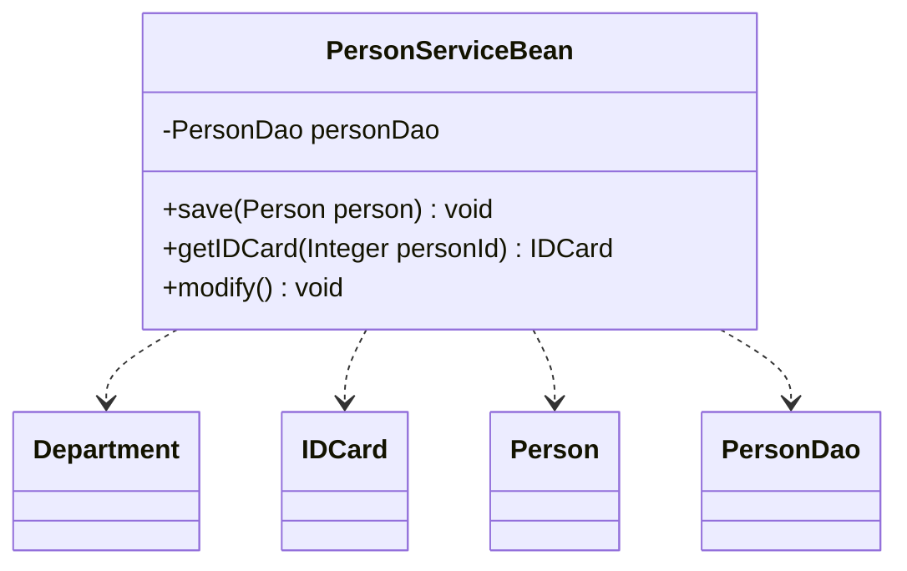
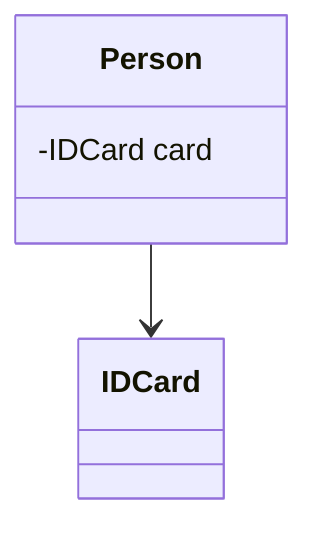
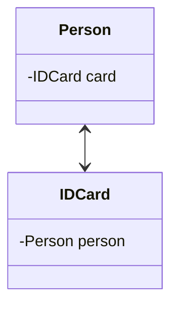
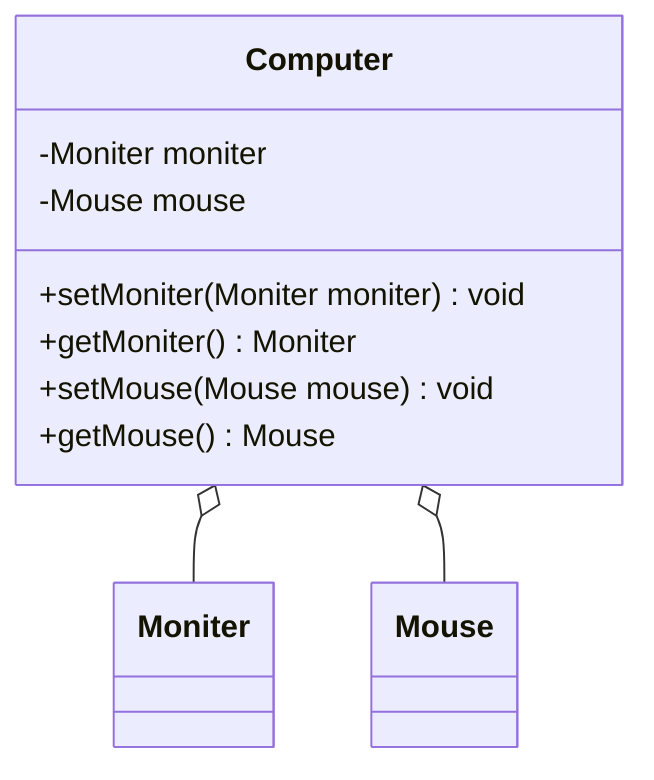
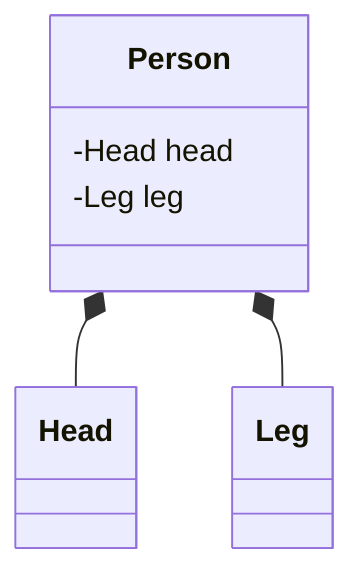
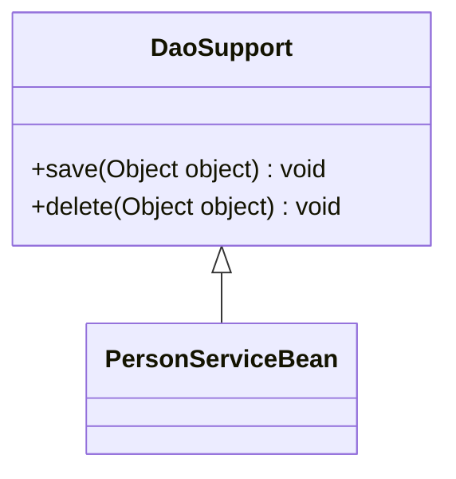
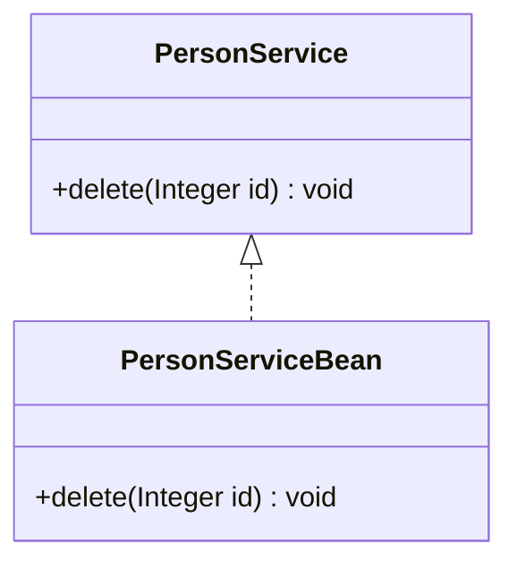

# 2.类与类之间的六种关系
@include(@src/public/enhance/guidance/general/designpattern/designpattern-java/chapter/designpattern-java-guidance-chapter2.md)
## 2.3.依赖关系
### 2.3.1.依赖关系概述
    依赖关系(Dependence),只要是在类中用到了对方,那么它们之间就存在依赖关系。如果没有对方,无法通过编译。

    在代码中表现为
    a.类中用到了对方
    b.是类的成员属性
    c.是方法的返回类型
    d.是方法接收的参数类型
    e.方法中使用到
### 2.3.2.UML箭头及指向
    带箭头的虚线，指向被使用者
### 2.3.3.依赖关系类图

### 2.3.4.依赖关系代码
    Department.java
```java
@include(../projects/JavaSenior/designpattern/src/main/java/com/dragonsoft/designpattern/basic/classrelation/dependence/Department.java)
```
    IDCard.java
```java
@include(../projects/JavaSenior/designpattern/src/main/java/com/dragonsoft/designpattern/basic/classrelation/dependence/IDCard.java)
```
    Person.java
```java
@include(../projects/JavaSenior/designpattern/src/main/java/com/dragonsoft/designpattern/basic/classrelation/dependence/Person.java)
```
    PersonDao.java
```java
@include(../projects/JavaSenior/designpattern/src/main/java/com/dragonsoft/designpattern/basic/classrelation/dependence/PersonDao.java)
```
    PersonServiceBean.java
```java
@include(../projects/JavaSenior/designpattern/src/main/java/com/dragonsoft/designpattern/basic/classrelation/dependence/PersonServiceBean.java)
```
## 2.4.关联关系
### 2.4.1.关联关系概述
    关联关系(Association),实际上就是类与类之间的联系,它是依赖关系的特例。关联关系具有导航性:即双向关联关系或单向关联关系
### 2.4.2.UML箭头及指向
    带普通箭头的实线,拥有者指向被拥有者
### 2.4.3.关联关系类图
    单向关联关系

    双向关联关系

### 2.4.4.关联关系代码
    单向关联关系
    Person.java
```java
@include(../projects/JavaSenior/designpattern/src/main/java/com/dragonsoft/designpattern/basic/classrelation/association/singleone2one/Person.java)
```
    IDCard.java
```java
@include(../projects/JavaSenior/designpattern/src/main/java/com/dragonsoft/designpattern/basic/classrelation/association/singleone2one/IDCard.java)
```
    双向关联关系
    Person.java
```java
@include(../projects/JavaSenior/designpattern/src/main/java/com/dragonsoft/designpattern/basic/classrelation/association/doubleone2one/Person.java)
```
    IDCard.java
```java
@include(../projects/JavaSenior/designpattern/src/main/java/com/dragonsoft/designpattern/basic/classrelation/association/doubleone2one/IDCard.java)
```
## 2.5.聚合关系
### 2.5.1.聚合关系概述
    聚合关系(Aggregation)表示的是整体和部分的关系,整体与部分可以分开。聚合关系是关联关系的特例,所以它具有关联的导航性与多重性。
### 2.5.2.UML箭头及指向
    带空心菱形的实心线,菱形指向整体.
### 2.5.3.聚合关系类图

### 2.5.4.聚合关系代码
    Moniter.java
```java
@include(../projects/JavaSenior/designpattern/src/main/java/com/dragonsoft/designpattern/basic/classrelation/aggregation/Moniter.java)
```
    Mouse.java
```java
@include(../projects/JavaSenior/designpattern/src/main/java/com/dragonsoft/designpattern/basic/classrelation/aggregation/Mouse.java)
```
    Computer.java
```java
@include(../projects/JavaSenior/designpattern/src/main/java/com/dragonsoft/designpattern/basic/classrelation/aggregation/Computer.java)
```
## 2.6.组合关系
### 2.6.1.组合关系概述
    组合关系(Composite))表示的是整体和部分的关系,整体与部分不能分开。组合关系是关联关系的一种特例。比如说B类里面用到了一个A类,且这个A类是通过new创建的,也就是说当B类被初始化的时候A类也被初始化了。(耦合度比聚合高)
### 2.6.2.UML箭头及指向
    带实心菱形的实线,菱形指向整体
### 2.6.3.组合关系类图

### 2.6.4.组合关系代码
    Head.java
```java
@include(../projects/JavaSenior/designpattern/src/main/java/com/dragonsoft/designpattern/basic/classrelation/composition/Head.java)
```
    Leg.java
```java
@include(../projects/JavaSenior/designpattern/src/main/java/com/dragonsoft/designpattern/basic/classrelation/composition/Leg.java)
```
    Person.java
```java
@include(../projects/JavaSenior/designpattern/src/main/java/com/dragonsoft/designpattern/basic/classrelation/composition/Person.java)
```
## 2.7.泛化关系
### 2.7.1.泛化关系概述
    泛化关系(Generalization),泛化关系实际上就是继承关系,它是依赖关系的特例。如果A类继承了B类,我们就说A和B存在泛化关系。
### 2.7.2.UML箭头及指向
    带三角箭头的实线,子类指向父类
### 2.7.3.泛化关系类图

### 2.7.4.泛化关系代码
    DaoSupport.java
```java
@include(../projects/JavaSenior/designpattern/src/main/java/com/dragonsoft/designpattern/basic/classrelation/generalization/DaoSupport.java)
```
    PersonServiceBean.java
```java
@include(../projects/JavaSenior/designpattern/src/main/java/com/dragonsoft/designpattern/basic/classrelation/generalization/PersonServiceBean.java)
```
## 2.8.实现关系
### 2.8.1.实现关系概述
    实现关系(Realization),比如某个类实现了一个接口。它也是依赖关系的特例。
### 2.8.2.UML箭头及指向
    带三角箭头的虚线,箭头指向接口
### 2.8.3.实现关系类图

### 2.8.4.实现关系代码
    PersonService.java
```java
@include(../projects/JavaSenior/designpattern/src/main/java/com/dragonsoft/designpattern/basic/classrelation/realization/PersonService.java)
```
    PersonServiceBean.java
```java
@include(../projects/JavaSenior/designpattern/src/main/java/com/dragonsoft/designpattern/basic/classrelation/realization/PersonServiceBean.java)
```
## 2.9.六种关系耦合度强弱
    泛化 = 实现 > 组合 > 聚合 > 关联 > 依赖


<ScrollIntoPageView/>
<HideSideBar/>
