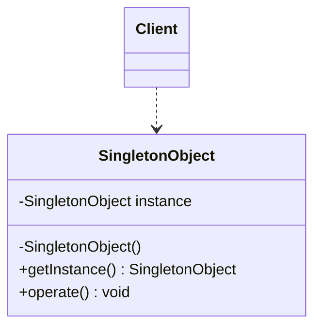
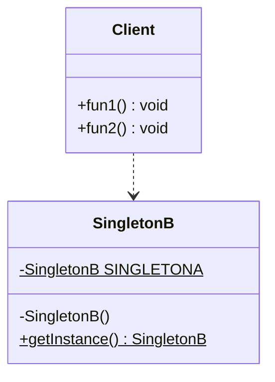
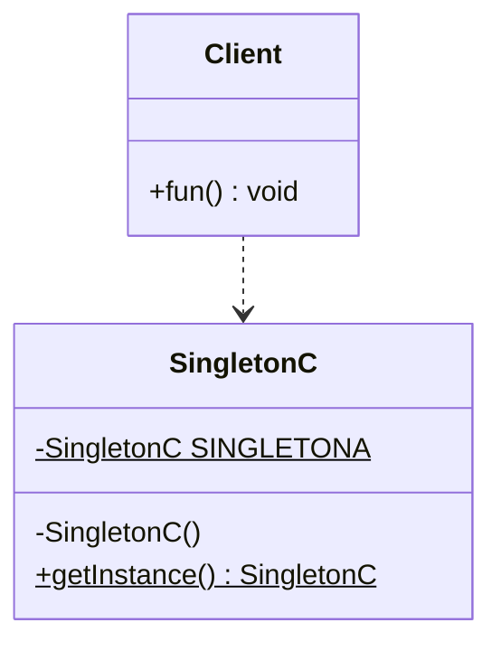
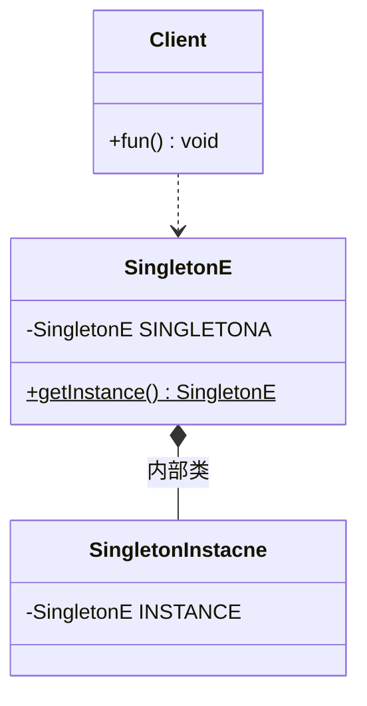
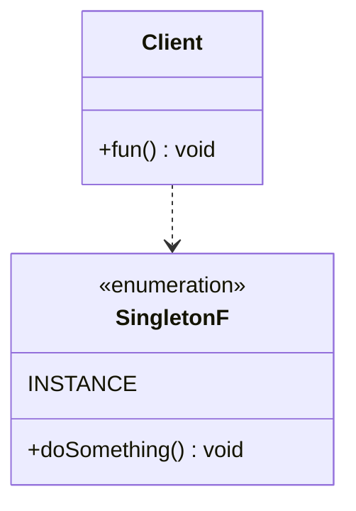

# 4.创建型模式-单例模式
@include(@src/public/enhance/guidance/general/designpattern/designpattern-java/chapter/designpattern-java-guidance-chapter4.md)
## 4.3.简介
    单例模式(Singleton Pattern)是一种创建型设计模式,又名单件模式或单态模式,目的是为了保证一个类只有一个实例对象,并提供一个获取该实例对象的全局方法,通过这个全局方法创建的所有实例对象都是同一个实例对象,这个类称为单例类。单例模式的要点有三个:一是某个类只能有一个实例对象;二是这个类必须自行创建这个实例对象;三是这个类必须自行向整个系统提供这个实例。
## 4.4.应用场景
    单例模式应用的场景一般发现在以下条件下
    资源共享的情况下: 避免由于资源操作时导致的性能或损耗等
    控制资源的情况下: 方便资源之间的互相通信

    具体应用场景
    a.Windows的Task Manager(任务管理器),在一个Windows系统中只有一个Task Manager实例
    b.Windows的Recycle Bin(回收站),在一个Windows系统中只有一个Recycle Bin实例
    c.网站的计数器,一般也是采用单例模式实现,否则难以同步
    d.应用程序的日志应用,一般都何用单例模式实现,这一般是由于共享的日志文件一直处于打开状态,因为只能有一个实例去操作,否则无法实现内容追加
    e.数据库连接池的设计一般也是采用单例模式,因为数据库连接是一种数据库资源。数据库软件系统中使用数据库连接池,主要是节省打开或者关闭数据库连接所引起的效率损耗,这种效率上的损耗还是非常昂贵的,因为何用单例模式来维护,就可以大大降低这种损耗
    f.多线程的线程池的设计一般也是采用单例模式,这是由于线程池要方便对池中的线程进行控制
    g.操作系统的文件系统,也是大的单例模式实现的具体例子,一个操作系统只能有一个文件系统
## 4.5.优缺点
### 4.5.1.优点
    a.由于单例模式在内存中只有一个实例,减少内存开支,特别是一个对象需要频繁地创建销毁时,而且创建或销毁时性能又无法优化,单例模式就非常明显了
    b.由于单例模式只生成一个实例,所以,减少系统的性能开销,当一个对象产生需要比较多的资源时,如读取配置,产生其他依赖对象时,则可以通过在应用启动时直接产生一个单例对象,然后永久驻留内存的方式来解决
    c.单例模式可以避免对资源的多重占用,例如一个写文件操作,由于只有一个实例存在内存中,避免对同一个资源文件的同时写操作
    d.单例模式可以在系统设置全局的访问点,优化和共享资源访问,例如，可以设计一个单例类,负责所有数据表的映射处理
### 4.5.2.缺点
    a.单例模式没有抽象层,扩展很困难,若要扩展,除了修改代码基本上没有第二种途径可以实现,违反了OCP原则
    b.单例类的职责过重,在一定程度上违背了"单一职责原则"
    c.滥用单例将带来一些负面问题,如:为了节省资源将数据库连接池对象设计为的单例类,可能会导致共享连接池对象的程序过多而出现连接池溢出
## 4.6.角色及其职责
## 4.7.模型
### 4.7.1.模型类图

### 4.7.2.模型代码
```java
@include(../projects/JavaSenior/designpattern/src/main/java/com/dragonsoft/designpattern/create/singleton/model/SingletonObject.java)
```
## 4.8.示例
### 4.8.1.饿汉式单例
### 4.8.1.1.饿汉式单例类图

### 4.8.1.2.饿汉式单例代码
    SingletonA.java
```java
@include(../projects/JavaSenior/designpattern/src/main/java/com/dragonsoft/designpattern/create/singleton/SingletonA.java)
```
    Client.java
```java
package com.dragonsoft.designpattern.create.singleton;

import org.junit.Test;

public class Client {
	/**
	 * 测试测试饿汉式单例
	 */
	@Test
	public void fun() {
		SingletonA instance1 = SingletonA.getInstance();
		SingletonA instance2 = SingletonA.getInstance();
		System.out.println(instance1 == instance2);
		System.out.println("instance1.hashCode():"+instance1.hashCode());
		System.out.println("instance2.hashCode():"+instance2.hashCode());
	}
}
```
### 4.8.2.懒汉式单例
### 4.8.2.1.饿汉式单例类图

### 4.8.2.2.饿汉式单例代码
    SingletonB.java
```java
@include(../projects/JavaSenior/designpattern/src/main/java/com/dragonsoft/designpattern/create/singleton/SingletonB.java)
```
    Client.java
```java
package com.dragonsoft.designpattern.create.singleton;

import org.junit.Test;

public class Client {
	/**
	 * 测试单线程测试懒汉式
	 */
	@Test
	public void fun1() {
		SingletonB instance1 = SingletonB.getInstance();
		SingletonB instance2 = SingletonB.getInstance();
		System.out.println(instance1 == instance2);
		System.out.println("instance1.hashCode():"+instance1.hashCode());
		System.out.println("instance2.hashCode():"+instance2.hashCode());
	}

	/**
	 * 测试多线程测试线程不安全的懒汉式
	 */
	@Test
	public void fun2() {
		long begin = System.currentTimeMillis();
		//多线程测试单例模式线程是否安全
		Thread[] threads = new Thread[10000];
        for(int i = 0;i<threads.length;i++){
        	//创建线程
        	threads[i] =
				new Thread(new Runnable() {
	    			@Override
	    			public void run() {
	    				SingletonB instance = SingletonB.getInstance();
	    				System.out.println("instance.hashCode():"+instance.hashCode());
	    			}
	    		});
        }
        for(int i=0;i<threads.length;i++){
        	threads[i].start();//线程启动
        }
        long end = System.currentTimeMillis();
        System.out.println("程序执行时间：" + (end-begin));
	}
}
```
### 4.8.3.线程安全的懒汉式单例
### 4.8.3.1.线程安全的懒汉式类图

### 4.8.3.2.线程安全的懒汉式代码
    SingletonC.java
```java
@include(../projects/JavaSenior/designpattern/src/main/java/com/dragonsoft/designpattern/create/singleton/SingletonC.java)
```
    Client.java
```java
package com.dragonsoft.designpattern.create.singleton;

import org.junit.Test;

public class Client {
	/**
	 * 测试多线程测试线程安全的懒汉式
	 * 	方法级别的锁：实测执行效率并不是很低
	 */
	@Test
	public void fun() {
		long begin = System.currentTimeMillis();
		//多线程测试单例模式线程是否安全
		Thread[] threads = new Thread[10000];
		for(int i = 0;i<threads.length;i++){
			//创建线程
			threads[i] =
					new Thread(new Runnable() {
						@Override
						public void run() {
							SingletonC instance = SingletonC.getInstance();
							System.out.println("instance.hashCode():"+instance.hashCode());
						}
					});
		}
		for(int i=0;i<threads.length;i++){
			threads[i].start();//线程启动
		}
		long end = System.currentTimeMillis();
		System.out.println("程序执行时间：" + (end-begin));
	}
}
```
### 4.8.4.双重检索懒汉式懒汉式单例
### 4.8.4.1.双重检索懒汉式单例类图

### 4.8.4.2.双重检索懒汉式单例代码
    SingletonD.java
```java
@include(../projects/JavaSenior/designpattern/src/main/java/com/dragonsoft/designpattern/create/singleton/SingletonD.java)
```
    Client.java
```java
package com.dragonsoft.designpattern.create.singleton;

import org.junit.Test;

public class Client {
    	/**
	 * 测试多线程测试静态双重检索线程安全的懒汉式
	 * 	方法级别的锁：实测执行效率并不是很低
	 */
	@Test
	public void fun() {
		long begin = System.currentTimeMillis();
		//多线程测试单例模式线程是否安全
		Thread[] threads = new Thread[10000];
		for(int i = 0;i<threads.length;i++){
			//创建线程
			threads[i] =
					new Thread(new Runnable() {
						@Override
						public void run() {
							SingletonD instance = SingletonD.getInstance();
							System.out.println("instance.hashCode():"+instance.hashCode());
						}
					});
		}
		for(int i=0;i<threads.length;i++){
			threads[i].start();//线程启动
		}
		long end = System.currentTimeMillis();
		System.out.println("程序执行时间：" + (end-begin));
	}
}
```
### 4.8.5.静态内部类懒汉式单例
### 4.8.5.1.静态内部类懒汉式单例类图

### 4.8.5.2.静态内部类懒汉式单例代码
    SingletonE.java
```java
@include(../projects/JavaSenior/designpattern/src/main/java/com/dragonsoft/designpattern/create/singleton/SingletonE.java)
```
    Client.java
```java
package com.dragonsoft.designpattern.create.singleton;

import org.junit.Test;

public class Client {
    /**
	 * 测试多线程测试静态内部类线程安全的懒汉式
	 *
	 */
	@Test
	public void fun() {
		long begin = System.currentTimeMillis();
		//多线程测试单例模式线程是否安全
		Thread[] threads = new Thread[10000];
		for(int i = 0;i<threads.length;i++){
			//创建线程
			threads[i] =
					new Thread(new Runnable() {
						@Override
						public void run() {
							SingletonE instance = SingletonE.getInstance();
							System.out.println("instance.hashCode():"+instance.hashCode());
						}
					});
		}
		for(int i=0;i<threads.length;i++){
			threads[i].start();//线程启动
		}
		long end = System.currentTimeMillis();
		System.out.println("程序执行时间：" + (end-begin));
	}
}
```
### 4.8.6.枚举单例
### 4.8.6.1.枚举单例类图

### 4.8.6.2.枚举单例代码
    SingletonF.java
```java
@include(../projects/JavaSenior/designpattern/src/main/java/com/dragonsoft/designpattern/create/singleton/SingletonF.java)
```
    Client.java
```java
package com.dragonsoft.designpattern.create.singleton;

import org.junit.Test;

public class Client {
    /**
	 * 测试枚举实现单例
	 */
	@Test
	public void fun() {
		SingletonF instance1 = SingletonF.INSTANCE;
		SingletonF instance2 = SingletonF.INSTANCE;
		System.out.println(instance1 == instance2);
		System.out.println("instance1.hashCode():"+instance1.hashCode());
		System.out.println("instance2.hashCode():"+instance2.hashCode());
		//通过单例调用doSomething()
		instance1.doSomething();
		instance2.doSomething();
	}
}
```
## 4.9.在开源框架中的应用
    JDK8#java.lang.Runtime(饿汉式)
```java
public class Runtime {
    private static Runtime currentRuntime = new Runtime();

    /**
     * Returns the runtime object associated with the current Java application.
     * Most of the methods of class <code>Runtime</code> are instance
     * methods and must be invoked with respect to the current runtime object.
     *
     * @return  the <code>Runtime</code> object associated with the current
     *          Java application.
     */
    public static Runtime getRuntime() {
        return currentRuntime;
    }

    /** Don't let anyone else instantiate this class */
    private Runtime() {}
}
```

<ScrollIntoPageView/>
<HideSideBar/>
