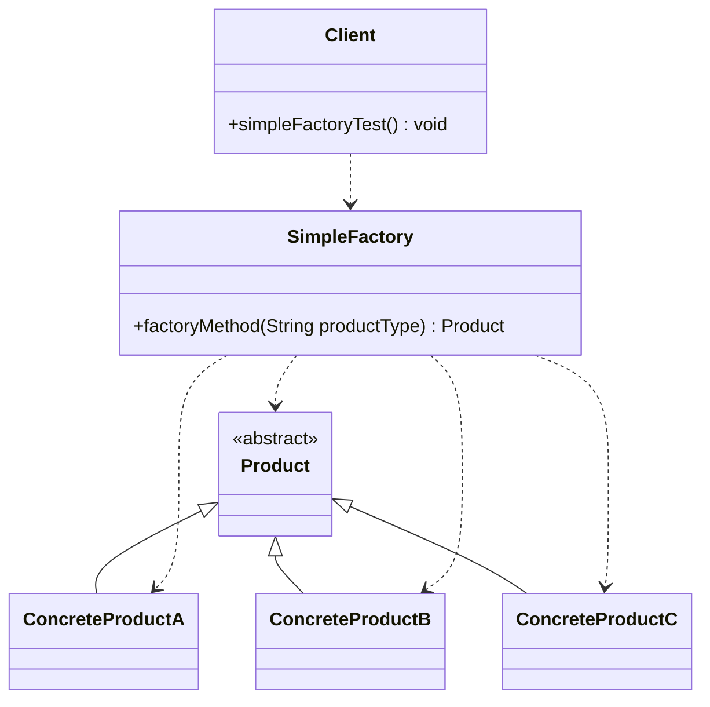
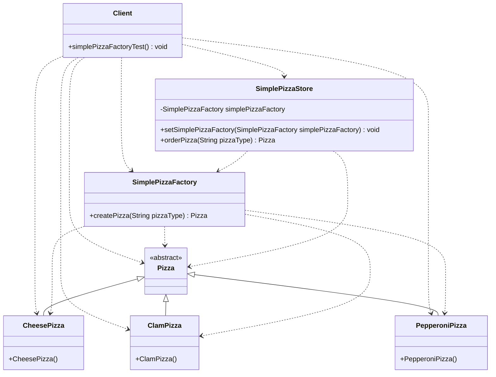

# 5.创建型模式-简单工厂模式(Gof之外)
@include(@src/public/enhance/guidance/general/designpattern/designpattern-java/chapter/designpattern-java-guidance-chapter5.md)
## 5.3.简介
    简单工厂模式(SimpleFactory Pattern)是一种创建型设计模式,是设计模式中最为常见的模式之一,但是不是Gof提出的23中设计模式中的一种,更像是一种编程习惯。简单工厂模式是隐藏对象的实例化过程,对外部提供一个获取对象的方法,可以根据参数获取不同类型的对象,是工厂模式家族中最简单实用的模式,可以理解为是不同工厂模式的一个特殊实现。
## 5.4.模型
### 5.4.1.模型类图

### 5.4.2.模型代码
    Product.java
```java
@include(../projects/JavaSenior/designpattern/src/main/java/com/dragonsoft/designpattern/create/factory/simplefactory/model/Product.java)
```
    ConcreteProductA.java
```java
@include(../projects/JavaSenior/designpattern/src/main/java/com/dragonsoft/designpattern/create/factory/simplefactory/model/ConcreteProductA.java)
```
    ConcreteProductB.java
```java
@include(../projects/JavaSenior/designpattern/src/main/java/com/dragonsoft/designpattern/create/factory/simplefactory/model/ConcreteProductB.java)
```
    ConcreteProductC.java
```java
@include(../projects/JavaSenior/designpattern/src/main/java/com/dragonsoft/designpattern/create/factory/simplefactory/model/ConcreteProductC.java)
```
    SimpleFactory.java
```java
@include(../projects/JavaSenior/designpattern/src/main/java/com/dragonsoft/designpattern/create/factory/simplefactory/model/SimpleFactory.java)
```
    Client.java
```java
@include(../projects/JavaSenior/designpattern/src/main/java/com/dragonsoft/designpattern/create/factory/simplefactory/model/Client.java)
```
## 5.5.示例
### 5.5.1.PizzaStore
### 5.5.1.1.PizzaStore类图

### 5.5.1.2.PizzaStore代码
    Pizza.java
```java
@include(../projects/JavaSenior/designpattern/src/main/java/com/dragonsoft/designpattern/create/factory/simplefactory/Pizza.java)
```
    CheesePizza.java
```java
@include(../projects/JavaSenior/designpattern/src/main/java/com/dragonsoft/designpattern/create/factory/simplefactory/CheesePizza.java)
```
    ClamPizza.java
```java
@include(../projects/JavaSenior/designpattern/src/main/java/com/dragonsoft/designpattern/create/factory/simplefactory/ClamPizza.java)
```
    PepperoniPizza.java
```java
@include(../projects/JavaSenior/designpattern/src/main/java/com/dragonsoft/designpattern/create/factory/simplefactory/PepperoniPizza.java)
```
    SimplePizzaFactory.java
```java
@include(../projects/JavaSenior/designpattern/src/main/java/com/dragonsoft/designpattern/create/factory/simplefactory/SimplePizzaFactory.java)
```
    SimplePizzaStore.java
```java
@include(../projects/JavaSenior/designpattern/src/main/java/com/dragonsoft/designpattern/create/factory/simplefactory/SimplePizzaStore.java)
```
    Client.java
```java
@include(../projects/JavaSenior/designpattern/src/main/java/com/dragonsoft/designpattern/create/factory/simplefactory/Client.java)
```
## 5.6.经典应用场景
## 5.7.在开源框架中的应用场景

<ScrollIntoPageView/>
<HideSideBar/>
