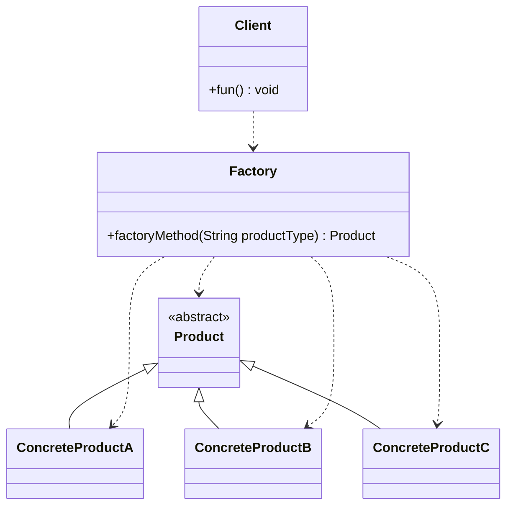
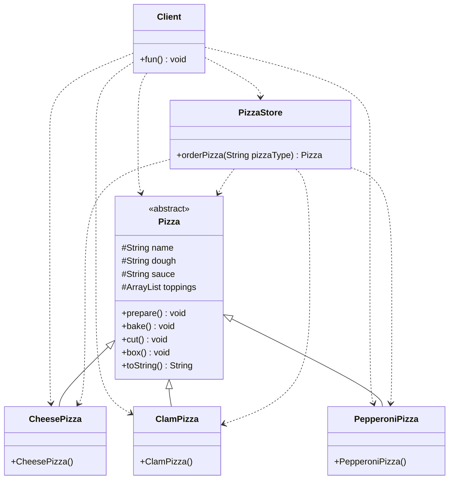
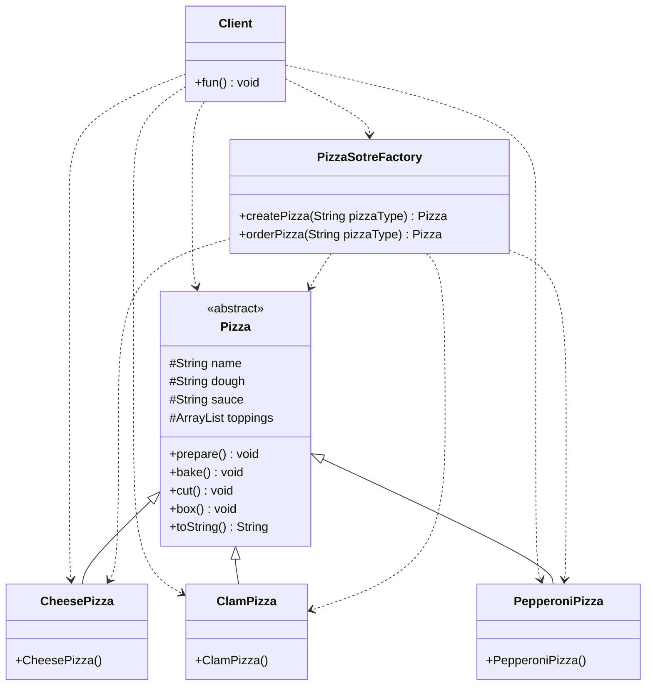

# 5.创建型模式-简单工厂模式(Gof之外)
@include(@src/public/enhance/guidance/general/designpattern/designpattern-java/chapter/designpattern-java-guidance-chapter5.md)
## 5.3.简介
    简单工厂模式(SimpleFactory Pattern)是一种创建型设计模式,是设计模式中最为常见的模式之一,但是不是Gof提出的23中设计模式中的一种,更像是一种编程习惯。简单工厂模式是隐藏对象的实例化过程,对外部提供一个获取对象的方法,可以根据参数获取不同类型的对象,是工厂模式家族中最简单实用的模式,可以理解为是不同工厂模式的一个特殊实现。
## 5.4.应用场景
    a.客户端如果只知道传入工厂类得参数,对于如何创建对象得逻辑不关心时
    b.客户端既不需要关心创建细节,甚至连类名都不需要记住,只需要知道类型所对应得参数
    c.工厂负责创建的类少,同时系统中需要的new对象较多而且复杂时可以使用,这样一方面不会造成工厂方法中得业务逻辑太过复杂,另一方面在使用时不用一直new,直接从工厂中获取即可
## 5.5.优缺点
### 5.5.1.优点
    a.屏蔽了具体的创建逻辑,客户端只需要要传入一个参数即可获取相应的结果,在一定程度上简化了对象的创建过程
    b.将实例创建过程和使用过程分离开来,实现了解耦
### 5.5.2.缺点
    a.工厂类集中了所有实例(产品)的创建逻辑,一旦这个工厂不能正常工作,整个系统都会受到影响
    b.违背OCP原则,一旦添加新产品就不得不修改工厂类得逻辑,这样就会造成工厂逻辑过于复杂
    c.简单工厂模式由于使用了静态工厂方法,静态方法不能被继承和重写,会造成工厂角色无法形成基于继承的等级结构
## 5.6.角色及其职责
    Factory(工厂)
    核心部分,负责实现创建所有产品的内部逻辑,工厂类可以被外界直接调用,创建所需对象
    Product(抽象类产品)
    工厂类所创建的所有对象的父类,封装了产品对象的公共方法,所有的具体产品为其子类对象
    ConcreteProduct(具体产品)
    简单工厂模式的创建目标,所有被创建的对象都是某个具体类的实例,它要实现抽象产品中声明的抽象方法(有关抽象类)
## 5.7.模型
### 5.7.1.模型类图

### 5.7.2.模型代码
    Product.java
```java
@include(../projects/JavaSenior/designpattern/src/main/java/com/dragonsoft/designpattern/create/factory/simplefactory/model/Product.java)
```
    ConcreteProductA.java
```java
@include(../projects/JavaSenior/designpattern/src/main/java/com/dragonsoft/designpattern/create/factory/simplefactory/model/ConcreteProductA.java)
```
    ConcreteProductB.java
```java
@include(../projects/JavaSenior/designpattern/src/main/java/com/dragonsoft/designpattern/create/factory/simplefactory/model/ConcreteProductB.java)
```
    ConcreteProductC.java
```java
@include(../projects/JavaSenior/designpattern/src/main/java/com/dragonsoft/designpattern/create/factory/simplefactory/model/ConcreteProductC.java)
```
    Factory.java
```java
@include(../projects/JavaSenior/designpattern/src/main/java/com/dragonsoft/designpattern/create/factory/simplefactory/model/Factory.java)
```
    Client.java
```java
@include(../projects/JavaSenior/designpattern/src/main/java/com/dragonsoft/designpattern/create/factory/simplefactory/model/Client.java)
```
## 5.8.示例
### 5.8.1.不使用简单工厂模式
#### 5.8.1.1.类图

#### 5.8.1.2.代码
    Pizza.java
```java
@include(../projects/JavaSenior/designpattern/src/main/java/com/dragonsoft/designpattern/create/factory/simplefactory/nouse/Pizza.java)
```
    CheesePizza.java
```java
@include(../projects/JavaSenior/designpattern/src/main/java/com/dragonsoft/designpattern/create/factory/simplefactory/nouse/CheesePizza.java)
```
    ClamPizza.java
```java
@include(../projects/JavaSenior/designpattern/src/main/java/com/dragonsoft/designpattern/create/factory/simplefactory/nouse/ClamPizza.java)
```
    PepperoniPizza.java
```java
@include(../projects/JavaSenior/designpattern/src/main/java/com/dragonsoft/designpattern/create/factory/simplefactory/nouse/PepperoniPizza.java)
```
    PizzaStore.java
```java
@include(../projects/JavaSenior/designpattern/src/main/java/com/dragonsoft/designpattern/create/factory/simplefactory/nouse/PizzaStore.java)
```
    Client.java
```java
@include(../projects/JavaSenior/designpattern/src/main/java/com/dragonsoft/designpattern/create/factory/simplefactory/nouse/Client.java)
```
### 5.8.2.使用简单工厂模式
#### 5.8.2.1.类图

#### 5.8.2.2.代码
    Pizza.java
```java
@include(../projects/JavaSenior/designpattern/src/main/java/com/dragonsoft/designpattern/create/factory/simplefactory/use/Pizza.java)
```
    CheesePizza.java
```java
@include(../projects/JavaSenior/designpattern/src/main/java/com/dragonsoft/designpattern/create/factory/simplefactory/use/CheesePizza.java)
```
    ClamPizza.java
```java
@include(../projects/JavaSenior/designpattern/src/main/java/com/dragonsoft/designpattern/create/factory/simplefactory/use/ClamPizza.java)
```
    PepperoniPizza.java
```java
@include(../projects/JavaSenior/designpattern/src/main/java/com/dragonsoft/designpattern/create/factory/simplefactory/use/PepperoniPizza.java)
```
    PizzaStoreFactory.java
```java
@include(../projects/JavaSenior/designpattern/src/main/java/com/dragonsoft/designpattern/create/factory/simplefactory/use/PizzaStoreFactory.java)
```
    Client.java
```java
@include(../projects/JavaSenior/designpattern/src/main/java/com/dragonsoft/designpattern/create/factory/simplefactory/use/Client.java)
```

## 5.9.在开源框架中的应用
    简单工厂模式
    JDK8#java.util.Calendar#createCalendar()
```java
private static Calendar createCalendar(TimeZone zone,
                                        Locale aLocale)
{
    CalendarProvider provider =
        LocaleProviderAdapter.getAdapter(CalendarProvider.class, aLocale)
                                .getCalendarProvider();
    if (provider != null) {
        try {
            return provider.getInstance(zone, aLocale);
        } catch (IllegalArgumentException iae) {
            // fall back to the default instantiation
        }
    }

    Calendar cal = null;

    if (aLocale.hasExtensions()) {
        String caltype = aLocale.getUnicodeLocaleType("ca");
        if (caltype != null) {
            switch (caltype) {
            case "buddhist":
            cal = new BuddhistCalendar(zone, aLocale);
                break;
            case "japanese":
                cal = new JapaneseImperialCalendar(zone, aLocale);
                break;
            case "gregory":
                cal = new GregorianCalendar(zone, aLocale);
                break;
            }
        }
    }
    if (cal == null) {
        // If no known calendar type is explicitly specified,
        // perform the traditional way to create a Calendar:
        // create a BuddhistCalendar for th_TH locale,
        // a JapaneseImperialCalendar for ja_JP_JP locale, or
        // a GregorianCalendar for any other locales.
        // NOTE: The language, country and variant strings are interned.
        if (aLocale.getLanguage() == "th" && aLocale.getCountry() == "TH") {
            cal = new BuddhistCalendar(zone, aLocale);
        } else if (aLocale.getVariant() == "JP" && aLocale.getLanguage() == "ja"
                    && aLocale.getCountry() == "JP") {
            cal = new JapaneseImperialCalendar(zone, aLocale);
        } else {
            cal = new GregorianCalendar(zone, aLocale);
        }
    }
    return cal;
}
```
    使用简单工厂模式
    JDK8#java.util.Calendar#getInstance()
```java
public static Calendar getInstance(TimeZone zone,
                                    Locale aLocale)
{
    return createCalendar();
}
```
    可以看出,在getInstance()方法中调用了createCalendar()方法,只需要传入zone, aLocale,就可以获得一个Calendar对象

<ScrollIntoPageView/>
<HideSideBar/>
