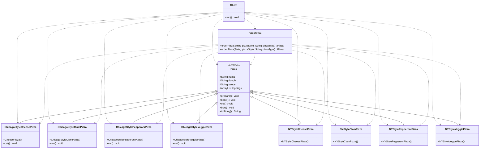

# 6.创建型模式-工厂模式
@include(@src/public/enhance/guidance/general/designpattern/designpattern-java/chapter/designpattern-java-guidance-chapter6.md)
## 6.3.简介
    工厂模式(FactoryMethod Pattern)又称工厂方法模式(FactoryMethod Pattern)是一种创建型设计模式,工厂方法模式是简单工厂模式的进一步抽象和推广,是GoF设计模式的一种。由于使用了面向对象的多态性,工厂方法模式保持了简单工厂模式的优点,而且克服了它的缺点,同时遵循OCP原则。在工厂方法模式中,提供一个用于创建对象的接口(工厂接口),让其实现类(工厂实现类)决定实例化哪一个类(产品类),并且由该实现类创建对应类的实例。这使得工厂方法模式可以允许系统在不修改工厂角色的情况下引进新产品。
## 6.4.应用场景
    a.客户端不关心它所要创建对象的类(产品类)的时候
    b.客户端知道它所要创建对象的类(产品类),但不关心如何创建的时候
## 6.5.优缺点
### 6.5.1.优点
    a.使用工厂方法用来创建客户所需要的产品,隐藏了具体产品类的实例化过程,用户只需要关心所需产品对应的工厂,无须关心创建细节,甚至无须知道具体产品类的类名
    b.加入新产品时,无须修改抽象工厂和抽象产品提供的接口,无须修改客户端,也无须修改其他的具体工厂和具体产品,而只要添加一个具体工厂和具体产品就可以了。增加了系统的可扩展性,符合OCP开闭原则
    c.每个产品都对应一个工厂,所以可以在这个产品对应的工厂中更为细致的控制产品的创建过程,而不会影响到其他的产品
### 6.5.2.缺点
    a.每增加一个新产品,都需要编写新的具体产品类,而且还要提供与之对应的具体工厂类,这样系统中类的个数将成对增加,在一定程度上增加了系统的复杂度,有更多的类需要编译和运行,会给系统带来一些额外的开销。
    b.由于考虑到系统的可扩展性,需要引入抽象层,在客户端代码中均使用抽象层进行定义,增加了系统的抽象性和理解难度,进而增加了系统的实现难度。
## 6.6.角色及其职责
    Product(抽象产品)
    工厂类所创建的所有对象的父类,封装了产品对象的公共方法,所有的具体产品为其子类对象
    ConcreteProduct(具体产品)
    工厂类所创建的实际对象
    Factory(抽象工厂)
    提供一个用于创建对象的接口(工厂接口),让其实现类(工厂实现类)决定实例化哪一个类(产品类)
    ConcreteFactory(具体工厂)
    提供实际创建对象的方法
## 6.7.模型
### 6.7.1.模型类图

### 6.7.2.模型代码
    Product.java
```java
@include(../projects/JavaSenior/designpattern/src/main/java/com/dragonsoft/designpattern/create/factory/factorymethod/model/Product.java)
```
    ConcreteProductA.java
```java
@include(../projects/JavaSenior/designpattern/src/main/java/com/dragonsoft/designpattern/create/factory/factorymethod/model/ConcreteProductA.java)
```
    ConcreteProductB.java
```java
@include(../projects/JavaSenior/designpattern/src/main/java/com/dragonsoft/designpattern/create/factory/factorymethod/model/ConcreteProductB.java)
```
    ConcreteProductC.java
```java
@include(../projects/JavaSenior/designpattern/src/main/java/com/dragonsoft/designpattern/create/factory/factorymethod/model/ConcreteProductC.java)
```
    Factory.java
```java
@include(../projects/JavaSenior/designpattern/src/main/java/com/dragonsoft/designpattern/create/factory/factorymethod/model/Factory.java)
```
    ConcreteFactoryA.java
```java
@include(../projects/JavaSenior/designpattern/src/main/java/com/dragonsoft/designpattern/create/factory/factorymethod/model/ConcreteFactoryA.java)
```
    ConcreteFactoryB.java
```java
@include(../projects/JavaSenior/designpattern/src/main/java/com/dragonsoft/designpattern/create/factory/factorymethod/model/ConcreteFactoryB.java)
```
    ConcreteFactoryC.java
```java
@include(../projects/JavaSenior/designpattern/src/main/java/com/dragonsoft/designpattern/create/factory/factorymethod/model/ConcreteFactoryC.java)
```
    Client.java
```java
@include(../projects/JavaSenior/designpattern/src/main/java/com/dragonsoft/designpattern/create/factory/factorymethod/model/Client.java)
```
## 6.8.示例
### 6.8.1.不使用工厂模式(实际上使用了简单工厂模式)
#### 6.8.1.1.类图

#### 6.8.1.1.代码
    Pizza.java
```java
@include(../projects/JavaSenior/designpattern/src/main/java/com/dragonsoft/designpattern/create/factory/factorymethod/nouse/Pizza.java)
```
    ChicagoStyleCheesePizza.java
```java
@include(../projects/JavaSenior/designpattern/src/main/java/com/dragonsoft/designpattern/create/factory/factorymethod/nouse/ChicagoStyleCheesePizza.java)
```
    ChicagoStyleClamPizza.java
```java
@include(../projects/JavaSenior/designpattern/src/main/java/com/dragonsoft/designpattern/create/factory/factorymethod/nouse/ChicagoStyleClamPizza.java)
```
    ChicagoStylePepperoniPizza.java
```java
@include(../projects/JavaSenior/designpattern/src/main/java/com/dragonsoft/designpattern/create/factory/factorymethod/nouse/ChicagoStylePepperoniPizza.java)
```
    ChicagoStyleVeggiePizza.java
```java
@include(../projects/JavaSenior/designpattern/src/main/java/com/dragonsoft/designpattern/create/factory/factorymethod/nouse/ChicagoStyleVeggiePizza.java)
```
    NYStyleCheesePizza.java
```java
@include(../projects/JavaSenior/designpattern/src/main/java/com/dragonsoft/designpattern/create/factory/factorymethod/nouse/NYStyleCheesePizza.java)
```
    NYStyleClamPizza.java
```java
@include(../projects/JavaSenior/designpattern/src/main/java/com/dragonsoft/designpattern/create/factory/factorymethod/nouse/NYStyleClamPizza.java)
```
    NYStylePepperoniPizza.java
```java
@include(../projects/JavaSenior/designpattern/src/main/java/com/dragonsoft/designpattern/create/factory/factorymethod/nouse/NYStylePepperoniPizza.java)
```
    NYStyleVeggiePizza.java
```java
@include(../projects/JavaSenior/designpattern/src/main/java/com/dragonsoft/designpattern/create/factory/factorymethod/nouse/NYStyleVeggiePizza.java)
```
    PizzaStore.java
```java
@include(../projects/JavaSenior/designpattern/src/main/java/com/dragonsoft/designpattern/create/factory/factorymethod/nouse/PizzaStore.java)
```
    Client.java
```java
@include(../projects/JavaSenior/designpattern/src/main/java/com/dragonsoft/designpattern/create/factory/factorymethod/nouse/Client.java)
```
### 6.8.2.使用工厂模式
#### 6.8.2.1.类图

#### 6.8.2.2.代码
    Pizza.java
```java
@include(../projects/JavaSenior/designpattern/src/main/java/com/dragonsoft/designpattern/create/factory/factorymethod/use/Pizza.java)
```
    ChicagoStyleCheesePizza.java
```java
@include(../projects/JavaSenior/designpattern/src/main/java/com/dragonsoft/designpattern/create/factory/factorymethod/use/ChicagoStyleCheesePizza.java)
```
    ChicagoStyleClamPizza.java
```java
@include(../projects/JavaSenior/designpattern/src/main/java/com/dragonsoft/designpattern/create/factory/factorymethod/use/ChicagoStyleClamPizza.java)
```
    ChicagoStylePepperoniPizza.java
```java
@include(../projects/JavaSenior/designpattern/src/main/java/com/dragonsoft/designpattern/create/factory/factorymethod/use/ChicagoStylePepperoniPizza.java)
```
    ChicagoStyleVeggiePizza.java
```java
@include(../projects/JavaSenior/designpattern/src/main/java/com/dragonsoft/designpattern/create/factory/factorymethod/use/ChicagoStyleVeggiePizza.java)
```
    NYStyleCheesePizza.java
```java
@include(../projects/JavaSenior/designpattern/src/main/java/com/dragonsoft/designpattern/create/factory/factorymethod/use/NYStyleCheesePizza.java)
```
    NYStyleClamPizza.java
```java
@include(../projects/JavaSenior/designpattern/src/main/java/com/dragonsoft/designpattern/create/factory/factorymethod/use/NYStyleClamPizza.java)
```
    NYStylePepperoniPizza.java
```java
@include(../projects/JavaSenior/designpattern/src/main/java/com/dragonsoft/designpattern/create/factory/factorymethod/use/NYStylePepperoniPizza.java)
```
    NYStyleVeggiePizza.java
```java
@include(../projects/JavaSenior/designpattern/src/main/java/com/dragonsoft/designpattern/create/factory/factorymethod/use/NYStyleVeggiePizza.java)
```
    PizzaFactory.java
```java
@include(../projects/JavaSenior/designpattern/src/main/java/com/dragonsoft/designpattern/create/factory/factorymethod/use/PizzaStoreFactory.java)
```
    NYPizzaFactory.java
```java
@include(../projects/JavaSenior/designpattern/src/main/java/com/dragonsoft/designpattern/create/factory/factorymethod/use/NYPizzaStoreFactory.java)
```
    ChicagoPizzaFactory.java
```java
@include(../projects/JavaSenior/designpattern/src/main/java/com/dragonsoft/designpattern/create/factory/factorymethod/use/ChicagoStorePizzaFactory.java)
```
    Client.java
```java
@include(../projects/JavaSenior/designpattern/src/main/java/com/dragonsoft/designpattern/create/factory/factorymethod/use/Client.java)
```
## 6.9.在开源框架中的应用

<ScrollIntoPageView/>
<HideSideBar/>
